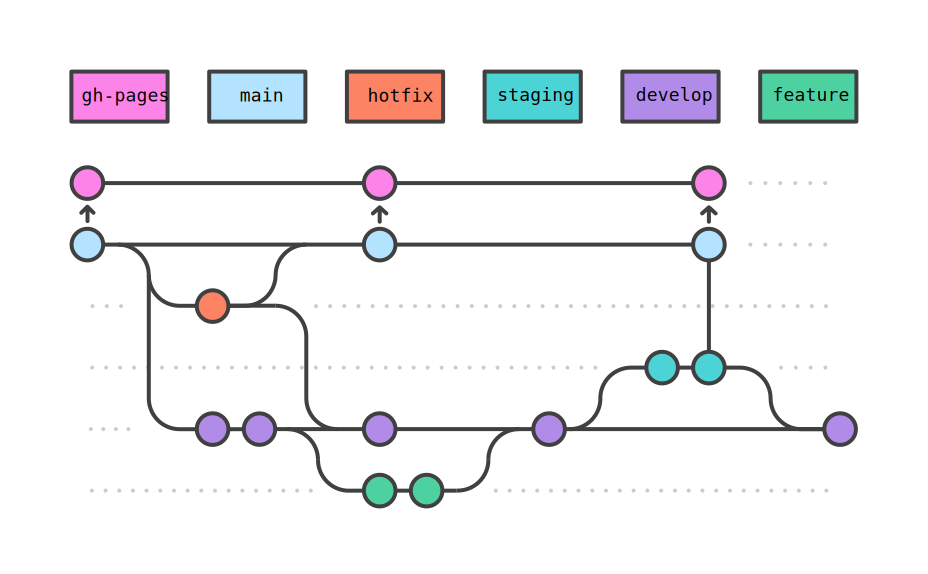

# Tufts University Research Technology Guides

[![][website-badge]][website-url]&nbsp;
[![][workflow-badge]](../../actions/workflows/build.yml)&nbsp;
[![][commit-badge]](../../commits/main)

Source repository for end user documentation developed by the Research Technology department at Tufts University.

⚠️ **Please see the [published website][website-url] for content.** The following is a development guide intended for staff.

## Repository Overview

Documentation is built from source files using [Sphinx][sphinx-url] and the [PyData Sphinx Theme][theme-url] with content structure managed by the [Sphinx External ToC][toc-url] extension. Key repository contents are as follows:

- `/.github/workflows/build.yml` -- action to automatically build and deploy documentation
- `/environment.yml` -- build environment specification
- `/img/` -- images used in the README
- `/source/_ext/` -- custom Sphinx extensions
- `/source/_static/` -- static HTML content like the website logo and favicon
- `/source/_templates/` -- custom [Jinja][jinja-url] templates including new templates and default overrides
- `/source/_toc.yml` -- [Sphinx External ToC][toc-url] site-map structure configuration file
- `/source/404.md` -- custom 404 page template
- `/source/conf.py` -- [Sphinx][sphinx-url] configuration file
- `/source/index.md` -- documentation/webiste root (default landing page)

All other contents of `source` define the documentation structure and content, with the directory tree corresponding to the site map and files serving as content sources. See corresponding sections below for more information.

The build process generates the following git-ignored directories that should not be manually modified:

- `/buid/` -- all build artifacts
- `/jupyter_execute/` -- executed Jupyter Notebooks derived from source files
- `/source/tags/` -- automatically generated source files for the tags index

## Branching Structure and Workflow

The repository follows a simplified derivative of the [Gitflow](https://www.atlassian.com/git/tutorials/comparing-workflows/gitflow-workflow) workflow with all active development confined to the `develop` branch and designated feature branches (recommended). Documentation is automatically built from the `main` branch and contributions to the `main` branch are only allowed via pull request. HTML build artifacts are stored and served from the `gh-pages` branch. An optional `staging` branch can be used for final review of content before merging to `main`, allowing active development to continuos on the `develop` branch. A designated `hotfix` branch should be used for urgent updates and fixes if needed. See below for a sample schematic of all branches.



## Environment Setup

Clone the repository and create the build environment using `mamba` or `conda` and the provided configuration file. Install and configure [Miniforge](https://github.com/conda-forge/miniforge) if you do not already have a Conda distribution present on your system.

```bash
mamba env install --file environment.yml
```

```bash
conda env install --file environment.yml
```

Remember to activate the environment before proceeding.

```bash
conda activate guides
```

## Local Development Builds

Local development builds can either be triggered manually via the `sphinx-build` command or automatically by using [`sphinx-autobuild`](https://github.com/executablebooks/sphinx-autobuild). The latter continuously scans source files for changes and displays an up-to-date HTML preview using a local web server. Note that URLs relative to the content root will be broken in local builds.

### Automatic Build

The `/source/tags/` directory must be ignored during the automatic build process as its contents are regenerated at the start of every build, which would otherwise result in a continuous rebuild loop.

```bash
sphinx-autobuild source build --ignore */tags/*
```

Navigate to http://127.0.0.1:8000 to display the live-updated HTML preview.

### Manual Build

```bash
sphinx-build source build
```

Open the `/build/index.html` file to display the generated HTML landing page.

### Ensuring a Clean Build

The build process creates various cached artifacts resulting in subsequent builds only updating pages for which the source files have been updated. This results in changes to the documentation configuration, structure, or extensions not being reflected unless all cached artifacts are removed. A clean build is also required in the case of updated tags and to ensure any executable code is re-run. Results of executable code are cached and code is not re-run by default unless changes to the code are detected. To ensure a clean buiild, the `build`, `jupyter_execute`, and `source/tags` directories should be removed. See below for sample commands.

#### Bash and Zsh

```bash Bash
rm -r build && rm -r jupyter_execute && rm -r source/tags
```
#### PowerShell

```powershell
Remove-Item build,source/tags,jupyter_execute -Recurse
```
#### Command Prompt

```bat
RMDIR /S /Q build && RMDIR /S /Q jupyter_execute && RMDIR /S /Q source/tags
```

## Structure Configuration

Documentation structure is managed by the [Sphinx External ToC][toc-url] extension and defined by the `/source/_toc.yml` file along with the [natural sort order](https://en.wikipedia.org/wiki/Natural_sort_order) of content source file names. Content is grouped into primary sections with each section appearing in the top navigation bar and having an index file serving as the section root. Primary sections contain content pages which can be further divided into subtrees. Content pages could also have child pages, in which case their structure resembles that of a primary section with an index file serving as the parent page.

```
📂source
 ┣ 📄index
 ┗ 📂primary-section
    ┣ 📄index
    ┣ 📄01-content-page
    ┣ 📄02-content-page
    ┣ 📂10-page-with-children
    ┃  ┣ 📄index
    ┃  ┣ 📄11-child-page
    ┃  ┗ 📄12-child-page
    ┣ 📄21-content-page
    ┣ 📄22-content-page
    ┗ 📂30-section-subtree
       ┣ 📄31-subtree-page
       ┗ 📄32-subtree-page
```

The following `/source/_toc.yml` file ensures that the built documentation is structured identically to the directory tree above. Files within each section or subtree are defined via glob pattern and sorted by filename natural order, allowing seamless addition of content to predefined sections without the need to modify the structure configuration file. Only when adding a new section, subtree, or parent page does the `_toc.yml` file need to be updated. The `title` field defines how the name of a primary section is displayed in the navigation bar and the `caption` field defines how the name of a subtree is displayed in the ToC. Content page display names are equivalent to their first-level heading.

```yml
root: index
subtrees:
  - caption: Primary Section Display Name in ToC
    entries:
      - file: primary-section/index
        title: Primary Section Display Name in Navigation
        subtrees:
          - entries:
            - glob: primary-section/0*
            - file: primary-section/10-page-with-children/index
              entries:
                - glob: primary-section/10-page-with-children/*
            - glob: primary-section/2*
            - caption: Section Subtree Display Name
              entries:
              - glob: primary-section/30-section-subtree/*

```

## Subject Tags

Tags can be defined using the `tags` field in the file-wide metadata. The field content must be a single string representing a space-delimited list of tags. Tags can only contain lowercase letters, numbers, and hyphens.

### Markdown/Rmd

Tags can be defined in the YAML metadata header of the file as follows.

```yml
---
tags: tag tag2 another-tag
---
```

### reStructuredText

Tags can be specified in the metadata field list at the top of the file as follows.

```rst
:tags: tag tag2 another-tag
```

### Jupyter Notebook

Tags can be added to the notebook metadata JSON as follows. The metadata JSON can be accessed via the Property Inspector in the top-right of the JupyterLab interface (gear icon) or by opening the notebook as a text document and locating the `"metadata"` field (located after the `"cells"` field) in the notebook JSON.

```json
{
    "tags": "tag tag2 another-tag"
}
```

<!----------------------------------------------------------------------------->

[jinja-url]: https://jinja.palletsprojects.com
[commit-badge]: https://img.shields.io/github/last-commit/tuftsrt/guides
[sphinx-url]: https://www.sphinx-doc.org
[theme-url]: https://pydata-sphinx-theme.readthedocs.io
[toc-url]: https://sphinx-external-toc.readthedocs.io
[website-badge]: https://img.shields.io/website?url=https://tuftsrt.github.io/guides/
[website-url]: https://tuftsrt.github.io/guides/
[workflow-badge]: https://img.shields.io/github/actions/workflow/status/tuftsrt/guides/build.yml
