# Data Manipulation and Visualization

-   author: Uku-Kaspar Uustalu
-   date: March 6, 2024

## Installing and Attaching Packages

We will be using `librarian` for package management as it greatly
simplifies the process of installing and attaching packages. It needs to
be installed using `install.packages()` unless already installed.

``` r
install.packages("librarian")
install.packages("knitr")
```

The `librarian::shelf()` function checks whether all listed packages are
installed and installs them if needed. Then it loads all listed packages
into the environment. You can think of it as a combination of
`install.packages()` and `library()` except it will not re-install a
package if it is already installed. Here are the packages we will be
using:

-   `readr` is a tidyverse package that allows for fast reading and
    writing of rectangular text data
-   `janitor` is a package commonly used to clean messy data and quickly
    format column names
-   `dplyr` is a tidyverse package allowing for easy data manipulation
    and variable grouping
-   `magrittr` is a tidyverse package that offers a set of operators
    useful for constructing pipelines
-   `tidyr` is a tidyverse package intended for data restructuring with
    the goal of achieving tidy data
-   `tidyselect` is a tidyverse package that allows for the easy
    selection of columns based on criteria
-   `ggplot2` is a tidyverse package and arguably the most popular R
    data visualization package
-   `plotly` allows for the easy generation of various interactive data
    visualizations including maps
-   `gganimate` and `gifski` can be used to generate and export various
    animated visualizations

``` r
knitr::opts_chunk$set(
  echo=TRUE,
  dpi=600,
  fig.width = 12
)

librarian::shelf(readr, janitor, dplyr, magrittr, tidyr, tidyselect, ggplot2,
                 plotly, gganimate, gifski)
```

# Reading and Cleaning Data

We will be using the following data files from the `data` directory to
investigate the relationship between health and wealth:

-   `gdp.csv` – World Bank gross domestic product (GDP) estimates (in
    USD) from 1960 until 2022
-   `life-expectancy.csv` – World Bank life expectancy at birth
    estimates from 1960 until 2021
-   `m49.csv` – United Nations
    [M49](https://en.wikipedia.org/wiki/UN_M49) Standard Country or Area
    Codes for Statistical Use
-   `population.csv` – World Bank country and region population
    estimates from 1960 until 2022

All the data are in [IEFT RFC 4180
CSV](https://www.rfc-editor.org/info/rfc4180) (comma-separated values)
format and the first four rows of the World Bank data files contain
metadata with the actual data table starting on row five.

Let us start with the population data. CSV data files can be easily read
in using the `readr::read_csv()` function. The function reads the
contents of the file into a `tibble` object (which is basically an
advanced data frame) and supports various additional arguments. For
example, we can utilize the `skip` argument to skip the first four rows
of the CSV file as the data table does not start until row five.

``` r
population <- readr::read_csv(file = "r_data_dataviz/population.csv",
                              skip = 4,
                              show_col_types = FALSE)
```

Upon file read, the function outputs a summary outlining the column
names and types of the data by default. This can be silenced by
specifying `show_col_types=FALSE` when calling the function.

Now the World Bank population data is stored in a `tibble` named
`population`. Calling the name of the variable will display the data in
a neat interactive table viewer.

``` r
population
```

    ## # A tibble: 266 × 67
    ##    `Country Name` `Country Code` `Indicator Name` `Indicator Code` `1960` `1961`
    ##    <chr>          <chr>          <chr>            <chr>             <dbl>  <dbl>
    ##  1 Aruba          ABW            Population, tot… SP.POP.TOTL      5.46e4 5.58e4
    ##  2 Africa Easter… AFE            Population, tot… SP.POP.TOTL      1.31e8 1.34e8
    ##  3 Afghanistan    AFG            Population, tot… SP.POP.TOTL      8.62e6 8.79e6
    ##  4 Africa Wester… AFW            Population, tot… SP.POP.TOTL      9.73e7 9.93e7
    ##  5 Angola         AGO            Population, tot… SP.POP.TOTL      5.36e6 5.44e6
    ##  6 Albania        ALB            Population, tot… SP.POP.TOTL      1.61e6 1.66e6
    ##  7 Andorra        AND            Population, tot… SP.POP.TOTL      9.44e3 1.02e4
    ##  8 Arab World     ARB            Population, tot… SP.POP.TOTL      9.34e7 9.58e7
    ##  9 United Arab E… ARE            Population, tot… SP.POP.TOTL      1.33e5 1.41e5
    ## 10 Argentina      ARG            Population, tot… SP.POP.TOTL      2.03e7 2.07e7
    ## # ℹ 256 more rows
    ## # ℹ 61 more variables: `1962` <dbl>, `1963` <dbl>, `1964` <dbl>, `1965` <dbl>,
    ## #   `1966` <dbl>, `1967` <dbl>, `1968` <dbl>, `1969` <dbl>, `1970` <dbl>,
    ## #   `1971` <dbl>, `1972` <dbl>, `1973` <dbl>, `1974` <dbl>, `1975` <dbl>,
    ## #   `1976` <dbl>, `1977` <dbl>, `1978` <dbl>, `1979` <dbl>, `1980` <dbl>,
    ## #   `1981` <dbl>, `1982` <dbl>, `1983` <dbl>, `1984` <dbl>, `1985` <dbl>,
    ## #   `1986` <dbl>, `1987` <dbl>, `1988` <dbl>, `1989` <dbl>, `1990` <dbl>, …

We see that the `tibble` appears to have the following columns:

-   `Country Name` – English name of the country
-   `Country Code` – [ISO 3166-1
    alpha-3](https://en.wikipedia.org/wiki/ISO_3166-1_alpha-3) country
    code
-   `Indicator Name` – name of the indicator represented by the data
-   `Indicator Code` – World Bank code for the indicator
-   `1960` … `2022` – population estimates by year

We also see that the table has 266 rows and 67 columns. The number of
rows and columns of a `tibble` or other data-frame-like object can also
be programmatically extracted by calling the `dim()` function.

``` r
dim(population)
```

    ## [1] 266  67

The list of column names can be programmatically extracted via the
`names()` function.

``` r
names(population)
```

    ##  [1] "Country Name"   "Country Code"   "Indicator Name" "Indicator Code"
    ##  [5] "1960"           "1961"           "1962"           "1963"          
    ##  [9] "1964"           "1965"           "1966"           "1967"          
    ## [13] "1968"           "1969"           "1970"           "1971"          
    ## [17] "1972"           "1973"           "1974"           "1975"          
    ## [21] "1976"           "1977"           "1978"           "1979"          
    ## [25] "1980"           "1981"           "1982"           "1983"          
    ## [29] "1984"           "1985"           "1986"           "1987"          
    ## [33] "1988"           "1989"           "1990"           "1991"          
    ## [37] "1992"           "1993"           "1994"           "1995"          
    ## [41] "1996"           "1997"           "1998"           "1999"          
    ## [45] "2000"           "2001"           "2002"           "2003"          
    ## [49] "2004"           "2005"           "2006"           "2007"          
    ## [53] "2008"           "2009"           "2010"           "2011"          
    ## [57] "2012"           "2013"           "2014"           "2015"          
    ## [61] "2016"           "2017"           "2018"           "2019"          
    ## [65] "2020"           "2021"           "2022"

Note how the first four column names contain a space and the rest of the
column names are all numbers. This is bad practice as various functions
do not work well with column names that either contain a space or start
with a number. It is common to replace all spaces with either periods or
underscores and add a letter prefix to any column names consisting
solely of numbers.

This can be easily achieved by using the `janitor::clean_names()`
function, which takes the original table as input and outputs a new
table where the column names have been properly formatted.

``` r
population <- janitor::clean_names(population)
names(population)
```

    ##  [1] "country_name"   "country_code"   "indicator_name" "indicator_code"
    ##  [5] "x1960"          "x1961"          "x1962"          "x1963"         
    ##  [9] "x1964"          "x1965"          "x1966"          "x1967"         
    ## [13] "x1968"          "x1969"          "x1970"          "x1971"         
    ## [17] "x1972"          "x1973"          "x1974"          "x1975"         
    ## [21] "x1976"          "x1977"          "x1978"          "x1979"         
    ## [25] "x1980"          "x1981"          "x1982"          "x1983"         
    ## [29] "x1984"          "x1985"          "x1986"          "x1987"         
    ## [33] "x1988"          "x1989"          "x1990"          "x1991"         
    ## [37] "x1992"          "x1993"          "x1994"          "x1995"         
    ## [41] "x1996"          "x1997"          "x1998"          "x1999"         
    ## [45] "x2000"          "x2001"          "x2002"          "x2003"         
    ## [49] "x2004"          "x2005"          "x2006"          "x2007"         
    ## [53] "x2008"          "x2009"          "x2010"          "x2011"         
    ## [57] "x2012"          "x2013"          "x2014"          "x2015"         
    ## [61] "x2016"          "x2017"          "x2018"          "x2019"         
    ## [65] "x2020"          "x2021"          "x2022"

We know that the `population` table stores population values, so the
columns `indicator_name` and `indicator_code` are redundant. These can
be dropped using the `dplyr::select()` function. The first argument to
the function is the table variable itself and following arguments
specify which columns to keep or drop. For example, explicitly
specifying a column name will result in only the listed column being
selected and adding a minus sign in front will reverse the selection,
meaning any specified column name preceded with a minus sign will cause
it to be dropped and all remaining columns to be selected.

The output is a new table with the specified selection applied. There
are numerous different ways one can select columns using
`dplyr::select()`. For example, one could use a `tidyselect` function to
select a set of columns based on a criterion. Refer to the function
documentation for more information.

``` r
population <- dplyr::select(population, -indicator_name, -indicator_code)
```

We can validate that the desired columns have been removed by either
listing the column names via the `names()` function again or taking a
quick peek at the table using the `head()` function. It displays the
first six rows of the table by default, but a this can be changed by
specifying the `n` argument.

``` r
head(population)
```

    ## # A tibble: 6 × 65
    ##   country_name     country_code  x1960  x1961  x1962  x1963  x1964  x1965  x1966
    ##   <chr>            <chr>         <dbl>  <dbl>  <dbl>  <dbl>  <dbl>  <dbl>  <dbl>
    ## 1 Aruba            ABW          5.46e4 5.58e4 5.67e4 5.75e4 5.82e4 5.88e4 5.93e4
    ## 2 Africa Eastern … AFE          1.31e8 1.34e8 1.38e8 1.42e8 1.46e8 1.50e8 1.54e8
    ## 3 Afghanistan      AFG          8.62e6 8.79e6 8.97e6 9.16e6 9.36e6 9.57e6 9.78e6
    ## 4 Africa Western … AFW          9.73e7 9.93e7 1.01e8 1.04e8 1.06e8 1.08e8 1.11e8
    ## 5 Angola           AGO          5.36e6 5.44e6 5.52e6 5.60e6 5.67e6 5.74e6 5.79e6
    ## 6 Albania          ALB          1.61e6 1.66e6 1.71e6 1.76e6 1.81e6 1.86e6 1.91e6
    ## # ℹ 56 more variables: x1967 <dbl>, x1968 <dbl>, x1969 <dbl>, x1970 <dbl>,
    ## #   x1971 <dbl>, x1972 <dbl>, x1973 <dbl>, x1974 <dbl>, x1975 <dbl>,
    ## #   x1976 <dbl>, x1977 <dbl>, x1978 <dbl>, x1979 <dbl>, x1980 <dbl>,
    ## #   x1981 <dbl>, x1982 <dbl>, x1983 <dbl>, x1984 <dbl>, x1985 <dbl>,
    ## #   x1986 <dbl>, x1987 <dbl>, x1988 <dbl>, x1989 <dbl>, x1990 <dbl>,
    ## #   x1991 <dbl>, x1992 <dbl>, x1993 <dbl>, x1994 <dbl>, x1995 <dbl>,
    ## #   x1996 <dbl>, x1997 <dbl>, x1998 <dbl>, x1999 <dbl>, x2000 <dbl>, …

Knowing that the World Bank GDP data follows the exact same format as
the World Bank population data , we can read the CSV file, clean the
column names, and drop the unneeded columns all in one go by combining
the `readr::read_csv()`, `janitor::clean_names()`, and `dplyr::select()`
functions using the forward pipe operator `%>%` from the `magrittr`
package. The `%>%` operator takes either a variable or the output of a
function and feeds it into the following function as its first argument.

``` r
gdp <- readr::read_csv(file = "r_data_dataviz/gdp.csv",
                       skip = 4,
                       show_col_types = FALSE) %>%
    janitor::clean_names() %>%
    dplyr::select(-indicator_name, -indicator_code)
```

In the pipeline above, the `tibble` outputted by the `readr::read_csv()`
function gets piped into the `janitor::clean_names()` function, the
output of which gets passed into the `dplyr::select()` function. The
output of the final function is saved into the variable `gdp`. The
`head()` function can be used to take a quick look at the new table and
ensure the constructed pipeline worked as expected.

``` r
head(gdp)
```

    ## # A tibble: 6 × 65
    ##   country_name         country_code    x1960    x1961    x1962    x1963    x1964
    ##   <chr>                <chr>           <dbl>    <dbl>    <dbl>    <dbl>    <dbl>
    ## 1 Aruba                ABW          NA       NA       NA       NA       NA      
    ## 2 Africa Eastern and … AFE           1.85e10  1.94e10  2.05e10  2.22e10  2.43e10
    ## 3 Afghanistan          AFG           5.38e 8  5.49e 8  5.47e 8  7.51e 8  8.00e 8
    ## 4 Africa Western and … AFW           1.04e10  1.11e10  1.20e10  1.27e10  1.38e10
    ## 5 Angola               AGO          NA       NA       NA       NA       NA      
    ## 6 Albania              ALB          NA       NA       NA       NA       NA      
    ## # ℹ 58 more variables: x1965 <dbl>, x1966 <dbl>, x1967 <dbl>, x1968 <dbl>,
    ## #   x1969 <dbl>, x1970 <dbl>, x1971 <dbl>, x1972 <dbl>, x1973 <dbl>,
    ## #   x1974 <dbl>, x1975 <dbl>, x1976 <dbl>, x1977 <dbl>, x1978 <dbl>,
    ## #   x1979 <dbl>, x1980 <dbl>, x1981 <dbl>, x1982 <dbl>, x1983 <dbl>,
    ## #   x1984 <dbl>, x1985 <dbl>, x1986 <dbl>, x1987 <dbl>, x1988 <dbl>,
    ## #   x1989 <dbl>, x1990 <dbl>, x1991 <dbl>, x1992 <dbl>, x1993 <dbl>,
    ## #   x1994 <dbl>, x1995 <dbl>, x1996 <dbl>, x1997 <dbl>, x1998 <dbl>, …

## Long vs Wide Data

GDP on its own is not a good indicator of the wealth of a country as
countries with more people tend to have higher GDP. But if we were to
normalize GDP by population, then the resulting GDP per capita values
can be compared across countries and used as a proxy for wealth. To do
so, we must be able to match up the GDP and population values for each
unique combination of country and year.

The GDP and population tables are currently in wide format – each row
represents a unique country and each column represents a unique year
with the cell values representing GDP or population estimates. While
this wide format has many advantages and is commonly used in geospatial
applications, it does complicate joining various data sets. One option
would be to treat both tables as matrices and calculate GDP per capita
by dividing the GDP matrix with the population matrix. However, both
tables need to have the exact same layout with the same number of
countries and years in the same exact order for this to work and the
result to be reliable. Ensuring this is not a trivial task, so this
method would involve a lot of work to produce reliable results.

Alternatively the two tables could be joined by country. Then we will
have an extra-wide table with two sets of year columns – one set of year
columns for population and another set of year columns for GDP. Then we
would need to create another new column for each year by dividing the
corresponding GDP column with the corresponding population column,
resulting in another new set of year columns. As you can see, this
approach would quickly lead to a very messy and difficult to manage
table and would also involve a lot of work, making it far from
preferred.

The easiest option for calculating GDP per capita would involve
converting both data tables into a long format, where each row
represents a single unique observation (estimation). Instead of having
countries in rows and years in columns, each row would instead represent
a unique country and year combination. This would allow us to easily
combine data on both country and year, ensuring that the population and
GDP values for each country-year combination get matched appropriately.

We can use the `tidyr::pivot_longer()` function to covert wide format
tables into long format tables. The following arguments are of interest
to us when calling the function:

-   `data` – the `tibble` object to convert from wide to long format
-   `cols` – the columns to pivot into longer format (the columns
    containing the data values)
-   `names_to` – name of the column in the long table that stores the
    column names from the wide table
-   `names_prefix` – the prefix to remove from the specified wide table
    column names (if any)
-   `values_to` – name of the column in the long table that sores the
    data values from the wide table

The columns we would like to convert to long format are the year
columns. These are all prefixed with an `x` character. We can use the
`tidyselect::starts_with()` function to select all the columns beginning
with an `x` character and pass those as the `cols` argument. The column
names should be stripped of the preceding `x` character, so we pass that
as the `names_prefix` argument. The stripped column names represent
years and the cell values represent population represent population
estimates, so finally we specify `names_to = "year"` and
`values_to = "population"` as the final arguments.

``` r
population_long <- tidyr::pivot_longer(data = population,
                                       cols = tidyselect::starts_with("x"),
                                       names_to = "year",
                                       names_prefix = "x",
                                       values_to = "population")
population_long
```

    ## # A tibble: 16,758 × 4
    ##    country_name country_code year  population
    ##    <chr>        <chr>        <chr>      <dbl>
    ##  1 Aruba        ABW          1960       54608
    ##  2 Aruba        ABW          1961       55811
    ##  3 Aruba        ABW          1962       56682
    ##  4 Aruba        ABW          1963       57475
    ##  5 Aruba        ABW          1964       58178
    ##  6 Aruba        ABW          1965       58782
    ##  7 Aruba        ABW          1966       59291
    ##  8 Aruba        ABW          1967       59522
    ##  9 Aruba        ABW          1968       59471
    ## 10 Aruba        ABW          1969       59330
    ## # ℹ 16,748 more rows

Now we have a new long population `tibble` called `population_long`,
where each row represents a unique country and year combination. But
note how the data type of the `year` column appears to be listed as
`chr`, implying that the data is in textual `character` format instead
of numbers. Let us confirm this by extracting the column using the `$`
operator and checking its data type via the `class()` function.

``` r
class(population_long$year)
```

    ## [1] "character"

The `dplyr::mutate()` function can be combined with the base
`as.integer()` function to convert the `year` column back into numeric
format. The first argument of the `dpylr::mutate()` function is the data
table and subsequent arguments specify how to create new columns or
modify existing columns.

For example, to apply the `as.integer()` function on the whole `year`
column and then replace the `year` column with the new values, we would
specify `year = as.integer(year)` as an argument.

``` r
population_long <- dplyr::mutate(population_long,
                                 year = as.integer(year))
class(population_long$year)
```

    ## [1] "integer"

Note how now the data type of the `year` column is listed as `int` or
`integer`, meaning it is numeric.

Now let us convert the GDP table into long format as well. As with the
population table, we will first need to use `tidyr::pivot_longer()` to
pivot the table and then `as.numeric()` with `dplyr::mutate()` to fix
the data type of the `year` column. These can be combined into a
pipeline using the `%>%` operator.

``` r
gdp_long <- gdp %>%
    tidyr::pivot_longer(cols = tidyselect::starts_with("x"),
                        names_to = "year",
                        names_prefix = "x",
                        values_to = "gdp") %>%
    dplyr::mutate(year = as.integer(year))

gdp_long
```

    ## # A tibble: 16,758 × 4
    ##    country_name country_code  year   gdp
    ##    <chr>        <chr>        <int> <dbl>
    ##  1 Aruba        ABW           1960    NA
    ##  2 Aruba        ABW           1961    NA
    ##  3 Aruba        ABW           1962    NA
    ##  4 Aruba        ABW           1963    NA
    ##  5 Aruba        ABW           1964    NA
    ##  6 Aruba        ABW           1965    NA
    ##  7 Aruba        ABW           1966    NA
    ##  8 Aruba        ABW           1967    NA
    ##  9 Aruba        ABW           1968    NA
    ## 10 Aruba        ABW           1969    NA
    ## # ℹ 16,748 more rows

# Joining Tables

Finally we are ready to combine the population and GDP tables. The
`dplyr` package has four different join functions we could utilize:

-   `left_join()` – include all rows from the left table and only
    matching rows from the right table
-   `right_join()` – include all rows from the right table and only
    matching tows from the left table
-   `full_join()` – include all rows from both tables regardless of
    whether they have a match
-   `inner_join()` – only include rows from both tables that have
    matches in the other table

All the aforementioned functions require at least three arguments:

-   `x` – the left table
-   `y` – the right table
-   `by` – the column(s) to join on

We would like to join on each unique country and year combination. As
spellings of country names might differ between tables, it is good
practice to always use the [ISO 3166-1
alpha-3](https://en.wikipedia.org/wiki/ISO_3166-1_alpha-3) country code
or some other analogous unique identifier to distinguish between
countries. The country code for each country is determined by an
international standard and should not differ between tables, allowing us
to reliably join the data. Hence we will specify
`by = c("country_code", "year")` to perform the join on unique
country-year combinations using the `dplyr::inner_join()` function to
only keep country-year combinations that are present in both tables.

``` r
data <- dplyr::inner_join(x = population_long,
                          y = gdp_long,
                          by = c("country_code", "year"))
head(data)
```

    ## # A tibble: 6 × 6
    ##   country_name.x country_code  year population country_name.y   gdp
    ##   <chr>          <chr>        <int>      <dbl> <chr>          <dbl>
    ## 1 Aruba          ABW           1960      54608 Aruba             NA
    ## 2 Aruba          ABW           1961      55811 Aruba             NA
    ## 3 Aruba          ABW           1962      56682 Aruba             NA
    ## 4 Aruba          ABW           1963      57475 Aruba             NA
    ## 5 Aruba          ABW           1964      58178 Aruba             NA
    ## 6 Aruba          ABW           1965      58782 Aruba             NA

Note how now the data are joined but the resulting table has two
different `country_name` columns. That is because this column was
present in both of the joined tables and was not omitted before the
join. We can use the `dplyr::select()` to drop one of the columns by
adding a minus sign in front of its name and rename the other one using
the `new_name = old_name` convention. Then we can use `dplyr::mutate()`
to add a new `gdp_per_capita` column by dividing the `gdp` column with
the `population` column. We can combine these two operations into a
pipeline using the `%>%` operator.

``` r
data <- data %>%
    dplyr::select(-country_name.y,
                  country_name = country_name.x) %>%
    dplyr::mutate(gdp_per_capita = gdp / population)

print(data)
```

    ## # A tibble: 16,758 × 6
    ##    country_name country_code  year population   gdp gdp_per_capita
    ##    <chr>        <chr>        <int>      <dbl> <dbl>          <dbl>
    ##  1 Aruba        ABW           1960      54608    NA             NA
    ##  2 Aruba        ABW           1961      55811    NA             NA
    ##  3 Aruba        ABW           1962      56682    NA             NA
    ##  4 Aruba        ABW           1963      57475    NA             NA
    ##  5 Aruba        ABW           1964      58178    NA             NA
    ##  6 Aruba        ABW           1965      58782    NA             NA
    ##  7 Aruba        ABW           1966      59291    NA             NA
    ##  8 Aruba        ABW           1967      59522    NA             NA
    ##  9 Aruba        ABW           1968      59471    NA             NA
    ## 10 Aruba        ABW           1969      59330    NA             NA
    ## # ℹ 16,748 more rows

## Defining Functions

Now we would also like to add life expectancy information to this joined
table. Knowing that all World Bank data tables follow the same format,
we can easily convert the workflow from before into a function that
reads in a World Bank data table, drops unneeded columns, converts it to
long format, and ensures the year is in numeric format. That function
would only need two inputs – the path of the CSV file and the name of
the indicator represented by the data. (This name will be used as the
column name for the values column in the long format table.) Let us
define this function and use it to read in the World Bank life
expectancy table and convert it to long format.

``` r
read_world_bank_data <- function(file_path, variable_name) {
    readr::read_csv(file_path,
                    skip = 4,
                    show_col_types = FALSE) %>%
        janitor::clean_names() %>%
        dplyr::select(-indicator_name,
                      -indicator_code) %>%
        tidyr::pivot_longer(cols = starts_with("x"),
                            names_to = "year",
                            names_prefix = "x",
                            values_to = variable_name) %>%
        dplyr::mutate(year = as.integer(year)) %>%
        return()
}
```

``` r
life_expectancy <- read_world_bank_data("r_data_dataviz/life-expectancy.csv",
                                        "life_expectancy")
head(life_expectancy)
```

    ## # A tibble: 6 × 4
    ##   country_name country_code  year life_expectancy
    ##   <chr>        <chr>        <int>           <dbl>
    ## 1 Aruba        ABW           1960            64.2
    ## 2 Aruba        ABW           1961            64.5
    ## 3 Aruba        ABW           1962            64.8
    ## 4 Aruba        ABW           1963            65.1
    ## 5 Aruba        ABW           1964            65.3
    ## 6 Aruba        ABW           1965            65.5

Now we can use a pipeline to drop the redundant `country_name` column
and then join the life expectancy table with the rest of our data.
Remember that the output of the last function in a pipeline is specified
as the first argument of the following function by default. We can
override this by referring to the output of the previous function as `.`
and specifying it elsewhere int the following function call.

``` r
data <- life_expectancy %>%
    dplyr::select(-country_name) %>%
    dplyr::inner_join(x = data,
                      y = .,
                      by = c("country_code", "year"))
data
```

    ## # A tibble: 16,758 × 7
    ##    country_name country_code  year population   gdp gdp_per_capita
    ##    <chr>        <chr>        <int>      <dbl> <dbl>          <dbl>
    ##  1 Aruba        ABW           1960      54608    NA             NA
    ##  2 Aruba        ABW           1961      55811    NA             NA
    ##  3 Aruba        ABW           1962      56682    NA             NA
    ##  4 Aruba        ABW           1963      57475    NA             NA
    ##  5 Aruba        ABW           1964      58178    NA             NA
    ##  6 Aruba        ABW           1965      58782    NA             NA
    ##  7 Aruba        ABW           1966      59291    NA             NA
    ##  8 Aruba        ABW           1967      59522    NA             NA
    ##  9 Aruba        ABW           1968      59471    NA             NA
    ## 10 Aruba        ABW           1969      59330    NA             NA
    ## # ℹ 16,748 more rows
    ## # ℹ 1 more variable: life_expectancy <dbl>

Finally we would also like to know which [United Nations regional
geoscheme](https://en.wikipedia.org/wiki/United_Nations_geoscheme) the
country belongs to. Information on this is available in the United
Nations [M49](https://en.wikipedia.org/wiki/UN_M49) table. We can
utilize a pipeline to read in and clean the table all in one go. Note
that as this is a standard CSV table, there is no need to skip any rows.

``` r
m49 <- readr::read_csv(file = "r_data_dataviz/m49.csv",
                       show_col_types = FALSE) %>%
    janitor::clean_names()

head(m49)
```

    ## # A tibble: 6 × 15
    ##   global_code global_name region_code region_name sub_region_code
    ##   <chr>       <chr>       <chr>       <chr>       <chr>          
    ## 1 001         World       002         Africa      015            
    ## 2 001         World       002         Africa      015            
    ## 3 001         World       002         Africa      015            
    ## 4 001         World       002         Africa      015            
    ## 5 001         World       002         Africa      015            
    ## 6 001         World       002         Africa      015            
    ## # ℹ 10 more variables: sub_region_name <chr>, intermediate_region_code <chr>,
    ## #   intermediate_region_name <chr>, country_or_area <chr>, m49_code <chr>,
    ## #   iso_alpha2_code <chr>, iso_alpha3_code <chr>,
    ## #   least_developed_countries_ldc <chr>,
    ## #   land_locked_developing_countries_lldc <chr>,
    ## #   small_island_developing_states_sids <chr>

Note how this table contains a lot of information on the various groups
and codes assigned to each country. We are only interested in the name
of the region the country belongs into and need the [ISO 3166-1
alpha-3](https://en.wikipedia.org/wiki/ISO_3166-1_alpha-3) code assigned
to the country to join the data. Let us use the `%>%` operator to create
a pipeline that selects the desired columns and then performs the join.

``` r
data <- m49 %>%
    dplyr::select(region_name,
                  country_code = iso_alpha3_code) %>%
    dplyr::inner_join(data,
                      by = "country_code") %>%
    dplyr::select(country_name,
                  country_code,
                  region_name,
                  year,
                  tidyselect::everything())
data
```

    ## # A tibble: 13,545 × 8
    ##    country_name country_code region_name  year population     gdp gdp_per_capita
    ##    <chr>        <chr>        <chr>       <int>      <dbl>   <dbl>          <dbl>
    ##  1 Algeria      DZA          Africa       1960   11394307  2.72e9           239.
    ##  2 Algeria      DZA          Africa       1961   11598608  2.43e9           210.
    ##  3 Algeria      DZA          Africa       1962   11778260  2.00e9           170.
    ##  4 Algeria      DZA          Africa       1963   11969451  2.70e9           226.
    ##  5 Algeria      DZA          Africa       1964   12179099  2.91e9           239.
    ##  6 Algeria      DZA          Africa       1965   12381256  3.14e9           253.
    ##  7 Algeria      DZA          Africa       1966   12613389  3.04e9           241.
    ##  8 Algeria      DZA          Africa       1967   12897115  3.37e9           261.
    ##  9 Algeria      DZA          Africa       1968   13190975  3.85e9           292.
    ## 10 Algeria      DZA          Africa       1969   13491016  4.26e9           316.
    ## # ℹ 13,535 more rows
    ## # ℹ 1 more variable: life_expectancy <dbl>

Note how we can use `dplyr::select()` along with
`tidyselect:everything()` to rearrange the order of specified columns.

## Row Filtering and Static Line Graphs

If we wanted to extract data for a specific country, we could utilize
boolean indexing, or we could use the `dplyr::filter()` function, which
behaves similarly, but is more intuitive to use and works well within
pipelines. For example, to extract all data for the United States, we
could combiner `dplyr::filter()` with `country_code == "USA"` to extract
all the rows where the `country_code` column is equal to `"USA"`.

``` r
data %>%
    dplyr::filter(country_code == "USA") %>%
    head()
```

    ## # A tibble: 6 × 8
    ##   country_name  country_code region_name  year population     gdp gdp_per_capita
    ##   <chr>         <chr>        <chr>       <int>      <dbl>   <dbl>          <dbl>
    ## 1 United States USA          Americas     1960  180671000 5.43e11          3007.
    ## 2 United States USA          Americas     1961  183691000 5.63e11          3067.
    ## 3 United States USA          Americas     1962  186538000 6.05e11          3244.
    ## 4 United States USA          Americas     1963  189242000 6.39e11          3375.
    ## 5 United States USA          Americas     1964  191889000 6.86e11          3574.
    ## 6 United States USA          Americas     1965  194303000 7.44e11          3828.
    ## # ℹ 1 more variable: life_expectancy <dbl>

One can also use more complex logical statements within
`dplyr::filter()`. For example, to extract data for all North American
countries, we could use `country_code %in% c("USA", "CAN", "MEX")`. To
confirm this works, we can select all columns that do not depend on the
year from the result and utilize `dplyr::distinct()` to drop all
duplicate rows. The result should be one row for each selected country.

``` r
data %>%
    dplyr::filter(country_code %in% c("USA", "CAN", "MEX")) %>%
    dplyr::select(country_name, country_code, region_name) %>%
    dplyr::distinct()
```

    ## # A tibble: 3 × 3
    ##   country_name  country_code region_name
    ##   <chr>         <chr>        <chr>      
    ## 1 Mexico        MEX          Americas   
    ## 2 Canada        CAN          Americas   
    ## 3 United States USA          Americas

The `dplyr::filter()` function can be piped together with the
`ggplot2::ggplot()` function to easily visualize data for a specific
selection. For example, the life expectancy for the United States over
time could be displayed as follows. Note that we can specify
`na.rm = TRUE` to drop any missing observations before creating the
plot. The visualization would still work otherwise, but we would get
warnings regarding the missing data.

``` r
data %>%
    dplyr::filter(country_code == "USA") %>%
    ggplot2::ggplot(mapping = ggplot2::aes(x = year, y = life_expectancy)) +
    ggplot2::geom_line(na.rm = TRUE)
```

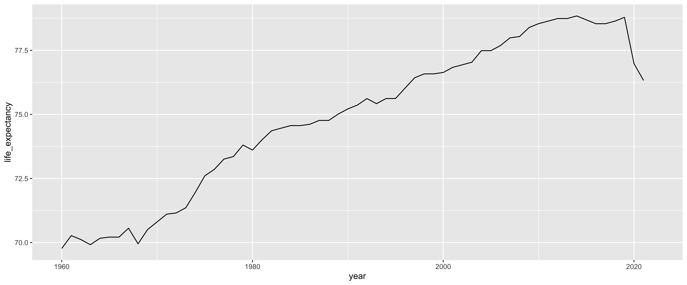

``` r

print(data)
```

    ## # A tibble: 13,545 × 8
    ##    country_name country_code region_name  year population     gdp gdp_per_capita
    ##    <chr>        <chr>        <chr>       <int>      <dbl>   <dbl>          <dbl>
    ##  1 Algeria      DZA          Africa       1960   11394307  2.72e9           239.
    ##  2 Algeria      DZA          Africa       1961   11598608  2.43e9           210.
    ##  3 Algeria      DZA          Africa       1962   11778260  2.00e9           170.
    ##  4 Algeria      DZA          Africa       1963   11969451  2.70e9           226.
    ##  5 Algeria      DZA          Africa       1964   12179099  2.91e9           239.
    ##  6 Algeria      DZA          Africa       1965   12381256  3.14e9           253.
    ##  7 Algeria      DZA          Africa       1966   12613389  3.04e9           241.
    ##  8 Algeria      DZA          Africa       1967   12897115  3.37e9           261.
    ##  9 Algeria      DZA          Africa       1968   13190975  3.85e9           292.
    ## 10 Algeria      DZA          Africa       1969   13491016  4.26e9           316.
    ## # ℹ 13,535 more rows
    ## # ℹ 1 more variable: life_expectancy <dbl>

Following the example above, the GDP per capita growth over time can be
compared across all North American countries as follows.

``` r
data %>%
    dplyr::filter(country_code %in% c("USA", "CAN", "MEX")) %>%
    ggplot2::ggplot(mapping = ggplot2::aes(x = year,
                                           y = gdp_per_capita,
                                           color = country_name)) +
    ggplot2::geom_line()
```

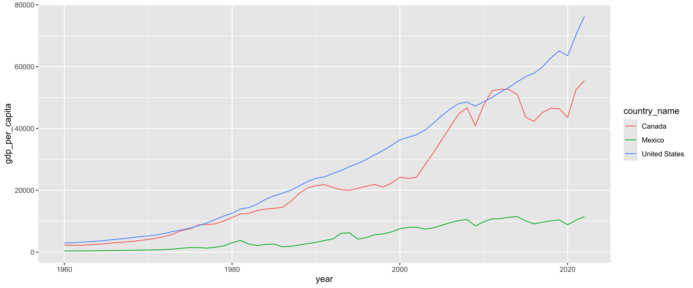

Be careful when using `ggplot2` functions within pipelines as `ggplot2`
functions must be combined using the `+` operator instead of the `%>%`
pipe operator. This is due to overly complicated technical reasons and
just something we have to live with.

## Visualizing Distributions and Correlations

Let us return to our original goal of exploring the relationship between
health and wealth. We will use GDP per capita as a proxy for wealth and
life expectancy as an indicator of health. We can simplify the analysis
by looking only at one point in time and focus our analysis on 2021,
which is the latest year we have both GDP per capita and life expectancy
data available. We can use `dplyr::filter()` to extract all 2021 data
and combine it with `tidyr::drop_na()` to remove any countries that do
not have data for 2021.

``` r
data2021 <- data %>%
    dplyr::filter(year == 2021) %>%
    tidyr::drop_na()

head(data2021)
```

    ## # A tibble: 6 × 8
    ##   country_name  country_code region_name  year population     gdp gdp_per_capita
    ##   <chr>         <chr>        <chr>       <int>      <dbl>   <dbl>          <dbl>
    ## 1 Algeria       DZA          Africa       2021   44177969 1.63e11          3700.
    ## 2 Egypt, Arab … EGY          Africa       2021  109262178 4.25e11          3887.
    ## 3 Libya         LBY          Africa       2021    6735277 3.98e10          5909.
    ## 4 Morocco       MAR          Africa       2021   37076584 1.42e11          3825.
    ## 5 Sudan         SDN          Africa       2021   45657202 3.42e10           750.
    ## 6 Tunisia       TUN          Africa       2021   12262946 4.67e10          3807.
    ## # ℹ 1 more variable: life_expectancy <dbl>

How is wealth distributed among the global population? Let us get a
vague idea by visualizing the distribution of GDP per capita among world
countries in 2021. We can easily create an histogram using `ggplot2` by
defining `data2021` as the data set and specifying that `gdp_per_capita`
should be used for the X axis. Then we add a histogram layer to the
visualization using `ggplot2::geom_histogram()`. The histogram will have
30 bins by default, which is rarely a good number. Use either `bins` to
specify the number of bins or `bindwith` to define the width of each
bin.

``` r
ggplot2::ggplot(data = data2021,
                mapping = ggplot2::aes(x = gdp_per_capita)) +
    ggplot2::geom_histogram(binwidth = 10000)
```

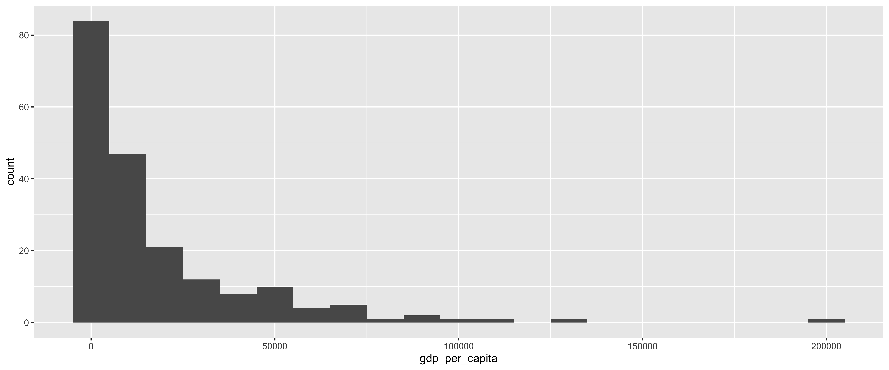

But what about life expectancy? As an alternative to a histogram, we can
create a kernel density estimation (KDE) visualization by following the
same procedure as before but using `ggplot2::geom_density()` instead of
`ggplot2::geom_histogram()`. As KDE is continuous, there is no need to
specify the number or width of bins.

``` r
ggplot2::ggplot(data = data2021,
                mapping = ggplot2::aes(x = life_expectancy)) +
    ggplot2::geom_density()
```

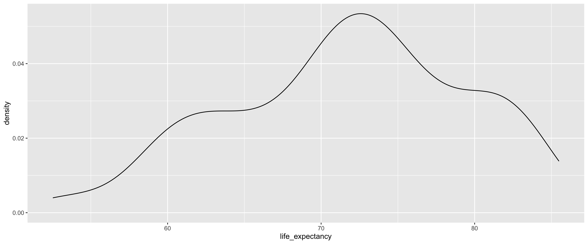

A scatter plot is the best way to investigate the relationship between
two variables and can be easily generated using `ggplot2::geom_point()`.

``` r
ggplot2::ggplot(data = data2021,
                mapping = ggplot2::aes(x = gdp_per_capita,
                                       y = life_expectancy)) +
    ggplot2::geom_point()
```

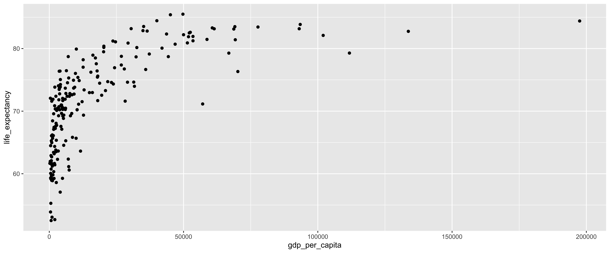

The relationship appears to be logarithmic. This is likely due to the
distribution of GDP per capita being heavily skewed. To make better
sense of this potentially logarithmic the relationship, we should apply
a logarithmic transformation to the axis corresponding to GDP per
capita. In our example this is the X axis and we can apply a logarithmic
transformation on the X axis by adding `ggplot2::scale_x_log10()` to the
plot call.

``` r
ggplot2::ggplot(data = data2021,
                mapping = ggplot2::aes(x = gdp_per_capita,
                                       y = life_expectancy)) +
    ggplot2::geom_point() +
    ggplot2::scale_x_log10()
```


As a scatter plot alternative, we could also create a two-dimensional
kernel density estimate (KDE) surface to get an even better
understanding of the data distribution and any potential relationship.
This can be done by replacing the `ggplot2::geom_point()` function call
with either `ggplot2::geom_density_2d()` for simple contour lines or
`ggplot2::geom_density_2d_filled()` for a beautiful color gradient
surface.

``` r
ggplot2::ggplot(data = data2021,
                mapping = ggplot2::aes(x = gdp_per_capita,
                                       y = life_expectancy)) +
    ggplot2::geom_density2d_filled() +
    ggplot2::scale_x_log10()
```

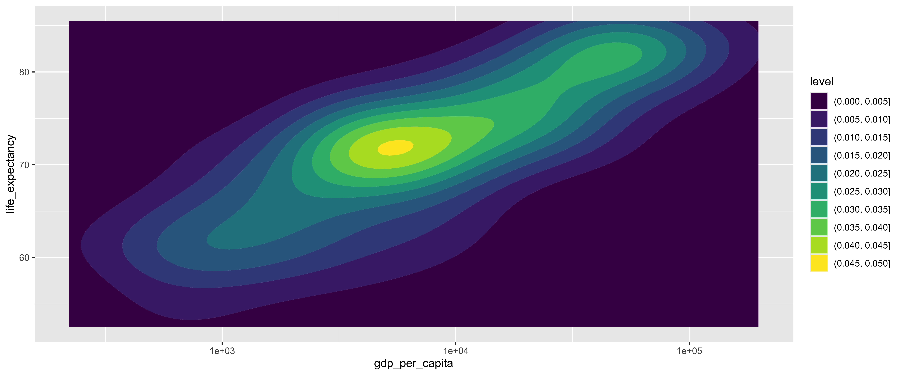

But does the size of a country play a role in this relationship? What
about the region? We can investigate this by specifying
`color = region_name` and `size = population` in the `ggplot2::aes()`
call and creating a colored bubble chart.

``` r
ggplot2::ggplot(data = data2021,
                mapping = ggplot2::aes(x = gdp_per_capita,
                                       y = life_expectancy,
                                       color = region_name,
                                       size = population)) +
    ggplot2::geom_point() +
    ggplot2::scale_x_log10()
```

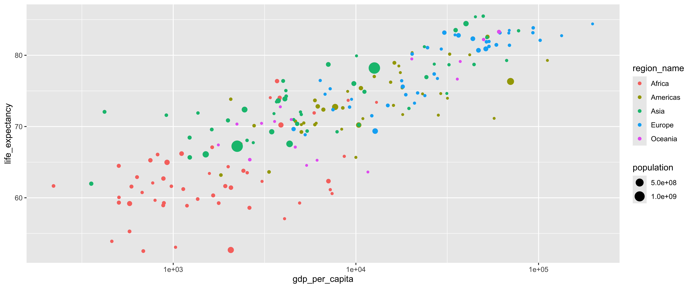

The population of world countries varies vastly. To illustrate this
better, we can add `ggplot2::scale_size()` to our visualization and use
the `range` argument to specify the smallest and largest possible bubble
size.

``` r
ggplot2::ggplot(data = data2021,
                mapping = ggplot2::aes(x = gdp_per_capita,
                                       y = life_expectancy,
                                       color = region_name,
                                       size = population)) +
    ggplot2::geom_point() +
    ggplot2::scale_x_log10() +
    ggplot2::scale_size(range = c(1,10))
```

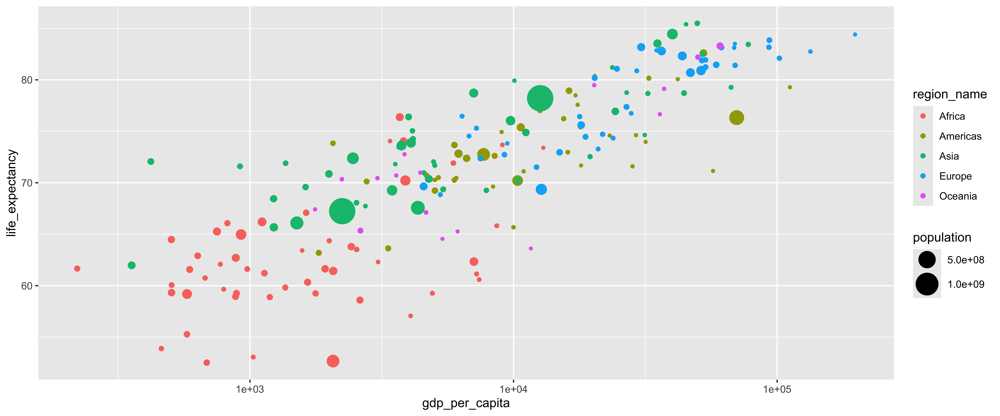

A smoothed trend line can be added using `ggplot2::geom_smooth()` and
specifying`y ~ x` as the `formula`. The `method` argument is used to
specify the statistical function to use for the trend line and can be
one of the following:

-   `"lm"` for a simple linear model
-   `"glm"` for a generalized linear model
-   `"gam"` for a generalized additive model
-   `"loess"` for locally estimated scatter plot smoothing

``` r
ggplot2::ggplot(data = data2021,
                mapping = ggplot2::aes(x = gdp_per_capita,
                                       y = life_expectancy)) +
    ggplot2::geom_point(mapping = ggplot2::aes(color = region_name,
                                               size = population)) +
    ggplot2::scale_x_log10() +
    ggplot2::scale_size(range = c(1,10)) +
    ggplot2::geom_smooth(formula = y ~ x, method = "lm")
```

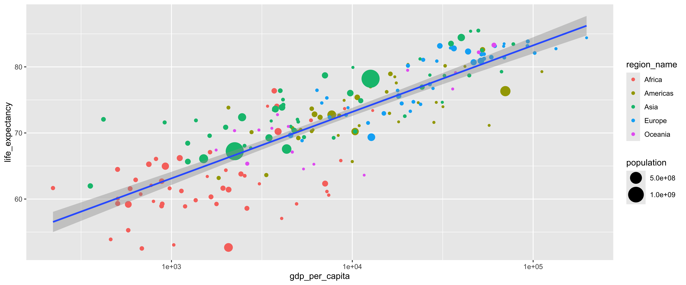

Additional arguments can be added to `ggplot2::geom_smooth()` to modify
the appearance of the trend line and `ggplot2::labs()` can be used to
add a title and label the axes and legend.

``` r
plot <- ggplot2::ggplot(data = data2021,
                mapping = ggplot2::aes(x = gdp_per_capita,
                                       y = life_expectancy)) +
    ggplot2::geom_point(mapping = ggplot2::aes(color = region_name,
                                               size = population)) +
    ggplot2::scale_x_log10() +
    ggplot2::scale_size(range = c(1,10)) +
    ggplot2::geom_smooth(formula = y ~ x,
                         method = "lm",
                         se = FALSE,
                         color = "black",
                         linetype = "dashed") +
    ggplot2::labs(title = "Health and Wealth by Country in 2021",
                  x = "GDP per Capita (USD)",
                  y = "Life Expectancy at Birth",
                  color = "Region",
                  size = "Population")
plot
```

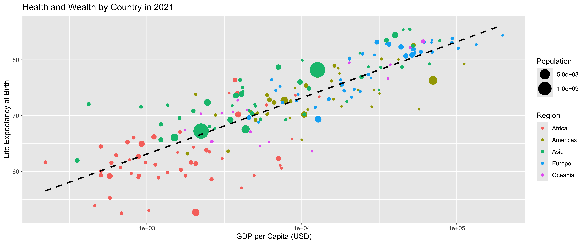

## Creating Interactive Visualizations

While the static scatter plot above is quite pretty to look at, it is
not the most informative. We have no idea which points represent which
countries and many countries appear clustered together, which makes it
harder to tell them apart. An interactive visualization would allow for
better exploration and investigation of the data. The easiest way of
creating an interactive visualization in R is via the `plotly` package.

Creating an interactive visualization using `plotly` is somewhat
reminiscent of using `ggplot2` but with some key differences. The core
aspects of the visualization are first defined using the
`plotly::plot_ly()` function, the output of which is then piped into
`plotly::layout()` to customize the appearance of the visualization by
adding axis labels and transformations. Note that column names must be
prefixed with a tilde character (`~`) when passing them as arguments in
the `plotly::plot_ly()` function call.

``` r
plotly::plot_ly(data = data2021,
                x = ~gdp_per_capita,
                y = ~life_expectancy,
                color = ~region_name,
                text = ~country_name,
                size = ~population,
                type = "scatter",
                mode = "markers",
                sizes = c(5, 50),
                marker = list(symbol = "circle",
                              sizemode = "diameter")) %>%
    plotly::layout(title = "Health and Wealth by Country in 2021",
                   xaxis = list(title = "GDP per Capita (USD)",
                                type = "log"),
                   yaxis = list(title = "Life Expectancy at Birth"))
```

<div class="plotly html-widget html-fill-item" id="htmlwidget-2df5ea6cf60a0a0261a1" style="width:7200px;height:3000px;"></div>
<script type="application/json" data-for="htmlwidget-2df5ea6cf60a0a0261a1">{"x":{"visdat":{"183ba43dafc25":["function () ","plotlyVisDat"]},"cur_data":"183ba43dafc25","attrs":{"183ba43dafc25":{"x":{},"y":{},"text":{},"mode":"markers","marker":{"symbol":"circle","sizemode":"diameter"},"color":{},"size":{},"alpha_stroke":1,"sizes":[5,50],"spans":[1,20],"type":"scatter"}},"layout":{"margin":{"b":40,"l":60,"t":25,"r":10},"title":"Health and Wealth by Country in 2021","xaxis":{"domain":[0,1],"automargin":true,"title":"GDP per Capita (USD)","type":"log"},"yaxis":{"domain":[0,1],"automargin":true,"title":"Life Expectancy at Birth"},"hovermode":"closest","showlegend":true},"source":"A","config":{"modeBarButtonsToAdd":["hoverclosest","hovercompare"],"showSendToCloud":false},"data":[{"x":[3700.3146972819868,3886.7224983901015,5908.9513231651054,3824.996312590933,749.70677734414824,3807.1841089684076,221.15780343078075,1577.4708406612626,3062.5514820764283,925.00069759157873,2069.6611288191853,503.35208119085883,633.60973317947514,9068.9801805120915,504.03778714310647,821.17139480813535,12963.058980213887,576.52367824210785,883.46572807787845,1111.1413635699059,1134.7134542499059,1773.9204109028506,1927.4740783209106,1654.2570373059259,461.13751095604778,685.69031503754422,2540.4732115331799,576.97472939413547,7406.0849747934808,8635.7971442819198,2350.4527009713365,7238.7960975310834,4068.5738155096533,1029.5061891286916,4919.1889554802465,7073.6127541182095,1360.9114742149184,888.78107883676728,3398.1653761469402,2613.378893068405,772.15145050328488,2422.085912850212,1189.1759994587458,795.11860503918774,675.66318584915973,881.51008873358637,1998.3940026558589,590.62949475273604,2065.7744103511395,1633.5601189035726,504.62128762153145,976.66618312964192],"y":[76.376999999999995,70.221000000000004,71.911000000000001,74.042000000000002,65.266999999999996,73.772000000000006,61.662999999999997,63.417000000000002,62.305,64.974999999999994,61.427,64.484999999999999,62.904000000000003,73.680243902439003,59.325000000000003,66.072000000000003,73.397560975609693,55.280000000000001,62.704999999999998,66.200999999999993,61.222999999999999,59.253,61.643000000000001,60.332999999999998,53.895000000000003,52.524999999999999,63.518999999999998,59.192999999999998,60.594000000000001,65.820999999999998,67.590999999999994,61.140999999999998,57.066000000000003,53.061999999999998,59.268999999999998,62.341000000000001,59.820999999999998,59.270000000000003,74.052000000000007,58.597999999999999,62.082999999999998,63.795000000000002,58.892000000000003,59.652000000000001,60.747,58.941000000000003,64.364000000000004,61.576000000000001,52.676000000000002,67.093000000000004,60.061999999999998,61.619],"text":["Algeria","Egypt, Arab Rep.","Libya","Morocco","Sudan","Tunisia","Burundi","Comoros","Djibouti","Ethiopia","Kenya","Madagascar","Malawi","Mauritius","Mozambique","Rwanda","Seychelles","Somalia","Uganda","Tanzania","Zambia","Zimbabwe","Angola","Cameroon","Central African Republic","Chad","Congo, Rep.","Congo, Dem. Rep.","Equatorial Guinea","Gabon","Sao Tome and Principe","Botswana","Eswatini","Lesotho","Namibia","South Africa","Benin","Burkina Faso","Cabo Verde","Cote d'Ivoire","Gambia, The","Ghana","Guinea","Guinea-Bissau","Liberia","Mali","Mauritania","Niger","Nigeria","Senegal","Sierra Leone","Togo"],"mode":"markers","marker":{"color":"rgba(102,194,165,1)","size":[6.4072334189889446,8.4809346274261266,5.2142411887608535,6.1809703840325287,6.4543644713101029,5.3903627712654627,5.3995474818955413,5.0258214862385877,5.0348680758885287,8.8320788783396242,6.6884982355307647,5.9209482874795469,5.6333663557709439,5.0399907233680254,6.0216768436286472,5.4285632428152688,5.0028055605040498,5.5433834525674772,6.4606277400048135,7.0256829319377276,5.6200921808269806,5.5092257677684886,6.0989959805934513,5.8662407497814728,5.1735178666162858,5.547020765825045,5.1855824076476926,8.0550039354442866,5.0517200780762375,5.0742372389150248,5.0067516147760429,5.082114882193733,5.037630941556734,5.0723342918472669,5.080258230347229,6.891988227389688,5.413747720573693,5.7038109550666549,5.0183753794200845,5.8751499831349028,5.0837555427774088,6.0457630715465278,5.430794143573582,5.0653013372201015,5.1651146945148811,5.6975755973243309,5.1466844809063721,5.8042406473648454,11.798997090659181,5.537365997797048,5.2679399494457462,5.2750829866533904],"sizemode":"diameter","symbol":"circle","line":{"color":"rgba(102,194,165,1)"}},"type":"scatter","name":"Africa","textfont":{"color":"rgba(102,194,165,1)","size":[6.4072334189889446,8.4809346274261266,5.2142411887608535,6.1809703840325287,6.4543644713101029,5.3903627712654627,5.3995474818955413,5.0258214862385877,5.0348680758885287,8.8320788783396242,6.6884982355307647,5.9209482874795469,5.6333663557709439,5.0399907233680254,6.0216768436286472,5.4285632428152688,5.0028055605040498,5.5433834525674772,6.4606277400048135,7.0256829319377276,5.6200921808269806,5.5092257677684886,6.0989959805934513,5.8662407497814728,5.1735178666162858,5.547020765825045,5.1855824076476926,8.0550039354442866,5.0517200780762375,5.0742372389150248,5.0067516147760429,5.082114882193733,5.037630941556734,5.0723342918472669,5.080258230347229,6.891988227389688,5.413747720573693,5.7038109550666549,5.0183753794200845,5.8751499831349028,5.0837555427774088,6.0457630715465278,5.430794143573582,5.0653013372201015,5.1651146945148811,5.6975755973243309,5.1466844809063721,5.8042406473648454,11.798997090659181,5.537365997797048,5.2679399494457462,5.2750829866533904]},"error_y":{"color":"rgba(102,194,165,1)","width":[]},"error_x":{"color":"rgba(102,194,165,1)","width":[]},"line":{"color":"rgba(102,194,165,1)"},"xaxis":"x","yaxis":"y","frame":null},{"x":[17178.543716052201,29127.759384190842,28260.432550636666,17507.4679943101,7668.1581321696267,8476.7496389250628,9010.5127999357992,1823.7422244528511,5183.5810181200941,32601.56563918211,18035.386140246861,10916.227079788645,20320.716878913205,8360.0642393725993,31711.611987091026,16056.302040927323,23158.637895110165,41976.008312080856,6060.9682234084366,12604.048837473072,4664.3112226838475,5029.4775548409316,2771.7226538757163,10359.149862583157,2064.9292463358365,15491.289801338324,10650.860460434511,3345.0230022619367,7696.7848301285085,16240.607775972923,6182.7070986796434,5965.1328705441592,9994.6457042256898,5959.4417939362738,6635.4641480917171,5026.8794927907375,17923.995332796138,111774.66909227778,52515.199835050284,57116.295770721939,70219.472454115006],"y":[78.497,74.626000000000005,71.597999999999999,77.570999999999998,72.813999999999993,72.614999999999995,74.936000000000007,63.192,70.5,80.162000000000006,71.682000000000002,71.111000000000004,80.379000000000005,69.629000000000005,73.971999999999994,72.971000000000004,74.587000000000003,80.068292682926796,70.469999999999999,77.022999999999996,70.748000000000005,69.236999999999995,70.123000000000005,70.212999999999994,73.837000000000003,76.222999999999999,75.390000000000001,63.630000000000003,72.75,78.944000000000003,72.829999999999998,73.670000000000002,65.673000000000002,70.262,72.376999999999995,70.274000000000001,75.436000000000007,79.280000000000001,82.596609756097607,71.147560975609807,76.329268292682897],"text":["Antigua and Barbuda","Aruba","Bahamas, The","Barbados","Dominica","Dominican Republic","Grenada","Haiti","Jamaica","Puerto Rico","St. Kitts and Nevis","St. Lucia","St. Martin (French part)","St. Vincent and the Grenadines","Sint Maarten (Dutch part)","Trinidad and Tobago","Turks and Caicos Islands","Virgin Islands (U.S.)","Belize","Costa Rica","El Salvador","Guatemala","Honduras","Mexico","Nicaragua","Panama","Argentina","Bolivia","Brazil","Chile","Colombia","Ecuador","Guyana","Paraguay","Peru","Suriname","Uruguay","Bermuda","Canada","Greenland","United States"],"mode":"markers","marker":{"color":"rgba(252,141,98,1)","size":[5.0026131469863904,5.003037482675774,5.012639646842592,5.0086025633571607,5.0019501981435468,5.3538786639784126,5.0036133213087686,5.3643833778578873,5.0897385230609844,5.1035983500778235,5.0011598338913439,5.0053670276219782,5.0006609415483227,5.0029672273675372,5.0010025002350762,5.0482534167147755,5.001080434241401,5.003016230843305,5.0123887350274625,5.1638574590465396,5.2008238586695406,5.5447906297503584,5.3271297758092899,9.0366990407375276,5.2179136774652655,5.1382822965213188,6.4591929704877238,5.3845169561074915,11.828466085937032,5.6207312970301144,6.6410543320206861,5.5667112736364031,5.0252779873506546,5.2132382424603279,6.0738792140408355,5.0191738365740077,5.1088098920289662,5.0016746571432629,6.217608734379521,5.0014480877569278,15.578771895664222],"sizemode":"diameter","symbol":"circle","line":{"color":"rgba(252,141,98,1)"}},"type":"scatter","name":"Americas","textfont":{"color":"rgba(252,141,98,1)","size":[5.0026131469863904,5.003037482675774,5.012639646842592,5.0086025633571607,5.0019501981435468,5.3538786639784126,5.0036133213087686,5.3643833778578873,5.0897385230609844,5.1035983500778235,5.0011598338913439,5.0053670276219782,5.0006609415483227,5.0029672273675372,5.0010025002350762,5.0482534167147755,5.001080434241401,5.003016230843305,5.0123887350274625,5.1638574590465396,5.2008238586695406,5.5447906297503584,5.3271297758092899,9.0366990407375276,5.2179136774652655,5.1382822965213188,6.4591929704877238,5.3845169561074915,11.828466085937032,5.6207312970301144,6.6410543320206861,5.5667112736364031,5.0252779873506546,5.2132382424603279,6.0738792140408355,5.0191738365740077,5.1088098920289662,5.0016746571432629,6.217608734379521,5.0014480877569278,15.578771895664222]},"error_y":{"color":"rgba(252,141,98,1)","width":[]},"error_x":{"color":"rgba(252,141,98,1)","width":[]},"line":{"color":"rgba(252,141,98,1)"},"xaxis":"x","yaxis":"y","frame":null},{"x":[10373.789792436688,1365.5083039928707,916.69196706192179,7885.2998959182441,1993.4244778720642,12617.50510411807,49764.79311562208,45104.89218002656,40058.537327617902,4566.1401302918175,35142.264267481092,31448.912748293678,1625.2350214797882,4334.2159826606003,2535.6234341357112,11134.622952818878,1231.6946658078455,3460.5393816924116,77710.089237309134,7060.8977069641796,2741.9508199451602,3756.4889008088489,355.77782639264836,2457.9240393614168,3560.1977045768667,2238.1271421876509,4084.2003047945736,10076.317530396582,1229.394205162459,1506.1082930591685,3996.5719950125108,4972.7832036191667,5408.045351750231,26850.003391570219,23696.513452063034,5023.2743836898462,4770.8353427473894,52129.515961210811,4152.7579542638869,32324.840904398799,4136.1465751601172,19509.466463386671,66858.741722671577,24315.618551187337,3678.6356566219401,420.62270516110794,9743.2131309242795,44332.340051316234],"y":[70.230000000000004,71.900000000000006,71.593999999999994,69.263999999999996,70.861999999999995,78.210999999999999,85.492682926829303,85.399000000000001,84.445609756097596,70.974999999999994,83.526829268292701,74.641999999999996,69.584000000000003,67.569999999999993,68.061000000000007,74.884,65.671999999999997,69.266000000000005,83.4414634146342,78.715000000000003,67.736999999999995,73.617999999999995,61.981999999999999,72.381,71.814999999999998,67.239999999999995,73.875,79.918000000000006,68.450000000000003,66.097999999999999,76.399000000000001,72.043000000000006,69.366,78.760000000000005,81.203000000000003,71.694000000000003,70.378,82.5,74.256,78.673000000000002,75.046999999999997,72.540999999999997,79.272000000000006,76.936000000000007,73.472999999999999,72.063000000000002,76.031999999999996,78.709999999999994],"text":["Kazakhstan","Kyrgyz Republic","Tajikistan","Turkmenistan","Uzbekistan","China","Hong Kong SAR, China","Macao SAR, China","Japan","Mongolia","Korea, Rep.","Brunei Darussalam","Cambodia","Indonesia","Lao PDR","Malaysia","Myanmar","Philippines","Singapore","Thailand","Timor-Leste","Viet Nam","Afghanistan","Bangladesh","Bhutan","India","Iran, Islamic Rep.","Maldives","Nepal","Pakistan","Sri Lanka","Armenia","Azerbaijan","Bahrain","Cyprus","Georgia","Iraq","Israel","Jordan","Kuwait","Lebanon","Oman","Qatar","Saudi Arabia","West Bank and Gaza","Syrian Arab Republic","Turkiye","United Arab Emirates"],"mode":"markers","marker":{"color":"rgba(141,160,203,1)","size":[5.6050490377590831,5.2154558568406211,5.310297782843155,5.2017060486806264,6.1121015746594658,50,5.2358378616835664,5.0215195673236517,9.0040870364433694,5.1063094402921134,6.6483288310885493,5.0138334135698868,5.5281994484031127,13.721917312414377,5.2362188334389321,6.0693676762266309,6.713747770278129,8.6280772812723807,5.1734035464140407,7.2809843178426874,5.0417306335141312,8.1051516009505633,6.2772847720826039,10.395641031863068,5.0244151374629702,49.847185687691841,7.8010433904175613,5.0162575881149403,5.9566123671620277,12.372535109237987,5.7055734552415762,5.0885685252497641,5.3226501635365153,5.0462653030080542,5.0392851115511554,5.1178060762831565,6.3867023964241767,5.2982328594699348,5.3548474225484455,5.135059378065983,5.1778344101055902,5.1436734435393676,5.0852950739514062,6.1450879871745219,5.1564907518779801,5.6790761161239383,7.6807295341794593,5.2980335637996321],"sizemode":"diameter","symbol":"circle","line":{"color":"rgba(141,160,203,1)"}},"type":"scatter","name":"Asia","textfont":{"color":"rgba(141,160,203,1)","size":[5.6050490377590831,5.2154558568406211,5.310297782843155,5.2017060486806264,6.1121015746594658,50,5.2358378616835664,5.0215195673236517,9.0040870364433694,5.1063094402921134,6.6483288310885493,5.0138334135698868,5.5281994484031127,13.721917312414377,5.2362188334389321,6.0693676762266309,6.713747770278129,8.6280772812723807,5.1734035464140407,7.2809843178426874,5.0417306335141312,8.1051516009505633,6.2772847720826039,10.395641031863068,5.0244151374629702,49.847185687691841,7.8010433904175613,5.0162575881149403,5.9566123671620277,12.372535109237987,5.7055734552415762,5.0885685252497641,5.3226501635365153,5.0462653030080542,5.0392851115511554,5.1178060762831565,6.3867023964241767,5.2982328594699348,5.3548474225484455,5.135059378065983,5.1778344101055902,5.1436734435393676,5.0852950739514062,6.1450879871745219,5.1564907518779801,5.6790761161239383,7.6807295341794593,5.2980335637996321]},"error_y":{"color":"rgba(141,160,203,1)","width":[]},"error_x":{"color":"rgba(141,160,203,1)","width":[]},"line":{"color":"rgba(141,160,203,1)"},"xaxis":"x","yaxis":"y","frame":null},{"x":[7489.7189471388865,12219.341870677896,26822.51418621116,18753.046945353868,18050.279444116088,5274.7448471974631,14946.624968677954,12744.646726065344,21768.148670802515,4558.4809543059464,69268.651798313324,27943.701219882008,69108.206582303508,53504.69364834416,68710.244200547342,102001.79824914507,20930.398237418878,23849.615699356586,93072.892511957136,61417.68087664686,46869.759058410993,6377.2030955375212,7230.1988377188782,17809.032390112632,20310.68247988728,36449.258337583713,34881.291272660914,9465.9615302779348,6778.5628782177255,24661.166487457573,9232.9616060485405,29331.064701004325,30488.820952879749,53517.890450961204,51850.397184022971,43671.30840996316,51426.750365442109,197504.54893625784,133711.79443598547,58727.870547147431,93446.43445189434],"y":[72.370682926829303,71.514634146341507,77.373170731707305,74.465853658536602,75.602439024390307,68.846000000000004,72.960975609756105,69.361219512195106,74.714634146341496,69.647804878048802,81.404878048780503,76.741463414634197,83.497560975609801,81.934146341463403,83.1170731707317,82.102439024390307,73.282926829268305,74.339024390243907,83.163414634146307,83.156097560975596,80.700000000000003,76.462999999999994,75.299999999999997,76.424390243902494,80.182926829268297,82.7951219512195,82.860975609756096,73.8243902439024,74.536829268292706,81.073170731707293,72.730731707317105,80.875609756097603,83.178048780487799,81.239024390243898,81.890243902438996,82.3243902439024,80.900975609756102,84.402439024390205,82.748780487804893,81.460975609756105,83.851219512195101],"text":["Belarus","Bulgaria","Czechia","Hungary","Poland","Moldova","Romania","Russian Federation","Slovak Republic","Ukraine","Denmark","Estonia","Faroe Islands","Finland","Iceland","Ireland","Latvia","Lithuania","Norway","Sweden","United Kingdom","Albania","Bosnia and Herzegovina","Croatia","Greece","Italy","Malta","Montenegro","North Macedonia","Portugal","Serbia","Slovenia","Spain","Austria","Belgium","France","Germany","Liechtenstein","Luxembourg","Netherlands","Switzerland"],"mode":"markers","marker":{"color":"rgba(231,138,195,1)","size":[5.2960402884784274,5.218780414494721,5.3343760134447695,5.3090177980369093,6.2023350073362469,5.0823502135799608,5.6089065799012445,9.591902176266661,5.173202211587399,6.3959203070683968,5.1862491799086721,5.0420489330738949,5.0013281598747508,5.1761898942419604,5.0115121845581267,5.1600087744897261,5.0596862972084127,5.0888828420823042,5.1719619266061239,5.331509692454186,7.1352225233178164,5.0892278099835613,5.1038612100746255,5.1232350114171092,5.3363971678565445,6.8837334039119327,5.0161645197451632,5.0193722082515944,5.06544060522568,5.3297897915296559,5.2173970699515504,5.0668102491871982,6.5103964091884281,5.2849909924092149,5.3688002542114246,7.1587369271917449,7.6504212986209108,5.0008868736983016,5.020036622738056,5.5582776734990045,5.2769856788266063],"sizemode":"diameter","symbol":"circle","line":{"color":"rgba(231,138,195,1)"}},"type":"scatter","name":"Europe","textfont":{"color":"rgba(231,138,195,1)","size":[5.2960402884784274,5.218780414494721,5.3343760134447695,5.3090177980369093,6.2023350073362469,5.0823502135799608,5.6089065799012445,9.591902176266661,5.173202211587399,6.3959203070683968,5.1862491799086721,5.0420489330738949,5.0013281598747508,5.1761898942419604,5.0115121845581267,5.1600087744897261,5.0596862972084127,5.0888828420823042,5.1719619266061239,5.331509692454186,7.1352225233178164,5.0892278099835613,5.1038612100746255,5.1232350114171092,5.3363971678565445,6.8837334039119327,5.0161645197451632,5.0193722082515944,5.06544060522568,5.3297897915296559,5.2173970699515504,5.0668102491871982,6.5103964091884281,5.2849909924092149,5.3688002542114246,7.1587369271917449,7.6504212986209108,5.0008868736983016,5.020036622738056,5.5582776734990045,5.2769856788266063]},"error_y":{"color":"rgba(231,138,195,1)","width":[]},"error_x":{"color":"rgba(231,138,195,1)","width":[]},"line":{"color":"rgba(231,138,195,1)"},"xaxis":"x","yaxis":"y","frame":null},{"x":[60697.245435857905,49996.420672581095,4656.0513414499947,37247.493116788341,2624.6041102136232,2232.5369539768258,3044.5736403195683,35904.863546272296,1766.1442893462452,6130.437136546896,3588.7599331748152,11632.692502041882,20230.241048255415,3857.6897420645905,4425.9714919851622,5372.7602386504195],"y":[83.299999999999997,82.207317073170699,67.114000000000004,79.127341463414595,65.350999999999999,70.347999999999999,70.448999999999998,76.656000000000006,67.417000000000002,65.269000000000005,70.709999999999994,63.616999999999997,79.486000000000004,72.766999999999996,70.986000000000004,64.546999999999997],"text":["Australia","New Zealand","Fiji","New Caledonia","Papua New Guinea","Solomon Islands","Vanuatu","Guam","Kiribati","Marshall Islands","Micronesia, Fed. Sts.","Nauru","French Polynesia","Samoa","Tonga","Tuvalu"],"mode":"markers","marker":{"color":"rgba(166,216,84,1)","size":[5.8180269373062146,5.1625015156666727,5.0291027755441231,5.0082581371068056,5.3166501690422372,5.0221964397808714,5.0098113051388191,5.0050765434291486,5.0037491800998426,5.0009828096316795,5.0032475795023084,5.000041643395857,5.0093300323810377,5.0066132389013625,5.0030209145305209,5],"sizemode":"diameter","symbol":"circle","line":{"color":"rgba(166,216,84,1)"}},"type":"scatter","name":"Oceania","textfont":{"color":"rgba(166,216,84,1)","size":[5.8180269373062146,5.1625015156666727,5.0291027755441231,5.0082581371068056,5.3166501690422372,5.0221964397808714,5.0098113051388191,5.0050765434291486,5.0037491800998426,5.0009828096316795,5.0032475795023084,5.000041643395857,5.0093300323810377,5.0066132389013625,5.0030209145305209,5]},"error_y":{"color":"rgba(166,216,84,1)","width":[]},"error_x":{"color":"rgba(166,216,84,1)","width":[]},"line":{"color":"rgba(166,216,84,1)"},"xaxis":"x","yaxis":"y","frame":null}],"highlight":{"on":"plotly_click","persistent":false,"dynamic":false,"selectize":false,"opacityDim":0.20000000000000001,"selected":{"opacity":1},"debounce":0},"shinyEvents":["plotly_hover","plotly_click","plotly_selected","plotly_relayout","plotly_brushed","plotly_brushing","plotly_clickannotation","plotly_doubleclick","plotly_deselect","plotly_afterplot","plotly_sunburstclick"],"base_url":"https://plot.ly"},"evals":[],"jsHooks":[]}</script>

If construction an interactive visualization using the procedure above
seems overly complicated, worry not. The `plotly::ggplotly()` function
can be used to transform any static `ggplot2` visualization into an
interactive `plotly` visualization. For example, we can convert the
previous static visualization saved into the `plot` variable into an
interactive one as follows.

``` r
plotly::ggplotly(plot)
```

<div class="plotly html-widget html-fill-item" id="htmlwidget-10dfa7fc04563bc7af4b" style="width:7200px;height:3000px;"></div>
<script type="application/json" data-for="htmlwidget-10dfa7fc04563bc7af4b">{"x":{"data":[{"x":[3.5682386606835337,3.5895835342715787,3.7715104123577565,3.5826310208171703,2.8748914368830092,3.5806038790669841,2.344702267816579,3.1979613401146172,3.4860833980072941,2.9661420602634205,3.3158992430745475,2.7018718686121268,2.8018218400360935,3.9575584527847174,2.7024630962323806,2.9144338124796616,4.1127074970181763,2.7608171487837341,2.9461897067625853,3.0457693150280289,3.054886204304784,3.2489341307825716,3.2849885461430262,3.2186029908336202,2.6638304510821742,2.8361280153608739,3.4049146197758726,2.7611567921418332,3.8695886906829347,3.9363024321622273,3.3711515161437862,3.859666343590145,3.6094421997411716,3.0126289618295812,3.6918935049635375,3.8496412806196711,3.1338298757467711,2.9487948003834732,3.5312445105543251,3.4172023792029393,2.8877024916141534,3.3841895437678233,3.0752461354741945,2.9004319156654108,2.8297302566219948,2.9452272870905345,3.3006811176786917,2.7713151308927171,3.3150828933264198,3.2131351221770097,2.7029655674291924,2.9897461506199279],"y":[76.376999999999995,70.221000000000004,71.911000000000001,74.042000000000002,65.266999999999996,73.772000000000006,61.662999999999997,63.417000000000002,62.305,64.974999999999994,61.427,64.484999999999999,62.904000000000003,73.680243902439003,59.325000000000003,66.072000000000003,73.397560975609693,55.280000000000001,62.704999999999998,66.200999999999993,61.222999999999999,59.253,61.643000000000001,60.332999999999998,53.895000000000003,52.524999999999999,63.518999999999998,59.192999999999998,60.594000000000001,65.820999999999998,67.590999999999994,61.140999999999998,57.066000000000003,53.061999999999998,59.268999999999998,62.341000000000001,59.820999999999998,59.270000000000003,74.052000000000007,58.597999999999999,62.082999999999998,63.795000000000002,58.892000000000003,59.652000000000001,60.747,58.941000000000003,64.364000000000004,61.576000000000001,52.676000000000002,67.093000000000004,60.061999999999998,61.619],"text":["gdp_per_capita:   3700.3147<br />life_expectancy: 76.37700<br />region_name: Africa<br />population:   44177969","gdp_per_capita:   3886.7225<br />life_expectancy: 70.22100<br />region_name: Africa<br />population:  109262178","gdp_per_capita:   5908.9513<br />life_expectancy: 71.91100<br />region_name: Africa<br />population:    6735277","gdp_per_capita:   3824.9963<br />life_expectancy: 74.04200<br />region_name: Africa<br />population:   37076584","gdp_per_capita:    749.7068<br />life_expectancy: 65.26700<br />region_name: Africa<br />population:   45657202","gdp_per_capita:   3807.1841<br />life_expectancy: 73.77200<br />region_name: Africa<br />population:   12262946","gdp_per_capita:    221.1578<br />life_expectancy: 61.66300<br />region_name: Africa<br />population:   12551213","gdp_per_capita:   1577.4708<br />life_expectancy: 63.41700<br />region_name: Africa<br />population:     821625","gdp_per_capita:   3062.5515<br />life_expectancy: 62.30500<br />region_name: Africa<br />population:    1105557","gdp_per_capita:    925.0007<br />life_expectancy: 64.97500<br />region_name: Africa<br />population:  120283026","gdp_per_capita:   2069.6611<br />life_expectancy: 61.42700<br />region_name: Africa<br />population:   53005614","gdp_per_capita:    503.3521<br />life_expectancy: 64.48500<br />region_name: Africa<br />population:   28915653","gdp_per_capita:    633.6097<br />life_expectancy: 62.90400<br />region_name: Africa<br />population:   19889742","gdp_per_capita:   9068.9802<br />life_expectancy: 73.68024<br />region_name: Africa<br />population:    1266334","gdp_per_capita:    504.0378<br />life_expectancy: 59.32500<br />region_name: Africa<br />population:   32077072","gdp_per_capita:    821.1714<br />life_expectancy: 66.07200<br />region_name: Africa<br />population:   13461888","gdp_per_capita:  12963.0590<br />life_expectancy: 73.39756<br />region_name: Africa<br />population:      99258","gdp_per_capita:    576.5237<br />life_expectancy: 55.28000<br />region_name: Africa<br />population:   17065581","gdp_per_capita:    883.4657<br />life_expectancy: 62.70500<br />region_name: Africa<br />population:   45853778","gdp_per_capita:   1111.1414<br />life_expectancy: 66.20100<br />region_name: Africa<br />population:   63588334","gdp_per_capita:   1134.7135<br />life_expectancy: 61.22300<br />region_name: Africa<br />population:   19473125","gdp_per_capita:   1773.9204<br />life_expectancy: 59.25300<br />region_name: Africa<br />population:   15993524","gdp_per_capita:   1927.4741<br />life_expectancy: 61.64300<br />region_name: Africa<br />population:   34503774","gdp_per_capita:   1654.2570<br />life_expectancy: 60.33300<br />region_name: Africa<br />population:   27198628","gdp_per_capita:    461.1375<br />life_expectancy: 53.89500<br />region_name: Africa<br />population:    5457154","gdp_per_capita:    685.6903<br />life_expectancy: 52.52500<br />region_name: Africa<br />population:   17179740","gdp_per_capita:   2540.4732<br />life_expectancy: 63.51900<br />region_name: Africa<br />population:    5835806","gdp_per_capita:    576.9747<br />life_expectancy: 59.19300<br />region_name: Africa<br />population:   95894118","gdp_per_capita:   7406.0850<br />life_expectancy: 60.59400<br />region_name: Africa<br />population:    1634466","gdp_per_capita:   8635.7971<br />life_expectancy: 65.82100<br />region_name: Africa<br />population:    2341179","gdp_per_capita:   2350.4527<br />life_expectancy: 67.59100<br />region_name: Africa<br />population:     223107","gdp_per_capita:   7238.7961<br />life_expectancy: 61.14100<br />region_name: Africa<br />population:    2588423","gdp_per_capita:   4068.5738<br />life_expectancy: 57.06600<br />region_name: Africa<br />population:    1192271","gdp_per_capita:   1029.5062<br />life_expectancy: 53.06200<br />region_name: Africa<br />population:    2281454","gdp_per_capita:   4919.1890<br />life_expectancy: 59.26900<br />region_name: Africa<br />population:    2530151","gdp_per_capita:   7073.6128<br />life_expectancy: 62.34100<br />region_name: Africa<br />population:   59392255","gdp_per_capita:   1360.9115<br />life_expectancy: 59.82100<br />region_name: Africa<br />population:   12996895","gdp_per_capita:    888.7811<br />life_expectancy: 59.27000<br />region_name: Africa<br />population:   22100683","gdp_per_capita:   3398.1654<br />life_expectancy: 74.05200<br />region_name: Africa<br />population:     587925","gdp_per_capita:   2613.3789<br />life_expectancy: 58.59800<br />region_name: Africa<br />population:   27478249","gdp_per_capita:    772.1515<br />life_expectancy: 62.08300<br />region_name: Africa<br />population:    2639916","gdp_per_capita:   2422.0859<br />life_expectancy: 63.79500<br />region_name: Africa<br />population:   32833031","gdp_per_capita:   1189.1760<br />life_expectancy: 58.89200<br />region_name: Africa<br />population:   13531906","gdp_per_capita:    795.1186<br />life_expectancy: 59.65200<br />region_name: Africa<br />population:    2060721","gdp_per_capita:    675.6632<br />life_expectancy: 60.74700<br />region_name: Africa<br />population:    5193416","gdp_per_capita:    881.5101<br />life_expectancy: 58.94100<br />region_name: Africa<br />population:   21904983","gdp_per_capita:   1998.3940<br />life_expectancy: 64.36400<br />region_name: Africa<br />population:    4614974","gdp_per_capita:    590.6295<br />life_expectancy: 61.57600<br />region_name: Africa<br />population:   25252722","gdp_per_capita:   2065.7744<br />life_expectancy: 52.67600<br />region_name: Africa<br />population:  213401323","gdp_per_capita:   1633.5601<br />life_expectancy: 67.09300<br />region_name: Africa<br />population:   16876720","gdp_per_capita:    504.6213<br />life_expectancy: 60.06200<br />region_name: Africa<br />population:    8420641","gdp_per_capita:    976.6662<br />life_expectancy: 61.61900<br />region_name: Africa<br />population:    8644829"],"type":"scatter","mode":"markers","marker":{"autocolorscale":false,"color":"rgba(248,118,109,1)","opacity":1,"size":[9.7948212897011331,13.240193389055564,6.1265932967827652,9.2900563056586858,9.8947237841027462,6.9476938238692227,6.9847484737143253,4.5943526370918573,4.7263918977639783,13.705909665163768,10.368596848606259,8.6457436593425232,7.815063913142084,4.7935636184927946,8.9049603619199189,7.0990929551228659,4.0481136933135273,7.5174214903387098,9.907877285212896,10.9965740570749,7.7725513382100635,7.3980307071102374,9.0953665828344743,8.4989958658904641,5.8917802335936775,7.5299110267735845,5.9639778747695154,12.64250524690976,4.9327241633126073,5.1611350346046914,4.1961835170821784,5.2325914348978522,4.763190503510649,5.1433124855528272,5.2160703225207952,10.754347232088115,7.0412092521494793,8.0335696262463774,4.4668997005134212,8.5232035036445843,5.2470357963747487,8.9650249472269063,7.1077217964111057,5.0753181029337693,5.8399991530979696,8.0146835278333217,5.721601912533381,8.3269654747877144,17.001498448230276,7.496667061932091,6.4043051192744862,6.4390620958098754],"symbol":"circle","line":{"width":1.8897637795275593,"color":"rgba(248,118,109,1)"}},"hoveron":"points","name":"Africa","legendgroup":"Africa","showlegend":true,"xaxis":"x","yaxis":"y","hoverinfo":"text","frame":null},{"x":[4.2349863444259812,4.4643070783623822,4.4511788048202892,4.2432233410798768,3.8846910602859102,3.9282293564451476,3.9547495079429997,3.2609634532856511,3.7146298908424531,4.5132384568817567,4.2561254450621009,4.0380725613028616,4.3079390250225327,3.9222096146038314,4.5012183189525006,4.2056455292274517,4.3647130122214772,4.6230011371891981,3.7825420070863101,4.100510077285521,3.6687875206928178,3.7015228743533788,3.4427497714241038,4.0153241159170872,3.3149051753859538,4.1900875785264242,4.0273846949224801,3.5243991085675437,3.8863093456741939,4.2106022779108345,3.7911786725961973,3.7756201218205194,3.9997674036140234,3.7752055823632906,3.8218713069901664,3.701298474198969,4.2534348221556932,5.0483433928177659,4.7202850224360526,4.7567600338784066,4.84645756236762],"y":[78.497,74.626000000000005,71.597999999999999,77.570999999999998,72.813999999999993,72.614999999999995,74.936000000000007,63.192,70.5,80.162000000000006,71.682000000000002,71.111000000000004,80.379000000000005,69.629000000000005,73.971999999999994,72.971000000000004,74.587000000000003,80.068292682926796,70.469999999999999,77.022999999999996,70.748000000000005,69.236999999999995,70.123000000000005,70.212999999999994,73.837000000000003,76.222999999999999,75.390000000000001,63.630000000000003,72.75,78.944000000000003,72.829999999999998,73.670000000000002,65.673000000000002,70.262,72.376999999999995,70.274000000000001,75.436000000000007,79.280000000000001,82.596609756097607,71.147560975609807,76.329268292682897],"text":["gdp_per_capita:  17178.5437<br />life_expectancy: 78.49700<br />region_name: Americas<br />population:      93219","gdp_per_capita:  29127.7594<br />life_expectancy: 74.62600<br />region_name: Americas<br />population:     106537","gdp_per_capita:  28260.4326<br />life_expectancy: 71.59800<br />region_name: Americas<br />population:     407906","gdp_per_capita:  17507.4680<br />life_expectancy: 77.57100<br />region_name: Americas<br />population:     281200","gdp_per_capita:   7668.1581<br />life_expectancy: 72.81400<br />region_name: Americas<br />population:      72412","gdp_per_capita:   8476.7496<br />life_expectancy: 72.61500<br />region_name: Americas<br />population:   11117873","gdp_per_capita:   9010.5128<br />life_expectancy: 74.93600<br />region_name: Americas<br />population:     124610","gdp_per_capita:   1823.7422<br />life_expectancy: 63.19200<br />region_name: Americas<br />population:   11447569","gdp_per_capita:   5183.5810<br />life_expectancy: 70.50000<br />region_name: Americas<br />population:    2827695","gdp_per_capita:  32601.5656<br />life_expectancy: 80.16200<br />region_name: Americas<br />population:    3262693","gdp_per_capita:  18035.3861<br />life_expectancy: 71.68200<br />region_name: Americas<br />population:      47606","gdp_per_capita:  10916.2271<br />life_expectancy: 71.11100<br />region_name: Americas<br />population:     179651","gdp_per_capita:  20320.7169<br />life_expectancy: 80.37900<br />region_name: Americas<br />population:      31948","gdp_per_capita:   8360.0642<br />life_expectancy: 69.62900<br />region_name: Americas<br />population:     104332","gdp_per_capita:  31711.6120<br />life_expectancy: 73.97200<br />region_name: Americas<br />population:      42668","gdp_per_capita:  16056.3020<br />life_expectancy: 72.97100<br />region_name: Americas<br />population:    1525663","gdp_per_capita:  23158.6379<br />life_expectancy: 74.58700<br />region_name: Americas<br />population:      45114","gdp_per_capita:  41976.0083<br />life_expectancy: 80.06829<br />region_name: Americas<br />population:     105870","gdp_per_capita:   6060.9682<br />life_expectancy: 70.47000<br />region_name: Americas<br />population:     400031","gdp_per_capita:  12604.0488<br />life_expectancy: 77.02300<br />region_name: Americas<br />population:    5153957","gdp_per_capita:   4664.3112<br />life_expectancy: 70.74800<br />region_name: Americas<br />population:    6314167","gdp_per_capita:   5029.4776<br />life_expectancy: 69.23700<br />region_name: Americas<br />population:   17109746","gdp_per_capita:   2771.7227<br />life_expectancy: 70.12300<br />region_name: Americas<br />population:   10278345","gdp_per_capita:  10359.1499<br />life_expectancy: 70.21300<br />region_name: Americas<br />population:  126705138","gdp_per_capita:   2064.9292<br />life_expectancy: 73.83700<br />region_name: Americas<br />population:    6850540","gdp_per_capita:  15491.2898<br />life_expectancy: 76.22300<br />region_name: Americas<br />population:    4351267","gdp_per_capita:  10650.8605<br />life_expectancy: 75.39000<br />region_name: Americas<br />population:   45808747","gdp_per_capita:   3345.0230<br />life_expectancy: 63.63000<br />region_name: Americas<br />population:   12079472","gdp_per_capita:   7696.7848<br />life_expectancy: 72.75000<br />region_name: Americas<br />population:  214326223","gdp_per_capita:  16240.6078<br />life_expectancy: 78.94400<br />region_name: Americas<br />population:   19493184","gdp_per_capita:   6182.7071<br />life_expectancy: 72.83000<br />region_name: Americas<br />population:   51516562","gdp_per_capita:   5965.1329<br />life_expectancy: 73.67000<br />region_name: Americas<br />population:   17797737","gdp_per_capita:   9994.6457<br />life_expectancy: 65.67300<br />region_name: Americas<br />population:     804567","gdp_per_capita:   5959.4418<br />life_expectancy: 70.26200<br />region_name: Americas<br />population:    6703799","gdp_per_capita:   6635.4641<br />life_expectancy: 72.37700<br />region_name: Americas<br />population:   33715471","gdp_per_capita:   5026.8795<br />life_expectancy: 70.27400<br />region_name: Americas<br />population:     612985","gdp_per_capita:  17923.9953<br />life_expectancy: 75.43600<br />region_name: Americas<br />population:    3426260","gdp_per_capita: 111774.6691<br />life_expectancy: 79.28000<br />region_name: Americas<br />population:      63764","gdp_per_capita:  52515.1998<br />life_expectancy: 82.59661<br />region_name: Americas<br />population:   38226498","gdp_per_capita:  57116.2958<br />life_expectancy: 71.14756<br />region_name: Americas<br />population:      56653","gdp_per_capita:  70219.4725<br />life_expectancy: 76.32927<br />region_name: Americas<br />population:  332031554"],"type":"scatter","mode":"markers","marker":{"autocolorscale":false,"color":"rgba(163,165,0,1)","opacity":1,"size":[4.0387399085106077,4.0589946496975022,4.3496146918597303,4.2498413448088277,4.0034580015665773,6.7960110894102366,4.0843360494767582,6.8404550909314521,5.2985466347867911,5.4116404251675858,3.9522193392672493,4.1510120474465424,3.9098908440790749,4.0557437817692188,3.9400796664794546,4.89340601481564,3.9462035088936105,4.0580152839939849,4.3439278787856974,5.8321396223079356,6.051909989198557,7.5222582939879636,6.6797666839272267,13.96748107345746,6.1466243348618823,5.6651600842428795,9.9048666174451618,6.9238821574138028,17.03012155994394,7.774608571827323,10.275366508069764,7.5968135198260063,4.5857316824643872,6.1210930884549217,9.0342706411443512,4.4816749390745638,5.4521886657261698,3.9870364561367357,9.3748825669122233,3.9724893004723536,20.272213738471933],"symbol":"circle","line":{"width":1.8897637795275593,"color":"rgba(163,165,0,1)"}},"hoveron":"points","name":"Americas","legendgroup":"Americas","showlegend":true,"xaxis":"x","yaxis":"y","hoverinfo":"text","frame":null},{"x":[4.0159374434927564,3.1352943455356685,2.962223425660147,3.8968182151875199,3.299599786793137,4.1009734890894851,4.6969222029411295,4.6542236490079789,4.6026950876899226,3.6595492354237393,4.5458297402893928,4.4976056356134455,3.2109161721773534,3.6369105492866427,3.4040847568516335,4.0466755152827076,3.0905030605965411,3.5391437959707588,4.8904774076765349,3.8488599198048217,3.4380596609502185,3.5747821099800912,2.5511788774876529,3.3905684571525794,3.5514741158444187,3.3498847540342047,3.6111070333986519,4.0033018447655584,3.0896911617115519,3.1778561998774024,3.6016876408402463,3.6965995258873128,3.7330403249328925,4.4289443448936803,4.3746844514987835,3.7009869010478367,3.6785944278835503,4.7170836923862343,3.6183366187595376,4.5095363960578689,3.616595920718209,4.2902453926556445,4.8251581989385333,4.3858853218149756,3.5656867761012387,2.623892712144964,3.988702202762477,4.6467206558324259],"y":[70.230000000000004,71.900000000000006,71.593999999999994,69.263999999999996,70.861999999999995,78.210999999999999,85.492682926829303,85.399000000000001,84.445609756097596,70.974999999999994,83.526829268292701,74.641999999999996,69.584000000000003,67.569999999999993,68.061000000000007,74.884,65.671999999999997,69.266000000000005,83.4414634146342,78.715000000000003,67.736999999999995,73.617999999999995,61.981999999999999,72.381,71.814999999999998,67.239999999999995,73.875,79.918000000000006,68.450000000000003,66.097999999999999,76.399000000000001,72.043000000000006,69.366,78.760000000000005,81.203000000000003,71.694000000000003,70.378,82.5,74.256,78.673000000000002,75.046999999999997,72.540999999999997,79.272000000000006,76.936000000000007,73.472999999999999,72.063000000000002,76.031999999999996,78.709999999999994],"text":["gdp_per_capita:  10373.7898<br />life_expectancy: 70.23000<br />region_name: Asia<br />population:   19000988","gdp_per_capita:   1365.5083<br />life_expectancy: 71.90000<br />region_name: Asia<br />population:    6773400","gdp_per_capita:    916.6920<br />life_expectancy: 71.59400<br />region_name: Asia<br />population:    9750064","gdp_per_capita:   7885.2999<br />life_expectancy: 69.26400<br />region_name: Asia<br />population:    6341855","gdp_per_capita:   1993.4245<br />life_expectancy: 70.86200<br />region_name: Asia<br />population:   34915100","gdp_per_capita:  12617.5051<br />life_expectancy: 78.21100<br />region_name: Asia<br />population: 1412360000","gdp_per_capita:  49764.7931<br />life_expectancy: 85.49268<br />region_name: Asia<br />population:    7413100","gdp_per_capita:  45104.8922<br />life_expectancy: 85.39900<br />region_name: Asia<br />population:     686607","gdp_per_capita:  40058.5373<br />life_expectancy: 84.44561<br />region_name: Asia<br />population:  125681593","gdp_per_capita:   4566.1401<br />life_expectancy: 70.97500<br />region_name: Asia<br />population:    3347782","gdp_per_capita:  35142.2643<br />life_expectancy: 83.52683<br />region_name: Asia<br />population:   51744876","gdp_per_capita:  31448.9127<br />life_expectancy: 74.64200<br />region_name: Asia<br />population:     445373","gdp_per_capita:   1625.2350<br />life_expectancy: 69.58400<br />region_name: Asia<br />population:   16589023","gdp_per_capita:   4334.2160<br />life_expectancy: 67.57000<br />region_name: Asia<br />population:  273753191","gdp_per_capita:   2535.6234<br />life_expectancy: 68.06100<br />region_name: Asia<br />population:    7425057","gdp_per_capita:  11134.6230<br />life_expectancy: 74.88400<br />region_name: Asia<br />population:   33573874","gdp_per_capita:   1231.6947<br />life_expectancy: 65.67200<br />region_name: Asia<br />population:   53798084","gdp_per_capita:   3460.5394<br />life_expectancy: 69.26600<br />region_name: Asia<br />population:  113880328","gdp_per_capita:  77710.0892<br />life_expectancy: 83.44146<br />region_name: Asia<br />population:    5453566","gdp_per_capita:   7060.8977<br />life_expectancy: 78.71500<br />region_name: Asia<br />population:   71601103","gdp_per_capita:   2741.9508<br />life_expectancy: 67.73700<br />region_name: Asia<br />population:    1320942","gdp_per_capita:   3756.4889<br />life_expectancy: 73.61800<br />region_name: Asia<br />population:   97468029","gdp_per_capita:    355.7778<br />life_expectancy: 61.98200<br />region_name: Asia<br />population:   40099462","gdp_per_capita:   2457.9240<br />life_expectancy: 72.38100<br />region_name: Asia<br />population:  169356251","gdp_per_capita:   3560.1977<br />life_expectancy: 71.81500<br />region_name: Asia<br />population:     777486","gdp_per_capita:   2238.1271<br />life_expectancy: 67.24000<br />region_name: Asia<br />population: 1407563842","gdp_per_capita:   4084.2003<br />life_expectancy: 73.87500<br />region_name: Asia<br />population:   87923432","gdp_per_capita:  10076.3175<br />life_expectancy: 79.91800<br />region_name: Asia<br />population:     521457","gdp_per_capita:   1229.3942<br />life_expectancy: 68.45000<br />region_name: Asia<br />population:   30034989","gdp_per_capita:   1506.1083<br />life_expectancy: 66.09800<br />region_name: Asia<br />population:  231402117","gdp_per_capita:   3996.5720<br />life_expectancy: 76.39900<br />region_name: Asia<br />population:   22156000","gdp_per_capita:   4972.7832<br />life_expectancy: 72.04300<br />region_name: Asia<br />population:    2790974","gdp_per_capita:   5408.0454<br />life_expectancy: 69.36600<br />region_name: Asia<br />population:   10137750","gdp_per_capita:  26850.0034<br />life_expectancy: 78.76000<br />region_name: Asia<br />population:    1463265","gdp_per_capita:  23696.5135<br />life_expectancy: 81.20300<br />region_name: Asia<br />population:    1244188","gdp_per_capita:   5023.2744<br />life_expectancy: 71.69400<br />region_name: Asia<br />population:    3708610","gdp_per_capita:   4770.8353<br />life_expectancy: 70.37800<br />region_name: Asia<br />population:   43533592","gdp_per_capita:  52129.5160<br />life_expectancy: 82.50000<br />region_name: Asia<br />population:    9371400","gdp_per_capita:   4152.7580<br />life_expectancy: 74.25600<br />region_name: Asia<br />population:   11148278","gdp_per_capita:  32324.8409<br />life_expectancy: 78.67300<br />region_name: Asia<br />population:    4250114","gdp_per_capita:   4136.1466<br />life_expectancy: 75.04700<br />region_name: Asia<br />population:    5592631","gdp_per_capita:  19509.4665<br />life_expectancy: 72.54100<br />region_name: Asia<br />population:    4520471","gdp_per_capita:  66858.7417<br />life_expectancy: 79.27200<br />region_name: Asia<br />population:    2688235","gdp_per_capita:  24315.6186<br />life_expectancy: 76.93600<br />region_name: Asia<br />population:   35950396","gdp_per_capita:   3678.6357<br />life_expectancy: 73.47300<br />region_name: Asia<br />population:    4922749","gdp_per_capita:    420.6227<br />life_expectancy: 72.06300<br />region_name: Asia<br />population:   21324367","gdp_per_capita:   9743.2131<br />life_expectancy: 76.03200<br />region_name: Asia<br />population:   84147318","gdp_per_capita:  44332.3401<br />life_expectancy: 78.71000<br />region_name: Asia<br />population:    9365145"],"type":"scatter","mode":"markers","marker":{"autocolorscale":false,"color":"rgba(0,191,125,1)","opacity":1,"size":[7.7238195367266664,6.1332373888205378,6.6041675609361565,6.0568956426898648,9.1269685005617394,37.795275590551185,6.2420519069330584,4.5233864127369179,13.926243993865155,5.4328580867585989,10.289748031615312,4.3759286778352635,7.4648266551729172,18.754973078031018,6.2440400814577055,9.0232210168283764,10.417679982591313,13.438079810857595,5.8910843025529749,11.437872413579912,4.8153880238545943,12.714951720463205,9.5103590176569561,15.558171491801764,4.5718525527878979,37.73746988311926,12.266126663933052,4.4260771290962984,8.7390717528840494,17.54788694885308,8.0388928324929143,5.2886117713336827,6.6598407526789867,4.8702179183908578,4.784577782141807,5.5199617828923513,9.7507795900862799,6.5487096564369445,6.8001371463868905,5.6430564996178196,5.9178917263241111,5.7015657792135848,5.2604616955438841,9.2056950895623775,5.7854683393287178,7.9581486986467755,12.081862851445251,6.5477842415878458],"symbol":"circle","line":{"width":1.8897637795275593,"color":"rgba(0,191,125,1)"}},"hoveron":"points","name":"Asia","legendgroup":"Asia","showlegend":true,"xaxis":"x","yaxis":"y","hoverinfo":"text","frame":null},{"x":[3.8744655210376733,4.0870478155931176,4.4284994836580989,4.2730718408129214,4.2564839297928234,3.7222014565509141,4.1745431376132869,4.1053278015905494,4.3378214949003606,3.658820144622712,4.8405367348831065,4.4462839290835605,4.8395296227980031,4.7283918817626072,4.837021492053668,5.0086078282599242,4.3207774916290891,4.3774813854309134,4.968823211091987,4.7882934135155422,4.6708927209648117,3.8046302482349765,3.85915024099255,4.25064032378382,4.3077245168203273,4.5616886958042864,4.5425925537321792,3.9761647351602911,3.8311376289383818,4.3920136151260802,3.965341029612834,4.4673278279099291,4.484140629889847,4.7284989862328022,4.7147520875171294,4.6401962037535984,4.711189082303874,5.2955771027734375,5.1261697171538856,4.7688442537564635,4.9705627350630674],"y":[72.370682926829303,71.514634146341507,77.373170731707305,74.465853658536602,75.602439024390307,68.846000000000004,72.960975609756105,69.361219512195106,74.714634146341496,69.647804878048802,81.404878048780503,76.741463414634197,83.497560975609801,81.934146341463403,83.1170731707317,82.102439024390307,73.282926829268305,74.339024390243907,83.163414634146307,83.156097560975596,80.700000000000003,76.462999999999994,75.299999999999997,76.424390243902494,80.182926829268297,82.7951219512195,82.860975609756096,73.8243902439024,74.536829268292706,81.073170731707293,72.730731707317105,80.875609756097603,83.178048780487799,81.239024390243898,81.890243902438996,82.3243902439024,80.900975609756102,84.402439024390205,82.748780487804893,81.460975609756105,83.851219512195101],"text":["gdp_per_capita:   7489.7189<br />life_expectancy: 72.37068<br />region_name: Europe<br />population:    9302585","gdp_per_capita:  12219.3419<br />life_expectancy: 71.51463<br />region_name: Europe<br />population:    6877743","gdp_per_capita:  26822.5142<br />life_expectancy: 77.37317<br />region_name: Europe<br />population:   10505772","gdp_per_capita:  18753.0469<br />life_expectancy: 74.46585<br />region_name: Europe<br />population:    9709891","gdp_per_capita:  18050.2794<br />life_expectancy: 75.60244<br />region_name: Europe<br />population:   37747124","gdp_per_capita:   5274.7448<br />life_expectancy: 68.84600<br />region_name: Europe<br />population:    2595809","gdp_per_capita:  14946.6250<br />life_expectancy: 72.96098<br />region_name: Europe<br />population:   19122059","gdp_per_capita:  12744.6467<br />life_expectancy: 69.36122<br />region_name: Europe<br />population:  144130482","gdp_per_capita:  21768.1487<br />life_expectancy: 74.71463<br />region_name: Europe<br />population:    5447247","gdp_per_capita:   4558.4810<br />life_expectancy: 69.64780<br />region_name: Europe<br />population:   43822901","gdp_per_capita:  69268.6518<br />life_expectancy: 81.40488<br />region_name: Europe<br />population:    5856733","gdp_per_capita:  27943.7012<br />life_expectancy: 76.74146<br />region_name: Europe<br />population:    1330932","gdp_per_capita:  69108.2066<br />life_expectancy: 83.49756<br />region_name: Europe<br />population:      52889","gdp_per_capita:  53504.6936<br />life_expectancy: 81.93415<br />region_name: Europe<br />population:    5541017","gdp_per_capita:  68710.2442<br />life_expectancy: 83.11707<br />region_name: Europe<br />population:     372520","gdp_per_capita: 102001.7982<br />life_expectancy: 82.10244<br />region_name: Europe<br />population:    5033164","gdp_per_capita:  20930.3982<br />life_expectancy: 73.28293<br />region_name: Europe<br />population:    1884490","gdp_per_capita:  23849.6157<br />life_expectancy: 74.33902<br />region_name: Europe<br />population:    2800839","gdp_per_capita:  93072.8925<br />life_expectancy: 83.16341<br />region_name: Europe<br />population:    5408320","gdp_per_capita:  61417.6809<br />life_expectancy: 83.15610<br />region_name: Europe<br />population:   10415811","gdp_per_capita:  46869.7591<br />life_expectancy: 80.70000<br />region_name: Europe<br />population:   67026292","gdp_per_capita:   6377.2031<br />life_expectancy: 76.46300<br />region_name: Europe<br />population:    2811666","gdp_per_capita:   7230.1988<br />life_expectancy: 75.30000<br />region_name: Europe<br />population:    3270943","gdp_per_capita:  17809.0324<br />life_expectancy: 76.42439<br />region_name: Europe<br />population:    3879000","gdp_per_capita:  20310.6825<br />life_expectancy: 80.18293<br />region_name: Europe<br />population:   10569207","gdp_per_capita:  36449.2583<br />life_expectancy: 82.79512<br />region_name: Europe<br />population:   59133173","gdp_per_capita:  34881.2913<br />life_expectancy: 82.86098<br />region_name: Europe<br />population:     518536","gdp_per_capita:   9465.9615<br />life_expectancy: 73.82439<br />region_name: Europe<br />population:     619211","gdp_per_capita:   6778.5629<br />life_expectancy: 74.53683<br />region_name: Europe<br />population:    2065092","gdp_per_capita:  24661.1665<br />life_expectancy: 81.07317<br />region_name: Europe<br />population:   10361831","gdp_per_capita:   9232.9616<br />life_expectancy: 72.73073<br />region_name: Europe<br />population:    6834326","gdp_per_capita:  29331.0647<br />life_expectancy: 80.87561<br />region_name: Europe<br />population:    2108079","gdp_per_capita:  30488.8210<br />life_expectancy: 83.17805<br />region_name: Europe<br />population:   47415794","gdp_per_capita:  53517.8905<br />life_expectancy: 81.23902<br />region_name: Europe<br />population:    8955797","gdp_per_capita:  51850.3972<br />life_expectancy: 81.89024<br />region_name: Europe<br />population:   11586195","gdp_per_capita:  43671.3084<br />life_expectancy: 82.32439<br />region_name: Europe<br />population:   67764304","gdp_per_capita:  51426.7504<br />life_expectancy: 80.90098<br />region_name: Europe<br />population:   83196078","gdp_per_capita: 197504.5489<br />life_expectancy: 84.40244<br />region_name: Europe<br />population:      39039","gdp_per_capita: 133711.7944<br />life_expectancy: 82.74878<br />region_name: Europe<br />population:     640064","gdp_per_capita:  58727.8705<br />life_expectancy: 81.46098<br />region_name: Europe<br />population:   17533044","gdp_per_capita:  93446.4345<br />life_expectancy: 83.85122<br />region_name: Europe<br />population:    8704546"],"type":"scatter","mode":"markers","marker":{"autocolorscale":false,"color":"rgba(0,176,246,1)","opacity":1,"size":[6.5385115363784978,6.1513271475153495,6.7117122827304572,6.598335691205004,9.3396776499764389,5.2346720984723873,7.736373145615949,14.64553711702481,5.889858106798922,9.7705932497378161,5.9678985722113183,4.8193310216842997,3.9643262739398439,5.907981547966874,4.3235948794991685,5.8078905058198229,5.0183557725066876,5.2912871601403282,5.8822885905890416,6.6991176718274668,11.189137391333627,5.2942180042187541,5.4137096926362265,5.5596129000912313,6.7205608083517054,10.739114884642291,4.4242238505342142,4.485297785829732,5.0766991316923695,6.6915342803460174,6.1438168341749346,5.0902034615586222,10.011409842881438,6.4865342910068096,6.8589507411041728,11.229825303270477,12.034796482518605,3.9305371936408338,4.4972987605326162,7.5683032911829171,6.4482439712875461],"symbol":"circle","line":{"width":1.8897637795275593,"color":"rgba(0,176,246,1)"}},"hoveron":"points","name":"Europe","legendgroup":"Europe","showlegend":true,"xaxis":"x","yaxis":"y","hoverinfo":"text","frame":null},{"x":[4.7831689823577674,4.6989389135802266,3.6680177605562418,4.5710970485693521,3.4190638046120703,3.3487986562617684,3.4835264829718042,4.5551532805628803,3.2470261814086263,3.7874914433962976,3.5549444075713099,4.0656802481283911,4.3060010575262924,3.5863272962141406,3.646008612276868,3.7301974604543418],"y":[83.299999999999997,82.207317073170699,67.114000000000004,79.127341463414595,65.350999999999999,70.347999999999999,70.448999999999998,76.656000000000006,67.417000000000002,65.269000000000005,70.709999999999994,63.616999999999997,79.486000000000004,72.766999999999996,70.986000000000004,64.546999999999997],"text":["gdp_per_capita:  60697.2454<br />life_expectancy: 83.30000<br />region_name: Oceania<br />population:   25685412","gdp_per_capita:  49996.4207<br />life_expectancy: 82.20732<br />region_name: Oceania<br />population:    5111400","gdp_per_capita:   4656.0513<br />life_expectancy: 67.11400<br />region_name: Oceania<br />population:     924610","gdp_per_capita:  37247.4931<br />life_expectancy: 79.12734<br />region_name: Oceania<br />population:     270390","gdp_per_capita:   2624.6041<br />life_expectancy: 65.35100<br />region_name: Oceania<br />population:    9949437","gdp_per_capita:   2232.5370<br />life_expectancy: 70.34800<br />region_name: Oceania<br />population:     707851","gdp_per_capita:   3044.5736<br />life_expectancy: 70.44900<br />region_name: Oceania<br />population:     319137","gdp_per_capita:  35904.8635<br />life_expectancy: 76.65600<br />region_name: Oceania<br />population:     170534","gdp_per_capita:   1766.1443<br />life_expectancy: 67.41700<br />region_name: Oceania<br />population:     128874","gdp_per_capita:   6130.4371<br />life_expectancy: 65.26900<br />region_name: Oceania<br />population:      42050","gdp_per_capita:   3588.7599<br />life_expectancy: 70.71000<br />region_name: Oceania<br />population:     113131","gdp_per_capita:  11632.6925<br />life_expectancy: 63.61700<br />region_name: Oceania<br />population:      12511","gdp_per_capita:  20230.2410<br />life_expectancy: 79.48600<br />region_name: Oceania<br />population:     304032","gdp_per_capita:   3857.6897<br />life_expectancy: 72.76700<br />region_name: Oceania<br />population:     218764","gdp_per_capita:   4425.9715<br />life_expectancy: 70.98600<br />region_name: Oceania<br />population:     106017","gdp_per_capita:   5372.7602<br />life_expectancy: 64.54700<br />region_name: Oceania<br />population:      11204"],"type":"scatter","mode":"markers","marker":{"autocolorscale":false,"color":"rgba(231,107,243,1)","opacity":1,"size":[8.3657759405326964,5.8236291535200717,4.6445770878037376,4.2403300451332644,6.6329339595488097,4.5349944390886749,4.281797468082857,4.1408191237245111,4.0900134862812028,3.9384951053948467,4.0684981624428387,3.8122500862737851,4.2693236835829254,4.1918916835774604,4.0582314218660542,3.7795275590551185],"symbol":"circle","line":{"width":1.8897637795275593,"color":"rgba(231,107,243,1)"}},"hoveron":"points","name":"Oceania","legendgroup":"Oceania","showlegend":true,"xaxis":"x","yaxis":"y","hoverinfo":"text","frame":null},{"x":[2.344702267816579,2.3820551138286912,2.4194079598408034,2.4567608058529156,2.4941136518650273,2.5314664978771395,2.5688193438892517,2.6061721899013639,2.6435250359134761,2.6808778819255883,2.7182307279377005,2.7555835739498127,2.7929364199619244,2.8302892659740366,2.8676421119861488,2.904994957998261,2.9423478040103732,2.979700650022485,3.0170534960345972,3.0544063420467094,3.0917591880588216,3.1291120340709337,3.1664648800830459,3.2038177260951581,3.2411705721072703,3.2785234181193825,3.3158762641314943,3.3532291101436065,3.3905819561557187,3.4279348021678309,3.4652876481799431,3.5026404941920548,3.539993340204167,3.5773461862162792,3.6146990322283914,3.6520518782405036,3.6894047242526158,3.726757570264728,3.7641104162768402,3.8014632622889524,3.8388161083010646,3.8761689543131763,3.9135218003252885,3.9508746463374007,3.9882274923495129,4.0255803383616247,4.0629331843737369,4.100286030385849,4.1376388763979612,4.1749917224100734,4.2123445684221856,4.2496974144342978,4.28705026044641,4.3244031064585222,4.3617559524706344,4.3991087984827466,4.4364616444948588,4.473814490506971,4.5111673365190832,4.5485201825311954,4.5858730285433076,4.6232258745554189,4.6605787205675311,4.6979315665796433,4.7352844125917555,4.7726372586038677,4.8099901046159799,4.8473429506280921,4.8846957966402034,4.9220486426523156,4.9594014886644278,4.99675433467654,5.0341071806886522,5.0714600267007643,5.1088128727128765,5.1461657187249887,5.1835185647371009,5.2208714107492131,5.2582242567613253,5.2955771027734375],"y":[56.536337795541719,56.91216593911598,57.287994082690233,57.663822226264493,58.039650369838746,58.415478513412999,58.79130665698726,59.16713480056152,59.542962944135773,59.918791087710034,60.294619231284287,60.670447374858547,61.0462755184328,61.422103662007061,61.797931805581314,62.173759949155574,62.549588092729827,62.925416236304081,63.301244379878341,63.677072523452594,64.052900667026861,64.428728810601115,64.804556954175368,65.180385097749621,65.556213241323888,65.932041384898142,66.307869528472395,66.683697672046648,67.059525815620916,67.435353959195169,67.811182102769422,68.187010246343675,68.562838389917943,68.938666533492196,69.314494677066449,69.690322820640702,70.06615096421497,70.441979107789223,70.817807251363476,71.193635394937743,71.569463538511997,71.94529168208625,72.321119825660503,72.696947969234756,73.072776112809024,73.448604256383277,73.82443239995753,74.200260543531783,74.576088687106051,74.951916830680304,75.327744974254557,75.703573117828824,76.079401261403078,76.455229404977331,76.831057548551584,77.206885692125852,77.582713835700105,77.958541979274358,78.334370122848625,78.710198266422879,79.086026409997132,79.461854553571385,79.837682697145638,80.213510840719906,80.589338984294159,80.965167127868412,81.340995271442665,81.716823415016933,82.092651558591172,82.468479702165439,82.844307845739692,83.220135989313945,83.595964132888213,83.971792276462466,84.347620420036719,84.723448563610972,85.09927670718524,85.475104850759493,85.850932994333746,86.226761137908014],"text":["gdp_per_capita: 2.344702<br />life_expectancy: 56.53634","gdp_per_capita: 2.382055<br />life_expectancy: 56.91217","gdp_per_capita: 2.419408<br />life_expectancy: 57.28799","gdp_per_capita: 2.456761<br />life_expectancy: 57.66382","gdp_per_capita: 2.494114<br />life_expectancy: 58.03965","gdp_per_capita: 2.531466<br />life_expectancy: 58.41548","gdp_per_capita: 2.568819<br />life_expectancy: 58.79131","gdp_per_capita: 2.606172<br />life_expectancy: 59.16713","gdp_per_capita: 2.643525<br />life_expectancy: 59.54296","gdp_per_capita: 2.680878<br />life_expectancy: 59.91879","gdp_per_capita: 2.718231<br />life_expectancy: 60.29462","gdp_per_capita: 2.755584<br />life_expectancy: 60.67045","gdp_per_capita: 2.792936<br />life_expectancy: 61.04628","gdp_per_capita: 2.830289<br />life_expectancy: 61.42210","gdp_per_capita: 2.867642<br />life_expectancy: 61.79793","gdp_per_capita: 2.904995<br />life_expectancy: 62.17376","gdp_per_capita: 2.942348<br />life_expectancy: 62.54959","gdp_per_capita: 2.979701<br />life_expectancy: 62.92542","gdp_per_capita: 3.017053<br />life_expectancy: 63.30124","gdp_per_capita: 3.054406<br />life_expectancy: 63.67707","gdp_per_capita: 3.091759<br />life_expectancy: 64.05290","gdp_per_capita: 3.129112<br />life_expectancy: 64.42873","gdp_per_capita: 3.166465<br />life_expectancy: 64.80456","gdp_per_capita: 3.203818<br />life_expectancy: 65.18039","gdp_per_capita: 3.241171<br />life_expectancy: 65.55621","gdp_per_capita: 3.278523<br />life_expectancy: 65.93204","gdp_per_capita: 3.315876<br />life_expectancy: 66.30787","gdp_per_capita: 3.353229<br />life_expectancy: 66.68370","gdp_per_capita: 3.390582<br />life_expectancy: 67.05953","gdp_per_capita: 3.427935<br />life_expectancy: 67.43535","gdp_per_capita: 3.465288<br />life_expectancy: 67.81118","gdp_per_capita: 3.502640<br />life_expectancy: 68.18701","gdp_per_capita: 3.539993<br />life_expectancy: 68.56284","gdp_per_capita: 3.577346<br />life_expectancy: 68.93867","gdp_per_capita: 3.614699<br />life_expectancy: 69.31449","gdp_per_capita: 3.652052<br />life_expectancy: 69.69032","gdp_per_capita: 3.689405<br />life_expectancy: 70.06615","gdp_per_capita: 3.726758<br />life_expectancy: 70.44198","gdp_per_capita: 3.764110<br />life_expectancy: 70.81781","gdp_per_capita: 3.801463<br />life_expectancy: 71.19364","gdp_per_capita: 3.838816<br />life_expectancy: 71.56946","gdp_per_capita: 3.876169<br />life_expectancy: 71.94529","gdp_per_capita: 3.913522<br />life_expectancy: 72.32112","gdp_per_capita: 3.950875<br />life_expectancy: 72.69695","gdp_per_capita: 3.988227<br />life_expectancy: 73.07278","gdp_per_capita: 4.025580<br />life_expectancy: 73.44860","gdp_per_capita: 4.062933<br />life_expectancy: 73.82443","gdp_per_capita: 4.100286<br />life_expectancy: 74.20026","gdp_per_capita: 4.137639<br />life_expectancy: 74.57609","gdp_per_capita: 4.174992<br />life_expectancy: 74.95192","gdp_per_capita: 4.212345<br />life_expectancy: 75.32774","gdp_per_capita: 4.249697<br />life_expectancy: 75.70357","gdp_per_capita: 4.287050<br />life_expectancy: 76.07940","gdp_per_capita: 4.324403<br />life_expectancy: 76.45523","gdp_per_capita: 4.361756<br />life_expectancy: 76.83106","gdp_per_capita: 4.399109<br />life_expectancy: 77.20689","gdp_per_capita: 4.436462<br />life_expectancy: 77.58271","gdp_per_capita: 4.473814<br />life_expectancy: 77.95854","gdp_per_capita: 4.511167<br />life_expectancy: 78.33437","gdp_per_capita: 4.548520<br />life_expectancy: 78.71020","gdp_per_capita: 4.585873<br />life_expectancy: 79.08603","gdp_per_capita: 4.623226<br />life_expectancy: 79.46185","gdp_per_capita: 4.660579<br />life_expectancy: 79.83768","gdp_per_capita: 4.697932<br />life_expectancy: 80.21351","gdp_per_capita: 4.735284<br />life_expectancy: 80.58934","gdp_per_capita: 4.772637<br />life_expectancy: 80.96517","gdp_per_capita: 4.809990<br />life_expectancy: 81.34100","gdp_per_capita: 4.847343<br />life_expectancy: 81.71682","gdp_per_capita: 4.884696<br />life_expectancy: 82.09265","gdp_per_capita: 4.922049<br />life_expectancy: 82.46848","gdp_per_capita: 4.959401<br />life_expectancy: 82.84431","gdp_per_capita: 4.996754<br />life_expectancy: 83.22014","gdp_per_capita: 5.034107<br />life_expectancy: 83.59596","gdp_per_capita: 5.071460<br />life_expectancy: 83.97179","gdp_per_capita: 5.108813<br />life_expectancy: 84.34762","gdp_per_capita: 5.146166<br />life_expectancy: 84.72345","gdp_per_capita: 5.183519<br />life_expectancy: 85.09928","gdp_per_capita: 5.220871<br />life_expectancy: 85.47510","gdp_per_capita: 5.258224<br />life_expectancy: 85.85093","gdp_per_capita: 5.295577<br />life_expectancy: 86.22676"],"type":"scatter","mode":"lines","name":"fitted values","line":{"width":3.7795275590551185,"color":"rgba(0,0,0,1)","dash":"dash"},"hoveron":"points","showlegend":false,"xaxis":"x","yaxis":"y","hoverinfo":"text","frame":null}],"layout":{"margin":{"t":51.06849315068493,"r":7.3059360730593621,"b":47.488584474885855,"l":37.260273972602747},"plot_bgcolor":"rgba(235,235,235,1)","paper_bgcolor":"rgba(255,255,255,1)","font":{"color":"rgba(0,0,0,1)","family":"","size":14.611872146118724},"title":{"text":"Health and Wealth by Country in 2021","font":{"color":"rgba(0,0,0,1)","family":"","size":17.534246575342465},"x":0,"xref":"paper"},"xaxis":{"domain":[0,1],"automargin":true,"type":"linear","autorange":false,"range":[2.1971585260687361,5.4431208445212809],"tickmode":"array","ticktext":["1e+03","1e+04","1e+05"],"tickvals":[3,4,5],"categoryorder":"array","categoryarray":["1e+03","1e+04","1e+05"],"nticks":null,"ticks":"outside","tickcolor":"rgba(51,51,51,1)","ticklen":3.6529680365296811,"tickwidth":0.66417600664176002,"showticklabels":true,"tickfont":{"color":"rgba(77,77,77,1)","family":"","size":11.68949771689498},"tickangle":-0,"showline":false,"linecolor":null,"linewidth":0,"showgrid":true,"gridcolor":"rgba(255,255,255,1)","gridwidth":0.66417600664176002,"zeroline":false,"anchor":"y","title":{"text":"GDP per Capita (USD)","font":{"color":"rgba(0,0,0,1)","family":"","size":14.611872146118724}},"hoverformat":".2f"},"yaxis":{"domain":[0,1],"automargin":true,"type":"linear","autorange":false,"range":[50.839911943104596,87.911849194803409],"tickmode":"array","ticktext":["60","70","80"],"tickvals":[60,70,80],"categoryorder":"array","categoryarray":["60","70","80"],"nticks":null,"ticks":"outside","tickcolor":"rgba(51,51,51,1)","ticklen":3.6529680365296811,"tickwidth":0.66417600664176002,"showticklabels":true,"tickfont":{"color":"rgba(77,77,77,1)","family":"","size":11.68949771689498},"tickangle":-0,"showline":false,"linecolor":null,"linewidth":0,"showgrid":true,"gridcolor":"rgba(255,255,255,1)","gridwidth":0.66417600664176002,"zeroline":false,"anchor":"x","title":{"text":"Life Expectancy at Birth","font":{"color":"rgba(0,0,0,1)","family":"","size":14.611872146118724}},"hoverformat":".2f"},"shapes":[{"type":"rect","fillcolor":null,"line":{"color":null,"width":0,"linetype":[]},"yref":"paper","xref":"paper","x0":0,"x1":1,"y0":0,"y1":1}],"showlegend":true,"legend":{"bgcolor":"rgba(255,255,255,1)","bordercolor":"transparent","borderwidth":1.8897637795275593,"font":{"color":"rgba(0,0,0,1)","family":"","size":11.68949771689498},"title":{"text":"Population<br />Region","font":{"color":"rgba(0,0,0,1)","family":"","size":14.611872146118724}}},"hovermode":"closest","barmode":"relative"},"config":{"doubleClick":"reset","modeBarButtonsToAdd":["hoverclosest","hovercompare"],"showSendToCloud":false},"source":"A","attrs":{"183ba3aae2eda":{"x":{},"y":{},"colour":{},"size":{},"type":"scatter"},"183ba186084f":{"x":{},"y":{}}},"cur_data":"183ba3aae2eda","visdat":{"183ba3aae2eda":["function (y) ","x"],"183ba186084f":["function (y) ","x"]},"highlight":{"on":"plotly_click","persistent":false,"dynamic":false,"selectize":false,"opacityDim":0.20000000000000001,"selected":{"opacity":1},"debounce":0},"shinyEvents":["plotly_hover","plotly_click","plotly_selected","plotly_relayout","plotly_brushed","plotly_brushing","plotly_clickannotation","plotly_doubleclick","plotly_deselect","plotly_afterplot","plotly_sunburstclick"],"base_url":"https://plot.ly"},"evals":[],"jsHooks":[]}</script>

## Creating Animatied Visualizations

Would it not be nice if we could see how the health and wealth of world
countries has changed over time? Luckily R allows us to create animated
visualizations! But before we get animating, we must preprocess the data
a little. Countries appearing and disappearing throughout the animation
would be very distracting, hence it is best to remove countries that do
not have data for all the years we are interested in visualizing.

To do this, we first utilize `tidyr::drop_na()` to remove any
country-year combinations that have missing data. Then we group the data
by country using `dplyr::group_by()` and cleverly utilize
`dplyr::filter()` to remove countries that do not have data for all the
years. When used with grouped data, `dplyr::n()` gives us the number of
observations in each group. In our example, this would be the number of
years each country has data for. Using `range(data$year)` we can get the
minimum and maximum years in the data and combining that with `diff()`
gives us the number of years the data spans. Hence
`dplyr::filter(dplyr::n() == diff(range(data$year)))` will extract all
countries that have data for every possible year present in the data
set.

``` r
animation_data <- data %>%
    tidyr::drop_na() %>%
    dplyr::group_by(country_code) %>%
    dplyr::filter(dplyr::n() == diff(range(data$year)))

animation_data
```

    ## # A tibble: 5,332 × 8
    ## # Groups:   country_code [86]
    ##    country_name country_code region_name  year population     gdp gdp_per_capita
    ##    <chr>        <chr>        <chr>       <int>      <dbl>   <dbl>          <dbl>
    ##  1 Algeria      DZA          Africa       1960   11394307  2.72e9           239.
    ##  2 Algeria      DZA          Africa       1961   11598608  2.43e9           210.
    ##  3 Algeria      DZA          Africa       1962   11778260  2.00e9           170.
    ##  4 Algeria      DZA          Africa       1963   11969451  2.70e9           226.
    ##  5 Algeria      DZA          Africa       1964   12179099  2.91e9           239.
    ##  6 Algeria      DZA          Africa       1965   12381256  3.14e9           253.
    ##  7 Algeria      DZA          Africa       1966   12613389  3.04e9           241.
    ##  8 Algeria      DZA          Africa       1967   12897115  3.37e9           261.
    ##  9 Algeria      DZA          Africa       1968   13190975  3.85e9           292.
    ## 10 Algeria      DZA          Africa       1969   13491016  4.26e9           316.
    ## # ℹ 5,322 more rows
    ## # ℹ 1 more variable: life_expectancy <dbl>

To create an animated visualization, we first use `ggplot2` functions to
define the layout for a single animation frame and then we specify the
time variable using `gganimate::transition_time()` and the animation
type via `gganimate::ease_eas()`. Finally we use `gganimate::animate()`
to create the animation and define its characteristics.

``` r
animated_plot <- ggplot2::ggplot(data = animation_data,
                                 mapping = ggplot2::aes(x = gdp_per_capita,
                                                        y = life_expectancy)) +
    ggplot2::geom_point(mapping = ggplot2::aes(color = region_name,
                                               size = population)) +
    ggplot2::scale_x_log10() +
    ggplot2::scale_size(range = c(1,10)) +
    ggplot2::geom_smooth(formula = y ~ x,
                         method = "lm",
                         se = FALSE,
                         color = "black",
                         linetype = "dashed") +
    ggplot2::labs(title = "Health and Wealth by Country in {frame_time}",
                  x = "GDP per Capita (USD)",
                  y = "Life Expectancy at Birth",
                  color = "Region",
                  size = "Population") +
    gganimate::transition_time(year) +
    gganimate::ease_aes("linear")

animation <- gganimate::animate(plot = animated_plot,
                                nframes = diff(range(data$year)),
                                fps = 4,
                                renderer = gganimate::gifski_renderer(),
                                width = 5,
                                height = 5,
                                units = "in",
                                res = 72)
```

The generated animation can be exported as a GIF file using
`gganimate::anim_save()`.

``` r
gganimate::anim_save(filename = "animation.gif",
                     animation = animation)
```

We must use `kintr::include_graphics()` to display the animation in the
notebook.

``` r
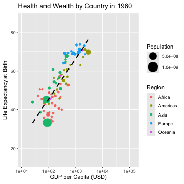
```


While GIF animations are quite cool, they cannot be easily paused to
investigate a single time stamp and as you might have noticed, creating
them using R is somewhat convoluted. Luckily we can easily animate an
interactive `plotly` visualization by specifying a `frame` argument.

``` r{ }

p <- plotly::plot_ly(data = animation_data,
                x = ~gdp_per_capita,
                y = ~life_expectancy,
                color = ~region_name,
                text = ~country_name,
                size = ~population,
                frame = ~year,
                type = "scatter",
                mode = "markers",
                sizes = c(5, 50),
                marker = list(symbol = "circle",
                              sizemode = "diameter")) %>%
    plotly::layout(xaxis = list(title = "GDP per Capita (USD)",
                                type = "log"),
                   yaxis = list(title = "Life Expectancy at Birth")) %>%
    plotly::animation_opts(frame = 100,
                           transition = 0)


print(p)
plot(p)
htmltools::tagList(p)


    
```

<div class="plotly html-widget html-fill-item" id="htmlwidget-63d59d125302a0c46fca" style="width:7200px;height:3000px;"></div>
<script type="application/json" data-for="htmlwidget-63d59d125302a0c46fca">{"x":{"visdat":{"183ba6fa0a045":["function () ","plotlyVisDat"]},"cur_data":"183ba6fa0a045","attrs":{"183ba6fa0a045":{"x":{},"y":{},"text":{},"mode":"markers","marker":{"symbol":"circle","sizemode":"diameter"},"color":{},"size":{},"frame":{},"alpha_stroke":1,"sizes":[5,50],"spans":[1,20],"type":"scatter"}},"layout":{"margin":{"b":40,"l":60,"t":25,"r":10},"xaxis":{"domain":[0,1],"automargin":true,"title":"GDP per Capita (USD)","type":"log","range":[0.86888451620702223,5.3288975838656407]},"yaxis":{"domain":[0,1],"automargin":true,"title":"Life Expectancy at Birth","range":[10.528021951219511,89.067539024390285]},"hovermode":"closest","showlegend":true,"sliders":[{"currentvalue":{"prefix":"year: ","xanchor":"right","font":{"size":16,"color":"rgba(204,204,204,1)"}},"steps":[{"method":"animate","args":[["1960"],{"transition":{"duration":0,"easing":"linear"},"frame":{"duration":100,"redraw":true},"mode":"immediate"}],"label":"1960","value":"1960"},{"method":"animate","args":[["1961"],{"transition":{"duration":0,"easing":"linear"},"frame":{"duration":100,"redraw":true},"mode":"immediate"}],"label":"1961","value":"1961"},{"method":"animate","args":[["1962"],{"transition":{"duration":0,"easing":"linear"},"frame":{"duration":100,"redraw":true},"mode":"immediate"}],"label":"1962","value":"1962"},{"method":"animate","args":[["1963"],{"transition":{"duration":0,"easing":"linear"},"frame":{"duration":100,"redraw":true},"mode":"immediate"}],"label":"1963","value":"1963"},{"method":"animate","args":[["1964"],{"transition":{"duration":0,"easing":"linear"},"frame":{"duration":100,"redraw":true},"mode":"immediate"}],"label":"1964","value":"1964"},{"method":"animate","args":[["1965"],{"transition":{"duration":0,"easing":"linear"},"frame":{"duration":100,"redraw":true},"mode":"immediate"}],"label":"1965","value":"1965"},{"method":"animate","args":[["1966"],{"transition":{"duration":0,"easing":"linear"},"frame":{"duration":100,"redraw":true},"mode":"immediate"}],"label":"1966","value":"1966"},{"method":"animate","args":[["1967"],{"transition":{"duration":0,"easing":"linear"},"frame":{"duration":100,"redraw":true},"mode":"immediate"}],"label":"1967","value":"1967"},{"method":"animate","args":[["1968"],{"transition":{"duration":0,"easing":"linear"},"frame":{"duration":100,"redraw":true},"mode":"immediate"}],"label":"1968","value":"1968"},{"method":"animate","args":[["1969"],{"transition":{"duration":0,"easing":"linear"},"frame":{"duration":100,"redraw":true},"mode":"immediate"}],"label":"1969","value":"1969"},{"method":"animate","args":[["1970"],{"transition":{"duration":0,"easing":"linear"},"frame":{"duration":100,"redraw":true},"mode":"immediate"}],"label":"1970","value":"1970"},{"method":"animate","args":[["1971"],{"transition":{"duration":0,"easing":"linear"},"frame":{"duration":100,"redraw":true},"mode":"immediate"}],"label":"1971","value":"1971"},{"method":"animate","args":[["1972"],{"transition":{"duration":0,"easing":"linear"},"frame":{"duration":100,"redraw":true},"mode":"immediate"}],"label":"1972","value":"1972"},{"method":"animate","args":[["1973"],{"transition":{"duration":0,"easing":"linear"},"frame":{"duration":100,"redraw":true},"mode":"immediate"}],"label":"1973","value":"1973"},{"method":"animate","args":[["1974"],{"transition":{"duration":0,"easing":"linear"},"frame":{"duration":100,"redraw":true},"mode":"immediate"}],"label":"1974","value":"1974"},{"method":"animate","args":[["1975"],{"transition":{"duration":0,"easing":"linear"},"frame":{"duration":100,"redraw":true},"mode":"immediate"}],"label":"1975","value":"1975"},{"method":"animate","args":[["1976"],{"transition":{"duration":0,"easing":"linear"},"frame":{"duration":100,"redraw":true},"mode":"immediate"}],"label":"1976","value":"1976"},{"method":"animate","args":[["1977"],{"transition":{"duration":0,"easing":"linear"},"frame":{"duration":100,"redraw":true},"mode":"immediate"}],"label":"1977","value":"1977"},{"method":"animate","args":[["1978"],{"transition":{"duration":0,"easing":"linear"},"frame":{"duration":100,"redraw":true},"mode":"immediate"}],"label":"1978","value":"1978"},{"method":"animate","args":[["1979"],{"transition":{"duration":0,"easing":"linear"},"frame":{"duration":100,"redraw":true},"mode":"immediate"}],"label":"1979","value":"1979"},{"method":"animate","args":[["1980"],{"transition":{"duration":0,"easing":"linear"},"frame":{"duration":100,"redraw":true},"mode":"immediate"}],"label":"1980","value":"1980"},{"method":"animate","args":[["1981"],{"transition":{"duration":0,"easing":"linear"},"frame":{"duration":100,"redraw":true},"mode":"immediate"}],"label":"1981","value":"1981"},{"method":"animate","args":[["1982"],{"transition":{"duration":0,"easing":"linear"},"frame":{"duration":100,"redraw":true},"mode":"immediate"}],"label":"1982","value":"1982"},{"method":"animate","args":[["1983"],{"transition":{"duration":0,"easing":"linear"},"frame":{"duration":100,"redraw":true},"mode":"immediate"}],"label":"1983","value":"1983"},{"method":"animate","args":[["1984"],{"transition":{"duration":0,"easing":"linear"},"frame":{"duration":100,"redraw":true},"mode":"immediate"}],"label":"1984","value":"1984"},{"method":"animate","args":[["1985"],{"transition":{"duration":0,"easing":"linear"},"frame":{"duration":100,"redraw":true},"mode":"immediate"}],"label":"1985","value":"1985"},{"method":"animate","args":[["1986"],{"transition":{"duration":0,"easing":"linear"},"frame":{"duration":100,"redraw":true},"mode":"immediate"}],"label":"1986","value":"1986"},{"method":"animate","args":[["1987"],{"transition":{"duration":0,"easing":"linear"},"frame":{"duration":100,"redraw":true},"mode":"immediate"}],"label":"1987","value":"1987"},{"method":"animate","args":[["1988"],{"transition":{"duration":0,"easing":"linear"},"frame":{"duration":100,"redraw":true},"mode":"immediate"}],"label":"1988","value":"1988"},{"method":"animate","args":[["1989"],{"transition":{"duration":0,"easing":"linear"},"frame":{"duration":100,"redraw":true},"mode":"immediate"}],"label":"1989","value":"1989"},{"method":"animate","args":[["1990"],{"transition":{"duration":0,"easing":"linear"},"frame":{"duration":100,"redraw":true},"mode":"immediate"}],"label":"1990","value":"1990"},{"method":"animate","args":[["1991"],{"transition":{"duration":0,"easing":"linear"},"frame":{"duration":100,"redraw":true},"mode":"immediate"}],"label":"1991","value":"1991"},{"method":"animate","args":[["1992"],{"transition":{"duration":0,"easing":"linear"},"frame":{"duration":100,"redraw":true},"mode":"immediate"}],"label":"1992","value":"1992"},{"method":"animate","args":[["1993"],{"transition":{"duration":0,"easing":"linear"},"frame":{"duration":100,"redraw":true},"mode":"immediate"}],"label":"1993","value":"1993"},{"method":"animate","args":[["1994"],{"transition":{"duration":0,"easing":"linear"},"frame":{"duration":100,"redraw":true},"mode":"immediate"}],"label":"1994","value":"1994"},{"method":"animate","args":[["1995"],{"transition":{"duration":0,"easing":"linear"},"frame":{"duration":100,"redraw":true},"mode":"immediate"}],"label":"1995","value":"1995"},{"method":"animate","args":[["1996"],{"transition":{"duration":0,"easing":"linear"},"frame":{"duration":100,"redraw":true},"mode":"immediate"}],"label":"1996","value":"1996"},{"method":"animate","args":[["1997"],{"transition":{"duration":0,"easing":"linear"},"frame":{"duration":100,"redraw":true},"mode":"immediate"}],"label":"1997","value":"1997"},{"method":"animate","args":[["1998"],{"transition":{"duration":0,"easing":"linear"},"frame":{"duration":100,"redraw":true},"mode":"immediate"}],"label":"1998","value":"1998"},{"method":"animate","args":[["1999"],{"transition":{"duration":0,"easing":"linear"},"frame":{"duration":100,"redraw":true},"mode":"immediate"}],"label":"1999","value":"1999"},{"method":"animate","args":[["2000"],{"transition":{"duration":0,"easing":"linear"},"frame":{"duration":100,"redraw":true},"mode":"immediate"}],"label":"2000","value":"2000"},{"method":"animate","args":[["2001"],{"transition":{"duration":0,"easing":"linear"},"frame":{"duration":100,"redraw":true},"mode":"immediate"}],"label":"2001","value":"2001"},{"method":"animate","args":[["2002"],{"transition":{"duration":0,"easing":"linear"},"frame":{"duration":100,"redraw":true},"mode":"immediate"}],"label":"2002","value":"2002"},{"method":"animate","args":[["2003"],{"transition":{"duration":0,"easing":"linear"},"frame":{"duration":100,"redraw":true},"mode":"immediate"}],"label":"2003","value":"2003"},{"method":"animate","args":[["2004"],{"transition":{"duration":0,"easing":"linear"},"frame":{"duration":100,"redraw":true},"mode":"immediate"}],"label":"2004","value":"2004"},{"method":"animate","args":[["2005"],{"transition":{"duration":0,"easing":"linear"},"frame":{"duration":100,"redraw":true},"mode":"immediate"}],"label":"2005","value":"2005"},{"method":"animate","args":[["2006"],{"transition":{"duration":0,"easing":"linear"},"frame":{"duration":100,"redraw":true},"mode":"immediate"}],"label":"2006","value":"2006"},{"method":"animate","args":[["2007"],{"transition":{"duration":0,"easing":"linear"},"frame":{"duration":100,"redraw":true},"mode":"immediate"}],"label":"2007","value":"2007"},{"method":"animate","args":[["2008"],{"transition":{"duration":0,"easing":"linear"},"frame":{"duration":100,"redraw":true},"mode":"immediate"}],"label":"2008","value":"2008"},{"method":"animate","args":[["2009"],{"transition":{"duration":0,"easing":"linear"},"frame":{"duration":100,"redraw":true},"mode":"immediate"}],"label":"2009","value":"2009"},{"method":"animate","args":[["2010"],{"transition":{"duration":0,"easing":"linear"},"frame":{"duration":100,"redraw":true},"mode":"immediate"}],"label":"2010","value":"2010"},{"method":"animate","args":[["2011"],{"transition":{"duration":0,"easing":"linear"},"frame":{"duration":100,"redraw":true},"mode":"immediate"}],"label":"2011","value":"2011"},{"method":"animate","args":[["2012"],{"transition":{"duration":0,"easing":"linear"},"frame":{"duration":100,"redraw":true},"mode":"immediate"}],"label":"2012","value":"2012"},{"method":"animate","args":[["2013"],{"transition":{"duration":0,"easing":"linear"},"frame":{"duration":100,"redraw":true},"mode":"immediate"}],"label":"2013","value":"2013"},{"method":"animate","args":[["2014"],{"transition":{"duration":0,"easing":"linear"},"frame":{"duration":100,"redraw":true},"mode":"immediate"}],"label":"2014","value":"2014"},{"method":"animate","args":[["2015"],{"transition":{"duration":0,"easing":"linear"},"frame":{"duration":100,"redraw":true},"mode":"immediate"}],"label":"2015","value":"2015"},{"method":"animate","args":[["2016"],{"transition":{"duration":0,"easing":"linear"},"frame":{"duration":100,"redraw":true},"mode":"immediate"}],"label":"2016","value":"2016"},{"method":"animate","args":[["2017"],{"transition":{"duration":0,"easing":"linear"},"frame":{"duration":100,"redraw":true},"mode":"immediate"}],"label":"2017","value":"2017"},{"method":"animate","args":[["2018"],{"transition":{"duration":0,"easing":"linear"},"frame":{"duration":100,"redraw":true},"mode":"immediate"}],"label":"2018","value":"2018"},{"method":"animate","args":[["2019"],{"transition":{"duration":0,"easing":"linear"},"frame":{"duration":100,"redraw":true},"mode":"immediate"}],"label":"2019","value":"2019"},{"method":"animate","args":[["2020"],{"transition":{"duration":0,"easing":"linear"},"frame":{"duration":100,"redraw":true},"mode":"immediate"}],"label":"2020","value":"2020"},{"method":"animate","args":[["2021"],{"transition":{"duration":0,"easing":"linear"},"frame":{"duration":100,"redraw":true},"mode":"immediate"}],"label":"2021","value":"2021"}],"visible":true,"pad":{"t":40}}],"updatemenus":[{"type":"buttons","direction":"right","showactive":false,"y":0,"x":0,"yanchor":"top","xanchor":"right","pad":{"t":60,"r":5},"buttons":[{"label":"Play","method":"animate","args":[null,{"fromcurrent":true,"mode":"immediate","transition":{"duration":0,"easing":"linear"},"frame":{"duration":100,"redraw":true}}]}]}]},"source":"A","config":{"modeBarButtonsToAdd":["hoverclosest","hovercompare"],"showSendToCloud":false},"data":[{"x":[239.0330058072843,173.08359038432769,135.35298596845456,71.360224245875301,102.07986772691973,132.67028415414691,40.119192410933728,55.529337122061435,228.56739853114192,276.64336325732796,120.01819375326637,66.770095213127959,103.53748162490623,124.78235887044528,275.58533876153427,59.297112603283125,101.65286531309059,46.866637619647541,529.56192274536738,90.035831313058949,69.083195332133599,147.27783382114595,177.08773653974745,128.53059096688111,93.397047715008043,306.64164219310169,139.98612554946314,73.350183587303732],"y":[40.531999999999996,42.017000000000003,46.603000000000002,43.024000000000001,48.68,43.241,47.177999999999997,45.506,49.042000000000002,53.234999999999999,34.819000000000003,39.235999999999997,38.374000000000002,47.978999999999999,46.575000000000003,50.372,45.813000000000002,50.363999999999997,52.668999999999997,38.180999999999997,35.872,38.107999999999997,47.095999999999997,36.404000000000003,37.371000000000002,39.878,33.960999999999999,42.692],"text":["Algeria","Morocco","Sudan","Burundi","Kenya","Madagascar","Rwanda","Uganda","Zambia","Zimbabwe","Cameroon","Central African Republic","Chad","Congo, Rep.","Gabon","Botswana","Eswatini","Lesotho","South Africa","Benin","Burkina Faso","Cote d'Ivoire","Ghana","Niger","Nigeria","Senegal","Sierra Leone","Togo"],"mode":"markers","marker":{"color":"rgba(102,194,165,1)","size":[5.3617591063451879,5.3737224159946395,5.2640099574412291,5.086222610125648,5.2456881713513859,5.1603574876187821,5.0932175077347122,5.2414285083084931,5.0981010062668126,5.1199867062937541,5.1617679121432882,5.0522285305793755,5.0952097411377588,5.0323452280864913,5.0150645166569676,5.0150493819791304,5.009702857892651,5.0222175796150506,5.525090446640295,5.0787558291928594,5.1511147239323813,5.1168753670177081,5.2189260781253077,5.1101450554397161,6.4302366143566934,5.1029997669266693,5.0720336744096608,5.0513248787938174],"sizemode":"diameter","symbol":"circle","line":{"color":"rgba(102,194,165,1)"}},"frame":"1960","type":"scatter","name":"Africa","textfont":{"color":"rgba(102,194,165,1)","size":[5.3617591063451879,5.3737224159946395,5.2640099574412291,5.086222610125648,5.2456881713513859,5.1603574876187821,5.0932175077347122,5.2414285083084931,5.0981010062668126,5.1199867062937541,5.1617679121432882,5.0522285305793755,5.0952097411377588,5.0323452280864913,5.0150645166569676,5.0150493819791304,5.009702857892651,5.0222175796150506,5.525090446640295,5.0787558291928594,5.1511147239323813,5.1168753670177081,5.2189260781253077,5.1101450554397161,6.4302366143566934,5.1029997669266693,5.0720336744096608,5.0513248787938174]},"error_y":{"color":"rgba(102,194,165,1)","width":[]},"error_x":{"color":"rgba(102,194,165,1)","width":[]},"line":{"color":"rgba(102,194,165,1)"},"xaxis":"x","yaxis":"y","visible":true},{"x":[1483.0036818220699,203.87975091729251,70.027548308699068,425.65376916970331,717.51484308736212,218.26042622797917,155.29449376738688,632.38522724866391,307.1286289561404,376.96878560297392,252.75617116506172,161.47755935797696,359.54505969509529,476.62142221441383,100.67390152163915,504.80113782913401,256.9628473385651,448.11479741438473,297.58604368269374,371.27975081595849,477.78699082899271,1902.4020853353873,2259.2505108864216,3007.1234453786165],"y":[62.896000000000001,50.264000000000003,43.499000000000002,64.042000000000002,68.933999999999997,55.908999999999999,56.442999999999998,63.026000000000003,58.162999999999997,60.414999999999999,45.808,48.317,55.017000000000003,60.701999999999998,43.100000000000001,57.015000000000001,57.130000000000003,53.363999999999997,58.033999999999999,57.101999999999997,67.772000000000006,67.162000000000006,71.133170731707295,69.770731707317097],"text":["Bahamas, The","Dominican Republic","Haiti","Jamaica","Puerto Rico","St. Kitts and Nevis","St. Vincent and the Grenadines","Trinidad and Tobago","Belize","Costa Rica","Guatemala","Honduras","Mexico","Panama","Bolivia","Chile","Colombia","Ecuador","Guyana","Suriname","Uruguay","Bermuda","Canada","United States"],"mode":"markers","marker":{"color":"rgba(252,141,98,1)","size":[5.0023564852704876,5.1037913583712733,5.1230081933771672,5.0510369694276349,5.0738399583814271,5.0005135594471151,5.0013891722505743,5.0256977589556087,5.0016205575778452,5.041604751437192,5.1302645863567786,5.0649381232273587,6.154298395993635,5.0346168954361312,5.1168388526160209,5.2581268054723633,5.4985568711183186,5.1458541966784965,5.0169332510888625,5.0072599934398125,5.0792891115148819,5.0001229254465178,5.5693447225733825,10.755334293496649],"sizemode":"diameter","symbol":"circle","line":{"color":"rgba(252,141,98,1)"}},"frame":"1960","type":"scatter","name":"Americas","textfont":{"color":"rgba(252,141,98,1)","size":[5.0023564852704876,5.1037913583712733,5.1230081933771672,5.0510369694276349,5.0738399583814271,5.0005135594471151,5.0013891722505743,5.0256977589556087,5.0016205575778452,5.041604751437192,5.1302645863567786,5.0649381232273587,6.154298395993635,5.0346168954361312,5.1168388526160209,5.2581268054723633,5.4985568711183186,5.1458541966784965,5.0169332510888625,5.0072599934398125,5.0792891115148819,5.0001229254465178,5.5693447225733825,10.755334293496649]},"error_y":{"color":"rgba(252,141,98,1)","width":[]},"error_x":{"color":"rgba(252,141,98,1)","width":[]},"line":{"color":"rgba(252,141,98,1)"},"xaxis":"x","yaxis":"y","visible":true},{"x":[89.520214236848005,424.05655418969451,475.31907559217302,158.27413588122903,244.61102914742457,25.095809025846361,263.8371237951992,428.05618337129135,103.80095656727835,84.825337194691514,83.035101824089352,49.993839850672522,81.586947296201004,144.1018539164948,186.02428722674958,275.04169850244045],"y":[33.274999999999999,65.866292682926797,67.695609756097596,54.320243902439003,56.502000000000002,43.905999999999999,59.226999999999997,64.694682926829302,51.034999999999997,44.740000000000002,45.218000000000004,38.558999999999997,44.932000000000002,60.698999999999998,53.546999999999997,50.740000000000002],"text":["China","Hong Kong SAR, China","Japan","Korea, Rep.","Malaysia","Myanmar","Philippines","Singapore","Thailand","Bangladesh","India","Nepal","Pakistan","Sri Lanka","Syrian Arab Republic","Turkiye"],"mode":"markers","marker":{"color":"rgba(141,160,203,1)","size":[26.253212536281577,5.0979493727261245,7.9688011350757719,5.7956644891031441,5.2483119509637177,5.6907834976525544,5.9063705790846646,5.0511666178573602,5.8461413480008853,6.6044634251580208,19.207926932774726,5.3226840446178993,6.4629238224373458,5.3104466220559567,5.1456169486549692,5.8752762719495149],"sizemode":"diameter","symbol":"circle","line":{"color":"rgba(141,160,203,1)"}},"frame":"1960","type":"scatter","name":"Asia","textfont":{"color":"rgba(141,160,203,1)","size":[26.253212536281577,5.0979493727261245,7.9688011350757719,5.7956644891031441,5.2483119509637177,5.6907834976525544,5.9063705790846646,5.0511666178573602,5.8461413480008853,6.6044634251580208,19.207926932774726,5.3226840446178993,6.4629238224373458,5.3104466220559567,5.1456169486549692,5.8752762719495149]},"error_y":{"color":"rgba(141,160,203,1)","width":[]},"error_x":{"color":"rgba(141,160,203,1)","width":[]},"line":{"color":"rgba(141,160,203,1)"},"xaxis":"x","yaxis":"y","visible":true},{"x":[1179.3530109999404,1414.9822694062104,685.61471237976036,1441.755660026326,2114.0029726919179,1397.5948032844046,520.32274431038229,804.49262334617742,360.49929850685777,396.39225333761283,935.46042685041539,1273.6916591028842,1333.8815728668171,2242.0158166161036,1068.7845872373543],"y":[68.819756097560997,73.762048780487802,70.194268292682906,73.549756097561001,73.005609756097599,71.126829268292695,69.299999999999997,69.123902439024405,64.007463414634202,69.109268292682899,68.585609756097597,69.701951219512196,69.868292682926807,68.592536585365906,73.392682926829295],"text":["Finland","Iceland","Ireland","Norway","Sweden","United Kingdom","Greece","Italy","Portugal","Spain","Austria","Belgium","France","Luxembourg","Netherlands"],"mode":"markers","marker":{"color":"rgba(231,138,195,1)","size":[5.1398473545636021,5.0043024543530716,5.0888344413081077,5.1128153861348276,5.2371879308909159,6.6683021653872876,5.264177649671665,6.5981951513975385,5.2809370272090383,5.9690800493099205,5.2232602993705974,5.2903610884046888,6.4850905813973423,5.0087120940877101,5.3647007779170597],"sizemode":"diameter","symbol":"circle","line":{"color":"rgba(231,138,195,1)"}},"frame":"1960","type":"scatter","name":"Europe","textfont":{"color":"rgba(231,138,195,1)","size":[5.1398473545636021,5.0043024543530716,5.0888344413081077,5.1128153861348276,5.2371879308909159,6.6683021653872876,5.264177649671665,6.5981951513975385,5.2809370272090383,5.9690800493099205,5.2232602993705974,5.2903610884046888,6.4850905813973423,5.0087120940877101,5.3647007779170597]},"error_y":{"color":"rgba(231,138,195,1)","width":[]},"error_x":{"color":"rgba(231,138,195,1)","width":[]},"line":{"color":"rgba(231,138,195,1)"},"xaxis":"x","yaxis":"y","visible":true},{"x":[1810.5974427860929,279.53449775678439,116.07996353836245],"y":[70.817073170731703,57.588000000000001,45.679000000000002],"text":["Australia","Fiji","Papua New Guinea"],"mode":"markers","marker":{"color":"rgba(166,216,84,1)","size":[5.3261422707099744,5.0115118820376683,5.0619764738807413],"sizemode":"diameter","symbol":"circle","line":{"color":"rgba(166,216,84,1)"}},"frame":"1960","type":"scatter","name":"Oceania","textfont":{"color":"rgba(166,216,84,1)","size":[5.3261422707099744,5.0115118820376683,5.0619764738807413]},"error_y":{"color":"rgba(166,216,84,1)","width":[]},"error_x":{"color":"rgba(166,216,84,1)","width":[]},"line":{"color":"rgba(166,216,84,1)"},"xaxis":"x","yaxis":"y","visible":true}],"highlight":{"on":"plotly_click","persistent":false,"dynamic":false,"selectize":false,"opacityDim":0.20000000000000001,"selected":{"opacity":1},"debounce":0},"frames":[{"name":"1960","data":[{"x":[239.0330058072843,173.08359038432769,135.35298596845456,71.360224245875301,102.07986772691973,132.67028415414691,40.119192410933728,55.529337122061435,228.56739853114192,276.64336325732796,120.01819375326637,66.770095213127959,103.53748162490623,124.78235887044528,275.58533876153427,59.297112603283125,101.65286531309059,46.866637619647541,529.56192274536738,90.035831313058949,69.083195332133599,147.27783382114595,177.08773653974745,128.53059096688111,93.397047715008043,306.64164219310169,139.98612554946314,73.350183587303732],"y":[40.531999999999996,42.017000000000003,46.603000000000002,43.024000000000001,48.68,43.241,47.177999999999997,45.506,49.042000000000002,53.234999999999999,34.819000000000003,39.235999999999997,38.374000000000002,47.978999999999999,46.575000000000003,50.372,45.813000000000002,50.363999999999997,52.668999999999997,38.180999999999997,35.872,38.107999999999997,47.095999999999997,36.404000000000003,37.371000000000002,39.878,33.960999999999999,42.692],"text":["Algeria","Morocco","Sudan","Burundi","Kenya","Madagascar","Rwanda","Uganda","Zambia","Zimbabwe","Cameroon","Central African Republic","Chad","Congo, Rep.","Gabon","Botswana","Eswatini","Lesotho","South Africa","Benin","Burkina Faso","Cote d'Ivoire","Ghana","Niger","Nigeria","Senegal","Sierra Leone","Togo"],"mode":"markers","marker":{"color":"rgba(102,194,165,1)","size":[5.3617591063451879,5.3737224159946395,5.2640099574412291,5.086222610125648,5.2456881713513859,5.1603574876187821,5.0932175077347122,5.2414285083084931,5.0981010062668126,5.1199867062937541,5.1617679121432882,5.0522285305793755,5.0952097411377588,5.0323452280864913,5.0150645166569676,5.0150493819791304,5.009702857892651,5.0222175796150506,5.525090446640295,5.0787558291928594,5.1511147239323813,5.1168753670177081,5.2189260781253077,5.1101450554397161,6.4302366143566934,5.1029997669266693,5.0720336744096608,5.0513248787938174],"sizemode":"diameter","symbol":"circle","line":{"color":"rgba(102,194,165,1)"}},"frame":"1960","type":"scatter","name":"Africa","textfont":{"color":"rgba(102,194,165,1)","size":[5.3617591063451879,5.3737224159946395,5.2640099574412291,5.086222610125648,5.2456881713513859,5.1603574876187821,5.0932175077347122,5.2414285083084931,5.0981010062668126,5.1199867062937541,5.1617679121432882,5.0522285305793755,5.0952097411377588,5.0323452280864913,5.0150645166569676,5.0150493819791304,5.009702857892651,5.0222175796150506,5.525090446640295,5.0787558291928594,5.1511147239323813,5.1168753670177081,5.2189260781253077,5.1101450554397161,6.4302366143566934,5.1029997669266693,5.0720336744096608,5.0513248787938174]},"error_y":{"color":"rgba(102,194,165,1)","width":[]},"error_x":{"color":"rgba(102,194,165,1)","width":[]},"line":{"color":"rgba(102,194,165,1)"},"xaxis":"x","yaxis":"y","visible":true},{"x":[1483.0036818220699,203.87975091729251,70.027548308699068,425.65376916970331,717.51484308736212,218.26042622797917,155.29449376738688,632.38522724866391,307.1286289561404,376.96878560297392,252.75617116506172,161.47755935797696,359.54505969509529,476.62142221441383,100.67390152163915,504.80113782913401,256.9628473385651,448.11479741438473,297.58604368269374,371.27975081595849,477.78699082899271,1902.4020853353873,2259.2505108864216,3007.1234453786165],"y":[62.896000000000001,50.264000000000003,43.499000000000002,64.042000000000002,68.933999999999997,55.908999999999999,56.442999999999998,63.026000000000003,58.162999999999997,60.414999999999999,45.808,48.317,55.017000000000003,60.701999999999998,43.100000000000001,57.015000000000001,57.130000000000003,53.363999999999997,58.033999999999999,57.101999999999997,67.772000000000006,67.162000000000006,71.133170731707295,69.770731707317097],"text":["Bahamas, The","Dominican Republic","Haiti","Jamaica","Puerto Rico","St. Kitts and Nevis","St. Vincent and the Grenadines","Trinidad and Tobago","Belize","Costa Rica","Guatemala","Honduras","Mexico","Panama","Bolivia","Chile","Colombia","Ecuador","Guyana","Suriname","Uruguay","Bermuda","Canada","United States"],"mode":"markers","marker":{"color":"rgba(252,141,98,1)","size":[5.0023564852704876,5.1037913583712733,5.1230081933771672,5.0510369694276349,5.0738399583814271,5.0005135594471151,5.0013891722505743,5.0256977589556087,5.0016205575778452,5.041604751437192,5.1302645863567786,5.0649381232273587,6.154298395993635,5.0346168954361312,5.1168388526160209,5.2581268054723633,5.4985568711183186,5.1458541966784965,5.0169332510888625,5.0072599934398125,5.0792891115148819,5.0001229254465178,5.5693447225733825,10.755334293496649],"sizemode":"diameter","symbol":"circle","line":{"color":"rgba(252,141,98,1)"}},"frame":"1960","type":"scatter","name":"Americas","textfont":{"color":"rgba(252,141,98,1)","size":[5.0023564852704876,5.1037913583712733,5.1230081933771672,5.0510369694276349,5.0738399583814271,5.0005135594471151,5.0013891722505743,5.0256977589556087,5.0016205575778452,5.041604751437192,5.1302645863567786,5.0649381232273587,6.154298395993635,5.0346168954361312,5.1168388526160209,5.2581268054723633,5.4985568711183186,5.1458541966784965,5.0169332510888625,5.0072599934398125,5.0792891115148819,5.0001229254465178,5.5693447225733825,10.755334293496649]},"error_y":{"color":"rgba(252,141,98,1)","width":[]},"error_x":{"color":"rgba(252,141,98,1)","width":[]},"line":{"color":"rgba(252,141,98,1)"},"xaxis":"x","yaxis":"y","visible":true},{"x":[89.520214236848005,424.05655418969451,475.31907559217302,158.27413588122903,244.61102914742457,25.095809025846361,263.8371237951992,428.05618337129135,103.80095656727835,84.825337194691514,83.035101824089352,49.993839850672522,81.586947296201004,144.1018539164948,186.02428722674958,275.04169850244045],"y":[33.274999999999999,65.866292682926797,67.695609756097596,54.320243902439003,56.502000000000002,43.905999999999999,59.226999999999997,64.694682926829302,51.034999999999997,44.740000000000002,45.218000000000004,38.558999999999997,44.932000000000002,60.698999999999998,53.546999999999997,50.740000000000002],"text":["China","Hong Kong SAR, China","Japan","Korea, Rep.","Malaysia","Myanmar","Philippines","Singapore","Thailand","Bangladesh","India","Nepal","Pakistan","Sri Lanka","Syrian Arab Republic","Turkiye"],"mode":"markers","marker":{"color":"rgba(141,160,203,1)","size":[26.253212536281577,5.0979493727261245,7.9688011350757719,5.7956644891031441,5.2483119509637177,5.6907834976525544,5.9063705790846646,5.0511666178573602,5.8461413480008853,6.6044634251580208,19.207926932774726,5.3226840446178993,6.4629238224373458,5.3104466220559567,5.1456169486549692,5.8752762719495149],"sizemode":"diameter","symbol":"circle","line":{"color":"rgba(141,160,203,1)"}},"frame":"1960","type":"scatter","name":"Asia","textfont":{"color":"rgba(141,160,203,1)","size":[26.253212536281577,5.0979493727261245,7.9688011350757719,5.7956644891031441,5.2483119509637177,5.6907834976525544,5.9063705790846646,5.0511666178573602,5.8461413480008853,6.6044634251580208,19.207926932774726,5.3226840446178993,6.4629238224373458,5.3104466220559567,5.1456169486549692,5.8752762719495149]},"error_y":{"color":"rgba(141,160,203,1)","width":[]},"error_x":{"color":"rgba(141,160,203,1)","width":[]},"line":{"color":"rgba(141,160,203,1)"},"xaxis":"x","yaxis":"y","visible":true},{"x":[1179.3530109999404,1414.9822694062104,685.61471237976036,1441.755660026326,2114.0029726919179,1397.5948032844046,520.32274431038229,804.49262334617742,360.49929850685777,396.39225333761283,935.46042685041539,1273.6916591028842,1333.8815728668171,2242.0158166161036,1068.7845872373543],"y":[68.819756097560997,73.762048780487802,70.194268292682906,73.549756097561001,73.005609756097599,71.126829268292695,69.299999999999997,69.123902439024405,64.007463414634202,69.109268292682899,68.585609756097597,69.701951219512196,69.868292682926807,68.592536585365906,73.392682926829295],"text":["Finland","Iceland","Ireland","Norway","Sweden","United Kingdom","Greece","Italy","Portugal","Spain","Austria","Belgium","France","Luxembourg","Netherlands"],"mode":"markers","marker":{"color":"rgba(231,138,195,1)","size":[5.1398473545636021,5.0043024543530716,5.0888344413081077,5.1128153861348276,5.2371879308909159,6.6683021653872876,5.264177649671665,6.5981951513975385,5.2809370272090383,5.9690800493099205,5.2232602993705974,5.2903610884046888,6.4850905813973423,5.0087120940877101,5.3647007779170597],"sizemode":"diameter","symbol":"circle","line":{"color":"rgba(231,138,195,1)"}},"frame":"1960","type":"scatter","name":"Europe","textfont":{"color":"rgba(231,138,195,1)","size":[5.1398473545636021,5.0043024543530716,5.0888344413081077,5.1128153861348276,5.2371879308909159,6.6683021653872876,5.264177649671665,6.5981951513975385,5.2809370272090383,5.9690800493099205,5.2232602993705974,5.2903610884046888,6.4850905813973423,5.0087120940877101,5.3647007779170597]},"error_y":{"color":"rgba(231,138,195,1)","width":[]},"error_x":{"color":"rgba(231,138,195,1)","width":[]},"line":{"color":"rgba(231,138,195,1)"},"xaxis":"x","yaxis":"y","visible":true},{"x":[1810.5974427860929,279.53449775678439,116.07996353836245],"y":[70.817073170731703,57.588000000000001,45.679000000000002],"text":["Australia","Fiji","Papua New Guinea"],"mode":"markers","marker":{"color":"rgba(166,216,84,1)","size":[5.3261422707099744,5.0115118820376683,5.0619764738807413],"sizemode":"diameter","symbol":"circle","line":{"color":"rgba(166,216,84,1)"}},"frame":"1960","type":"scatter","name":"Oceania","textfont":{"color":"rgba(166,216,84,1)","size":[5.3261422707099744,5.0115118820376683,5.0619764738807413]},"error_y":{"color":"rgba(166,216,84,1)","width":[]},"error_x":{"color":"rgba(166,216,84,1)","width":[]},"line":{"color":"rgba(166,216,84,1)"},"xaxis":"x","yaxis":"y","visible":true}],"traces":[0,1,2,3,4]},{"name":"1961","data":[{"x":[209.91717764236708,167.66608671787023,142.64816611745394,72.088782132776885,98.535250559021776,134.29309421985755,40.04393541242294,56.328058773770678,216.27467362780612,279.33265613028379,125.52558591105647,71.993203472219363,108.16464915329715,139.99575323794687,322.7971230622245,62.742991299602593,121.89682095578078,46.918412816493337,543.04222367471277,92.374859873958926,72.173766181674097,160.65271720941234,184.25289233305702,134.84557546473923,97.420968283805905,314.50830629317909,140.09830925925294,75.290309840399146],"y":[40.515999999999998,43.795000000000002,47.023000000000003,43.252000000000002,49.533000000000001,43.636000000000003,47.664000000000001,46.256999999999998,49.451999999999998,53.619,35.405999999999999,39.737000000000002,38.631,48.697000000000003,47.228000000000002,50.890999999999998,46.191000000000003,50.429000000000002,53.085000000000001,38.542000000000002,36.240000000000002,38.744,47.325000000000003,36.555999999999997,37.673000000000002,39.917000000000002,34.411999999999999,42.881999999999998],"text":["Algeria","Morocco","Sudan","Burundi","Kenya","Madagascar","Rwanda","Uganda","Zambia","Zimbabwe","Cameroon","Central African Republic","Chad","Congo, Rep.","Gabon","Botswana","Eswatini","Lesotho","South Africa","Benin","Burkina Faso","Cote d'Ivoire","Ghana","Niger","Nigeria","Senegal","Sierra Leone","Togo"],"mode":"markers","marker":{"color":"rgba(102,194,165,1)","size":[5.3682686428016346,5.3836615660364284,5.272008331984618,5.0884320819149966,5.2551205805167065,5.1645919155777857,5.0957821824472802,5.2484603663939611,5.1012879233446062,5.123798797084901,5.1644044367474828,5.0532046695061537,5.0970886397006643,5.0332290295472228,5.0152553410476344,5.015417011269415,5.0099547626568208,5.0229522328085068,5.5400346824365565,5.0799962992508743,5.1533315240920512,5.1213257588638275,5.2252195232447187,5.1134937701892085,6.4597783903080659,5.1059918130788793,5.0733003672884323,5.0521985798484979],"sizemode":"diameter","symbol":"circle","line":{"color":"rgba(102,194,165,1)"}},"frame":"1961","type":"scatter","name":"Africa","textfont":{"color":"rgba(102,194,165,1)","size":[5.3682686428016346,5.3836615660364284,5.272008331984618,5.0884320819149966,5.2551205805167065,5.1645919155777857,5.0957821824472802,5.2484603663939611,5.1012879233446062,5.123798797084901,5.1644044367474828,5.0532046695061537,5.0970886397006643,5.0332290295472228,5.0152553410476344,5.015417011269415,5.0099547626568208,5.0229522328085068,5.5400346824365565,5.0799962992508743,5.1533315240920512,5.1213257588638275,5.2252195232447187,5.1134937701892085,6.4597783903080659,5.1059918130788793,5.0733003672884323,5.0521985798484979]},"error_y":{"color":"rgba(102,194,165,1)","width":[]},"error_x":{"color":"rgba(102,194,165,1)","width":[]},"line":{"color":"rgba(102,194,165,1)"},"xaxis":"x","yaxis":"y","visible":true},{"x":[1581.303979634042,191.90744084860557,68.193836622984676,449.61184212485745,777.21502740734138,221.9372077635785,163.42498774411669,676.23384290057083,319.60280261740456,351.20108586276928,253.22729003499839,166.45419845901358,378.21202774612584,516.03186335318117,107.27277723407448,580.88864667534324,280.57913740150451,369.11467347933825,315.75005543039123,387.45327716400033,624.7186325846211,1961.5381346154397,2240.4330394585299,3066.5628691661541],"y":[63.185000000000002,50.840000000000003,43.914000000000001,64.394000000000005,69.262,55.817999999999998,57.932000000000002,62.865000000000002,53.356000000000002,60.901000000000003,46.469999999999999,48.729999999999997,55.831000000000003,61.470999999999997,43.399999999999999,57.536999999999999,57.729999999999997,53.895000000000003,58.460000000000001,57.767000000000003,67.894999999999996,64.111000000000004,71.346097560975593,70.270731707317097],"text":["Bahamas, The","Dominican Republic","Haiti","Jamaica","Puerto Rico","St. Kitts and Nevis","St. Vincent and the Grenadines","Trinidad and Tobago","Belize","Costa Rica","Guatemala","Honduras","Mexico","Panama","Bolivia","Chile","Colombia","Ecuador","Guyana","Suriname","Uruguay","Bermuda","Canada","United States"],"mode":"markers","marker":{"color":"rgba(252,141,98,1)","size":[5.0025386112042085,5.1073087849505505,5.1253594850634707,5.0517195593293316,5.0751693247576855,5.0005004002430162,5.0014377625320519,5.0262701684026503,5.0016955618549579,5.0431926499733883,5.1341846590914848,5.0668916437176215,6.1916177076418926,5.0356952173351708,5.1192995600574669,5.263598071166701,5.5143200682292095,5.1501030264783054,5.0174623912885297,5.0075650129575715,5.0803129167112271,5.0001579741741402,5.5808675971665327,10.851558982061409],"sizemode":"diameter","symbol":"circle","line":{"color":"rgba(252,141,98,1)"}},"frame":"1961","type":"scatter","name":"Americas","textfont":{"color":"rgba(252,141,98,1)","size":[5.0025386112042085,5.1073087849505505,5.1253594850634707,5.0517195593293316,5.0751693247576855,5.0005004002430162,5.0014377625320519,5.0262701684026503,5.0016955618549579,5.0431926499733883,5.1341846590914848,5.0668916437176215,6.1916177076418926,5.0356952173351708,5.1192995600574669,5.263598071166701,5.5143200682292095,5.1501030264783054,5.0174623912885297,5.0075650129575715,5.0803129167112271,5.0001579741741402,5.5808675971665327,10.851558982061409]},"error_y":{"color":"rgba(252,141,98,1)","width":[]},"error_x":{"color":"rgba(252,141,98,1)","width":[]},"line":{"color":"rgba(252,141,98,1)"},"xaxis":"x","yaxis":"y","visible":true},{"x":[75.805560791360378,436.75441152039389,568.90774269712188,93.83138319447545,235.52966575939729,27.274629750593306,278.4772670843231,449.14813682077602,110.73145649751243,92.855112937399312,85.969704185100795,51.321965344632069,87.517372474535605,144.1029502766508,198.9346960512203,282.74246410914748],"y":[40.468000000000004,66.5588780487805,68.351951219512202,54.923999999999999,57.433999999999997,44.384999999999998,59.619,65.517951219512199,52.363999999999997,45.661999999999999,45.398000000000003,38.854999999999997,45.783000000000001,61.328000000000003,54.436999999999998,51.549999999999997],"text":["China","Hong Kong SAR, China","Japan","Korea, Rep.","Malaysia","Myanmar","Philippines","Singapore","Thailand","Bangladesh","India","Nepal","Pakistan","Sri Lanka","Syrian Arab Republic","Turkiye"],"mode":"markers","marker":{"color":"rgba(141,160,203,1)","size":[26.038459423392013,5.0996517531517291,7.995533755508168,5.8196664631664374,5.255991541398136,5.7061543401889461,5.9336302049305898,5.0529509167181637,5.8717389950454111,6.6518219031717116,19.539210596927141,5.3289674211937399,6.4981856781866982,5.3180622963561834,5.1501038867652564,5.8989826577890287],"sizemode":"diameter","symbol":"circle","line":{"color":"rgba(141,160,203,1)"}},"frame":"1961","type":"scatter","name":"Asia","textfont":{"color":"rgba(141,160,203,1)","size":[26.038459423392013,5.0996517531517291,7.995533755508168,5.8196664631664374,5.255991541398136,5.7061543401889461,5.9336302049305898,5.0529509167181637,5.8717389950454111,6.6518219031717116,19.539210596927141,5.3289674211937399,6.4981856781866982,5.3180622963561834,5.1501038867652564,5.8989826577890287]},"error_y":{"color":"rgba(141,160,203,1)","width":[]},"error_x":{"color":"rgba(141,160,203,1)","width":[]},"line":{"color":"rgba(141,160,203,1)"},"xaxis":"x","yaxis":"y","visible":true},{"x":[1327.4272243659982,1418.1258697152584,739.27640644266739,1560.3249311722977,2288.9217011191495,1472.3857140786818,590.78005481239336,887.33674460447571,382.72994699436777,450.05328924696926,1031.8150043290991,1350.1976733312297,1430.4346242327574,2222.3663663627735,1159.3923571607322],"y":[68.8441463414634,73.503414634146395,69.678292682926795,73.550487804878102,73.474390243902405,70.878048780487802,70.315853658536597,69.760243902439001,62.666512195122003,69.480487804878095,69.577317073170704,70.520975609756107,70.1170731707317,69.266829268292696,73.6526829268293],"text":["Finland","Iceland","Ireland","Norway","Sweden","United Kingdom","Greece","Italy","Portugal","Spain","Austria","Belgium","France","Luxembourg","Netherlands"],"mode":"markers","marker":{"color":"rgba(231,138,195,1)","size":[5.1408469124129281,5.0044125392202874,5.0887006188935482,5.1137254104163166,5.2383140146469609,6.6810471572501697,5.2662909286349295,6.6089216551741368,5.2832183807524942,5.9781369591524811,5.2244952890821104,5.2913315876725679,6.5013950583126494,5.0088036987167248,5.369546455685807],"sizemode":"diameter","symbol":"circle","line":{"color":"rgba(231,138,195,1)"}},"frame":"1961","type":"scatter","name":"Europe","textfont":{"color":"rgba(231,138,195,1)","size":[5.1408469124129281,5.0044125392202874,5.0887006188935482,5.1137254104163166,5.2383140146469609,6.6810471572501697,5.2662909286349295,6.6089216551741368,5.2832183807524942,5.9781369591524811,5.2244952890821104,5.2913315876725679,6.5013950583126494,5.0088036987167248,5.369546455685807]},"error_y":{"color":"rgba(231,138,195,1)","width":[]},"error_x":{"color":"rgba(231,138,195,1)","width":[]},"line":{"color":"rgba(231,138,195,1)"},"xaxis":"x","yaxis":"y","visible":true},{"x":[1877.6002241020033,282.21517393926433,120.27086837816996],"y":[70.973170731707299,58.198999999999998,46.292000000000002],"text":["Australia","Fiji","Papua New Guinea"],"mode":"markers","marker":{"color":"rgba(166,216,84,1)","size":[5.3327226055962189,5.0119163124919579,5.0635697890384801],"sizemode":"diameter","symbol":"circle","line":{"color":"rgba(166,216,84,1)"}},"frame":"1961","type":"scatter","name":"Oceania","textfont":{"color":"rgba(166,216,84,1)","size":[5.3327226055962189,5.0119163124919579,5.0635697890384801]},"error_y":{"color":"rgba(166,216,84,1)","width":[]},"error_x":{"color":"rgba(166,216,84,1)","width":[]},"line":{"color":"rgba(166,216,84,1)"},"xaxis":"x","yaxis":"y","visible":true}],"traces":[0,1,2,3,4]},{"name":"1962","data":[{"x":[169.92701332105506,191.83053119173715,150.31921509004067,73.942007994741289,103.79665267131364,138.36247785567451,40.036849273123039,55.647806424471064,208.56268458517576,275.96613937850418,130.89530104294229,71.439099543679148,113.5985459247796,149.70246689906668,347.68453738064761,66.448724979014699,127.199605696445,53.346497820141821,560.69939446849708,91.171392317045218,77.077333837226831,161.39023400752097,190.922151904581,143.28398165985209,104.85274931477667,313.40212759926595,143.88799277619796,77.474977503385489],"y":[39.323,44.296999999999997,47.353999999999999,43.441000000000003,50.223999999999997,44.055999999999997,47.991,46.965000000000003,49.793999999999997,54.070999999999998,42.515999999999998,40.256,38.835000000000001,49.499000000000002,47.838000000000001,51.389000000000003,46.613999999999997,50.408999999999999,53.375999999999998,38.927999999999997,36.664999999999999,39.402000000000001,47.405000000000001,36.639000000000003,37.808999999999997,39.856000000000002,34.875,43.154000000000003],"text":["Algeria","Morocco","Sudan","Burundi","Kenya","Madagascar","Rwanda","Uganda","Zambia","Zimbabwe","Cameroon","Central African Republic","Chad","Congo, Rep.","Gabon","Botswana","Eswatini","Lesotho","South Africa","Benin","Burkina Faso","Cote d'Ivoire","Ghana","Niger","Nigeria","Senegal","Sierra Leone","Togo"],"mode":"markers","marker":{"color":"rgba(102,194,165,1)","size":[5.3739928009970104,5.3939545489148104,5.2804151835172126,5.0907078913869928,5.2651925652361857,5.1689531880683042,5.0981868437870093,5.2558010993572246,5.1046008565294443,5.1277442004909348,5.1677017573172881,5.0542286658773765,5.0990190280306962,5.0341503968714703,5.0154600574794319,5.015800157587293,5.010212816879565,5.0237101137496332,5.5564014504995933,5.0813372635697274,5.1556149168342049,5.1261035695509056,5.2307050633299426,5.1169520600062421,6.4905683151750502,5.1090646943419795,5.0746337801996066,5.0530924179903209],"sizemode":"diameter","symbol":"circle","line":{"color":"rgba(102,194,165,1)"}},"frame":"1962","type":"scatter","name":"Africa","textfont":{"color":"rgba(102,194,165,1)","size":[5.3739928009970104,5.3939545489148104,5.2804151835172126,5.0907078913869928,5.2651925652361857,5.1689531880683042,5.0981868437870093,5.2558010993572246,5.1046008565294443,5.1277442004909348,5.1677017573172881,5.0542286658773765,5.0990190280306962,5.0341503968714703,5.0154600574794319,5.015800157587293,5.010212816879565,5.0237101137496332,5.5564014504995933,5.0813372635697274,5.1556149168342049,5.1261035695509056,5.2307050633299426,5.1169520600062421,6.4905683151750502,5.1090646943419795,5.0746337801996066,5.0530924179903209]},"error_y":{"color":"rgba(102,194,165,1)","width":[]},"error_x":{"color":"rgba(102,194,165,1)","width":[]},"line":{"color":"rgba(102,194,165,1)"},"xaxis":"x","yaxis":"y","visible":true},{"x":[1680.4948494579312,234.04192477260361,69.612673496428954,461.89909904607839,854.7448049684898,226.36696470612952,166.60316446544397,702.55910234495457,331.20131261271575,331.14621419390517,261.17913380611719,176.02165191156564,392.93459140993798,545.11986652054816,114.88110334166645,663.58776970328017,296.89380473088767,310.44494167483606,322.3195702387568,402.89152280161363,680.29951834443284,2020.3859293634314,2268.585346079075,3243.8430775498828],"y":[63.433,51.411000000000001,44.290999999999997,64.491,69.284000000000006,57.183,59.481999999999999,63.427,59,61.110999999999997,46.994999999999997,49.667999999999999,56.598999999999997,62.154000000000003,43.790999999999997,57.771000000000001,58.301000000000002,54.401000000000003,58.863999999999997,58.473999999999997,67.994,63.837000000000003,71.3670731707317,70.119512195121999],"text":["Bahamas, The","Dominican Republic","Haiti","Jamaica","Puerto Rico","St. Kitts and Nevis","St. Vincent and the Grenadines","Trinidad and Tobago","Belize","Costa Rica","Guatemala","Honduras","Mexico","Panama","Bolivia","Chile","Colombia","Ecuador","Guyana","Suriname","Uruguay","Bermuda","Canada","United States"],"mode":"markers","marker":{"color":"rgba(252,141,98,1)","size":[5.0027326218428412,5.1109012476694211,5.1277354701715083,5.0523570319598328,5.0767815662283402,5.0004735401726652,5.0014860979136921,5.0267956125546771,5.0017730195430046,5.0448144183254611,5.1382214122266943,5.0688966221125309,6.2312535490111474,5.0368249652763755,5.1218293134923307,5.2690970572183389,5.5305338645274116,5.1545292984273248,5.0179797105082438,5.0078938974725933,5.0813098299747423,5.0001930229017635,5.591796427688954,10.942271461645472],"sizemode":"diameter","symbol":"circle","line":{"color":"rgba(252,141,98,1)"}},"frame":"1962","type":"scatter","name":"Americas","textfont":{"color":"rgba(252,141,98,1)","size":[5.0027326218428412,5.1109012476694211,5.1277354701715083,5.0523570319598328,5.0767815662283402,5.0004735401726652,5.0014860979136921,5.0267956125546771,5.0017730195430046,5.0448144183254611,5.1382214122266943,5.0688966221125309,6.2312535490111474,5.0368249652763755,5.1218293134923307,5.2690970572183389,5.5305338645274116,5.1545292984273248,5.0179797105082438,5.0078938974725933,5.0813098299747423,5.0001930229017635,5.591796427688954,10.942271461645472]},"error_y":{"color":"rgba(252,141,98,1)","width":[]},"error_x":{"color":"rgba(252,141,98,1)","width":[]},"line":{"color":"rgba(252,141,98,1)"},"xaxis":"x","yaxis":"y","visible":true},{"x":[70.909152433055709,487.8211340508139,639.64078543534174,106.15970278068481,240.44175707372753,27.953178571507699,164.13557671354505,472.08274015398865,117.16211354461841,95.047805223759696,90.276868928890593,54.309575689635501,89.493335537652513,139.68510954499664,226.87783761961146,307.30628578015774],"y":[50.817999999999998,66.977170731707304,68.634878048780493,55.519512195121997,58.404000000000003,45.023000000000003,59.959000000000003,66.285756097561006,52.789999999999999,46.701000000000001,45.658999999999999,39.152999999999999,46.607999999999997,61.732999999999997,55.085999999999999,52.381999999999998],"text":["China","Hong Kong SAR, China","Japan","Korea, Rep.","Malaysia","Myanmar","Philippines","Singapore","Thailand","Bangladesh","India","Nepal","Pakistan","Sri Lanka","Syrian Arab Republic","Turkiye"],"mode":"markers","marker":{"color":"rgba(141,160,203,1)","size":[26.211791312727208,5.1040200991127325,8.0235090126471942,5.8434791103756076,5.2639384580368782,5.721977056411836,5.9605083731700592,5.0544739432457781,5.8985739258999859,6.7021293174026351,19.879257080234886,5.3355174548618303,6.5332639104657861,5.3258424447764003,5.1546749099593585,5.9237922182617124],"sizemode":"diameter","symbol":"circle","line":{"color":"rgba(141,160,203,1)"}},"frame":"1962","type":"scatter","name":"Asia","textfont":{"color":"rgba(141,160,203,1)","size":[26.211791312727208,5.1040200991127325,8.0235090126471942,5.8434791103756076,5.2639384580368782,5.721977056411836,5.9605083731700592,5.0544739432457781,5.8985739258999859,6.7021293174026351,19.879257080234886,5.3355174548618303,6.5332639104657861,5.3258424447764003,5.1546749099593585,5.9237922182617124]},"error_y":{"color":"rgba(141,160,203,1)","width":[]},"error_x":{"color":"rgba(141,160,203,1)","width":[]},"line":{"color":"rgba(141,160,203,1)"},"xaxis":"x","yaxis":"y","visible":true},{"x":[1411.7023981804355,1562.2307304583724,797.0062883539606,1667.2474297782035,2468.6945890300558,1525.775852710321,617.0577576905182,990.26015216341955,407.85284361237206,520.20613138000567,1087.8342434189012,1438.5232330683932,1585.7353113018783,2311.7988489361933,1240.6778943729416],"y":[68.577804878048795,73.721951219512206,69.991048780487802,73.448048780487795,73.350487804878099,70.926829268292707,70.254975609756102,69.149756097560996,64.181024390243905,69.519024390243899,69.309512195121997,70.219512195121993,70.314634146341504,68.105170731707304,73.323902439024394],"text":["Finland","Iceland","Ireland","Norway","Sweden","United Kingdom","Greece","Italy","Portugal","Spain","Austria","Belgium","France","Luxembourg","Netherlands"],"mode":"markers","marker":{"color":"rgba(231,138,195,1)","size":[5.141816742568734,5.0045192466646595,5.0890718167815541,5.1146531820989756,5.2396391751759044,6.695385273095912,5.2678898834515664,6.619853671944524,5.2852788954494461,5.9871895994227673,5.2258833780083771,5.2924987103024108,6.5179046340095104,5.0089281216997863,5.374866756951528],"sizemode":"diameter","symbol":"circle","line":{"color":"rgba(231,138,195,1)"}},"frame":"1962","type":"scatter","name":"Europe","textfont":{"color":"rgba(231,138,195,1)","size":[5.141816742568734,5.0045192466646595,5.0890718167815541,5.1146531820989756,5.2396391751759044,6.695385273095912,5.2678898834515664,6.619853671944524,5.2852788954494461,5.9871895994227673,5.2258833780083771,5.2924987103024108,6.5179046340095104,5.0089281216997863,5.374866756951528]},"error_y":{"color":"rgba(231,138,195,1)","width":[]},"error_x":{"color":"rgba(231,138,195,1)","width":[]},"line":{"color":"rgba(231,138,195,1)"},"xaxis":"x","yaxis":"y","visible":true},{"x":[1854.6418904868833,287.36935189285356,125.41477362472138],"y":[70.942439024390296,58.933999999999997,46.658999999999999],"text":["Australia","Fiji","Papua New Guinea"],"mode":"markers","marker":{"color":"rgba(166,216,84,1)","size":[5.3409749878274351,5.0123356545867264,5.0650638207096064],"sizemode":"diameter","symbol":"circle","line":{"color":"rgba(166,216,84,1)"}},"frame":"1962","type":"scatter","name":"Oceania","textfont":{"color":"rgba(166,216,84,1)","size":[5.3409749878274351,5.0123356545867264,5.0650638207096064]},"error_y":{"color":"rgba(166,216,84,1)","width":[]},"error_x":{"color":"rgba(166,216,84,1)","width":[]},"line":{"color":"rgba(166,216,84,1)"},"xaxis":"x","yaxis":"y","visible":true}],"traces":[0,1,2,3,4]},{"name":"1963","data":[{"x":[225.82339136841196,208.79375654491909,148.326713825772,78.948269294499269,106.53881126848411,138.45933114172487,40.108908219850711,62.104077895454864,209.45336169731254,277.53251549630664,132.3481140884538,72.839828851168832,115.80458692746278,150.73816791340627,290.05363215223286,69.378867615872579,146.4830400707518,58.135918945850399,601.59995091077781,96.254664281872209,78.829086192376934,183.10015750777816,207.72932373588392,153.37205087001217,108.01574155842401,314.98936879957415,143.69038986083075,82.487511154793268],"y":[42.908000000000001,44.82,46.189,43.718000000000004,50.808,44.448,44.072000000000003,47.430999999999997,50.133000000000003,54.548999999999999,42.917999999999999,40.780999999999999,39.072000000000003,50.118000000000002,48.478999999999999,51.881,46.853999999999999,50.262999999999998,53.633000000000003,39.334000000000003,36.973999999999997,39.954999999999998,47.578000000000003,36.735999999999997,38.192,39.881999999999998,35.344000000000001,43.372],"text":["Algeria","Morocco","Sudan","Burundi","Kenya","Madagascar","Rwanda","Uganda","Zambia","Zimbabwe","Cameroon","Central African Republic","Chad","Congo, Rep.","Gabon","Botswana","Eswatini","Lesotho","South Africa","Benin","Burkina Faso","Cote d'Ivoire","Ghana","Niger","Nigeria","Senegal","Sierra Leone","Togo"],"mode":"markers","marker":{"color":"rgba(102,194,165,1)","size":[5.3800846203451513,5.4042120051283753,5.2891376329108111,5.0926430590889726,5.275822589424382,5.1734500991347243,5.1003913131670524,5.2635177139930054,5.1080405386583578,5.1318274728464441,5.1716421901764944,5.055302813791581,5.1009962223433449,5.0351143006060601,5.0156779331153274,5.0162020390432094,5.0104822778700253,5.0244893744146095,5.5735779397581595,5.0827640654087762,5.1579782844002988,5.1311431305083666,5.2363463472157301,5.1205088367478968,6.5224538632675273,5.1122173273916616,5.0760305038578606,5.0540437041829671],"sizemode":"diameter","symbol":"circle","line":{"color":"rgba(102,194,165,1)"}},"frame":"1963","type":"scatter","name":"Africa","textfont":{"color":"rgba(102,194,165,1)","size":[5.3800846203451513,5.4042120051283753,5.2891376329108111,5.0926430590889726,5.275822589424382,5.1734500991347243,5.1003913131670524,5.2635177139930054,5.1080405386583578,5.1318274728464441,5.1716421901764944,5.055302813791581,5.1009962223433449,5.0351143006060601,5.0156779331153274,5.0162020390432094,5.0104822778700253,5.0244893744146095,5.5735779397581595,5.0827640654087762,5.1579782844002988,5.1311431305083666,5.2363463472157301,5.1205088367478968,6.5224538632675273,5.1122173273916616,5.0760305038578606,5.0540437041829671]},"error_y":{"color":"rgba(102,194,165,1)","width":[]},"error_x":{"color":"rgba(102,194,165,1)","width":[]},"line":{"color":"rgba(102,194,165,1)"},"xaxis":"x","yaxis":"y","visible":true},{"x":[1792.4222742874722,258.76022265263362,71.534400975215775,485.19408153526683,931.75166598124201,235.94530804876175,154.65487784681176,755.5609965471906,341.38611144943252,341.57619293267396,280.09663644485767,180.88748639595573,424.1896339758689,586.07300771041469,121.14364671268605,645.94537346208517,280.99349429901918,362.38038048606427,283.15940786269442,420.77024841981478,592.21167932932019,2020.2652118565661,2374.4984476488294,3374.5151710508239],"y":[63.731999999999999,51.798999999999999,42.768999999999998,65.269999999999996,69.477000000000004,58.607999999999997,61.063000000000002,63.822000000000003,59.569000000000003,61.624000000000002,47.406999999999996,50.25,57.310000000000002,62.734999999999999,44.076999999999998,57.149999999999999,58.892000000000003,54.880000000000003,59.201999999999998,59.039000000000001,68.084000000000003,63.777999999999999,71.380731707317096,69.917073170731697],"text":["Bahamas, The","Dominican Republic","Haiti","Jamaica","Puerto Rico","St. Kitts and Nevis","St. Vincent and the Grenadines","Trinidad and Tobago","Belize","Costa Rica","Guatemala","Honduras","Mexico","Panama","Bolivia","Chile","Colombia","Ecuador","Guyana","Suriname","Uruguay","Bermuda","Canada","United States"],"mode":"markers","marker":{"color":"rgba(252,141,98,1)","size":[5.0029344387889898,5.1145537711624449,5.1300536567414481,5.0529976908383007,5.078508767525598,5.0004412634807727,5.0015324578215932,5.0273098411138655,5.0018582198136086,5.0464588409005691,5.1423584365853863,5.070963031368219,6.2726376527767131,5.0380031760491404,5.1244289413450819,5.2745100464373831,5.5470919667807905,5.1591145960123139,5.0184853680604036,5.0082456911104885,5.0822814762918886,5.0002280716293859,5.602948295568976,11.028427606638553],"sizemode":"diameter","symbol":"circle","line":{"color":"rgba(252,141,98,1)"}},"frame":"1963","type":"scatter","name":"Americas","textfont":{"color":"rgba(252,141,98,1)","size":[5.0029344387889898,5.1145537711624449,5.1300536567414481,5.0529976908383007,5.078508767525598,5.0004412634807727,5.0015324578215932,5.0273098411138655,5.0018582198136086,5.0464588409005691,5.1423584365853863,5.070963031368219,6.2726376527767131,5.0380031760491404,5.1244289413450819,5.2745100464373831,5.5470919667807905,5.1591145960123139,5.0184853680604036,5.0082456911104885,5.0822814762918886,5.0002280716293859,5.602948295568976,11.028427606638553]},"error_y":{"color":"rgba(252,141,98,1)","width":[]},"error_x":{"color":"rgba(252,141,98,1)","width":[]},"line":{"color":"rgba(252,141,98,1)"},"xaxis":"x","yaxis":"y","visible":true},{"x":[74.313371769214825,565.7278103580461,724.69376222453911,146.30249259013152,292.5758184666484,25.807010138172171,177.33135186082262,511.2022353714496,121.60432704597432,96.552210022794625,101.3151649813601,46.087447574023592,93.883886249528985,117.96231158316149,237.93639523491129,347.17709059734955],"y":[51.408000000000001,67.685731707317103,69.712439024390207,55.974878048780504,59.259999999999998,45.636000000000003,60.387999999999998,66.714707317073206,53.244,46.655000000000001,45.936,39.453000000000003,47.631999999999998,61.975999999999999,55.777999999999999,53.173000000000002],"text":["China","Hong Kong SAR, China","Japan","Korea, Rep.","Malaysia","Myanmar","Philippines","Singapore","Thailand","Bangladesh","India","Nepal","Pakistan","Sri Lanka","Syrian Arab Republic","Turkiye"],"mode":"markers","marker":{"color":"rgba(141,160,203,1)","size":[26.739593288248813,5.1077065880090711,8.0543200304757114,5.8673350905571109,5.2720675961967807,5.7382582737169932,5.9878378415713929,5.0559013823344205,5.9263564150370858,6.7541433497689587,20.226858444231674,5.3422723324116372,6.5703266335653643,5.3338228488812618,5.1594622475278538,5.9490983554798547],"sizemode":"diameter","symbol":"circle","line":{"color":"rgba(141,160,203,1)"}},"frame":"1963","type":"scatter","name":"Asia","textfont":{"color":"rgba(141,160,203,1)","size":[26.739593288248813,5.1077065880090711,8.0543200304757114,5.8673350905571109,5.2720675961967807,5.7382582737169932,5.9878378415713929,5.0559013823344205,5.9263564150370858,6.7541433497689587,20.226858444231674,5.3422723324116372,6.5703266335653643,5.3338228488812618,5.1594622475278538,5.9490983554798547]},"error_y":{"color":"rgba(141,160,203,1)","width":[]},"error_x":{"color":"rgba(141,160,203,1)","width":[]},"line":{"color":"rgba(141,160,203,1)"},"xaxis":"x","yaxis":"y","visible":true},{"x":[1522.3192420995051,1831.7056558197175,852.13530171788682,1775.5826554497853,2657.0225047820268,1613.4568837339218,695.22862438987806,1126.019336998246,432.51172957507544,609.48738405651136,1167.0005324458448,1535.0237290104276,1758.856658977495,2441.0385553000774,1328.0366487996873],"y":[69.012682926829299,73.042926829268296,70.230097560975594,73.077560975609799,73.5553658536585,70.826829268292698,70.610536585365907,69.248048780487807,64.788390243902398,69.681219512195099,69.443658536585403,70.051463414634199,70.514634146341507,68.721926829268298,73.337073170731699],"text":["Finland","Iceland","Ireland","Norway","Sweden","United Kingdom","Greece","Italy","Portugal","Spain","Austria","Belgium","France","Luxembourg","Netherlands"],"mode":"markers","marker":{"color":"rgba(231,138,195,1)","size":[5.1428320723454908,5.004623596285537,5.0896007339438638,5.1155331919246274,5.2410009775564532,6.7081302649587933,5.2688901104129657,6.6317240387408161,5.2864377338345783,5.9958971371758869,5.2273473633611864,5.2947033389948519,6.5341591824191942,5.0090348610066382,5.3799735796035462],"sizemode":"diameter","symbol":"circle","line":{"color":"rgba(231,138,195,1)"}},"frame":"1963","type":"scatter","name":"Europe","textfont":{"color":"rgba(231,138,195,1)","size":[5.1428320723454908,5.004623596285537,5.0896007339438638,5.1155331919246274,5.2410009775564532,6.7081302649587933,5.2688901104129657,6.6317240387408161,5.2864377338345783,5.9958971371758869,5.2273473633611864,5.2947033389948519,6.5341591824191942,5.0090348610066382,5.3799735796035462]},"error_y":{"color":"rgba(231,138,195,1)","width":[]},"error_x":{"color":"rgba(231,138,195,1)","width":[]},"line":{"color":"rgba(231,138,195,1)"},"xaxis":"x","yaxis":"y","visible":true},{"x":[1967.1089905365297,293.29208881950905,129.60980308999578],"y":[70.911707317073194,59.552,47.598999999999997],"text":["Australia","Fiji","Papua New Guinea"],"mode":"markers","marker":{"color":"rgba(166,216,84,1)","size":[5.3476023835961337,5.0127718519332332,5.0665505240104114],"sizemode":"diameter","symbol":"circle","line":{"color":"rgba(166,216,84,1)"}},"frame":"1963","type":"scatter","name":"Oceania","textfont":{"color":"rgba(166,216,84,1)","size":[5.3476023835961337,5.0127718519332332,5.0665505240104114]},"error_y":{"color":"rgba(166,216,84,1)","width":[]},"error_x":{"color":"rgba(166,216,84,1)","width":[]},"line":{"color":"rgba(166,216,84,1)"},"xaxis":"x","yaxis":"y","visible":true}],"traces":[0,1,2,3,4]},{"name":"1964","data":[{"x":[238.87780494167916,214.52704758568868,147.66923197631965,85.964724627714233,110.3920208670488,142.53619233750655,39.832822860364502,68.776818925186419,236.94171314503902,282.37685635352449,139.78059084970582,78.393524919635439,119.82808119842953,158.13559321180495,399.53291840411055,74.014355617877584,171.66507897048959,62.26210176514244,642.6884307275235,100.46808794476803,80.833859812149697,213.14160846583698,227.85345695614876,148.03535994958838,113.65837531207767,324.43676520793406,150.44857758052095,93.703715380374717],"y":[42.787999999999997,45.392000000000003,49.457000000000001,43.973999999999997,51.328000000000003,44.869999999999997,48.238,47.889000000000003,49.848999999999997,54.994,43.310000000000002,41.344999999999999,39.332999999999998,50.695999999999998,49.048000000000002,52.348999999999997,47.335000000000001,50.189,53.905999999999999,39.758000000000003,37.250999999999998,40.606000000000002,47.719000000000001,36.744,38.414999999999999,39.884999999999998,35.869999999999997,43.701999999999998],"text":["Algeria","Morocco","Sudan","Burundi","Kenya","Madagascar","Rwanda","Uganda","Zambia","Zimbabwe","Cameroon","Central African Republic","Chad","Congo, Rep.","Gabon","Botswana","Eswatini","Lesotho","South Africa","Benin","Burkina Faso","Cote d'Ivoire","Ghana","Niger","Nigeria","Senegal","Sierra Leone","Togo"],"mode":"markers","marker":{"color":"rgba(102,194,165,1)","size":[5.3867645254803254,5.4143305090681544,5.2984290824661286,5.0953541737580448,5.2869804155880997,5.1780947565193145,5.1026958944581784,5.2716025633061836,5.1115894772300159,5.1360460970155382,5.1757428275834174,5.0564332945698185,5.103007477646746,5.0361233534743244,5.0159085537430865,5.016623675236513,5.0107691676368589,5.0252883898169731,5.5914490310732514,5.0842787121042416,5.1604457148249532,5.1363977313410345,5.2421438209767981,5.1241510686599918,6.5553921158253985,5.1154714424390519,5.0774941387233934,5.0551893196390418],"sizemode":"diameter","symbol":"circle","line":{"color":"rgba(102,194,165,1)"}},"frame":"1964","type":"scatter","name":"Africa","textfont":{"color":"rgba(102,194,165,1)","size":[5.3867645254803254,5.4143305090681544,5.2984290824661286,5.0953541737580448,5.2869804155880997,5.1780947565193145,5.1026958944581784,5.2716025633061836,5.1115894772300159,5.1360460970155382,5.1757428275834174,5.0564332945698185,5.103007477646746,5.0361233534743244,5.0159085537430865,5.016623675236513,5.0107691676368589,5.0252883898169731,5.5914490310732514,5.0842787121042416,5.1604457148249532,5.1363977313410345,5.2421438209767981,5.1241510686599918,6.5553921158253985,5.1154714424390519,5.0774941387233934,5.0551893196390418]},"error_y":{"color":"rgba(102,194,165,1)","width":[]},"error_x":{"color":"rgba(102,194,165,1)","width":[]},"line":{"color":"rgba(102,194,165,1)"},"xaxis":"x","yaxis":"y","visible":true},{"x":[1921.4372350518213,273.32471997938336,77.515287632123787,520.49553108943348,1006.4344460949717,251.93189606767251,163.88456173133821,779.3892565628712,355.64385287295329,349.90134351905289,279.93046450015567,195.75993406702614,485.80005002192149,610.42965533351003,133.66101894574103,675.82604390326117,336.72206878780111,432.95843641634468,306.26994130690753,433.14598050843085,742.95206836968816,2199.7269680755012,2555.1111460130919,3573.9411847474321],"y":[64.049999999999997,52.542000000000002,44.968000000000004,65.622,69.692999999999998,59.036999999999999,62.667000000000002,63.843000000000004,60.057000000000002,62.082999999999998,47.712000000000003,50.811999999999998,57.947000000000003,63.203000000000003,44.366,58.738,59.375,55.305,59.494,59.625,68.179000000000002,67.641000000000005,71.776341463414596,70.165853658536605],"text":["Bahamas, The","Dominican Republic","Haiti","Jamaica","Puerto Rico","St. Kitts and Nevis","St. Vincent and the Grenadines","Trinidad and Tobago","Belize","Costa Rica","Guatemala","Honduras","Mexico","Panama","Bolivia","Chile","Colombia","Ecuador","Guyana","Suriname","Uruguay","Bermuda","Canada","United States"],"mode":"markers","marker":{"color":"rgba(252,141,98,1)","size":[5.0031302655889629,5.1182662279797038,5.1324143159967708,5.0536767758672347,5.0800871073178966,5.0004050677038823,5.001577543230308,5.0278113884061488,5.0019509396294106,5.0481161359174589,5.1465754676304973,5.0730909352096454,6.3157080782781367,5.0392201315971672,5.1270972009790157,5.279896079998637,5.5639407822985616,5.1638604804947752,5.0189713983250952,5.0085947764376124,5.0832195076929967,5.0002663066049751,5.6144506507252272,11.112767590291178],"sizemode":"diameter","symbol":"circle","line":{"color":"rgba(252,141,98,1)"}},"frame":"1964","type":"scatter","name":"Americas","textfont":{"color":"rgba(252,141,98,1)","size":[5.0031302655889629,5.1182662279797038,5.1324143159967708,5.0536767758672347,5.0800871073178966,5.0004050677038823,5.001577543230308,5.0278113884061488,5.0019509396294106,5.0481161359174589,5.1465754676304973,5.0730909352096454,6.3157080782781367,5.0392201315971672,5.1270972009790157,5.279896079998637,5.5639407822985616,5.1638604804947752,5.0189713983250952,5.0085947764376124,5.0832195076929967,5.0002663066049751,5.6144506507252272,11.112767590291178]},"error_y":{"color":"rgba(252,141,98,1)","width":[]},"error_x":{"color":"rgba(252,141,98,1)","width":[]},"line":{"color":"rgba(252,141,98,1)"},"xaxis":"x","yaxis":"y","visible":true},{"x":[85.498242589892399,629.59152578449459,843.61687854360639,123.60637449266522,302.67616831157125,17.331833357498191,186.54092512703508,485.5306860473811,129.57903886710488,94.867557683429169,115.48760835669913,45.08833375416264,102.96120722913633,121.5646412289321,257.45414471535582,365.13386916474633],"y":[52.155999999999999,68.446097560975602,70.206585365853698,57.174780487804902,60.063000000000002,46.497,60.540999999999997,67.0743902439024,53.978000000000002,47.741,46.183999999999997,39.994,48.594999999999999,62.173999999999999,56.5,53.713999999999999],"text":["China","Hong Kong SAR, China","Japan","Korea, Rep.","Malaysia","Myanmar","Philippines","Singapore","Thailand","Bangladesh","India","Nepal","Pakistan","Sri Lanka","Syrian Arab Republic","Turkiye"],"mode":"markers","marker":{"color":"rgba(141,160,203,1)","size":[27.250030212357238,5.1103734775563785,8.0862780975718884,5.8903528007613133,5.2802427119148279,5.7550539744811759,6.0156509505514437,5.0573861738864467,5.955015090502279,6.8076834674609437,20.581350515529046,5.3492853279091479,6.6094391655687295,5.3419973273497163,5.1644838061843084,5.9741086177119005],"sizemode":"diameter","symbol":"circle","line":{"color":"rgba(141,160,203,1)"}},"frame":"1964","type":"scatter","name":"Asia","textfont":{"color":"rgba(141,160,203,1)","size":[27.250030212357238,5.1103734775563785,8.0862780975718884,5.8903528007613133,5.2802427119148279,5.7550539744811759,6.0156509505514437,5.0573861738864467,5.955015090502279,6.8076834674609437,20.581350515529046,5.3492853279091479,6.6094391655687295,5.3419973273497163,5.1644838061843084,5.9741086177119005]},"error_y":{"color":"rgba(141,160,203,1)","width":[]},"error_x":{"color":"rgba(141,160,203,1)","width":[]},"line":{"color":"rgba(141,160,203,1)"},"xaxis":"x","yaxis":"y","visible":true},{"x":[1707.5039382470122,2297.9206432037963,965.13542267674381,1937.8846138592778,2941.048899452042,1748.2881176141038,783.70588099827876,1222.5445404628977,468.78108163544249,675.24163914120879,1269.4125828925587,1701.8462755431931,1928.9994015341651,2755.6331165327902,1541.9473651902924],"y":[69.220975609756096,73.541707317073204,70.489926829268299,73.595853658536598,73.733170731707304,71.624390243902397,70.569390243902504,70.3117073170732,64.983390243902406,70.399756097560996,69.921951219512195,70.755121951219493,70.663414634146307,69.391682926829304,73.704146341463399],"text":["Finland","Iceland","Ireland","Norway","Sweden","United Kingdom","Greece","Italy","Portugal","Spain","Austria","Belgium","France","Luxembourg","Netherlands"],"mode":"markers","marker":{"color":"rgba(231,138,195,1)","size":[5.1436360901571607,5.0047296983427954,5.0900436224110992,5.1164190325840568,5.2428179673213853,6.7192821328388153,5.2698716022363268,6.6452130195036938,5.286597364857661,6.0058555640178684,5.228876443759936,5.2975181660352089,6.5514942193765346,5.0091511590573869,5.3851083456502229],"sizemode":"diameter","symbol":"circle","line":{"color":"rgba(231,138,195,1)"}},"frame":"1964","type":"scatter","name":"Europe","textfont":{"color":"rgba(231,138,195,1)","size":[5.1436360901571607,5.0047296983427954,5.0900436224110992,5.1164190325840568,5.2428179673213853,6.7192821328388153,5.2698716022363268,6.6452130195036938,5.286597364857661,6.0058555640178684,5.228876443759936,5.2975181660352089,6.5514942193765346,5.0091511590573869,5.3851083456502229]},"error_y":{"color":"rgba(231,138,195,1)","width":[]},"error_x":{"color":"rgba(231,138,195,1)","width":[]},"line":{"color":"rgba(231,138,195,1)"},"xaxis":"x","yaxis":"y","visible":true},{"x":[2131.3802998280466,307.61958434566822,140.34696411108348],"y":[70.880975609756106,60.219000000000001,48.201999999999998],"text":["Australia","Fiji","Papua New Guinea"],"mode":"markers","marker":{"color":"rgba(166,216,84,1)","size":[5.3545165416817477,5.0132124781644123,5.0680221563583387],"sizemode":"diameter","symbol":"circle","line":{"color":"rgba(166,216,84,1)"}},"frame":"1964","type":"scatter","name":"Oceania","textfont":{"color":"rgba(166,216,84,1)","size":[5.3545165416817477,5.0132124781644123,5.0680221563583387]},"error_y":{"color":"rgba(166,216,84,1)","width":[]},"error_x":{"color":"rgba(166,216,84,1)","width":[]},"line":{"color":"rgba(166,216,84,1)"},"xaxis":"x","yaxis":"y","visible":true}],"traces":[0,1,2,3,4]},{"name":"1965","data":[{"x":[253.30905902072377,220.32263706351577,149.0510857004752,50.990420220222418,105.96765270554975,144.20383194848225,44.436063573442404,100.18084718839715,296.02242709647066,294.89360486909703,143.07046774186296,81.428269970631703,124.96524732112634,164.250532567942,413.62522172840636,80.193872471459343,180.98608067123305,63.79760764456627,681.13111132363076,105.96685571006633,81.993526810528024,204.71705918384779,263.77887171758056,166.1229860271867,117.66537076722479,320.89595891327048,142.63557596510046,102.88987142310354],"y":[42.713999999999999,45.972999999999999,46.935000000000002,42.005000000000003,51.700000000000003,45.222000000000001,48.281999999999996,48.240000000000002,50.563000000000002,55.459000000000003,43.889000000000003,41.929000000000002,39.119999999999997,51.200000000000003,49.752000000000002,52.808999999999997,47.906999999999996,50.057000000000002,54.192,40.183999999999997,37.691000000000003,41.177,47.777999999999999,36.753,38.68,39.838000000000001,36.363,43.969999999999999],"text":["Algeria","Morocco","Sudan","Burundi","Kenya","Madagascar","Rwanda","Uganda","Zambia","Zimbabwe","Cameroon","Central African Republic","Chad","Congo, Rep.","Gabon","Botswana","Eswatini","Lesotho","South Africa","Benin","Burkina Faso","Cote d'Ivoire","Ghana","Niger","Nigeria","Senegal","Sierra Leone","Togo"],"mode":"markers","marker":{"color":"rgba(102,194,165,1)","size":[5.3932057487803871,5.4250881106248983,5.3081816458270445,5.0980597124931775,5.2987637978149271,5.1828877974716683,5.1054039184667239,5.2800238485420623,5.1152619466353055,5.140405425894798,5.1800084807724858,5.0576274047199314,5.105012233004298,5.0371793716376025,5.0161540541488456,5.0169009106720104,5.0110809738627848,5.0261169736004589,5.6100598098535865,5.0858789732825445,5.1630526391855458,5.1418628475767978,5.2481189917869138,5.1278635573397304,6.5894679863569507,5.1188576274646218,5.079020032874177,5.0567105618677948],"sizemode":"diameter","symbol":"circle","line":{"color":"rgba(102,194,165,1)"}},"frame":"1965","type":"scatter","name":"Africa","textfont":{"color":"rgba(102,194,165,1)","size":[5.3932057487803871,5.4250881106248983,5.3081816458270445,5.0980597124931775,5.2987637978149271,5.1828877974716683,5.1054039184667239,5.2800238485420623,5.1152619466353055,5.140405425894798,5.1800084807724858,5.0576274047199314,5.105012233004298,5.0371793716376025,5.0161540541488456,5.0169009106720104,5.0110809738627848,5.0261169736004589,5.6100598098535865,5.0858789732825445,5.1630526391855458,5.1418628475767978,5.2481189917869138,5.1278635573397304,6.5894679863569507,5.1188576274646218,5.079020032874177,5.0567105618677948]},"error_y":{"color":"rgba(102,194,165,1)","width":[]},"error_x":{"color":"rgba(102,194,165,1)","width":[]},"line":{"color":"rgba(102,194,165,1)"},"xaxis":"x","yaxis":"y","visible":true},{"x":[2073.8296906623104,229.55960536736774,82.644604444326717,556.48105907299066,1110.8326908249808,261.34136269712587,165.12700762439914,793.32149503819335,382.59066474026685,369.98055965807907,278.82813848172054,211.63195636300091,511.02074498541589,650.47605749010347,145.3849432873179,679.12424565914648,315.21232951713671,447.23447937048547,327.94985922582651,480.11486627485056,706.26935494824522,2282.2165725718164,2770.3618040814513,3827.5271097203854],"y":[64.361999999999995,50.863999999999997,45.350999999999999,65.971999999999994,69.991,59.593000000000004,64.263999999999996,64.147000000000006,60.628999999999998,62.662999999999997,47.814,51.465000000000003,58.499000000000002,63.558,44.712000000000003,59.454999999999998,59.814999999999998,55.664000000000001,59.741999999999997,59.484999999999999,68.293999999999997,67.847999999999999,71.872195121951194,70.214634146341496],"text":["Bahamas, The","Dominican Republic","Haiti","Jamaica","Puerto Rico","St. Kitts and Nevis","St. Vincent and the Grenadines","Trinidad and Tobago","Belize","Costa Rica","Guatemala","Honduras","Mexico","Panama","Bolivia","Chile","Colombia","Ecuador","Guyana","Suriname","Uruguay","Bermuda","Canada","United States"],"mode":"markers","marker":{"color":"rgba(252,141,98,1)","size":[5.0033234796656041,5.1219749887493231,5.1348995575475529,5.0543712504738432,5.0813595035805275,5.0003655900915867,5.0016234889259739,5.0282913329372256,5.0020486299920393,5.0497753745456082,5.150851061913218,5.0752885860190418,6.3604466001770543,5.0404657952393661,5.129838616866242,5.2853091966675994,5.5810209831436026,5.1687694690106012,5.0194254386602104,5.0089382858307969,5.0841132821098611,5.0003045415805634,5.6256981060442204,11.189683616183668],"sizemode":"diameter","symbol":"circle","line":{"color":"rgba(252,141,98,1)"}},"frame":"1965","type":"scatter","name":"Americas","textfont":{"color":"rgba(252,141,98,1)","size":[5.0033234796656041,5.1219749887493231,5.1348995575475529,5.0543712504738432,5.0813595035805275,5.0003655900915867,5.0016234889259739,5.0282913329372256,5.0020486299920393,5.0497753745456082,5.150851061913218,5.0752885860190418,6.3604466001770543,5.0404657952393661,5.129838616866242,5.2853091966675994,5.5810209831436026,5.1687694690106012,5.0194254386602104,5.0089382858307969,5.0841132821098611,5.0003045415805634,5.6256981060442204,11.189683616183668]},"error_y":{"color":"rgba(252,141,98,1)","width":[]},"error_x":{"color":"rgba(252,141,98,1)","width":[]},"line":{"color":"rgba(252,141,98,1)"},"xaxis":"x","yaxis":"y","visible":true},{"x":[98.486417699511449,676.80550711009482,928.51884859704546,108.72311244205108,325.19331934904193,15.113227452890033,198.66614508604798,516.53192863674485,141.85195051751197,100.9678758593916,119.08247594202886,65.456270721335997,114.37201864331358,153.89985085314899,247.71436575559133,381.41334318591038],"y":[52.911999999999999,69.251219512195107,70.266829268292696,58.2404878048781,60.950000000000003,47.460000000000001,60.898000000000003,67.512512195122,54.712000000000003,46.857999999999997,44.979999999999997,40.445999999999998,49.444000000000003,62.637,57.113,54.258000000000003],"text":["China","Hong Kong SAR, China","Japan","Korea, Rep.","Malaysia","Myanmar","Philippines","Singapore","Thailand","Bangladesh","India","Nepal","Pakistan","Sri Lanka","Syrian Arab Republic","Turkiye"],"mode":"markers","marker":{"color":"rgba(141,160,203,1)","size":[27.786275744988004,5.1133462469083959,8.119701838732297,5.9133103227414434,5.2883705437130644,5.7725483875617609,6.0439740185184077,5.0588295442149178,5.9845419548131726,6.8626683574305041,20.933591407051196,5.3566179040776198,6.6505109851711754,5.3503178315624398,5.16976039212794,5.9983787464039882],"sizemode":"diameter","symbol":"circle","line":{"color":"rgba(141,160,203,1)"}},"frame":"1965","type":"scatter","name":"Asia","textfont":{"color":"rgba(141,160,203,1)","size":[27.786275744988004,5.1133462469083959,8.119701838732297,5.9133103227414434,5.2883705437130644,5.7725483875617609,6.0439740185184077,5.0588295442149178,5.9845419548131726,6.8626683574305041,20.933591407051196,5.3566179040776198,6.6505109851711754,5.3503178315624398,5.16976039212794,5.9983787464039882]},"error_y":{"color":"rgba(141,160,203,1)","width":[]},"error_x":{"color":"rgba(141,160,203,1)","width":[]},"line":{"color":"rgba(141,160,203,1)"},"xaxis":"x","yaxis":"y","visible":true},{"x":[1882.0868576484881,2723.5209498907302,1023.7737264093595,2164.4688233673583,3206.0991702033903,1873.5677743542039,899.28123891299435,1304.4538166196514,520.91065936788459,774.76160933009567,1374.5321398607475,1835.5947655319446,2060.2997151463487,2780.0927188658402,1708.0963564886247],"y":[68.977804878048801,73.868780487804898,70.694999999999993,73.723170731707299,73.861707317073197,71.624390243902397,71.428317073170703,70.171707317073199,65.960463414634106,70.809268292682901,69.722195121951202,70.625365853658593,70.812195121951206,69.025414634146401,73.568780487804901],"text":["Finland","Iceland","Ireland","Norway","Sweden","United Kingdom","Greece","Italy","Portugal","Spain","Austria","Belgium","France","Luxembourg","Netherlands"],"mode":"markers","marker":{"color":"rgba(231,138,195,1)","size":[5.1441200493606738,5.0048349401131027,5.0903861440674136,5.1173375960100946,5.2451279652340528,6.7303718688835055,5.2711430426245673,6.6591369231138922,5.2854257814806651,6.016851210160131,5.2303767842020346,5.3002441286198012,6.5689790418507421,5.0092706433561007,5.3904488795905268],"sizemode":"diameter","symbol":"circle","line":{"color":"rgba(231,138,195,1)"}},"frame":"1965","type":"scatter","name":"Europe","textfont":{"color":"rgba(231,138,195,1)","size":[5.1441200493606738,5.0048349401131027,5.0903861440674136,5.1173375960100946,5.2451279652340528,6.7303718688835055,5.2711430426245673,6.6591369231138922,5.2854257814806651,6.016851210160131,5.2303767842020346,5.3002441286198012,6.5689790418507421,5.0092706433561007,5.3904488795905268]},"error_y":{"color":"rgba(231,138,195,1)","width":[]},"error_x":{"color":"rgba(231,138,195,1)","width":[]},"line":{"color":"rgba(231,138,195,1)"},"xaxis":"x","yaxis":"y","visible":true},{"x":[2281.0119561104934,313.60685279947552,154.88230693858412],"y":[70.850243902439004,60.805,48.816000000000003],"text":["Australia","Fiji","Papua New Guinea"],"mode":"markers","marker":{"color":"rgba(166,216,84,1)","size":[5.3615581496859894,5.0136520529337636,5.0695123326694267],"sizemode":"diameter","symbol":"circle","line":{"color":"rgba(166,216,84,1)"}},"frame":"1965","type":"scatter","name":"Oceania","textfont":{"color":"rgba(166,216,84,1)","size":[5.3615581496859894,5.0136520529337636,5.0695123326694267]},"error_y":{"color":"rgba(166,216,84,1)","width":[]},"error_x":{"color":"rgba(166,216,84,1)","width":[]},"line":{"color":"rgba(166,216,84,1)"},"xaxis":"x","yaxis":"y","visible":true}],"traces":[0,1,2,3,4]},{"name":"1966","data":[{"x":[241.00257174750101,209.36789885153345,148.31934554790377,51.808640075985679,118.7969600113572,151.65004614547775,36.157068396837012,101.63729963274669,334.67252765869796,279.33777905729698,145.9989458164458,83.611598198000067,127.34266219917268,177.61109427187236,442.37636711825144,89.528064280746094,192.69863249606331,63.862760697026943,718.11817910587752,108.62822662500136,82.759215403426069,219.23783157516192,266.59842215392229,168.31537693895652,124.79185642578436,321.20301730590774,146.1746467733806,114.81596474484317],"y":[42.542999999999999,46.561999999999998,44.625999999999998,43.530999999999999,52.097000000000001,45.573,48.165999999999997,48.338000000000001,50.679000000000002,55.889000000000003,44.436,42.530999999999999,39.149999999999999,51.774000000000001,50.348999999999997,53.264000000000003,48.560000000000002,50.148000000000003,54.390999999999998,40.648000000000003,37.915999999999997,41.819000000000003,47.726999999999997,36.807000000000002,38.796999999999997,39.960999999999999,36.868000000000002,44.372999999999998],"text":["Algeria","Morocco","Sudan","Burundi","Kenya","Madagascar","Rwanda","Uganda","Zambia","Zimbabwe","Cameroon","Central African Republic","Chad","Congo, Rep.","Gabon","Botswana","Eswatini","Lesotho","South Africa","Benin","Burkina Faso","Cote d'Ivoire","Ghana","Niger","Nigeria","Senegal","Sierra Leone","Togo"],"mode":"markers","marker":{"color":"rgba(102,194,165,1)","size":[5.4006020817706526,5.4364509718452094,5.3177951931892169,5.1004571729125043,5.3110435337498547,5.1878585991980293,5.1084432804012252,5.2888079199713189,5.1190744835011683,5.1449101432687332,5.184453105509788,5.0588917716376889,5.1069980939114128,5.0382851271316262,5.0164157406942698,5.0170245370930804,5.0114169318482897,5.0269970471510703,5.6292594072579858,5.0875612803459651,5.1657567441090935,5.1475441188745554,5.2542344212324803,5.131654459581906,6.6243413747543229,5.1223981862041299,5.0805863923741255,5.0586880110802808],"sizemode":"diameter","symbol":"circle","line":{"color":"rgba(102,194,165,1)"}},"frame":"1966","type":"scatter","name":"Africa","textfont":{"color":"rgba(102,194,165,1)","size":[5.4006020817706526,5.4364509718452094,5.3177951931892169,5.1004571729125043,5.3110435337498547,5.1878585991980293,5.1084432804012252,5.2888079199713189,5.1190744835011683,5.1449101432687332,5.184453105509788,5.0588917716376889,5.1069980939114128,5.0382851271316262,5.0164157406942698,5.0170245370930804,5.0114169318482897,5.0269970471510703,5.6292594072579858,5.0875612803459651,5.1657567441090935,5.1475441188745554,5.2542344212324803,5.131654459581906,6.6243413747543229,5.1223981862041299,5.0805863923741255,5.0586880110802808]},"error_y":{"color":"rgba(102,194,165,1)","width":[]},"error_x":{"color":"rgba(102,194,165,1)","width":[]},"line":{"color":"rgba(102,194,165,1)"},"xaxis":"x","yaxis":"y","visible":true},{"x":[2246.8494544781693,246.77145487059485,84.758309758474311,620.05749724315262,1207.8118244034752,285.48188109813157,173.19792753747001,767.80861801929666,411.33834696789341,391.21128802986004,283.19272459217353,222.24485284638695,550.46988331057025,687.78906774126187,157.58557491380367,781.80610087946832,288.57589007130196,442.03316680583453,344.83073626772318,573.09825315678233,666.98764164252339,2630.850496773196,3047.1061470795839,4146.3166463166463],"y":[64.659000000000006,53.665999999999997,45.594000000000001,66.355000000000004,70.248000000000005,60.021999999999998,65.650999999999996,64.376000000000005,60.963000000000001,63.366999999999997,47.764000000000003,52.091000000000001,58.981000000000002,63.789000000000001,45.118000000000002,59.689,60.204000000000001,55.942,59.936999999999998,59.691000000000003,68.427000000000007,63.426000000000002,72.004390243902407,70.212195121951197],"text":["Bahamas, The","Dominican Republic","Haiti","Jamaica","Puerto Rico","St. Kitts and Nevis","St. Vincent and the Grenadines","Trinidad and Tobago","Belize","Costa Rica","Guatemala","Honduras","Mexico","Panama","Bolivia","Chile","Colombia","Ecuador","Guyana","Suriname","Uruguay","Bermuda","Canada","United States"],"mode":"markers","marker":{"color":"rgba(252,141,98,1)","size":[5.0035297573589048,5.1257468053661839,5.1374039803110891,5.055066680954841,5.0823470811375024,5.0003231174062037,5.0016700718712324,5.0287417728121397,5.0021513546264549,5.0514284955776629,5.1551781778255439,5.0775526700985241,6.4064065065086711,5.0417372993525662,5.1326601668898055,5.2906210862386915,5.5980863042106446,5.1738168044130992,5.0198407342200619,5.009291099068041,5.084960919656182,5.0003332178122548,5.6374872235173861,11.261597232769981],"sizemode":"diameter","symbol":"circle","line":{"color":"rgba(252,141,98,1)"}},"frame":"1966","type":"scatter","name":"Americas","textfont":{"color":"rgba(252,141,98,1)","size":[5.0035297573589048,5.1257468053661839,5.1374039803110891,5.055066680954841,5.0823470811375024,5.0003231174062037,5.0016700718712324,5.0287417728121397,5.0021513546264549,5.0514284955776629,5.1551781778255439,5.0775526700985241,6.4064065065086711,5.0417372993525662,5.1326601668898055,5.2906210862386915,5.5980863042106446,5.1738168044130992,5.0198407342200619,5.009291099068041,5.084960919656182,5.0003332178122548,5.6374872235173861,11.261597232769981]},"error_y":{"color":"rgba(252,141,98,1)","width":[]},"error_x":{"color":"rgba(252,141,98,1)","width":[]},"line":{"color":"rgba(252,141,98,1)"},"xaxis":"x","yaxis":"y","visible":true},{"x":[104.32418478636986,685.92661413508358,1068.5584399056256,133.47983443236416,336.55644221415298,11.792676443067316,213.29391557528911,566.8039744059605,165.57745418897943,106.85572352998051,89.757582611581441,79.058082935147766,123.330470854894,155.00122421034024,238.39837376807628,438.25860894541768],"y":[53.637,69.538878048780504,70.915853658536605,59.504707317073198,61.375,48.369,61.198,67.796999999999997,55.253999999999998,48.576999999999998,45.332999999999998,40.866,50.841999999999999,63.055,57.597999999999999,54.710000000000001],"text":["China","Hong Kong SAR, China","Japan","Korea, Rep.","Malaysia","Myanmar","Philippines","Singapore","Thailand","Bangladesh","India","Nepal","Pakistan","Sri Lanka","Syrian Arab Republic","Turkiye"],"mode":"markers","marker":{"color":"rgba(141,160,203,1)","size":[28.430375771258401,5.1143658462574262,8.1483462079441242,5.9365985135354551,5.2963114383431513,5.7906407319355928,6.0726251107134432,5.0603430119986355,6.0146036945700709,6.9189088202734368,21.280200095494259,5.3641772136513328,6.6937734776999722,5.3587453618443313,5.1752901891974075,6.0238129389278727],"sizemode":"diameter","symbol":"circle","line":{"color":"rgba(141,160,203,1)"}},"frame":"1966","type":"scatter","name":"Asia","textfont":{"color":"rgba(141,160,203,1)","size":[28.430375771258401,5.1143658462574262,8.1483462079441242,5.9365985135354551,5.2963114383431513,5.7906407319355928,6.0726251107134432,5.0603430119986355,6.0146036945700709,6.9189088202734368,21.280200095494259,5.3641772136513328,6.6937734776999722,5.3587453618443313,5.1752901891974075,6.0238129389278727]},"error_y":{"color":"rgba(141,160,203,1)","width":[]},"error_x":{"color":"rgba(141,160,203,1)","width":[]},"line":{"color":"rgba(141,160,203,1)"},"xaxis":"x","yaxis":"y","visible":true},{"x":[2010.21345619725,3215.6941780432885,1074.5065055495777,2317.1948838265639,3454.4297893867888,1986.7471586968536,997.43046747555593,1402.442354410322,575.0076806682215,889.65987201153018,1486.9686060056547,1957.6260804276158,2209.000172810906,2900.4332184397817,1835.8014235103483],"y":[69.4770731707317,73.300487804878102,70.216951219512197,73.995365853658498,74.078536585365896,71.573170731707293,71.752707317073202,70.926097560975606,65.4876585365854,71.055121951219505,70.045853658536601,70.706341463414603,70.960975609756105,69.175634146341494,73.512926829268295],"text":["Finland","Iceland","Ireland","Norway","Sweden","United Kingdom","Greece","Italy","Portugal","Spain","Austria","Belgium","France","Luxembourg","Netherlands"],"mode":"markers","marker":{"color":"rgba(231,138,195,1)","size":[5.1446660766745591,5.0049395764962972,5.0907525625834715,5.1182884998529845,5.2474840044298254,6.739944950896513,5.2731605111115023,6.6720938004664951,5.2832717185434399,6.0273308434443447,5.2320074103234511,5.3022877880650148,6.5860026867943926,5.0093469539948803,5.3955952754422789],"sizemode":"diameter","symbol":"circle","line":{"color":"rgba(231,138,195,1)"}},"frame":"1966","type":"scatter","name":"Europe","textfont":{"color":"rgba(231,138,195,1)","size":[5.1446660766745591,5.0049395764962972,5.0907525625834715,5.1182884998529845,5.2474840044298254,6.739944950896513,5.2731605111115023,6.6720938004664951,5.2832717185434399,6.0273308434443447,5.2320074103234511,5.3022877880650148,6.5860026867943926,5.0093469539948803,5.3955952754422789]},"error_y":{"color":"rgba(231,138,195,1)","width":[]},"error_x":{"color":"rgba(231,138,195,1)","width":[]},"line":{"color":"rgba(231,138,195,1)"},"xaxis":"x","yaxis":"y","visible":true},{"x":[2343.8197896536863,312.22437591136247,172.13021521500426],"y":[70.819512195122002,61.154000000000003,49.508000000000003],"text":["Australia","Fiji","Papua New Guinea"],"mode":"markers","marker":{"color":"rgba(166,216,84,1)","size":[5.369937981835835,5.0140773533122278,5.0710835352662826],"sizemode":"diameter","symbol":"circle","line":{"color":"rgba(166,216,84,1)"}},"frame":"1966","type":"scatter","name":"Oceania","textfont":{"color":"rgba(166,216,84,1)","size":[5.369937981835835,5.0140773533122278,5.0710835352662826]},"error_y":{"color":"rgba(166,216,84,1)","width":[]},"error_x":{"color":"rgba(166,216,84,1)","width":[]},"line":{"color":"rgba(166,216,84,1)"},"xaxis":"x","yaxis":"y","visible":true}],"traces":[0,1,2,3,4]},{"name":"1967","data":[{"x":[261.36623394432166,215.90348764996628,155.83870290522066,54.450305087579366,120.8265161036276,156.80504709483156,44.9533092489254,102.96988951289539,350.65342522777092,295.05644926578151,156.67977052567082,84.843245351390905,129.94511385664609,185.71164796623202,481.08852030858236,101.33060909912514,182.50252685544797,64.490687789085158,775.1528120033696,107.68286157938932,84.559491290785516,222.97551393360578,212.8552706607903,154.99371426486005,99.857404441185381,311.78629564396431,133.14591673331398,118.38887271183866],"y":[42.567999999999998,47.189999999999998,45.055999999999997,43.341000000000001,52.454999999999998,46.026000000000003,48.094000000000001,48.962000000000003,50.802,56.188000000000002,45.176000000000002,43.158000000000001,39.478999999999999,52.100999999999999,50.892000000000003,53.720999999999997,49.128,50.247,54.625999999999998,41.055,38.293999999999997,42.418999999999997,47.683,36.829999999999998,37.573,40.082999999999998,37.433999999999997,44.823],"text":["Algeria","Morocco","Sudan","Burundi","Kenya","Madagascar","Rwanda","Uganda","Zambia","Zimbabwe","Cameroon","Central African Republic","Chad","Congo, Rep.","Gabon","Botswana","Eswatini","Lesotho","South Africa","Benin","Burkina Faso","Cote d'Ivoire","Ghana","Niger","Nigeria","Senegal","Sierra Leone","Togo"],"mode":"markers","marker":{"color":"rgba(102,194,165,1)","size":[5.4096422956738728,5.4482800130053866,5.3275449526519232,5.103041697949898,5.3237395529815039,5.1930543500307706,5.1118028602562804,5.2980062673610773,5.1230129408866363,5.1495673226078287,5.1890893193372687,5.0602302506831283,5.1090054301298169,5.0394384214452987,5.016692561917532,5.0171477811643941,5.0117603137915561,5.0279873967437752,5.6490430120520223,5.0893168073876387,5.1685547796226707,5.1534543858136095,5.2604931043865859,5.1355347360795198,6.6589562947167158,5.1260902510344089,5.082200545593559,5.0610683294855514],"sizemode":"diameter","symbol":"circle","line":{"color":"rgba(102,194,165,1)"}},"frame":"1967","type":"scatter","name":"Africa","textfont":{"color":"rgba(102,194,165,1)","size":[5.4096422956738728,5.4482800130053866,5.3275449526519232,5.103041697949898,5.3237395529815039,5.1930543500307706,5.1118028602562804,5.2980062673610773,5.1230129408866363,5.1495673226078287,5.1890893193372687,5.0602302506831283,5.1090054301298169,5.0394384214452987,5.016692561917532,5.0171477811643941,5.0117603137915561,5.0279873967437752,5.6490430120520223,5.0893168073876387,5.1685547796226707,5.1534543858136095,5.2604931043865859,5.1355347360795198,6.6589562947167158,5.1260902510344089,5.082200545593559,5.0610683294855514]},"error_y":{"color":"rgba(102,194,165,1)","width":[]},"error_x":{"color":"rgba(102,194,165,1)","width":[]},"line":{"color":"rgba(102,194,165,1)"},"xaxis":"x","yaxis":"y","visible":true},{"x":[2466.52008844272,251.84257843187839,83.272693243758681,641.14103297562804,1335.2741116252419,339.8148582676003,167.77675862747239,797.31780167583008,425.73225038527619,409.98311835556098,287.96804713681303,234.77947177170375,581.72945055500077,743.58221573002686,174.20329204061491,756.73123431424881,301.13638248583317,451.28912992850513,370.59667022420837,642.27926197543798,584.6384724850476,2982.7496171990388,3217.159293607946,4336.4265872217075],"y":[64.947999999999993,54.289000000000001,46.125,66.441999999999993,70.539000000000001,60.503999999999998,66.665999999999997,64.798000000000002,61.5,63.920999999999999,47.984000000000002,52.631999999999998,59.420000000000002,64.055999999999997,45.418999999999997,60.719999999999999,60.530999999999999,56.213000000000001,60.113,59.905000000000001,68.558000000000007,68.358000000000004,72.207804878048805,70.560975609756099],"text":["Bahamas, The","Dominican Republic","Haiti","Jamaica","Puerto Rico","St. Kitts and Nevis","St. Vincent and the Grenadines","Trinidad and Tobago","Belize","Costa Rica","Guatemala","Honduras","Mexico","Panama","Bolivia","Chile","Colombia","Ecuador","Guyana","Suriname","Uruguay","Bermuda","Canada","United States"],"mode":"markers","marker":{"color":"rgba(252,141,98,1)","size":[5.0037487800440683,5.129628483812902,5.1399455547259052,5.0557605501743357,5.0830059653543342,5.0002780638599686,5.001715475904744,5.0291585977710147,5.0022580620708261,5.0530675971186687,5.1595320263583027,5.0798778026890288,6.4534522861470061,5.043031234651445,5.1355661524844614,5.2958662557773808,5.6150547952020071,5.1790003519161312,5.0202174443170495,5.0096568166095468,5.0857516508138341,5.0003650802919122,5.6490851661126094,11.330165288992287],"sizemode":"diameter","symbol":"circle","line":{"color":"rgba(252,141,98,1)"}},"frame":"1967","type":"scatter","name":"Americas","textfont":{"color":"rgba(252,141,98,1)","size":[5.0037487800440683,5.129628483812902,5.1399455547259052,5.0557605501743357,5.0830059653543342,5.0002780638599686,5.001715475904744,5.0291585977710147,5.0022580620708261,5.0530675971186687,5.1595320263583027,5.0798778026890288,6.4534522861470061,5.043031234651445,5.1355661524844614,5.2958662557773808,5.6150547952020071,5.1790003519161312,5.0202174443170495,5.0096568166095468,5.0857516508138341,5.0003650802919122,5.6490851661126094,11.330165288992287]},"error_y":{"color":"rgba(252,141,98,1)","width":[]},"error_x":{"color":"rgba(252,141,98,1)","width":[]},"line":{"color":"rgba(252,141,98,1)"},"xaxis":"x","yaxis":"y","visible":true},{"x":[96.589178825115511,723.23922561666222,1239.3183774126694,161.15944328224606,332.80067378747486,16.523528172764113,223.15353283309949,626.02943759398261,171.69837367649032,116.79632054127876,96.046329845002347,71.867897050812346,136.63809251090885,160.70034871431511,252.25242212230486,473.69382712012089],"y":[54.350999999999999,69.925439024390201,71.466097560975598,61.288121951219502,61.796999999999997,49.296999999999997,61.447000000000003,68.119317073170706,55.753999999999998,48.865000000000002,45.673999999999999,41.404000000000003,51.901000000000003,63.509999999999998,58.094999999999999,55.360999999999997],"text":["China","Hong Kong SAR, China","Japan","Korea, Rep.","Malaysia","Myanmar","Philippines","Singapore","Thailand","Bangladesh","India","Nepal","Pakistan","Sri Lanka","Syrian Arab Republic","Turkiye"],"mode":"markers","marker":{"color":"rgba(141,160,203,1)","size":[29.040542256693882,5.1173258706175808,8.1811008370317317,5.9587560642388322,5.3040172515983279,5.809290637840947,6.1016871333086176,5.0617194711198268,6.0450510659182601,6.9775112168708784,21.630510598686378,5.3719956289096178,6.7393488994895661,5.3673892383630957,5.1810669523466979,6.0510140971236268],"sizemode":"diameter","symbol":"circle","line":{"color":"rgba(141,160,203,1)"}},"frame":"1967","type":"scatter","name":"Asia","textfont":{"color":"rgba(141,160,203,1)","size":[29.040542256693882,5.1173258706175808,8.1811008370317317,5.9587560642388322,5.3040172515983279,5.809290637840947,6.1016871333086176,5.0617194711198268,6.0450510659182601,6.9775112168708784,21.630510598686378,5.3719956289096178,6.7393488994895661,5.3673892383630957,5.1810669523466979,6.0510140971236268]},"error_y":{"color":"rgba(141,160,203,1)","width":[]},"error_x":{"color":"rgba(141,160,203,1)","width":[]},"line":{"color":"rgba(141,160,203,1)"},"xaxis":"x","yaxis":"y","visible":true},{"x":[2034.189049654779,3125.6494918501444,1152.0049521499388,2514.0437721470485,3720.9268452772149,2058.7818819805584,1068.1145562270258,1533.6928774854716,646.82272006084042,968.30678176598337,1569.66718289967,2086.6360054465454,2363.669669054138,2909.6606293685786,1991.3606856504196],"y":[69.666585365853706,73.783170731707301,71.245365853658498,74.066585365853697,74.122439024390303,72.124390243902397,71.298780487804905,70.956585365853698,66.334073170731699,71.252926829268304,69.917804878048798,71.012926829268295,71.160975609756093,69.234024390243903,73.804146341463394],"text":["Finland","Iceland","Ireland","Norway","Sweden","United Kingdom","Greece","Italy","Portugal","Spain","Austria","Belgium","France","Luxembourg","Netherlands"],"mode":"markers","marker":{"color":"rgba(231,138,195,1)","size":[5.1454586558560322,5.0050409310440864,5.091187485430793,5.1192930282491371,5.249400022781531,6.7493475686433548,5.2754048085911167,6.6842493364557187,5.2814724443171981,6.0400679652747513,5.2337576800559811,5.3039823621831035,6.602474664765257,5.0093820027225027,5.4001181544296193],"sizemode":"diameter","symbol":"circle","line":{"color":"rgba(231,138,195,1)"}},"frame":"1967","type":"scatter","name":"Europe","textfont":{"color":"rgba(231,138,195,1)","size":[5.1454586558560322,5.0050409310440864,5.091187485430793,5.1192930282491371,5.249400022781531,6.7493475686433548,5.2754048085911167,6.6842493364557187,5.2814724443171981,6.0400679652747513,5.2337576800559811,5.3039823621831035,6.602474664765257,5.0093820027225027,5.4001181544296193]},"error_y":{"color":"rgba(231,138,195,1)","width":[]},"error_x":{"color":"rgba(231,138,195,1)","width":[]},"line":{"color":"rgba(231,138,195,1)"},"xaxis":"x","yaxis":"y","visible":true},{"x":[2580.1105916464107,328.78157066967765,190.18308967161562],"y":[70.869268292682904,61.576000000000001,50.134999999999998],"text":["Australia","Fiji","Papua New Guinea"],"mode":"markers","marker":{"color":"rgba(166,216,84,1)","size":[5.3746536288251008,5.01446843338754,5.0727135241381065],"sizemode":"diameter","symbol":"circle","line":{"color":"rgba(166,216,84,1)"}},"frame":"1967","type":"scatter","name":"Oceania","textfont":{"color":"rgba(166,216,84,1)","size":[5.3746536288251008,5.01446843338754,5.0727135241381065]},"error_y":{"color":"rgba(166,216,84,1)","width":[]},"error_x":{"color":"rgba(166,216,84,1)","width":[]},"line":{"color":"rgba(166,216,84,1)"},"xaxis":"x","yaxis":"y","visible":true}],"traces":[0,1,2,3,4]},{"name":"1968","data":[{"x":[292.02898396616018,225.76983770479342,157.79223321735736,54.647465679035029,127.50246292488785,164.52675713999363,47.023360941122498,106.98635184248847,398.55750618232082,302.80287093814661,170.74559554422717,97.084805473200205,128.72404387264012,190.89866332772979,513.35933977080629,113.7009747075827,189.83133569475871,64.476905809922641,813.50849669807519,112.47796796544073,84.919325705757842,253.71373947031606,197.9848625525733,145.13827581941618,97.744527119002129,317.99254428843915,123.48288477370761,118.67817846696015],"y":[42.642000000000003,47.777999999999999,45.456000000000003,43.378,52.780999999999999,46.521000000000001,47.744999999999997,49.213000000000001,50.856000000000002,56.454999999999998,45.978000000000002,43.796999999999997,39.902999999999999,52.715000000000003,51.439,54.188000000000002,49.747999999999998,50.430999999999997,54.875999999999998,41.521999999999998,38.530999999999999,43.021000000000001,47.57,36.610999999999997,38.481999999999999,40.268000000000001,37.845999999999997,45.283999999999999],"text":["Algeria","Morocco","Sudan","Burundi","Kenya","Madagascar","Rwanda","Uganda","Zambia","Zimbabwe","Cameroon","Central African Republic","Chad","Congo, Rep.","Gabon","Botswana","Eswatini","Lesotho","South Africa","Benin","Burkina Faso","Cote d'Ivoire","Ghana","Niger","Nigeria","Senegal","Sierra Leone","Togo"],"mode":"markers","marker":{"color":"rgba(102,194,165,1)","size":[5.4190054039459392,5.460398014993574,5.3376899343122979,5.1055239125651131,5.3368926713463152,5.1985028021896733,5.1153889504792192,5.3076586232234719,5.1270876740975977,5.1543993632352834,5.1939357936680075,5.0616448173299897,5.1110798687303793,5.0406433967009754,5.0169849001683868,5.0172730644344066,5.0121023575106758,5.0290729195632169,5.6694306338729206,5.0911482308558549,5.1714703876861829,5.1596171310414674,5.2669314282009987,5.1394752008012059,6.6941145655447025,5.1299070574725452,5.0838565661112627,5.0636683396880597],"sizemode":"diameter","symbol":"circle","line":{"color":"rgba(102,194,165,1)"}},"frame":"1968","type":"scatter","name":"Africa","textfont":{"color":"rgba(102,194,165,1)","size":[5.4190054039459392,5.460398014993574,5.3376899343122979,5.1055239125651131,5.3368926713463152,5.1985028021896733,5.1153889504792192,5.3076586232234719,5.1270876740975977,5.1543993632352834,5.1939357936680075,5.0616448173299897,5.1110798687303793,5.0406433967009754,5.0169849001683868,5.0172730644344066,5.0121023575106758,5.0290729195632169,5.6694306338729206,5.0911482308558549,5.1714703876861829,5.1596171310414674,5.2669314282009987,5.1394752008012059,6.6941145655447025,5.1299070574725452,5.0838565661112627,5.0636683396880597]},"error_y":{"color":"rgba(102,194,165,1)","width":[]},"error_x":{"color":"rgba(102,194,165,1)","width":[]},"line":{"color":"rgba(102,194,165,1)"},"xaxis":"x","yaxis":"y","visible":true},{"x":[2688.9442557798689,255.05350309167579,81.517126850435062,598.07623344144633,1480.6931764225053,305.61835384744199,160.29992272186135,784.23140873350076,391.89993468478116,440.60066874540473,310.66174520335755,246.58956866650249,622.42506344612298,776.95040338487206,193.50311028910252,757.74128971802259,299.92260507544921,443.24223082504602,334.96771334053568,678.9640699022134,578.22487074146727,2830.1886792452829,3462.6788719579395,4695.9233904317762],"y":[65.328000000000003,54.893999999999998,46.512,66.265000000000001,70.679000000000002,60.795000000000002,67.527000000000001,64.668000000000006,62.192,64.427999999999997,48.298000000000002,53.354999999999997,59.835000000000001,64.313000000000002,45.795999999999999,61.630000000000003,60.871000000000002,56.487000000000002,60.256,60.061999999999998,68.697999999999993,68.534999999999997,72.353414634146304,69.951219512195095],"text":["Bahamas, The","Dominican Republic","Haiti","Jamaica","Puerto Rico","St. Kitts and Nevis","St. Vincent and the Grenadines","Trinidad and Tobago","Belize","Costa Rica","Guatemala","Honduras","Mexico","Panama","Bolivia","Chile","Colombia","Ecuador","Guyana","Suriname","Uruguay","Bermuda","Canada","United States"],"mode":"markers","marker":{"color":"rgba(252,141,98,1)","size":[5.0039800697838999,5.1335144636943744,5.1425356556972392,5.0564497037468419,5.0835281913959154,5.0002303657279219,5.0017593186767524,5.0295415210515353,5.0023668405763759,5.0546693558335161,5.1638863528282561,5.0822829419659525,6.5016721344357489,5.0443434271511682,5.1385605883226457,5.3011310207410594,5.6318954539249857,5.1843283001769702,5.0205622919343789,5.0100343232685249,5.0864707869796977,5.0003969427715695,5.6596635093588015,11.393699073428753],"sizemode":"diameter","symbol":"circle","line":{"color":"rgba(252,141,98,1)"}},"frame":"1968","type":"scatter","name":"Americas","textfont":{"color":"rgba(252,141,98,1)","size":[5.0039800697838999,5.1335144636943744,5.1425356556972392,5.0564497037468419,5.0835281913959154,5.0002303657279219,5.0017593186767524,5.0295415210515353,5.0023668405763759,5.0546693558335161,5.1638863528282561,5.0822829419659525,6.5016721344357489,5.0443434271511682,5.1385605883226457,5.3011310207410594,5.6318954539249857,5.1843283001769702,5.0205622919343789,5.0100343232685249,5.0864707869796977,5.0003969427715695,5.6596635093588015,11.393699073428753]},"error_y":{"color":"rgba(252,141,98,1)","width":[]},"error_x":{"color":"rgba(252,141,98,1)","width":[]},"line":{"color":"rgba(252,141,98,1)"},"xaxis":"x","yaxis":"y","visible":true},{"x":[91.47238389623466,714.48296958060848,1451.3377026810049,198.43488439704268,339.09653899578444,21.500297762959004,242.86835917661776,708.60143689642143,179.87237002539447,116.94053481685491,99.516836122877493,64.511687517047235,143.28794628096205,152.05306555518339,264.22775819896106,516.46680630945366],"y":[55.057000000000002,70.355829268292695,71.610975609756096,61.558999999999997,62.194000000000003,50.100999999999999,61.649999999999999,68.288268292682901,56.207000000000001,49.090000000000003,47.470999999999997,41.802,52.898000000000003,63.777000000000001,59.064999999999998,55.835000000000001],"text":["China","Hong Kong SAR, China","Japan","Korea, Rep.","Malaysia","Myanmar","Philippines","Singapore","Thailand","Bangladesh","India","Nepal","Pakistan","Sri Lanka","Syrian Arab Republic","Turkiye"],"mode":"markers","marker":{"color":"rgba(141,160,203,1)","size":[29.676517350651697,5.1198716827421915,8.2171691640036872,5.9812930014874865,5.3116394577068835,5.8285381882772302,6.1312592104781434,5.0628155404200346,6.0758944560261092,7.0377683913493172,21.995171580366343,5.3801152083256225,6.7869817134531045,5.37617713328991,5.1871019927560891,6.0783388817404509],"sizemode":"diameter","symbol":"circle","line":{"color":"rgba(141,160,203,1)"}},"frame":"1968","type":"scatter","name":"Asia","textfont":{"color":"rgba(141,160,203,1)","size":[29.676517350651697,5.1198716827421915,8.2171691640036872,5.9812930014874865,5.3116394577068835,5.8285381882772302,6.1312592104781434,5.0628155404200346,6.0758944560261092,7.0377683913493172,21.995171580366343,5.3801152083256225,6.7869817134531045,5.37617713328991,5.1871019927560891,6.0783388817404509]},"error_y":{"color":"rgba(141,160,203,1)","width":[]},"error_x":{"color":"rgba(141,160,203,1)","width":[]},"line":{"color":"rgba(141,160,203,1)"},"xaxis":"x","yaxis":"y","visible":true},{"x":[1907.0772721766707,2354.4800267130499,1124.5166360824649,2662.1174915311626,3926.4090014696535,1951.7585958753127,1154.4385305561241,1651.939376797556,719.08049185328946,950.54574059373238,1677.6735280427106,2222.3615105191357,2553.9758432795938,3175.3673688269168,2185.2486588865772],"y":[69.616341463414599,74.005853658536594,70.941000000000003,73.941951219512205,73.972926829268303,71.724390243902505,71.430195121951201,70.780000000000001,66.678195121951205,71.537804878048803,70.057560975609803,70.693170731707298,71.309756097561007,69.662439024390295,73.612682926829294],"text":["Finland","Iceland","Ireland","Norway","Sweden","United Kingdom","Greece","Italy","Portugal","Spain","Austria","Belgium","France","Luxembourg","Netherlands"],"mode":"markers","marker":{"color":"rgba(231,138,195,1)","size":[5.1461190057469279,5.0051281386509086,5.091604883914302,5.120310938886746,5.2508128688544913,6.7578898994394514,5.2772106783506487,6.6949312327607959,5.2802658122125798,6.0537747898110457,5.2349813585872154,5.3051856487273579,6.6178644973395251,5.00940924514261,5.4043087077541347],"sizemode":"diameter","symbol":"circle","line":{"color":"rgba(231,138,195,1)"}},"frame":"1968","type":"scatter","name":"Europe","textfont":{"color":"rgba(231,138,195,1)","size":[5.1461190057469279,5.0051281386509086,5.091604883914302,5.120310938886746,5.2508128688544913,6.7578898994394514,5.2772106783506487,6.6949312327607959,5.2802658122125798,6.0537747898110457,5.2349813585872154,5.3051856487273579,6.6178644973395251,5.00940924514261,5.4043087077541347]},"error_y":{"color":"rgba(231,138,195,1)","width":[]},"error_x":{"color":"rgba(231,138,195,1)","width":[]},"line":{"color":"rgba(231,138,195,1)"},"xaxis":"x","yaxis":"y","visible":true},{"x":[2724.1306715174951,329.96021007789847,204.25746272536412],"y":[70.919024390243905,61.771999999999998,50.838999999999999],"text":["Australia","Fiji","Papua New Guinea"],"mode":"markers","marker":{"color":"rgba(166,216,84,1)","size":[5.3813447495531141,5.0148299769442106,5.074392963578358],"sizemode":"diameter","symbol":"circle","line":{"color":"rgba(166,216,84,1)"}},"frame":"1968","type":"scatter","name":"Oceania","textfont":{"color":"rgba(166,216,84,1)","size":[5.3813447495531141,5.0148299769442106,5.074392963578358]},"error_y":{"color":"rgba(166,216,84,1)","width":[]},"error_x":{"color":"rgba(166,216,84,1)","width":[]},"line":{"color":"rgba(166,216,84,1)"},"xaxis":"x","yaxis":"y","visible":true}],"traces":[0,1,2,3,4]},{"name":"1969","data":[{"x":[315.56209436623158,245.45453297927159,168.57001420196431,55.543775118629704,132.1049575882416,163.77333225372399,49.94867146353814,116.77945261596481,472.64029267425855,346.53892033227316,175.07331715197435,93.018769613532697,131.18655944494114,195.50065052582838,544.1489314209565,131.8504653818554,244.38633974865198,66.775354423140797,887.24670228569892,111.69527292275205,86.715116808987062,259.0526532334859,227.3230205933182,137.76556232285589,122.04241748454648,293.62799645834252,150.04344796987743,126.25995793215235],"y":[42.780999999999999,48.314999999999998,45.146999999999998,42.874000000000002,53.168999999999997,47.015999999999998,47.398000000000003,49.511000000000003,51.146999999999998,56.713999999999999,46.820999999999998,44.442,40.265000000000001,53.195,51.957000000000001,54.683999999999997,50.317999999999998,50.701999999999998,55.194000000000003,41.848999999999997,38.856999999999999,43.643000000000001,47.564999999999998,36.353999999999999,38.718000000000004,40.459000000000003,38.249000000000002,45.665999999999997],"text":["Algeria","Morocco","Sudan","Burundi","Kenya","Madagascar","Rwanda","Uganda","Zambia","Zimbabwe","Cameroon","Central African Republic","Chad","Congo, Rep.","Gabon","Botswana","Eswatini","Lesotho","South Africa","Benin","Burkina Faso","Cote d'Ivoire","Ghana","Niger","Nigeria","Senegal","Sierra Leone","Togo"],"mode":"markers","marker":{"color":"rgba(102,194,165,1)","size":[5.428565454204767,5.4727257676853451,5.3481168033301998,5.1078190306997806,5.3504557005119162,5.2042315485821193,5.1190808241346204,5.3175409624640322,5.1312245072814111,5.1594277723248645,5.1990031705702098,5.0631188393638915,5.1132586888142981,5.0419041631585308,5.0173359291067703,5.017403127076367,5.0124526217495475,5.0301854617654076,5.6902583084003648,5.0930583227863453,5.174453607931528,5.1661503094578194,5.2736768107318674,5.1434592533950632,6.7307765223751526,5.1338325149663131,5.0855303340301354,5.0662721733881257],"sizemode":"diameter","symbol":"circle","line":{"color":"rgba(102,194,165,1)"}},"frame":"1969","type":"scatter","name":"Africa","textfont":{"color":"rgba(102,194,165,1)","size":[5.428565454204767,5.4727257676853451,5.3481168033301998,5.1078190306997806,5.3504557005119162,5.2042315485821193,5.1190808241346204,5.3175409624640322,5.1312245072814111,5.1594277723248645,5.1990031705702098,5.0631188393638915,5.1132586888142981,5.0419041631585308,5.0173359291067703,5.017403127076367,5.0124526217495475,5.0301854617654076,5.6902583084003648,5.0930583227863453,5.174453607931528,5.1661503094578194,5.2736768107318674,5.1434592533950632,6.7307765223751526,5.1338325149663131,5.0855303340301354,5.0662721733881257]},"error_y":{"color":"rgba(102,194,165,1)","width":[]},"error_x":{"color":"rgba(102,194,165,1)","width":[]},"line":{"color":"rgba(102,194,165,1)"},"xaxis":"x","yaxis":"y","visible":true},{"x":[3057.3229610232484,282.68159966771992,85.240573376509204,649.31282422129982,1661.8668852336866,343.55695242223908,171.42680641640754,796.2053539496568,401.20111050141435,472.67183237664506,322.43752936974869,247.28094630116965,666.74338594871983,828.58527848354606,205.15230236462355,865.71430669374786,316.30500731793342,518.95056298359009,358.23134588939229,706.30382625442712,722.59068322651365,3053.7037037037039,3763.9533793841642,5032.1447426200311],"y":[65.646000000000001,55.512999999999998,46.914999999999999,66.381,70.998999999999995,60.823999999999998,68.177999999999997,64.685000000000002,62.770000000000003,65.016000000000005,48.548000000000002,53.896000000000001,60.25,64.662000000000006,46.215000000000003,61.905000000000001,61.216000000000001,56.654000000000003,60.380000000000003,60.223999999999997,68.814999999999998,68.210999999999999,72.501463414634102,70.507317073170796],"text":["Bahamas, The","Dominican Republic","Haiti","Jamaica","Puerto Rico","St. Kitts and Nevis","St. Vincent and the Grenadines","Trinidad and Tobago","Belize","Costa Rica","Guatemala","Honduras","Mexico","Panama","Bolivia","Chile","Colombia","Ecuador","Guyana","Suriname","Uruguay","Bermuda","Canada","United States"],"mode":"markers","marker":{"color":"rgba(252,141,98,1)","size":[5.0042123153981217,5.1374041396234871,5.1451686435661923,5.0571636144660408,5.0842319061216248,5.0001782068487231,5.0018029065489236,5.0298901921664241,5.0024726240088384,5.0562508500113008,5.168219809374035,5.0847809285085983,6.5508696191878144,5.0456724111776703,5.1416464376149662,5.3063818618011283,5.6484563282140945,5.1897887007657442,5.0208819363303006,5.0104214523963604,5.0870933798321998,5.0004288052512269,5.6687124535814473,11.456500020833106],"sizemode":"diameter","symbol":"circle","line":{"color":"rgba(252,141,98,1)"}},"frame":"1969","type":"scatter","name":"Americas","textfont":{"color":"rgba(252,141,98,1)","size":[5.0042123153981217,5.1374041396234871,5.1451686435661923,5.0571636144660408,5.0842319061216248,5.0001782068487231,5.0018029065489236,5.0298901921664241,5.0024726240088384,5.0562508500113008,5.168219809374035,5.0847809285085983,6.5508696191878144,5.0456724111776703,5.1416464376149662,5.3063818618011283,5.6484563282140945,5.1897887007657442,5.0208819363303006,5.0104214523963604,5.0870933798321998,5.0004288052512269,5.6687124535814473,11.456500020833106]},"error_y":{"color":"rgba(252,141,98,1)","width":[]},"error_x":{"color":"rgba(252,141,98,1)","width":[]},"line":{"color":"rgba(252,141,98,1)"},"xaxis":"x","yaxis":"y","visible":true},{"x":[100.1295372064538,825.52344914201194,1684.6594026637808,243.42613765663339,364.20861968463629,21.450314298948452,262.40524285639759,812.67748731661686,192.4634018784142,128.60792611518974,107.18214314192812,64.474336854962459,150.54780405525671,162.18439197279079,293.9764201567375,560.64374958539815],"y":[55.738,70.568560975609799,71.858048780487806,62.051024390243903,62.643999999999998,50.341999999999999,61.798000000000002,68.686268292682897,56.932000000000002,49.171999999999997,47.856999999999999,42.334000000000003,53.749000000000002,63.993000000000002,59.878,56.378],"text":["China","Hong Kong SAR, China","Japan","Korea, Rep.","Malaysia","Myanmar","Philippines","Singapore","Thailand","Bangladesh","India","Nepal","Pakistan","Sri Lanka","Syrian Arab Republic","Turkiye"],"mode":"markers","marker":{"color":"rgba(141,160,203,1)","size":[30.362038600476463,5.1218216664972127,8.2556590394295899,6.0037867650762058,5.3192984331169644,5.8481453386589255,6.1609613184271517,5.0637873460495788,6.1071268870105735,7.0973912475827401,22.373785811000275,5.3884460678442343,6.836434257354826,5.3848562178486956,5.1934314424775136,6.1050369313824184],"sizemode":"diameter","symbol":"circle","line":{"color":"rgba(141,160,203,1)"}},"frame":"1969","type":"scatter","name":"Asia","textfont":{"color":"rgba(141,160,203,1)","size":[30.362038600476463,5.1218216664972127,8.2556590394295899,6.0037867650762058,5.3192984331169644,5.8481453386589255,6.1609613184271517,5.0637873460495788,6.1071268870105735,7.0973912475827401,22.373785811000275,5.3884460678442343,6.836434257354826,5.3848562178486956,5.1934314424775136,6.1050369313824184]},"error_y":{"color":"rgba(141,160,203,1)","width":[]},"error_x":{"color":"rgba(141,160,203,1)","width":[]},"line":{"color":"rgba(141,160,203,1)"},"xaxis":"x","yaxis":"y","visible":true},{"x":[2178.0352504498155,2039.1962951726173,1291.3499202863725,2875.2358439685768,4234.161348210182,2100.6678685867241,1324.0589888476084,1813.3881257570583,795.75937139109851,1077.6786999459107,1825.3861255212332,2458.0818200377316,2767.6154314044575,3658.9006829688892,2642.9561183009314],"y":[69.503414634146395,73.776341463414695,70.852829268292695,73.663414634146307,74.084878048780496,71.721951219512206,72.004341463414605,70.811951219512196,66.278170731707306,71.057560975609803,69.833170731707298,70.764878048780503,71.458536585365906,69.480707317073197,73.539512195122001],"text":["Finland","Iceland","Ireland","Norway","Sweden","United Kingdom","Greece","Italy","Portugal","Spain","Austria","Belgium","France","Luxembourg","Netherlands"],"mode":"markers","marker":{"color":"rgba(231,138,195,1)","size":[5.1460334868515281,5.0051880719751436,5.0921497323164404,5.1213057173641232,5.2525907633568831,6.7652198628845914,5.2782302458371992,6.7045600741132034,5.2777504287560415,6.0642231341402368,5.2357986949153821,5.3060547297224874,6.6323830504075652,5.009461818234044,5.4090327345755513],"sizemode":"diameter","symbol":"circle","line":{"color":"rgba(231,138,195,1)"}},"frame":"1969","type":"scatter","name":"Europe","textfont":{"color":"rgba(231,138,195,1)","size":[5.1460334868515281,5.0051880719751436,5.0921497323164404,5.1213057173641232,5.2525907633568831,6.7652198628845914,5.2782302458371992,6.7045600741132034,5.2777504287560415,6.0642231341402368,5.2357986949153821,5.3060547297224874,6.6323830504075652,5.009461818234044,5.4090327345755513]},"error_y":{"color":"rgba(231,138,195,1)","width":[]},"error_x":{"color":"rgba(231,138,195,1)","width":[]},"line":{"color":"rgba(231,138,195,1)"},"xaxis":"x","yaxis":"y","visible":true},{"x":[2991.3859471041751,352.41582913610551,226.77151475951021],"y":[70.968780487804906,61.537999999999997,51.414000000000001],"text":["Australia","Fiji","Papua New Guinea"],"mode":"markers","marker":{"color":"rgba(166,216,84,1)","size":[5.3894378193860444,5.0151796039334888,5.0761634341229902],"sizemode":"diameter","symbol":"circle","line":{"color":"rgba(166,216,84,1)"}},"frame":"1969","type":"scatter","name":"Oceania","textfont":{"color":"rgba(166,216,84,1)","size":[5.3894378193860444,5.0151796039334888,5.0761634341229902]},"error_y":{"color":"rgba(166,216,84,1)","width":[]},"error_x":{"color":"rgba(166,216,84,1)","width":[]},"line":{"color":"rgba(166,216,84,1)"},"xaxis":"x","yaxis":"y","visible":true}],"traces":[0,1,2,3,4]},{"name":"1970","data":[{"x":[352.53384038493061,259.0182878551534,185.88221936063792,69.395108924143045,139.75727357607067,167.45501011747578,56.437190336536574,122.08286588506857,426.30218769394241,362.14414680377433,178.40616665030939,91.472648739264557,127.95645536058494,196.82381170163472,542.2083274933774,162.50605098740334,253.21476103105459,67.162919979961529,948.59179379267243,110.3469499820033,81.687732085617895,265.74035815131441,249.91335175523295,139.17714367643072,225.77399948219576,297.04297113757582,156.40637698396864,115.58139485410872],"y":[43.159999999999997,48.807000000000002,45.533999999999999,43.040999999999997,53.575000000000003,47.506999999999998,47.152999999999999,49.616,51.493000000000002,57.031999999999996,47.582999999999998,45.072000000000003,40.603000000000002,53.634,52.555,55.197000000000003,50.804000000000002,51.012,55.579000000000001,42.189,39.238999999999997,44.325000000000003,47.805,36.061999999999998,39.713000000000001,40.825000000000003,38.792999999999999,46.119999999999997],"text":["Algeria","Morocco","Sudan","Burundi","Kenya","Madagascar","Rwanda","Uganda","Zambia","Zimbabwe","Cameroon","Central African Republic","Chad","Congo, Rep.","Gabon","Botswana","Eswatini","Lesotho","South Africa","Benin","Burkina Faso","Cote d'Ivoire","Ghana","Niger","Nigeria","Senegal","Sierra Leone","Togo"],"mode":"markers","marker":{"color":"rgba(102,194,165,1)","size":[5.4382802923897691,5.4853869293642488,5.3589201275452512,5.1101578960190182,5.3642692324925827,5.2102671625161454,5.122856145624243,5.3274401888188105,5.1351328864860832,5.1644861002828444,5.2043100258695159,5.0645793198439382,5.1155604980696934,5.0432197649435766,5.0177362493011834,5.0175785937518391,5.0128190084031257,5.0313188738917738,5.7114179262408777,5.0950426224319569,5.1775098251177676,5.1732217726055003,5.2810701805115254,5.1474967075048257,6.7692827751155997,5.1378753856976171,5.0872399472386229,5.0687223024863259],"sizemode":"diameter","symbol":"circle","line":{"color":"rgba(102,194,165,1)"}},"frame":"1970","type":"scatter","name":"Africa","textfont":{"color":"rgba(102,194,165,1)","size":[5.4382802923897691,5.4853869293642488,5.3589201275452512,5.1101578960190182,5.3642692324925827,5.2102671625161454,5.122856145624243,5.3274401888188105,5.1351328864860832,5.1644861002828444,5.2043100258695159,5.0645793198439382,5.1155604980696934,5.0432197649435766,5.0177362493011834,5.0175785937518391,5.0128190084031257,5.0313188738917738,5.7114179262408777,5.0950426224319569,5.1775098251177676,5.1732217726055003,5.2810701805115254,5.1474967075048257,6.7692827751155997,5.1378753856976171,5.0872399472386229,5.0687223024863259]},"error_y":{"color":"rgba(102,194,165,1)","width":[]},"error_x":{"color":"rgba(102,194,165,1)","width":[]},"line":{"color":"rgba(102,194,165,1)"},"xaxis":"x","yaxis":"y","visible":true},{"x":[3005.78439946974,331.89070909326921,70.756954078702591,755.5953107664875,1852.3546725533481,362.47998576765701,187.38764358768626,831.08333586142044,441.17193929294405,530.70633755972335,349.02497563332724,259.81465117457424,706.31318714161614,891.05467132044316,219.55968996034625,931.1267372017868,344.33259984302845,463.77242837515871,379.71757973289323,723.57719297322058,765.91175898832194,3387.2727272727275,4135.8214984200567,5234.2966662114977],"y":[65.926000000000002,56.145000000000003,47.337000000000003,66.701999999999998,71.048000000000002,61.290999999999997,68.569999999999993,65.057000000000002,63.468000000000004,65.361000000000004,49.439,54.439999999999998,60.689999999999998,65.082999999999998,46.597000000000001,62.491,61.569000000000003,57.152000000000001,60.469000000000001,60.402000000000001,68.903999999999996,69.477999999999994,72.700487804878094,70.807317073170694],"text":["Bahamas, The","Dominican Republic","Haiti","Jamaica","Puerto Rico","St. Kitts and Nevis","St. Vincent and the Grenadines","Trinidad and Tobago","Belize","Costa Rica","Guatemala","Honduras","Mexico","Panama","Bolivia","Chile","Colombia","Ecuador","Guyana","Suriname","Uruguay","Bermuda","Canada","United States"],"mode":"markers","marker":{"color":"rgba(252,141,98,1)","size":[5.0044157254682533,5.1413205800355124,5.147850508478939,5.0579434805181309,5.0853104510580209,5.0001410233349626,5.0018453792343065,5.0302167188579512,5.0025605644526916,5.0578353392621738,5.1725243347882843,5.0873736422032643,6.6010502207497019,5.0470177406562362,5.1448197812764258,5.311613107436207,5.6648014616534441,5.1953703062271339,5.0211795956152576,5.0108133608961438,5.087612993150449,5.0004606677308843,5.6781437475599805,11.532173410018967],"sizemode":"diameter","symbol":"circle","line":{"color":"rgba(252,141,98,1)"}},"frame":"1970","type":"scatter","name":"Americas","textfont":{"color":"rgba(252,141,98,1)","size":[5.0044157254682533,5.1413205800355124,5.147850508478939,5.0579434805181309,5.0853104510580209,5.0001410233349626,5.0018453792343065,5.0302167188579512,5.0025605644526916,5.0578353392621738,5.1725243347882843,5.0873736422032643,6.6010502207497019,5.0470177406562362,5.1448197812764258,5.311613107436207,5.6648014616534441,5.1953703062271339,5.0211795956152576,5.0108133608961438,5.087612993150449,5.0004606677308843,5.6781437475599805,11.532173410018967]},"error_y":{"color":"rgba(252,141,98,1)","width":[]},"error_x":{"color":"rgba(252,141,98,1)","width":[]},"line":{"color":"rgba(252,141,98,1)"},"xaxis":"x","yaxis":"y","visible":true},{"x":[113.16257784796674,960.03196151070472,2100.7480703600863,279.30874630221672,374.92288051526765,20.655083825060974,201.92325870617654,925.79786434821381,197.99374977089678,133.142945229324,111.96831817737176,69.270903573192683,169.12400023077754,185.36713278254604,281.69784050824796,502.62067442793233],"y":[56.606999999999999,71.049951219512195,71.919756097561006,62.163414634146299,63.110999999999997,50.713000000000001,61.692,68.913121951219495,57.710999999999999,42.587000000000003,48.241,42.826999999999998,54.759999999999998,65.266999999999996,60.527000000000001,56.895000000000003],"text":["China","Hong Kong SAR, China","Japan","Korea, Rep.","Malaysia","Myanmar","Philippines","Singapore","Thailand","Bangladesh","India","Nepal","Pakistan","Sri Lanka","Syrian Arab Republic","Turkiye"],"mode":"markers","marker":{"color":"rgba(141,160,203,1)","size":[31.072253272035567,5.124851788312613,8.2933842153437212,6.0259809257687085,5.32709913283656,5.8680476949146447,6.1914988287302917,5.0648071684359675,6.1391214366459579,7.150759371609535,22.762082093327642,5.3970301703511616,6.8878624343076922,5.3934451315900516,5.2000535809370687,6.1311323022216691],"sizemode":"diameter","symbol":"circle","line":{"color":"rgba(141,160,203,1)"}},"frame":"1970","type":"scatter","name":"Asia","textfont":{"color":"rgba(141,160,203,1)","size":[31.072253272035567,5.124851788312613,8.2933842153437212,6.0259809257687085,5.32709913283656,5.8680476949146447,6.1914988287302917,5.0648071684359675,6.1391214366459579,7.150759371609535,22.762082093327642,5.3970301703511616,6.8878624343076922,5.3934451315900516,5.2000535809370687,6.1311323022216691]},"error_y":{"color":"rgba(141,160,203,1)","width":[]},"error_x":{"color":"rgba(141,160,203,1)","width":[]},"line":{"color":"rgba(141,160,203,1)"},"xaxis":"x","yaxis":"y","visible":true},{"x":[2465.6448186242255,2576.3534443427593,1486.5145273463825,3306.2194760776906,4736.2171537776585,2347.5443177374659,1494.3879844913672,2106.8639592494501,934.08215609611671,1212.2893263940139,2058.7690508754954,2765.8909966479482,2870.1575100061063,4298.0338974210354,2927.0729394617533],"y":[70.179512195122001,73.933902439024394,70.901560975609797,74.088048780487796,74.649268292682905,71.973170731707299,72.770804878048807,71.558780487804896,67.073170731707293,72.027317073170707,69.914634146341498,70.971951219512206,71.658536585365894,69.593219512195105,73.585609756097597],"text":["Finland","Iceland","Ireland","Norway","Sweden","United Kingdom","Greece","Italy","Portugal","Spain","Austria","Belgium","France","Luxembourg","Netherlands"],"mode":"markers","marker":{"color":"rgba(231,138,195,1)","size":[5.1454765944320791,5.0052221329658977,5.0929335493160073,5.1221996510933856,5.2549718145991866,6.7722774021286618,5.2788688336544887,6.7136058320878842,5.2752882875030105,6.0761230374551705,5.2366281071233391,5.3063579649413848,6.6467668251866572,5.0095150604375513,5.4141480007846781],"sizemode":"diameter","symbol":"circle","line":{"color":"rgba(231,138,195,1)"}},"frame":"1970","type":"scatter","name":"Europe","textfont":{"color":"rgba(231,138,195,1)","size":[5.1454765944320791,5.0052221329658977,5.0929335493160073,5.1221996510933856,5.2549718145991866,6.7722774021286618,5.2788688336544887,6.7136058320878842,5.2752882875030105,6.0761230374551705,5.2366281071233391,5.3063579649413848,6.6467668251866572,5.0095150604375513,5.4141480007846781]},"error_y":{"color":"rgba(231,138,195,1)","width":[]},"error_x":{"color":"rgba(231,138,195,1)","width":[]},"line":{"color":"rgba(231,138,195,1)"},"xaxis":"x","yaxis":"y","visible":true},{"x":[3304.8378198910291,416.72538572867552,259.36235954668575],"y":[71.018536585365894,61.713000000000001,52.127000000000002],"text":["Australia","Fiji","Papua New Guinea"],"mode":"markers","marker":{"color":"rgba(166,216,84,1)","size":[5.3972122644224019,5.0155199589411872,5.0780158231028212],"sizemode":"diameter","symbol":"circle","line":{"color":"rgba(166,216,84,1)"}},"frame":"1970","type":"scatter","name":"Oceania","textfont":{"color":"rgba(166,216,84,1)","size":[5.3972122644224019,5.0155199589411872,5.0780158231028212]},"error_y":{"color":"rgba(166,216,84,1)","width":[]},"error_x":{"color":"rgba(166,216,84,1)","width":[]},"line":{"color":"rgba(166,216,84,1)"},"xaxis":"x","yaxis":"y","visible":true}],"traces":[0,1,2,3,4]},{"name":"1971","data":[{"x":[359.8217988789641,277.89664255596688,196.2182426647494,70.585523374553262,149.46402618788974,175.35489676728179,55.524315842287805,133.49157272186321,383.41614925183848,406.21750326237554,186.64192989874837,95.418960672268796,134.09810843374757,223.67531568072968,626.03158084868778,210.9590897211751,299.97401863462244,72.159449337529367,1016.4833645571287,108.49471860536961,84.517987796890665,277.00041131906374,266.46360463049569,144.58283760627805,161.54390139432016,297.76914340717678,148.1065857211583,126.38328313349749],"y":[43.670000000000002,49.243000000000002,49.646000000000001,42.965000000000003,54.258000000000003,47.889000000000003,46.829000000000001,46.93,52.023000000000003,57.195999999999998,48.250999999999998,45.688000000000002,40.189999999999998,54.042999999999999,53.073,55.744999999999997,51.310000000000002,51.292999999999999,55.954999999999998,42.581000000000003,39.558999999999997,44.991999999999997,47.798000000000002,35.292999999999999,40.479999999999997,41.219000000000001,39.268999999999998,46.587000000000003],"text":["Algeria","Morocco","Sudan","Burundi","Kenya","Madagascar","Rwanda","Uganda","Zambia","Zimbabwe","Cameroon","Central African Republic","Chad","Congo, Rep.","Gabon","Botswana","Eswatini","Lesotho","South Africa","Benin","Burkina Faso","Cote d'Ivoire","Ghana","Niger","Nigeria","Senegal","Sierra Leone","Togo"],"mode":"markers","marker":{"color":"rgba(102,194,165,1)","size":[5.4482964540448897,5.4982258836796403,5.3705089893337714,5.1128418638554223,5.3778225754643678,5.2166621533582243,5.1266489277527185,5.3369710849087513,5.1389005609805878,5.1696001875802242,5.2098720359059163,5.0659770631015411,5.1179546447911362,5.0445952681903785,5.0181345621593776,5.0179575979473618,5.0132028875580357,5.0324786044263368,5.7325470516883579,5.0971117081359365,5.1805726696997754,5.1809255147994993,5.2889396713247008,5.1515547129139669,6.809695551188816,5.1420452921353155,5.0889552638309681,5.0709471957158296],"sizemode":"diameter","symbol":"circle","line":{"color":"rgba(102,194,165,1)"}},"frame":"1971","type":"scatter","name":"Africa","textfont":{"color":"rgba(102,194,165,1)","size":[5.4482964540448897,5.4982258836796403,5.3705089893337714,5.1128418638554223,5.3778225754643678,5.2166621533582243,5.1266489277527185,5.3369710849087513,5.1389005609805878,5.1696001875802242,5.2098720359059163,5.0659770631015411,5.1179546447911362,5.0445952681903785,5.0181345621593776,5.0179575979473618,5.0132028875580357,5.0324786044263368,5.7325470516883579,5.0971117081359365,5.1805726696997754,5.1809255147994993,5.2889396713247008,5.1515547129139669,6.809695551188816,5.1420452921353155,5.0889552638309681,5.0709471957158296]},"error_y":{"color":"rgba(102,194,165,1)","width":[]},"error_x":{"color":"rgba(102,194,165,1)","width":[]},"line":{"color":"rgba(102,194,165,1)"},"xaxis":"x","yaxis":"y","visible":true},{"x":[3108.9543741697616,362.29513150563247,76.115779004456797,816.40777814503463,2044.3199055821649,440.18451989108627,201.12460833252592,896.63775376627245,479.92694182503266,565.28756313335282,355.09037110772346,254.92580473380829,755.33248840145541,977.45145830340095,231.35769926641765,1089.3108622267405,365.34595107026155,433.67084814963255,395.08113135659698,767.80621693459102,1000.6295026027983,3866.3003663003665,4535.3933890777316,5609.3825995251873],"y":[66.150999999999996,56.781999999999996,47.719000000000001,66.795000000000002,71.197999999999993,60.747,68.733000000000004,65.283000000000001,64.203999999999994,66.301000000000002,50.484000000000002,54.966000000000001,61.155000000000001,65.787000000000006,47.061,62.731999999999999,62.051000000000002,57.633000000000003,60.555,60.392000000000003,68.968999999999994,68.501999999999995,73.0292682926829,71.107317073170705],"text":["Bahamas, The","Dominican Republic","Haiti","Jamaica","Puerto Rico","St. Kitts and Nevis","St. Vincent and the Grenadines","Trinidad and Tobago","Belize","Costa Rica","Guatemala","Honduras","Mexico","Panama","Bolivia","Chile","Colombia","Ecuador","Guyana","Suriname","Uruguay","Bermuda","Canada","United States"],"mode":"markers","marker":{"color":"rgba(252,141,98,1)","size":[5.0045847877853138,5.1452705716386156,5.1505782872248727,5.0588054243178178,5.0867184540340729,5.0001287562802945,5.001884888709081,5.0305748531292984,5.0026302158332223,5.0594217402618265,5.1768055687299039,5.0900739236292534,6.6522968452934821,5.0483841312338553,5.1480880432647842,5.3168352722645844,5.6807377676163124,5.2010650553537863,5.0214549830269348,5.0111991517998327,5.0880981631281896,5.0004479227390206,5.6984730291806258,11.615302619444616],"sizemode":"diameter","symbol":"circle","line":{"color":"rgba(252,141,98,1)"}},"frame":"1971","type":"scatter","name":"Americas","textfont":{"color":"rgba(252,141,98,1)","size":[5.0045847877853138,5.1452705716386156,5.1505782872248727,5.0588054243178178,5.0867184540340729,5.0001287562802945,5.001884888709081,5.0305748531292984,5.0026302158332223,5.0594217402618265,5.1768055687299039,5.0900739236292534,6.6522968452934821,5.0483841312338553,5.1480880432647842,5.3168352722645844,5.6807377676163124,5.2010650553537863,5.0214549830269348,5.0111991517998327,5.0880981631281896,5.0004479227390206,5.6984730291806258,11.615302619444616]},"error_y":{"color":"rgba(252,141,98,1)","width":[]},"error_x":{"color":"rgba(252,141,98,1)","width":[]},"line":{"color":"rgba(252,141,98,1)"},"xaxis":"x","yaxis":"y","visible":true},{"x":[118.6541440022216,1106.4697169591527,2321.3909252141784,301.17873665537604,402.21492817177676,21.04422015359356,217.97748675535723,1071.4115403553787,200.36406827675137,127.99545273820699,118.16052891190836,69.101718508460195,175.19891999917672,187.22828471028319,320.81297513500596,444.62832193851881],"y":[57.564999999999998,71.458536585365906,72.809024390243906,62.612195121951203,63.584000000000003,51.215000000000003,61.988,69.188341463414602,58.524000000000001,25.995999999999999,48.631999999999998,43.311999999999998,50.350000000000001,65.921999999999997,61.369999999999997,57.408999999999999],"text":["China","Hong Kong SAR, China","Japan","Korea, Rep.","Malaysia","Myanmar","Philippines","Singapore","Thailand","Bangladesh","India","Nepal","Pakistan","Sri Lanka","Syrian Arab Republic","Turkiye"],"mode":"markers","marker":{"color":"rgba(141,160,203,1)","size":[31.798399183423271,5.1276015203070298,8.3664767436773495,6.0464327186236364,5.3349388640937354,5.8881478534440754,6.2229203316690409,5.0660304646174463,6.1715022869847056,7.1773436403366464,23.160295444998393,5.4057472668481781,6.9384571525176852,5.4019167914062685,5.2070418830128444,6.1572266215990918],"sizemode":"diameter","symbol":"circle","line":{"color":"rgba(141,160,203,1)"}},"frame":"1971","type":"scatter","name":"Asia","textfont":{"color":"rgba(141,160,203,1)","size":[31.798399183423271,5.1276015203070298,8.3664767436773495,6.0464327186236364,5.3349388640937354,5.8881478534440754,6.2229203316690409,5.0660304646174463,6.1715022869847056,7.1773436403366464,23.160295444998393,5.4057472668481781,6.9384571525176852,5.4019167914062685,5.2070418830128444,6.1572266215990918]},"error_y":{"color":"rgba(141,160,203,1)","width":[]},"error_x":{"color":"rgba(141,160,203,1)","width":[]},"line":{"color":"rgba(141,160,203,1)"},"xaxis":"x","yaxis":"y","visible":true},{"x":[2716.1900922286131,3252.0991778844823,1703.932182773169,3736.3487374999072,5132.7116074255155,2649.8015138722344,1652.3259558674656,2305.6097505960684,1064.5377125734103,1362.1655241402109,2380.9784580174178,3082.9279887912553,3180.3374404807937,4435.3980082368198,3378.6147972914391],"y":[70.017560975609797,73.570487804878098,71.675853658536596,74.179268292682906,74.623902439024405,72.273170731707296,73.009560975609801,71.806829268292702,66.770731707317097,71.630243902439005,70.114634146341501,71.060487804878093,71.907317073170702,69.195243902439003,73.809512195121997],"text":["Finland","Iceland","Ireland","Norway","Sweden","United Kingdom","Greece","Italy","Portugal","Spain","Austria","Belgium","France","Luxembourg","Netherlands"],"mode":"markers","marker":{"color":"rgba(231,138,195,1)","size":[5.1456619384762456,5.0052750246821285,5.0940423636080778,5.123068732088516,5.2567412336819901,6.77970049960184,5.2800869362517835,6.721623706468824,5.2741197310615826,6.0891853477529585,5.2376921864939714,5.3069191587955871,6.6614588057314723,5.0096186134964373,5.4191176235992922],"sizemode":"diameter","symbol":"circle","line":{"color":"rgba(231,138,195,1)"}},"frame":"1971","type":"scatter","name":"Europe","textfont":{"color":"rgba(231,138,195,1)","size":[5.1456619384762456,5.0052750246821285,5.0940423636080778,5.123068732088516,5.2567412336819901,6.77970049960184,5.2800869362517835,6.721623706468824,5.2741197310615826,6.0891853477529585,5.2376921864939714,5.3069191587955871,6.6614588057314723,5.0096186134964373,5.4191176235992922]},"error_y":{"color":"rgba(231,138,195,1)","width":[]},"error_x":{"color":"rgba(231,138,195,1)","width":[]},"line":{"color":"rgba(231,138,195,1)"},"xaxis":"x","yaxis":"y","visible":true},{"x":[3495.1416274765088,460.50060914733643,281.54632836886145],"y":[71.068292682926796,61.795999999999999,52.579000000000001],"text":["Australia","Fiji","Papua New Guinea"],"mode":"markers","marker":{"color":"rgba(166,216,84,1)","size":[5.4109131306750005,5.0158502454053142,5.0799357286770457],"sizemode":"diameter","symbol":"circle","line":{"color":"rgba(166,216,84,1)"}},"frame":"1971","type":"scatter","name":"Oceania","textfont":{"color":"rgba(166,216,84,1)","size":[5.4109131306750005,5.0158502454053142,5.0799357286770457]},"error_y":{"color":"rgba(166,216,84,1)","width":[]},"error_x":{"color":"rgba(166,216,84,1)","width":[]},"line":{"color":"rgba(166,216,84,1)"},"xaxis":"x","yaxis":"y","visible":true}],"traces":[0,1,2,3,4]},{"name":"1972","data":[{"x":[468.61925546684682,315.52635683294119,206.05699459252682,68.955329739947388,171.00509166454853,190.26713464353028,59.594518285512379,136.96766814875721,414.10760627916028,483.96997420132368,220.02480805591125,106.94487977386375,153.07700551074092,276.49394229737948,691.81418683956167,262.46513327811641,313.86676542013254,73.74234711146876,1034.4921398164493,129.99962520409844,99.66706566934549,309.26510810936617,225.98251126884486,150.77785494535533,210.99547981997543,349.8163148199053,161.17496799397014,144.02412358335422],"y":[44.345999999999997,49.719000000000001,49.924999999999997,25.613,55.012,48.337000000000003,46.497999999999998,46.966999999999999,52.628999999999998,57.401000000000003,48.899999999999999,46.293999999999997,41.399000000000001,54.359999999999999,53.604999999999997,56.299999999999997,51.820999999999998,51.722000000000001,56.271999999999998,43.158000000000001,40.052999999999997,45.723999999999997,48.026000000000003,35.631999999999998,41.273000000000003,41.753,39.767000000000003,47.088999999999999],"text":["Algeria","Morocco","Sudan","Burundi","Kenya","Madagascar","Rwanda","Uganda","Zambia","Zimbabwe","Cameroon","Central African Republic","Chad","Congo, Rep.","Gabon","Botswana","Eswatini","Lesotho","South Africa","Benin","Burkina Faso","Cote d'Ivoire","Ghana","Niger","Nigeria","Senegal","Sierra Leone","Togo"],"mode":"markers","marker":{"color":"rgba(102,194,165,1)","size":[5.4587944082549065,5.5111027224833435,5.3828824328213711,5.1127502592264076,5.3913464775049498,5.22337344303586,5.1304780331080027,5.3455492609944626,5.1428407389399577,5.1749982970212676,5.215674766976127,5.0673276817517303,5.1205630666882733,5.0460327439601134,5.0185359019531397,5.0186732929654223,5.0136043229392371,5.0336690822537689,5.7538014285433716,5.0992792170395775,5.1836789428415564,5.1892453499001494,5.2971306864200978,5.1556729384096611,6.8522708337563669,5.1463415014423743,5.0906838033523716,5.0729702401367041],"sizemode":"diameter","symbol":"circle","line":{"color":"rgba(102,194,165,1)"}},"frame":"1972","type":"scatter","name":"Africa","textfont":{"color":"rgba(102,194,165,1)","size":[5.4587944082549065,5.5111027224833435,5.3828824328213711,5.1127502592264076,5.3913464775049498,5.22337344303586,5.1304780331080027,5.3455492609944626,5.1428407389399577,5.1749982970212676,5.215674766976127,5.0673276817517303,5.1205630666882733,5.0460327439601134,5.0185359019531397,5.0186732929654223,5.0136043229392371,5.0336690822537689,5.7538014285433716,5.0992792170395775,5.1836789428415564,5.1892453499001494,5.2971306864200978,5.1556729384096611,6.8522708337563669,5.1463415014423743,5.0906838033523716,5.0729702401367041]},"error_y":{"color":"rgba(102,194,165,1)","width":[]},"error_x":{"color":"rgba(102,194,165,1)","width":[]},"line":{"color":"rgba(102,194,165,1)"},"xaxis":"x","yaxis":"y","visible":true},{"x":[3123.4637727890222,420.6314720979783,76.65155648525824,979.03595597569881,2246.4767135113034,516.58972252126932,273.55200524878472,1069.4451049224849,527.75656424235206,633.19966002038302,367.11888114087265,271.64771039058451,844.17443811413227,1044.1555402752697,268.29504213227119,1166.3885855468761,395.98762231097055,487.62878940739375,395.26776175557137,784.72262400982072,775.83617265540636,4343.1734317343171,5106.7370804913007,6094.0179898616461],"y":[66.412999999999997,57.417000000000002,47.945,67.102000000000004,71.302000000000007,60.186999999999998,68.498999999999995,64.947000000000003,64.453000000000003,66.715999999999994,51.637999999999998,55.606999999999999,61.613999999999997,66.456999999999994,47.497,62.280999999999999,62.569000000000003,58.204999999999998,60.636000000000003,60.506999999999998,68.933000000000007,69.960999999999999,72.933902439024394,71.156097560975596],"text":["Bahamas, The","Dominican Republic","Haiti","Jamaica","Puerto Rico","St. Kitts and Nevis","St. Vincent and the Grenadines","Trinidad and Tobago","Belize","Costa Rica","Guatemala","Honduras","Mexico","Panama","Bolivia","Chile","Colombia","Ecuador","Guyana","Suriname","Uruguay","Bermuda","Canada","United States"],"mode":"markers","marker":{"color":"rgba(252,141,98,1)","size":[5.0047360071137676,5.1492521070965802,5.1533405730362745,5.0597344067747025,5.0884729933388764,5.0001234352461923,5.0019213393858095,5.0309859109793562,5.0026927618807902,5.0610168078559461,5.181081386049982,5.0928943903285084,6.7047348716766031,5.0497725069224391,5.151450713780366,5.3219774622690217,5.6964345633195972,5.2068858843124426,5.021712750487362,5.0113744910253866,5.0885950266359634,5.0004351777471578,5.7066435567016027,11.686515261478469],"sizemode":"diameter","symbol":"circle","line":{"color":"rgba(252,141,98,1)"}},"frame":"1972","type":"scatter","name":"Americas","textfont":{"color":"rgba(252,141,98,1)","size":[5.0047360071137676,5.1492521070965802,5.1533405730362745,5.0597344067747025,5.0884729933388764,5.0001234352461923,5.0019213393858095,5.0309859109793562,5.0026927618807902,5.0610168078559461,5.181081386049982,5.0928943903285084,6.7047348716766031,5.0497725069224391,5.151450713780366,5.3219774622690217,5.6964345633195972,5.2068858843124426,5.021712750487362,5.0113744910253866,5.0885950266359634,5.0004351777471578,5.7066435567016027,11.686515261478469]},"error_y":{"color":"rgba(252,141,98,1)","width":[]},"error_x":{"color":"rgba(252,141,98,1)","width":[]},"line":{"color":"rgba(252,141,98,1)"},"xaxis":"x","yaxis":"y","visible":true},{"x":[131.88555853084347,1384.7342645141016,3031.4386057075885,324.19281117874527,466.90660450235748,23.193271195255985,230.07473144042018,1264.3751072098635,216.14923480826965,90.678365564256723,122.61245344597546,78.461625516525928,150.61721129504005,197.75793503425734,356.90198752977301,555.28612899283337],"y":[58.417999999999999,71.456097560975607,73.153658536585397,63.009756097561002,64.082999999999998,51.497999999999998,61.831000000000003,69.346780487804907,59.051000000000002,49.591000000000001,49.024999999999999,43.689,55.238999999999997,65.828000000000003,61.899999999999999,58.069000000000003],"text":["China","Hong Kong SAR, China","Japan","Korea, Rep.","Malaysia","Myanmar","Philippines","Singapore","Thailand","Bangladesh","India","Nepal","Pakistan","Sri Lanka","Syrian Arab Republic","Turkiye"],"mode":"markers","marker":{"color":"rgba(141,160,203,1)","size":[32.46512157025029,5.1300963524641885,8.4139837008462433,6.0662735484311368,5.3428745970021181,5.9084441255357962,6.2544875417272632,5.0672890325639059,6.2042055218926251,7.2082662087064442,23.569371289508918,5.4145843255811039,6.9904179745429804,5.4101948547960879,5.2143708268586355,6.1836112400286707],"sizemode":"diameter","symbol":"circle","line":{"color":"rgba(141,160,203,1)"}},"frame":"1972","type":"scatter","name":"Asia","textfont":{"color":"rgba(141,160,203,1)","size":[32.46512157025029,5.1300963524641885,8.4139837008462433,6.0662735484311368,5.3428745970021181,5.9084441255357962,6.2544875417272632,5.0672890325639059,6.2042055218926251,7.2082662087064442,23.569371289508918,5.4145843255811039,6.9904179745429804,5.4101948547960879,5.2143708268586355,6.1836112400286707]},"error_y":{"color":"rgba(141,160,203,1)","width":[]},"error_x":{"color":"rgba(141,160,203,1)","width":[]},"line":{"color":"rgba(141,160,203,1)"},"xaxis":"x","yaxis":"y","visible":true},{"x":[3177.6457009373321,4014.8427301755787,2080.4651471816946,4413.575691685287,6027.1284991733746,3030.4325141197728,1899.6757838933522,2671.1373144712952,1302.2662677392898,1708.8086287736592,2924.0488789910555,3831.631899994326,3865.9254004353857,5486.7206278908834,4104.451029788951],"y":[70.707317073170699,74.455853658536597,71.021756097560996,74.344634146341505,74.718048780487806,72.124390243902397,72.782682926829295,72.075365853658596,68.3243902439024,72.8180487804878,70.463414634146304,71.405121951219499,72.107317073170705,70.321585365853693,73.7270731707317],"text":["Finland","Iceland","Ireland","Norway","Sweden","United Kingdom","Greece","Italy","Portugal","Spain","Austria","Belgium","France","Luxembourg","Netherlands"],"mode":"markers","marker":{"color":"rgba(231,138,195,1)","size":[5.1465392081286474,5.0053718547578061,5.0954698026967211,5.1240234912914442,5.2575048498694548,6.7857493364649226,5.2819219601802017,6.7314327301436929,5.2736951316576706,6.1012924209106236,5.2390851822421043,5.308128435486017,6.6758818669479805,5.0097517667989253,5.4233902546714043],"sizemode":"diameter","symbol":"circle","line":{"color":"rgba(231,138,195,1)"}},"frame":"1972","type":"scatter","name":"Europe","textfont":{"color":"rgba(231,138,195,1)","size":[5.1465392081286474,5.0053718547578061,5.0954698026967211,5.1240234912914442,5.2575048498694548,6.7857493364649226,5.2819219601802017,6.7314327301436929,5.2736951316576706,6.1012924209106236,5.2390851822421043,5.308128435486017,6.6758818669479805,5.0097517667989253,5.4233902546714043]},"error_y":{"color":"rgba(231,138,195,1)","width":[]},"error_x":{"color":"rgba(231,138,195,1)","width":[]},"line":{"color":"rgba(231,138,195,1)"},"xaxis":"x","yaxis":"y","visible":true},{"x":[3949.3729870583061,577.92707795501701,328.93933661074806],"y":[71.457560975609795,61.783999999999999,53.215000000000003],"text":["Australia","Fiji","Papua New Guinea"],"mode":"markers","marker":{"color":"rgba(166,216,84,1)","size":[5.4185601257927303,5.0161662574785542,5.0818916069908031],"sizemode":"diameter","symbol":"circle","line":{"color":"rgba(166,216,84,1)"}},"frame":"1972","type":"scatter","name":"Oceania","textfont":{"color":"rgba(166,216,84,1)","size":[5.4185601257927303,5.0161662574785542,5.0818916069908031]},"error_y":{"color":"rgba(166,216,84,1)","width":[]},"error_x":{"color":"rgba(166,216,84,1)","width":[]},"line":{"color":"rgba(166,216,84,1)"},"xaxis":"x","yaxis":"y","visible":true}],"traces":[0,1,2,3,4]},{"name":"1973","data":[{"x":[588.90725785343409,378.55387068586396,246.92253246363495,85.214643786738165,196.62395702533814,227.4263863822903,68.25853956627634,152.68389317386021,523.44399763672959,579.29641823358156,271.6785433245231,123.49490622001497,165.40127679627719,353.75258073260602,1137.7213189858048,371.43499396301843,461.68067678889173,106.71487108036413,1364.2060606363502,156.28034944311145,114.21852374012744,400.87452443328698,313.17233094600635,187.05547539081493,254.3873472086544,390.48268265527588,195.58334271797654,170.01062657019403],"y":[45.079000000000001,50.170999999999999,53.069000000000003,37.274999999999999,55.677,48.825000000000003,45.905000000000001,46.840000000000003,53.299999999999997,57.366999999999997,49.323999999999998,46.853999999999999,41.780000000000001,54.700000000000003,54.057000000000002,56.860999999999997,52.468000000000004,52.119999999999997,56.722000000000001,43.595999999999997,40.548000000000002,46.555999999999997,48.398000000000003,35.704000000000001,42.011000000000003,42.557000000000002,40.216999999999999,47.597000000000001],"text":["Algeria","Morocco","Sudan","Burundi","Kenya","Madagascar","Rwanda","Uganda","Zambia","Zimbabwe","Cameroon","Central African Republic","Chad","Congo, Rep.","Gabon","Botswana","Eswatini","Lesotho","South Africa","Benin","Burkina Faso","Cote d'Ivoire","Ghana","Niger","Nigeria","Senegal","Sierra Leone","Togo"],"mode":"markers","marker":{"color":"rgba(102,194,165,1)","size":[5.4698417990641319,5.5241030602581986,5.3960203209209059,5.1125034843214632,5.4052863760799363,5.2303025764869124,5.1344259536499282,5.3538505839944319,5.146973557451334,5.1807294012372092,5.2217037853768637,5.068675209741393,5.1233830873128143,5.0475237486956726,5.0189500823262039,5.0196497186545175,5.0140235057216067,5.0348922509853296,5.7755955558037773,5.101540560945808,5.1869435406447542,5.1980836512697826,5.3057732247147165,5.1599126874027679,6.8978855419833778,5.1507572269106268,5.0924582567069612,5.0748885207244667],"sizemode":"diameter","symbol":"circle","line":{"color":"rgba(102,194,165,1)"}},"frame":"1973","type":"scatter","name":"Africa","textfont":{"color":"rgba(102,194,165,1)","size":[5.4698417990641319,5.5241030602581986,5.3960203209209059,5.1125034843214632,5.4052863760799363,5.2303025764869124,5.1344259536499282,5.3538505839944319,5.146973557451334,5.1807294012372092,5.2217037853768637,5.068675209741393,5.1233830873128143,5.0475237486956726,5.0189500823262039,5.0196497186545175,5.0140235057216067,5.0348922509853296,5.7755955558037773,5.101540560945808,5.1869435406447542,5.1980836512697826,5.3057732247147165,5.1599126874027679,6.8978855419833778,5.1507572269106268,5.0924582567069612,5.0748885207244667]},"error_y":{"color":"rgba(102,194,165,1)","width":[]},"error_x":{"color":"rgba(102,194,165,1)","width":[]},"line":{"color":"rgba(102,194,165,1)"},"xaxis":"x","yaxis":"y","visible":true},{"x":[3466.0549795157131,483.34602096024827,94.48014050712105,979.74500503335696,2432.4142190492798,546.90155003668008,295.95660576391919,1274.9334029794957,616.47107649378995,762.08255825662036,438.54485116069634,299.50274106710111,1000.9378722679063,1162.2838853866804,257.75929736724868,1632.3873555550908,460.60071125706463,579.09190662549474,420.69097579363165,856.48107263877921,1397.6872615315644,5009.2936802973982,5858.3340731878588,6726.3589559669481],"y":[66.488,58.042000000000002,48.207999999999998,67.551000000000002,71.581000000000003,60.274999999999999,68.582999999999998,65.561000000000007,64.622,67.953000000000003,53.003,54.414999999999999,62.055,67.087000000000003,47.975000000000001,63.905000000000001,63.060000000000002,58.837000000000003,60.683,60.697000000000003,69.096000000000004,71.888000000000005,73.162682926829305,71.356097560975599],"text":["Bahamas, The","Dominican Republic","Haiti","Jamaica","Puerto Rico","St. Kitts and Nevis","St. Vincent and the Grenadines","Trinidad and Tobago","Belize","Costa Rica","Guatemala","Honduras","Mexico","Panama","Bolivia","Chile","Colombia","Ecuador","Guyana","Suriname","Uruguay","Bermuda","Canada","United States"],"mode":"markers","marker":{"color":"rgba(252,141,98,1)","size":[5.004875628499625,5.1532789510006172,5.156131503216888,5.0606909502764923,5.0904334917121847,5.0001178911747317,5.0019557827263181,5.0314170740540769,5.0027507834562455,5.0626322355745668,5.1853734850971653,5.0957841260585397,6.7584157259412336,5.0511723531036985,5.1549060085243124,5.3271416373844227,5.7123104580210349,5.2128382097246444,5.0219635400647435,5.0113363197747578,5.089096510203289,5.0004224327552951,5.715352018466632,11.750654433028423],"sizemode":"diameter","symbol":"circle","line":{"color":"rgba(252,141,98,1)"}},"frame":"1973","type":"scatter","name":"Americas","textfont":{"color":"rgba(252,141,98,1)","size":[5.004875628499625,5.1532789510006172,5.156131503216888,5.0606909502764923,5.0904334917121847,5.0001178911747317,5.0019557827263181,5.0314170740540769,5.0027507834562455,5.0626322355745668,5.1853734850971653,5.0957841260585397,6.7584157259412336,5.0511723531036985,5.1549060085243124,5.3271416373844227,5.7123104580210349,5.2128382097246444,5.0219635400647435,5.0113363197747578,5.089096510203289,5.0004224327552951,5.715352018466632,11.750654433028423]},"error_y":{"color":"rgba(252,141,98,1)","width":[]},"error_x":{"color":"rgba(252,141,98,1)","width":[]},"line":{"color":"rgba(252,141,98,1)"},"xaxis":"x","yaxis":"y","visible":true},{"x":[157.08911088970225,1893.1812418946458,4061.0133895326062,406.89709352845392,692.68149858864922,24.678411951242424,282.4427967057162,1685.4597963216279,278.82001977067409,113.66570267058242,143.45612498442668,72.893253002829113,99.29793152837577,218.35098149644142,368.29605381799439,683.70249937441224],"y":[59.389000000000003,72.109756097561004,73.2951219512195,63.407317073170702,64.620000000000005,51.869999999999997,61.640999999999998,69.739804878048801,59.835999999999999,49.828000000000003,49.539000000000001,44.043999999999997,55.485999999999997,65.938999999999993,60.691000000000003,58.521000000000001],"text":["China","Hong Kong SAR, China","Japan","Korea, Rep.","Malaysia","Myanmar","Philippines","Singapore","Thailand","Bangladesh","India","Nepal","Pakistan","Sri Lanka","Syrian Arab Republic","Turkiye"],"mode":"markers","marker":{"color":"rgba(141,160,203,1)","size":[33.099503540225243,5.1338561250637387,8.4623828074455378,6.0853191226088734,5.3511921380042331,5.9279887935948832,6.2861510401990088,5.0685826492379888,6.2373003148130532,7.2655585475903006,23.992170781944999,5.4236250811464783,7.0470076183004764,5.4183287086029797,5.2218448087118263,6.210382127299134],"sizemode":"diameter","symbol":"circle","line":{"color":"rgba(141,160,203,1)"}},"frame":"1973","type":"scatter","name":"Asia","textfont":{"color":"rgba(141,160,203,1)","size":[33.099503540225243,5.1338561250637387,8.4623828074455378,6.0853191226088734,5.3511921380042331,5.9279887935948832,6.2861510401990088,5.0685826492379888,6.2373003148130532,7.2655585475903006,23.992170781944999,5.4236250811464783,7.0470076183004764,5.4183287086029797,5.2218448087118263,6.210382127299134]},"error_y":{"color":"rgba(141,160,203,1)","width":[]},"error_x":{"color":"rgba(141,160,203,1)","width":[]},"line":{"color":"rgba(141,160,203,1)"},"xaxis":"x","yaxis":"y","visible":true},{"x":[4173.1730474942888,5437.3425254121903,2424.2690470655748,5689.5888066966918,7301.2154258860028,3426.276220503787,2502.8147451223786,3205.2520403844424,1747.9890406026573,2247.5533769321869,3890.7224194196901,4900.9622007586649,4984.1966841158555,7447.2130178666284,5345.5754437758687],"y":[71.223658536585404,74.4509756097561,71.239975609756101,74.442195121951201,74.867317073170696,72.3243902439024,72.981975609756105,72.026341463414596,67.524390243902403,72.6107317073171,71.014634146341507,71.635365853658598,72.356097560975599,70.240365853658503,74.143902439024401],"text":["Finland","Iceland","Ireland","Norway","Sweden","United Kingdom","Greece","Italy","Portugal","Spain","Austria","Belgium","France","Luxembourg","Netherlands"],"mode":"markers","marker":{"color":"rgba(231,138,195,1)","size":[5.1473811422911089,5.0054731774431165,5.0970342504478898,5.1249031506298204,5.2579513069344115,6.789205204733503,5.2832110523821729,6.7432237912281172,5.2737802044783555,6.1135428433642662,5.2404206662144563,5.309103586675926,6.689129393840016,5.009874437345605,5.4269183551813676],"sizemode":"diameter","symbol":"circle","line":{"color":"rgba(231,138,195,1)"}},"frame":"1973","type":"scatter","name":"Europe","textfont":{"color":"rgba(231,138,195,1)","size":[5.1473811422911089,5.0054731774431165,5.0970342504478898,5.1249031506298204,5.2579513069344115,6.789205204733503,5.2832110523821729,6.7432237912281172,5.2737802044783555,6.1135428433642662,5.2404206662144563,5.309103586675926,6.689129393840016,5.009874437345605,5.4269183551813676]},"error_y":{"color":"rgba(231,138,195,1)","width":[]},"error_x":{"color":"rgba(231,138,195,1)","width":[]},"line":{"color":"rgba(231,138,195,1)"},"xaxis":"x","yaxis":"y","visible":true},{"x":[4770.6186578876532,764.3877502851426,486.15621404998382],"y":[71.846829268292694,61.021999999999998,53.869],"text":["Australia","Fiji","Papua New Guinea"],"mode":"markers","marker":{"color":"rgba(166,216,84,1)","size":[5.4250282091631421,5.0164634069638376,5.0838493651908605],"sizemode":"diameter","symbol":"circle","line":{"color":"rgba(166,216,84,1)"}},"frame":"1973","type":"scatter","name":"Oceania","textfont":{"color":"rgba(166,216,84,1)","size":[5.4250282091631421,5.0164634069638376,5.0838493651908605]},"error_y":{"color":"rgba(166,216,84,1)","width":[]},"error_x":{"color":"rgba(166,216,84,1)","width":[]},"line":{"color":"rgba(166,216,84,1)"},"xaxis":"x","yaxis":"y","visible":true}],"traces":[0,1,2,3,4]},{"name":"1974","data":[{"x":[871.73146199196731,454.10558081397812,305.86198126067546,94.333462675597374,224.92958826306281,255.94298269364191,70.322041575584265,183.65600417830026,608.277437683328,674.53903003796029,299.86190280813213,125.66341144712131,163.11040409222937,370.41830211986291,2379.6635060309095,442.53604127744734,534.38761758224825,128.34379375946617,1650.482900142473,168.0122657731668,124.81153739158006,468.80262813267768,291.80522893416747,197.46396829396608,406.27014210346977,427.4374420267597,216.39690736633861,228.71885562637152],"y":[46.033999999999999,50.673000000000002,53.229999999999997,43.012,55.634,49.218000000000004,45.304000000000002,46.612000000000002,53.869999999999997,57.494,49.570999999999998,47.402000000000001,41.784999999999997,55.058999999999997,54.567,57.423999999999999,53.085999999999999,52.372,57.116999999999997,44.085000000000001,41.353999999999999,47.506,48.777000000000001,36.003,42.790999999999997,43.210999999999999,40.691000000000003,48.098999999999997],"text":["Algeria","Morocco","Sudan","Burundi","Kenya","Madagascar","Rwanda","Uganda","Zambia","Zimbabwe","Cameroon","Central African Republic","Chad","Congo, Rep.","Gabon","Botswana","Eswatini","Lesotho","South Africa","Benin","Burkina Faso","Cote d'Ivoire","Ghana","Niger","Nigeria","Senegal","Sierra Leone","Togo"],"mode":"markers","marker":{"color":"rgba(102,194,165,1)","size":[5.481539566808121,5.537260065845528,5.4113579946159742,5.1153259264944575,5.4194187877570119,5.237419857880341,5.1384688243812331,5.3628541879085265,5.1512988572023204,5.1868093358804375,5.2279491181519928,5.0700580413585152,5.1261759611046864,5.0490598707024255,5.0193844953738509,5.0207433345437913,5.0144681784877028,5.0361584022019468,5.797724143513145,5.1038950707425572,5.1904611265364302,5.2073731572138406,5.3147514979574826,5.1642841240242969,6.947351563713994,5.1551982830502077,5.0942588054323901,5.0767819804405754],"sizemode":"diameter","symbol":"circle","line":{"color":"rgba(102,194,165,1)"}},"frame":"1974","type":"scatter","name":"Africa","textfont":{"color":"rgba(102,194,165,1)","size":[5.481539566808121,5.537260065845528,5.4113579946159742,5.1153259264944575,5.4194187877570119,5.237419857880341,5.1384688243812331,5.3628541879085265,5.1512988572023204,5.1868093358804375,5.2279491181519928,5.0700580413585152,5.1261759611046864,5.0490598707024255,5.0193844953738509,5.0207433345437913,5.0144681784877028,5.0361584022019468,5.797724143513145,5.1038950707425572,5.1904611265364302,5.2073731572138406,5.3147514979574826,5.1642841240242969,6.947351563713994,5.1551982830502077,5.0942588054323901,5.0767819804405754]},"error_y":{"color":"rgba(102,194,165,1)","width":[]},"error_x":{"color":"rgba(102,194,165,1)","width":[]},"line":{"color":"rgba(102,194,165,1)"},"xaxis":"x","yaxis":"y","visible":true},{"x":[3197.7023467009158,587.65728876214155,112.39085842513694,1202.6666810754982,2614.5009405303781,715.33630624301338,319.79973704176354,1962.9429663643825,802.05606006740004,809.69605224785312,527.41769681197138,329.82213835058326,1264.3583697363181,1294.3388325143314,419.10620062966655,1547.7982446507281,540.22618887327553,954.87477854527253,588.25261922451648,1038.8599788603337,1433.787561471232,5853.9325842696626,7056.708474965877,7225.6913595256574],"y":[67.001000000000005,58.649999999999999,48.418999999999997,67.837999999999994,71.634,61.722000000000001,69.078999999999994,66.847999999999999,65.030000000000001,68.453999999999994,54.039000000000001,52.313000000000002,62.459000000000003,67.653000000000006,48.445999999999998,64.900999999999996,63.640000000000001,59.526000000000003,60.759999999999998,60.841000000000001,69.192999999999998,72.394000000000005,73.237560975609796,71.956097560975607],"text":["Bahamas, The","Dominican Republic","Haiti","Jamaica","Puerto Rico","St. Kitts and Nevis","St. Vincent and the Grenadines","Trinidad and Tobago","Belize","Costa Rica","Guatemala","Honduras","Mexico","Panama","Bolivia","Chile","Colombia","Ecuador","Guyana","Suriname","Uruguay","Bermuda","Canada","United States"],"mode":"markers","marker":{"color":"rgba(252,141,98,1)","size":[5.0050095783641044,5.1573381990464657,5.1589972783622162,5.0616328051751589,5.0923615859436806,5.0001119647535157,5.0019885054929265,5.0318544821748112,5.0028063834832475,5.0642887021669853,5.189701493158922,5.098646141431268,6.8131451744113836,5.0525773610066622,5.1584592166682448,5.3323957921423748,5.7282911802805456,5.2189137473456801,5.0222132144553377,5.0112785849616186,5.0896306209497819,5.0004096877634323,5.7254266796344035,11.812626955961687],"sizemode":"diameter","symbol":"circle","line":{"color":"rgba(252,141,98,1)"}},"frame":"1974","type":"scatter","name":"Americas","textfont":{"color":"rgba(252,141,98,1)","size":[5.0050095783641044,5.1573381990464657,5.1589972783622162,5.0616328051751589,5.0923615859436806,5.0001119647535157,5.0019885054929265,5.0318544821748112,5.0028063834832475,5.0642887021669853,5.189701493158922,5.098646141431268,6.8131451744113836,5.0525773610066622,5.1584592166682448,5.3323957921423748,5.7282911802805456,5.2189137473456801,5.0222132144553377,5.0112785849616186,5.0896306209497819,5.0004096877634323,5.7254266796344035,11.812626955961687]},"error_y":{"color":"rgba(252,141,98,1)","width":[]},"error_x":{"color":"rgba(252,141,98,1)","width":[]},"line":{"color":"rgba(252,141,98,1)"},"xaxis":"x","yaxis":"y","visible":true},{"x":[160.14768792255455,2144.6149588482294,4448.3196562362609,563.35247577566997,837.76335597725995,41.193617721821191,377.10834957442586,2341.7055142363351,343.42527520701066,171.52620530057607,163.23161557956439,89.382551212984353,134.53218012749215,266.39685054662834,585.88375259374004,911.24985177026872],"y":[60.167999999999999,72.612195121951203,73.672195121951205,63.804878048780502,65.209000000000003,52.246000000000002,61.68,70.201341463414593,60.552,49.159999999999997,50.244,44.463999999999999,55.472000000000001,65.998999999999995,63.119,59.051000000000002],"text":["China","Hong Kong SAR, China","Japan","Korea, Rep.","Malaysia","Myanmar","Philippines","Singapore","Thailand","Bangladesh","India","Nepal","Pakistan","Sri Lanka","Syrian Arab Republic","Turkiye"],"mode":"markers","marker":{"color":"rgba(141,160,203,1)","size":[33.686091790714393,5.1381957947930506,8.5087427153467701,6.1040898510370871,5.3598753965478538,5.9466786869122075,6.317442862845553,5.0697551884893732,6.2700517895151737,7.3230062479249654,24.42596149163867,5.4328759697651918,7.1063847829532634,5.4262477774345017,5.229548742080703,6.2369931605091571],"sizemode":"diameter","symbol":"circle","line":{"color":"rgba(141,160,203,1)"}},"frame":"1974","type":"scatter","name":"Asia","textfont":{"color":"rgba(141,160,203,1)","size":[33.686091790714393,5.1381957947930506,8.5087427153467701,6.1040898510370871,5.3598753965478538,5.9466786869122075,6.317442862845553,5.0697551884893732,6.2700517895151737,7.3230062479249654,24.42596149163867,5.4328759697651918,7.1063847829532634,5.4262477774345017,5.229548742080703,6.2369931605091571]},"error_y":{"color":"rgba(141,160,203,1)","width":[]},"error_x":{"color":"rgba(141,160,203,1)","width":[]},"line":{"color":"rgba(141,160,203,1)"},"xaxis":"x","yaxis":"y","visible":true},{"x":[5297.6078173946089,7040.5540441972689,2516.9276860519617,6811.5273365323155,8089.9145846668271,3665.8627976418948,2828.7485589950347,3621.145822478753,2000.4182457468244,2749.9246634659612,4630.757197379563,5733.7981393387763,5345.9215681495261,8966.7289587904797,6440.9784200626782],"y":[71.134878048780493,74.511707317073203,71.175560975609798,74.753658536585405,74.980487804878095,72.524390243902403,73.415585365853701,72.734390243902496,68.019512195122005,72.969756097561003,71.012195121951194,71.985853658536598,72.604878048780506,70.157170731707296,74.536829268292706],"text":["Finland","Iceland","Ireland","Norway","Sweden","United Kingdom","Greece","Italy","Portugal","Spain","Austria","Belgium","France","Luxembourg","Netherlands"],"mode":"markers","marker":{"color":"rgba(231,138,195,1)","size":[5.1481615500053532,5.0055653237342854,5.098676761274219,5.125688433303452,5.2587046315409474,6.7903346340499118,5.2842604750121627,6.7546771418906557,5.2776440080739864,6.1257903981947406,5.2408324250390663,5.3100817329389223,6.7006505478592651,5.0100210047520282,5.4302873026054419],"sizemode":"diameter","symbol":"circle","line":{"color":"rgba(231,138,195,1)"}},"frame":"1974","type":"scatter","name":"Europe","textfont":{"color":"rgba(231,138,195,1)","size":[5.1481615500053532,5.0055653237342854,5.098676761274219,5.125688433303452,5.2587046315409474,6.7903346340499118,5.2842604750121627,6.7546771418906557,5.2776440080739864,6.1257903981947406,5.2408324250390663,5.3100817329389223,6.7006505478592651,5.0100210047520282,5.4302873026054419]},"error_y":{"color":"rgba(231,138,195,1)","width":[]},"error_x":{"color":"rgba(231,138,195,1)","width":[]},"line":{"color":"rgba(231,138,195,1)"},"xaxis":"x","yaxis":"y","visible":true},{"x":[6482.8310818252567,986.38714979945644,536.86411770990742],"y":[72.236097560975594,61.686,54.479999999999997],"text":["Australia","Fiji","Papua New Guinea"],"mode":"markers","marker":{"color":"rgba(166,216,84,1)","size":[5.4359570396855634,5.0167518261296946,5.0857983612090116],"sizemode":"diameter","symbol":"circle","line":{"color":"rgba(166,216,84,1)"}},"frame":"1974","type":"scatter","name":"Oceania","textfont":{"color":"rgba(166,216,84,1)","size":[5.4359570396855634,5.0167518261296946,5.0857983612090116]},"error_y":{"color":"rgba(166,216,84,1)","width":[]},"error_x":{"color":"rgba(166,216,84,1)","width":[]},"line":{"color":"rgba(166,216,84,1)"},"xaxis":"x","yaxis":"y","visible":true}],"traces":[0,1,2,3,4]},{"name":"1975","data":[{"x":[989.39316293336628,518.59650569790642,357.53633598096485,112.28610730588744,238.74648754319395,295.69886140303691,126.63737815963881,201.139186962938,495.52271213512444,716.94951503858488,386.22094321015834,165.79339719086295,211.69902492333779,472.08207112282457,3252.6199837825848,487.9158319299259,565.80958816967427,122.97430965365406,1664.4800059624567,200.33431181773864,153.12882278685299,568.11350718195308,275.23488919509089,196.40256998182977,441.97859584374788,560.70367269892438,222.30729955545866,245.97301340467098],"y":[46.972000000000001,51.244,53.377000000000002,42.981999999999999,55.826000000000001,49.527000000000001,44.698,46.267000000000003,54.238999999999997,57.552,49.718000000000004,47.912999999999997,41.872,55.323,55.034999999999997,57.997999999999998,53.823999999999998,52.987000000000002,57.512,44.680999999999997,42.307000000000002,48.345999999999997,49.246000000000002,36.588000000000001,43.661999999999999,44.098999999999997,41.173000000000002,48.728999999999999],"text":["Algeria","Morocco","Sudan","Burundi","Kenya","Madagascar","Rwanda","Uganda","Zambia","Zimbabwe","Cameroon","Central African Republic","Chad","Congo, Rep.","Gabon","Botswana","Eswatini","Lesotho","South Africa","Benin","Burkina Faso","Cote d'Ivoire","Ghana","Niger","Nigeria","Senegal","Sierra Leone","Togo"],"mode":"markers","marker":{"color":"rgba(102,194,165,1)","size":[5.4997359103155539,5.5507360467167057,5.4287734206094891,5.1181680596798804,5.4336918722817735,5.2447139441733865,5.1425914150366401,5.3724856738467448,5.1558300522968512,5.1929764144055293,5.2344082800281013,5.0714798089257789,5.1288381031425256,5.0504826897315178,5.0198438886055481,5.0219018861666065,5.0149432799218721,5.0374587418592371,5.8200580849039039,5.1063620869549755,5.1942942784266304,5.2170930615331086,5.3240193055528939,5.1688378458919457,7.0013068813783912,5.1595475433858962,5.0960772927338649,5.0786739107576606],"sizemode":"diameter","symbol":"circle","line":{"color":"rgba(102,194,165,1)"}},"frame":"1975","type":"scatter","name":"Africa","textfont":{"color":"rgba(102,194,165,1)","size":[5.4997359103155539,5.5507360467167057,5.4287734206094891,5.1181680596798804,5.4336918722817735,5.2447139441733865,5.1425914150366401,5.3724856738467448,5.1558300522968512,5.1929764144055293,5.2344082800281013,5.0714798089257789,5.1288381031425256,5.0504826897315178,5.0198438886055481,5.0219018861666065,5.0149432799218721,5.0374587418592371,5.8200580849039039,5.1063620869549755,5.1942942784266304,5.2170930615331086,5.3240193055528939,5.1688378458919457,7.0013068813783912,5.1595475433858962,5.0960772927338649,5.0786739107576606]},"error_y":{"color":"rgba(102,194,165,1)","width":[]},"error_x":{"color":"rgba(102,194,165,1)","width":[]},"line":{"color":"rgba(102,194,165,1)"},"xaxis":"x","yaxis":"y","visible":true},{"x":[2953.2249196308717,704.83366830165676,132.96751333505316,1428.012240285653,2738.2431529726118,760.20906169201601,319.96097371042464,2317.4840377794762,903.61714552315345,928.50508586196941,594.65180355205734,347.81198719779582,1499.3555667545299,1403.7338115231291,469.18976179926739,716.34455148220161,559.68144147047747,1088.0815256851415,663.62433330203862,1187.0851258616249,1231.9218673847811,6509.433962264151,7536.5200982386023,7801.4566635644269],"y":[67.221000000000004,59.235999999999997,48.680999999999997,68.048000000000002,71.920000000000002,63.097999999999999,69.367000000000004,66.786000000000001,65.941999999999993,69.400000000000006,54.823999999999998,57.548000000000002,62.810000000000002,68.078999999999994,48.826000000000001,66.278999999999996,64.269999999999996,60.231999999999999,60.819000000000003,61.048999999999999,69.334999999999994,72.572999999999993,73.521707317073194,72.604878048780506],"text":["Bahamas, The","Dominican Republic","Haiti","Jamaica","Puerto Rico","St. Kitts and Nevis","St. Vincent and the Grenadines","Trinidad and Tobago","Belize","Costa Rica","Guatemala","Honduras","Mexico","Panama","Bolivia","Chile","Colombia","Ecuador","Guyana","Suriname","Uruguay","Bermuda","Canada","United States"],"mode":"markers","marker":{"color":"rgba(252,141,98,1)","size":[5.0051406606054138,5.1614124861827122,5.1619894201018646,5.0625317731762074,5.0941044954434096,5.0001066118569328,5.0020180738740487,5.032291826570586,5.0028758755513794,5.065997009013806,5.1940619053624904,5.1016760083468311,6.8687771276178227,5.0539856826075109,5.1620918898364421,5.3377100713994414,5.7444091342399393,5.2251161932231911,5.0224645775573533,5.0112026885350751,5.0902155842138086,5.0003969427715695,5.7361103602383423,11.880143550355305],"sizemode":"diameter","symbol":"circle","line":{"color":"rgba(252,141,98,1)"}},"frame":"1975","type":"scatter","name":"Americas","textfont":{"color":"rgba(252,141,98,1)","size":[5.0051406606054138,5.1614124861827122,5.1619894201018646,5.0625317731762074,5.0941044954434096,5.0001066118569328,5.0020180738740487,5.032291826570586,5.0028758755513794,5.065997009013806,5.1940619053624904,5.1016760083468311,6.8687771276178227,5.0539856826075109,5.1620918898364421,5.3377100713994414,5.7444091342399393,5.2251161932231911,5.0224645775573533,5.0112026885350751,5.0902155842138086,5.0003969427715695,5.7361103602383423,11.880143550355305]},"error_y":{"color":"rgba(252,141,98,1)","width":[]},"error_x":{"color":"rgba(252,141,98,1)","width":[]},"line":{"color":"rgba(252,141,98,1)"},"xaxis":"x","yaxis":"y","visible":true},{"x":[178.33961409614631,2252.1269405736957,4775.8995355930556,617.45606193356855,800.38244273855094,34.968946158818227,398.05322277829026,2489.9115751759127,363.80657184619787,260.35151609348662,157.92938502824057,113.15820724447114,164.84809584238548,277.48908633685022,742.51876742591219,1160.5417392995466],"y":[60.917000000000002,73.368292682926807,74.247073170731696,64.153658536585397,65.712000000000003,52.515999999999998,61.704000000000001,70.783439024390205,61.271999999999998,50.292000000000002,50.811999999999998,45.039999999999999,55.905000000000001,66.236999999999995,63.537999999999997,59.497],"text":["China","Hong Kong SAR, China","Japan","Korea, Rep.","Malaysia","Myanmar","Philippines","Singapore","Thailand","Bangladesh","India","Nepal","Pakistan","Sri Lanka","Syrian Arab Republic","Turkiye"],"mode":"markers","marker":{"color":"rgba(141,160,203,1)","size":[34.197325276814247,5.1408658705883239,8.5537006741430872,6.1228396139536869,5.3688848312957251,5.9655521081123561,6.3494999903909841,5.0708002778221299,6.3021535563946038,7.3788464542984435,24.865735975011965,5.4424104981778134,7.1694033510936723,5.4340412443712154,5.2375852560122418,6.2628071856530347],"sizemode":"diameter","symbol":"circle","line":{"color":"rgba(141,160,203,1)"}},"frame":"1975","type":"scatter","name":"Asia","textfont":{"color":"rgba(141,160,203,1)","size":[34.197325276814247,5.1408658705883239,8.5537006741430872,6.1228396139536869,5.3688848312957251,5.9655521081123561,6.3494999903909841,5.0708002778221299,6.3021535563946038,7.3788464542984435,24.865735975011965,5.4424104981778134,7.1694033510936723,5.4340412443712154,5.2375852560122418,6.2628071856530347]},"error_y":{"color":"rgba(141,160,203,1)","width":[]},"error_x":{"color":"rgba(141,160,203,1)","width":[]},"line":{"color":"rgba(141,160,203,1)"},"xaxis":"x","yaxis":"y","visible":true},{"x":[6255.5446407642248,6454.1771515937771,2973.4001230171471,8204.4515115297945,10117.306684267269,4299.7456179928431,3153.235775628088,4106.9938677140408,2127.6375072593078,3209.8374450628253,5285.6207241412112,6701.3773605243305,6717.4394886885566,8701.3047313924781,7335.5089973343256],"y":[71.673658536585407,75.578780487804906,71.753048780487802,74.817560975609794,74.984634146341506,72.724390243902405,73.376365853658598,72.647317073170797,68.309756097561007,73.318780487804901,71.114634146341501,71.971219512195105,72.853658536585399,70.298609756097605,74.498780487804893],"text":["Finland","Iceland","Ireland","Norway","Sweden","United Kingdom","Greece","Italy","Portugal","Spain","Austria","Belgium","France","Luxembourg","Netherlands"],"mode":"markers","marker":{"color":"rgba(231,138,195,1)","size":[5.1488263925058799,5.0056535828029354,5.1003352033403759,5.1263911602922914,5.2597395886051723,6.7902016400598226,5.2869534599303103,6.7651959978873277,5.288448734238143,6.138043592684113,5.2401908740111685,5.310982835726108,6.7102246813341004,5.0101452684226917,5.4341515522757886],"sizemode":"diameter","symbol":"circle","line":{"color":"rgba(231,138,195,1)"}},"frame":"1975","type":"scatter","name":"Europe","textfont":{"color":"rgba(231,138,195,1)","size":[5.1488263925058799,5.0056535828029354,5.1003352033403759,5.1263911602922914,5.2597395886051723,6.7902016400598226,5.2869534599303103,6.7651959978873277,5.288448734238143,6.138043592684113,5.2401908740111685,5.310982835726108,6.7102246813341004,5.0101452684226917,5.4341515522757886]},"error_y":{"color":"rgba(231,138,195,1)","width":[]},"error_x":{"color":"rgba(231,138,195,1)","width":[]},"line":{"color":"rgba(231,138,195,1)"},"xaxis":"x","yaxis":"y","visible":true},{"x":[7003.7441797195279,1188.3947217474956,485.46146202630416],"y":[72.625365853658593,61.851999999999997,55.039000000000001],"text":["Australia","Fiji","Papua New Guinea"],"mode":"markers","marker":{"color":"rgba(166,216,84,1)","size":[5.4413736612272885,5.017054774586275,5.0877467199775701],"sizemode":"diameter","symbol":"circle","line":{"color":"rgba(166,216,84,1)"}},"frame":"1975","type":"scatter","name":"Oceania","textfont":{"color":"rgba(166,216,84,1)","size":[5.4413736612272885,5.017054774586275,5.0877467199775701]},"error_y":{"color":"rgba(166,216,84,1)","width":[]},"error_x":{"color":"rgba(166,216,84,1)","width":[]},"line":{"color":"rgba(166,216,84,1)"},"xaxis":"x","yaxis":"y","visible":true}],"traces":[0,1,2,3,4]},{"name":"1976","data":[{"x":[1074.4052448005748,539.76226441511153,427.74517790775093,117.05187846037514,246.38181544273021,274.26651766806026,137.20427105021787,203.17591357971088,539.95533682216683,686.72173007163838,381.42660198885818,194.60075308452696,208.0313121353243,453.06920027974479,4434.3411638649104,485.40376215550788,518.69147834650028,117.51899907122051,1554.0027978389633,201.83290719530919,155.75499050678582,652.70280799377826,263.13185445779931,193.9486120815416,561.55009991724967,553.88339648510816,191.08137837750681,241.03285974465135],"y":[47.984999999999999,51.936,53.462000000000003,43.143999999999998,55.895000000000003,49.665999999999997,44.646999999999998,45.869,54.603999999999999,56.936,49.880000000000003,48.395000000000003,42.036000000000001,55.601999999999997,55.569000000000003,58.582999999999998,54.658000000000001,53.487000000000002,58.006,45.488,43.244999999999997,49.290999999999997,49.764000000000003,36.975999999999999,44.720999999999997,45.097999999999999,41.631,49.328000000000003],"text":["Algeria","Morocco","Sudan","Burundi","Kenya","Madagascar","Rwanda","Uganda","Zambia","Zimbabwe","Cameroon","Central African Republic","Chad","Congo, Rep.","Gabon","Botswana","Eswatini","Lesotho","South Africa","Benin","Burkina Faso","Cote d'Ivoire","Ghana","Niger","Nigeria","Senegal","Sierra Leone","Togo"],"mode":"markers","marker":{"color":"rgba(102,194,165,1)","size":[5.5244555867331258,5.5644748611825756,5.4468860932453431,5.1207698541812485,5.4480414586201924,5.2521805339312966,5.1468116323297162,5.3824990316036558,5.1605591771150126,5.1990718342138713,5.2408002439346131,5.0725765792005397,5.1313533591491449,5.0517725784954806,5.0203320217938963,5.023128400458531,5.0154505943229735,5.0387427360644637,5.8424362514164265,5.1089628937194744,5.1984784911176947,5.2262920461724605,5.3335512212421845,5.1735904852200942,7.0588824777064003,5.1637939516372509,5.0978917653629043,5.0805843213129478],"sizemode":"diameter","symbol":"circle","line":{"color":"rgba(102,194,165,1)"}},"frame":"1976","type":"scatter","name":"Africa","textfont":{"color":"rgba(102,194,165,1)","size":[5.5244555867331258,5.5644748611825756,5.4468860932453431,5.1207698541812485,5.4480414586201924,5.2521805339312966,5.1468116323297162,5.3824990316036558,5.1605591771150126,5.1990718342138713,5.2408002439346131,5.0725765792005397,5.1313533591491449,5.0517725784954806,5.0203320217938963,5.023128400458531,5.0154505943229735,5.0387427360644637,5.8424362514164265,5.1089628937194744,5.1984784911176947,5.2262920461724605,5.3335512212421845,5.1735904852200942,7.0588824777064003,5.1637939516372509,5.0978917653629043,5.0805843213129478]},"error_y":{"color":"rgba(102,194,165,1)","width":[]},"error_x":{"color":"rgba(102,194,165,1)","width":[]},"line":{"color":"rgba(102,194,165,1)"},"xaxis":"x","yaxis":"y","visible":true},{"x":[3115.5383898765622,754.77745573430309,168.31528846172847,1461.4749035188515,2946.4619525115199,688.0567511306607,313.18076462333516,2341.8750129173191,727.45560630584237,1113.0364255140009,696.22201527500158,404.22043028486746,1470.1767593974005,1454.7791867173082,521.19850772878647,956.84862254614097,641.55072041853214,1244.7270838473696,603.06308912578152,1298.7146450308428,1268.6258334848574,7261.2781954887214,8838.9471067765244,8592.2535372761249],"y":[67.840000000000003,59.790999999999997,48.956000000000003,68.424999999999997,72.262,63.682000000000002,69.391000000000005,66.272999999999996,66.268000000000001,70.293999999999997,49.168999999999997,58.158000000000001,63.122999999999998,68.381,49.264000000000003,65.855000000000004,64.844999999999999,60.890000000000001,60.892000000000003,61.25,69.522999999999996,71.861999999999995,73.856097560975599,72.856097560975599],"text":["Bahamas, The","Dominican Republic","Haiti","Jamaica","Puerto Rico","St. Kitts and Nevis","St. Vincent and the Grenadines","Trinidad and Tobago","Belize","Costa Rica","Guatemala","Honduras","Mexico","Panama","Bolivia","Chile","Colombia","Ecuador","Guyana","Suriname","Uruguay","Bermuda","Canada","United States"],"mode":"markers","marker":{"color":"rgba(252,141,98,1)","size":[5.005274960957169,5.1655184446237374,5.1651049970877052,5.0633726877393199,5.0956929675042399,5.0001018962099435,5.0020445197321637,5.0327276734298172,5.0029609483720643,5.0677715579558349,5.1984854371382596,5.1049636745853002,6.9248761529135567,5.0553927615716532,5.1658063858523997,5.3429781500610041,5.7606357711174434,5.2314429027713647,5.0227182984828636,5.0111100961691912,5.0908256551118054,5.0004033152675005,5.7458772617151039,11.945843983408462],"sizemode":"diameter","symbol":"circle","line":{"color":"rgba(252,141,98,1)"}},"frame":"1976","type":"scatter","name":"Americas","textfont":{"color":"rgba(252,141,98,1)","size":[5.005274960957169,5.1655184446237374,5.1651049970877052,5.0633726877393199,5.0956929675042399,5.0001018962099435,5.0020445197321637,5.0327276734298172,5.0029609483720643,5.0677715579558349,5.1984854371382596,5.1049636745853002,6.9248761529135567,5.0553927615716532,5.1658063858523997,5.3429781500610041,5.7606357711174434,5.2314429027713647,5.0227182984828636,5.0111100961691912,5.0908256551118054,5.0004033152675005,5.7458772617151039,11.945843983408462]},"error_y":{"color":"rgba(252,141,98,1)","width":[]},"error_x":{"color":"rgba(252,141,98,1)","width":[]},"line":{"color":"rgba(252,141,98,1)"},"xaxis":"x","yaxis":"y","visible":true},{"x":[165.4042623957354,2850.0146101832001,5310.431409049922,834.13420795169156,927.80515922812788,38.934916976459839,445.80416455211196,2758.9403802847555,405.54789021730704,132.45748542464605,161.13723608075796,102.08809581458671,187.49690657035504,258.17943686617201,827.15591354214826,1270.3390980720797],"y":[61.795999999999999,72.819512195122002,74.686585365853702,64.502439024390199,66.277000000000001,52.981999999999999,61.613999999999997,71.165073170731702,61.978000000000002,50.646999999999998,51.387999999999998,45.543999999999997,56.113,66.513000000000005,63.921999999999997,59.965000000000003],"text":["China","Hong Kong SAR, China","Japan","Korea, Rep.","Malaysia","Myanmar","Philippines","Singapore","Thailand","Bangladesh","India","Nepal","Pakistan","Sri Lanka","Syrian Arab Republic","Turkiye"],"mode":"markers","marker":{"color":"rgba(141,160,203,1)","size":[34.652640111115709,5.1426629144409901,8.5919993746910475,6.1409310661780889,5.3781929449279033,5.9845771628531939,6.3839094610845475,5.071778455947606,6.3331766827501994,7.4323669765654392,25.309492025705705,5.4521348313817537,7.2364395867439786,5.4419207400030025,5.2459187919791441,6.2891704243587645],"sizemode":"diameter","symbol":"circle","line":{"color":"rgba(141,160,203,1)"}},"frame":"1976","type":"scatter","name":"Asia","textfont":{"color":"rgba(141,160,203,1)","size":[34.652640111115709,5.1426629144409901,8.5919993746910475,6.1409310661780889,5.3781929449279033,5.9845771628531939,6.3839094610845475,5.071778455947606,6.3331766827501994,7.4323669765654392,25.309492025705705,5.4521348313817537,7.2364395867439786,5.4419207400030025,5.2459187919791441,6.2891704243587645]},"error_y":{"color":"rgba(141,160,203,1)","width":[]},"error_x":{"color":"rgba(141,160,203,1)","width":[]},"line":{"color":"rgba(141,160,203,1)"},"xaxis":"x","yaxis":"y","visible":true},{"x":[6739.6907125325451,7583.2752980432788,2919.5830869561528,8927.2016273447698,10868.275765754608,4138.1677876153526,3390.5449759631156,4033.0993544458497,2173.2839342597485,3279.3126706150611,5678.3866581001848,7243.0473411958292,6899.0695777571555,9490.690311884895,7925.688062265478],"y":[71.812926829268307,76.972195121951202,71.856609756097598,75.039512195122001,74.969268292682898,72.775609756097595,73.634,72.991951219512202,68.860975609756096,73.642682926829295,71.565853658536597,72.119756097560995,73.102439024390307,69.9751463414634,74.647073170731701],"text":["Finland","Iceland","Ireland","Norway","Sweden","United Kingdom","Greece","Italy","Portugal","Spain","Austria","Belgium","France","Luxembourg","Netherlands"],"mode":"markers","marker":{"color":"rgba(231,138,195,1)","size":[5.1492796044165239,5.0057228836961896,5.1018805336037509,5.1269914175465532,5.2606906517604601,6.7897609182412042,5.291465473812087,6.7740301571346055,5.2968075371514143,6.1501485310556419,5.2397646177583148,5.3115412894070602,6.7182165877941191,5.0102020154989608,5.4375832050598287],"sizemode":"diameter","symbol":"circle","line":{"color":"rgba(231,138,195,1)"}},"frame":"1976","type":"scatter","name":"Europe","textfont":{"color":"rgba(231,138,195,1)","size":[5.1492796044165239,5.0057228836961896,5.1018805336037509,5.1269914175465532,5.2606906517604601,6.7897609182412042,5.291465473812087,6.7740301571346055,5.2968075371514143,6.1501485310556419,5.2397646177583148,5.3115412894070602,6.7182165877941191,5.0102020154989608,5.4375832050598287]},"error_y":{"color":"rgba(231,138,195,1)","width":[]},"error_x":{"color":"rgba(231,138,195,1)","width":[]},"line":{"color":"rgba(231,138,195,1)"},"xaxis":"x","yaxis":"y","visible":true},{"x":[7486.5927809039413,1183.9967923680488,529.38708879082037],"y":[73.014634146341507,61.975000000000001,55.569000000000003],"text":["Australia","Fiji","Papua New Guinea"],"mode":"markers","marker":{"color":"rgba(166,216,84,1)","size":[5.4458344083792971,5.0173989849540117,5.0897022796665317],"sizemode":"diameter","symbol":"circle","line":{"color":"rgba(166,216,84,1)"}},"frame":"1976","type":"scatter","name":"Oceania","textfont":{"color":"rgba(166,216,84,1)","size":[5.4458344083792971,5.0173989849540117,5.0897022796665317]},"error_y":{"color":"rgba(166,216,84,1)","width":[]},"error_x":{"color":"rgba(166,216,84,1)","width":[]},"line":{"color":"rgba(166,216,84,1)"},"xaxis":"x","yaxis":"y","visible":true}],"traces":[0,1,2,3,4]},{"name":"1977","data":[{"x":[1223.9919854379943,606.91516026907357,511.57951534245075,139.41326373279307,308.3125532123687,287.84497035791452,156.09685900613096,237.40080247653518,480.46819855395802,676.32920215637762,435.39056270405325,216.60450491473233,220.67929929387213,448.50108475393642,4042.6302312332878,559.65636837470254,560.65715953264259,149.34318704976457,1666.4956361910242,211.49288242303157,176.29746959608008,844.81562594298055,294.62193431400925,228.79114126322148,541.15624604635514,553.48192889542531,218.17056680053778,295.53234158461748],"y":[49.191000000000003,52.704000000000001,53.648000000000003,43.512999999999998,56.485999999999997,49.756999999999998,44.796999999999997,45.511000000000003,54.709000000000003,56.284999999999997,49.994999999999997,48.838000000000001,42.255000000000003,55.805999999999997,56.088999999999999,59.168999999999997,55.597999999999999,54.045000000000002,58.491999999999997,46.176000000000002,44.146999999999998,50.183999999999997,50.085000000000001,37.643999999999998,45.558,46.152000000000001,42.060000000000002,49.759999999999998],"text":["Algeria","Morocco","Sudan","Burundi","Kenya","Madagascar","Rwanda","Uganda","Zambia","Zimbabwe","Cameroon","Central African Republic","Chad","Congo, Rep.","Gabon","Botswana","Eswatini","Lesotho","South Africa","Benin","Burkina Faso","Cote d'Ivoire","Ghana","Niger","Nigeria","Senegal","Sierra Leone","Togo"],"mode":"markers","marker":{"color":"rgba(102,194,165,1)","size":[5.544646075392385,5.5788115750792127,5.4660421665025307,5.1238458261048754,5.4631786217307781,5.2598257766126455,5.151114500895023,5.3928233034370612,5.1654538912399524,5.2043182145267872,5.2471344093030261,5.0733316881059354,5.1337589763632643,5.0530713887537475,5.0208504562003986,5.0244202328337533,5.0159881462172704,5.0399521402048117,5.8653625163040131,5.1117070497799517,5.2031560305812912,5.2349971942396056,5.3436353774288934,5.1785624658582021,7.1204197591675467,5.167843736526641,5.0997822300059257,5.0825264987604521],"sizemode":"diameter","symbol":"circle","line":{"color":"rgba(102,194,165,1)"}},"frame":"1977","type":"scatter","name":"Africa","textfont":{"color":"rgba(102,194,165,1)","size":[5.544646075392385,5.5788115750792127,5.4660421665025307,5.1238458261048754,5.4631786217307781,5.2598257766126455,5.151114500895023,5.3928233034370612,5.1654538912399524,5.2043182145267872,5.2471344093030261,5.0733316881059354,5.1337589763632643,5.0530713887537475,5.0208504562003986,5.0244202328337533,5.0159881462172704,5.0399521402048117,5.8653625163040131,5.1117070497799517,5.2031560305812912,5.2349971942396056,5.3436353774288934,5.1785624658582021,7.1204197591675467,5.167843736526641,5.0997822300059257,5.0825264987604521]},"error_y":{"color":"rgba(102,194,165,1)","width":[]},"error_x":{"color":"rgba(102,194,165,1)","width":[]},"line":{"color":"rgba(102,194,165,1)"},"xaxis":"x","yaxis":"y","visible":true},{"x":[3386.6263881368332,854.99286682718639,177.87955923237175,1581.4348342949118,3208.7713561412766,1020.4870375042153,467.80691619685405,2901.6242747865335,863.9110608519419,1380.4751970612681,854.63664338098329,485.16151127452036,1315.5914427712537,1501.9432892373952,601.99477359548996,1273.0877011408531,796.55619228800231,1468.8736766745419,590.87601690618851,1662.7355434021929,1414.2015887195321,8370.786516853932,8949.1098927297971,9452.5765191451101],"y":[67.879999999999995,60.319000000000003,49.209000000000003,68.534000000000006,72.616,63.780999999999999,69.676000000000002,66.641000000000005,66.518000000000001,71.287999999999997,55.816000000000003,58.746000000000002,63.433999999999997,68.602999999999994,49.734000000000002,67.402000000000001,65.424000000000007,61.558999999999997,60.954999999999998,61.453000000000003,69.745999999999995,72.082999999999998,74.215609756097606,73.256097560975604],"text":["Bahamas, The","Dominican Republic","Haiti","Jamaica","Puerto Rico","St. Kitts and Nevis","St. Vincent and the Grenadines","Trinidad and Tobago","Belize","Costa Rica","Guatemala","Honduras","Mexico","Panama","Bolivia","Chile","Colombia","Ecuador","Guyana","Suriname","Uruguay","Bermuda","Canada","United States"],"mode":"markers","marker":{"color":"rgba(252,141,98,1)","size":[5.0054163666418878,5.169652792534138,5.1683385608357169,5.0641833010842792,5.0971215536421504,5.0000975310502307,5.0020696910910933,5.0331736525575792,5.0030473594168949,5.0696223219492031,5.2030317031856681,5.1083509110726988,6.9825460303188711,5.056798183686853,5.1696159276451743,5.348235204304606,5.7775523262669655,5.2378891922056914,5.0229676223861812,5.011001094626284,5.0914066037033949,5.0004096877634323,5.7546724212872808,12.016068888572942],"sizemode":"diameter","symbol":"circle","line":{"color":"rgba(252,141,98,1)"}},"frame":"1977","type":"scatter","name":"Americas","textfont":{"color":"rgba(252,141,98,1)","size":[5.0054163666418878,5.169652792534138,5.1683385608357169,5.0641833010842792,5.0971215536421504,5.0000975310502307,5.0020696910910933,5.0331736525575792,5.0030473594168949,5.0696223219492031,5.2030317031856681,5.1083509110726988,6.9825460303188711,5.056798183686853,5.1696159276451743,5.348235204304606,5.7775523262669655,5.2378891922056914,5.0229676223861812,5.011001094626284,5.0914066037033949,5.0004096877634323,5.7546724212872808,12.016068888572942]},"error_y":{"color":"rgba(252,141,98,1)","width":[]},"error_x":{"color":"rgba(252,141,98,1)","width":[]},"line":{"color":"rgba(252,141,98,1)"},"xaxis":"x","yaxis":"y","visible":true},{"x":[185.420537363905,3429.4202760725398,6472.7877874078968,1055.8800411598988,1075.3392551221859,27.684711448954605,499.10073173796218,2846.3359883285384,461.66099500962821,123.51449342121893,186.41908954498075,95.007501496519353,208.77612019941725,289.88590358052147,857.14593435709514,1417.9631061866774],"y":[62.537999999999997,73.319512195122002,75.255853658536594,64.900000000000006,66.811000000000007,53.305,62.149000000000001,71.371121951219493,62.353999999999999,51.197000000000003,51.908999999999999,46.005000000000003,56.252000000000002,66.551000000000002,63.764000000000003,60.743000000000002],"text":["China","Hong Kong SAR, China","Japan","Korea, Rep.","Malaysia","Myanmar","Philippines","Singapore","Thailand","Bangladesh","India","Nepal","Pakistan","Sri Lanka","Syrian Arab Republic","Turkiye"],"mode":"markers","marker":{"color":"rgba(141,160,203,1)","size":[35.05952397633822,5.1447562793544686,8.6269525148750024,6.1588783088195616,5.3880334487326733,6.0041159682160234,6.4212570028897815,5.0727980552966363,6.3638180010120626,7.4883719119587457,25.763028296392697,5.4623210112283251,7.3071800905542723,5.4498507376650478,5.2545420534735703,6.3173578537498276],"sizemode":"diameter","symbol":"circle","line":{"color":"rgba(141,160,203,1)"}},"frame":"1977","type":"scatter","name":"Asia","textfont":{"color":"rgba(141,160,203,1)","size":[35.05952397633822,5.1447562793544686,8.6269525148750024,6.1588783088195616,5.3880334487326733,6.0041159682160234,6.4212570028897815,5.0727980552966363,6.3638180010120626,7.4883719119587457,25.763028296392697,5.4623210112283251,7.3071800905542723,5.4498507376650478,5.2545420534735703,6.3173578537498276]},"error_y":{"color":"rgba(141,160,203,1)","width":[]},"error_x":{"color":"rgba(141,160,203,1)","width":[]},"line":{"color":"rgba(141,160,203,1)"},"xaxis":"x","yaxis":"y","visible":true},{"x":[7069.1057382561612,9957.2544343346453,3427.0734359203884,10266.120671869816,11448.619391226559,4681.439931730386,3886.3744514675918,4603.5997012702665,2267.3710031947799,3627.5906632409647,6810.6276846963374,8426.9469594737238,7566.6625593608824,10486.335789109526,9166.8081952430639],"y":[72.350243902439004,76.373658536585395,71.997390243902402,75.386829268292701,75.379756097561,73.224390243902405,73.670804878048799,73.364634146341501,70.012195121951194,74.131951219512203,71.914634146341498,72.773902439024397,73.351219512195101,71.458658536585403,75.221463414634201],"text":["Finland","Iceland","Ireland","Norway","Sweden","United Kingdom","Greece","Italy","Portugal","Spain","Austria","Belgium","France","Luxembourg","Netherlands"],"mode":"markers","marker":{"color":"rgba(231,138,195,1)","size":[5.1497013999222263,5.0057752974752256,5.1032872620806167,5.1275347684121479,5.2616227567403522,6.7891722270670574,5.2952994541267593,6.781586376047791,5.2999894836823813,6.1620595543759755,5.2398571782617189,5.3119278131477818,6.7263552209729589,5.0102219932737055,5.4402006440387085],"sizemode":"diameter","symbol":"circle","line":{"color":"rgba(231,138,195,1)"}},"frame":"1977","type":"scatter","name":"Europe","textfont":{"color":"rgba(231,138,195,1)","size":[5.1497013999222263,5.0057752974752256,5.1032872620806167,5.1275347684121479,5.2616227567403522,6.7891722270670574,5.2952994541267593,6.781586376047791,5.2999894836823813,6.1620595543759755,5.2398571782617189,5.3119278131477818,6.7263552209729589,5.0102219932737055,5.4402006440387085]},"error_y":{"color":"rgba(231,138,195,1)","width":[]},"error_x":{"color":"rgba(231,138,195,1)","width":[]},"line":{"color":"rgba(231,138,195,1)"},"xaxis":"x","yaxis":"y","visible":true},{"x":[7775.4968209716735,1200.5923115275752,562.3671390747752],"y":[73.344390243902396,62.273000000000003,56.036999999999999],"text":["Australia","Fiji","Papua New Guinea"],"mode":"markers","marker":{"color":"rgba(166,216,84,1)","size":[5.450900542644793,5.0178030649210248,5.0916693098481689],"sizemode":"diameter","symbol":"circle","line":{"color":"rgba(166,216,84,1)"}},"frame":"1977","type":"scatter","name":"Oceania","textfont":{"color":"rgba(166,216,84,1)","size":[5.450900542644793,5.0178030649210248,5.0916693098481689]},"error_y":{"color":"rgba(166,216,84,1)","width":[]},"error_x":{"color":"rgba(166,216,84,1)","width":[]},"line":{"color":"rgba(166,216,84,1)"},"xaxis":"x","yaxis":"y","visible":true}],"traces":[0,1,2,3,4]},{"name":"1978","data":[{"x":[1495.2091029704904,708.62131419599575,531.72381372542816,151.06799150260954,351.53353296659805,316.28725676781761,184.01416600748323,190.54173044457175,521.17930866366987,664.43252604190127,581.8907070541984,258.0683554236121,258.24169394756069,502.95801940019072,3355.374011481194,695.09247115839764,608.01177567582408,200.24599116934479,1846.8522010028901,255.39238742810264,224.32855298667531,1025.9336530218056,328.0840925960739,305.38010349256865,532.21743368228283,603.75834257767724,296.97513360347153,306.0310342500772],"y":[50.353000000000002,53.499000000000002,53.439999999999998,43.764000000000003,56.944000000000003,49.813000000000002,45.479999999999997,45.207000000000001,54.609999999999999,54.593000000000004,50.280000000000001,49.238999999999997,42.503999999999998,56.064999999999998,56.658999999999999,59.691000000000003,56.476999999999997,54.668999999999997,58.978999999999999,46.960999999999999,45.073,50.927,50.570999999999998,38.450000000000003,46.018999999999998,47.197000000000003,42.460000000000001,50.231999999999999],"text":["Algeria","Morocco","Sudan","Burundi","Kenya","Madagascar","Rwanda","Uganda","Zambia","Zimbabwe","Cameroon","Central African Republic","Chad","Congo, Rep.","Gabon","Botswana","Eswatini","Lesotho","South Africa","Benin","Burkina Faso","Cote d'Ivoire","Ghana","Niger","Nigeria","Senegal","Sierra Leone","Togo"],"mode":"markers","marker":{"color":"rgba(102,194,165,1)","size":[5.5605280239649577,5.5938948587366983,5.4863891636618662,5.1274138503018483,5.4794309397668863,5.2676568412753539,5.1555338586859571,5.4034254160930777,5.170490170362009,5.2073867306301747,5.2540311704747467,5.0740934881320596,5.1361463682390189,5.0543785788441644,5.0213986183004211,5.0257720303956894,5.0165587395029716,5.0411239784816448,5.8890556792144686,5.1145897439019778,5.2082925809268286,5.2440753244936174,5.3543964201334395,5.1838404218884593,7.1855367583557008,5.1718242523852558,5.1017887696623383,5.0845266340584541],"sizemode":"diameter","symbol":"circle","line":{"color":"rgba(102,194,165,1)"}},"frame":"1978","type":"scatter","name":"Africa","textfont":{"color":"rgba(102,194,165,1)","size":[5.5605280239649577,5.5938948587366983,5.4863891636618662,5.1274138503018483,5.4794309397668863,5.2676568412753539,5.1555338586859571,5.4034254160930777,5.170490170362009,5.2073867306301747,5.2540311704747467,5.0740934881320596,5.1361463682390189,5.0543785788441644,5.0213986183004211,5.0257720303956894,5.0165587395029716,5.0411239784816448,5.8890556792144686,5.1145897439019778,5.2082925809268286,5.2440753244936174,5.3543964201334395,5.1838404218884593,7.1855367583557008,5.1718242523852558,5.1017887696623383,5.0845266340584541]},"error_y":{"color":"rgba(102,194,165,1)","width":[]},"error_x":{"color":"rgba(102,194,165,1)","width":[]},"line":{"color":"rgba(102,194,165,1)"},"xaxis":"x","yaxis":"y","visible":true},{"x":[3871.3398072701566,861.51380334579028,179.4547354248916,1271.1112175911433,3567.7526290006999,1137.3135472985919,572.73213864868308,3248.6176960440521,981.04841902211854,1541.0696348111635,925.12574446591009,872.37212964965875,1600.782469924902,1737.5547645199279,685.38270679597213,1435.8412971100261,930.40620209894905,1545.8231296000708,659.73726563181015,1925.9724786257643,1678.3304335812859,8876.8656716417918,9154.4332527773513,10564.94822202754],"y":[67.561999999999998,60.822000000000003,49.427999999999997,68.754999999999995,72.816000000000003,63.351999999999997,69.585999999999999,67.438000000000002,66.885000000000005,72.239000000000004,55.963000000000001,59.334000000000003,63.777999999999999,68.760999999999996,50.180999999999997,68.073999999999998,65.953999999999994,62.152999999999999,61.052,61.683999999999997,69.998999999999995,72.853999999999999,74.529756097561005,73.356097560975599],"text":["Bahamas, The","Dominican Republic","Haiti","Jamaica","Puerto Rico","St. Kitts and Nevis","St. Vincent and the Grenadines","Trinidad and Tobago","Belize","Costa Rica","Guatemala","Honduras","Mexico","Panama","Bolivia","Chile","Colombia","Ecuador","Guyana","Suriname","Uruguay","Bermuda","Canada","United States"],"mode":"markers","marker":{"color":"rgba(252,141,98,1)","size":[5.0055591742757111,5.1738066721445684,5.1716790232029783,5.0649976423393577,5.0984193443010684,5.0000931340280381,5.0020931737386007,5.0336476388049594,5.0031349812359522,5.0715525509668362,5.2077872419994655,5.1118317595253293,7.0418577813009211,5.0582054538258721,5.1735100005964796,5.3535845004268152,5.7953851826064691,5.2444545517264975,5.023198019976582,5.0108760343936289,5.0919327488299748,5.0004160602593641,5.7622352994587152,12.090818265848746],"sizemode":"diameter","symbol":"circle","line":{"color":"rgba(252,141,98,1)"}},"frame":"1978","type":"scatter","name":"Americas","textfont":{"color":"rgba(252,141,98,1)","size":[5.0055591742757111,5.1738066721445684,5.1716790232029783,5.0649976423393577,5.0984193443010684,5.0000931340280381,5.0020931737386007,5.0336476388049594,5.0031349812359522,5.0715525509668362,5.2077872419994655,5.1118317595253293,7.0418577813009211,5.0582054538258721,5.1735100005964796,5.3535845004268152,5.7953851826064691,5.2444545517264975,5.023198019976582,5.0108760343936289,5.0919327488299748,5.0004160602593641,5.7622352994587152,12.090818265848746]},"error_y":{"color":"rgba(252,141,98,1)","width":[]},"error_x":{"color":"rgba(252,141,98,1)","width":[]},"line":{"color":"rgba(252,141,98,1)"},"xaxis":"x","yaxis":"y","visible":true},{"x":[228.51931323313656,3923.9713784987039,9012.1360352317843,1405.8223744455418,1304.0673390770264,29.062957866812461,561.38177601872133,3193.9056572235509,548.01111283248474,166.00642242959694,206.07374925855635,107.7431176288874,238.15583254342835,189.60934752842078,992.99146126906066,1558.502292360914],"y":[63.218000000000004,73.575609756097606,75.5846341463415,65.197560975609804,67.284999999999997,53.473999999999997,62.185000000000002,71.546756097561001,62.740000000000002,51.253999999999998,52.491999999999997,46.682000000000002,56.737000000000002,67.566000000000003,65.805999999999997,61.369999999999997],"text":["China","Hong Kong SAR, China","Japan","Korea, Rep.","Malaysia","Myanmar","Philippines","Singapore","Thailand","Bangladesh","India","Nepal","Pakistan","Sri Lanka","Syrian Arab Republic","Turkiye"],"mode":"markers","marker":{"color":"rgba(141,160,203,1)","size":[35.464496092781296,5.1474263551497428,8.6601213561981538,6.1766381363556917,5.3983877350219158,6.0242212884671593,6.4609009691913482,5.0736997634709358,6.3944987968862215,7.5479471656475612,26.227651180601381,5.4731013625955436,7.3816817370507408,5.4580000129120929,5.263492351459198,6.3462427846830671],"sizemode":"diameter","symbol":"circle","line":{"color":"rgba(141,160,203,1)"}},"frame":"1978","type":"scatter","name":"Asia","textfont":{"color":"rgba(141,160,203,1)","size":[35.464496092781296,5.1474263551497428,8.6601213561981538,6.1766381363556917,5.3983877350219158,6.0242212884671593,6.4609009691913482,5.0736997634709358,6.3944987968862215,7.5479471656475612,26.227651180601381,5.4731013625955436,7.3816817370507408,5.4580000129120929,5.263492351459198,6.3462427846830671]},"error_y":{"color":"rgba(141,160,203,1)","width":[]},"error_x":{"color":"rgba(141,160,203,1)","width":[]},"line":{"color":"rgba(141,160,203,1)"},"xaxis":"x","yaxis":"y","visible":true},{"x":[7628.8157142490691,11236.735735063992,4399.9868053509063,11462.59459160533,12620.518614151195,5976.9381689999082,4694.6337817198037,5610.4980992817173,2457.3132164459917,4356.4392203119614,8205.4689771503927,10289.76841732962,9299.7740496575516,13034.38820796142,11179.389562056493],"y":[72.897073170731701,76.649268292682905,71.996317073170701,75.418536585365899,75.469024390243902,73.1756097560976,74.358756097560999,73.693170731707298,70.317073170731703,74.295609756097605,72.012195121951194,72.698048780487795,73.602439024390307,71.495804878048801,75.145121951219494],"text":["Finland","Iceland","Ireland","Norway","Sweden","United Kingdom","Greece","Italy","Portugal","Spain","Austria","Belgium","France","Luxembourg","Netherlands"],"mode":"markers","marker":{"color":"rgba(231,138,195,1)","size":[5.1501355580700352,5.0058306744648702,5.1047816123765388,5.1280275535225259,5.2623893361384244,6.7892681968557849,5.2991701081555158,6.7879503328346837,5.3032577775332186,6.1733152939396803,5.2396620205738182,5.3122201832611164,6.7347735111357503,5.0102426720230033,5.4429253639865944],"sizemode":"diameter","symbol":"circle","line":{"color":"rgba(231,138,195,1)"}},"frame":"1978","type":"scatter","name":"Europe","textfont":{"color":"rgba(231,138,195,1)","size":[5.1501355580700352,5.0058306744648702,5.1047816123765388,5.1280275535225259,5.2623893361384244,6.7892681968557849,5.2991701081555158,6.7879503328346837,5.3032577775332186,6.1733152939396803,5.2396620205738182,5.3122201832611164,6.7347735111357503,5.0102426720230033,5.4429253639865944]},"error_y":{"color":"rgba(231,138,195,1)","width":[]},"error_x":{"color":"rgba(231,138,195,1)","width":[]},"line":{"color":"rgba(231,138,195,1)"},"xaxis":"x","yaxis":"y","visible":true},{"x":[8252.6559040068259,1351.4553836703922,653.73704799353675],"y":[73.674146341463398,62.527000000000001,56.554000000000002],"text":["Australia","Fiji","Papua New Guinea"],"mode":"markers","marker":{"color":"rgba(166,216,84,1)","size":[5.4561897142678895,5.0182593993546751,5.0936458669112241],"sizemode":"diameter","symbol":"circle","line":{"color":"rgba(166,216,84,1)"}},"frame":"1978","type":"scatter","name":"Oceania","textfont":{"color":"rgba(166,216,84,1)","size":[5.4561897142678895,5.0182593993546751,5.0936458669112241]},"error_y":{"color":"rgba(166,216,84,1)","width":[]},"error_x":{"color":"rgba(166,216,84,1)","width":[]},"line":{"color":"rgba(166,216,84,1)"},"xaxis":"x","yaxis":"y","visible":true}],"traces":[0,1,2,3,4]},{"name":"1979","data":[{"x":[1829.8971557057059,830.14796731383649,527.24349811553145,189.12594117243768,399.11308944561523,398.46418518876095,218.61733702573954,164.39481932574932,604.10154622188645,777.88300878342352,718.03133383345198,293.16665101601581,228.10123239200288,670.35991553000247,4149.960174773606,917.59402214107786,711.62068441918109,211.94461937649029,2196.6974713436075,317.82041762483811,259.03650692605811,1143.385841611778,349.10918554300292,352.30072962902057,667.98172189236016,734.09954344593757,336.16135709361913,322.96204682437565],"y":[51.755000000000003,54.350999999999999,53.558999999999997,44.590000000000003,57.722000000000001,49.850999999999999,46.658999999999999,44.981000000000002,54.439,55.037999999999997,50.575000000000003,49.597000000000001,42.810000000000002,56.314,57.052999999999997,60.176000000000002,57.268000000000001,55.338000000000001,59.395000000000003,47.362000000000002,45.902999999999999,51.682000000000002,50.932000000000002,39.201999999999998,46.215000000000003,48.195999999999998,42.872999999999998,50.765000000000001],"text":["Algeria","Morocco","Sudan","Burundi","Kenya","Madagascar","Rwanda","Uganda","Zambia","Zimbabwe","Cameroon","Central African Republic","Chad","Congo, Rep.","Gabon","Botswana","Eswatini","Lesotho","South Africa","Benin","Burkina Faso","Cote d'Ivoire","Ghana","Niger","Nigeria","Senegal","Sierra Leone","Togo"],"mode":"markers","marker":{"color":"rgba(102,194,165,1)","size":[5.57755329389507,5.6094374400384419,5.5076487022385834,5.1305372335952057,5.4964196952953115,5.2756661127867854,5.1603903696977884,5.413287235896739,5.1756553013517994,5.2107795749139925,5.2613626633189101,5.0748700404862648,5.1389968812565918,5.0556852909973857,5.0219738316456732,5.0271773569234508,5.0171595065569079,5.0423253214146397,5.9130662561472693,5.1176315592474122,5.2137780254246131,5.2534923440812635,5.3656261917762231,5.1894737082918532,7.2529884488782566,5.1760061709777849,5.1038554338178637,5.0866881846783984],"sizemode":"diameter","symbol":"circle","line":{"color":"rgba(102,194,165,1)"}},"frame":"1979","type":"scatter","name":"Africa","textfont":{"color":"rgba(102,194,165,1)","size":[5.57755329389507,5.6094374400384419,5.5076487022385834,5.1305372335952057,5.4964196952953115,5.2756661127867854,5.1603903696977884,5.413287235896739,5.1756553013517994,5.2107795749139925,5.2613626633189101,5.0748700404862648,5.1389968812565918,5.0556852909973857,5.0219738316456732,5.0271773569234508,5.0171595065569079,5.0423253214146397,5.9130662561472693,5.1176315592474122,5.2137780254246131,5.2534923440812635,5.3656261917762231,5.1894737082918532,7.2529884488782566,5.1760061709777849,5.1038554338178637,5.0866881846783984]},"error_y":{"color":"rgba(102,194,165,1)","width":[]},"error_x":{"color":"rgba(102,194,165,1)","width":[]},"line":{"color":"rgba(102,194,165,1)"},"xaxis":"x","yaxis":"y","visible":true},{"x":[5194.4623700017319,977.41431360587455,195.18017323028243,1150.9903851144293,4024.5094201928732,1359.5993516507394,665.1855282426377,4137.710373007525,1070.3482509889086,1717.7846465652303,1027.0836960251359,967.65968835864783,2039.1990715663119,1937.7154890590821,803.95623825837106,1929.0072402787391,1092.3045637397518,1789.2305199592679,684.89648565105449,2073.605715466846,2442.0773299389302,9613.3828996282537,10077.502670726917,11674.181866654817],"y":[67.366,60.753,49.674999999999997,69.048000000000002,73.040000000000006,63.232999999999997,69.751999999999995,67.768000000000001,67.399000000000001,72.423000000000002,56.185000000000002,59.908000000000001,64.188999999999993,68.989000000000004,50.664999999999999,68.186000000000007,66.379999999999995,62.695999999999998,61.133000000000003,61.878,70.278999999999996,73.299000000000007,74.866341463414599,73.804878048780495],"text":["Bahamas, The","Dominican Republic","Haiti","Jamaica","Puerto Rico","St. Kitts and Nevis","St. Vincent and the Grenadines","Trinidad and Tobago","Belize","Costa Rica","Guatemala","Honduras","Mexico","Panama","Bolivia","Chile","Colombia","Ecuador","Guyana","Suriname","Uruguay","Bermuda","Canada","United States"],"mode":"markers","marker":{"color":"rgba(252,141,98,1)","size":[5.0056996878109992,5.1779622086039403,5.1751123965609205,5.0658404686512508,5.0996513708019737,5.0000871757443424,5.0021137569004592,5.0341491860972436,5.0032270638021616,5.0735614165842637,5.2128426386093167,5.1154120826394509,7.1007687978763236,5.0596233660330974,5.1774688499689283,5.3588922478755512,5.8137288900823174,5.2511384078091492,5.0233851483196093,5.0107319203981397,5.092407149289591,5.0004224327552951,5.7698294347226931,12.169518590602042],"sizemode":"diameter","symbol":"circle","line":{"color":"rgba(252,141,98,1)"}},"frame":"1979","type":"scatter","name":"Americas","textfont":{"color":"rgba(252,141,98,1)","size":[5.0056996878109992,5.1779622086039403,5.1751123965609205,5.0658404686512508,5.0996513708019737,5.0000871757443424,5.0021137569004592,5.0341491860972436,5.0032270638021616,5.0735614165842637,5.2128426386093167,5.1154120826394509,7.1007687978763236,5.0596233660330974,5.1774688499689283,5.3588922478755512,5.8137288900823174,5.2511384078091492,5.0233851483196093,5.0107319203981397,5.092407149289591,5.0004224327552951,5.7698294347226931,12.169518590602042]},"error_y":{"color":"rgba(252,141,98,1)","width":[]},"error_x":{"color":"rgba(252,141,98,1)","width":[]},"line":{"color":"rgba(252,141,98,1)"},"xaxis":"x","yaxis":"y","visible":true},{"x":[272.14692269390252,4569.4838495587965,9301.1483102629209,1783.6223128784691,1647.6308223747615,29.013206505119875,662.04654318470295,3900.5335531087267,611.51910581480274,190.03579169971496,224.57543769871964,121.48454462857065,254.34776061334804,229.19092202688458,1154.5138496298543,2075.0490033790838],"y":[63.865000000000002,73.673170731707302,76.108780487804907,65.546341463414606,67.762,53.944000000000003,62.348999999999997,71.639219512195098,63.209000000000003,51.463999999999999,53.060000000000002,47.265999999999998,57.146000000000001,68.129999999999995,66.138000000000005,61.911999999999999],"text":["China","Hong Kong SAR, China","Japan","Korea, Rep.","Malaysia","Myanmar","Philippines","Singapore","Thailand","Bangladesh","India","Nepal","Pakistan","Sri Lanka","Syrian Arab Republic","Turkiye"],"mode":"markers","marker":{"color":"rgba(141,160,203,1)","size":[35.873610331579812,5.155780697315862,8.6912509988232429,6.1946420623484748,5.4089380074235303,6.0444914970505206,6.5011589892008699,5.0746524516126863,6.4248757202918885,7.608505026346525,26.704970976191138,5.484246666804756,7.4650980592805798,5.4664617634971364,5.2727493576740061,6.3747683068457732],"sizemode":"diameter","symbol":"circle","line":{"color":"rgba(141,160,203,1)"}},"frame":"1979","type":"scatter","name":"Asia","textfont":{"color":"rgba(141,160,203,1)","size":[35.873610331579812,5.155780697315862,8.6912509988232429,6.1946420623484748,5.4089380074235303,6.0444914970505206,6.5011589892008699,5.0746524516126863,6.4248757202918885,7.608505026346525,26.704970976191138,5.484246666804756,7.4650980592805798,5.4664617634971364,5.2727493576740061,6.3747683068457732]},"error_y":{"color":"rgba(141,160,203,1)","width":[]},"error_x":{"color":"rgba(141,160,203,1)","width":[]},"line":{"color":"rgba(141,160,203,1)"},"xaxis":"x","yaxis":"y","visible":true},{"x":[9332.245263837689,12640.640812835492,5429.9620008747834,13046.537221065328,14877.164288354938,7804.7620805115457,5705.9493705481145,6990.2858067146108,2755.6246177007979,5770.2146138646294,9793.7653481501711,11810.61587547254,11213.023621162087,15204.330819199435,12798.543245744098],"y":[73.155365853658594,76.773170731707296,72.268024390243895,75.413902439024397,75.524146341463407,73.275609756097595,74.621073170731705,74.002682926829294,71.168292682926804,74.818780487804901,72.312195121951206,73.193658536585403,73.851219512195101,72.330780487804901,75.606097560975599],"text":["Finland","Iceland","Ireland","Norway","Sweden","United Kingdom","Greece","Italy","Portugal","Spain","Austria","Belgium","France","Luxembourg","Netherlands"],"mode":"markers","marker":{"color":"rgba(231,138,195,1)","size":[5.1505230695476261,5.0059007081951572,5.1062042720932332,5.1284687214158593,5.2629653779081478,6.7908755633670523,5.302939407636484,6.7931313632018231,5.3065400908751057,6.1837162268991417,5.2392516318358338,5.3125021024811225,6.7432929009464937,5.0102697232682321,5.4460023236470905],"sizemode":"diameter","symbol":"circle","line":{"color":"rgba(231,138,195,1)"}},"frame":"1979","type":"scatter","name":"Europe","textfont":{"color":"rgba(231,138,195,1)","size":[5.1505230695476261,5.0059007081951572,5.1062042720932332,5.1284687214158593,5.2629653779081478,6.7908755633670523,5.302939407636484,6.7931313632018231,5.3065400908751057,6.1837162268991417,5.2392516318358338,5.3125021024811225,6.7432929009464937,5.0102697232682321,5.4460023236470905]},"error_y":{"color":"rgba(231,138,195,1)","width":[]},"error_x":{"color":"rgba(231,138,195,1)","width":[]},"line":{"color":"rgba(231,138,195,1)"},"xaxis":"x","yaxis":"y","visible":true},{"x":[9294.3592472601613,1621.4945801423848,754.05470359035235],"y":[74.003902439024401,62.941000000000003,57.003],"text":["Australia","Fiji","Papua New Guinea"],"mode":"markers","marker":{"color":"rgba(166,216,84,1)","size":[5.4611602610944132,5.0187452384444882,5.0956307719439495],"sizemode":"diameter","symbol":"circle","line":{"color":"rgba(166,216,84,1)"}},"frame":"1979","type":"scatter","name":"Oceania","textfont":{"color":"rgba(166,216,84,1)","size":[5.4611602610944132,5.0187452384444882,5.0956307719439495]},"error_y":{"color":"rgba(166,216,84,1)","width":[]},"error_x":{"color":"rgba(166,216,84,1)","width":[]},"line":{"color":"rgba(166,216,84,1)"},"xaxis":"x","yaxis":"y","visible":true}],"traces":[0,1,2,3,4]},{"name":"1980","data":[{"x":[2259.7243664761017,1104.1785698651122,536.88510677906959,213.25343536678363,448.83302433513023,581.32813730896021,239.11538634183839,93.692228545773702,678.77490042550937,947.36713548482635,783.41014535082661,330.00294729665472,234.33496071054367,932.50854603988182,5713.2073592488896,1130.3159713457378,905.46182626595817,306.56469451959123,3034.6603663539377,366.52952656275437,278.19545199146052,1225.4155127734377,374.6427352427105,406.35878749612232,880.06198373421262,790.71035654846037,326.7954585810653,400.41050425752002],"y":[53.261000000000003,55.219000000000001,53.933999999999997,45.405999999999999,58.500999999999998,49.820999999999998,47.963000000000001,42.948999999999998,54.143000000000001,58.673999999999999,51.040999999999997,49.889000000000003,43.060000000000002,56.593000000000004,57.454000000000001,60.646000000000001,57.845999999999997,56.058,59.813000000000002,47.877000000000002,46.539000000000001,52.270000000000003,51.116999999999997,39.677999999999997,46.348999999999997,49.142000000000003,43.130000000000003,51.226999999999997],"text":["Algeria","Morocco","Sudan","Burundi","Kenya","Madagascar","Rwanda","Uganda","Zambia","Zimbabwe","Cameroon","Central African Republic","Chad","Congo, Rep.","Gabon","Botswana","Eswatini","Lesotho","South Africa","Benin","Burkina Faso","Cote d'Ivoire","Ghana","Niger","Nigeria","Senegal","Sierra Leone","Togo"],"mode":"markers","marker":{"color":"rgba(102,194,165,1)","size":[5.5957912816634154,5.6257122529851884,5.5299700260873976,5.1361258169396402,5.5144701405083945,5.2838188610441135,5.1659076129502708,5.4219702395405216,5.1809755707550407,5.2233363551095389,5.2701730850188424,5.075664913766273,5.1391653700490192,5.0569928634375581,5.0225757138863978,5.0286136537814379,5.0177799646232728,5.0435601518137547,5.9374899619913046,5.1208670347442027,5.219609751351312,5.2632882085520345,5.3767643906524727,5.1954009579325646,7.3231219724510801,5.180447641329601,5.1060043987583441,5.0891374534896485],"sizemode":"diameter","symbol":"circle","line":{"color":"rgba(102,194,165,1)"}},"frame":"1980","type":"scatter","name":"Africa","textfont":{"color":"rgba(102,194,165,1)","size":[5.5957912816634154,5.6257122529851884,5.5299700260873976,5.1361258169396402,5.5144701405083945,5.2838188610441135,5.1659076129502708,5.4219702395405216,5.1809755707550407,5.2233363551095389,5.2701730850188424,5.075664913766273,5.1391653700490192,5.0569928634375581,5.0225757138863978,5.0286136537814379,5.0177799646232728,5.0435601518137547,5.9374899619913046,5.1208670347442027,5.219609751351312,5.2632882085520345,5.3767643906524727,5.1954009579325646,7.3231219724510801,5.180447641329601,5.1060043987583441,5.0891374534896485]},"error_y":{"color":"rgba(102,194,165,1)","width":[]},"error_x":{"color":"rgba(102,194,165,1)","width":[]},"line":{"color":"rgba(102,194,165,1)"},"xaxis":"x","yaxis":"y","visible":true},{"x":[5967.7678858736463,1174.6933527919664,245.06453004860916,1254.6577650458523,4502.8384279475986,1588.4924532858272,766.09917779707473,5528.9464693358086,1363.8402184892479,2001.176737620282,1143.4404019769108,1050.3363021077346,3036.3561140795478,2357.7501536801215,775.85421226008384,2531.573260888908,1275.9965932423754,2197.8673687180744,775.14598239986844,2119.3670157179722,3440.5281578641388,11218.217815986831,11208.202739417737,12574.791506216305],"y":[67.521000000000001,61.753999999999998,49.902000000000001,69.435000000000002,73.225999999999999,63.357999999999997,70.183999999999997,67.572000000000003,67.756,72.899000000000001,56.024000000000001,60.484999999999999,64.703000000000003,69.254000000000005,51.180999999999997,68.840000000000003,66.867999999999995,63.191000000000003,61.228999999999999,62.033999999999999,70.581999999999994,73.453999999999994,75.102195121951198,73.609756097561004],"text":["Bahamas, The","Dominican Republic","Haiti","Jamaica","Puerto Rico","St. Kitts and Nevis","St. Vincent and the Grenadines","Trinidad and Tobago","Belize","Costa Rica","Guatemala","Honduras","Mexico","Panama","Bolivia","Chile","Colombia","Ecuador","Guyana","Suriname","Uruguay","Bermuda","Canada","United States"],"mode":"markers","marker":{"color":"rgba(252,141,98,1)","size":[5.0058375248979967,5.1821022917606792,5.1786253305305658,5.0667520223317632,5.1008593411307377,5.0000814086355243,5.0021328106632943,5.0346443927560758,5.0033325286098265,5.0756339115735667,5.2182517406058428,5.119084360869862,7.1559633429620284,5.0610626898266524,5.181474218561676,5.3641653926713797,5.8327467120402723,5.2579364271564115,5.0235028483194633,5.0106602298189111,5.0928220306372074,5.0004501531125971,5.7798381724200532,12.238660171458177],"sizemode":"diameter","symbol":"circle","line":{"color":"rgba(252,141,98,1)"}},"frame":"1980","type":"scatter","name":"Americas","textfont":{"color":"rgba(252,141,98,1)","size":[5.0058375248979967,5.1821022917606792,5.1786253305305658,5.0667520223317632,5.1008593411307377,5.0000814086355243,5.0021328106632943,5.0346443927560758,5.0033325286098265,5.0756339115735667,5.2182517406058428,5.119084360869862,7.1559633429620284,5.0610626898266524,5.181474218561676,5.3641653926713797,5.8327467120402723,5.2579364271564115,5.0235028483194633,5.0106602298189111,5.0928220306372074,5.0004501531125971,5.7798381724200532,12.238660171458177]},"error_y":{"color":"rgba(252,141,98,1)","width":[]},"error_x":{"color":"rgba(252,141,98,1)","width":[]},"line":{"color":"rgba(252,141,98,1)"},"xaxis":"x","yaxis":"y","visible":true},{"x":[312.02037723465429,5700.4321089157829,9668.7462639571258,1715.4223997364061,1852.9636497851004,31.023485364313476,761.01665428278079,4928.1391178575323,707.37001419218598,216.10985203648789,267.39057865253437,124.73470837129678,293.39188977359947,269.31996173467252,1467.8601981947093,1561.0146862145423],"y":[64.420000000000002,74.673170731707302,75.989024390243898,66.046341463414606,68.245000000000005,54.362000000000002,62.499000000000002,72.190243902438993,64.012,51.850000000000001,53.610999999999997,47.889000000000003,57.606000000000002,68.661000000000001,66.350999999999999,62.503999999999998],"text":["China","Hong Kong SAR, China","Japan","Korea, Rep.","Malaysia","Myanmar","Philippines","Singapore","Thailand","Bangladesh","India","Nepal","Pakistan","Sri Lanka","Syrian Arab Republic","Turkiye"],"mode":"markers","marker":{"color":"rgba(141,160,203,1)","size":[36.263288457787432,5.1600311521021327,8.7204688926688991,6.2134262367431035,5.4197934267928209,6.0650109976747206,6.5414750307858469,5.0756225048058496,6.4560264558785114,7.6729186612962463,27.201388472975356,5.4957769972181465,7.5675906073935852,5.4748498161667332,5.2822509721451416,6.4034952954673514],"sizemode":"diameter","symbol":"circle","line":{"color":"rgba(141,160,203,1)"}},"frame":"1980","type":"scatter","name":"Asia","textfont":{"color":"rgba(141,160,203,1)","size":[36.263288457787432,5.1600311521021327,8.7204688926688991,6.2134262367431035,5.4197934267928209,6.0650109976747206,6.5414750307858469,5.0756225048058496,6.4560264558785114,7.6729186612962463,27.201388472975356,5.4957769972181465,7.5675906073935852,5.4748498161667332,5.2822509721451416,6.4034952954673514]},"error_y":{"color":"rgba(141,160,203,1)","width":[]},"error_x":{"color":"rgba(141,160,203,1)","width":[]},"line":{"color":"rgba(141,160,203,1)"},"xaxis":"x","yaxis":"y","visible":true},{"x":[11223.937563527999,14821.815091270679,6372.4377754545249,15772.240907381401,17097.83265120953,10032.062080014983,5893.661892691277,8456.9189744382638,3368.3666694027902,6208.5780190814021,10869.546494052547,12864.002566139567,12738.520052436796,16531.114898839682,13791.862263945852],"y":[73.439999999999998,76.846585365853699,72.595414634146394,75.671707317073199,75.740975609756106,73.6756097560976,74.546268292682896,73.943170731707298,71.214634146341496,75.349268292682893,72.463414634146304,73.207073170731704,74.051219512195104,72.2068048780488,75.743170731707295],"text":["Finland","Iceland","Ireland","Norway","Sweden","United Kingdom","Greece","Italy","Portugal","Spain","Austria","Belgium","France","Luxembourg","Netherlands"],"mode":"markers","marker":{"color":"rgba(231,138,195,1)","size":[5.1509960680581379,5.0059772737337731,5.1074485019238471,5.1288862154868085,5.2635023562778107,6.7930187930611945,5.3059423507567365,6.7968316804143329,5.3098871487756565,6.193269713487159,5.239251886735671,5.3128481290102005,6.7528200054013556,5.0103109533169086,5.449555946003259],"sizemode":"diameter","symbol":"circle","line":{"color":"rgba(231,138,195,1)"}},"frame":"1980","type":"scatter","name":"Europe","textfont":{"color":"rgba(231,138,195,1)","size":[5.1509960680581379,5.0059772737337731,5.1074485019238471,5.1288862154868085,5.2635023562778107,6.7930187930611945,5.3059423507567365,6.7968316804143329,5.3098871487756565,6.193269713487159,5.239251886735671,5.3128481290102005,6.7528200054013556,5.0103109533169086,5.449555946003259]},"error_y":{"color":"rgba(231,138,195,1)","width":[]},"error_x":{"color":"rgba(231,138,195,1)","width":[]},"line":{"color":"rgba(231,138,195,1)"},"xaxis":"x","yaxis":"y","visible":true},{"x":[10208.652009279473,1865.7344080481923,819.96208936777327],"y":[74.333658536585403,62.734000000000002,57.435000000000002],"text":["Australia","Fiji","Papua New Guinea"],"mode":"markers","marker":{"color":"rgba(166,216,84,1)","size":[5.4668317824733954,5.0192462122121384,5.0976344758396719],"sizemode":"diameter","symbol":"circle","line":{"color":"rgba(166,216,84,1)"}},"frame":"1980","type":"scatter","name":"Oceania","textfont":{"color":"rgba(166,216,84,1)","size":[5.4668317824733954,5.0192462122121384,5.0976344758396719]},"error_y":{"color":"rgba(166,216,84,1)","width":[]},"error_x":{"color":"rgba(166,216,84,1)","width":[]},"line":{"color":"rgba(166,216,84,1)"},"xaxis":"x","yaxis":"y","visible":true}],"traces":[0,1,2,3,4]},{"name":"1981","data":[{"x":[2291.756100666677,880.24330045951513,617.72898378298953,215.78760277902052,408.34667121751914,516.9081955932254,258.55775778738973,98.595073652503274,679.30814809775904,1067.2545196006781,748.7713983052646,284.63776178670548,198.88700582840681,1065.7416161236381,5023.0836626353484,1092.6645721640666,926.26673509125953,299.95698392473236,3080.8330185378472,327.56503525145445,249.28546331351976,978.07476765088143,345.73451976139444,340.99969721459786,2187.8864357018742,699.90985700564545,324.37929239191209,328.91031111962718],"y":[55.276000000000003,56.036000000000001,54.078000000000003,46.393000000000001,61.164999999999999,49.726999999999997,49.421999999999997,43.090000000000003,54.046999999999997,59.326999999999998,51.517000000000003,50.158999999999999,43.311999999999998,56.826999999999998,57.816000000000003,61.125,58.392000000000003,56.902000000000001,60.363999999999997,48.310000000000002,46.872,52.734000000000002,51.268999999999998,40.164999999999999,46.493000000000002,49.850000000000001,43.363999999999997,51.764000000000003],"text":["Algeria","Morocco","Sudan","Burundi","Kenya","Madagascar","Rwanda","Uganda","Zambia","Zimbabwe","Cameroon","Central African Republic","Chad","Congo, Rep.","Gabon","Botswana","Eswatini","Lesotho","South Africa","Benin","Burkina Faso","Cote d'Ivoire","Ghana","Niger","Nigeria","Senegal","Sierra Leone","Togo"],"mode":"markers","marker":{"color":"rgba(102,194,165,1)","size":[5.6152904501015524,5.6425935045072499,5.5532535330969006,5.1417944388329744,5.5335506041013565,5.292075958922319,5.1721027623199394,5.43087682220406,5.1866165997409919,5.237884763321019,5.2800235936422251,5.0764848628177717,5.1391970732162777,5.0583082740477261,5.0232074194080809,5.0300209876454174,5.0183422099393038,5.0448292025160217,5.9619925911974514,5.1242963934297077,5.2256879335581594,5.27341445507437,5.387843420903998,5.2015531248171758,7.3939824703597621,5.1851683863156124,5.1082230150793544,5.0919335453919663],"sizemode":"diameter","symbol":"circle","line":{"color":"rgba(102,194,165,1)"}},"frame":"1981","type":"scatter","name":"Africa","textfont":{"color":"rgba(102,194,165,1)","size":[5.6152904501015524,5.6425935045072499,5.5532535330969006,5.1417944388329744,5.5335506041013565,5.292075958922319,5.1721027623199394,5.43087682220406,5.1866165997409919,5.237884763321019,5.2800235936422251,5.0764848628177717,5.1391970732162777,5.0583082740477261,5.0232074194080809,5.0300209876454174,5.0183422099393038,5.0448292025160217,5.9619925911974514,5.1242963934297077,5.2256879335581594,5.27341445507437,5.387843420903998,5.2015531248171758,7.3939824703597621,5.1851683863156124,5.1082230150793544,5.0919335453919663]},"error_y":{"color":"rgba(102,194,165,1)","width":[]},"error_x":{"color":"rgba(102,194,165,1)","width":[]},"line":{"color":"rgba(102,194,165,1)"},"xaxis":"x","yaxis":"y","visible":true},{"x":[6257.7865903946376,1284.7895516311644,256.83149383534629,1374.9421188742519,4920.7229367485861,1883.1953271922541,943.57700048302536,6118.9410414269159,1318.1270647132371,1057.4163316123545,1217.2640204910463,1038.0310366513543,3810.2479710514385,2607.1800496432516,985.58718956342068,2965.3742604767576,1358.4854521678876,2611.2532781677373,731.52154475373027,2365.2486703790519,3725.0032159483771,13425.976966394188,12379.036864383259,13976.105392520025],"y":[67.745999999999995,62.194000000000003,50.268000000000001,69.858999999999995,73.359999999999999,63.878999999999998,70.376000000000005,67.650000000000006,68.067999999999998,73.799000000000007,55.972000000000001,61.015999999999998,65.313000000000002,69.585999999999999,51.619,69.909000000000006,67.197000000000003,63.661999999999999,61.311,62.250999999999998,70.900999999999996,73.683999999999997,75.497804878048797,74.009756097560995],"text":["Bahamas, The","Dominican Republic","Haiti","Jamaica","Puerto Rico","St. Kitts and Nevis","St. Vincent and the Grenadines","Trinidad and Tobago","Belize","Costa Rica","Guatemala","Honduras","Mexico","Panama","Bolivia","Chile","Colombia","Ecuador","Guyana","Suriname","Uruguay","Bermuda","Canada","United States"],"mode":"markers","marker":{"color":"rgba(252,141,98,1)","size":[5.0059714747624753,5.1862266985774266,5.1822423910837321,5.0677432959363786,5.1020239784871677,5.0000768204384531,5.0021554648863304,5.0351173275416272,5.0034482212734623,5.0777696854474694,5.2240137514270515,5.1228360403995792,7.2046677877038778,5.0625317094512479,5.1855176309551352,5.3695114388206635,5.8521760379230008,5.2648428426594682,5.0235509606637452,5.0106840310912153,5.0932147675614621,5.0004622608548663,5.7895322681307988,12.310063988369974],"sizemode":"diameter","symbol":"circle","line":{"color":"rgba(252,141,98,1)"}},"frame":"1981","type":"scatter","name":"Americas","textfont":{"color":"rgba(252,141,98,1)","size":[5.0059714747624753,5.1862266985774266,5.1822423910837321,5.0677432959363786,5.1020239784871677,5.0000768204384531,5.0021554648863304,5.0351173275416272,5.0034482212734623,5.0777696854474694,5.2240137514270515,5.1228360403995792,7.2046677877038778,5.0625317094512479,5.1855176309551352,5.3695114388206635,5.8521760379230008,5.2648428426594682,5.0235509606637452,5.0106840310912153,5.0932147675614621,5.0004622608548663,5.7895322681307988,12.310063988369974]},"error_y":{"color":"rgba(252,141,98,1)","width":[]},"error_x":{"color":"rgba(252,141,98,1)","width":[]},"line":{"color":"rgba(252,141,98,1)"},"xaxis":"x","yaxis":"y","visible":true},{"x":[291.35823745247086,5991.2848880453566,10583.127890840209,1883.4559800296349,1843.3493690844341,32.571022097200078,815.21608421705969,5596.5859772306922,745.73204870534971,235.03839067661858,271.42614920915418,142.49298404554486,333.45839209696089,290.53674451327129,1820.8535364102986,1582.4190746904626],"y":[64.974999999999994,75.324390243902499,76.394878048780498,66.546341463414606,68.852000000000004,54.646000000000001,62.555,72.5878048780488,64.594999999999999,52.168999999999997,54.174999999999997,48.387,58.052,69.212000000000003,64.372,63.009999999999998],"text":["China","Hong Kong SAR, China","Japan","Korea, Rep.","Malaysia","Myanmar","Philippines","Singapore","Thailand","Bangladesh","India","Nepal","Pakistan","Sri Lanka","Syrian Arab Republic","Turkiye"],"mode":"markers","marker":{"color":"rgba(141,160,203,1)","size":[36.666348825451074,5.1638642084048945,8.7476794502961521,6.2325269330106474,5.4309098317329845,6.0855405349800114,6.581614872858319,5.0794106350122945,6.4875556221360231,7.7438149407695835,27.712491737120853,5.5075454040795346,7.6837658282833061,5.4829834469362666,5.2919588643095787,6.4319423722051416],"sizemode":"diameter","symbol":"circle","line":{"color":"rgba(141,160,203,1)"}},"frame":"1981","type":"scatter","name":"Asia","textfont":{"color":"rgba(141,160,203,1)","size":[36.666348825451074,5.1638642084048945,8.7476794502961521,6.2325269330106474,5.4309098317329845,6.0855405349800114,6.581614872858319,5.0794106350122945,6.4875556221360231,7.7438149407695835,27.712491737120853,5.5075454040795346,7.6837658282833061,5.4829834469362666,5.2919588643095787,6.4319423722051416]},"error_y":{"color":"rgba(141,160,203,1)","width":[]},"error_x":{"color":"rgba(141,160,203,1)","width":[]},"line":{"color":"rgba(141,160,203,1)"},"xaxis":"x","yaxis":"y","visible":true},{"x":[10926.817966565999,15137.253840868281,5986.1541089392122,15512.506704357464,15586.43007800466,9599.306222219655,5380.2676196321027,7622.8333284458386,3245.9752136774791,5371.1664364098369,9385.2490639834268,10622.802483078882,11116.861057850037,13837.129981461729,11520.447871630637],"y":[73.746585365853704,76.521463414634098,72.951780487804896,75.869024390243894,76.0260975609756,74.026829268292701,74.957439024390197,74.353902439024395,71.614634146341501,75.528536585365899,72.812195121951206,73.621707317073202,74.299999999999997,72.369756097560995,75.934390243902499],"text":["Finland","Iceland","Ireland","Norway","Sweden","United Kingdom","Greece","Italy","Portugal","Spain","Austria","Belgium","France","Luxembourg","Netherlands"],"mode":"markers","marker":{"color":"rgba(231,138,195,1)","size":[5.1516469866550549,5.0060606578430358,5.1087293736060673,5.1293349029253408,5.2638200889249518,6.7936437118747115,5.3087094478025669,6.7989917016352539,5.3125970526705011,6.2017918434711534,5.2398660997560231,5.312839844765489,6.7629669943979493,5.0103452054825404,5.4526596064217081],"sizemode":"diameter","symbol":"circle","line":{"color":"rgba(231,138,195,1)"}},"frame":"1981","type":"scatter","name":"Europe","textfont":{"color":"rgba(231,138,195,1)","size":[5.1516469866550549,5.0060606578430358,5.1087293736060673,5.1293349029253408,5.2638200889249518,6.7936437118747115,5.3087094478025669,6.7989917016352539,5.3125970526705011,6.2017918434711534,5.2398660997560231,5.312839844765489,6.7629669943979493,5.0103452054825404,5.4526596064217081]},"error_y":{"color":"rgba(231,138,195,1)","width":[]},"error_x":{"color":"rgba(231,138,195,1)","width":[]},"line":{"color":"rgba(231,138,195,1)"},"xaxis":"x","yaxis":"y","visible":true},{"x":[11853.513817839199,1870.37641419439,788.30334529898175],"y":[74.663414634146307,62.728999999999999,57.831000000000003],"text":["Australia","Fiji","Papua New Guinea"],"mode":"markers","marker":{"color":"rgba(166,216,84,1)","size":[5.4742002995189205,5.019757541285677,5.0996827553444355],"sizemode":"diameter","symbol":"circle","line":{"color":"rgba(166,216,84,1)"}},"frame":"1981","type":"scatter","name":"Oceania","textfont":{"color":"rgba(166,216,84,1)","size":[5.4742002995189205,5.019757541285677,5.0996827553444355]},"error_y":{"color":"rgba(166,216,84,1)","width":[]},"error_x":{"color":"rgba(166,216,84,1)","width":[]},"line":{"color":"rgba(166,216,84,1)"},"xaxis":"x","yaxis":"y","visible":true}],"traces":[0,1,2,3,4]},{"name":"1982","data":[{"x":[2260.3475238493706,852.77279297138625,481.8507320076767,220.15700992449595,369.3870534671189,505.22462023062315,248.94180672831644,156.87981572403331,635.39500767196455,1094.2925900083997,730.76889516971073,303.2508416992813,180.48905554414267,1130.2584932892019,4582.1638470019434,992.11805147292932,847.31244361298877,234.30658289467073,2769.0962122441492,312.69321249931124,239.61949557564878,845.66497784103126,320.69941156495651,307.35457696413789,1844.8498437643623,668.05751733089494,369.02914384330376,271.76937457778331],"y":[57.427999999999997,56.896999999999998,54.320999999999998,47.289999999999999,60.953000000000003,49.633000000000003,50.692,43.185000000000002,53.859000000000002,59.875,52.085000000000001,50.302999999999997,43.729999999999997,57.018999999999998,58.106000000000002,61.57,59.020000000000003,57.564999999999998,60.933,48.813000000000002,47.601999999999997,52.918999999999997,51.383000000000003,40.301000000000002,46.512999999999998,50.564,43.570999999999998,52.256],"text":["Algeria","Morocco","Sudan","Burundi","Kenya","Madagascar","Rwanda","Uganda","Zambia","Zimbabwe","Cameroon","Central African Republic","Chad","Congo, Rep.","Gabon","Botswana","Eswatini","Lesotho","South Africa","Benin","Burkina Faso","Cote d'Ivoire","Ghana","Niger","Nigeria","Senegal","Sierra Leone","Togo"],"mode":"markers","marker":{"color":"rgba(102,194,165,1)","size":[5.6359608832918875,5.6597516091150535,5.5763313678002167,5.1453479974641825,5.5534815091388481,5.3004774575583307,5.1788236426039527,5.440961105840687,5.1927767959704765,5.2473584025350162,5.2869676387337572,5.0773332013386447,5.1460029944584962,5.0596176307867591,5.0238663673498722,5.031303834801375,5.0189230310809752,5.046132314209042,5.9871593619295727,5.1278909909347155,5.231999476566016,5.2838174909574889,5.3996967731361529,5.2078677266230793,7.4644839418476661,5.190150499222252,5.1105199493753632,5.095039436183991],"sizemode":"diameter","symbol":"circle","line":{"color":"rgba(102,194,165,1)"}},"frame":"1982","type":"scatter","name":"Africa","textfont":{"color":"rgba(102,194,165,1)","size":[5.6359608832918875,5.6597516091150535,5.5763313678002167,5.1453479974641825,5.5534815091388481,5.3004774575583307,5.1788236426039527,5.440961105840687,5.1927767959704765,5.2473584025350162,5.2869676387337572,5.0773332013386447,5.1460029944584962,5.0596176307867591,5.0238663673498722,5.031303834801375,5.0189230310809752,5.046132314209042,5.9871593619295727,5.1278909909347155,5.231999476566016,5.2838174909574889,5.3996967731361529,5.2078677266230793,7.4644839418476661,5.190150499222252,5.1105199493753632,5.095039436183991]},"error_y":{"color":"rgba(102,194,165,1)","width":[]},"error_x":{"color":"rgba(102,194,165,1)","width":[]},"line":{"color":"rgba(102,194,165,1)"},"xaxis":"x","yaxis":"y","visible":true},{"x":[6797.8309651688151,1374.46863904263,250.81307540433275,1497.3119331057153,5115.008514233461,2010.1468014726877,1043.911422296447,7034.9453537745385,1195.5089724688175,1021.892736561295,1200.2492338204552,1062.4697652956049,2612.6665236020863,2814.1818522353647,934.78138267475106,1653.9863311550851,1421.921688339371,2324.8291209924705,618.23484971890832,2425.2030279256164,3081.0473943602274,14166.171292539089,12527.313532380174,14433.787727052973],"y":[68.436000000000007,62.648000000000003,50.551000000000002,70.244,73.524000000000001,64.278999999999996,70.433000000000007,67.646000000000001,67.954999999999998,74.653999999999996,50.134,61.527000000000001,65.974999999999994,69.938999999999993,52.052999999999997,70.299000000000007,67.531000000000006,64.109999999999999,61.405999999999999,62.454999999999998,71.222999999999999,73.745999999999995,75.725121951219506,74.360975609756096],"text":["Bahamas, The","Dominican Republic","Haiti","Jamaica","Puerto Rico","St. Kitts and Nevis","St. Vincent and the Grenadines","Trinidad and Tobago","Belize","Costa Rica","Guatemala","Honduras","Mexico","Panama","Bolivia","Chile","Colombia","Ecuador","Guyana","Suriname","Uruguay","Bermuda","Canada","United States"],"mode":"markers","marker":{"color":"rgba(252,141,98,1)","size":[5.0061059662891081,5.1903603773757538,5.1859858182312175,5.0687931327786035,5.1031360108896839,5.0000717543041882,5.0021804132079017,5.0355775810602763,5.0035643600118123,5.0799824072097435,5.2301145241319755,5.1266567021977547,7.2500085423307965,5.0640341846794836,5.189600106748653,5.3749215285540588,5.871905667676498,5.2718527474964523,5.0235494631272015,5.0107295625746451,5.0936323572198496,5.0004749739842502,5.7989962848759387,12.380097718656511],"sizemode":"diameter","symbol":"circle","line":{"color":"rgba(252,141,98,1)"}},"frame":"1982","type":"scatter","name":"Americas","textfont":{"color":"rgba(252,141,98,1)","size":[5.0061059662891081,5.1903603773757538,5.1859858182312175,5.0687931327786035,5.1031360108896839,5.0000717543041882,5.0021804132079017,5.0355775810602763,5.0035643600118123,5.0799824072097435,5.2301145241319755,5.1266567021977547,7.2500085423307965,5.0640341846794836,5.189600106748653,5.3749215285540588,5.871905667676498,5.2718527474964523,5.0235494631272015,5.0107295625746451,5.0936323572198496,5.0004749739842502,5.7989962848759387,12.380097718656511]},"error_y":{"color":"rgba(252,141,98,1)","width":[]},"error_x":{"color":"rgba(252,141,98,1)","width":[]},"line":{"color":"rgba(252,141,98,1)"},"xaxis":"x","yaxis":"y","visible":true},{"x":[281.4993337379525,6133.7668997327946,9779.9749063626787,1992.5167778462876,1925.4678397214532,42.632562914361642,828.56764621430705,6077.634240709308,767.0757148430514,209.19574176305764,275.26608585513918,146.53486938916717,349.84176225477154,308.88278456290089,1842.7145834642974,1400.8560992617865],"y":[65.462999999999994,75.429268292682906,76.873658536585395,67.095121951219497,69.239999999999995,54.954999999999998,62.783999999999999,72.687804878048794,65.162999999999997,52.539999999999999,54.731999999999999,48.936,58.415999999999997,69.674000000000007,61.119,63.603999999999999],"text":["China","Hong Kong SAR, China","Japan","Korea, Rep.","Malaysia","Myanmar","Philippines","Singapore","Thailand","Bangladesh","India","Nepal","Pakistan","Sri Lanka","Syrian Arab Republic","Turkiye"],"mode":"markers","marker":{"color":"rgba(141,160,203,1)","size":[37.136161087996562,5.1664482555050943,8.7737748211354045,6.2517433219418264,5.4422667346696008,6.1056931710134377,6.6217358523428338,5.0830312004382225,6.5185593442415062,7.8203008231867042,28.231855508429881,5.5195681372535477,7.7971324034537233,5.4906251847448528,5.30174443719942,6.4627888848359971],"sizemode":"diameter","symbol":"circle","line":{"color":"rgba(141,160,203,1)"}},"frame":"1982","type":"scatter","name":"Asia","textfont":{"color":"rgba(141,160,203,1)","size":[37.136161087996562,5.1664482555050943,8.7737748211354045,6.2517433219418264,5.4422667346696008,6.1056931710134377,6.6217358523428338,5.0830312004382225,6.5185593442415062,7.8203008231867042,28.231855508429881,5.5195681372535477,7.7971324034537233,5.4906251847448528,5.30174443719942,6.4627888848359971]},"error_y":{"color":"rgba(141,160,203,1)","width":[]},"error_x":{"color":"rgba(141,160,203,1)","width":[]},"line":{"color":"rgba(141,160,203,1)"},"xaxis":"x","yaxis":"y","visible":true},{"x":[10938.122061410962,13711.73627185966,6160.6382931372427,15224.893910098166,13738.972298037432,9146.0773570185247,5579.2346152375922,7556.5234369320269,3079.9495663427051,5159.7086450014285,9410.3472565298907,9343.8610995961772,10501.609134521595,12590.976795620381,11072.658454557321],"y":[74.298048780487804,77.037804878048803,73.209048780487805,76.010975609756102,76.327317073170704,74.178048780487799,75.250536585365893,74.814634146341504,72.414634146341498,76.134146341463406,72.960975609756105,73.888048780487793,74.5,72.650341463414605,75.988536585365907],"text":["Finland","Iceland","Ireland","Norway","Sweden","United Kingdom","Greece","Italy","Portugal","Spain","Austria","Belgium","France","Luxembourg","Netherlands"],"mode":"markers","marker":{"color":"rgba(231,138,195,1)","size":[5.1525062858689301,5.0061595908423717,5.1097744629388231,5.1298155484309698,5.2639717543281206,6.7930004721353914,5.310626390166183,6.8003258792459409,5.3145218332041138,6.2090367659580883,5.2400391130205612,5.3127544851824879,6.7732605508009645,5.0103547642264372,5.4547460253146207],"sizemode":"diameter","symbol":"circle","line":{"color":"rgba(231,138,195,1)"}},"frame":"1982","type":"scatter","name":"Europe","textfont":{"color":"rgba(231,138,195,1)","size":[5.1525062858689301,5.0061595908423717,5.1097744629388231,5.1298155484309698,5.2639717543281206,6.7930004721353914,5.310626390166183,6.8003258792459409,5.3145218332041138,6.2090367659580883,5.2400391130205612,5.3127544851824879,6.7732605508009645,5.0103547642264372,5.4547460253146207]},"error_y":{"color":"rgba(231,138,195,1)","width":[]},"error_x":{"color":"rgba(231,138,195,1)","width":[]},"line":{"color":"rgba(231,138,195,1)"},"xaxis":"x","yaxis":"y","visible":true},{"x":[12778.927916642557,1763.8377398378061,732.15653605037494],"y":[74.904878048780503,62.792999999999999,58.109000000000002],"text":["Australia","Fiji","Papua New Guinea"],"mode":"markers","marker":{"color":"rgba(166,216,84,1)","size":[5.4825159924972162,5.0202780786158367,5.1017917647354256],"sizemode":"diameter","symbol":"circle","line":{"color":"rgba(166,216,84,1)"}},"frame":"1982","type":"scatter","name":"Oceania","textfont":{"color":"rgba(166,216,84,1)","size":[5.4825159924972162,5.0202780786158367,5.1017917647354256]},"error_y":{"color":"rgba(166,216,84,1)","width":[]},"error_x":{"color":"rgba(166,216,84,1)","width":[]},"line":{"color":"rgba(166,216,84,1)"},"xaxis":"x","yaxis":"y","visible":true}],"traces":[0,1,2,3,4]},{"name":"1983","data":[{"x":[2359.5932639742387,763.42919439331217,439.31653905927965,229.11772553864739,330.90075646201785,481.15140553421077,252.53244309531561,157.44915594039878,527.89882343571287,957.77523217583837,743.47406875827323,263.98946921956582,171.30812300983399,1074.5053232806499,4181.0924592805186,1105.1302058711137,847.18826823271218,252.68997939607118,3019.0986844562603,262.57733966877112,212.4869881355508,736.71061587458473,312.47952845478301,266.47030449245307,1223.6039213135439,578.32614938859581,277.5631682733009,244.91074854448249],"y":[59.509999999999998,57.723999999999997,47.450000000000003,48.051000000000002,61.012,49.566000000000003,51.319000000000003,43.518999999999998,53.389000000000003,60.247999999999998,52.762,50.423000000000002,44.179000000000002,57.231999999999999,58.600999999999999,62.003999999999998,58.171999999999997,58.094000000000001,61.465000000000003,49.332999999999998,48.091000000000001,53.170999999999999,51.622,40.359000000000002,46.637999999999998,51.152999999999999,43.799999999999997,52.634999999999998],"text":["Algeria","Morocco","Sudan","Burundi","Kenya","Madagascar","Rwanda","Uganda","Zambia","Zimbabwe","Cameroon","Central African Republic","Chad","Congo, Rep.","Gabon","Botswana","Eswatini","Lesotho","South Africa","Benin","Burkina Faso","Cote d'Ivoire","Ghana","Niger","Nigeria","Senegal","Sierra Leone","Togo"],"mode":"markers","marker":{"color":"rgba(102,194,165,1)","size":[5.6576915723552963,5.6769769754174133,5.595619765935421,5.149306432624396,5.5744460648788996,5.3090515871091259,5.1854031172032471,5.4520772877434931,5.1991573212467914,5.2569968344938003,5.2931389549686427,5.0782082087549911,5.1535335322130784,5.0608990441311335,5.0245518248747372,5.032505305184289,5.0195942460774337,5.047468371706028,6.0140117534229995,5.1316233936642401,5.2386704283444061,5.294457360651899,5.4124148412037245,5.21430907737306,7.527046526041703,5.1953594411215711,5.1129598506175933,5.098330575432743],"sizemode":"diameter","symbol":"circle","line":{"color":"rgba(102,194,165,1)"}},"frame":"1983","type":"scatter","name":"Africa","textfont":{"color":"rgba(102,194,165,1)","size":[5.6576915723552963,5.6769769754174133,5.595619765935421,5.149306432624396,5.5744460648788996,5.3090515871091259,5.1854031172032471,5.4520772877434931,5.1991573212467914,5.2569968344938003,5.2931389549686427,5.0782082087549911,5.1535335322130784,5.0608990441311335,5.0245518248747372,5.032505305184289,5.0195942460774337,5.047468371706028,6.0140117534229995,5.1316233936642401,5.2386704283444061,5.294457360651899,5.4124148412037245,5.21430907737306,7.527046526041703,5.1953594411215711,5.1129598506175933,5.098330575432743]},"error_y":{"color":"rgba(102,194,165,1)","width":[]},"error_x":{"color":"rgba(102,194,165,1)","width":[]},"line":{"color":"rgba(102,194,165,1)"},"xaxis":"x","yaxis":"y","visible":true},{"x":[7324.1865537267631,1499.9642927616142,270.70200959473561,1620.9653595725511,5217.7227285603922,2039.2975134759179,1114.614252120911,6628.4717567979451,1231.0124506097288,1199.898659300489,1212.7165586723636,1081.9069300983329,2166.5694894069406,2822.8538112241176,884.55222902820458,1700.1623597640064,1381.1200482527574,1950.0596514411361,628.66255894782057,2328.6216194133508,1704.5659103170563,15902.020382621133,13477.103169959919,15543.893717492472],"y":[69.161000000000001,63.109000000000002,50.871000000000002,70.159999999999997,73.483999999999995,64.634,70.959000000000003,67.935000000000002,68.140000000000001,75.078999999999994,58.718000000000004,62.137,66.644000000000005,70.269999999999996,52.405000000000001,70.010999999999996,67.745000000000005,64.528000000000006,61.491,62.593000000000004,71.539000000000001,74.116,76.060487804878093,74.463414634146304],"text":["Bahamas, The","Dominican Republic","Haiti","Jamaica","Puerto Rico","St. Kitts and Nevis","St. Vincent and the Grenadines","Trinidad and Tobago","Belize","Costa Rica","Guatemala","Honduras","Mexico","Panama","Bolivia","Chile","Colombia","Ecuador","Guyana","Suriname","Uruguay","Bermuda","Canada","United States"],"mode":"markers","marker":{"color":"rgba(252,141,98,1)","size":[5.0062464479619173,5.1945736805107448,5.1898110682264633,5.0698502024037113,5.1042092985169365,5.0000655729831349,5.0022030355684581,5.0360278934852714,5.0036804668876833,5.0822686038501068,5.2364846941024021,5.1305482898756463,7.295365642409779,5.0655716130479025,5.1937263615892206,5.3803096331764904,5.8922063686528912,5.278966555879598,5.023509093365476,5.0107971428939981,5.0940817137704553,5.0004902998369651,5.8069462603127286,12.447901075367042],"sizemode":"diameter","symbol":"circle","line":{"color":"rgba(252,141,98,1)"}},"frame":"1983","type":"scatter","name":"Americas","textfont":{"color":"rgba(252,141,98,1)","size":[5.0062464479619173,5.1945736805107448,5.1898110682264633,5.0698502024037113,5.1042092985169365,5.0000655729831349,5.0022030355684581,5.0360278934852714,5.0036804668876833,5.0822686038501068,5.2364846941024021,5.1305482898756463,7.295365642409779,5.0655716130479025,5.1937263615892206,5.3803096331764904,5.8922063686528912,5.278966555879598,5.023509093365476,5.0107971428939981,5.0940817137704553,5.0004902998369651,5.8069462603127286,12.447901075367042]},"error_y":{"color":"rgba(252,141,98,1)","width":[]},"error_x":{"color":"rgba(252,141,98,1)","width":[]},"line":{"color":"rgba(252,141,98,1)"},"xaxis":"x","yaxis":"y","visible":true},{"x":[297.80702252620318,5595.2605534375407,10652.014716176753,2198.9392906387816,2123.2585965590097,39.000773403587068,723.08325671688374,6633.2366736649037,822.73132412773725,193.40937307780186,292.64464718202453,146.18146589290066,315.01726589104732,330.04007053622894,1898.5247607649708,1314.2303620901569],"y":[65.903999999999996,75.275609756097595,76.921951219512195,67.546341463414606,69.566999999999993,55.201999999999998,62.991999999999997,73.036585365853696,65.789000000000001,53.011000000000003,55.280999999999999,49.430999999999997,58.947000000000003,70.067999999999998,67.828999999999994,64.146000000000001],"text":["China","Hong Kong SAR, China","Japan","Korea, Rep.","Malaysia","Myanmar","Philippines","Singapore","Thailand","Bangladesh","India","Nepal","Pakistan","Sri Lanka","Syrian Arab Republic","Turkiye"],"mode":"markers","marker":{"color":"rgba(141,160,203,1)","size":[37.603902289364342,5.1690163713654647,8.8001250918119123,6.2703526350480967,5.4541142560679781,6.1274130586962432,6.6625568823678982,5.0841334829219633,6.5494731185669188,7.8996429220052562,28.762591381078316,5.532107297497844,7.9007547313704141,5.4976250210382638,5.3120904073814721,6.4970867412633213],"sizemode":"diameter","symbol":"circle","line":{"color":"rgba(141,160,203,1)"}},"frame":"1983","type":"scatter","name":"Asia","textfont":{"color":"rgba(141,160,203,1)","size":[37.603902289364342,5.1690163713654647,8.8001250918119123,6.2703526350480967,5.4541142560679781,6.1274130586962432,6.6625568823678982,5.0841334829219633,6.5494731185669188,7.8996429220052562,28.762591381078316,5.532107297497844,7.9007547313704141,5.4976250210382638,5.3120904073814721,6.4970867412633213]},"error_y":{"color":"rgba(141,160,203,1)","width":[]},"error_x":{"color":"rgba(141,160,203,1)","width":[]},"line":{"color":"rgba(141,160,203,1)"},"xaxis":"x","yaxis":"y","visible":true},{"x":[10497.479996566037,11671.809229211905,5915.241771643422,14927.517476633939,12608.229150586509,8691.5188130651404,5019.8787705687746,7832.5753867884941,2735.4910658004706,4478.5002856147084,9537.4074204337794,8846.2342984697298,9998.9752190308664,12374.030423440849,10680.359042392221],"y":[74.2009756097561,76.845609756097602,73.240097560975599,76.066829268292693,76.551707317073195,74.378048780487802,75.517731707317097,74.640243902438996,72.265853658536599,75.9090243902439,73.012195121951194,73.869024390243894,74.799999999999997,72.781121951219504,76.164146341463393],"text":["Finland","Iceland","Ireland","Norway","Sweden","United Kingdom","Greece","Italy","Portugal","Spain","Austria","Belgium","France","Luxembourg","Netherlands"],"mode":"markers","marker":{"color":"rgba(231,138,195,1)","size":[5.1534256458569585,5.0062589061914631,5.1105646524343218,5.1302503119658924,5.2640918758764279,6.793612454782167,5.3124461838293247,6.8009798885033845,5.3159905023414327,6.214947670146735,5.2396494348943534,5.3127295368609158,6.7827730941026232,5.0103578548869638,5.4564787069583804],"sizemode":"diameter","symbol":"circle","line":{"color":"rgba(231,138,195,1)"}},"frame":"1983","type":"scatter","name":"Europe","textfont":{"color":"rgba(231,138,195,1)","size":[5.1534256458569585,5.0062589061914631,5.1105646524343218,5.1302503119658924,5.2640918758764279,6.793612454782167,5.3124461838293247,6.8009798885033845,5.3159905023414327,6.214947670146735,5.2396494348943534,5.3127295368609158,6.7827730941026232,5.0103578548869638,5.4564787069583804]},"error_y":{"color":"rgba(231,138,195,1)","width":[]},"error_x":{"color":"rgba(231,138,195,1)","width":[]},"line":{"color":"rgba(231,138,195,1)"},"xaxis":"x","yaxis":"y","visible":true},{"x":[11515.622918721196,1619.2279767314403,775.60595392494781],"y":[75.146341463414601,63.289999999999999,58.368000000000002],"text":["Australia","Fiji","Papua New Guinea"],"mode":"markers","marker":{"color":"rgba(166,216,84,1)","size":[5.4891824198034946,5.0208078242026177,5.1039715725562145],"sizemode":"diameter","symbol":"circle","line":{"color":"rgba(166,216,84,1)"}},"frame":"1983","type":"scatter","name":"Oceania","textfont":{"color":"rgba(166,216,84,1)","size":[5.4891824198034946,5.0208078242026177,5.1039715725562145]},"error_y":{"color":"rgba(166,216,84,1)","width":[]},"error_x":{"color":"rgba(166,216,84,1)","width":[]},"line":{"color":"rgba(166,216,84,1)"},"xaxis":"x","yaxis":"y","visible":true}],"traces":[0,1,2,3,4]},{"name":"1984","data":[{"x":[2510.0368332423168,679.49231388139242,545.11657302602543,203.85982997367907,330.15405338189703,390.00817281300567,262.09082227727208,247.34309264383143,419.20025457287619,756.33449134834552,768.98398248812703,252.74858959904867,186.78859358109042,1095.8378516594771,4273.3128320010628,1128.8719374034135,730.07709825361462,211.76549834212818,2590.015479514354,244.84436750152921,188.33576110421677,711.08525732144733,330.69395858839738,209.53182756449414,903.44935163575292,549.55452429263232,296.61006202044211,222.18279792327033],"y":[61.658000000000001,58.490000000000002,46.219999999999999,48.491,60.804000000000002,49.545000000000002,51.640000000000001,43.752000000000002,52.755000000000003,61.051000000000002,53.219999999999999,50.484000000000002,44.515000000000001,57.453000000000003,58.893999999999998,62.363999999999997,59.999000000000002,58.634999999999998,61.906999999999996,49.747,48.637999999999998,53.036999999999999,52.051000000000002,40.058999999999997,46.549999999999997,52.015000000000001,43.915999999999997,53.088999999999999],"text":["Algeria","Morocco","Sudan","Burundi","Kenya","Madagascar","Rwanda","Uganda","Zambia","Zimbabwe","Cameroon","Central African Republic","Chad","Congo, Rep.","Gabon","Botswana","Eswatini","Lesotho","South Africa","Benin","Burkina Faso","Cote d'Ivoire","Ghana","Niger","Nigeria","Senegal","Sierra Leone","Togo"],"mode":"markers","marker":{"color":"rgba(102,194,165,1)","size":[5.680359145770546,5.6938605847629695,5.6093793228755473,5.152994896994473,5.5962309201577254,5.317811506778801,5.1916906359014421,5.4644721746799014,5.2054342934642204,5.2663074015369125,5.3016748495438488,5.0791144095389216,5.1554893468018763,5.0624885995162714,5.0252629635582062,5.0337305131145476,5.0202887844090016,5.0488364191325896,6.0427845602903254,5.1354960868916955,5.2456894777130518,5.3052700524359695,5.423832951963762,5.2209123532446577,7.5903243591790837,5.2007737367022813,5.115524429742722,5.1016955400468609],"sizemode":"diameter","symbol":"circle","line":{"color":"rgba(102,194,165,1)"}},"frame":"1984","type":"scatter","name":"Africa","textfont":{"color":"rgba(102,194,165,1)","size":[5.680359145770546,5.6938605847629695,5.6093793228755473,5.152994896994473,5.5962309201577254,5.317811506778801,5.1916906359014421,5.4644721746799014,5.2054342934642204,5.2663074015369125,5.3016748495438488,5.0791144095389216,5.1554893468018763,5.0624885995162714,5.0252629635582062,5.0337305131145476,5.0202887844090016,5.0488364191325896,6.0427845602903254,5.1354960868916955,5.2456894777130518,5.3052700524359695,5.423832951963762,5.2209123532446577,7.5903243591790837,5.2007737367022813,5.115524429742722,5.1016955400468609]},"error_y":{"color":"rgba(102,194,165,1)","width":[]},"error_x":{"color":"rgba(102,194,165,1)","width":[]},"line":{"color":"rgba(102,194,165,1)"},"xaxis":"x","yaxis":"y","visible":true},{"x":[8463.4649992121613,1845.5600225656881,296.76800334418095,1048.3502456801502,5730.1170089020061,2326.6565291105167,1223.8394962138514,6547.459781145958,1342.2276909110262,1357.6432965765782,1234.7026407120961,1153.3095411949405,2506.8937473211399,2879.2388352082371,986.78463109405163,1619.3743758547298,1333.3709111540293,1874.3819631914248,563.95316699869716,2258.1328064356785,1612.3192599545916,17469.825567587686,13930.474550255472,17121.225484999472],"y":[69.350999999999999,63.601999999999997,51.122999999999998,70.272000000000006,73.531000000000006,65.278000000000006,71.188000000000002,67.591999999999999,68.640000000000001,75.090999999999994,59.558,62.642000000000003,67.290000000000006,70.543000000000006,52.970999999999997,70.459999999999994,67.978999999999999,65.171000000000006,61.588999999999999,62.872,71.840999999999994,74.525999999999996,76.331951219512206,74.563414634146397],"text":["Bahamas, The","Dominican Republic","Haiti","Jamaica","Puerto Rico","St. Kitts and Nevis","St. Vincent and the Grenadines","Trinidad and Tobago","Belize","Costa Rica","Guatemala","Honduras","Mexico","Panama","Bolivia","Chile","Colombia","Ecuador","Guyana","Suriname","Uruguay","Bermuda","Canada","United States"],"mode":"markers","marker":{"color":"rgba(252,141,98,1)","size":[5.0063923781187469,5.1988716422541845,5.1937044402032164,5.0708479122292172,5.1052624171945666,5.0000585632376096,5.0022235868678377,5.0364572085361727,5.0037973384630661,5.0846158490014943,5.2430890851607881,5.1345035387878939,7.3402708369397827,5.067135359824519,5.1979100963430893,5.3857659235053887,5.9128119298346453,5.2862027161846266,5.0234337386010868,5.0108993577287384,5.0945586950909236,5.0005060080394363,5.8146124366432117,12.512677496510141],"sizemode":"diameter","symbol":"circle","line":{"color":"rgba(252,141,98,1)"}},"frame":"1984","type":"scatter","name":"Americas","textfont":{"color":"rgba(252,141,98,1)","size":[5.0063923781187469,5.1988716422541845,5.1937044402032164,5.0708479122292172,5.1052624171945666,5.0000585632376096,5.0022235868678377,5.0364572085361727,5.0037973384630661,5.0846158490014943,5.2430890851607881,5.1345035387878939,7.3402708369397827,5.067135359824519,5.1979100963430893,5.3857659235053887,5.9128119298346453,5.2862027161846266,5.0234337386010868,5.0108993577287384,5.0945586950909236,5.0005060080394363,5.8146124366432117,12.512677496510141]},"error_y":{"color":"rgba(252,141,98,1)","width":[]},"error_x":{"color":"rgba(252,141,98,1)","width":[]},"line":{"color":"rgba(252,141,98,1)"},"xaxis":"x","yaxis":"y","visible":true},{"x":[302.58582471188191,6208.2261593719959,11207.452352429236,2413.2765010959324,2311.1703765964544,36.063857726391362,667.66725231954865,7228.3175841064831,842.07103949132102,202.28784883789987,278.0954152206624,150.58138575064362,331.38876582064222,380.74944243567319,1885.0195305944885,1245.9287883058712],"y":[66.299999999999997,76.0292682926829,77.291219512195099,68.195121951219505,69.936999999999998,55.472000000000001,63.112000000000002,73.290243902439002,66.733000000000004,53.539999999999999,55.816000000000003,50.225000000000001,59.332000000000001,70.649000000000001,68.924000000000007,64.706000000000003],"text":["China","Hong Kong SAR, China","Japan","Korea, Rep.","Malaysia","Myanmar","Philippines","Singapore","Thailand","Bangladesh","India","Nepal","Pakistan","Sri Lanka","Syrian Arab Republic","Turkiye"],"mode":"markers","marker":{"color":"rgba(141,160,203,1)","size":[38.034523701931469,5.1706987102913651,8.8248503760259034,6.2861421824296642,5.4666550731612169,6.1508503340325715,6.7038275238434046,5.0857635673812265,6.5802573400500446,7.9789410187394019,29.306439619980086,5.5448824312664815,7.9939045313358559,5.5044478931196599,5.3231682587212505,6.5315090206737061],"sizemode":"diameter","symbol":"circle","line":{"color":"rgba(141,160,203,1)"}},"frame":"1984","type":"scatter","name":"Asia","textfont":{"color":"rgba(141,160,203,1)","size":[38.034523701931469,5.1706987102913651,8.8248503760259034,6.2861421824296642,5.4666550731612169,6.1508503340325715,6.7038275238434046,5.0857635673812265,6.5802573400500446,7.9789410187394019,29.306439619980086,5.5448824312664815,7.9939045313358559,5.5044478931196599,5.3231682587212505,6.5315090206737061]},"error_y":{"color":"rgba(141,160,203,1)","width":[]},"error_x":{"color":"rgba(141,160,203,1)","width":[]},"line":{"color":"rgba(141,160,203,1)"},"xaxis":"x","yaxis":"y","visible":true},{"x":[10833.8662886935,11959.540010292094,5692.0273859728577,14989.485766590558,13099.020834176503,8179.1944406499106,4852.5656673771937,7739.7152836179548,2522.7474762065849,4489.9889385481438,8991.0650396302608,8457.2688031637372,9430.0696481674222,12126.939198790922,9977.1602168293284],"y":[74.519024390243899,77.576585365853703,73.663731707317098,76.224390243902405,76.815853658536597,74.778048780487794,75.774390243902403,75.389512195121995,72.514634146341507,76.295365853658595,73.612195121951203,74.404878048780503,75,73.053219512195099,76.233170731707304],"text":["Finland","Iceland","Ireland","Norway","Sweden","United Kingdom","Greece","Italy","Portugal","Spain","Austria","Belgium","France","Luxembourg","Netherlands"],"mode":"markers","marker":{"color":"rgba(231,138,195,1)","size":[5.1542545801277209,5.0063396457149141,5.1112599873278812,5.1306220515160526,5.2643331385723924,6.7964553526671017,5.314012989403988,6.8013827576961701,5.3172129700984403,6.2200086745530063,5.2396342683540373,5.3127248212139264,6.7917916096571975,5.0103698351793158,5.4582993609084722],"sizemode":"diameter","symbol":"circle","line":{"color":"rgba(231,138,195,1)"}},"frame":"1984","type":"scatter","name":"Europe","textfont":{"color":"rgba(231,138,195,1)","size":[5.1542545801277209,5.0063396457149141,5.1112599873278812,5.1306220515160526,5.2643331385723924,6.7964553526671017,5.314012989403988,6.8013827576961701,5.3172129700984403,6.2200086745530063,5.2396342683540373,5.3127248212139264,6.7917916096571975,5.0103698351793158,5.4582993609084722]},"error_y":{"color":"rgba(231,138,195,1)","width":[]},"error_x":{"color":"rgba(231,138,195,1)","width":[]},"line":{"color":"rgba(231,138,195,1)"},"xaxis":"x","yaxis":"y","visible":true},{"x":[12421.473866558455,1657.8459527039761,756.46439278183061],"y":[75.387804878048797,63.892000000000003,58.593000000000004],"text":["Australia","Fiji","Papua New Guinea"],"mode":"markers","marker":{"color":"rgba(166,216,84,1)","size":[5.4951062601588827,5.0213484667574413,5.1062270537661885],"sizemode":"diameter","symbol":"circle","line":{"color":"rgba(166,216,84,1)"}},"frame":"1984","type":"scatter","name":"Oceania","textfont":{"color":"rgba(166,216,84,1)","size":[5.4951062601588827,5.0213484667574413,5.1062270537661885]},"error_y":{"color":"rgba(166,216,84,1)","width":[]},"error_x":{"color":"rgba(166,216,84,1)","width":[]},"line":{"color":"rgba(166,216,84,1)"},"xaxis":"x","yaxis":"y","visible":true}],"traces":[0,1,2,3,4]},{"name":"1985","data":[{"x":[2617.7254486111833,671.19908365396725,413.75550167258763,232.41182455329036,315.39088195856385,369.26118539648388,273.76643125413608,234.03918723692234,336.83012496308578,648.66803635918006,871.54111857861903,338.74830793697521,207.9619512342806,1047.6678391760463,3899.5737881575096,978.99308574958025,512.64154240597668,166.1597230976522,1909.7397220193254,236.61058612928187,194.56789086657847,700.28082370656693,329.95095995998958,200.42546117483289,882.28270270104713,585.66442088196447,228.53954135983042,228.49032146398179],"y":[63.588000000000001,59.286000000000001,46.457999999999998,48.540999999999997,60.579999999999998,49.637999999999998,51.734000000000002,45.381,51.902000000000001,61.624000000000002,53.899000000000001,50.518000000000001,45.049999999999997,57.517000000000003,59.311,62.625999999999998,60.784999999999997,59.103999999999999,62.380000000000003,50.374000000000002,48.948999999999998,53.173999999999999,52.415999999999997,40.030999999999999,46.317,52.758000000000003,43.887999999999998,53.432000000000002],"text":["Algeria","Morocco","Sudan","Burundi","Kenya","Madagascar","Rwanda","Uganda","Zambia","Zimbabwe","Cameroon","Central African Republic","Chad","Congo, Rep.","Gabon","Botswana","Eswatini","Lesotho","South Africa","Benin","Burkina Faso","Cote d'Ivoire","Ghana","Niger","Nigeria","Senegal","Sierra Leone","Togo"],"mode":"markers","marker":{"color":"rgba(102,194,165,1)","size":[5.7039174666670913,5.7103591679043486,5.6205744918654235,5.1563645453931004,5.6185023155009173,5.3268199537898031,5.1983824894664874,5.477885354603675,5.2117550765911771,5.2756095887478738,5.3110960749788099,5.0800555316005562,5.1569879666700729,5.0644263480791043,5.0259978716514997,5.0349901643853157,5.0210884370609588,5.0502202066241022,6.0741613601701152,5.1395261170436983,5.2529448510933143,5.3161883683401037,5.4336770562287331,5.2277235636584996,7.661941590979624,5.2064740617628731,5.1181740179635762,5.1050176496258395],"sizemode":"diameter","symbol":"circle","line":{"color":"rgba(102,194,165,1)"}},"frame":"1985","type":"scatter","name":"Africa","textfont":{"color":"rgba(102,194,165,1)","size":[5.7039174666670913,5.7103591679043486,5.6205744918654235,5.1563645453931004,5.6185023155009173,5.3268199537898031,5.1983824894664874,5.477885354603675,5.2117550765911771,5.2756095887478738,5.3110960749788099,5.0800555316005562,5.1569879666700729,5.0644263480791043,5.0259978716514997,5.0349901643853157,5.0210884370609588,5.0502202066241022,6.0741613601701152,5.1395261170436983,5.2529448510933143,5.3161883683401037,5.4336770562287331,5.2277235636584996,7.661941590979624,5.2064740617628731,5.1181740179635762,5.1050176496258395]},"error_y":{"color":"rgba(102,194,165,1)","width":[]},"error_x":{"color":"rgba(102,194,165,1)","width":[]},"line":{"color":"rgba(102,194,165,1)"},"xaxis":"x","yaxis":"y","visible":true},{"x":[9436.2327444243401,786.0297222244842,321.73364060331704,916.32265669501271,6008.0544862303823,2634.0026434939018,1313.1995129676031,6147.7001023907951,1301.0826419209966,1414.1281916432008,1233.0809439630168,1202.9375602395153,2607.6644651684237,2977.3889711956631,842.09023336843825,1437.3757120737969,1189.8694018087576,1853.0918631705808,586.91004592255047,2254.8176387177759,1564.7079256137256,18269.535519701923,14170.12494060672,18236.827726500898],"y":[69.257000000000005,64.138999999999996,51.523000000000003,70.519999999999996,73.082999999999998,65.795000000000002,71.521000000000001,67.543000000000006,69.462000000000003,75.111000000000004,60.203000000000003,62.996000000000002,67.873999999999995,70.731999999999999,53.445999999999998,71.176000000000002,66.275999999999996,65.811000000000007,61.659999999999997,63.058,72.123000000000005,73.337000000000003,76.327317073170704,74.563414634146397],"text":["Bahamas, The","Dominican Republic","Haiti","Jamaica","Puerto Rico","St. Kitts and Nevis","St. Vincent and the Grenadines","Trinidad and Tobago","Belize","Costa Rica","Guatemala","Honduras","Mexico","Panama","Bolivia","Chile","Colombia","Ecuador","Guyana","Suriname","Uruguay","Bermuda","Canada","United States"],"mode":"markers","marker":{"color":"rgba(252,141,98,1)","size":[5.0065443302842327,5.2031951895687891,5.1977065906855193,5.0717379905984412,5.1063078251521192,5.0000510436924106,5.0022419715185995,5.0369363565052572,5.0039157075749925,5.0870139148079341,5.2499131042914513,5.138511010304299,7.3843159994188792,5.0687121702177951,5.2021702373231768,5.3914577731463922,5.9331155940216469,5.2935735273286877,5.0233274453689498,5.0110444594610977,5.095067315853691,5.0005211427172735,5.8221021266988728,12.579556841310616],"sizemode":"diameter","symbol":"circle","line":{"color":"rgba(252,141,98,1)"}},"frame":"1985","type":"scatter","name":"Americas","textfont":{"color":"rgba(252,141,98,1)","size":[5.0065443302842327,5.2031951895687891,5.1977065906855193,5.0717379905984412,5.1063078251521192,5.0000510436924106,5.0022419715185995,5.0369363565052572,5.0039157075749925,5.0870139148079341,5.2499131042914513,5.138511010304299,7.3843159994188792,5.0687121702177951,5.2021702373231768,5.3914577731463922,5.9331155940216469,5.2935735273286877,5.0233274453689498,5.0110444594610977,5.095067315853691,5.0005211427172735,5.8221021266988728,12.579556841310616]},"error_y":{"color":"rgba(252,141,98,1)","width":[]},"error_x":{"color":"rgba(252,141,98,1)","width":[]},"line":{"color":"rgba(252,141,98,1)"},"xaxis":"x","yaxis":"y","visible":true},{"x":[294.78973494214011,6542.9735284097533,11809.460345071542,2482.3999557360603,2065.0883350565641,40.099437603619421,637.83597344551788,7001.7667477117147,768.86564807740262,232.16582178333186,297.99924870544669,149.3630940244511,320.67981002123196,371.50978136412931,2011.5710570447984,1367.1954956404907],"y":[66.643000000000001,76.434146341463403,77.560487804878093,68.7951219512195,70.317999999999998,55.642000000000003,63.505000000000003,73.890243902438996,67.587000000000003,53.896999999999998,56.334000000000003,50.881999999999998,59.363,70.968999999999994,68.756,65.239999999999995],"text":["China","Hong Kong SAR, China","Japan","Korea, Rep.","Malaysia","Myanmar","Philippines","Singapore","Thailand","Bangladesh","India","Nepal","Pakistan","Sri Lanka","Syrian Arab Republic","Turkiye"],"mode":"markers","marker":{"color":"rgba(141,160,203,1)","size":[38.487448850258637,5.1725562928553801,8.8488746856874361,6.2988804194468582,5.4800908754455468,6.1738289808367135,6.7451754955570404,5.0858826056052253,6.6107884778572528,8.0562030711609722,29.859155760495089,5.5575943180129999,8.0932417062259301,5.5114500235116068,5.3345682715928424,6.5655671119416095],"sizemode":"diameter","symbol":"circle","line":{"color":"rgba(141,160,203,1)"}},"frame":"1985","type":"scatter","name":"Asia","textfont":{"color":"rgba(141,160,203,1)","size":[38.487448850258637,5.1725562928553801,8.8488746856874361,6.2988804194468582,5.4800908754455468,6.1738289808367135,6.7451754955570404,5.0858826056052253,6.6107884778572528,8.0562030711609722,29.859155760495089,5.5575943180129999,8.0932417062259301,5.5114500235116068,5.3345682715928424,6.5655671119416095]},"error_y":{"color":"rgba(141,160,203,1)","width":[]},"error_x":{"color":"rgba(141,160,203,1)","width":[]},"line":{"color":"rgba(141,160,203,1)"},"xaxis":"x","yaxis":"y","visible":true},{"x":[11398.105953150867,12361.187036518342,6011.7355464232032,15753.552765212873,13666.857745473564,8652.216542475926,4813.7112047469373,7990.6865655118281,2705.1930019731708,4699.655763672723,9172.0967600183212,8750.8185125053496,9778.0853053868104,12481.965844855933,9926.1299705666006],"y":[74.222926829268303,77.602439024390307,73.621902439024396,75.916829268292702,76.667804878048798,74.629268292682895,76.082902439024394,75.4707317073171,72.814634146341504,76.259512195121999,73.814634146341504,74.520243902439006,75.299999999999997,73.5341951219512,76.284634146341503],"text":["Finland","Iceland","Ireland","Norway","Sweden","United Kingdom","Greece","Italy","Portugal","Spain","Austria","Belgium","France","Luxembourg","Netherlands"],"mode":"markers","marker":{"color":"rgba(231,138,195,1)","size":[5.1549046703001666,5.0063999932513852,5.1114402971002617,5.1310176879259561,5.2647722354045481,6.8005399951092365,5.3152396630083105,6.8019038048260043,5.3180853966539345,6.2244422748723469,5.2397474120192999,5.3128183694542006,6.8011430562617088,5.0103923938149126,5.460447561149441],"sizemode":"diameter","symbol":"circle","line":{"color":"rgba(231,138,195,1)"}},"frame":"1985","type":"scatter","name":"Europe","textfont":{"color":"rgba(231,138,195,1)","size":[5.1549046703001666,5.0063999932513852,5.1114402971002617,5.1310176879259561,5.2647722354045481,6.8005399951092365,5.3152396630083105,6.8019038048260043,5.3180853966539345,6.2244422748723469,5.2397474120192999,5.3128183694542006,6.8011430562617088,5.0103923938149126,5.460447561149441]},"error_y":{"color":"rgba(231,138,195,1)","width":[]},"error_x":{"color":"rgba(231,138,195,1)","width":[]},"line":{"color":"rgba(231,138,195,1)"},"xaxis":"x","yaxis":"y","visible":true},{"x":[11441.19330197218,1568.7012004445735,702.91041089998237],"y":[75.629268292682895,64.525999999999996,58.866],"text":["Australia","Fiji","Papua New Guinea"],"mode":"markers","marker":{"color":"rgba(166,216,84,1)","size":[5.5017630012713452,5.0218869426636479,5.1085566471038453],"sizemode":"diameter","symbol":"circle","line":{"color":"rgba(166,216,84,1)"}},"frame":"1985","type":"scatter","name":"Oceania","textfont":{"color":"rgba(166,216,84,1)","size":[5.5017630012713452,5.0218869426636479,5.1085566471038453]},"error_y":{"color":"rgba(166,216,84,1)","width":[]},"error_x":{"color":"rgba(166,216,84,1)","width":[]},"line":{"color":"rgba(166,216,84,1)"},"xaxis":"x","yaxis":"y","visible":true}],"traces":[0,1,2,3,4]},{"name":"1986","data":[{"x":[2783.4310226390999,852.68599904782354,507.46571255080841,238.35691669958143,359.06800334156657,410.63600641120382,299.2873721447246,253.32814246073838,241.54948090705412,692.13995834819468,1172.4902478263496,434.37511526221812,208.63518253866036,870.29997336432518,3866.2768807511757,1180.908892705266,615.13431265498593,192.10734289713355,2103.1917119412487,293.55963205848906,248.09287009596204,888.34137560927741,410.52161320496919,257.01990322021032,638.73169567326931,803.48470365838944,127.5545260603885,308.46106205689125],"y":[65.159000000000006,60.040999999999997,51.481000000000002,48.164000000000001,60.216000000000001,49.805999999999997,51.637999999999998,45.322000000000003,51.061,62.023000000000003,54.036999999999999,50.491999999999997,45.210000000000001,57.552,59.640999999999998,62.677999999999997,61.438000000000002,59.454999999999998,62.911999999999999,51.075000000000003,49.012999999999998,53.201999999999998,53.125,40.128999999999998,45.975000000000001,53.927999999999997,43.792000000000002,53.713000000000001],"text":["Algeria","Morocco","Sudan","Burundi","Kenya","Madagascar","Rwanda","Uganda","Zambia","Zimbabwe","Cameroon","Central African Republic","Chad","Congo, Rep.","Gabon","Botswana","Eswatini","Lesotho","South Africa","Benin","Burkina Faso","Cote d'Ivoire","Ghana","Niger","Nigeria","Senegal","Sierra Leone","Togo"],"mode":"markers","marker":{"color":"rgba(102,194,165,1)","size":[5.7278031108171561,5.7259516777117145,5.6323717661333816,5.1593494862123466,5.641083828358612,5.3360818031015187,5.2057443791162434,5.4921563043423003,5.2182715272057099,5.2849302880595159,5.3209243117289118,5.081029121528962,5.1617855002320585,5.0664116354615851,5.0267580466911612,5.0362824746977326,5.0219726208714457,5.0515933520474094,6.1100025076621156,5.1437265477369074,5.260229952167097,5.3271925536269142,5.4438806648516769,5.2347570785929083,7.7326423304153042,5.212533668144081,5.121153096086565,5.1082950880083393],"sizemode":"diameter","symbol":"circle","line":{"color":"rgba(102,194,165,1)"}},"frame":"1986","type":"scatter","name":"Africa","textfont":{"color":"rgba(102,194,165,1)","size":[5.7278031108171561,5.7259516777117145,5.6323717661333816,5.1593494862123466,5.641083828358612,5.3360818031015187,5.2057443791162434,5.4921563043423003,5.2182715272057099,5.2849302880595159,5.3209243117289118,5.081029121528962,5.1617855002320585,5.0664116354615851,5.0267580466911612,5.0362824746977326,5.0219726208714457,5.0515933520474094,6.1100025076621156,5.1437265477369074,5.260229952167097,5.3271925536269142,5.4438806648516769,5.2347570785929083,7.7326423304153042,5.212533668144081,5.121153096086565,5.1082950880083393]},"error_y":{"color":"rgba(102,194,165,1)","width":[]},"error_x":{"color":"rgba(102,194,165,1)","width":[]},"line":{"color":"rgba(102,194,165,1)"},"xaxis":"x","yaxis":"y","visible":true},{"x":[9858.2957209613887,934.05935127910652,363.60231067856694,1189.4227191083139,6455.1844610761409,3119.7972065502877,1444.0214086496483,3941.6003719628402,1385.4712307181605,1551.6917754304179,892.29290649245559,1257.3897589406249,1765.2627827465797,3025.3472246946985,607.08277218452736,1510.0169852106858,1166.3007973161104,1613.6968975159155,656.6634824034154,2270.8042367956937,1933.4812314228964,20450.664528946359,14521.180080600061,19071.227194929477],"y":[69.284999999999997,64.727000000000004,51.875,70.731999999999999,73.718000000000004,65.510999999999996,71.638999999999996,68.278999999999996,69.703999999999994,75.504999999999995,60.771999999999998,63.591000000000001,68.388000000000005,70.832999999999998,53.929000000000002,71.810000000000002,68.260000000000005,66.534999999999997,61.796999999999997,62.960000000000001,72.381,73.427999999999997,76.463902439024395,74.614634146341501],"text":["Bahamas, The","Dominican Republic","Haiti","Jamaica","Puerto Rico","St. Kitts and Nevis","St. Vincent and the Grenadines","Trinidad and Tobago","Belize","Costa Rica","Guatemala","Honduras","Mexico","Panama","Bolivia","Chile","Colombia","Ecuador","Guyana","Suriname","Uruguay","Bermuda","Canada","United States"],"mode":"markers","marker":{"color":"rgba(252,141,98,1)","size":[5.0066994686976836,5.2075452783289489,5.2018346298249476,5.0724976239759485,5.1073450763148802,5.0000429187600979,5.0022573292337942,5.0374647957303722,5.0040353511861051,5.0894477621790299,5.2569511118354928,5.1425854248904646,7.4274055105456176,5.0703019486402914,5.2065147820118751,5.3974512967447907,5.9533113399900488,5.3010862220946615,5.0231948018661372,5.0112101762177943,5.0956085637956283,5.0005365641574278,5.8303278081721368,12.649941058873381],"sizemode":"diameter","symbol":"circle","line":{"color":"rgba(252,141,98,1)"}},"frame":"1986","type":"scatter","name":"Americas","textfont":{"color":"rgba(252,141,98,1)","size":[5.0066994686976836,5.2075452783289489,5.2018346298249476,5.0724976239759485,5.1073450763148802,5.0000429187600979,5.0022573292337942,5.0374647957303722,5.0040353511861051,5.0894477621790299,5.2569511118354928,5.1425854248904646,7.4274055105456176,5.0703019486402914,5.2065147820118751,5.3974512967447907,5.9533113399900488,5.3010862220946615,5.0231948018661372,5.0112101762177943,5.0956085637956283,5.0005365641574278,5.8303278081721368,12.649941058873381]},"error_y":{"color":"rgba(252,141,98,1)","width":[]},"error_x":{"color":"rgba(252,141,98,1)","width":[]},"line":{"color":"rgba(252,141,98,1)"},"xaxis":"x","yaxis":"y","visible":true},{"x":[281.69949523427198,7434.999255130725,17451.834939414151,2834.8903396681403,1782.5422495492885,42.128697985482404,605.72634864750808,6799.9303633267027,836.14713016620749,221.56961913888557,312.05984394251374,158.9337042865578,317.02979833839044,392.52436122715693,2334.2066625791754,1506.7141268947435],"y":[66.969999999999999,76.685365853658496,78.010487804878096,69.446341463414598,70.457999999999998,55.877000000000002,63.744999999999997,74.246341463414595,68.418999999999997,54.414999999999999,56.835000000000001,51.534999999999997,59.463999999999999,71.421000000000006,69.206000000000003,65.772000000000006],"text":["China","Hong Kong SAR, China","Japan","Korea, Rep.","Malaysia","Myanmar","Philippines","Singapore","Thailand","Bangladesh","India","Nepal","Pakistan","Sri Lanka","Syrian Arab Republic","Turkiye"],"mode":"markers","marker":{"color":"rgba(141,160,203,1)","size":[38.989282904859614,5.1747356864639329,8.8694259850663322,6.3118780807734218,5.4944482680914817,6.1958561502733325,6.7865068031938138,5.0858002729577914,6.6409671529144934,8.1298897391527696,30.421111414723569,5.5702231711375321,8.2046638735752655,5.518640015083613,5.3462520198457817,6.5989657454680479],"sizemode":"diameter","symbol":"circle","line":{"color":"rgba(141,160,203,1)"}},"frame":"1986","type":"scatter","name":"Asia","textfont":{"color":"rgba(141,160,203,1)","size":[38.989282904859614,5.1747356864639329,8.8694259850663322,6.3118780807734218,5.4944482680914817,6.1958561502733325,6.7865068031938138,5.0858002729577914,6.6409671529144934,8.1298897391527696,30.421111414723569,5.5702231711375321,8.2046638735752655,5.518640015083613,5.3462520198457817,6.5989657454680479]},"error_y":{"color":"rgba(141,160,203,1)","width":[]},"error_x":{"color":"rgba(141,160,203,1)","width":[]},"line":{"color":"rgba(141,160,203,1)"},"xaxis":"x","yaxis":"y","visible":true},{"x":[14951.04678528875,16406.04794506999,8112.1713631645425,18883.233352387269,17981.019411940553,10611.112210095973,5656.505331645275,11315.015176792258,3861.9484333688006,6513.5032857892302,13083.072662104385,12170.040696270151,13566.660772928495,18149.869250023916,13783.850109136401],"y":[74.560000000000002,77.990731707317096,73.665536585365899,76.241219512195102,76.931219512195099,74.929268292682906,76.482658536585404,75.770731707317097,73.265853658536599,76.510487804878096,74.317073170731703,74.731707317073202,75.599999999999994,73.995512195122004,76.270487804878101],"text":["Finland","Iceland","Ireland","Norway","Sweden","United Kingdom","Greece","Italy","Portugal","Spain","Austria","Belgium","France","Luxembourg","Netherlands"],"mode":"markers","marker":{"color":"rgba(231,138,195,1)","size":[5.1554128131257393,5.0064565491527766,5.11149153196755,5.1314904633991105,5.2653917375965236,6.8047180583417273,5.3162883528012683,6.802002068713267,5.3183760143308882,6.2281100286306472,5.239900638683971,5.3129303660701952,6.8105742865152816,5.0104449350438678,5.4630171426838761],"sizemode":"diameter","symbol":"circle","line":{"color":"rgba(231,138,195,1)"}},"frame":"1986","type":"scatter","name":"Europe","textfont":{"color":"rgba(231,138,195,1)","size":[5.1554128131257393,5.0064565491527766,5.11149153196755,5.1314904633991105,5.2653917375965236,6.8047180583417273,5.3162883528012683,6.802002068713267,5.3183760143308882,6.2281100286306472,5.239900638683971,5.3129303660701952,6.8105742865152816,5.0104449350438678,5.4630171426838761]},"error_y":{"color":"rgba(231,138,195,1)","width":[]},"error_x":{"color":"rgba(231,138,195,1)","width":[]},"line":{"color":"rgba(231,138,195,1)"},"xaxis":"x","yaxis":"y","visible":true},{"x":[11391.655047324351,1737.3640890558777,751.64880521902319],"y":[75.870731707317105,64.715000000000003,58.959000000000003],"text":["Australia","Fiji","Papua New Guinea"],"mode":"markers","marker":{"color":"rgba(166,216,84,1)","size":[5.5090925823667298,5.0223711567669982,5.1109570707337797],"sizemode":"diameter","symbol":"circle","line":{"color":"rgba(166,216,84,1)"}},"frame":"1986","type":"scatter","name":"Oceania","textfont":{"color":"rgba(166,216,84,1)","size":[5.5090925823667298,5.0223711567669982,5.1109570707337797]},"error_y":{"color":"rgba(166,216,84,1)","width":[]},"error_x":{"color":"rgba(166,216,84,1)","width":[]},"line":{"color":"rgba(166,216,84,1)"},"xaxis":"x","yaxis":"y","visible":true}],"traces":[0,1,2,3,4]},{"name":"1987","data":[{"x":[2829.8792740475842,934.93370785567049,597.7763379298824,219.37130065557608,381.70599027544364,295.01826597065116,320.29207802276159,392.47760529315241,319.2818804336265,726.62072966302946,1250.6976037387058,459.16605475009123,219.47921809633999,1049.8478299216276,3626.2309650326183,1610.365203448463,769.93536345734299,237.0705036978791,2672.6895377157962,333.22311887927088,280.9527058142458,945.99862552991522,354.61563840799772,292.40875999876909,598.29096872810817,938.85761745390369,167.20590025672891,352.36248530915026],"y":[65.829999999999998,60.710999999999999,43.441000000000003,47.515999999999998,60.043999999999997,50.209000000000003,51.476999999999997,46.619,50.328000000000003,61.767000000000003,54.723999999999997,50.408999999999999,42.798000000000002,57.430999999999997,59.893999999999998,62.521999999999998,62.042000000000002,59.494999999999997,63.040999999999997,51.658999999999999,49.058,53.186999999999998,53.823999999999998,40.433,46.018000000000001,54.819000000000003,44.046999999999997,54.051000000000002],"text":["Algeria","Morocco","Sudan","Burundi","Kenya","Madagascar","Rwanda","Uganda","Zambia","Zimbabwe","Cameroon","Central African Republic","Chad","Congo, Rep.","Gabon","Botswana","Eswatini","Lesotho","South Africa","Benin","Burkina Faso","Cote d'Ivoire","Ghana","Niger","Nigeria","Senegal","Sierra Leone","Togo"],"mode":"markers","marker":{"color":"rgba(102,194,165,1)","size":[5.7502198946550234,5.7404646867082958,5.6433031456541753,5.163047541188801,5.6640635266245836,5.3457070121312453,5.21332844583665,5.5076863636895386,5.2247784190763449,5.2943120040197025,5.331158317157449,5.0820475419662454,5.1676065203655925,5.0684441749013986,5.0275442852391832,5.0375919588866838,5.0228813069287899,5.0528406406760702,6.1495597442940557,5.1481046117542055,5.2674681198083446,5.338473719449385,5.4546854866032728,5.2420289567376335,7.8040143485724034,5.2188727721968409,5.1244969996016296,5.1116583957735147],"sizemode":"diameter","symbol":"circle","line":{"color":"rgba(102,194,165,1)"}},"frame":"1987","type":"scatter","name":"Africa","textfont":{"color":"rgba(102,194,165,1)","size":[5.7502198946550234,5.7404646867082958,5.6433031456541753,5.163047541188801,5.6640635266245836,5.3457070121312453,5.21332844583665,5.5076863636895386,5.2247784190763449,5.2943120040197025,5.331158317157449,5.0820475419662454,5.1676065203655925,5.0684441749013986,5.0275442852391832,5.0375919588866838,5.0228813069287899,5.0528406406760702,6.1495597442940557,5.1481046117542055,5.2674681198083446,5.338473719449385,5.4546854866032728,5.2420289567376335,7.8040143485724034,5.2188727721968409,5.1244969996016296,5.1116583957735147]},"error_y":{"color":"rgba(102,194,165,1)","width":[]},"error_x":{"color":"rgba(102,194,165,1)","width":[]},"line":{"color":"rgba(102,194,165,1)"},"xaxis":"x","yaxis":"y","visible":true},{"x":[10617.405268799537,870.65509288590738,314.54981900939856,1406.9617362763709,6980.4901433821924,3550.1873789112142,1570.9103284191374,3896.0647580460791,1643.9499273891681,1549.9418029355447,850.21851206716497,1332.5176546951793,1902.4615342833251,2972.1283144794756,652.70575942557866,1750.2641170902298,1188.5517771003954,1433.3320923629326,464.30412611499059,2469.341114277579,2408.632598608579,22411.795674946843,16377.690210954102,20038.941099265754],"y":[68.924000000000007,65.338999999999999,52.238999999999997,71.272999999999996,73.838999999999999,65.475999999999999,72.046000000000006,68.281000000000006,70.197999999999993,75.741,61.432000000000002,64.031999999999996,68.843999999999994,70.888000000000005,54.491999999999997,72.540000000000006,68.268000000000001,67.299999999999997,61.947000000000003,63.186,72.613,73.995999999999995,76.778780487804895,74.765853658536599],"text":["Bahamas, The","Dominican Republic","Haiti","Jamaica","Puerto Rico","St. Kitts and Nevis","St. Vincent and the Grenadines","Trinidad and Tobago","Belize","Costa Rica","Guatemala","Honduras","Mexico","Panama","Bolivia","Chile","Colombia","Ecuador","Guyana","Suriname","Uruguay","Bermuda","Canada","United States"],"mode":"markers","marker":{"color":"rgba(252,141,98,1)","size":[5.0068528546747535,5.2119548862011076,5.206080368964229,5.0731467901364846,5.1083741069578892,5.0000342521656318,5.0022695007010238,5.037945027023766,5.0041560781215262,5.0918930800428015,5.2642006225194979,5.146732804555044,7.4697551748947157,5.0719037073551387,5.2109580366625519,5.4037690529361804,5.9737972256982106,5.3087102762270373,5.0230417982388227,5.0113533980638536,5.0961687699129614,5.0005514439354268,5.841362517714459,12.718636565014314],"sizemode":"diameter","symbol":"circle","line":{"color":"rgba(252,141,98,1)"}},"frame":"1987","type":"scatter","name":"Americas","textfont":{"color":"rgba(252,141,98,1)","size":[5.0068528546747535,5.2119548862011076,5.206080368964229,5.0731467901364846,5.1083741069578892,5.0000342521656318,5.0022695007010238,5.037945027023766,5.0041560781215262,5.0918930800428015,5.2642006225194979,5.146732804555044,7.4697551748947157,5.0719037073551387,5.2109580366625519,5.4037690529361804,5.9737972256982106,5.3087102762270373,5.0230417982388227,5.0113533980638536,5.0961687699129614,5.0005514439354268,5.841362517714459,12.718636565014314]},"error_y":{"color":"rgba(252,141,98,1)","width":[]},"error_x":{"color":"rgba(252,141,98,1)","width":[]},"line":{"color":"rgba(252,141,98,1)"},"xaxis":"x","yaxis":"y","visible":true},{"x":[301.7332495224536,9071.3907647344513,21141.718395178872,3554.606008944711,2007.1729195507007,40.866296000332014,658.21429031739956,7539.0293021244142,962.96179917283575,241.79490853386321,342.07192372496377,161.36759033912043,319.91539191523776,403.82613088372676,2884.2993131768449,1701.2648407419358],"y":[67.287999999999997,76.8829268292683,78.429512195122001,69.997560975609801,70.665999999999997,56.076000000000001,64.334999999999994,74.548780487804905,69.447999999999993,54.926000000000002,57.314999999999998,52.475000000000001,59.066000000000003,71.456999999999994,69.295000000000002,66.278000000000006],"text":["China","Hong Kong SAR, China","Japan","Korea, Rep.","Malaysia","Myanmar","Philippines","Singapore","Thailand","Bangladesh","India","Nepal","Pakistan","Sri Lanka","Syrian Arab Republic","Turkiye"],"mode":"markers","marker":{"color":"rgba(141,160,203,1)","size":[39.538751366548119,5.1765167990767713,8.8881292606251119,6.3248784822732365,5.5095626495291121,6.2169118645676837,6.8280980768021111,5.0871198894152743,6.6708250683890249,8.2005769688970744,30.989446670216449,5.5826265334935297,8.3204065613036402,5.5259411111221839,5.3581522736479918,6.6316651568784089],"sizemode":"diameter","symbol":"circle","line":{"color":"rgba(141,160,203,1)"}},"frame":"1987","type":"scatter","name":"Asia","textfont":{"color":"rgba(141,160,203,1)","size":[39.538751366548119,5.1765167990767713,8.8881292606251119,6.3248784822732365,5.5095626495291121,6.2169118645676837,6.8280980768021111,5.0871198894152743,6.6708250683890249,8.2005769688970744,30.989446670216449,5.5826265334935297,8.3204065613036402,5.5259411111221839,5.3581522736479918,6.6316651568784089]},"error_y":{"color":"rgba(141,160,203,1)","width":[]},"error_x":{"color":"rgba(141,160,203,1)","width":[]},"line":{"color":"rgba(141,160,203,1)"},"xaxis":"x","yaxis":"y","visible":true},{"x":[18571.059925357884,22453.188228380859,9581.9130857241562,22505.862262368384,21792.558905982209,13118.58653462903,6564.8844271219359,14234.728638047436,4803.8660954694051,8239.6138016479072,16392.769523474948,15135.852311696866,16340.725971329917,22443.431463301175,16709.559677383764],"y":[74.591951219512197,77.339024390243907,74.432390243902404,76.081707317073196,77.092195121951207,75.280487804878007,76.279853658536595,76.219512195121993,73.665853658536605,76.728048780487796,74.768292682926798,75.365853658536594,75.799999999999997,74.076097560975597,76.705121951219496],"text":["Finland","Iceland","Ireland","Norway","Sweden","United Kingdom","Greece","Italy","Portugal","Spain","Austria","Belgium","France","Luxembourg","Netherlands"],"mode":"markers","marker":{"color":"rgba(231,138,195,1)","size":[5.1558579001040714,5.0065419087357785,5.1115032254975841,5.1321134067388883,5.2662830904649338,6.808562393962287,5.3173519860971847,6.8021861063957676,5.3182898900483746,6.2313023623299824,5.2400533236864888,5.3131983613865925,6.820235500147021,5.0105212456826465,5.4659726744343988],"sizemode":"diameter","symbol":"circle","line":{"color":"rgba(231,138,195,1)"}},"frame":"1987","type":"scatter","name":"Europe","textfont":{"color":"rgba(231,138,195,1)","size":[5.1558579001040714,5.0065419087357785,5.1115032254975841,5.1321134067388883,5.2662830904649338,6.808562393962287,5.3173519860971847,6.8021861063957676,5.3182898900483746,6.2313023623299824,5.2400533236864888,5.3131983613865925,6.820235500147021,5.0105212456826465,5.4659726744343988]},"error_y":{"color":"rgba(231,138,195,1)","width":[]},"error_x":{"color":"rgba(231,138,195,1)","width":[]},"line":{"color":"rgba(231,138,195,1)"},"xaxis":"x","yaxis":"y","visible":true},{"x":[11650.801187948948,1560.6548748392506,873.2089676142607],"y":[76.151707317073203,64.936000000000007,59.213000000000001],"text":["Australia","Fiji","Papua New Guinea"],"mode":"markers","marker":{"color":"rgba(166,216,84,1)","size":[5.5169155858220851,5.0227573300204433,5.1134240869461989],"sizemode":"diameter","symbol":"circle","line":{"color":"rgba(166,216,84,1)"}},"frame":"1987","type":"scatter","name":"Oceania","textfont":{"color":"rgba(166,216,84,1)","size":[5.5169155858220851,5.0227573300204433,5.1134240869461989]},"error_y":{"color":"rgba(166,216,84,1)","width":[]},"error_x":{"color":"rgba(166,216,84,1)","width":[]},"line":{"color":"rgba(166,216,84,1)"},"xaxis":"x","yaxis":"y","visible":true}],"traces":[0,1,2,3,4]},{"name":"1988","data":[{"x":[2437.3779230141313,1083.6701862602786,702.68322779015489,205.31791926307892,386.35594856671713,284.60042970811713,344.47818503541498,394.7361363269232,511.20417949113317,816.69947314896979,1137.2251819372107,476.02085909323409,270.39704958970009,981.89365101040846,4121.0658080591193,2096.7358022123221,871.09370285998841,271.3196326081744,2780.5862068013425,335.34192308730564,301.95348868535575,928.64172635745842,354.27204617751397,289.67012142938643,549.50375559988743,902.26986433309071,260.11538968653781,377.41278020415939],"y":[66.971000000000004,61.32,35.923000000000002,43.039999999999999,59.539000000000001,50.594000000000001,50.975999999999999,46.701000000000001,49.527000000000001,61.323,54.933999999999997,50.241,45.784999999999997,57.009,60.006,61.755000000000003,62.673000000000002,59.619999999999997,63.344999999999999,52.293999999999997,49.131999999999998,53.017000000000003,54.506999999999998,40.789999999999999,46.072000000000003,55.774000000000001,44.046999999999997,54.347999999999999],"text":["Algeria","Morocco","Sudan","Burundi","Kenya","Madagascar","Rwanda","Uganda","Zambia","Zimbabwe","Cameroon","Central African Republic","Chad","Congo, Rep.","Gabon","Botswana","Eswatini","Lesotho","South Africa","Benin","Burkina Faso","Cote d'Ivoire","Ghana","Niger","Nigeria","Senegal","Sierra Leone","Togo"],"mode":"markers","marker":{"color":"rgba(102,194,165,1)","size":[5.7711508992039962,5.7545050476816417,5.6504176231493934,5.166682126105778,5.6877701036389743,5.3557843178848277,5.2202791183239512,5.5240989499983222,5.2311235132752802,5.3035919830823435,5.3415349071824512,5.0833743274816507,5.1734114180844202,5.0705051038105857,5.028355121621499,5.03889548479194,5.0240208685137295,5.053949263793263,6.1901691118667568,5.1526557527610013,5.2747558336054592,5.3505717436628277,5.466184241299322,5.2495377005561306,7.8775300106358799,5.2253663136885002,5.1279492992724878,5.1151152517789642],"sizemode":"diameter","symbol":"circle","line":{"color":"rgba(102,194,165,1)"}},"frame":"1988","type":"scatter","name":"Africa","textfont":{"color":"rgba(102,194,165,1)","size":[5.7711508992039962,5.7545050476816417,5.6504176231493934,5.166682126105778,5.6877701036389743,5.3557843178848277,5.2202791183239512,5.5240989499983222,5.2311235132752802,5.3035919830823435,5.3415349071824512,5.0833743274816507,5.1734114180844202,5.0705051038105857,5.028355121621499,5.03889548479194,5.0240208685137295,5.053949263793263,6.1901691118667568,5.1526557527610013,5.2747558336054592,5.3505717436628277,5.466184241299322,5.2495377005561306,7.8775300106358799,5.2253663136885002,5.1279492992724878,5.1151152517789642]},"error_y":{"color":"rgba(102,194,165,1)","width":[]},"error_x":{"color":"rgba(102,194,165,1)","width":[]},"line":{"color":"rgba(102,194,165,1)"},"xaxis":"x","yaxis":"y","visible":true},{"x":[10819.268041712101,786.38238225692896,393.36989137179023,1625.7578951757789,7595.4446561182858,4179.2936422785751,1790.9874780737448,3612.9944115807307,1831.0196392227299,1537.4612225191263,915.39806533596231,1235.3654792280615,2302.0219536386157,2514.1539325187055,675.71473523814416,2015.9302837254165,1254.5315461347666,1309.1433690873666,545.58638011734456,2887.061438955187,2668.6740905224415,24253.175518878434,19012.572327834911,21417.011930519144],"y":[69.215000000000003,65.950999999999993,52.631999999999998,71.540999999999997,73.852000000000004,65.450000000000003,72.349999999999994,68.418999999999997,70.781000000000006,76.105999999999995,62.029000000000003,64.344999999999999,69.253,70.888000000000005,55.155999999999999,72.456000000000003,68.391000000000005,68.055999999999997,62.085000000000001,63.436999999999998,72.819999999999993,74.909999999999997,76.858780487804907,74.765853658536599],"text":["Bahamas, The","Dominican Republic","Haiti","Jamaica","Puerto Rico","St. Kitts and Nevis","St. Vincent and the Grenadines","Trinidad and Tobago","Belize","Costa Rica","Guatemala","Honduras","Mexico","Panama","Bolivia","Chile","Colombia","Ecuador","Guyana","Suriname","Uruguay","Bermuda","Canada","United States"],"mode":"markers","marker":{"color":"rgba(252,141,98,1)","size":[5.0070068779014161,5.2164630128603662,5.2104331023101995,5.0737381577589229,5.1093952357059429,5.0000248208716531,5.0022792506197984,5.0383653249929239,5.0042783344559716,5.0943422214041325,5.2716527785741238,5.1509507914745445,7.5124034544031613,5.0735156302009967,5.2155028370358965,5.4103201380661003,5.9946250595380519,5.3163703986863853,5.0228743290457452,5.0115213770566065,5.0967732967394976,5.0005673114502969,5.8523597251182249,12.789052645056739],"sizemode":"diameter","symbol":"circle","line":{"color":"rgba(252,141,98,1)"}},"frame":"1988","type":"scatter","name":"Americas","textfont":{"color":"rgba(252,141,98,1)","size":[5.0070068779014161,5.2164630128603662,5.2104331023101995,5.0737381577589229,5.1093952357059429,5.0000248208716531,5.0022792506197984,5.0383653249929239,5.0042783344559716,5.0943422214041325,5.2716527785741238,5.1509507914745445,7.5124034544031613,5.0735156302009967,5.2155028370358965,5.4103201380661003,5.9946250595380519,5.3163703986863853,5.0228743290457452,5.0115213770566065,5.0967732967394976,5.0005673114502969,5.8523597251182249,12.789052645056739]},"error_y":{"color":"rgba(252,141,98,1)","width":[]},"error_x":{"color":"rgba(252,141,98,1)","width":[]},"line":{"color":"rgba(252,141,98,1)"},"xaxis":"x","yaxis":"y","visible":true},{"x":[370.21928450846292,10609.745639454544,25499.881172810699,4748.6406440612391,2134.5191452678114,39.649007197226169,734.43027962664462,8914.4412257473014,1154.580402570401,258.83053475118567,355.73840976873174,186.26447549797723,356.33521538438794,416.02965381497302,1421.7419061214955,1738.3764448337483],"y":[67.581000000000003,77.082926829268303,78.349756097560999,70.548780487804905,70.896000000000001,56.085000000000001,64.897999999999996,74.697560975609804,69.688999999999993,55.027000000000001,57.777000000000001,53.070999999999998,59.356000000000002,71.549000000000007,69.674000000000007,66.793999999999997],"text":["China","Hong Kong SAR, China","Japan","Korea, Rep.","Malaysia","Myanmar","Philippines","Singapore","Thailand","Bangladesh","India","Nepal","Pakistan","Sri Lanka","Syrian Arab Republic","Turkiye"],"mode":"markers","marker":{"color":"rgba(141,160,203,1)","size":[40.099371696116648,5.1780175218686253,8.9043472627706315,6.3379279838542022,5.5252234724928639,6.237147693535495,6.8708176326775501,5.0893922896019461,6.7005140171339335,8.2706290838343755,31.563403231820374,5.5951975880799623,8.4388312732571578,5.5331610534250668,5.3701537545480731,6.6643477130370314],"sizemode":"diameter","symbol":"circle","line":{"color":"rgba(141,160,203,1)"}},"frame":"1988","type":"scatter","name":"Asia","textfont":{"color":"rgba(141,160,203,1)","size":[40.099371696116648,5.1780175218686253,8.9043472627706315,6.3379279838542022,5.5252234724928639,6.237147693535495,6.8708176326775501,5.0893922896019461,6.7005140171339335,8.2706290838343755,31.563403231820374,5.5951975880799623,8.4388312732571578,5.5331610534250668,5.3701537545480731,6.6643477130370314]},"error_y":{"color":"rgba(141,160,203,1)","width":[]},"error_x":{"color":"rgba(141,160,203,1)","width":[]},"line":{"color":"rgba(141,160,203,1)"},"xaxis":"x","yaxis":"y","visible":true},{"x":[22047.7933222594,24451.973317233402,10715.870278053922,24207.28146896297,24534.693816419131,15987.168077568816,7598.0280054846753,15744.661263542781,5623.6969998212307,9703.1238381095045,17578.61893973963,16391.093827791065,17727.510834277855,25219.354278173141,17744.501384468418],"y":[74.577073170731694,77.082926829268303,74.439414634146303,76.220487804878104,76.979268292682903,75.380487804878101,76.980756097560999,76.370731707317105,73.714634146341496,76.747073170731696,75.217073170731695,75.565853658536597,76.099999999999994,74.788219512195099,76.890243902438996],"text":["Finland","Iceland","Ireland","Norway","Sweden","United Kingdom","Greece","Italy","Portugal","Spain","Austria","Belgium","France","Luxembourg","Netherlands"],"mode":"markers","marker":{"color":"rgba(231,138,195,1)","size":[5.1563153815869898,5.0066655670193283,5.1110218471549231,5.1328329571169871,5.2675156904904723,6.8125858923059601,5.3185113980069518,6.8030577682517492,5.3179578511478667,6.2339190366093504,5.2403952399556903,5.3141997991222185,6.8299294046828889,5.0106072743777208,5.4690014261631736],"sizemode":"diameter","symbol":"circle","line":{"color":"rgba(231,138,195,1)"}},"frame":"1988","type":"scatter","name":"Europe","textfont":{"color":"rgba(231,138,195,1)","size":[5.1563153815869898,5.0066655670193283,5.1110218471549231,5.1328329571169871,5.2675156904904723,6.8125858923059601,5.3185113980069518,6.8030577682517492,5.3179578511478667,6.2339190366093504,5.2403952399556903,5.3141997991222185,6.8299294046828889,5.0106072743777208,5.4690014261631736]},"error_y":{"color":"rgba(231,138,195,1)","width":[]},"error_x":{"color":"rgba(231,138,195,1)","width":[]},"line":{"color":"rgba(231,138,195,1)"},"xaxis":"x","yaxis":"y","visible":true},{"x":[14284.520688537326,1452.1887603613827,993.62082999345591],"y":[76.432682926829301,65.149000000000001,59.335999999999999],"text":["Australia","Fiji","Papua New Guinea"],"mode":"markers","marker":{"color":"rgba(166,216,84,1)","size":[5.5254639704893167,5.0230629549253152,5.1159510364828522],"sizemode":"diameter","symbol":"circle","line":{"color":"rgba(166,216,84,1)"}},"frame":"1988","type":"scatter","name":"Oceania","textfont":{"color":"rgba(166,216,84,1)","size":[5.5254639704893167,5.0230629549253152,5.1159510364828522]},"error_y":{"color":"rgba(166,216,84,1)","width":[]},"error_x":{"color":"rgba(166,216,84,1)","width":[]},"line":{"color":"rgba(166,216,84,1)"},"xaxis":"x","yaxis":"y","visible":true}],"traces":[0,1,2,3,4]},{"name":"1989","data":[{"x":[2235.2681221341304,1089.70514584427,1033.2743758846702,207.29195010650767,369.98335719546975,275.26320123569724,336.74479815407477,309.86096692704012,533.23168665104674,841.56322558642569,993.0873595122813,452.96655931067363,252.8271273434417,1030.3625060111367,4376.7611845364236,2369.1256177791697,843.77971404907919,280.35298274258594,2794.3962117202127,301.68493079300072,294.04372431045999,851.21339517648835,348.90396490842983,268.54940526472586,474.45690010306748,869.45990737520742,224.31782835083453,359.47740907123841],"y":[67.084999999999994,61.899000000000001,49.337000000000003,45.619999999999997,59.039999999999999,51.106999999999999,50.219999999999999,46.472000000000001,48.695999999999998,60.401000000000003,54.947000000000003,49.985999999999997,45.875,56.512999999999998,60.265000000000001,61.427,62.927,59.530999999999999,63.310000000000002,52.683999999999997,49.173999999999999,52.875999999999998,55.191000000000003,41.220999999999997,46.182000000000002,56.438000000000002,44.021000000000001,54.390000000000001],"text":["Algeria","Morocco","Sudan","Burundi","Kenya","Madagascar","Rwanda","Uganda","Zambia","Zimbabwe","Cameroon","Central African Republic","Chad","Congo, Rep.","Gabon","Botswana","Eswatini","Lesotho","South Africa","Benin","Burkina Faso","Cote d'Ivoire","Ghana","Niger","Nigeria","Senegal","Sierra Leone","Togo"],"mode":"markers","marker":{"color":"rgba(102,194,165,1)","size":[5.7917496418151027,5.7681267038098119,5.6588576753857911,5.1699275426962217,5.7120391490067544,5.3662971837353242,5.2262692326370255,5.5412798362790809,5.2373988286437667,5.3124372304725407,5.352038341738969,5.0855050989462471,5.1793882138809986,5.072602961333696,5.029184979904171,5.0401826971076114,5.0250251101475651,5.0550121323896677,6.2307883886706321,5.1573731840491286,5.2821324437208172,5.3639460194989397,5.4783165176783966,5.2573065059335891,7.95376408387627,5.2319999545032116,5.1312294778282377,5.1186276759489351],"sizemode":"diameter","symbol":"circle","line":{"color":"rgba(102,194,165,1)"}},"frame":"1989","type":"scatter","name":"Africa","textfont":{"color":"rgba(102,194,165,1)","size":[5.7917496418151027,5.7681267038098119,5.6588576753857911,5.1699275426962217,5.7120391490067544,5.3662971837353242,5.2262692326370255,5.5412798362790809,5.2373988286437667,5.3124372304725407,5.352038341738969,5.0855050989462471,5.1793882138809986,5.072602961333696,5.029184979904171,5.0401826971076114,5.0250251101475651,5.0550121323896677,6.2307883886706321,5.1573731840491286,5.2821324437208172,5.3639460194989397,5.4783165176783966,5.2573065059335891,7.95376408387627,5.2319999545032116,5.1312294778282377,5.1186276759489351]},"error_y":{"color":"rgba(102,194,165,1)","width":[]},"error_x":{"color":"rgba(102,194,165,1)","width":[]},"line":{"color":"rgba(102,194,165,1)"},"xaxis":"x","yaxis":"y","visible":true},{"x":[11533.260763937278,957.9600927297779,403.32825238080289,1855.9883765853629,8033.0894413304241,4696.4900106976484,1911.9035098132301,3441.3504298878456,2065.72030949383,1705.4316537981863,955.11346086336073,1105.5561867986696,2759.4759191268749,2467.5353080109317,678.6414025383159,2280.2653846994876,1238.6033669705184,1360.486974972001,504.42409746071775,1328.7295523557646,2724.0974341128554,25517.921721248789,20794.682233334024,22857.154433005562],"y":[69.597999999999999,66.546000000000006,52.755000000000003,72.156999999999996,73.852999999999994,64.992000000000004,72.731999999999999,68.438000000000002,70.724000000000004,76.263000000000005,62.374000000000002,64.855999999999995,69.623000000000005,69.936000000000007,55.771999999999998,72.466999999999999,68.533000000000001,68.748999999999995,62.238,64.010000000000005,73.001999999999995,74.269000000000005,77.124878048780502,75.017073170731706],"text":["Bahamas, The","Dominican Republic","Haiti","Jamaica","Puerto Rico","St. Kitts and Nevis","St. Vincent and the Grenadines","Trinidad and Tobago","Belize","Costa Rica","Guatemala","Honduras","Mexico","Panama","Bolivia","Chile","Colombia","Ecuador","Guyana","Suriname","Uruguay","Bermuda","Canada","United States"],"mode":"markers","marker":{"color":"rgba(252,141,98,1)","size":[5.007167496661368,5.2211093908188584,5.2148684232034421,5.0743295253813603,5.1104069331600188,5.0000143381158457,5.0022870250648346,5.0387341969199149,5.0044018971520821,5.0968128380767519,5.2792890678986879,5.1552701329418351,7.5551544266835418,5.0751315039943323,5.2201250313723282,5.417018587164435,6.0158578973568178,5.3240300432085386,5.0226973966962083,5.011719593542554,5.0974146565925169,5.000583051515247,5.8678141110762772,12.862973597861455],"sizemode":"diameter","symbol":"circle","line":{"color":"rgba(252,141,98,1)"}},"frame":"1989","type":"scatter","name":"Americas","textfont":{"color":"rgba(252,141,98,1)","size":[5.007167496661368,5.2211093908188584,5.2148684232034421,5.0743295253813603,5.1104069331600188,5.0000143381158457,5.0022870250648346,5.0387341969199149,5.0044018971520821,5.0968128380767519,5.2792890678986879,5.1552701329418351,7.5551544266835418,5.0751315039943323,5.2201250313723282,5.417018587164435,6.0158578973568178,5.3240300432085386,5.0226973966962083,5.011719593542554,5.0974146565925169,5.000583051515247,5.8678141110762772,12.862973597861455]},"error_y":{"color":"rgba(252,141,98,1)","width":[]},"error_x":{"color":"rgba(252,141,98,1)","width":[]},"line":{"color":"rgba(252,141,98,1)"},"xaxis":"x","yaxis":"y","visible":true},{"x":[407.89265817115182,12097.748791455329,25265.948759020794,5817.0655672198272,2282.4699706059168,50.987031223939503,806.85044939825457,10394.53899624061,1329.9967377216192,274.38942780183197,347.46202999806786,184.13223582180055,359.72926859058049,411.24374447436537,1546.400389990757,2009.6936696485564],"y":[67.837999999999994,77.0292682926829,78.768536585365894,71.048780487804905,71.117000000000004,56.564999999999998,65.463999999999999,74.946341463414598,70.122,55.088999999999999,58.232999999999997,54.127000000000002,59.619999999999997,69.760999999999996,69.760000000000005,67.245000000000005],"text":["China","Hong Kong SAR, China","Japan","Korea, Rep.","Malaysia","Myanmar","Philippines","Singapore","Thailand","Bangladesh","India","Nepal","Pakistan","Sri Lanka","Syrian Arab Republic","Turkiye"],"mode":"markers","marker":{"color":"rgba(141,160,203,1)","size":[40.641671099882274,5.1798846631765372,8.9199917402823168,6.3512398410926654,5.5410121914499602,6.256939040912088,6.9145144745290334,5.0920940048395202,6.7296057036976684,8.3408807853442468,32.145944692493217,5.6087178577978634,8.5568036335869841,5.5400700816514563,5.3821444022050713,6.6971451652972975],"sizemode":"diameter","symbol":"circle","line":{"color":"rgba(141,160,203,1)"}},"frame":"1989","type":"scatter","name":"Asia","textfont":{"color":"rgba(141,160,203,1)","size":[40.641671099882274,5.1798846631765372,8.9199917402823168,6.3512398410926654,5.5410121914499602,6.256939040912088,6.9145144745290334,5.0920940048395202,6.7296057036976684,8.3408807853442468,32.145944692493217,5.6087178577978634,8.5568036335869841,5.5400700816514563,5.3821444022050713,6.6971451652972975]},"error_y":{"color":"rgba(141,160,203,1)","width":[]},"error_x":{"color":"rgba(141,160,203,1)","width":[]},"line":{"color":"rgba(141,160,203,1)"},"xaxis":"x","yaxis":"y","visible":true},{"x":[23973.23948400412,22434.346768349387,11175.816603647045,24281.130405139607,25662.220589250584,16239.282196094427,7846.6781224227807,16386.662212086594,6056.3810277188904,10681.971202925721,17468.94613725688,16525.061743284889,17747.58159809437,26618.069577496684,17397.691682559464],"y":[74.792195121951195,78.140975609756097,74.4552195121951,76.500487804878006,77.726829268292704,75.582926829268303,76.687804878048794,76.819512195122002,74.265853658536599,76.813658536585393,75.265853658536599,75.632682926829304,76.348780487804902,74.566268292682906,76.734146341463401],"text":["Finland","Iceland","Ireland","Norway","Sweden","United Kingdom","Greece","Italy","Portugal","Spain","Austria","Belgium","France","Luxembourg","Netherlands"],"mode":"markers","marker":{"color":"rgba(231,138,195,1)","size":[5.156885401348057,5.0067647230560208,5.1105776841885016,5.1333877784752575,5.269315124029113,6.817313774487415,5.3201846561261492,6.8044117005998226,5.3174923403200749,6.2358570719345003,5.2414865298839493,5.3153478998517061,6.839285216447113,5.0107235724284696,5.471831228568969],"sizemode":"diameter","symbol":"circle","line":{"color":"rgba(231,138,195,1)"}},"frame":"1989","type":"scatter","name":"Europe","textfont":{"color":"rgba(231,138,195,1)","size":[5.156885401348057,5.0067647230560208,5.1105776841885016,5.1333877784752575,5.269315124029113,6.817313774487415,5.3201846561261492,6.8044117005998226,5.3174923403200749,6.2358570719345003,5.2414865298839493,5.3153478998517061,6.839285216447113,5.0107235724284696,5.471831228568969]},"error_y":{"color":"rgba(231,138,195,1)","width":[]},"error_x":{"color":"rgba(231,138,195,1)","width":[]},"line":{"color":"rgba(231,138,195,1)"},"xaxis":"x","yaxis":"y","visible":true},{"x":[17834.210559322546,1530.5476168964442,942.18040422113904],"y":[76.713658536585399,65.277000000000001,59.579999999999998],"text":["Australia","Fiji","Papua New Guinea"],"mode":"markers","marker":{"color":"rgba(166,216,84,1)","size":[5.5344572190975221,5.0233284968307785,5.1186421733771796],"sizemode":"diameter","symbol":"circle","line":{"color":"rgba(166,216,84,1)"}},"frame":"1989","type":"scatter","name":"Oceania","textfont":{"color":"rgba(166,216,84,1)","size":[5.5344572190975221,5.0233284968307785,5.1186421733771796]},"error_y":{"color":"rgba(166,216,84,1)","width":[]},"error_x":{"color":"rgba(166,216,84,1)","width":[]},"line":{"color":"rgba(166,216,84,1)"},"xaxis":"x","yaxis":"y","visible":true}],"traces":[0,1,2,3,4]},{"name":"1990","data":[{"x":[2431.5513596886544,1228.2846948005019,1595.0596965069271,206.44492826738175,370.10014166442761,330.84352568988254,348.3878303030931,244.75407228728133,427.40645346298612,868.4901748515631,1077.3335445671237,512.85087900512997,298.36707918906228,1173.264436093853,6055.0602473660665,2825.7247806873261,1305.2455304087066,331.52376782387574,3160.8781613791662,381.80505626905773,339.63182252504743,906.41151321328846,381.24641910380166,419.60389540761838,567.51790215417634,980.75456205767625,150.19325377656963,420.13670135100659],"y":[67.415999999999997,62.448,49.731999999999999,44.859999999999999,58.613999999999997,51.701000000000001,48.430999999999997,46.442999999999998,47.926000000000002,59.426000000000002,54.868000000000002,49.634999999999998,44.686,55.926000000000002,60.311,60.533000000000001,63.072000000000003,59.398000000000003,63.375,53.292000000000002,49.439999999999998,52.603000000000002,55.619999999999997,41.851999999999997,46.036999999999999,56.948,44.057000000000002,54.369999999999997],"text":["Algeria","Morocco","Sudan","Burundi","Kenya","Madagascar","Rwanda","Uganda","Zambia","Zimbabwe","Cameroon","Central African Republic","Chad","Congo, Rep.","Gabon","Botswana","Eswatini","Lesotho","South Africa","Benin","Burkina Faso","Cote d'Ivoire","Ghana","Niger","Nigeria","Senegal","Sierra Leone","Togo"],"mode":"markers","marker":{"color":"rgba(102,194,165,1)","size":[5.811777345065793,5.7815952925857088,5.6707161574771705,5.1734354742565616,5.7367155561769509,5.3773224938461484,5.2319403716662523,5.5590618719635314,5.2436160268493586,5.3209619413173872,5.3629129423210138,5.088216978314831,5.1843730988233681,5.0747141055108225,5.0300299410022005,5.0414509193854071,5.0259191394642668,5.0560287366656107,6.2693064942535122,5.1622716898091481,5.2896560354548336,5.3782075698060661,5.4908873810899514,5.2654178329673629,8.0324705580881393,5.2388239099089153,5.1365258185092566,5.1222055137896429],"sizemode":"diameter","symbol":"circle","line":{"color":"rgba(102,194,165,1)"}},"frame":"1990","type":"scatter","name":"Africa","textfont":{"color":"rgba(102,194,165,1)","size":[5.811777345065793,5.7815952925857088,5.6707161574771705,5.1734354742565616,5.7367155561769509,5.3773224938461484,5.2319403716662523,5.5590618719635314,5.2436160268493586,5.3209619413173872,5.3629129423210138,5.088216978314831,5.1843730988233681,5.0747141055108225,5.0300299410022005,5.0414509193854071,5.0259191394642668,5.0560287366656107,6.2693064942535122,5.1622716898091481,5.2896560354548336,5.3782075698060661,5.4908873810899514,5.2654178329673629,8.0324705580881393,5.2388239099089153,5.1365258185092566,5.1222055137896429]},"error_y":{"color":"rgba(102,194,165,1)","width":[]},"error_x":{"color":"rgba(102,194,165,1)","width":[]},"line":{"color":"rgba(102,194,165,1)"},"xaxis":"x","yaxis":"y","visible":true},{"x":[11696.511365861408,992.23896420737174,447.09629041557724,1919.7953565349726,8652.5074922250496,5346.4725676557482,2136.8395162700313,4001.5222839312191,2988.6048202420466,1808.495958607461,845.31487668559566,974.22948384270751,3196.9200613197718,2626.1432802387621,685.94271767700684,2483.5608620854528,1467.5474360862679,1458.3263462942914,530.81752136366913,940.99177237883885,2983.2441614917716,26841.519738394632,21525.861138714743,23888.60000881329],"y":[70.132999999999996,67.109999999999999,52.975000000000001,72.304000000000002,73.890000000000001,65.188000000000002,72.379999999999995,68.272000000000006,70.744,76.629999999999995,62.472999999999999,65.242999999999995,69.971000000000004,71.096999999999994,56.421999999999997,72.573999999999998,68.644000000000005,69.347999999999999,62.414999999999999,64.230000000000004,73.162000000000006,74.5,77.436585365853702,75.214634146341496],"text":["Bahamas, The","Dominican Republic","Haiti","Jamaica","Puerto Rico","St. Kitts and Nevis","St. Vincent and the Grenadines","Trinidad and Tobago","Belize","Costa Rica","Guatemala","Honduras","Mexico","Panama","Bolivia","Chile","Colombia","Ecuador","Guyana","Suriname","Uruguay","Bermuda","Canada","United States"],"mode":"markers","marker":{"color":"rgba(252,141,98,1)","size":[5.0073327354808699,5.2258559762758718,5.2193664494566496,5.0749242385641624,5.1114058218972724,5.0000029950730882,5.0022923460989377,5.0390626353602217,5.004525969647867,5.0993380033145446,5.2870673364326048,5.1597167968778352,7.6025237060778359,5.0767702869105413,5.2248105683183184,5.423845091568511,6.0374694526087875,5.3316659501833472,5.0225131997013097,5.0118596610031272,5.098023962791002,5.0005985048178809,5.8810165525595979,12.952315990820258],"sizemode":"diameter","symbol":"circle","line":{"color":"rgba(252,141,98,1)"}},"frame":"1990","type":"scatter","name":"Americas","textfont":{"color":"rgba(252,141,98,1)","size":[5.0073327354808699,5.2258559762758718,5.2193664494566496,5.0749242385641624,5.1114058218972724,5.0000029950730882,5.0022923460989377,5.0390626353602217,5.004525969647867,5.0993380033145446,5.2870673364326048,5.1597167968778352,7.6025237060778359,5.0767702869105413,5.2248105683183184,5.423845091568511,6.0374694526087875,5.3316659501833472,5.0225131997013097,5.0118596610031272,5.098023962791002,5.0005985048178809,5.8810165525595979,12.952315990820258]},"error_y":{"color":"rgba(252,141,98,1)","width":[]},"error_x":{"color":"rgba(252,141,98,1)","width":[]},"line":{"color":"rgba(252,141,98,1)"},"xaxis":"x","yaxis":"y","visible":true},{"x":[347.57836594832997,13485.63145250518,25801.395039309431,6609.9972831617451,2513.2413954774415,52.748555662983577,820.48718028666792,11861.756159136625,1545.2769818832498,294.90465244279039,368.74975940812897,184.92364765353759,346.66851552090765,466.89765664150286,1926.3846072973429,2773.2697589893646],"y":[68.004999999999995,77.380487804878101,78.837073170731699,71.597560975609795,71.307000000000002,56.661000000000001,65.909000000000006,75.2951219512195,70.444999999999993,55.988999999999997,58.652000000000001,54.832999999999998,60.066000000000003,71.927000000000007,69.816999999999993,67.709000000000003],"text":["China","Hong Kong SAR, China","Japan","Korea, Rep.","Malaysia","Myanmar","Philippines","Singapore","Thailand","Bangladesh","India","Nepal","Pakistan","Sri Lanka","Syrian Arab Republic","Turkiye"],"mode":"markers","marker":{"color":"rgba(141,160,203,1)","size":[41.168517201014161,5.1804677465542639,8.9330234944621143,6.3646298888562081,5.556845008078902,6.276379423075257,6.9601273665947039,5.0957974127125567,6.7584223214745229,8.412698081654554,32.733472631232416,5.6237395194196917,8.6760866570175086,5.5468733264453824,5.3940896139660772,6.7296101007198619],"sizemode":"diameter","symbol":"circle","line":{"color":"rgba(141,160,203,1)"}},"frame":"1990","type":"scatter","name":"Asia","textfont":{"color":"rgba(141,160,203,1)","size":[41.168517201014161,5.1804677465542639,8.9330234944621143,6.3646298888562081,5.556845008078902,6.276379423075257,6.9601273665947039,5.0957974127125567,6.7584223214745229,8.412698081654554,32.733472631232416,5.6237395194196917,8.6760866570175086,5.5468733264453824,5.3940896139660772,6.7296101007198619]},"error_y":{"color":"rgba(141,160,203,1)","width":[]},"error_x":{"color":"rgba(141,160,203,1)","width":[]},"line":{"color":"rgba(141,160,203,1)"},"xaxis":"x","yaxis":"y","visible":true},{"x":[28364.645076592253,25384.915022630266,14031.302567546856,28242.981402822086,30593.672444776072,19095.466998460863,9600.1852350660301,20825.784222830735,7884.6179875633188,13804.87678699366,21680.989623313038,20600.375278982672,21865.555253934894,33465.478207919077,21290.86038270449],"y":[74.813170731707302,78.036341463414601,74.8460731707317,76.537317073170698,77.536829268292706,75.880487804878101,76.939024390243901,76.9707317073171,73.965853658536602,76.837560975609804,75.568292682926895,76.051951219512205,76.599999999999994,75.438317073170694,76.878048780487802],"text":["Finland","Iceland","Ireland","Norway","Sweden","United Kingdom","Greece","Italy","Portugal","Spain","Austria","Belgium","France","Luxembourg","Netherlands"],"mode":"markers","marker":{"color":"rgba(231,138,195,1)","size":[5.1575882876492951,5.0068276195908643,5.1106721564406854,5.1338520785288226,5.2714139374266127,6.8227582756988401,5.3236033090184893,6.8059238620218743,5.3167983117881814,6.2371174879047793,5.24334357078581,5.3162936419728917,6.8481563361707929,5.0108749192068416,5.475100414569237],"sizemode":"diameter","symbol":"circle","line":{"color":"rgba(231,138,195,1)"}},"frame":"1990","type":"scatter","name":"Europe","textfont":{"color":"rgba(231,138,195,1)","size":[5.1575882876492951,5.0068276195908643,5.1106721564406854,5.1338520785288226,5.2714139374266127,6.8227582756988401,5.3236033090184893,6.8059238620218743,5.3167983117881814,6.2371174879047793,5.24334357078581,5.3162936419728917,6.8481563361707929,5.0108749192068416,5.475100414569237]},"error_y":{"color":"rgba(231,138,195,1)","width":[]},"error_x":{"color":"rgba(231,138,195,1)","width":[]},"line":{"color":"rgba(231,138,195,1)"},"xaxis":"x","yaxis":"y","visible":true},{"x":[18248.940709242146,1713.1806305463397,833.05366327747515],"y":[76.994634146341497,65.507999999999996,59.720999999999997],"text":["Australia","Fiji","Papua New Guinea"],"mode":"markers","marker":{"color":"rgba(166,216,84,1)","size":[5.5424455250973397,5.0235746663486101,5.1218558230754052],"sizemode":"diameter","symbol":"circle","line":{"color":"rgba(166,216,84,1)"}},"frame":"1990","type":"scatter","name":"Oceania","textfont":{"color":"rgba(166,216,84,1)","size":[5.5424455250973397,5.0235746663486101,5.1218558230754052]},"error_y":{"color":"rgba(166,216,84,1)","width":[]},"error_x":{"color":"rgba(166,216,84,1)","width":[]},"line":{"color":"rgba(166,216,84,1)"},"xaxis":"x","yaxis":"y","visible":true}],"traces":[0,1,2,3,4]},{"name":"1991","data":[{"x":[1749.2860874896653,1292.0388320271907,2058.8008722089571,208.65672337843094,340.80645094383596,265.79370760781802,255.36757933908885,182.79446628126118,428.50149475881756,832.6879694810516,1005.3043629576575,475.27614638629331,310.65955304012226,1110.972104254889,5349.4520117129687,2855.9484272248847,1299.4493925517247,384.9805421664463,3304.8283771098349,375.29199567329096,334.7596539739472,848.2820276457162,416.77642909160687,380.53663788776953,609.37312830047517,935.63838922142702,178.17909843476485,401.55726240477014],"y":[67.688000000000002,62.945999999999998,50.213000000000001,44.226999999999997,58.005000000000003,52.356999999999999,46.518999999999998,46.316000000000003,47.097000000000001,58.091000000000001,54.658000000000001,49.252000000000002,45.941000000000003,55.243000000000002,60.396999999999998,59.472999999999999,62.685000000000002,59.192999999999998,63.265000000000001,53.624000000000002,49.450000000000003,52.323,56.012,42.218000000000004,45.691000000000003,57.139000000000003,43.506,54.268000000000001],"text":["Algeria","Morocco","Sudan","Burundi","Kenya","Madagascar","Rwanda","Uganda","Zambia","Zimbabwe","Cameroon","Central African Republic","Chad","Congo, Rep.","Gabon","Botswana","Eswatini","Lesotho","South Africa","Benin","Burkina Faso","Cote d'Ivoire","Ghana","Niger","Nigeria","Senegal","Sierra Leone","Togo"],"mode":"markers","marker":{"color":"rgba(102,194,165,1)","size":[5.8313992477755692,5.7948905176097911,5.6822766616587961,5.1769733246852994,5.7608025074734899,5.3888725789969252,5.2372205899325648,5.5777111406192921,5.2497994189640345,5.3293711506734756,5.3739755633955166,5.0910473542452603,5.1912349705798642,5.0768565386429731,5.0308891764911161,5.0426970609648007,5.0270566618505086,5.0570009246449112,6.3022328302439909,5.1673578018493886,5.2971023925381617,5.3928238132367357,5.5035205037867572,5.2738292726970277,8.1112060271564985,5.2457791068683273,5.1382075520480441,5.1258463756151125],"sizemode":"diameter","symbol":"circle","line":{"color":"rgba(102,194,165,1)"}},"frame":"1991","type":"scatter","name":"Africa","textfont":{"color":"rgba(102,194,165,1)","size":[5.8313992477755692,5.7948905176097911,5.6822766616587961,5.1769733246852994,5.7608025074734899,5.3888725789969252,5.2372205899325648,5.5777111406192921,5.2497994189640345,5.3293711506734756,5.3739755633955166,5.0910473542452603,5.1912349705798642,5.0768565386429731,5.0308891764911161,5.0426970609648007,5.0270566618505086,5.0570009246449112,6.3022328302439909,5.1673578018493886,5.2971023925381617,5.3928238132367357,5.5035205037867572,5.2738292726970277,8.1112060271564985,5.2457791068683273,5.1382075520480441,5.1258463756151125]},"error_y":{"color":"rgba(102,194,165,1)","width":[]},"error_x":{"color":"rgba(102,194,165,1)","width":[]},"line":{"color":"rgba(102,194,165,1)"},"xaxis":"x","yaxis":"y","visible":true},{"x":[11269.950517644842,1349.8132337215204,491.5844626539108,1702.5016922804905,9064.0185171148569,5439.8091051438269,2259.528547877549,4159.0707292394909,3190.868364844097,2221.4746532740182,1011.7589900595677,894.51020939411035,3756.8525970708179,2827.558388261757,737.52144195161247,2790.6165510042988,1491.8567282644522,1589.7521735707819,468.39802231454684,1077.2126611551969,3574.1116214229942,27700.310059131494,21846.793047135401,24342.25890481894],"y":[69.616,67.625,53.390999999999998,72.186000000000007,73.912999999999997,66.150000000000006,72.936999999999998,68.858999999999995,70.248000000000005,76.590999999999994,62.725000000000001,65.751999999999995,70.298000000000002,71.206999999999994,57.097000000000001,73.573999999999998,68.813000000000002,69.625,62.622,64.453000000000003,73.305000000000007,74.885999999999996,77.593414634146399,75.365853658536594],"text":["Bahamas, The","Dominican Republic","Haiti","Jamaica","Puerto Rico","St. Kitts and Nevis","St. Vincent and the Grenadines","Trinidad and Tobago","Belize","Costa Rica","Guatemala","Honduras","Mexico","Panama","Bolivia","Chile","Colombia","Ecuador","Guyana","Suriname","Uruguay","Bermuda","Canada","United States"],"mode":"markers","marker":{"color":"rgba(252,141,98,1)","size":[5.0075041237589462,5.2306161670116991,5.2238502650439305,5.0755562945731221,5.1122058887614648,5,5.0023016818054771,5.0393718925877744,5.0046493730315795,5.1019239940260031,5.2949277783015578,5.1642939376680319,7.6544967314328396,5.0784295574011695,5.2295484234559062,5.4308254280243728,6.0588566641414925,5.3391995785984561,5.022416975012745,5.0119624175000217,5.0986090216424671,5.0005887867615852,5.8920499557402541,13.059310197509152],"sizemode":"diameter","symbol":"circle","line":{"color":"rgba(252,141,98,1)"}},"frame":"1991","type":"scatter","name":"Americas","textfont":{"color":"rgba(252,141,98,1)","size":[5.0075041237589462,5.2306161670116991,5.2238502650439305,5.0755562945731221,5.1122058887614648,5,5.0023016818054771,5.0393718925877744,5.0046493730315795,5.1019239940260031,5.2949277783015578,5.1642939376680319,7.6544967314328396,5.0784295574011695,5.2295484234559062,5.4308254280243728,6.0588566641414925,5.3391995785984561,5.022416975012745,5.0119624175000217,5.0986090216424671,5.0005887867615852,5.8920499557402541,13.059310197509152]},"error_y":{"color":"rgba(252,141,98,1)","width":[]},"error_x":{"color":"rgba(252,141,98,1)","width":[]},"line":{"color":"rgba(252,141,98,1)"},"xaxis":"x","yaxis":"y","visible":true},{"x":[359.21326869990185,15465.924530585762,29428.428903946951,7636.9480638849063,2727.5285852808311,50.880176200754548,821.45224435811929,14502.379993860544,1751.0686517883992,283.38228528179525,303.85043795740654,194.80001667549575,382.75143154652272,516.76932631272268,2171.4636340644602,2730.1433806142791],"y":[68.168999999999997,77.8829268292683,79.036829268292706,72.046341463414606,71.441999999999993,57.014000000000003,66.304000000000002,75.646341463414601,70.716999999999999,54.154000000000003,59.055,55.712000000000003,60.259,71.751000000000005,70.036000000000001,68.168999999999997],"text":["China","Hong Kong SAR, China","Japan","Korea, Rep.","Malaysia","Myanmar","Philippines","Singapore","Thailand","Bangladesh","India","Nepal","Pakistan","Sri Lanka","Syrian Arab Republic","Turkiye"],"mode":"markers","marker":{"color":"rgba(141,160,203,1)","size":[41.665412571268277,5.1819812143379815,8.9485086595755163,6.3782167192941133,5.572789311524164,6.2948908865065007,7.0073110151825153,5.0985997496608872,6.786189038684193,8.4794558073701758,33.322596848339955,5.6401247677209305,8.7968295236784879,5.5536441670974979,5.4059833996849171,6.761377948812485],"sizemode":"diameter","symbol":"circle","line":{"color":"rgba(141,160,203,1)"}},"frame":"1991","type":"scatter","name":"Asia","textfont":{"color":"rgba(141,160,203,1)","size":[41.665412571268277,5.1819812143379815,8.9485086595755163,6.3782167192941133,5.572789311524164,6.2948908865065007,7.0073110151825153,5.0985997496608872,6.786189038684193,8.4794558073701758,33.322596848339955,5.6401247677209305,8.7968295236784879,5.5536441670974979,5.4059833996849171,6.761377948812485]},"error_y":{"color":"rgba(141,160,203,1)","width":[]},"error_x":{"color":"rgba(141,160,203,1)","width":[]},"line":{"color":"rgba(141,160,203,1)"},"xaxis":"x","yaxis":"y","visible":true},{"x":[25484.739293574657,26802.989515667796,14087.207439370812,28596.933003644292,31822.80384823673,19900.726650506836,10188.369780123832,21956.529770733279,8958.9853330246933,14811.902819488063,22410.911766665449,21041.66065196483,21675.706087971845,35747.337799206718,21732.230762192368],"y":[75.227560975609805,77.991951219512202,75.025000000000006,76.980731707317105,77.666829268292702,76.082926829268303,77.136585365853705,77.019512195121905,74.014634146341507,76.971219512195105,75.6170731707317,76.192195121951201,76.848780487804902,75.463414634146304,77],"text":["Finland","Iceland","Ireland","Norway","Sweden","United Kingdom","Greece","Italy","Portugal","Spain","Austria","Belgium","France","Luxembourg","Netherlands"],"mode":"markers","marker":{"color":"rgba(231,138,195,1)","size":[5.1584584201062533,5.0069222830179259,5.1113177221410204,5.1344975805041981,5.2732791669857457,6.8284078438293383,5.3275266954510796,6.8071754520852892,5.3160660164182207,6.2402735939647442,5.2457982880810805,5.3174759630055313,6.8644978372874617,5.0110390109770764,5.4788693635629286],"sizemode":"diameter","symbol":"circle","line":{"color":"rgba(231,138,195,1)"}},"frame":"1991","type":"scatter","name":"Europe","textfont":{"color":"rgba(231,138,195,1)","size":[5.1584584201062533,5.0069222830179259,5.1113177221410204,5.1344975805041981,5.2732791669857457,6.8284078438293383,5.3275266954510796,6.8071754520852892,5.3160660164182207,6.2402735939647442,5.2457982880810805,5.3174759630055313,6.8644978372874617,5.0110390109770764,5.4788693635629286]},"error_y":{"color":"rgba(231,138,195,1)","width":[]},"error_x":{"color":"rgba(231,138,195,1)","width":[]},"line":{"color":"rgba(231,138,195,1)"},"xaxis":"x","yaxis":"y","visible":true},{"x":[18859.407956138311,1763.2859638636041,948.98514229739453],"y":[77.275609756097595,65.643000000000001,59.908000000000001],"text":["Australia","Fiji","Papua New Guinea"],"mode":"markers","marker":{"color":"rgba(166,216,84,1)","size":[5.5494204767941389,5.0237149249840609,5.1258712283492454],"sizemode":"diameter","symbol":"circle","line":{"color":"rgba(166,216,84,1)"}},"frame":"1991","type":"scatter","name":"Oceania","textfont":{"color":"rgba(166,216,84,1)","size":[5.5494204767941389,5.0237149249840609,5.1258712283492454]},"error_y":{"color":"rgba(166,216,84,1)","width":[]},"error_x":{"color":"rgba(166,216,84,1)","width":[]},"line":{"color":"rgba(166,216,84,1)"},"xaxis":"x","yaxis":"y","visible":true}],"traces":[0,1,2,3,4]},{"name":"1992","data":[{"x":[1794.6235074051501,1327.1721363155846,322.85998097030455,188.58116684758104,332.94991037373148,294.29343499794351,264.98261005302976,151.97654127814189,394.07839773216051,634.44735850703773,995.31449250410856,471.94063934455255,298.56731138806646,1163.534935145052,5390.5367868771382,2918.6170054914955,1388.6819405683741,447.14916957791712,3519.0012964716752,310.62372007492428,349.70810764564669,868.72554172395223,395.04263545769589,380.14906963336438,519.63584745954722,974.33120563290004,158.08149813279999,412.29147879941377],"y":[67.757000000000005,63.401000000000003,45.890999999999998,43.895000000000003,57.259,53.039000000000001,44.319000000000003,46.368000000000002,46.512,56.435000000000002,54.481000000000002,48.792999999999999,46.101999999999997,54.662999999999997,60.545000000000002,58.347999999999999,61.734999999999999,58.555,63.341000000000001,54.088999999999999,49.436999999999998,52.137999999999998,56.231000000000002,42.947000000000003,45.667999999999999,57.112000000000002,43.621000000000002,54.298999999999999],"text":["Algeria","Morocco","Sudan","Burundi","Kenya","Madagascar","Rwanda","Uganda","Zambia","Zimbabwe","Cameroon","Central African Republic","Chad","Congo, Rep.","Gabon","Botswana","Eswatini","Lesotho","South Africa","Benin","Burkina Faso","Cote d'Ivoire","Ghana","Niger","Nigeria","Senegal","Sierra Leone","Togo"],"mode":"markers","marker":{"color":"rgba(102,194,165,1)","size":[5.8509754915519974,5.808036753678997,5.6926749181699652,5.1816971603318374,5.7843007038709224,5.4009192090306808,5.242685865480726,5.5977854905402005,5.2559766297576562,5.3377728404843658,5.3851556295700345,5.094032072027149,5.1995350828056068,5.0790322043414058,5.0317638334201868,5.0439750968863306,5.028186282341796,5.0579248728300108,6.3293094380067654,5.172606571848279,5.3045419947758026,5.4077687500075493,5.5162042241012585,5.2825278570933634,8.190756602179448,5.2527960214508349,5.1357667905188631,5.129542550705267],"sizemode":"diameter","symbol":"circle","line":{"color":"rgba(102,194,165,1)"}},"frame":"1992","type":"scatter","name":"Africa","textfont":{"color":"rgba(102,194,165,1)","size":[5.8509754915519974,5.808036753678997,5.6926749181699652,5.1816971603318374,5.7843007038709224,5.4009192090306808,5.242685865480726,5.5977854905402005,5.2559766297576562,5.3377728404843658,5.3851556295700345,5.094032072027149,5.1995350828056068,5.0790322043414058,5.0317638334201868,5.0439750968863306,5.028186282341796,5.0579248728300108,6.3293094380067654,5.172606571848279,5.3045419947758026,5.4077687500075493,5.5162042241012585,5.2825278570933634,8.190756602179448,5.2527960214508349,5.1357667905188631,5.129542550705267]},"error_y":{"color":"rgba(102,194,165,1)","width":[]},"error_x":{"color":"rgba(102,194,165,1)","width":[]},"line":{"color":"rgba(102,194,165,1)"},"xaxis":"x","yaxis":"y","visible":true},{"x":[11025.878364240549,1562.5220474624832,313.23879908387573,1452.1883868829577,9659.3388999591643,5920.2209544507823,2454.9606574301461,4231.4620600951766,3644.9228227452063,2578.0250378326482,1093.9565611832184,924.95967669983429,4272.7887259701738,3148.4475305572932,763.260608937803,3333.9586721453834,1720.568557569989,1657.8587203979819,501.44180452405374,964.43324648825683,4083.4632716840874,28669.681713456779,20950.330528765127,25418.990776331895],"y":[70.668000000000006,68.084000000000003,53.841999999999999,72.188999999999993,73.938999999999993,66.971999999999994,72.623999999999995,68.391000000000005,69.978999999999999,76.626999999999995,62.912999999999997,65.991,70.616,71.462000000000003,57.628999999999998,74.135000000000005,69.037999999999997,70.117000000000004,62.786999999999999,64.650000000000006,73.441000000000003,73.799999999999997,77.838048780487796,75.6170731707317],"text":["Bahamas, The","Dominican Republic","Haiti","Jamaica","Puerto Rico","St. Kitts and Nevis","St. Vincent and the Grenadines","Trinidad and Tobago","Belize","Costa Rica","Guatemala","Honduras","Mexico","Panama","Bolivia","Chile","Colombia","Ecuador","Guyana","Suriname","Uruguay","Bermuda","Canada","United States"],"mode":"markers","marker":{"color":"rgba(252,141,98,1)","size":[5.0076925903261191,5.2353617010068838,5.2283022500140337,5.0762797958986985,5.112940828717238,5.000011406767717,5.0023157650214856,5.0396675126740345,5.004771629366024,5.1045534451597137,5.3028054896344843,5.1690059841970966,7.7068011903012383,5.0800971758614688,5.2343127563140888,5.4378463891417974,6.0800901710723299,5.3464624077989589,5.022445714969396,5.0120752106780078,5.0991939530440149,5.0005752133452512,5.9026870533989344,13.17188033813806],"sizemode":"diameter","symbol":"circle","line":{"color":"rgba(252,141,98,1)"}},"frame":"1992","type":"scatter","name":"Americas","textfont":{"color":"rgba(252,141,98,1)","size":[5.0076925903261191,5.2353617010068838,5.2283022500140337,5.0762797958986985,5.112940828717238,5.000011406767717,5.0023157650214856,5.0396675126740345,5.004771629366024,5.1045534451597137,5.3028054896344843,5.1690059841970966,7.7068011903012383,5.0800971758614688,5.2343127563140888,5.4378463891417974,6.0800901710723299,5.3464624077989589,5.022445714969396,5.0120752106780078,5.0991939530440149,5.0005752133452512,5.9026870533989344,13.17188033813806]},"error_y":{"color":"rgba(252,141,98,1)","width":[]},"error_x":{"color":"rgba(252,141,98,1)","width":[]},"line":{"color":"rgba(252,141,98,1)"},"xaxis":"x","yaxis":"y","visible":true},{"x":[423.30443005656969,17976.468862905265,31992.790211916094,8126.6620618362986,3193.6353810377968,58.479151077538468,936.14856396796267,16136.240537766049,1957.4054228129496,284.96697756428205,317.55873870079444,164.29280892417029,399.46558074056583,550.5424442787571,2516.4432950704245,2825.9150373520415],"y":[68.733999999999995,77.678048780487799,79.080243902438994,72.497560975609801,71.525999999999996,57.250999999999998,67.087999999999994,75.946341463414598,70.885000000000005,57.634999999999998,59.451999999999998,56.710000000000001,60.116,72.530000000000001,70.263000000000005,68.486000000000004],"text":["China","Hong Kong SAR, China","Japan","Korea, Rep.","Malaysia","Myanmar","Philippines","Singapore","Thailand","Bangladesh","India","Nepal","Pakistan","Sri Lanka","Syrian Arab Republic","Turkiye"],"mode":"markers","marker":{"color":"rgba(141,160,203,1)","size":[42.117541157604016,5.1835265446013556,8.9631972626974878,6.3926267806189214,5.5890150881147171,6.3126472091698673,7.0552249836665499,5.1016462806533109,6.812926597800935,8.5441133177391944,33.916267905019545,5.6583295229229931,8.8978848827840764,5.5602671339815242,5.4179039498866697,6.7926307399214494],"sizemode":"diameter","symbol":"circle","line":{"color":"rgba(141,160,203,1)"}},"frame":"1992","type":"scatter","name":"Asia","textfont":{"color":"rgba(141,160,203,1)","size":[42.117541157604016,5.1835265446013556,8.9631972626974878,6.3926267806189214,5.5890150881147171,6.3126472091698673,7.0552249836665499,5.1016462806533109,6.812926597800935,8.5441133177391944,33.916267905019545,5.6583295229229931,8.8978848827840764,5.5602671339815242,5.4179039498866697,6.7926307399214494]},"error_y":{"color":"rgba(141,160,203,1)","width":[]},"error_x":{"color":"rgba(141,160,203,1)","width":[]},"line":{"color":"rgba(141,160,203,1)"},"xaxis":"x","yaxis":"y","visible":true},{"x":[22319.05946024587,27124.274537959373,15714.384748723145,30523.985055897476,32800.982686754614,20487.17078528785,11176.458419061395,23243.474527720584,10810.566507962527,16112.188915215571,24880.164118036137,23372.619171015031,23814.227367598978,39570.861566598585,23904.037415057963],"y":[75.455365853658506,78.760243902439001,75.415097560975596,77.184390243902499,77.998780487804893,76.434146341463403,77.3829268292683,77.419512195121996,74.312195121951206,77.409999999999997,75.817073170731703,76.351219512195101,77.099999999999994,75.770731707317097,77.217073170731695],"text":["Finland","Iceland","Ireland","Norway","Sweden","United Kingdom","Greece","Italy","Portugal","Spain","Austria","Belgium","France","Luxembourg","Netherlands"],"mode":"markers","marker":{"color":"rgba(231,138,195,1)","size":[5.1593585988815285,5.0070261547016086,5.1120886348363257,5.1352835960148617,5.2748943398045292,6.8333626187284322,5.3300481009162732,6.8084042604757489,5.3158193689631936,6.2463691730854851,5.2485326623603026,5.3187718737781493,6.8738133430149198,5.0112038993093018,5.4825134116363632],"sizemode":"diameter","symbol":"circle","line":{"color":"rgba(231,138,195,1)"}},"frame":"1992","type":"scatter","name":"Europe","textfont":{"color":"rgba(231,138,195,1)","size":[5.1593585988815285,5.0070261547016086,5.1120886348363257,5.1352835960148617,5.2748943398045292,6.8333626187284322,5.3300481009162732,6.8084042604757489,5.3158193689631936,6.2463691730854851,5.2485326623603026,5.3187718737781493,6.8738133430149198,5.0112038993093018,5.4825134116363632]},"error_y":{"color":"rgba(231,138,195,1)","width":[]},"error_x":{"color":"rgba(231,138,195,1)","width":[]},"line":{"color":"rgba(231,138,195,1)"},"xaxis":"x","yaxis":"y","visible":true},{"x":[18623.791736398925,1947.5039861713344,1058.3411359681857],"y":[77.378048780487802,65.826999999999998,60.218000000000004],"text":["Australia","Fiji","Papua New Guinea"],"mode":"markers","marker":{"color":"rgba(166,216,84,1)","size":[5.555620883472951,5.0237795102303267,5.1305119666488377],"sizemode":"diameter","symbol":"circle","line":{"color":"rgba(166,216,84,1)"}},"frame":"1992","type":"scatter","name":"Oceania","textfont":{"color":"rgba(166,216,84,1)","size":[5.555620883472951,5.0237795102303267,5.1305119666488377]},"error_y":{"color":"rgba(166,216,84,1)","width":[]},"error_x":{"color":"rgba(166,216,84,1)","width":[]},"line":{"color":"rgba(166,216,84,1)"},"xaxis":"x","yaxis":"y","visible":true}],"traces":[0,1,2,3,4]},{"name":"1993","data":[{"x":[1825.875096567011,1226.6341381504092,400.70860704533015,168.96407559491055,226.52115434605187,312.07893328674896,249.41057034578114,165.46503589996391,395.78505549691647,608.04661045132536,1295.9164639678722,413.95947668361413,226.92115787757356,1034.7531937575825,4109.8987985786325,2844.9957495344129,1423.4497123442211,443.16722999481777,3461.3339113187308,398.61302730518889,325.1536665353953,829.48247675478478,358.63101159296048,332.0622156422267,551.89291921445647,898.91299904297432,178.97299706793532,302.44688048965133],"y":[67.718999999999994,63.872,46.575000000000003,37.104999999999997,56.616999999999997,53.905999999999999,42.165999999999997,46.237000000000002,46.209000000000003,54.426000000000002,54.061999999999998,48.353000000000002,46.317999999999998,54.146000000000001,60.718000000000004,57.719000000000001,60.232999999999997,57.991,63.045000000000002,54.536999999999999,49.209000000000003,51.924999999999997,56.415999999999997,43.817,45.787999999999997,56.996000000000002,43.594000000000001,54.195],"text":["Algeria","Morocco","Sudan","Burundi","Kenya","Madagascar","Rwanda","Uganda","Zambia","Zimbabwe","Cameroon","Central African Republic","Chad","Congo, Rep.","Gabon","Botswana","Eswatini","Lesotho","South Africa","Benin","Burkina Faso","Cote d'Ivoire","Ghana","Niger","Nigeria","Senegal","Sierra Leone","Togo"],"mode":"markers","marker":{"color":"rgba(102,194,165,1)","size":[5.8702849189237751,5.8209761385302672,5.7048843654747694,5.1757113155910366,5.8077548981839486,5.4135609027345142,5.2505728487952332,5.6188463346937763,5.2622401560086693,5.3426610865259354,5.3965677820463762,5.0971360829328747,5.2041664216737002,5.0813648564771103,5.032654198551727,5.0452995245782413,5.0290875444413796,5.0587842357688455,6.3536741982634357,5.180521307382568,5.3122374208626102,5.4230032848559677,5.5290156492342257,5.2916224921118378,8.2733893941720371,5.2598706708464817,5.1355795347259177,5.1286559134838461],"sizemode":"diameter","symbol":"circle","line":{"color":"rgba(102,194,165,1)"}},"frame":"1993","type":"scatter","name":"Africa","textfont":{"color":"rgba(102,194,165,1)","size":[5.8702849189237751,5.8209761385302672,5.7048843654747694,5.1757113155910366,5.8077548981839486,5.4135609027345142,5.2505728487952332,5.6188463346937763,5.2622401560086693,5.3426610865259354,5.3965677820463762,5.0971360829328747,5.2041664216737002,5.0813648564771103,5.032654198551727,5.0452995245782413,5.0290875444413796,5.0587842357688455,6.3536741982634357,5.180521307382568,5.3122374208626102,5.4230032848559677,5.5290156492342257,5.2916224921118378,8.2733893941720371,5.2598706708464817,5.1355795347259177,5.1286559134838461]},"error_y":{"color":"rgba(102,194,165,1)","width":[]},"error_x":{"color":"rgba(102,194,165,1)","width":[]},"line":{"color":"rgba(102,194,165,1)"},"xaxis":"x","yaxis":"y","visible":true},{"x":[10730.000971668911,1726.6254791069887,255.68597320870438,2212.2564114856277,10212.276763056365,6363.6826683609424,2519.8458683465819,3608.6416855205825,3862.552028961798,2814.0445412225658,1164.3816699902939,896.28368965933169,6118.5258632910754,3368.2027874219702,760.11768177398631,3520.932955238854,1920.3989659656763,1701.1594589909985,607.74634327924934,1015.1280399700574,4729.9286390668931,30900.694279409268,20186.798878296508,26387.293733817074],"y":[70.656000000000006,68.471999999999994,54.350000000000001,71.921000000000006,74.028999999999996,67.579999999999998,72.457999999999998,68.811000000000007,69.988,76.703000000000003,63.348999999999997,66.251000000000005,70.941999999999993,71.799999999999997,58.417999999999999,74.194999999999993,69.341999999999999,70.344999999999999,63.152000000000001,64.980000000000004,73.578999999999994,74.486999999999995,77.7048780487805,75.419512195121996],"text":["Bahamas, The","Dominican Republic","Haiti","Jamaica","Puerto Rico","St. Kitts and Nevis","St. Vincent and the Grenadines","Trinidad and Tobago","Belize","Costa Rica","Guatemala","Honduras","Mexico","Panama","Bolivia","Chile","Colombia","Ecuador","Guyana","Suriname","Uruguay","Bermuda","Canada","United States"],"mode":"markers","marker":{"color":"rgba(252,141,98,1)","size":[5.0078898509376764,5.2401007350562185,5.2327680951627871,5.077060044300544,5.1139069309629237,5.0000288355440894,5.0023284781508686,5.0399374516016904,5.0048951920621345,5.1072118274249538,5.310661630068684,5.173851215891129,7.7595426112156556,5.0817896151934203,5.2390943586362457,5.4447315205084426,6.1016195211267847,5.3534277688893814,5.0225155256623246,5.01216614619495,5.0997679556150395,5.0005852500263437,5.912675940771468,13.280372081370842],"sizemode":"diameter","symbol":"circle","line":{"color":"rgba(252,141,98,1)"}},"frame":"1993","type":"scatter","name":"Americas","textfont":{"color":"rgba(252,141,98,1)","size":[5.0078898509376764,5.2401007350562185,5.2327680951627871,5.077060044300544,5.1139069309629237,5.0000288355440894,5.0023284781508686,5.0399374516016904,5.0048951920621345,5.1072118274249538,5.310661630068684,5.173851215891129,7.7595426112156556,5.0817896151934203,5.2390943586362457,5.4447315205084426,6.1016195211267847,5.3534277688893814,5.0225155256623246,5.01216614619495,5.0997679556150395,5.0005852500263437,5.912675940771468,13.280372081370842]},"error_y":{"color":"rgba(252,141,98,1)","width":[]},"error_x":{"color":"rgba(252,141,98,1)","width":[]},"line":{"color":"rgba(252,141,98,1)"},"xaxis":"x","yaxis":"y","visible":true},{"x":[525.36569236586342,20395.562188612101,36345.244126270736,8884.9194640898659,3511.5326289218465,75.691518738684579,938.76228083608419,18290.130113185023,2230.8411801125076,292.42534740518624,301.5007912085095,172.09667014445327,412.67539832245893,579.99019701269151,2722.9053893747605,3148.836439907227],"y":[69.215999999999994,78.031707317073199,79.303658536585402,72.997560975609801,71.825999999999993,57.631,67.542000000000002,76.046341463414606,71.067999999999998,57.927,59.814999999999998,57.619,59.933999999999997,73.052000000000007,70.192999999999998,68.911000000000001],"text":["China","Hong Kong SAR, China","Japan","Korea, Rep.","Malaysia","Myanmar","Philippines","Singapore","Thailand","Bangladesh","India","Nepal","Pakistan","Sri Lanka","Syrian Arab Republic","Turkiye"],"mode":"markers","marker":{"color":"rgba(141,160,203,1)","size":[42.546728758586568,5.1867287238069055,8.9760697044789985,6.4068586669574863,5.605690922230429,6.330187153733883,7.1042867023927956,5.1042836336819768,6.8395974687477539,8.6125110690077324,34.514557587437842,5.6763390248497165,8.9989346978182034,5.5666763992144901,5.4300325302181029,6.8243011206888013],"sizemode":"diameter","symbol":"circle","line":{"color":"rgba(141,160,203,1)"}},"frame":"1993","type":"scatter","name":"Asia","textfont":{"color":"rgba(141,160,203,1)","size":[42.546728758586568,5.1867287238069055,8.9760697044789985,6.4068586669574863,5.605690922230429,6.330187153733883,7.1042867023927956,5.1042836336819768,6.8395974687477539,8.6125110690077324,34.514557587437842,5.6763390248497165,8.9989346978182034,5.5666763992144901,5.4300325302181029,6.8243011206888013]},"error_y":{"color":"rgba(141,160,203,1)","width":[]},"error_x":{"color":"rgba(141,160,203,1)","width":[]},"line":{"color":"rgba(141,160,203,1)"},"xaxis":"x","yaxis":"y","visible":true},{"x":[17608.812390226405,23579.795361241708,14657.061554980468,27963.697909574486,24425.28492811176,18389.019567509888,10401.983014609554,18738.76389691314,9534.6563637307991,13339.908563674966,24081.5277928004,22283.936021355101,22380.33190469502,40066.724251877225,23122.410766864476],"y":[75.705121951219496,78.934634146341494,75.292195121951195,77.151707317073203,78.060487804878093,76.385365853658499,77.390243902438996,77.721951219512206,74.512195121951194,77.546585365853701,76.068292682926796,76.345365853658507,77.299999999999997,75.712195121951197,76.916585365853706],"text":["Finland","Iceland","Ireland","Norway","Sweden","United Kingdom","Greece","Italy","Portugal","Spain","Austria","Belgium","France","Luxembourg","Netherlands"],"mode":"markers","marker":{"color":"rgba(231,138,195,1)","size":[5.1601377958215453,5.007111163797334,5.1126567747110938,5.1360989568692892,5.2765032038523394,6.8377663957668142,5.3320029914931615,6.809510971844162,5.3162074858278983,6.2528556411066596,5.2506013019895672,5.3200246108908313,6.8819772431401276,5.0113727704514854,5.4858972707009181],"sizemode":"diameter","symbol":"circle","line":{"color":"rgba(231,138,195,1)"}},"frame":"1993","type":"scatter","name":"Europe","textfont":{"color":"rgba(231,138,195,1)","size":[5.1601377958215453,5.007111163797334,5.1126567747110938,5.1360989568692892,5.2765032038523394,6.8377663957668142,5.3320029914931615,6.809510971844162,5.3162074858278983,6.2528556411066596,5.2506013019895672,5.3200246108908313,6.8819772431401276,5.0113727704514854,5.4858972707009181]},"error_y":{"color":"rgba(231,138,195,1)","width":[]},"error_x":{"color":"rgba(231,138,195,1)","width":[]},"line":{"color":"rgba(231,138,195,1)"},"xaxis":"x","yaxis":"y","visible":true},{"x":[17699.557739278363,2073.1188458908919,1159.1397604293609],"y":[77.878048780487802,65.927999999999997,60.506],"text":["Australia","Fiji","Papua New Guinea"],"mode":"markers","marker":{"color":"rgba(166,216,84,1)","size":[5.5605969425084565,5.0238540365702447,5.1354488666968434],"sizemode":"diameter","symbol":"circle","line":{"color":"rgba(166,216,84,1)"}},"frame":"1993","type":"scatter","name":"Oceania","textfont":{"color":"rgba(166,216,84,1)","size":[5.5605969425084565,5.0238540365702447,5.1354488666968434]},"error_y":{"color":"rgba(166,216,84,1)","width":[]},"error_x":{"color":"rgba(166,216,84,1)","width":[]},"line":{"color":"rgba(166,216,84,1)"},"xaxis":"x","yaxis":"y","visible":true}],"traces":[0,1,2,3,4]},{"name":"1994","data":[{"x":[1522.825202848283,1358.8561006399812,563.51315510025688,165.58593467460361,273.52179481219338,262.14612775728875,111.9373042405266,198.28205131871218,431.52147240387546,634.58261723387022,692.85873349590952,267.00627658747948,178.95318081730497,662.8773341230808,3832.093261884299,2832.813408956592,1488.1400788878905,459.66274439715494,3547.9517482889773,269.79058692832859,187.81513788720056,602.33197004979183,319.60744025918359,204.14958714292169,762.39873324789176,598.1454187946199,211.33856398516599,240.09711440646342],"y":[67.361000000000004,64.346000000000004,56.643999999999998,44.079999999999998,56.273000000000003,54.436,14.098000000000001,46.353000000000002,45.853999999999999,52.588000000000001,53.527999999999999,47.853000000000002,46.448999999999998,53.738,60.701000000000001,56.154000000000003,58.268000000000001,58.018000000000001,62.612000000000002,54.909999999999997,49.307000000000002,51.737000000000002,56.112000000000002,44.713999999999999,45.512999999999998,56.954999999999998,42.924999999999997,54.036999999999999],"text":["Algeria","Morocco","Sudan","Burundi","Kenya","Madagascar","Rwanda","Uganda","Zambia","Zimbabwe","Cameroon","Central African Republic","Chad","Congo, Rep.","Gabon","Botswana","Eswatini","Lesotho","South Africa","Benin","Burkina Faso","Cote d'Ivoire","Ghana","Niger","Nigeria","Senegal","Sierra Leone","Togo"],"mode":"markers","marker":{"color":"rgba(102,194,165,1)","size":[5.8888505167079561,5.8335546170744612,5.7221022122319294,5.1767050426065859,5.8313941179163447,5.4268163633839848,5.213227632951015,5.6399413035630639,5.2687177662605,5.3446899617805874,5.4081048354429742,5.1002808459500812,5.2087774960047319,5.0837561993003426,5.033553389590133,5.0466148714634507,5.0290966571105615,5.059586023206939,6.3773334276330562,5.187442252176349,5.3202406703653873,5.4384832563851857,5.5416720952661409,5.3011890741789953,8.3588017414400024,5.2668946270369945,5.1361933335340337,5.129108997944571],"sizemode":"diameter","symbol":"circle","line":{"color":"rgba(102,194,165,1)"}},"frame":"1994","type":"scatter","name":"Africa","textfont":{"color":"rgba(102,194,165,1)","size":[5.8888505167079561,5.8335546170744612,5.7221022122319294,5.1767050426065859,5.8313941179163447,5.4268163633839848,5.213227632951015,5.6399413035630639,5.2687177662605,5.3446899617805874,5.4081048354429742,5.1002808459500812,5.2087774960047319,5.0837561993003426,5.033553389590133,5.0466148714634507,5.0290966571105615,5.059586023206939,6.3773334276330562,5.187442252176349,5.3202406703653873,5.4384832563851857,5.5416720952661409,5.3011890741789953,8.3588017414400024,5.2668946270369945,5.1361933335340337,5.129108997944571]},"error_y":{"color":"rgba(102,194,165,1)","width":[]},"error_x":{"color":"rgba(102,194,165,1)","width":[]},"line":{"color":"rgba(102,194,165,1)"},"xaxis":"x","yaxis":"y","visible":true},{"x":[11085.14712735164,1896.0201627147255,289.54618572942275,2194.9112210902622,10876.418823989781,7027.4340910754263,2540.1691799220407,3801.4695484104418,3878.9689817408625,3005.5403169860756,1293.4699730418224,821.21614760450416,6268.7183228499571,3518.9534020819988,777.416035935178,4010.9709949765574,2314.900990146305,2001.1781588533293,721.60338951980532,1419.5179377547968,5478.0220022263084,31476.063722184761,19997.623737335387,27694.853416234047],"y":[70.850999999999999,68.792000000000002,54.652999999999999,71.739000000000004,74.082999999999998,67.293999999999997,71.921999999999997,68.510999999999996,70.316000000000003,76.670000000000002,63.725999999999999,66.573999999999998,71.278999999999996,72.096000000000004,58.988999999999997,74.614000000000004,69.613,70.757000000000005,63.372,65.272000000000006,73.727999999999994,73.608000000000004,77.871707317073202,75.619512195121999],"text":["Bahamas, The","Dominican Republic","Haiti","Jamaica","Puerto Rico","St. Kitts and Nevis","St. Vincent and the Grenadines","Trinidad and Tobago","Belize","Costa Rica","Guatemala","Honduras","Mexico","Panama","Bolivia","Chile","Colombia","Ecuador","Guyana","Suriname","Uruguay","Bermuda","Canada","United States"],"mode":"markers","marker":{"color":"rgba(252,141,98,1)","size":[5.0080757047815165,5.2448119212983331,5.2372336535492243,5.0778604297895331,5.114981971026558,5.0000464873578201,5.0023387697317983,5.0401738393382667,5.0050302571134013,5.1098812659706345,5.3185285718834869,5.1788247259282612,7.8126247694875275,5.0835065567722282,5.2438492920629294,5.4514955425899121,6.123309139453915,5.3602725623567808,5.0225906255268775,5.0122991083225594,5.1003477890198408,5.0005983136430032,5.9227412662327001,13.382555053631499],"sizemode":"diameter","symbol":"circle","line":{"color":"rgba(252,141,98,1)"}},"frame":"1994","type":"scatter","name":"Americas","textfont":{"color":"rgba(252,141,98,1)","size":[5.0080757047815165,5.2448119212983331,5.2372336535492243,5.0778604297895331,5.114981971026558,5.0000464873578201,5.0023387697317983,5.0401738393382667,5.0050302571134013,5.1098812659706345,5.3185285718834869,5.1788247259282612,7.8126247694875275,5.0835065567722282,5.2438492920629294,5.4514955425899121,6.123309139453915,5.3602725623567808,5.0225906255268775,5.0122991083225594,5.1003477890198408,5.0005983136430032,5.9227412662327001,13.382555053631499]},"error_y":{"color":"rgba(252,141,98,1)","width":[]},"error_x":{"color":"rgba(252,141,98,1)","width":[]},"line":{"color":"rgba(252,141,98,1)"},"xaxis":"x","yaxis":"y","visible":true},{"x":[473.48991640706384,22502.530242623521,39933.515056487318,10385.390457299725,3802.1076207945371,104.68965151821349,1081.4343070120165,21552.410036694779,2502.7086492409917,292.07881952501259,346.22739311593455,186.59426346298153,404.60686736646704,650.55356154419587,3238.3940195661153,2240.6087900860475],"y":[69.519999999999996,78.5292682926829,79.696829268292703,73.397560975609807,72.162999999999997,57.956000000000003,67.941999999999993,76.197560975609804,71.227000000000004,58.616999999999997,60.216000000000001,58.552999999999997,60.116,72.882000000000005,70.141000000000005,69.295000000000002],"text":["China","Hong Kong SAR, China","Japan","Korea, Rep.","Malaysia","Myanmar","Philippines","Singapore","Thailand","Bangladesh","India","Nepal","Pakistan","Sri Lanka","Syrian Arab Republic","Turkiye"],"mode":"markers","marker":{"color":"rgba(141,160,203,1)","size":[42.973526673594833,5.1910110410728336,8.9871897098793632,6.4210983914660478,5.6228528821982708,6.3476735056071147,7.1542139972414089,5.1076475786967457,6.866168482683328,8.6824853439072278,35.117098138854644,5.6931430417210889,9.1167788435298895,5.5726070581405249,5.4423176190496134,6.8566172264688854],"sizemode":"diameter","symbol":"circle","line":{"color":"rgba(141,160,203,1)"}},"frame":"1994","type":"scatter","name":"Asia","textfont":{"color":"rgba(141,160,203,1)","size":[42.973526673594833,5.1910110410728336,8.9871897098793632,6.4210983914660478,5.6228528821982708,6.3476735056071147,7.1542139972414089,5.1076475786967457,6.866168482683328,8.6824853439072278,35.117098138854644,5.6931430417210889,9.1167788435298895,5.5726070581405249,5.4423176190496134,6.8566172264688854]},"error_y":{"color":"rgba(141,160,203,1)","width":[]},"error_x":{"color":"rgba(141,160,203,1)","width":[]},"line":{"color":"rgba(141,160,203,1)"},"xaxis":"x","yaxis":"y","visible":true},{"x":[20301.333085866037,24018.631396718905,15902.929675516783,29315.809233773223,26083.614387483747,19709.238098365277,11091.283847277855,19337.630899638305,9977.3199090577054,13415.287001045561,25646.700659168375,24208.554793144609,23496.367675721001,43933.235442735997,24646.314309626938],"y":[76.395609756097599,79.247073170731696,75.787121951219504,77.689756097561002,78.650243902439001,76.885365853658499,77.639024390243904,77.921951219512195,74.914634146341498,77.901463414634193,76.419512195121996,76.691707317073195,77.648780487804899,76.370731707317105,77.375121951219498],"text":["Finland","Iceland","Ireland","Norway","Sweden","United Kingdom","Greece","Italy","Portugal","Spain","Austria","Belgium","France","Luxembourg","Netherlands"],"mode":"markers","marker":{"color":"rgba(231,138,195,1)","size":[5.1608351380513229,5.0071843200506265,5.1131068322362516,5.1368834748434091,5.2784845402873435,6.8424543542612586,5.3336759947125216,6.8098799074961125,5.3170629934066946,6.2588408804603475,5.2515726296819167,5.321016426157601,6.8890322015233467,5.0115464209656171,5.4888435941948197],"sizemode":"diameter","symbol":"circle","line":{"color":"rgba(231,138,195,1)"}},"frame":"1994","type":"scatter","name":"Europe","textfont":{"color":"rgba(231,138,195,1)","size":[5.1608351380513229,5.0071843200506265,5.1131068322362516,5.1368834748434091,5.2784845402873435,6.8424543542612586,5.3336759947125216,6.8098799074961125,5.3170629934066946,6.2588408804603475,5.2515726296819167,5.321016426157601,6.8890322015233467,5.0115464209656171,5.4888435941948197]},"error_y":{"color":"rgba(231,138,195,1)","width":[]},"error_x":{"color":"rgba(231,138,195,1)","width":[]},"line":{"color":"rgba(231,138,195,1)"},"xaxis":"x","yaxis":"y","visible":true},{"x":[18129.402186323943,2308.7065837468244,1236.1105838927249],"y":[77.878048780487802,66.125,60.756],"text":["Australia","Fiji","Papua New Guinea"],"mode":"markers","marker":{"color":"rgba(166,216,84,1)","size":[5.566034593286755,5.0239051758500946,5.1405502408648402],"sizemode":"diameter","symbol":"circle","line":{"color":"rgba(166,216,84,1)"}},"frame":"1994","type":"scatter","name":"Oceania","textfont":{"color":"rgba(166,216,84,1)","size":[5.566034593286755,5.0239051758500946,5.1405502408648402]},"error_y":{"color":"rgba(166,216,84,1)","width":[]},"error_x":{"color":"rgba(166,216,84,1)","width":[]},"line":{"color":"rgba(166,216,84,1)"},"xaxis":"x","yaxis":"y","visible":true}],"traces":[0,1,2,3,4]},{"name":"1995","data":[{"x":[1466.5446803774189,1467.3564808930041,593.81736461411776,168.62716770279312,336.56534962529764,276.73680251431199,227.45887493522039,278.3166132198682,438.383720792475,646.82955975878201,822.36321261870683,340.39967995052655,209.89259966772568,771.61394567693128,4419.79033912655,3064.5859847133711,1781.7088612943739,518.02123919367307,3904.3242380324423,358.82298699542599,229.83266003003692,769.255683602722,370.68808500358682,234.6196047535816,1302.550051585057,732.83637301128124,201.37112282827906,305.96158982621603],"y":[67.453999999999994,64.736000000000004,51.991,44.058999999999997,55.616999999999997,54.960999999999999,39.969000000000001,46.567,45.552999999999997,50.530999999999999,53.222000000000001,47.350000000000001,46.710999999999999,53.643999999999998,60.704000000000001,55.058999999999997,56.148000000000003,56.722999999999999,62.262,55.295000000000002,49.445999999999998,51.609999999999999,56.564999999999998,45.774000000000001,45.487000000000002,56.838999999999999,42.716000000000001,54.036999999999999],"text":["Algeria","Morocco","Sudan","Burundi","Kenya","Madagascar","Rwanda","Uganda","Zambia","Zimbabwe","Cameroon","Central African Republic","Chad","Congo, Rep.","Gabon","Botswana","Eswatini","Lesotho","South Africa","Benin","Burkina Faso","Cote d'Ivoire","Ghana","Niger","Nigeria","Senegal","Sierra Leone","Togo"],"mode":"markers","marker":{"color":"rgba(102,194,165,1)","size":[5.9060886280021787,5.8462198571507606,5.7408045637787994,5.1877414089978497,5.8551190158565385,5.4406133587377088,5.1799068713248584,5.6576507883813356,5.2754063061276604,5.3490056390627165,5.4196640651254127,5.1031122096173798,5.2182042655111536,5.0860849960760079,5.0344567864758538,5.0478922382729081,5.0290914316638977,5.0603327841426653,6.4002139379998546,5.1913650650843044,5.3285888630729321,5.4543329919908246,5.554353999419301,5.3114039939822169,8.4458337541363822,5.273766854099379,5.1364863408969619,5.1350658159664047],"sizemode":"diameter","symbol":"circle","line":{"color":"rgba(102,194,165,1)"}},"frame":"1995","type":"scatter","name":"Africa","textfont":{"color":"rgba(102,194,165,1)","size":[5.9060886280021787,5.8462198571507606,5.7408045637787994,5.1877414089978497,5.8551190158565385,5.4406133587377088,5.1799068713248584,5.6576507883813356,5.2754063061276604,5.3490056390627165,5.4196640651254127,5.1031122096173798,5.2182042655111536,5.0860849960760079,5.0344567864758538,5.0478922382729081,5.0290914316638977,5.0603327841426653,6.4002139379998546,5.1913650650843044,5.3285888630729321,5.4543329919908246,5.554353999419301,5.3114039939822169,8.4458337541363822,5.273766854099379,5.1364863408969619,5.1350658159664047]},"error_y":{"color":"rgba(102,194,165,1)","width":[]},"error_x":{"color":"rgba(102,194,165,1)","width":[]},"line":{"color":"rgba(102,194,165,1)"},"xaxis":"x","yaxis":"y","visible":true},{"x":[11447.017899944583,2114.0905996872839,368.84708576527055,2621.1819701594545,11579.184996998454,7367.454410932668,2767.7703102931227,4074.8772869855452,4011.1400313860313,3240.7111453323337,1424.682542562575,919.93799325591385,4225.4004483521276,3524.881271338299,856.36505347358673,5094.3934829503869,2571.468189966859,2113.2636522054013,826.97337052357159,1591.7293786682249,6014.91852275367,33989.72316138319,20679.634792668981,28690.875701334695],"y":[70.763000000000005,68.988,55.546999999999997,71.549000000000007,74.364000000000004,67.152000000000001,72.096999999999994,69.170000000000002,69.887,76.552000000000007,64.194999999999993,67.138999999999996,71.646000000000001,72.385000000000005,59.533999999999999,74.608999999999995,69.933000000000007,71.040999999999997,63.136000000000003,65.337000000000003,73.896000000000001,76.137,77.977317073170695,75.621951219512198],"text":["Bahamas, The","Dominican Republic","Haiti","Jamaica","Puerto Rico","St. Kitts and Nevis","St. Vincent and the Grenadines","Trinidad and Tobago","Belize","Costa Rica","Guatemala","Honduras","Mexico","Panama","Bolivia","Chile","Colombia","Ecuador","Guyana","Suriname","Uruguay","Bermuda","Canada","United States"],"mode":"markers","marker":{"color":"rgba(252,141,98,1)","size":[5.0082527645809725,5.2494580762194669,5.2417334322388127,5.0786630456520978,5.1160610257626287,5.000063979859152,5.0023460981021195,5.0403786832199833,5.0051940302588394,5.112548282967861,5.3264707410127601,5.1839194727004889,7.8653618889671915,5.0852488608848434,5.2485569415698015,5.4580631006218141,6.1448048427298518,5.367092120740292,5.0226589068207828,5.0125521601359964,5.1009326248339493,5.0006118870593372,5.9323525194963365,13.48298558951101],"sizemode":"diameter","symbol":"circle","line":{"color":"rgba(252,141,98,1)"}},"frame":"1995","type":"scatter","name":"Americas","textfont":{"color":"rgba(252,141,98,1)","size":[5.0082527645809725,5.2494580762194669,5.2417334322388127,5.0786630456520978,5.1160610257626287,5.000063979859152,5.0023460981021195,5.0403786832199833,5.0051940302588394,5.112548282967861,5.3264707410127601,5.1839194727004889,7.8653618889671915,5.0852488608848434,5.2485569415698015,5.4580631006218141,6.1448048427298518,5.367092120740292,5.0226589068207828,5.0125521601359964,5.1009326248339493,5.0006118870593372,5.9323525194963365,13.48298558951101]},"error_y":{"color":"rgba(252,141,98,1)","width":[]},"error_x":{"color":"rgba(252,141,98,1)","width":[]},"line":{"color":"rgba(252,141,98,1)"},"xaxis":"x","yaxis":"y","visible":true},{"x":[609.60433792745357,23497.392076747776,44197.619101390752,12564.724374309169,4405.1167639563428,123.34776083096375,1222.2925154452746,24914.850702035776,2848.6224562754855,322.08738976950207,373.62823565114104,197.30965047568969,455.50797315441741,716.80076750490105,3553.7462813275415,2855.0405538551322],"y":[70.007999999999996,78.682926829268297,79.536097560975605,73.700000000000003,72.384,58.259,68.222999999999999,76.2951219512195,70.947999999999993,59.466999999999999,60.595999999999997,59.317999999999998,59.878,72.260000000000005,70.415999999999997,69.608999999999995],"text":["China","Hong Kong SAR, China","Japan","Korea, Rep.","Malaysia","Myanmar","Philippines","Singapore","Thailand","Bangladesh","India","Nepal","Pakistan","Sri Lanka","Syrian Arab Republic","Turkiye"],"mode":"markers","marker":{"color":"rgba(141,160,203,1)","size":[43.388376158731646,5.1948568423674581,8.9965572788985817,6.435482739769772,5.6403194156091558,6.3649772854719107,7.2051998592516737,5.1110077320764349,6.89213079580753,8.751896067129028,35.723032362979737,5.7094190335795822,9.2401611024182309,5.5778907494171195,5.454770240799161,6.8883282000353212],"sizemode":"diameter","symbol":"circle","line":{"color":"rgba(141,160,203,1)"}},"frame":"1995","type":"scatter","name":"Asia","textfont":{"color":"rgba(141,160,203,1)","size":[43.388376158731646,5.1948568423674581,8.9965572788985817,6.435482739769772,5.6403194156091558,6.3649772854719107,7.2051998592516737,5.1110077320764349,6.89213079580753,8.751896067129028,35.723032362979737,5.7094190335795822,9.2401611024182309,5.5778907494171195,5.454770240799161,6.8883282000353212]},"error_y":{"color":"rgba(141,160,203,1)","width":[]},"error_x":{"color":"rgba(141,160,203,1)","width":[]},"line":{"color":"rgba(141,160,203,1)"},"xaxis":"x","yaxis":"y","visible":true},{"x":[26271.599814169142,26633.591376154865,19158.456477390719,34875.704334753478,30282.963920006583,23168.952958017053,12959.324290811448,20664.55227017244,11781.361850222058,15471.962716535019,30325.849581839611,28413.8264387368,26889.42505548324,51032.349635317958,29258.134348621054],"y":[76.409512195122005,77.984390243902396,75.469804878048805,77.736585365853699,78.7404878048781,76.836585365853693,77.585365853658502,78.170731707317103,75.312195121951206,77.980731707317105,76.668292682926804,76.840731707317104,77.751219512195107,76.512195121951194,77.404634146341493],"text":["Finland","Iceland","Ireland","Norway","Sweden","United Kingdom","Greece","Italy","Portugal","Spain","Austria","Belgium","France","Luxembourg","Netherlands"],"mode":"markers","marker":{"color":"rgba(231,138,195,1)","size":[5.1614550863180133,5.0072304250586912,5.1136948542983252,5.1376026428717516,5.2799563956726283,6.8473383944555124,5.3352446164485254,6.8099086793152432,5.3181670601892961,6.2644149663765383,5.251960077434549,5.3216921656261711,6.895916854952798,5.0117280370996626,5.4912704955453497],"sizemode":"diameter","symbol":"circle","line":{"color":"rgba(231,138,195,1)"}},"frame":"1995","type":"scatter","name":"Europe","textfont":{"color":"rgba(231,138,195,1)","size":[5.1614550863180133,5.0072304250586912,5.1136948542983252,5.1376026428717516,5.2799563956726283,6.8473383944555124,5.3352446164485254,6.8099086793152432,5.3181670601892961,6.2644149663765383,5.251960077434549,5.3216921656261711,6.895916854952798,5.0117280370996626,5.4912704955453497]},"error_y":{"color":"rgba(231,138,195,1)","width":[]},"error_x":{"color":"rgba(231,138,195,1)","width":[]},"line":{"color":"rgba(231,138,195,1)"},"xaxis":"x","yaxis":"y","visible":true},{"x":[20448.121968587355,2486.981930114649,1004.2496990484831],"y":[77.829268292682897,66.286000000000001,61.048999999999999],"text":["Australia","Fiji","Papua New Guinea"],"mode":"markers","marker":{"color":"rgba(166,216,84,1)","size":[5.5723884178051168,5.0239511534082402,5.1457994250759658],"sizemode":"diameter","symbol":"circle","line":{"color":"rgba(166,216,84,1)"}},"frame":"1995","type":"scatter","name":"Oceania","textfont":{"color":"rgba(166,216,84,1)","size":[5.5723884178051168,5.0239511534082402,5.1457994250759658]},"error_y":{"color":"rgba(166,216,84,1)","width":[]},"error_x":{"color":"rgba(166,216,84,1)","width":[]},"line":{"color":"rgba(166,216,84,1)"},"xaxis":"x","yaxis":"y","visible":true}],"traces":[0,1,2,3,4]},{"name":"1996","data":[{"x":[1619.5324124278436,1598.6304253863379,377.9315739801682,146.53618254174441,436.19570364274557,344.46494737874696,205.84212954907667,284.45680350352467,404.09046105160752,765.16512406188815,817.18409420270928,299.61948973832267,223.23338817597511,902.04574639155794,4948.7528716719607,3063.9945655351294,1646.223535960854,483.92075120778958,3654.9275981106857,380.58828687189595,243.52692352473306,1220.1214440368699,388.53328032082868,237.01496275754224,1673.9061463568912,741.76166468177314,216.62341891992054,329.61915650953478],"y":[68.748999999999995,65.238,52.276000000000003,44.372999999999998,55.161000000000001,55.521999999999998,40.698,46.670000000000002,45.232999999999997,48.954999999999998,52.82,46.831000000000003,47.012999999999998,53.491,60.612000000000002,54.356999999999999,53.872999999999998,55.231999999999999,61.459000000000003,55.558,49.613999999999997,51.520000000000003,56.82,46.676000000000002,45.567,56.671999999999997,43.68,54.097999999999999],"text":["Algeria","Morocco","Sudan","Burundi","Kenya","Madagascar","Rwanda","Uganda","Zambia","Zimbabwe","Cameroon","Central African Republic","Chad","Congo, Rep.","Gabon","Botswana","Eswatini","Lesotho","South Africa","Benin","Burkina Faso","Cote d'Ivoire","Ghana","Niger","Nigeria","Senegal","Sierra Leone","Togo"],"mode":"markers","marker":{"color":"rgba(102,194,165,1)","size":[5.9222305425462745,5.8589662828252278,5.7590189414497184,5.1876688899941499,5.8786140578684858,5.4548978181677077,5.2126810321124957,5.6757722869240537,5.2823486306452914,5.3548724774419982,5.4312517161397063,5.1058799120503231,5.2281273568631947,5.0884519322398232,5.0353692323057979,5.0491200589264986,5.0297291273317573,5.0610025016025801,6.4217376483954105,5.1963785943958865,5.3371263189096414,5.4706216969787018,5.567262636977703,5.3221103925341513,8.5340473550283686,5.2804816167872977,5.1372262195370819,5.1403650879955514],"sizemode":"diameter","symbol":"circle","line":{"color":"rgba(102,194,165,1)"}},"frame":"1996","type":"scatter","name":"Africa","textfont":{"color":"rgba(102,194,165,1)","size":[5.9222305425462745,5.8589662828252278,5.7590189414497184,5.1876688899941499,5.8786140578684858,5.4548978181677077,5.2126810321124957,5.6757722869240537,5.2823486306452914,5.3548724774419982,5.4312517161397063,5.1058799120503231,5.2281273568631947,5.0884519322398232,5.0353692323057979,5.0491200589264986,5.0297291273317573,5.0610025016025801,6.4217376483954105,5.1963785943958865,5.3371263189096414,5.4706216969787018,5.567262636977703,5.3221103925341513,8.5340473550283686,5.2804816167872977,5.1372262195370819,5.1403650879955514]},"error_y":{"color":"rgba(102,194,165,1)","width":[]},"error_x":{"color":"rgba(102,194,165,1)","width":[]},"line":{"color":"rgba(102,194,165,1)"},"xaxis":"x","yaxis":"y","visible":true},{"x":[11835.386789884991,2276.6984104206103,374.16932574114486,2919.147789368043,12173.16368898596,7748.6703121898045,2900.4190120648263,4385.0987002514103,4042.1524822228603,3194.1129881855759,1487.6076583997426,872.58183843295717,4718.5740857315568,3561.2904575902926,925.8492101260149,5376.7705783592437,2652.1038806350457,2142.3286405069002,936.08432572975994,1940.7544401920538,6358.162863141145,44826.789070165811,21296.972353690438,29967.712718174866],"y":[70.709999999999994,69.096999999999994,56.154000000000003,71.488,74.584999999999994,67.313000000000002,71.266000000000005,69.009,69.805999999999997,76.804000000000002,64.863,67.438999999999993,72.037000000000006,72.674999999999997,60.084000000000003,74.899000000000001,70.188999999999993,71.361999999999995,63.204999999999998,65.668000000000006,74.087999999999994,78.224999999999994,78.220243902438995,76.026829268292701],"text":["Bahamas, The","Dominican Republic","Haiti","Jamaica","Puerto Rico","St. Kitts and Nevis","St. Vincent and the Grenadines","Trinidad and Tobago","Belize","Costa Rica","Guatemala","Honduras","Mexico","Panama","Bolivia","Chile","Colombia","Ecuador","Guyana","Suriname","Uruguay","Bermuda","Canada","United States"],"mode":"markers","marker":{"color":"rgba(252,141,98,1)","size":[5.0084241528590479,5.2540004231818775,5.2462985927366583,5.0794125148985945,5.1173849755173446,5.0000814086355243,5.0023497941497599,5.0405574954558192,5.0053942540810059,5.1152049127967194,5.3344413314738883,5.189135934145007,7.9168829769107383,5.0870184711425255,5.253269274861184,5.4643937611174653,6.1659128433533201,5.3738959709213328,5.0227188720074976,5.0128498831459138,5.1015167596735047,5.0006240903890458,5.942163200020147,13.582269076122861],"sizemode":"diameter","symbol":"circle","line":{"color":"rgba(252,141,98,1)"}},"frame":"1996","type":"scatter","name":"Americas","textfont":{"color":"rgba(252,141,98,1)","size":[5.0084241528590479,5.2540004231818775,5.2462985927366583,5.0794125148985945,5.1173849755173446,5.0000814086355243,5.0023497941497599,5.0405574954558192,5.0053942540810059,5.1152049127967194,5.3344413314738883,5.189135934145007,7.9168829769107383,5.0870184711425255,5.253269274861184,5.4643937611174653,6.1659128433533201,5.3738959709213328,5.0227188720074976,5.0128498831459138,5.1015167596735047,5.0006240903890458,5.942163200020147,13.582269076122861]},"error_y":{"color":"rgba(252,141,98,1)","width":[]},"error_x":{"color":"rgba(252,141,98,1)","width":[]},"line":{"color":"rgba(252,141,98,1)"},"xaxis":"x","yaxis":"y","visible":true},{"x":[709.41588823336861,24818.302160008392,39150.03963080886,13402.994604706993,4874.8197252008313,141.01984350943636,1334.1056563014934,26232.866096826987,3039.8921393040414,387.38486317126251,399.57731217898237,198.45446513166297,461.40020949792256,758.50641693056616,4184.2944403586434,3009.6701643532051],"y":[70.266000000000005,79.626829268292695,80.219756097561003,74.151219512195098,72.326999999999998,58.941000000000003,68.614000000000004,76.595121951219497,71.653000000000006,59.491999999999997,60.984000000000002,59.981000000000002,60.398000000000003,72.260999999999996,70.346999999999994,70.141000000000005],"text":["China","Hong Kong SAR, China","Japan","Korea, Rep.","Malaysia","Myanmar","Philippines","Singapore","Thailand","Bangladesh","India","Nepal","Pakistan","Sri Lanka","Syrian Arab Republic","Turkiye"],"mode":"markers","marker":{"color":"rgba(141,160,203,1)","size":[43.792870337979863,5.2037592191836817,9.0056380856008857,6.4492374536129908,5.6579126979641172,6.3822844427595502,7.2591908628932877,5.1156659628773591,6.917183052787764,8.8182824993692037,36.328486037186636,5.7246619801226304,9.3713495732351504,5.5825087060437566,5.4673695892675296,6.9198177612306182],"sizemode":"diameter","symbol":"circle","line":{"color":"rgba(141,160,203,1)"}},"frame":"1996","type":"scatter","name":"Asia","textfont":{"color":"rgba(141,160,203,1)","size":[43.792870337979863,5.2037592191836817,9.0056380856008857,6.4492374536129908,5.6579126979641172,6.3822844427595502,7.2591908628932877,5.1156659628773591,6.917183052787764,8.8182824993692037,36.328486037186636,5.7246619801226304,9.3713495732351504,5.5825087060437566,5.4673695892675296,6.9198177612306182]},"error_y":{"color":"rgba(141,160,203,1)","width":[]},"error_x":{"color":"rgba(141,160,203,1)","width":[]},"line":{"color":"rgba(141,160,203,1)"},"xaxis":"x","yaxis":"y","visible":true},{"x":[25783.450487861133,27614.87702731221,20835.897713084665,37321.974199347183,32998.968160843266,24406.400298358945,13749.115112067906,23081.604675770242,12185.091401062904,16109.084398528403,29809.076773082154,27489.555177048856,26870.285238093718,50444.3591236176,29006.809445417079],"y":[76.693414634146393,78.777804878048798,75.831707317073196,78.150487804878097,78.959024390243897,77.0878048780488,77.685365853658496,78.521951219512204,75.260975609756102,78.120487804878096,76.870731707317105,77.187317073170703,77.953658536585394,76.519512195122005,77.435609756097605],"text":["Finland","Iceland","Ireland","Norway","Sweden","United Kingdom","Greece","Italy","Portugal","Spain","Austria","Belgium","France","Luxembourg","Netherlands"],"mode":"markers","marker":{"color":"rgba(231,138,195,1)","size":[5.1619898343141006,5.0072765619292348,5.1146083197276182,5.1383084605211184,5.2804043502741287,6.8520514924464067,5.3367309055370953,6.8104177780152062,5.3193704741834686,6.2696978292286616,5.2523022486035877,5.3223238711478551,6.9026995484473455,5.0119064669857432,5.4935484079410024],"sizemode":"diameter","symbol":"circle","line":{"color":"rgba(231,138,195,1)"}},"frame":"1996","type":"scatter","name":"Europe","textfont":{"color":"rgba(231,138,195,1)","size":[5.1619898343141006,5.0072765619292348,5.1146083197276182,5.1383084605211184,5.2804043502741287,6.8520514924464067,5.3367309055370953,6.8104177780152062,5.3193704741834686,6.2696978292286616,5.2523022486035877,5.3223238711478551,6.9026995484473455,5.0119064669857432,5.4935484079410024]},"error_y":{"color":"rgba(231,138,195,1)","width":[]},"error_x":{"color":"rgba(231,138,195,1)","width":[]},"line":{"color":"rgba(231,138,195,1)"},"xaxis":"x","yaxis":"y","visible":true},{"x":[22021.783906522811,2672.4357703282708,1077.1885044260227],"y":[78.078048780487805,66.408000000000001,61.104999999999997],"text":["Australia","Fiji","Papua New Guinea"],"mode":"markers","marker":{"color":"rgba(166,216,84,1)","size":[5.5793944991445414,5.0240879071709283,5.1511987134287578],"sizemode":"diameter","symbol":"circle","line":{"color":"rgba(166,216,84,1)"}},"frame":"1996","type":"scatter","name":"Oceania","textfont":{"color":"rgba(166,216,84,1)","size":[5.5793944991445414,5.0240879071709283,5.1511987134287578]},"error_y":{"color":"rgba(166,216,84,1)","width":[]},"error_x":{"color":"rgba(166,216,84,1)","width":[]},"line":{"color":"rgba(166,216,84,1)"},"xaxis":"x","yaxis":"y","visible":true}],"traces":[0,1,2,3,4]},{"name":"1997","data":[{"x":[1634.4674098812932,1428.9037454992092,477.67228961505538,164.23344566693569,462.40453685964138,288.44938083360989,241.50553290644305,286.57274491015676,471.17212053627463,750.68390914913141,773.92714667728649,271.1433005718572,207.31656137617145,807.89189937065157,4514.9940876176761,3100.1656380660993,1732.769916167922,505.93880332076685,3731.4315605391434,355.14207182921598,224.61134386963329,1176.8519669344819,377.24042602544392,218.24614472379366,1765.0787684344537,667.45320612377964,193.01081255828726,326.3875126010517],"y":[69.171000000000006,65.629000000000005,52.832999999999998,45.387,54.816000000000003,56.222999999999999,40.640000000000001,46.976999999999997,44.945,47.993000000000002,52.737000000000002,46.319000000000003,47.216999999999999,47.189999999999998,60.661999999999999,53.448,52.043999999999997,53.594000000000001,60.805,55.978000000000002,49.399999999999999,51.448999999999998,57.198999999999998,47.505000000000003,45.792000000000002,56.591000000000001,43.715000000000003,54.192],"text":["Algeria","Morocco","Sudan","Burundi","Kenya","Madagascar","Rwanda","Uganda","Zambia","Zimbabwe","Cameroon","Central African Republic","Chad","Congo, Rep.","Gabon","Botswana","Eswatini","Lesotho","South Africa","Benin","Burkina Faso","Cote d'Ivoire","Ghana","Niger","Nigeria","Senegal","Sierra Leone","Togo"],"mode":"markers","marker":{"color":"rgba(102,194,165,1)","size":[5.9378876694623859,5.8716483462907867,5.7778851617294649,5.1874571638168279,5.9024640160413337,5.469600727543046,5.2429893237369809,5.6957616277492367,5.2897132286058186,5.360742502069245,5.4429088273596529,5.1089037250947511,5.2361115526031359,5.0903140392759498,5.0362997760241859,5.0503048652325511,5.0302754732704393,5.0615594896094676,6.4416021520252968,5.2022147173447779,5.3459249196296215,5.4873337905962636,5.5807732842267477,5.3330794972308597,8.6243774211315873,5.2871127086036367,5.1390633463891566,5.1450382622994351],"sizemode":"diameter","symbol":"circle","line":{"color":"rgba(102,194,165,1)"}},"frame":"1997","type":"scatter","name":"Africa","textfont":{"color":"rgba(102,194,165,1)","size":[5.9378876694623859,5.8716483462907867,5.7778851617294649,5.1874571638168279,5.9024640160413337,5.469600727543046,5.2429893237369809,5.6957616277492367,5.2897132286058186,5.360742502069245,5.4429088273596529,5.1089037250947511,5.2361115526031359,5.0903140392759498,5.0362997760241859,5.0503048652325511,5.0302754732704393,5.0615594896094676,6.4416021520252968,5.2022147173447779,5.3459249196296215,5.4873337905962636,5.5807732842267477,5.3330794972308597,8.6243774211315873,5.2871127086036367,5.1390633463891566,5.1450382622994351]},"error_y":{"color":"rgba(102,194,165,1)","width":[]},"error_x":{"color":"rgba(102,194,165,1)","width":[]},"line":{"color":"rgba(102,194,165,1)"},"xaxis":"x","yaxis":"y","visible":true},{"x":[20415.706174980896,2456.1059358596776,421.84164179872147,3287.7467553422134,12817.644962135217,8581.6682237181831,3043.2494169411771,4352.8125953596227,4011.0222376759534,3373.410584740579,1649.0016020609894,933.75570793470399,5617.430243991008,3775.5715362702581,973.96263224541974,5789.7050458295598,2860.0409400360604,2349.2186853470412,991.95855140423009,2045.5930508051676,7386.5114220673267,48478.883250409111,21901.562854839241,31459.138980477303],"y":[71.054000000000002,69.165999999999997,56.515999999999998,71.206999999999994,74.920000000000002,67.852999999999994,70.921999999999997,68.718999999999994,69.212000000000003,77.069999999999993,65.536000000000001,67.777000000000001,72.444999999999993,72.969999999999999,60.752000000000002,75.596000000000004,70.492000000000004,71.680999999999997,63.356000000000002,65.697000000000003,74.298000000000002,77.995000000000005,78.412439024390295,76.429268292682906],"text":["Bahamas, The","Dominican Republic","Haiti","Jamaica","Puerto Rico","St. Kitts and Nevis","St. Vincent and the Grenadines","Trinidad and Tobago","Belize","Costa Rica","Guatemala","Honduras","Mexico","Panama","Bolivia","Chile","Colombia","Ecuador","Guyana","Suriname","Uruguay","Bermuda","Canada","United States"],"mode":"markers","marker":{"color":"rgba(252,141,98,1)","size":[5.0085910485274923,5.2583898621044138,5.2509052381830177,5.0801154011998326,5.1184929932474246,5.0000992197616529,5.0023493480750441,5.0407084280219552,5.0056261173454706,5.117855456891963,5.3424521961093028,5.1944748749613279,7.9677526683201725,5.0888150689204767,5.2579929511953241,5.4705689008499094,6.1869221021523302,5.3806704757586088,5.0227711264741348,5.0131383341742506,5.1021041763484645,5.0006358157815596,5.9515858911291728,13.686236347244321],"sizemode":"diameter","symbol":"circle","line":{"color":"rgba(252,141,98,1)"}},"frame":"1997","type":"scatter","name":"Americas","textfont":{"color":"rgba(252,141,98,1)","size":[5.0085910485274923,5.2583898621044138,5.2509052381830177,5.0801154011998326,5.1184929932474246,5.0000992197616529,5.0023493480750441,5.0407084280219552,5.0056261173454706,5.117855456891963,5.3424521961093028,5.1944748749613279,7.9677526683201725,5.0888150689204767,5.2579929511953241,5.4705689008499094,6.1869221021523302,5.3806704757586088,5.0227711264741348,5.0131383341742506,5.1021041763484645,5.0006358157815596,5.9515858911291728,13.686236347244321]},"error_y":{"color":"rgba(252,141,98,1)","width":[]},"error_x":{"color":"rgba(252,141,98,1)","width":[]},"line":{"color":"rgba(252,141,98,1)"},"xaxis":"x","yaxis":"y","visible":true},{"x":[781.74256121344069,27330.093361335428,35638.231955694173,12398.490454346213,4706.3149125988311,107.39296739342082,1294.1119721852069,26375.865366811133,2462.4143800517299,395.31805235711266,414.89867974891894,211.56194654408583,441.75491770650086,818.02879647499242,4397.5382998557861,3098.6680134809026],"y":[70.671999999999997,80.126829268292695,80.424146341463398,74.602439024390307,72.284000000000006,59.243000000000002,68.884,76.897560975609693,72.501000000000005,61.427,61.387999999999998,60.771000000000001,60.603000000000002,72.135999999999996,70.283000000000001,70.569999999999993],"text":["China","Hong Kong SAR, China","Japan","Korea, Rep.","Malaysia","Myanmar","Philippines","Singapore","Thailand","Bangladesh","India","Nepal","Pakistan","Sri Lanka","Syrian Arab Republic","Turkiye"],"mode":"markers","marker":{"color":"rgba(141,160,203,1)","size":[44.191947895686361,5.2054734205892386,9.0151968294980467,6.4629032392754873,5.6757597331070686,6.3997666525104266,7.3157106959578542,5.1196594149027153,6.9419724443108253,8.8871805871557985,36.935594106924782,5.7394923075541175,9.5018409885846093,5.5865430376305127,5.4799589966422459,6.9511589707206314],"sizemode":"diameter","symbol":"circle","line":{"color":"rgba(141,160,203,1)"}},"frame":"1997","type":"scatter","name":"Asia","textfont":{"color":"rgba(141,160,203,1)","size":[44.191947895686361,5.2054734205892386,9.0151968294980467,6.4629032392754873,5.6757597331070686,6.3997666525104266,7.3157106959578542,5.1196594149027153,6.9419724443108253,8.8871805871557985,36.935594106924782,5.7394923075541175,9.5018409885846093,5.5865430376305127,5.4799589966422459,6.9511589707206314]},"error_y":{"color":"rgba(141,160,203,1)","width":[]},"error_x":{"color":"rgba(141,160,203,1)","width":[]},"line":{"color":"rgba(141,160,203,1)"},"xaxis":"x","yaxis":"y","visible":true},{"x":[24691.872813369886,27919.185496656155,22551.113913412628,36629.030903662235,30312.487599310294,26766.00562496834,13427.832505500241,21829.345822622148,11575.507112435807,14730.797175204629,26705.478599389109,24820.938050389614,24226.884686753918,46641.640875487661,26700.537133592643],"y":[76.878536585365893,78.885365853658499,75.985365853658493,78.142682926829295,79.197560975609804,77.210975609756105,78.136585365853705,78.8243902439024,75.4121951219512,78.604146341463405,77.319512195122002,77.370731707317105,78.304878048780495,76.880487804878001,77.794390243902399],"text":["Finland","Iceland","Ireland","Norway","Sweden","United Kingdom","Greece","Italy","Portugal","Spain","Austria","Belgium","France","Luxembourg","Netherlands"],"mode":"markers","marker":{"color":"rgba(231,138,195,1)","size":[5.1624761194786286,5.0073470417342367,5.1157764300943303,5.1390674566490322,5.2805657018711134,6.8568309918449062,5.3384023793574329,6.8113765518905707,5.3208053053673927,6.275035973482991,5.2525897756200139,5.3231079430472592,6.9094993520934693,5.0120729484419524,5.4961022494104874],"sizemode":"diameter","symbol":"circle","line":{"color":"rgba(231,138,195,1)"}},"frame":"1997","type":"scatter","name":"Europe","textfont":{"color":"rgba(231,138,195,1)","size":[5.1624761194786286,5.0073470417342367,5.1157764300943303,5.1390674566490322,5.2805657018711134,6.8568309918449062,5.3384023793574329,6.8113765518905707,5.3208053053673927,6.275035973482991,5.2525897756200139,5.3231079430472592,6.9094993520934693,5.0120729484419524,5.4961022494104874]},"error_y":{"color":"rgba(231,138,195,1)","width":[]},"error_x":{"color":"rgba(231,138,195,1)","width":[]},"line":{"color":"rgba(231,138,195,1)"},"xaxis":"x","yaxis":"y","visible":true},{"x":[23646.623045732689,2597.9292555902516,995.1972595154723],"y":[78.480487804878095,66.447999999999993,61.377000000000002],"text":["Australia","Fiji","Papua New Guinea"],"mode":"markers","marker":{"color":"rgba(166,216,84,1)","size":[5.5857118729861757,5.0243438903324948,5.1567601180780445],"sizemode":"diameter","symbol":"circle","line":{"color":"rgba(166,216,84,1)"}},"frame":"1997","type":"scatter","name":"Oceania","textfont":{"color":"rgba(166,216,84,1)","size":[5.5857118729861757,5.0243438903324948,5.1567601180780445]},"error_y":{"color":"rgba(166,216,84,1)","width":[]},"error_x":{"color":"rgba(166,216,84,1)","width":[]},"line":{"color":"rgba(166,216,84,1)"},"xaxis":"x","yaxis":"y","visible":true}],"traces":[0,1,2,3,4]},{"name":"1998","data":[{"x":[1610.3029776132553,1673.0678436909595,449.48486998789889,148.08954262848755,483.70863233735588,288.63593749321711,251.34968734238112,292.16948125344436,377.46261555366857,554.3614835833024,789.27429195958621,272.10154012714764,226.32877200742368,663.72870284468434,3705.8180886520686,2893.3287446430722,1568.8168987828183,467.5879619150133,3336.4396473054949,372.87734656632716,250.41394438607034,1237.1314169426425,399.79620106389478,243.51754955289584,1871.7560567082451,702.43369279028525,151.09656286768981,335.71199487684891],"y":[69.450999999999993,66.018000000000001,48.810000000000002,46.552,54.526000000000003,56.917000000000002,41.680999999999997,47.174999999999997,44.701000000000001,46.819000000000003,52.582000000000001,46.024999999999999,47.223999999999997,50.893999999999998,60.789999999999999,52.523000000000003,50.332999999999998,51.783000000000001,60.000999999999998,56.218000000000004,49.991,51.107999999999997,57.600000000000001,48.191000000000003,46.036000000000001,56.417999999999999,42.789000000000001,54.198999999999998],"text":["Algeria","Morocco","Sudan","Burundi","Kenya","Madagascar","Rwanda","Uganda","Zambia","Zimbabwe","Cameroon","Central African Republic","Chad","Congo, Rep.","Gabon","Botswana","Eswatini","Lesotho","South Africa","Benin","Burkina Faso","Cote d'Ivoire","Ghana","Niger","Nigeria","Senegal","Sierra Leone","Togo"],"mode":"markers","marker":{"color":"rgba(102,194,165,1)","size":[5.9521823567483558,5.8842246900488426,5.7961988228869963,5.1910091293240539,5.9270971858266357,5.484640805678116,5.250888446656238,5.7168139008957848,5.2973370915633167,5.3666677443737383,5.4548068507882865,5.1119813857298002,5.2443397512122925,5.0922936232745721,5.0372564788383736,5.0514629070556927,5.0307350576770142,5.0619756135937903,6.459671937763531,5.2084966282465537,5.3556018733263109,5.5040149776085574,5.5950052342902721,5.344572899030327,8.716757774075786,5.293803415119414,5.1404954692623095,5.1493634983254619],"sizemode":"diameter","symbol":"circle","line":{"color":"rgba(102,194,165,1)"}},"frame":"1998","type":"scatter","name":"Africa","textfont":{"color":"rgba(102,194,165,1)","size":[5.9521823567483558,5.8842246900488426,5.7961988228869963,5.1910091293240539,5.9270971858266357,5.484640805678116,5.250888446656238,5.7168139008957848,5.2973370915633167,5.3666677443737383,5.4548068507882865,5.1119813857298002,5.2443397512122925,5.0922936232745721,5.0372564788383736,5.0514629070556927,5.0307350576770142,5.0619756135937903,6.459671937763531,5.2084966282465537,5.3556018733263109,5.5040149776085574,5.5950052342902721,5.344572899030327,8.716757774075786,5.293803415119414,5.1404954692623095,5.1493634983254619]},"error_y":{"color":"rgba(102,194,165,1)","width":[]},"error_x":{"color":"rgba(102,194,165,1)","width":[]},"line":{"color":"rgba(102,194,165,1)"},"xaxis":"x","yaxis":"y","visible":true},{"x":[21665.387859149392,2616.7454524072923,461.97143886209676,3410.4277600524342,14304.404986801463,8665.099059585802,3272.6187405817805,4569.6524122815927,4119.7061720610518,3580.9338846927621,1755.8495822319139,1009.162705375094,5882.4214338638003,4012.0541651344092,1025.4094945829697,5467.1881883424012,2595.5430114473211,2293.6558279355227,948.24042274459521,2405.7442463329644,7780.6783489302516,51371.740806983573,21024.585068704466,32853.676952300855],"y":[71.456000000000003,69.096000000000004,57.134999999999998,70.989999999999995,75.194000000000003,67.689999999999998,71.096999999999994,69.159999999999997,68.599000000000004,76.896000000000001,66.114000000000004,62.720999999999997,72.844999999999999,73.278999999999996,61.332000000000001,75.668999999999997,70.738,72.045000000000002,63.899999999999999,65.593999999999994,74.527000000000001,79.948999999999998,78.623658536585395,76.580487804878103],"text":["Bahamas, The","Dominican Republic","Haiti","Jamaica","Puerto Rico","St. Kitts and Nevis","St. Vincent and the Grenadines","Trinidad and Tobago","Belize","Costa Rica","Guatemala","Honduras","Mexico","Panama","Bolivia","Chile","Colombia","Ecuador","Guyana","Suriname","Uruguay","Bermuda","Canada","United States"],"mode":"markers","marker":{"color":"rgba(252,141,98,1)","size":[5.008757593708661,5.2625973025431474,5.2555483661685836,5.0808040449726635,5.1191834850440756,5.0001175088249754,5.0023458113398025,5.0408486547949263,5.0058743260620009,5.1204681802238543,5.350668032076352,5.1997138631789639,8.0182288899683201,5.0906371248196738,5.262750306170461,5.476541618249092,6.2077113505293076,5.387420701386386,5.0228184741189059,5.0134206994689725,5.1026654020651465,5.0006500264474862,5.9595268176217395,13.788100694708406],"sizemode":"diameter","symbol":"circle","line":{"color":"rgba(252,141,98,1)"}},"frame":"1998","type":"scatter","name":"Americas","textfont":{"color":"rgba(252,141,98,1)","size":[5.008757593708661,5.2625973025431474,5.2555483661685836,5.0808040449726635,5.1191834850440756,5.0001175088249754,5.0023458113398025,5.0408486547949263,5.0058743260620009,5.1204681802238543,5.350668032076352,5.1997138631789639,8.0182288899683201,5.0906371248196738,5.262750306170461,5.476541618249092,6.2077113505293076,5.387420701386386,5.0228184741189059,5.0134206994689725,5.1026654020651465,5.0006500264474862,5.9595268176217395,13.788100694708406]},"error_y":{"color":"rgba(252,141,98,1)","width":[]},"error_x":{"color":"rgba(252,141,98,1)","width":[]},"line":{"color":"rgba(252,141,98,1)"},"xaxis":"x","yaxis":"y","visible":true},{"x":[828.5946910431303,25808.86098997081,32423.755613380064,8281.719482714454,3308.8356529993521,145.10366598805425,1000.0066897178591,21829.273783158311,1841.0429554039465,401.96518010265999,412.50935412327476,204.87650697786574,427.50632749509947,850.98565520557361,4542.9491252226153,4433.3582847448652],"y":[71.171999999999997,80.131707317073193,80.501463414634202,75.004878048780498,72.168000000000006,59.793999999999997,69.099999999999994,77.299999999999997,72.861999999999995,63.917000000000002,61.792000000000002,61.548999999999999,61.090000000000003,72.081000000000003,70.195999999999998,71.039000000000001],"text":["China","Hong Kong SAR, China","Japan","Korea, Rep.","Malaysia","Myanmar","Philippines","Singapore","Thailand","Bangladesh","India","Nepal","Pakistan","Sri Lanka","Syrian Arab Republic","Turkiye"],"mode":"markers","marker":{"color":"rgba(141,160,203,1)","size":[44.569836904420811,5.2072067394825909,9.0261256600204689,6.4735109915904028,5.6936461821373561,6.4171042703286183,7.3722054532509311,5.1238389756717488,6.9660639519419547,8.9608225839511171,37.544146630315701,5.753955037557799,9.6339376993841572,5.5901012800462313,5.4925939355003912,6.9818991901193499],"sizemode":"diameter","symbol":"circle","line":{"color":"rgba(141,160,203,1)"}},"frame":"1998","type":"scatter","name":"Asia","textfont":{"color":"rgba(141,160,203,1)","size":[44.569836904420811,5.2072067394825909,9.0261256600204689,6.4735109915904028,5.6936461821373561,6.4171042703286183,7.3722054532509311,5.1238389756717488,6.9660639519419547,8.9608225839511171,37.544146630315701,5.753955037557799,9.6339376993841572,5.5901012800462313,5.4925939355003912,6.9818991901193499]},"error_y":{"color":"rgba(141,160,203,1)","width":[]},"error_x":{"color":"rgba(141,160,203,1)","width":[]},"line":{"color":"rgba(141,160,203,1)"},"xaxis":"x","yaxis":"y","visible":true},{"x":[26009.269488618214,31030.053598918104,24294.854767400753,34803.463405873765,30596.527204883212,28274.504511969903,13472.137609262301,22318.13730071079,12199.206385024068,15394.351462824861,27361.875110643643,25338.443293490411,24971.574488563165,47445.381081205087,27885.808382346477],"y":[77.090731707317104,79.602439024390307,76.180487804878098,78.329268292682897,79.339024390243907,77.190243902438993,77.839024390243907,78.975609756097597,75.712195121951197,78.665853658536605,77.670731707317103,77.473170731707299,78.604878048780506,77.017073170731706,77.8829268292683],"text":["Finland","Iceland","Ireland","Norway","Sweden","United Kingdom","Greece","Italy","Portugal","Spain","Austria","Belgium","France","Luxembourg","Netherlands"],"mode":"markers","marker":{"color":"rgba(231,138,195,1)","size":[5.1629114565381853,5.0074400483123558,5.1170039321231249,5.1399056629013744,5.2807222103711897,6.862253571670327,5.3402902312771223,6.8118982044075187,5.3224372697129549,6.2803289686036461,5.252868508592055,5.3238013661920389,6.9165997782351587,5.0122402264601522,5.4991788585837069],"sizemode":"diameter","symbol":"circle","line":{"color":"rgba(231,138,195,1)"}},"frame":"1998","type":"scatter","name":"Europe","textfont":{"color":"rgba(231,138,195,1)","size":[5.1629114565381853,5.0074400483123558,5.1170039321231249,5.1399056629013744,5.2807222103711897,6.862253571670327,5.3402902312771223,6.8118982044075187,5.3224372697129549,6.2803289686036461,5.252868508592055,5.3238013661920389,6.9165997782351587,5.0122402264601522,5.4991788585837069]},"error_y":{"color":"rgba(231,138,195,1)","width":[]},"error_x":{"color":"rgba(231,138,195,1)","width":[]},"line":{"color":"rgba(231,138,195,1)"},"xaxis":"x","yaxis":"y","visible":true},{"x":[21479.11420200919,2031.0250134005655,737.4137210280046],"y":[78.631707317073193,66.680000000000007,60.628999999999998],"text":["Australia","Fiji","Papua New Guinea"],"mode":"markers","marker":{"color":"rgba(166,216,84,1)","size":[5.5915919980194735,5.0246426010792806,5.1624440658240935],"sizemode":"diameter","symbol":"circle","line":{"color":"rgba(166,216,84,1)"}},"frame":"1998","type":"scatter","name":"Oceania","textfont":{"color":"rgba(166,216,84,1)","size":[5.5915919980194735,5.0246426010792806,5.1624440658240935]},"error_y":{"color":"rgba(166,216,84,1)","width":[]},"error_x":{"color":"rgba(166,216,84,1)","width":[]},"line":{"color":"rgba(166,216,84,1)"},"xaxis":"x","yaxis":"y","visible":true}],"traces":[0,1,2,3,4]},{"name":"1999","data":[{"x":[1602.8649145582017,1641.9928868978941,416.71065118843364,130.75302391932695,430.36725986966718,271.94298224742664,269.33230464588627,257.67857774551686,353.83023375272495,585.33179919453448,786.84588813736161,273.42792794324828,192.26947195691395,780.5897054599011,3758.1619358776529,3242.1373354511343,1519.9667075662874,457.70434247513566,3267.9391685782548,541.70225929789831,293.88744463851907,1154.4790670714003,402.47140318006961,225.95350801332842,494.12922725368895,695.55208286917298,149.57834190235846,323.88902538677854],"y":[70.031999999999996,66.406000000000006,57.015000000000001,47.527999999999999,54.494999999999997,57.372,44.616,47.786000000000001,44.658999999999999,45.206000000000003,52.695,45.75,47.372,52.756999999999998,60.848999999999997,51.694000000000003,48.732999999999997,50.081000000000003,59.241,56.526000000000003,50.325000000000003,50.957000000000001,58.030000000000001,48.738,46.613999999999997,56.609000000000002,42.070999999999998,54.537999999999997],"text":["Algeria","Morocco","Sudan","Burundi","Kenya","Madagascar","Rwanda","Uganda","Zambia","Zimbabwe","Cameroon","Central African Republic","Chad","Congo, Rep.","Gabon","Botswana","Eswatini","Lesotho","South Africa","Benin","Burkina Faso","Cote d'Ivoire","Ghana","Niger","Nigeria","Senegal","Sierra Leone","Togo"],"mode":"markers","marker":{"color":"rgba(102,194,165,1)","size":[5.9656096836130965,5.896497225063368,5.815476196604239,5.1956240908776037,5.9534715445377655,5.4999332346520715,5.2539135341998522,5.7404427653222916,5.3052647314018664,5.3720235085793178,5.467053959544045,5.1151770649894992,5.2530310072383068,5.0948264673699626,5.0382420490591304,5.0526054637137205,5.0311560247582454,5.0622497583687611,6.4760019365250434,5.2150095102633642,5.3661958610500147,5.5195289464035691,5.6097283444777126,5.3565706838827678,8.8125057362199151,5.3007187839792547,5.1412974478752806,5.1538129024347121],"sizemode":"diameter","symbol":"circle","line":{"color":"rgba(102,194,165,1)"}},"frame":"1999","type":"scatter","name":"Africa","textfont":{"color":"rgba(102,194,165,1)","size":[5.9656096836130965,5.896497225063368,5.815476196604239,5.1956240908776037,5.9534715445377655,5.4999332346520715,5.2539135341998522,5.7404427653222916,5.3052647314018664,5.3720235085793178,5.467053959544045,5.1151770649894992,5.2530310072383068,5.0948264673699626,5.0382420490591304,5.0526054637137205,5.0311560247582454,5.0622497583687611,6.4760019365250434,5.2150095102633642,5.3661958610500147,5.5195289464035691,5.6097283444777126,5.3565706838827678,8.8125057362199151,5.3007187839792547,5.1412974478752806,5.1538129024347121]},"error_y":{"color":"rgba(102,194,165,1)","width":[]},"error_x":{"color":"rgba(102,194,165,1)","width":[]},"line":{"color":"rgba(102,194,165,1)"},"xaxis":"x","yaxis":"y","visible":true},{"x":[23991.70080431633,2631.7435649540489,506.00022180717707,3423.0086140323101,15220.991342026657,9070.7302704576014,3427.5057548008158,5130.8660709835103,4283.4770689794095,3653.7542083681369,1619.5107355253142,990.29783401378802,6552.6610754968951,4121.5622196852319,981.75297824545464,4980.0108020352582,2236.072925918244,1582.758606946687,916.54638075061291,1883.8890988662517,7314.490950529238,54245.459737292978,22315.246673154485,34515.390227207572],"y":[71.771000000000001,69.278999999999996,57.960999999999999,70.968000000000004,75.536000000000001,68.709000000000003,71.299999999999997,68.376999999999995,68.772999999999996,77.138000000000005,66.869,68.421999999999997,73.224999999999994,73.622,61.871000000000002,76.018000000000001,70.926000000000002,72.462999999999994,64.170000000000002,65.442999999999998,74.769000000000005,79.052999999999997,78.839024390243907,76.582926829268303],"text":["Bahamas, The","Dominican Republic","Haiti","Jamaica","Puerto Rico","St. Kitts and Nevis","St. Vincent and the Grenadines","Trinidad and Tobago","Belize","Costa Rica","Guatemala","Honduras","Mexico","Panama","Bolivia","Chile","Colombia","Ecuador","Guyana","Suriname","Uruguay","Bermuda","Canada","United States"],"mode":"markers","marker":{"color":"rgba(252,141,98,1)","size":[5.0089128914345098,5.266715464313882,5.2602654469694352,5.0814318632718294,5.1197882349079693,5.0001364670003721,5.002340394718261,5.0409917491910674,5.0061236818277983,5.1230174653587479,5.3591072240257986,5.2050931418945305,8.0681741552554609,5.0924833324784515,5.2675973540258338,5.4822662862441423,6.228123060384827,5.3941867945290323,5.0228604370046144,5.0136981898043071,5.1031841232339659,5.0006609234155297,5.9673685880776137,13.889614554896262],"sizemode":"diameter","symbol":"circle","line":{"color":"rgba(252,141,98,1)"}},"frame":"1999","type":"scatter","name":"Americas","textfont":{"color":"rgba(252,141,98,1)","size":[5.0089128914345098,5.266715464313882,5.2602654469694352,5.0814318632718294,5.1197882349079693,5.0001364670003721,5.002340394718261,5.0409917491910674,5.0061236818277983,5.1230174653587479,5.3591072240257986,5.2050931418945305,8.0681741552554609,5.0924833324784515,5.2675973540258338,5.4822662862441423,6.228123060384827,5.3941867945290323,5.0228604370046144,5.0136981898043071,5.1031841232339659,5.0006609234155297,5.9673685880776137,13.889614554896262]},"error_y":{"color":"rgba(252,141,98,1)","width":[]},"error_x":{"color":"rgba(252,141,98,1)","width":[]},"line":{"color":"rgba(252,141,98,1)"},"xaxis":"x","yaxis":"y","visible":true},{"x":[873.29761096911159,25091.666599796717,36610.168316319701,10672.447558676524,3538.3629928858759,188.42194810341658,1123.163571491519,21796.637389100099,2028.5687707099432,404.48614313509279,440.96145461402062,208.49147375821479,420.68261061328576,838.56364273767724,4588.9825602307528,4057.8212736939413],"y":[71.418999999999997,80.3829268292683,80.460975609756105,75.409756097561001,72.283000000000001,59.881,69.298000000000002,77.551219512195104,72.542000000000002,66.227999999999994,62.207000000000001,62.113,61.679000000000002,72.617999999999995,70.424999999999997,70.694999999999993],"text":["China","Hong Kong SAR, China","Japan","Korea, Rep.","Malaysia","Myanmar","Philippines","Singapore","Thailand","Bangladesh","India","Nepal","Pakistan","Sri Lanka","Syrian Arab Republic","Turkiye"],"mode":"markers","marker":{"color":"rgba(141,160,203,1)","size":[44.913951684718626,5.2092077032050632,9.0334858928212824,6.4840311539487407,5.7114290462462778,6.4338464421269768,7.4281924819306706,5.1248429624057481,6.9882859285791987,9.0374312325023567,38.151620035245593,5.7679690801229473,9.7683449816210057,5.5935938220288968,5.5053599247373679,7.0119586039152342],"sizemode":"diameter","symbol":"circle","line":{"color":"rgba(141,160,203,1)"}},"frame":"1999","type":"scatter","name":"Asia","textfont":{"color":"rgba(141,160,203,1)","size":[44.913951684718626,5.2092077032050632,9.0334858928212824,6.4840311539487407,5.7114290462462778,6.4338464421269768,7.4281924819306706,5.1248429624057481,6.9882859285791987,9.0374312325023567,38.151620035245593,5.7679690801229473,9.7683449816210057,5.5935938220288968,5.5053599247373679,7.0119586039152342]},"error_y":{"color":"rgba(141,160,203,1)","width":[]},"error_x":{"color":"rgba(141,160,203,1)","width":[]},"line":{"color":"rgba(141,160,203,1)"},"xaxis":"x","yaxis":"y","visible":true},{"x":[26186.190010575603,32381.6252356488,26338.107754381686,36393.292747108695,30941.079362466771,28762.091357025623,13249.663323924253,22005.054540577356,12475.291770147629,15720.640501606078,27183.475926395629,25252.801906656474,24678.391061321799,50872.449268462515,28272.643249253862],"y":[77.291219512195099,79.351219512195101,76.082926829268303,78.282926829268305,79.4414634146342,77.390243902438996,77.987804878048806,79.424390243902394,75.963414634146304,78.717073170731695,77.875609756097603,77.619512195121999,78.756097560975604,77.770731707317097,77.836585365853693],"text":["Finland","Iceland","Ireland","Norway","Sweden","United Kingdom","Greece","Italy","Portugal","Spain","Austria","Belgium","France","Luxembourg","Netherlands"],"mode":"markers","marker":{"color":"rgba(231,138,195,1)","size":[5.1632930415945602,5.0075462778195332,5.1183450238918962,5.1408758435444568,5.2809420614808236,6.86847711050937,5.3416026149517233,6.8122032239252768,5.3242735681405584,6.2855342144553248,5.2533634922135297,5.324547298703294,6.9265290827707338,5.0124242322801731,5.5025205635876748],"sizemode":"diameter","symbol":"circle","line":{"color":"rgba(231,138,195,1)"}},"frame":"1999","type":"scatter","name":"Europe","textfont":{"color":"rgba(231,138,195,1)","size":[5.1632930415945602,5.0075462778195332,5.1183450238918962,5.1408758435444568,5.2809420614808236,6.86847711050937,5.3416026149517233,6.8122032239252768,5.3242735681405584,6.2855342144553248,5.2533634922135297,5.324547298703294,6.9265290827707338,5.0124242322801731,5.5025205635876748]},"error_y":{"color":"rgba(231,138,195,1)","width":[]},"error_x":{"color":"rgba(231,138,195,1)","width":[]},"line":{"color":"rgba(231,138,195,1)"},"xaxis":"x","yaxis":"y","visible":true},{"x":[20712.669780556396,2351.7224291286243,653.40813412164835],"y":[78.931707317073204,66.763000000000005,61.671999999999997],"text":["Australia","Fiji","Papua New Guinea"],"mode":"markers","marker":{"color":"rgba(166,216,84,1)","size":[5.5981136103557105,5.0249444980740332,5.1682608482478329],"sizemode":"diameter","symbol":"circle","line":{"color":"rgba(166,216,84,1)"}},"frame":"1999","type":"scatter","name":"Oceania","textfont":{"color":"rgba(166,216,84,1)","size":[5.5981136103557105,5.0249444980740332,5.1682608482478329]},"error_y":{"color":"rgba(166,216,84,1)","width":[]},"error_x":{"color":"rgba(166,216,84,1)","width":[]},"line":{"color":"rgba(166,216,84,1)"},"xaxis":"x","yaxis":"y","visible":true}],"traces":[0,1,2,3,4]},{"name":"2000","data":[{"x":[1780.376062806044,1506.5080269318946,466.07874623251814,138.00461722536633,411.82135211387049,285.46646323381759,255.11196782577758,257.82960573945337,364.02614537037408,565.28438970361333,700.16323623489347,243.87758007529825,168.11765824777575,1029.960688818936,3991.1571514100328,3351.6965168530992,1686.6575322622018,443.94994967592601,3241.6613960519012,502.99798106967205,249.80207569048787,986.7773528395677,253.38029317576081,192.877725789359,563.04708621756163,619.64212352491745,138.71394161532717,297.89950674702158],"y":[70.477999999999994,66.787000000000006,58.319000000000003,47.514000000000003,54.411000000000001,57.938000000000002,47.128999999999998,48.341999999999999,45.231000000000002,44.686,52.932000000000002,45.405999999999999,47.442999999999998,53.682000000000002,61.069000000000003,51.011000000000003,47.256,48.427,58.469999999999999,56.578000000000003,50.847000000000001,50.841999999999999,58.195,49.322000000000003,47.192999999999998,56.942999999999998,45.049999999999997,54.741999999999997],"text":["Algeria","Morocco","Sudan","Burundi","Kenya","Madagascar","Rwanda","Uganda","Zambia","Zimbabwe","Cameroon","Central African Republic","Chad","Congo, Rep.","Gabon","Botswana","Eswatini","Lesotho","South Africa","Benin","Burkina Faso","Cote d'Ivoire","Ghana","Niger","Nigeria","Senegal","Sierra Leone","Togo"],"mode":"markers","marker":{"color":"rgba(102,194,165,1)","size":[5.9792639669204357,5.9085226984106312,5.8366523510716934,5.1996858879218246,5.9817168999168455,5.5154039341997088,5.2571125908823948,5.7640672008641261,5.3138643509363872,5.375790354649352,5.4795638381695371,5.118484709002713,5.2618648159983081,5.0985661984698085,5.039267096892182,5.0537342557805358,5.0315423891865692,5.0623895390670173,6.4902949669620709,5.2216825968278915,5.3773265085185846,5.5339873749724973,5.6252998887734647,5.3690351584747482,8.9130770723970301,5.3079108784749183,5.1447679728845026,5.158276644659809],"sizemode":"diameter","symbol":"circle","line":{"color":"rgba(102,194,165,1)"}},"frame":"2000","type":"scatter","name":"Africa","textfont":{"color":"rgba(102,194,165,1)","size":[5.9792639669204357,5.9085226984106312,5.8366523510716934,5.1996858879218246,5.9817168999168455,5.5154039341997088,5.2571125908823948,5.7640672008641261,5.3138643509363872,5.375790354649352,5.4795638381695371,5.118484709002713,5.2618648159983081,5.0985661984698085,5.039267096892182,5.0537342557805358,5.0315423891865692,5.0623895390670173,6.4902949669620709,5.2216825968278915,5.3773265085185846,5.5339873749724973,5.6252998887734647,5.3690351584747482,8.9130770723970301,5.3079108784749183,5.1447679728845026,5.158276644659809]},"error_y":{"color":"rgba(102,194,165,1)","width":[]},"error_x":{"color":"rgba(102,194,165,1)","width":[]},"line":{"color":"rgba(102,194,165,1)"},"xaxis":"x","yaxis":"y","visible":true},{"x":[24849.606478490157,2845.8465531667621,814.99791970106662,3447.3038964897592,16192.126971963769,9275.9897460222619,3760.0804568637768,6120.9427038970634,4720.1682180174785,3773.0337931967861,1664.3077480243812,1079.6056663086954,7581.8456414700322,4099.0065398931483,977.32941767587113,5102.9687606670404,2546.8502135980866,1451.5308851799789,938.89329798328708,1978.4466108354732,6932.4781339633637,56284.16864780942,24271.002056382138,36329.956072710193],"y":[72.040999999999997,69.423000000000002,58.365000000000002,70.944000000000003,75.977000000000004,69.781000000000006,71.376999999999995,69.102000000000004,68.563999999999993,77.585999999999999,67.445999999999998,68.662000000000006,73.569000000000003,74.001000000000005,62.345999999999997,76.870000000000005,71.319999999999993,72.838999999999999,64.483000000000004,65.507999999999996,75.025000000000006,78.858000000000004,79.166829268292702,76.636585365853705],"text":["Bahamas, The","Dominican Republic","Haiti","Jamaica","Puerto Rico","St. Kitts and Nevis","St. Vincent and the Grenadines","Trinidad and Tobago","Belize","Costa Rica","Guatemala","Honduras","Mexico","Panama","Bolivia","Chile","Colombia","Ecuador","Guyana","Suriname","Uruguay","Bermuda","Canada","United States"],"mode":"markers","marker":{"color":"rgba(252,141,98,1)","size":[5.0090639833130446,5.2708390108436785,5.2650857303418954,5.0819395600226871,5.1201235556438816,5.0001567315374338,5.0023345957469632,5.0411555223365054,5.0063681626342076,5.1254951873643311,5.3679867554441074,5.2108079962458467,8.1171987860553863,5.0943508242736399,5.2724915583510992,5.4878546146887395,6.2481996725417908,5.4010200537787956,5.0228934783960186,5.0139702953805791,5.1036066515767002,5.0006783840543818,5.9764316792412275,13.989102311865196],"sizemode":"diameter","symbol":"circle","line":{"color":"rgba(252,141,98,1)"}},"frame":"2000","type":"scatter","name":"Americas","textfont":{"color":"rgba(252,141,98,1)","size":[5.0090639833130446,5.2708390108436785,5.2650857303418954,5.0819395600226871,5.1201235556438816,5.0001567315374338,5.0023345957469632,5.0411555223365054,5.0063681626342076,5.1254951873643311,5.3679867554441074,5.2108079962458467,8.1171987860553863,5.0943508242736399,5.2724915583510992,5.4878546146887395,6.2481996725417908,5.4010200537787956,5.0228934783960186,5.0139702953805791,5.1036066515767002,5.0006783840543818,5.9764316792412275,13.989102311865196]},"error_y":{"color":"rgba(252,141,98,1)","width":[]},"error_x":{"color":"rgba(252,141,98,1)","width":[]},"line":{"color":"rgba(252,141,98,1)"},"xaxis":"x","yaxis":"y","visible":true},{"x":[959.36043134044019,25756.772872370442,39169.359570150424,12257.020662234503,4087.5625934938453,195.55099566638563,1073.2644361933174,23852.838951475278,2004.1070589103081,413.10018526440223,442.03477891149788,223.71189185060851,644.45715698174274,869.75348857223798,4941.8525970513538,4278.2631128495041],"y":[71.881,80.878048780487802,81.076097560975597,75.909756097561001,72.775000000000006,60.155000000000001,69.412999999999997,77.951219512195095,72.316000000000003,65.778999999999996,62.668999999999997,62.613999999999997,62.101999999999997,70.355000000000004,70.763999999999996,71.861000000000004],"text":["China","Hong Kong SAR, China","Japan","Korea, Rep.","Malaysia","Myanmar","Philippines","Singapore","Thailand","Bangladesh","India","Nepal","Pakistan","Sri Lanka","Syrian Arab Republic","Turkiye"],"mode":"markers","marker":{"color":"rgba(141,160,203,1)","size":[45.229708858121533,5.2110716582650101,9.0402407385086114,6.4965032118108788,5.7297976064562581,6.4496724083227921,7.4826505257990998,5.1270466989487584,7.0081665864862703,9.1151279847338902,38.761264645126772,5.7812348004908678,9.9173167944840426,5.5969699703733742,5.5183105251814775,7.0415248183885035],"sizemode":"diameter","symbol":"circle","line":{"color":"rgba(141,160,203,1)"}},"frame":"2000","type":"scatter","name":"Asia","textfont":{"color":"rgba(141,160,203,1)","size":[45.229708858121533,5.2110716582650101,9.0402407385086114,6.4965032118108788,5.7297976064562581,6.4496724083227921,7.4826505257990998,5.1270466989487584,7.0081665864862703,9.1151279847338902,38.761264645126772,5.7812348004908678,9.9173167944840426,5.5969699703733742,5.5183105251814775,7.0415248183885035]},"error_y":{"color":"rgba(141,160,203,1)","width":[]},"error_x":{"color":"rgba(141,160,203,1)","width":[]},"line":{"color":"rgba(141,160,203,1)"},"xaxis":"x","yaxis":"y","visible":true},{"x":[24345.914821703296,32096.372261369539,26334.567205050018,38178.236877707626,29624.912674861749,28280.926786098993,12072.929356919538,20137.591221767379,11526.372066796775,14749.687424876571,24625.600722743344,23098.886507740131,22416.425417914994,48659.598875323405,26214.498549887026],"y":[77.465853658536602,79.653658536585397,76.536585365853696,78.634146341463406,79.643902439024401,77.741463414634197,77.887804878048797,79.778048780487794,76.314634146341504,78.965853658536602,78.126829268292695,77.721951219512206,79.056097560975601,77.873170731707305,77.987804878048806],"text":["Finland","Iceland","Ireland","Norway","Sweden","United Kingdom","Greece","Italy","Portugal","Spain","Austria","Belgium","France","Luxembourg","Netherlands"],"mode":"markers","marker":{"color":"rgba(231,138,195,1)","size":[5.1636350853136799,5.0076681199417417,5.1199505105168637,5.141801576028417,5.2813956238787441,6.8751697606364068,5.3430080689294019,6.8130249891381158,5.3265698970494535,6.2913009727860025,5.2539765900470936,5.3253384759356619,6.9398145897385213,5.012609831224176,5.5061345653427942],"sizemode":"diameter","symbol":"circle","line":{"color":"rgba(231,138,195,1)"}},"frame":"2000","type":"scatter","name":"Europe","textfont":{"color":"rgba(231,138,195,1)","size":[5.1636350853136799,5.0076681199417417,5.1199505105168637,5.141801576028417,5.2813956238787441,6.8751697606364068,5.3430080689294019,6.8130249891381158,5.3265698970494535,6.2913009727860025,5.2539765900470936,5.3253384759356619,6.9398145897385213,5.012609831224176,5.5061345653427942]},"error_y":{"color":"rgba(231,138,195,1)","width":[]},"error_x":{"color":"rgba(231,138,195,1)","width":[]},"line":{"color":"rgba(231,138,195,1)"},"xaxis":"x","yaxis":"y","visible":true},{"x":[21870.41596695935,2015.8574957127069,639.27919991860824],"y":[79.234146341463401,66.310000000000002,61.719999999999999],"text":["Australia","Fiji","Papua New Guinea"],"mode":"markers","marker":{"color":"rgba(166,216,84,1)","size":[5.6050130479757225,5.0252340324266775,5.1742162324580816],"sizemode":"diameter","symbol":"circle","line":{"color":"rgba(166,216,84,1)"}},"frame":"2000","type":"scatter","name":"Oceania","textfont":{"color":"rgba(166,216,84,1)","size":[5.6050130479757225,5.0252340324266775,5.1742162324580816]},"error_y":{"color":"rgba(166,216,84,1)","width":[]},"error_x":{"color":"rgba(166,216,84,1)","width":[]},"line":{"color":"rgba(166,216,84,1)"},"xaxis":"x","yaxis":"y","visible":true}],"traces":[0,1,2,3,4]},{"name":"2001","data":[{"x":[1754.5823609757192,1515.0823796976692,583.22686146126284,135.60647578464639,408.36060874809118,325.46030108371292,239.14567641643586,235.85297485356793,401.7323158926219,569.00320863660397,706.98421752446052,242.57572677293405,200.3610080523209,859.44001247598635,3844.5613492084735,3115.6789995428021,1481.1630819535314,412.96229618438906,2867.4724967109901,508.34744771123042,260.44347311080281,974.77998497187775,263.17014138494284,203.52648886841962,583.08583876823445,654.84072736595908,221.29508561879979,288.1078779922226],"y":[70.822999999999993,67.180000000000007,58.561999999999998,48.430999999999997,54.508000000000003,58.57,49.021000000000001,49.006,46.018999999999998,41.957000000000001,53.142000000000003,45.393000000000001,47.850000000000001,54.395000000000003,61.270000000000003,50.676000000000002,45.975000000000001,46.848999999999997,57.261000000000003,56.659999999999997,51.070999999999998,50.810000000000002,58.106999999999999,49.841000000000001,47.619,57.564,45.661000000000001,54.859999999999999],"text":["Algeria","Morocco","Sudan","Burundi","Kenya","Madagascar","Rwanda","Uganda","Zambia","Zimbabwe","Cameroon","Central African Republic","Chad","Congo, Rep.","Gabon","Botswana","Eswatini","Lesotho","South Africa","Benin","Burkina Faso","Cote d'Ivoire","Ghana","Niger","Nigeria","Senegal","Sierra Leone","Togo"],"mode":"markers","marker":{"color":"rgba(102,194,165,1)","size":[5.9928489811970005,5.9204928584932093,5.8573145318797977,5.2047223900812387,6.0119460132793838,5.5311195924909509,5.260743384164293,5.7877291704069975,5.3234494769667045,5.3782215255721555,5.4923616898861702,5.1212122328488094,5.2707757000965998,5.1023919582647288,5.0403394286450451,5.0548476901321573,5.0318896902148325,5.0624163991373683,6.5035640328903543,5.2285017409991674,5.3890160876053015,5.5481916046787196,5.642189392677758,5.3820594249718257,9.0182453678266903,5.3153584144699932,5.1534673538428297,5.1626542626023921],"sizemode":"diameter","symbol":"circle","line":{"color":"rgba(102,194,165,1)"}},"frame":"2001","type":"scatter","name":"Africa","textfont":{"color":"rgba(102,194,165,1)","size":[5.9928489811970005,5.9204928584932093,5.8573145318797977,5.2047223900812387,6.0119460132793838,5.5311195924909509,5.260743384164293,5.7877291704069975,5.3234494769667045,5.3782215255721555,5.4923616898861702,5.1212122328488094,5.2707757000965998,5.1023919582647288,5.0403394286450451,5.0548476901321573,5.0318896902148325,5.0624163991373683,6.5035640328903543,5.2285017409991674,5.3890160876053015,5.5481916046787196,5.642189392677758,5.3820594249718257,9.0182453678266903,5.3153584144699932,5.1534673538428297,5.1626542626023921]},"error_y":{"color":"rgba(102,194,165,1)","width":[]},"error_x":{"color":"rgba(102,194,165,1)","width":[]},"line":{"color":"rgba(102,194,165,1)"},"xaxis":"x","yaxis":"y","visible":true},{"x":[25234.144151250206,2953.2478437721134,743.91127310418403,3502.2131180039573,18123.198701991791,9973.5534513590883,4066.0706376513144,6592.7766479534084,4708.2949372974208,3941.5986434920414,1550.3617465297289,1118.9408942863272,8009.1583397244722,4084.2585357056987,930.87568429423845,4610.5926946489753,2465.0070116287379,1904.8136700722375,937.29799220974996,1711.7144605763817,6331.1566018755884,58883.959426596695,23822.060117896377,37133.623113437039],"y":[72.109999999999999,69.641999999999996,58.488999999999997,70.757999999999996,76.456000000000003,70.200000000000003,71.938000000000002,69.646000000000001,68.356999999999999,77.545000000000002,67.945999999999998,69.006,73.867000000000004,74.414000000000001,62.843000000000004,76.772999999999996,71.501999999999995,73.239999999999995,64.787999999999997,65.481999999999999,75.284999999999997,79.870999999999995,79.398048780487798,76.836585365853693],"text":["Bahamas, The","Dominican Republic","Haiti","Jamaica","Puerto Rico","St. Kitts and Nevis","St. Vincent and the Grenadines","Trinidad and Tobago","Belize","Costa Rica","Guatemala","Honduras","Mexico","Panama","Bolivia","Chile","Colombia","Ecuador","Guyana","Suriname","Uruguay","Bermuda","Canada","United States"],"mode":"markers","marker":{"color":"rgba(252,141,98,1)","size":[5.0092109330692232,5.2749253419972355,5.2699129915974012,5.082360144754162,5.1203838402402013,5.0001734593392539,5.0023291154004621,5.0413582951570435,5.0066133125526902,5.127853934870874,5.3769657296614266,5.216579438361034,8.1656567107921276,5.096240046279954,5.2773801548799453,5.4933406645736378,6.2680417131235195,5.4079983828984393,5.0229176301555993,5.0142378127597818,5.1038843330869126,5.0006997637782318,5.9871110902728919,14.078525762972246],"sizemode":"diameter","symbol":"circle","line":{"color":"rgba(252,141,98,1)"}},"frame":"2001","type":"scatter","name":"Americas","textfont":{"color":"rgba(252,141,98,1)","size":[5.0092109330692232,5.2749253419972355,5.2699129915974012,5.082360144754162,5.1203838402402013,5.0001734593392539,5.0023291154004621,5.0413582951570435,5.0066133125526902,5.127853934870874,5.3769657296614266,5.216579438361034,8.1656567107921276,5.096240046279954,5.2773801548799453,5.4933406645736378,6.2680417131235195,5.4079983828984393,5.0229176301555993,5.0142378127597818,5.1038843330869126,5.0006997637782318,5.9871110902728919,14.078525762972246]},"error_y":{"color":"rgba(252,141,98,1)","width":[]},"error_x":{"color":"rgba(252,141,98,1)","width":[]},"line":{"color":"rgba(252,141,98,1)"},"xaxis":"x","yaxis":"y","visible":true},{"x":[1053.1123144658882,25230.378091030339,34406.182463809157,11561.207174511512,3941.1226662136887,140.77616393091304,991.14798205136822,21699.741486890685,1889.9714107983402,410.04854090404274,449.91112493326756,240.70515916455241,610.14323160073627,832.4273196258722,5187.2061074783596,3100.4589992382748],"y":[72.605999999999995,81.424390243902494,81.416341463414597,76.4121951219512,73.343999999999994,60.415999999999997,69.614000000000004,78.251219512195107,72.613,66.135000000000005,63.091000000000001,63.335999999999999,62.420999999999999,70.787000000000006,71.644000000000005,72.230999999999995],"text":["China","Hong Kong SAR, China","Japan","Korea, Rep.","Malaysia","Myanmar","Philippines","Singapore","Thailand","Bangladesh","India","Nepal","Pakistan","Sri Lanka","Syrian Arab Republic","Turkiye"],"mode":"markers","marker":{"color":"rgba(141,160,203,1)","size":[45.523002983366105,5.2126424785121097,9.0499906572837148,6.5080391181582087,5.7488312003416437,6.4648546887045724,7.5357927767076056,5.130555554521008,7.0267516203830418,9.1940563492540939,39.377396806353424,5.7938705359110045,10.071779818953679,5.6015551086459645,5.5317021342065233,7.0720640811280244],"sizemode":"diameter","symbol":"circle","line":{"color":"rgba(141,160,203,1)"}},"frame":"2001","type":"scatter","name":"Asia","textfont":{"color":"rgba(141,160,203,1)","size":[45.523002983366105,5.2126424785121097,9.0499906572837148,6.5080391181582087,5.7488312003416437,6.4648546887045724,7.5357927767076056,5.130555554521008,7.0267516203830418,9.1940563492540939,39.377396806353424,5.7938705359110045,10.071779818953679,5.6015551086459645,5.5317021342065233,7.0720640811280244]},"error_y":{"color":"rgba(141,160,203,1)","width":[]},"error_x":{"color":"rgba(141,160,203,1)","width":[]},"line":{"color":"rgba(141,160,203,1)"},"xaxis":"x","yaxis":"y","visible":true},{"x":[24967.792515318211,28897.443939690842,28282.409882072858,38601.897639231094,27247.857734792986,27906.569502964099,12549.036894906083,20500.95439956717,11734.764974395433,15369.001159944359,24558.763677886767,23015.071263246155,22449.339693117461,48440.142015135498,26896.548111119653],"y":[77.965853658536602,80.690243902438993,77.134146341463406,78.785365853658504,79.7951219512195,77.992682926829303,78.387804878048797,80.126829268292695,76.814634146341504,79.368292682926807,78.575609756097606,77.973170731707299,79.158536585365894,77.824390243902499,78.190243902438993],"text":["Finland","Iceland","Ireland","Norway","Sweden","United Kingdom","Greece","Italy","Portugal","Spain","Austria","Belgium","France","Luxembourg","Netherlands"],"mode":"markers","marker":{"color":"rgba(231,138,195,1)","size":[5.1640110307111549,5.0077880184526924,5.1218963202870498,5.1425275307649265,5.2821555758810481,6.8824076096528586,5.3448026912336148,6.8140443335873098,5.3288902502680102,6.3003036526881866,5.2549556284595207,5.3264638587171547,6.9540253831155532,5.0127763126803853,5.50997931517559],"sizemode":"diameter","symbol":"circle","line":{"color":"rgba(231,138,195,1)"}},"frame":"2001","type":"scatter","name":"Europe","textfont":{"color":"rgba(231,138,195,1)","size":[5.1640110307111549,5.0077880184526924,5.1218963202870498,5.1425275307649265,5.2821555758810481,6.8824076096528586,5.3448026912336148,6.8140443335873098,5.3288902502680102,6.3003036526881866,5.2549556284595207,5.3264638587171547,6.9540253831155532,5.0127763126803853,5.50997931517559]},"error_y":{"color":"rgba(231,138,195,1)","width":[]},"error_x":{"color":"rgba(231,138,195,1)","width":[]},"line":{"color":"rgba(231,138,195,1)"},"xaxis":"x","yaxis":"y","visible":true},{"x":[19695.729737914378,1964.1302042767913,540.67388959235336],"y":[79.634146341463406,66.340000000000003,61.773000000000003],"text":["Australia","Fiji","Papua New Guinea"],"mode":"markers","marker":{"color":"rgba(166,216,84,1)","size":[5.6128479998609491,5.0255147727349376,5.180276221189045],"sizemode":"diameter","symbol":"circle","line":{"color":"rgba(166,216,84,1)"}},"frame":"2001","type":"scatter","name":"Oceania","textfont":{"color":"rgba(166,216,84,1)","size":[5.6128479998609491,5.0255147727349376,5.180276221189045]},"error_y":{"color":"rgba(166,216,84,1)","width":[]},"error_x":{"color":"rgba(166,216,84,1)","width":[]},"line":{"color":"rgba(166,216,84,1)"},"xaxis":"x","yaxis":"y","visible":true}],"traces":[0,1,2,3,4]},{"name":"2002","data":[{"x":[1794.8111142319976,1606.630475770216,657.84980747630834,124.1393015581929,401.09237009966768,310.92971094405021,234.83512530095413,241.86893023749417,399.09907787375573,529.18688281437483,780.27055320222723,253.41067042505179,225.94731095926861,910.86971076642419,3976.6467962058691,3029.7883623397302,1362.9705675564446,388.36747637744338,2708.4233331834362,564.3790576524907,286.75371486789345,1020.9504915042312,297.04697035061065,223.35239286166751,733.53788869461573,688.18747953369382,240.50751930630514,323.14413585943339],"y":[71.230000000000004,67.546999999999997,58.975999999999999,49.890999999999998,54.990000000000002,58.892000000000003,51.031999999999996,49.648000000000003,46.978999999999999,44.564999999999998,53.414999999999999,45.408999999999999,47.945999999999998,55.088000000000001,61.292000000000002,50.631999999999998,44.485999999999997,45.594999999999999,55.665999999999997,56.606000000000002,51.271999999999998,50.886000000000003,58.607999999999997,50.561999999999998,47.927999999999997,58.231000000000002,46.359000000000002,55.311],"text":["Algeria","Morocco","Sudan","Burundi","Kenya","Madagascar","Rwanda","Uganda","Zambia","Zimbabwe","Cameroon","Central African Republic","Chad","Congo, Rep.","Gabon","Botswana","Eswatini","Lesotho","South Africa","Benin","Burkina Faso","Cote d'Ivoire","Ghana","Niger","Nigeria","Senegal","Sierra Leone","Togo"],"mode":"markers","marker":{"color":"rgba(102,194,165,1)","size":[6.0063494643150346,5.9323367794313855,5.8771669277674148,5.2105598831167557,6.0431546748540228,5.5471231282858948,5.2654706609586341,5.8126381418162119,5.3335285351566686,5.3805687069985835,5.505768784076329,5.1239484232893719,5.2803205838151106,5.1048471853596737,5.0414579928558911,5.0559055244567759,5.0321896117358458,5.0623546177893131,6.5173222516063358,5.2355032660040006,5.4012036453865804,5.5621610397723487,5.66011997124237,5.3956037508618682,9.127544761193823,5.3230985436157603,5.1624849772479733,5.1669911284334935],"sizemode":"diameter","symbol":"circle","line":{"color":"rgba(102,194,165,1)"}},"frame":"2002","type":"scatter","name":"Africa","textfont":{"color":"rgba(102,194,165,1)","size":[6.0063494643150346,5.9323367794313855,5.8771669277674148,5.2105598831167557,6.0431546748540228,5.5471231282858948,5.2654706609586341,5.8126381418162119,5.3335285351566686,5.3805687069985835,5.505768784076329,5.1239484232893719,5.2803205838151106,5.1048471853596737,5.0414579928558911,5.0559055244567759,5.0321896117358458,5.0623546177893131,6.5173222516063358,5.2355032660040006,5.4012036453865804,5.5621610397723487,5.66011997124237,5.3956037508618682,9.127544761193823,5.3230985436157603,5.1624849772479733,5.1669911284334935]},"error_y":{"color":"rgba(102,194,165,1)","width":[]},"error_x":{"color":"rgba(102,194,165,1)","width":[]},"line":{"color":"rgba(102,194,165,1)"},"xaxis":"x","yaxis":"y","visible":true},{"x":[26590.140178801325,3085.5178111378368,716.48261603112894,3683.8933377078806,18731.459389737847,10398.525282508343,4299.3728677994886,6692.8043550451202,4844.2285744724541,4021.4253613022825,1682.994500689359,1119.4242734891084,8032.9921205853943,4163.521959378274,888.19857603075104,4477.1878532593146,2421.1621037421023,2184.2092438079972,955.03021047020536,2206.27290975195,4115.1545491319512,62583.100203458802,24255.338581832177,37997.759657305127],"y":[72.231999999999999,69.923000000000002,58.854999999999997,70.888000000000005,76.727999999999994,70.451999999999998,72.168000000000006,70.488,68.751999999999995,77.983000000000004,68.385999999999996,69.366,74.105999999999995,74.823999999999998,63.305999999999997,77.444999999999993,71.938999999999993,73.613,64.727999999999994,65.531000000000006,75.540000000000006,80.631,79.530731707317102,76.936585365853702],"text":["Bahamas, The","Dominican Republic","Haiti","Jamaica","Puerto Rico","St. Kitts and Nevis","St. Vincent and the Grenadines","Trinidad and Tobago","Belize","Costa Rica","Guatemala","Honduras","Mexico","Panama","Bolivia","Chile","Colombia","Ecuador","Guyana","Suriname","Uruguay","Bermuda","Canada","United States"],"mode":"markers","marker":{"color":"rgba(252,141,98,1)","size":[5.0093503632802037,5.2789419580453023,5.2746865645746839,5.0827692271304814,5.1205408266774723,5.0001823171085986,5.0023230296668473,5.0415939819190685,5.0068646119297462,5.130065222821564,5.3857582765102707,5.2223799071951893,8.2141766717767624,5.0981507117350784,5.2823028761245032,5.4987512959691873,6.2876745765262978,5.41517024471952,5.022934007470143,5.0145013791915058,5.1040596404499867,5.0007127636699318,5.9979181105355837,14.163160092211942],"sizemode":"diameter","symbol":"circle","line":{"color":"rgba(252,141,98,1)"}},"frame":"2002","type":"scatter","name":"Americas","textfont":{"color":"rgba(252,141,98,1)","size":[5.0093503632802037,5.2789419580453023,5.2746865645746839,5.0827692271304814,5.1205408266774723,5.0001823171085986,5.0023230296668473,5.0415939819190685,5.0068646119297462,5.130065222821564,5.3857582765102707,5.2223799071951893,8.2141766717767624,5.0981507117350784,5.2823028761245032,5.4987512959691873,6.2876745765262978,5.41517024471952,5.022934007470143,5.0145013791915058,5.1040596404499867,5.0007127636699318,5.9979181105355837,14.163160092211942]},"error_y":{"color":"rgba(252,141,98,1)","width":[]},"error_x":{"color":"rgba(252,141,98,1)","width":[]},"line":{"color":"rgba(252,141,98,1)"},"xaxis":"x","yaxis":"y","visible":true},{"x":[1148.5142571259842,24665.836231821595,32820.793643325436,13165.083624969988,4177.1049417649701,145.81753386500239,1037.1747877660625,22159.837371063877,2091.178903121332,407.96296761641992,468.84442830894221,238.86125411972196,599.7894107587756,865.30213911413114,5276.0647125394044,3640.7628363542685],"y":[72.984999999999999,81.426829268292707,81.690731707317099,76.765853658536599,73.563000000000002,60.725000000000001,69.781000000000006,78.551219512195104,72.930000000000007,66.611999999999995,63.616,63.264000000000003,62.625999999999998,71.117000000000004,71.938999999999993,72.578999999999994],"text":["China","Hong Kong SAR, China","Japan","Korea, Rep.","Malaysia","Myanmar","Philippines","Singapore","Thailand","Bangladesh","India","Nepal","Pakistan","Sri Lanka","Syrian Arab Republic","Turkiye"],"mode":"markers","marker":{"color":"rgba(141,160,203,1)","size":[45.795427184435212,5.2135919804058952,9.059421951262248,6.5167876629226473,5.7679463940374323,6.4796836141869534,7.5886681156240225,5.1317643532742432,7.0449988801329679,9.2727357084957767,39.993685093730399,5.8058542375474378,10.200666098165449,5.6076227443720459,5.5455965012980792,7.1012706637934038],"sizemode":"diameter","symbol":"circle","line":{"color":"rgba(141,160,203,1)"}},"frame":"2002","type":"scatter","name":"Asia","textfont":{"color":"rgba(141,160,203,1)","size":[45.795427184435212,5.2135919804058952,9.059421951262248,6.5167876629226473,5.7679463940374323,6.4796836141869534,7.5886681156240225,5.1317643532742432,7.0449988801329679,9.2727357084957767,39.993685093730399,5.8058542375474378,10.200666098165449,5.6076227443720459,5.5455965012980792,7.1012706637934038]},"error_y":{"color":"rgba(141,160,203,1)","width":[]},"error_x":{"color":"rgba(141,160,203,1)","width":[]},"line":{"color":"rgba(141,160,203,1)"},"xaxis":"x","yaxis":"y","visible":true},{"x":[26997.752989778866,32409.21614917534,32705.434556569813,43170.557174498957,29899.195249508066,30077.741432188039,14177.572159270456,22376.297898932942,12936.692820448152,17106.686576658041,26527.593091034756,25006.191397109007,24288.270019350901,53005.733920917803,29343.244996060173],"y":[78.119512195121999,80.502439024390299,77.634146341463406,78.987804878048806,79.846341463414603,78.143902439024401,78.641463414634103,80.229268292682903,77.065853658536597,79.568292682926796,78.678048780487799,78.075609756097606,79.260975609756102,77.965853658536602,78.292682926829301],"text":["Finland","Iceland","Ireland","Norway","Sweden","United Kingdom","Greece","Italy","Portugal","Spain","Austria","Belgium","France","Luxembourg","Netherlands"],"mode":"markers","marker":{"color":"rgba(231,138,195,1)","size":[5.1644121793300393,5.0078694270882158,5.1239898126504464,5.1433052301683997,5.2830795240661477,6.8903989107257626,5.3460736855471405,6.8167496811475639,5.3307035121228221,6.3188204052910528,5.2562194218526441,5.3279363832145119,6.9683267296597711,5.0129244732107914,5.5132531530978879],"sizemode":"diameter","symbol":"circle","line":{"color":"rgba(231,138,195,1)"}},"frame":"2002","type":"scatter","name":"Europe","textfont":{"color":"rgba(231,138,195,1)","size":[5.1644121793300393,5.0078694270882158,5.1239898126504464,5.1433052301683997,5.2830795240661477,6.8903989107257626,5.3460736855471405,6.8167496811475639,5.3307035121228221,6.3188204052910528,5.2562194218526441,5.3279363832145119,6.9683267296597711,5.0129244732107914,5.5132531530978879]},"error_y":{"color":"rgba(231,138,195,1)","width":[]},"error_x":{"color":"rgba(231,138,195,1)","width":[]},"line":{"color":"rgba(231,138,195,1)"},"xaxis":"x","yaxis":"y","visible":true},{"x":[20301.843171325625,2157.0765961369279,509.03049185751746],"y":[79.936585365853702,65.748000000000005,61.698],"text":["Australia","Fiji","Papua New Guinea"],"mode":"markers","marker":{"color":"rgba(166,216,84,1)","size":[5.61987396338768,5.0257878660480797,5.1864609515278657],"sizemode":"diameter","symbol":"circle","line":{"color":"rgba(166,216,84,1)"}},"frame":"2002","type":"scatter","name":"Oceania","textfont":{"color":"rgba(166,216,84,1)","size":[5.61987396338768,5.0257878660480797,5.1864609515278657]},"error_y":{"color":"rgba(166,216,84,1)","width":[]},"error_x":{"color":"rgba(166,216,84,1)","width":[]},"line":{"color":"rgba(166,216,84,1)"},"xaxis":"x","yaxis":"y","visible":true}],"traces":[0,1,2,3,4]},{"name":"2003","data":[{"x":[2117.0482289928686,1956.4018450415542,757.57621355310278,114.36700716215988,441.39141173617344,359.53438467651773,249.57475695843789,250.69058841002507,452.28658200749993,474.30220105818,976.51930351579756,283.67534812987151,298.24988170048908,1023.0884961906594,4724.2547983061058,4111.738085109414,2075.5616669243204,580.93728382899906,4095.6837002303214,698.40877731514672,363.8183519592427,1173.0638817834961,357.84798264330874,263.09123181568185,786.80221482772492,840.35825403700164,255.97261857887457,390.30360965729022],"y":[71.287000000000006,67.915000000000006,58.200000000000003,50.856999999999999,55.600999999999999,59.491,53.368000000000002,50.368000000000002,48.283999999999999,43.393000000000001,53.883000000000003,45.759999999999998,48.206000000000003,55.948,61.670999999999999,50.947000000000003,43.348999999999997,44.530000000000001,54.331000000000003,56.738,51.792999999999999,50.954000000000001,59.110999999999997,51.433999999999997,48.441000000000003,59.122,46.963000000000001,55.639000000000003],"text":["Algeria","Morocco","Sudan","Burundi","Kenya","Madagascar","Rwanda","Uganda","Zambia","Zimbabwe","Cameroon","Central African Republic","Chad","Congo, Rep.","Gabon","Botswana","Eswatini","Lesotho","South Africa","Benin","Burkina Faso","Cote d'Ivoire","Ghana","Niger","Nigeria","Senegal","Sierra Leone","Togo"],"mode":"markers","marker":{"color":"rgba(102,194,165,1)","size":[6.0200881513309863,5.943789843331607,5.8968789375696611,5.2173117974559551,6.0746124691571017,5.5634486981627358,5.2717057021528344,5.83843547102075,5.3440329255875758,5.3834740553436458,5.5197976108320388,5.1270133707950372,5.2917272559449504,5.1078261678952241,5.04262740958427,5.056916616523738,5.0324441292233475,5.0622111091809368,6.5314224821789573,5.2427495904400407,5.4138951720085977,5.5759432827979918,5.6783194372728101,5.409759390286613,9.2402351826834348,5.331177402782763,5.1692013967848345,5.1714347654339266],"sizemode":"diameter","symbol":"circle","line":{"color":"rgba(102,194,165,1)"}},"frame":"2003","type":"scatter","name":"Africa","textfont":{"color":"rgba(102,194,165,1)","size":[6.0200881513309863,5.943789843331607,5.8968789375696611,5.2173117974559551,6.0746124691571017,5.5634486981627358,5.2717057021528344,5.83843547102075,5.3440329255875758,5.3834740553436458,5.5197976108320388,5.1270133707950372,5.2917272559449504,5.1078261678952241,5.04262740958427,5.056916616523738,5.0324441292233475,5.0622111091809368,6.5314224821789573,5.2427495904400407,5.4138951720085977,5.5759432827979918,5.6783194372728101,5.409759390286613,9.2402351826834348,5.331177402782763,5.1692013967848345,5.1714347654339266]},"error_y":{"color":"rgba(102,194,165,1)","width":[]},"error_x":{"color":"rgba(102,194,165,1)","width":[]},"line":{"color":"rgba(102,194,165,1)"},"xaxis":"x","yaxis":"y","visible":true},{"x":[26204.880498685339,2399.4980912401238,575.55683007286336,3557.2005908600177,19557.120249235839,10119.74477977795,4500.9273339541769,8352.4631576185693,4937.0899050626904,4123.5064871039076,1737.8792869297356,1142.811349794905,7473.9323753791114,4304.1069798667841,892.3553416389434,4823.2574209741697,2305.1705069771392,2438.3436842915639,976.99326329444409,2529.2594216100083,3638.9435907085731,66111.725227003553,28300.463096379102,39490.274955700712],"y":[72.402000000000001,70.265000000000001,59.506999999999998,70.805999999999997,76.873999999999995,70.768000000000001,72.352000000000004,69.728999999999999,68.909000000000006,78.072000000000003,68.796999999999997,69.507000000000005,74.274000000000001,75.218000000000004,63.634999999999998,77.387,72.361000000000004,73.974999999999994,64.599999999999994,65.596000000000004,75.784999999999997,79.344999999999999,79.715121951219501,77.036585365853696],"text":["Bahamas, The","Dominican Republic","Haiti","Jamaica","Puerto Rico","St. Kitts and Nevis","St. Vincent and the Grenadines","Trinidad and Tobago","Belize","Costa Rica","Guatemala","Honduras","Mexico","Panama","Bolivia","Chile","Colombia","Ecuador","Guyana","Suriname","Uruguay","Bermuda","Canada","United States"],"mode":"markers","marker":{"color":"rgba(252,141,98,1)","size":[5.0094933620889046,5.2829168342450181,5.2794882083965451,5.0831765252079393,5.1206171054537721,5.0001876381427008,5.0023121326988047,5.0418356269647884,5.0071198622542807,5.1321677322667032,5.3942915583621449,5.2281780182058499,8.2623610252631678,5.100082151526939,5.2872987536223555,5.5040188648310755,6.3069079481591341,5.4225169359664802,5.0229416226027812,5.0147599113514447,5.104179475235977,5.0007259228740297,6.0069654297717676,14.242266344956072],"sizemode":"diameter","symbol":"circle","line":{"color":"rgba(252,141,98,1)"}},"frame":"2003","type":"scatter","name":"Americas","textfont":{"color":"rgba(252,141,98,1)","size":[5.0094933620889046,5.2829168342450181,5.2794882083965451,5.0831765252079393,5.1206171054537721,5.0001876381427008,5.0023121326988047,5.0418356269647884,5.0071198622542807,5.1321677322667032,5.3942915583621449,5.2281780182058499,8.2623610252631678,5.100082151526939,5.2872987536223555,5.5040188648310755,6.3069079481591341,5.4225169359664802,5.0229416226027812,5.0147599113514447,5.104179475235977,5.0007259228740297,6.0069654297717676,14.242266344956072]},"error_y":{"color":"rgba(252,141,98,1)","width":[]},"error_x":{"color":"rgba(252,141,98,1)","width":[]},"line":{"color":"rgba(252,141,98,1)"},"xaxis":"x","yaxis":"y","visible":true},{"x":[1288.6374913621157,23977.173412047752,35387.037420359935,14672.80575394649,4454.5267638365758,223.06377589262132,1049.3864946315641,23730.384005456584,2350.8454958255061,440.71440481958791,543.84379889589877,246.48583783973024,673.38296603709398,978.16864564362447,5433.6422739539021,4704.7726634230048],"y":[73.370999999999995,81.378048780487802,81.760000000000005,77.214634146341496,73.796000000000006,60.979999999999997,69.924000000000007,79.039024390243895,73.155000000000001,66.823999999999998,64.093999999999994,64.197000000000003,62.843000000000004,71.373000000000005,72.414000000000001,72.890000000000001],"text":["China","Hong Kong SAR, China","Japan","Korea, Rep.","Malaysia","Myanmar","Philippines","Singapore","Thailand","Bangladesh","India","Nepal","Pakistan","Sri Lanka","Syrian Arab Republic","Turkiye"],"mode":"markers","marker":{"color":"rgba(141,160,203,1)","size":[46.050327021692851,5.2131682094264544,9.0681204082086637,6.5246766217108938,5.7869672110684753,6.4938325624909714,7.6414726879731205,5.1298167910676762,7.0626626741554102,9.3480388556680207,40.602324856590627,5.8170293650376088,10.315813053111672,5.6137554114191071,5.5598497036355354,7.1292670776189215],"sizemode":"diameter","symbol":"circle","line":{"color":"rgba(141,160,203,1)"}},"frame":"2003","type":"scatter","name":"Asia","textfont":{"color":"rgba(141,160,203,1)","size":[46.050327021692851,5.2131682094264544,9.0681204082086637,6.5246766217108938,5.7869672110684753,6.4938325624909714,7.6414726879731205,5.1298167910676762,7.0626626741554102,9.3480388556680207,40.602324856590627,5.8170293650376088,10.315813053111672,5.6137554114191071,5.5598497036355354,7.1292670776189215]},"error_y":{"color":"rgba(141,160,203,1)","width":[]},"error_x":{"color":"rgba(141,160,203,1)","width":[]},"line":{"color":"rgba(141,160,203,1)"},"xaxis":"x","yaxis":"y","visible":true},{"x":[32927.680291940713,39476.697848668315,41203.529584756841,50250.32982143441,37321.797904705942,34442.687540230851,18518.378838739594,27526.322460995769,15797.782134027631,21510.836245401137,32294.048860655821,30655.209267902406,29627.924263530014,65689.321453691082,35750.974663026915],"y":[78.368292682926807,80.963414634146403,78.139024390243904,79.390243902438996,80.095121951219497,78.446341463414598,78.841463414634106,79.982926829268294,77.219512195121993,79.619512195121999,78.631707317073193,78.129268292682895,79.114634146341501,77.726829268292704,78.492682926829303],"text":["Finland","Iceland","Ireland","Norway","Sweden","United Kingdom","Greece","Italy","Portugal","Spain","Austria","Belgium","France","Luxembourg","Netherlands"],"mode":"markers","marker":{"color":"rgba(231,138,195,1)","size":[5.1648077838774631,5.007933088322571,5.1260473004118303,5.144155830925329,5.2841396206268225,6.899227940113815,5.3469036394172518,6.8248489960265069,5.3319522027005872,6.3429112119476301,5.2574769064747953,5.3293175579826926,6.9823696714939683,5.013098283037321,5.5156865862567477],"sizemode":"diameter","symbol":"circle","line":{"color":"rgba(231,138,195,1)"}},"frame":"2003","type":"scatter","name":"Europe","textfont":{"color":"rgba(231,138,195,1)","size":[5.1648077838774631,5.007933088322571,5.1260473004118303,5.144155830925329,5.2841396206268225,6.899227940113815,5.3469036394172518,6.8248489960265069,5.3319522027005872,6.3429112119476301,5.2574769064747953,5.3293175579826926,6.9823696714939683,5.013098283037321,5.5156865862567477]},"error_y":{"color":"rgba(231,138,195,1)","width":[]},"error_x":{"color":"rgba(231,138,195,1)","width":[]},"line":{"color":"rgba(231,138,195,1)"},"xaxis":"x","yaxis":"y","visible":true},{"x":[23718.133850186834,2680.2707488037599,580.59816717437923],"y":[80.239024390243898,66.177000000000007,61.796999999999997],"text":["Australia","Fiji","Papua New Guinea"],"mode":"markers","marker":{"color":"rgba(166,216,84,1)","size":[5.6270598128373308,5.0260559888143943,5.1927819576921808],"sizemode":"diameter","symbol":"circle","line":{"color":"rgba(166,216,84,1)"}},"frame":"2003","type":"scatter","name":"Oceania","textfont":{"color":"rgba(166,216,84,1)","size":[5.6270598128373308,5.0260559888143943,5.1927819576921808]},"error_y":{"color":"rgba(166,216,84,1)","width":[]},"error_x":{"color":"rgba(166,216,84,1)","width":[]},"line":{"color":"rgba(166,216,84,1)"},"xaxis":"x","yaxis":"y","visible":true}],"traces":[0,1,2,3,4]},{"name":"2004","data":[{"x":[2624.7952315194598,2201.3741643937051,924.19614105838571,128.5384225194565,462.6182157744305,277.50782658828001,270.3233079272174,292.47266558866613,556.05005161363556,477.39949104016392,1119.9808616474038,309.19024278741807,460.06701832057684,1314.4112806073504,5483.1445746716417,4818.213102970225,2599.1521495416619,761.18103879172486,5268.2785762170297,784.11907506092939,405.45127643826771,1267.7648229510503,405.42490176471904,281.32536021204419,992.74539908678639,941.87379246859268,258.47316880396414,406.09235885260205],"y":[71.762,68.230999999999995,56.773000000000003,52.009999999999998,56.360999999999997,60.149000000000001,55.491,51.546999999999997,49.487000000000002,44.502000000000002,54.177999999999997,46.037999999999997,48.231999999999999,56.985999999999997,61.838000000000001,51.616999999999997,42.537999999999997,43.710999999999999,54.042999999999999,56.826000000000001,52.415999999999997,51.363,59.191000000000003,52.588999999999999,48.767000000000003,60.027000000000001,47.576999999999998,55.569000000000003],"text":["Algeria","Morocco","Sudan","Burundi","Kenya","Madagascar","Rwanda","Uganda","Zambia","Zimbabwe","Cameroon","Central African Republic","Chad","Congo, Rep.","Gabon","Botswana","Eswatini","Lesotho","South Africa","Benin","Burkina Faso","Cote d'Ivoire","Ghana","Niger","Nigeria","Senegal","Sierra Leone","Togo"],"mode":"markers","marker":{"color":"rgba(102,194,165,1)","size":[6.0345633714266933,5.9556380657045374,5.9173529067104305,5.2255848902989479,6.1072623981365552,5.5802231466529859,5.2788384687113759,5.8636497805725201,5.355186928253735,5.3861840548259305,5.5342976199369192,5.1298267321613293,5.3050182751217179,5.1115973791249711,5.0438608698967595,5.0579432893432532,5.0326661151191194,5.0619674886614785,6.5458250558210462,5.2502482975774454,5.4271303999834855,5.58959482593208,5.6967018576614414,5.4246103327424384,9.3561205187332348,5.3395950556959617,5.1750138140488611,5.1760298766626498],"sizemode":"diameter","symbol":"circle","line":{"color":"rgba(102,194,165,1)"}},"frame":"2004","type":"scatter","name":"Africa","textfont":{"color":"rgba(102,194,165,1)","size":[6.0345633714266933,5.9556380657045374,5.9173529067104305,5.2255848902989479,6.1072623981365552,5.5802231466529859,5.2788384687113759,5.8636497805725201,5.355186928253735,5.3861840548259305,5.5342976199369192,5.1298267321613293,5.3050182751217179,5.1115973791249711,5.0438608698967595,5.0579432893432532,5.0326661151191194,5.0619674886614785,6.5458250558210462,5.2502482975774454,5.4271303999834855,5.58959482593208,5.6967018576614414,5.4246103327424384,9.3561205187332348,5.3395950556959617,5.1750138140488611,5.1760298766626498]},"error_y":{"color":"rgba(102,194,165,1)","width":[]},"error_x":{"color":"rgba(102,194,165,1)","width":[]},"line":{"color":"rgba(102,194,165,1)"},"xaxis":"x","yaxis":"y","visible":true},{"x":[26393.413953813735,2468.4367898951323,679.28005431052247,3819.2842309031748,20988.992332653404,10882.35294117647,4883.31366497216,9756.5003710298188,5123.5962142816243,4376.0804284726064,1859.0992991588703,1201.2475046191682,7883.5231908284941,4629.0293160292058,951.95162293937722,6185.303784610961,2811.4594505165255,2703.5656705746528,1036.0198773103466,2906.725277542188,4130.1001146777071,70359.319108879819,32143.681407856227,41724.631628762399],"y":[72.477999999999994,70.331000000000003,58.475000000000001,70.859999999999999,77.143000000000001,71.302999999999997,73.034999999999997,71.075999999999993,69.227000000000004,78.331000000000003,69.165000000000006,69.796000000000006,74.372,75.543999999999997,64.004000000000005,77.616,72.694999999999993,74.278999999999996,64.930000000000007,66.415999999999997,76.007000000000005,81.120000000000005,79.992195121951198,77.487804878048806],"text":["Bahamas, The","Dominican Republic","Haiti","Jamaica","Puerto Rico","St. Kitts and Nevis","St. Vincent and the Grenadines","Trinidad and Tobago","Belize","Costa Rica","Guatemala","Honduras","Mexico","Panama","Bolivia","Chile","Colombia","Ecuador","Guyana","Suriname","Uruguay","Bermuda","Canada","United States"],"mode":"markers","marker":{"color":"rgba(252,141,98,1)","size":[5.009639897632848,5.2868446814247605,5.2842434923105053,5.0835906418560439,5.1206420537753434,5.0001923856521699,5.002296201458976,5.0420785465096944,5.0073789042138932,5.1342129848358997,5.402791639510216,5.2339618866881032,8.3106795835138882,5.1020481621092273,5.2923617335023643,5.5090803471745415,6.3257253232575659,5.4299539254807891,5.0229372255805878,5.0149763213132763,5.104294148300264,5.0007391458030881,6.0164167015250456,14.32821108239663],"sizemode":"diameter","symbol":"circle","line":{"color":"rgba(252,141,98,1)"}},"frame":"2004","type":"scatter","name":"Americas","textfont":{"color":"rgba(252,141,98,1)","size":[5.009639897632848,5.2868446814247605,5.2842434923105053,5.0835906418560439,5.1206420537753434,5.0001923856521699,5.002296201458976,5.0420785465096944,5.0073789042138932,5.1342129848358997,5.402791639510216,5.2339618866881032,8.3106795835138882,5.1020481621092273,5.2923617335023643,5.5090803471745415,6.3257253232575659,5.4299539254807891,5.0229372255805878,5.0149763213132763,5.104294148300264,5.0007391458030881,6.0164167015250456,14.32821108239663]},"error_y":{"color":"rgba(252,141,98,1)","width":[]},"error_x":{"color":"rgba(252,141,98,1)","width":[]},"line":{"color":"rgba(252,141,98,1)"},"xaxis":"x","yaxis":"y","visible":true},{"x":[1508.6679156357773,24928.100372255176,38298.980171230338,16496.131616711409,4924.3381112658399,223.22984697057652,1122.8555218210665,27608.080013422968,2647.2607326388566,469.11645836925248,624.10509438169026,279.72420031790847,774.78533573499158,1060.1369431644944,6241.0582321295278,6031.7913673523408],"y":[73.748000000000005,81.829268292682897,82.030243902438997,77.665853658536605,73.897999999999996,61.25,70.037000000000006,79.490243902439005,73.079999999999998,67.186999999999998,64.524000000000001,64.817999999999998,63.052,67.090999999999994,72.474999999999994,73.239999999999995],"text":["China","Hong Kong SAR, China","Japan","Korea, Rep.","Malaysia","Myanmar","Philippines","Singapore","Thailand","Bangladesh","India","Nepal","Pakistan","Sri Lanka","Syrian Arab Republic","Turkiye"],"mode":"markers","marker":{"color":"rgba(141,160,203,1)","size":[46.294871553061895,5.2148473621043889,9.069490494833925,6.5307365148544179,5.805888298538191,6.5070285040284421,7.6945130108092012,5.1314684782881468,7.0796839294130862,9.4208930207913344,41.202915392389933,5.8272590371689121,10.435996414629869,5.6197216925973983,5.5749095365079935,7.1585088045993626],"sizemode":"diameter","symbol":"circle","line":{"color":"rgba(141,160,203,1)"}},"frame":"2004","type":"scatter","name":"Asia","textfont":{"color":"rgba(141,160,203,1)","size":[46.294871553061895,5.2148473621043889,9.069490494833925,6.5307365148544179,5.805888298538191,6.5070285040284421,7.6945130108092012,5.1314684782881468,7.0796839294130862,9.4208930207913344,41.202915392389933,5.8272590371689121,10.435996414629869,5.6197216925973983,5.5749095365079935,7.1585088045993626]},"error_y":{"color":"rgba(141,160,203,1)","width":[]},"error_x":{"color":"rgba(141,160,203,1)","width":[]},"line":{"color":"rgba(141,160,203,1)"},"xaxis":"x","yaxis":"y","visible":true},{"x":[37772.178111039764,47334.930653772331,47754.202319424403,57768.698095846172,42821.673142335865,40366.88866509674,21995.477943745955,31317.200794329554,18064.158093298738,24907.000850585697,36889.233513519393,35429.407793334452,33797.162441843597,76544.917086847272,40436.618231040666],"y":[78.714634146341496,80.997560975609801,78.539024390243895,79.841463414634205,80.497560975609801,78.746341463414595,79.039024390243895,80.780487804878106,77.670731707317103,79.870731707317105,79.180487804878098,78.878048780487802,80.163414634146307,79.121951219512198,79.095121951219497],"text":["Finland","Iceland","Ireland","Norway","Sweden","United Kingdom","Greece","Italy","Portugal","Spain","Austria","Belgium","France","Luxembourg","Netherlands"],"mode":"markers","marker":{"color":"rgba(231,138,195,1)","size":[5.165290755344107,5.0080144332331358,5.1283968715242327,5.1450178703124543,5.2852644298836813,6.9100716340905919,5.3477661886040515,6.8367057894064649,5.3327500391912039,6.366306237635933,5.2590873317841096,5.3307514970171859,6.9970052554497908,5.0133042739683047,5.5174860835203479],"sizemode":"diameter","symbol":"circle","line":{"color":"rgba(231,138,195,1)"}},"frame":"2004","type":"scatter","name":"Europe","textfont":{"color":"rgba(231,138,195,1)","size":[5.165290755344107,5.0080144332331358,5.1283968715242327,5.1450178703124543,5.2852644298836813,6.9100716340905919,5.3477661886040515,6.8367057894064649,5.3327500391912039,6.366306237635933,5.2590873317841096,5.3307514970171859,6.9970052554497908,5.0133042739683047,5.5174860835203479]},"error_y":{"color":"rgba(231,138,195,1)","width":[]},"error_x":{"color":"rgba(231,138,195,1)","width":[]},"line":{"color":"rgba(231,138,195,1)"},"xaxis":"x","yaxis":"y","visible":true},{"x":[30836.730682468507,3124.6073892632462,624.03532132549026],"y":[80.490243902439005,66.424000000000007,61.761000000000003],"text":["Australia","Fiji","Papua New Guinea"],"mode":"markers","marker":{"color":"rgba(166,216,84,1)","size":[5.6338141805874633,5.0263232512937597,5.199224105004153],"sizemode":"diameter","symbol":"circle","line":{"color":"rgba(166,216,84,1)"}},"frame":"2004","type":"scatter","name":"Oceania","textfont":{"color":"rgba(166,216,84,1)","size":[5.6338141805874633,5.0263232512937597,5.199224105004153]},"error_y":{"color":"rgba(166,216,84,1)","width":[]},"error_x":{"color":"rgba(166,216,84,1)","width":[]},"line":{"color":"rgba(166,216,84,1)"},"xaxis":"x","yaxis":"y","visible":true}],"traces":[0,1,2,3,4]},{"name":"2005","data":[{"x":[3131.3281898968012,2262.5157661413109,1190.9960996352238,151.18854100590292,522.77684024689336,311.79312664903489,325.05006632276866,330.60285438272211,720.44650472938906,470.78376143877915,1129.3579789707494,317.87767793584402,664.59765601918025,1810.5889423645961,6570.9632653091885,5240.3161590679974,2964.972486513594,850.77531550755418,5893.1870758723271,805.90468527744497,442.94443062889883,1267.0873112998825,477.60109276344161,316.36564762028553,1250.4069127735424,1003.1871930261524,286.28590628988019,399.44747774864015],"y":[72.061000000000007,68.703999999999994,57.279000000000003,53.023000000000003,57.344000000000001,60.57,57.316000000000003,52.975999999999999,50.658999999999999,44.768000000000001,54.362000000000002,46.433,48.311999999999998,58.125999999999998,61.959000000000003,52.609999999999999,42.125,43.232999999999997,53.979999999999997,57.125,53.091999999999999,51.823999999999998,59.759999999999998,53.590000000000003,49.296999999999997,60.914999999999999,48.237000000000002,55.962000000000003],"text":["Algeria","Morocco","Sudan","Burundi","Kenya","Madagascar","Rwanda","Uganda","Zambia","Zimbabwe","Cameroon","Central African Republic","Chad","Congo, Rep.","Gabon","Botswana","Eswatini","Lesotho","South Africa","Benin","Burkina Faso","Cote d'Ivoire","Ghana","Niger","Nigeria","Senegal","Sierra Leone","Togo"],"mode":"markers","marker":{"color":"rgba(102,194,165,1)","size":[6.0487900960435539,5.9683440897547984,5.9399442650743399,5.23413607886439,6.1407554083277383,5.5974733975519584,5.286308499617089,5.8891558229880312,5.3671936664629598,5.3882191751265953,5.5491380159119776,5.1328121190552913,5.3174927226698312,5.1157339892714271,5.0451749741452616,5.0590177558822527,5.0328611772195808,5.0617138633234067,6.5605160804914719,5.2583689284552788,5.4408360456080329,5.6031463208800458,5.7155168749363785,5.4401699286083192,9.4750910031008004,5.3483688992692473,5.1797933453098404,5.1806938745723912],"sizemode":"diameter","symbol":"circle","line":{"color":"rgba(102,194,165,1)"}},"frame":"2005","type":"scatter","name":"Africa","textfont":{"color":"rgba(102,194,165,1)","size":[6.0487900960435539,5.9683440897547984,5.9399442650743399,5.23413607886439,6.1407554083277383,5.5974733975519584,5.286308499617089,5.8891558229880312,5.3671936664629598,5.3882191751265953,5.5491380159119776,5.1328121190552913,5.3174927226698312,5.1157339892714271,5.0451749741452616,5.0590177558822527,5.0328611772195808,5.0617138633234067,6.5605160804914719,5.2583689284552788,5.4408360456080329,5.6031463208800458,5.7155168749363785,5.4401699286083192,9.4750910031008004,5.3483688992692473,5.1797933453098404,5.1806938745723912]},"error_y":{"color":"rgba(102,194,165,1)","width":[]},"error_x":{"color":"rgba(102,194,165,1)","width":[]},"line":{"color":"rgba(102,194,165,1)"},"xaxis":"x","yaxis":"y","visible":true},{"x":[28280.870835298043,3903.8152066627981,771.53500267795187,4200.388954426543,21959.322696986048,11711.154707409396,5176.1281465680677,11673.781540367474,5236.3654255877664,4643.4585699258814,2068.4882063149334,1289.823114092171,8702.1144809047782,4953.1299797814072,1018.3137250296692,7560.5436712389028,3448.5383230858902,3014.310009315896,1085.7848865078142,3474.1203312296693,5233.4571705866929,75882.033856033915,36382.507916453767,44123.407067905515],"y":[72.765000000000001,70.875,60.414999999999999,71.043999999999997,77.236999999999995,71.361999999999995,73.516000000000005,71.308000000000007,69.376000000000005,78.504999999999995,69.168000000000006,70.103999999999999,74.376000000000005,75.828999999999994,64.385999999999996,78.016000000000005,73.081000000000003,74.513999999999996,65.132000000000005,67.001999999999995,76.194000000000003,77.927000000000007,80.112682926829294,77.487804878048806],"text":["Bahamas, The","Dominican Republic","Haiti","Jamaica","Puerto Rico","St. Kitts and Nevis","St. Vincent and the Grenadines","Trinidad and Tobago","Belize","Costa Rica","Guatemala","Honduras","Mexico","Panama","Bolivia","Chile","Colombia","Ecuador","Guyana","Suriname","Uruguay","Bermuda","Canada","United States"],"mode":"markers","marker":{"color":"rgba(252,141,98,1)","size":[5.0097901292244318,5.2907204653127424,5.289035959738225,5.0839997242323625,5.1204663003375543,5.0001970057117209,5.0022781991579697,5.0423303556864258,5.0076416740836267,5.1362230930900337,5.4112729217952893,5.2397355591768671,8.3583646200815842,5.1040413832491431,5.2974950657374569,5.5140937490362045,6.3439720732078166,5.4374549585792087,5.0229144439076334,5.0151562805983803,5.1044172649216595,5.0007523368696658,6.026074155384185,14.414599855353689],"sizemode":"diameter","symbol":"circle","line":{"color":"rgba(252,141,98,1)"}},"frame":"2005","type":"scatter","name":"Americas","textfont":{"color":"rgba(252,141,98,1)","size":[5.0097901292244318,5.2907204653127424,5.289035959738225,5.0839997242323625,5.1204663003375543,5.0001970057117209,5.0022781991579697,5.0423303556864258,5.0076416740836267,5.1362230930900337,5.4112729217952893,5.2397355591768671,8.3583646200815842,5.1040413832491431,5.2974950657374569,5.5140937490362045,6.3439720732078166,5.4374549585792087,5.0229144439076334,5.0151562805983803,5.1044172649216595,5.0007523368696658,6.026074155384185,14.414599855353689]},"error_y":{"color":"rgba(252,141,98,1)","width":[]},"error_x":{"color":"rgba(252,141,98,1)","width":[]},"line":{"color":"rgba(252,141,98,1)"},"xaxis":"x","yaxis":"y","visible":true},{"x":[1753.4141916241676,26649.637724155025,37812.89501999483,19402.502625954898,5536.8374830694784,251.1703569958963,1245.286583699703,29961.317281273074,2876.245772931386,492.80864888957683,710.50934484875791,309.31042005358813,832.75113751723632,1240.5183122003627,7221.6438830826091,7369.4318892328574],"y":[74.111000000000004,81.629268292682895,81.955121951219496,78.168292682926804,74.096000000000004,61.598999999999997,70.239999999999995,79.990243902439005,73.819999999999993,67.299000000000007,64.995999999999995,65.456999999999994,62.466000000000001,72.117999999999995,72.769000000000005,73.534000000000006],"text":["China","Hong Kong SAR, China","Japan","Korea, Rep.","Malaysia","Myanmar","Philippines","Singapore","Thailand","Bangladesh","India","Nepal","Pakistan","Sri Lanka","Syrian Arab Republic","Turkiye"],"mode":"markers","marker":{"color":"rgba(141,160,203,1)","size":[46.538460210041229,5.2157936777502076,9.0698728445898098,6.5339878260035977,5.8246963697925631,6.5193282177381144,7.7472055546798249,5.1346259862972161,7.0959399753593146,9.488532763668827,41.788360735733775,5.8362170140121368,10.55463565665892,5.6255663865533174,5.5908264382207502,7.1878108153913143],"sizemode":"diameter","symbol":"circle","line":{"color":"rgba(141,160,203,1)"}},"frame":"2005","type":"scatter","name":"Asia","textfont":{"color":"rgba(141,160,203,1)","size":[46.538460210041229,5.2157936777502076,9.0698728445898098,6.5339878260035977,5.8246963697925631,6.5193282177381144,7.7472055546798249,5.1346259862972161,7.0959399753593146,9.488532763668827,41.788360735733775,5.8362170140121368,10.55463565665892,5.6255663865533174,5.5908264382207502,7.1878108153913143]},"error_y":{"color":"rgba(141,160,203,1)","width":[]},"error_x":{"color":"rgba(141,160,203,1)","width":[]},"line":{"color":"rgba(141,160,203,1)"},"xaxis":"x","yaxis":"y","visible":true},{"x":[39054.850442382492,56794.850158895177,50933.021609559,67047.170455826374,43437.063116477613,42104.788437502393,22560.147293907685,32055.092075750235,18780.127512409967,26429.150944931931,38417.45778576767,36809.701340361898,34768.175903752577,80988.137623085917,41994.713530523222],"y":[78.817073170731703,81.502439024390199,78.943902439024399,80.041463414634194,80.546341463414606,79.048780487804905,79.239024390243898,80.782926829268305,78.070731707317094,80.170731707317103,79.331707317073196,78.980487804878095,80.163414634146307,79.431707317073204,79.346341463414603],"text":["Finland","Iceland","Ireland","Norway","Sweden","United Kingdom","Greece","Italy","Portugal","Spain","Austria","Belgium","France","Luxembourg","Netherlands"],"mode":"markers","marker":{"color":"rgba(231,138,195,1)","size":[5.1658618584294826,5.0081629123883387,5.1312534065504609,5.1460177467865771,5.286412785513007,6.9232404287953955,5.3487913001620626,6.845759736038417,5.3333703698076498,6.3896059945100605,5.2608672654852002,5.3325829523478818,7.0120471816086809,5.0135293186621235,5.5186996935080108],"sizemode":"diameter","symbol":"circle","line":{"color":"rgba(231,138,195,1)"}},"frame":"2005","type":"scatter","name":"Europe","textfont":{"color":"rgba(231,138,195,1)","size":[5.1658618584294826,5.0081629123883387,5.1312534065504609,5.1460177467865771,5.286412785513007,6.9232404287953955,5.3487913001620626,6.845759736038417,5.3333703698076498,6.3896059945100605,5.2608672654852002,5.3325829523478818,7.0120471816086809,5.0135293186621235,5.5186996935080108]},"error_y":{"color":"rgba(231,138,195,1)","width":[]},"error_x":{"color":"rgba(231,138,195,1)","width":[]},"line":{"color":"rgba(231,138,195,1)"},"xaxis":"x","yaxis":"y","visible":true},{"x":[34479.767929838781,3406.4755923903704,748.73507340503306],"y":[80.841463414634106,66.632000000000005,61.801000000000002],"text":["Australia","Fiji","Papua New Guinea"],"mode":"markers","marker":{"color":"rgba(166,216,84,1)","size":[5.6415925128463389,5.0265854476388583,5.2057766876706166],"sizemode":"diameter","symbol":"circle","line":{"color":"rgba(166,216,84,1)"}},"frame":"2005","type":"scatter","name":"Oceania","textfont":{"color":"rgba(166,216,84,1)","size":[5.6415925128463389,5.0265854476388583,5.2057766876706166]},"error_y":{"color":"rgba(166,216,84,1)","width":[]},"error_x":{"color":"rgba(166,216,84,1)","width":[]},"line":{"color":"rgba(166,216,84,1)"},"xaxis":"x","yaxis":"y","visible":true}],"traces":[0,1,2,3,4]},{"name":"2006","data":[{"x":[3500.1345938273812,2461.1218225983334,1492.232202076292,166.27624522876033,699.39973828450411,330.52267000851202,358.13922674386998,346.76846232678525,1065.596416850125,441.49879688479535,1177.9686052271679,340.4145170993412,716.66776844237972,2116.868943193414,6873.4539827102089,5142.9138335435873,3053.9325707830499,910.61856339836504,6139.5816176666476,837.13200245115127,457.34207485324225,1303.5649667426726,904.16952780989709,331.10376797397913,1652.1540017309251,1038.5790919732669,320.51441080857876,400.32148769529334],"y":[72.334000000000003,69.128,60.280999999999999,53.869,58.222000000000001,61.314999999999998,58.713999999999999,54.369,51.795000000000002,45.363999999999997,54.856000000000002,46.850999999999999,48.286000000000001,58.878,62.375,53.917999999999999,43.119999999999997,42.914000000000001,54.277999999999999,57.456000000000003,53.741999999999997,52.354999999999997,59.988,54.595999999999997,49.729999999999997,61.75,49.323,56.222000000000001],"text":["Algeria","Morocco","Sudan","Burundi","Kenya","Madagascar","Rwanda","Uganda","Zambia","Zimbabwe","Cameroon","Central African Republic","Chad","Congo, Rep.","Gabon","Botswana","Eswatini","Lesotho","South Africa","Benin","Burkina Faso","Cote d'Ivoire","Ghana","Niger","Nigeria","Senegal","Sierra Leone","Togo"],"mode":"markers","marker":{"color":"rgba(102,194,165,1)","size":[6.0640327876867648,5.9811247675948964,5.9651918071923919,5.2427171544357494,6.1752383538993909,5.6152567395980748,5.2940755206956869,5.9154945913093835,5.3801520413521065,5.391588218138109,5.5643097179505121,5.1355369345906157,5.3289823965591783,5.1202101578635899,5.0465826903589965,5.0601615233145081,5.0330475408630955,5.0616933438865077,6.575638300099099,5.2664368906542389,5.454859200842364,5.616650977982915,5.7346864578849415,5.4564181045220721,9.5974124007289578,5.3575876705084662,5.1838220372376966,5.1858760838512783],"sizemode":"diameter","symbol":"circle","line":{"color":"rgba(102,194,165,1)"}},"frame":"2006","type":"scatter","name":"Africa","textfont":{"color":"rgba(102,194,165,1)","size":[6.0640327876867648,5.9811247675948964,5.9651918071923919,5.2427171544357494,6.1752383538993909,5.6152567395980748,5.2940755206956869,5.9154945913093835,5.3801520413521065,5.391588218138109,5.5643097179505121,5.1355369345906157,5.3289823965591783,5.1202101578635899,5.0465826903589965,5.0601615233145081,5.0330475408630955,5.0616933438865077,6.575638300099099,5.2664368906542389,5.454859200842364,5.616650977982915,5.7346864578849415,5.4564181045220721,9.5974124007289578,5.3575876705084662,5.1838220372376966,5.1858760838512783]},"error_y":{"color":"rgba(102,194,165,1)","width":[]},"error_x":{"color":"rgba(102,194,165,1)","width":[]},"line":{"color":"rgba(102,194,165,1)"},"xaxis":"x","yaxis":"y","visible":true},{"x":[28829.849375042533,4080.0457385371205,824.35805185824893,4435.5714439317608,22935.941158631289,13747.809335981889,5775.091747495203,13340.916273498005,5486.8314343917309,5188.361792249003,2251.0787838632577,1409.5797482496127,9545.2867253147942,5385.5642433754592,1200.0680420362114,9418.2749236421514,3782.6034956894446,3340.8409028984884,3138.0822091306718,5031.1584646246811,5942.1267489906331,95221.858872030134,40504.060725320189,46302.000880005624],"y":[72.855000000000004,71.165000000000006,60.762999999999998,71.198999999999998,77.415000000000006,71.287999999999997,74.016999999999996,71.256,70.093000000000004,78.513999999999996,69.811999999999998,70.260999999999996,74.331000000000003,76.012,64.778999999999996,78.260999999999996,73.468000000000004,74.688999999999993,65.667000000000002,67.570999999999998,76.361999999999995,77.584999999999994,80.543658536585397,77.687804878048794],"text":["Bahamas, The","Dominican Republic","Haiti","Jamaica","Puerto Rico","St. Kitts and Nevis","St. Vincent and the Grenadines","Trinidad and Tobago","Belize","Costa Rica","Guatemala","Honduras","Mexico","Panama","Bolivia","Chile","Colombia","Ecuador","Guyana","Suriname","Uruguay","Bermuda","Canada","United States"],"mode":"markers","marker":{"color":"rgba(252,141,98,1)","size":[5.0099449808755665,5.2945248453838127,5.2939551442475414,5.0844074683845362,5.1199517850160499,5.0002017532211891,5.0022585718705006,5.0425802849768573,5.0079078532386827,5.1382076476354825,5.4197176896786763,5.2454895087907225,8.4043864033486955,5.1060393200360483,5.3027611370628023,5.5191682949963292,6.3615592061042037,5.4450716524787834,5.0228716844599335,5.015341178567831,5.104564373990236,5.0007640941246594,6.0365066003360273,14.5058321075684],"sizemode":"diameter","symbol":"circle","line":{"color":"rgba(252,141,98,1)"}},"frame":"2006","type":"scatter","name":"Americas","textfont":{"color":"rgba(252,141,98,1)","size":[5.0099449808755665,5.2945248453838127,5.2939551442475414,5.0844074683845362,5.1199517850160499,5.0002017532211891,5.0022585718705006,5.0425802849768573,5.0079078532386827,5.1382076476354825,5.4197176896786763,5.2454895087907225,8.4043864033486955,5.1060393200360483,5.3027611370628023,5.5191682949963292,6.3615592061042037,5.4450716524787834,5.0228716844599335,5.015341178567831,5.104564373990236,5.0007640941246594,6.0365066003360273,14.5058321075684]},"error_y":{"color":"rgba(252,141,98,1)","width":[]},"error_x":{"color":"rgba(252,141,98,1)","width":[]},"line":{"color":"rgba(252,141,98,1)"},"xaxis":"x","yaxis":"y","visible":true},{"x":[2099.2194300785955,28224.095156314623,35991.546002862015,21743.477451425413,6137.1505399631442,301.58191391586024,1452.2214054811143,33768.452823465224,3343.7859517483125,503.53833218853413,802.01374204926435,341.02814003937408,909.03240327331071,1423.1906207013378,7914.7714944522731,8003.814492654602],"y":[74.504000000000005,82.375609756097603,82.321951219512201,78.668292682926804,74.164000000000001,61.893000000000001,70.281999999999996,80.141463414634103,74.938000000000002,67.241,65.412000000000006,65.867999999999995,63.731000000000002,71.968999999999994,73.349999999999994,73.844999999999999],"text":["China","Hong Kong SAR, China","Japan","Korea, Rep.","Malaysia","Myanmar","Philippines","Singapore","Thailand","Bangladesh","India","Nepal","Pakistan","Sri Lanka","Syrian Arab Republic","Turkiye"],"mode":"markers","marker":{"color":"rgba(141,160,203,1)","size":[46.771056311538828,5.2171924406071586,9.0724537054420438,6.5420723248295003,5.8433638637866876,6.5309198834248452,7.7994786608682407,5.1389466341261727,7.1118127475377459,9.5432164576181897,42.353444202140281,5.843668405367251,10.672459474108583,5.6318381970490421,5.6178602228108652,7.2163792881765989],"sizemode":"diameter","symbol":"circle","line":{"color":"rgba(141,160,203,1)"}},"frame":"2006","type":"scatter","name":"Asia","textfont":{"color":"rgba(141,160,203,1)","size":[46.771056311538828,5.2171924406071586,9.0724537054420438,6.5420723248295003,5.8433638637866876,6.5309198834248452,7.7994786608682407,5.1389466341261727,7.1118127475377459,9.5432164576181897,42.353444202140281,5.843668405367251,10.672459474108583,5.6318381970490421,5.6178602228108652,7.2163792881765989]},"error_y":{"color":"rgba(141,160,203,1)","width":[]},"error_x":{"color":"rgba(141,160,203,1)","width":[]},"line":{"color":"rgba(141,160,203,1)"},"xaxis":"x","yaxis":"y","visible":true},{"x":[41222.602000461047,57492.934249870304,54329.1618599625,74434.499683567003,46593.602164611111,44512.459029686514,24821.936745187952,33529.726601436065,19839.454049903215,28389.078579987228,40669.326958615209,38705.106795914719,36470.212839931301,90788.800487614382,44900.938144137428],"y":[79.214634146341496,81.158536585365894,79.241463414634197,80.343902439024404,80.748780487804893,79.248780487804893,79.439024390243901,81.282926829268305,78.419512195121996,80.821951219512201,79.880487804878101,79.380487804878001,80.812195121951206,79.287804878048803,79.697560975609804],"text":["Finland","Iceland","Ireland","Norway","Sweden","United Kingdom","Greece","Italy","Portugal","Spain","Austria","Belgium","France","Luxembourg","Netherlands"],"mode":"markers","marker":{"color":"rgba(231,138,195,1)","size":[5.1665045883691283,5.0083874791449627,5.1348754376504528,5.1472089574510411,5.2880356371893873,6.9374387958053614,5.3498442913897746,6.8513195794262005,5.3339744186969913,6.4133169048216851,5.2621676370049704,5.334792328549792,7.0260624030855769,5.0137676181474804,5.5195355419368584],"sizemode":"diameter","symbol":"circle","line":{"color":"rgba(231,138,195,1)"}},"frame":"2006","type":"scatter","name":"Europe","textfont":{"color":"rgba(231,138,195,1)","size":[5.1665045883691283,5.0083874791449627,5.1348754376504528,5.1472089574510411,5.2880356371893873,6.9374387958053614,5.3498442913897746,6.8513195794262005,5.3339744186969913,6.4133169048216851,5.2621676370049704,5.334792328549792,7.0260624030855769,5.0137676181474804,5.5195355419368584]},"error_y":{"color":"rgba(231,138,195,1)","width":[]},"error_x":{"color":"rgba(231,138,195,1)","width":[]},"line":{"color":"rgba(231,138,195,1)"},"xaxis":"x","yaxis":"y","visible":true},{"x":[36595.707154842268,3483.5971849362518,1245.4741760294769],"y":[81.041463414634194,66.855000000000004,61.917000000000002],"text":["Australia","Fiji","Papua New Guinea"],"mode":"markers","marker":{"color":"rgba(166,216,84,1)","size":[5.6503267194949318,5.0268454454728611,5.2124486590483556],"sizemode":"diameter","symbol":"circle","line":{"color":"rgba(166,216,84,1)"}},"frame":"2006","type":"scatter","name":"Oceania","textfont":{"color":"rgba(166,216,84,1)","size":[5.6503267194949318,5.0268454454728611,5.2124486590483556]},"error_y":{"color":"rgba(166,216,84,1)","width":[]},"error_x":{"color":"rgba(166,216,84,1)","width":[]},"line":{"color":"rgba(166,216,84,1)"},"xaxis":"x","yaxis":"y","visible":true}],"traces":[0,1,2,3,4]},{"name":"2007","data":[{"x":[3971.8034882822349,2783.8803499765131,1905.6724423777594,170.70687650242826,840.19163188233563,427.83632916955054,427.45714685143747,401.7091876437421,1133.4361583152106,425.03684169268422,1311.0029644660881,388.47777167937477,806.71031879149723,2219.9123067626274,8036.9199556432741,5372.340731743534,3200.5125713929142,848.07737192925003,6662.0627854184777,944.64317212729975,516.75032847083844,1451.2325307409992,1047.199427816505,384.71834548399562,1876.4130326280099,1210.1674978298267,358.07731553860873,621.73457611995764],"y":[72.602000000000004,69.603999999999999,61.256,54.726999999999997,58.865000000000002,61.756999999999998,59.965000000000003,55.235999999999997,52.738999999999997,45.609999999999999,55.164999999999999,47.426000000000002,48.750999999999998,59.643000000000001,62.618000000000002,55.731999999999999,43.640999999999998,43.122999999999998,54.991999999999997,57.674999999999997,54.375,52.969999999999999,60.223999999999997,55.552999999999997,50.033000000000001,62.542999999999999,50.365000000000002,56.511000000000003],"text":["Algeria","Morocco","Sudan","Burundi","Kenya","Madagascar","Rwanda","Uganda","Zambia","Zimbabwe","Cameroon","Central African Republic","Chad","Congo, Rep.","Gabon","Botswana","Eswatini","Lesotho","South Africa","Benin","Burkina Faso","Cote d'Ivoire","Ghana","Niger","Nigeria","Senegal","Sierra Leone","Togo"],"mode":"markers","marker":{"color":"rgba(102,194,165,1)","size":[6.0815172278112168,5.9938573649531914,5.9925360279218074,5.2518431739966864,6.2106547745375611,5.6335668002954042,5.3021399780218843,5.942787258546713,5.3938690300194105,5.3954142009703867,5.5802579404807719,5.1381247096009348,5.3403610297069211,5.1247666836294483,5.0480878738980026,5.0613809959984284,5.0332474141979855,5.0619063445630159,6.5917077593644535,5.27424734029261,5.4689052014746089,5.6301492944523321,5.7541140950562477,5.4733914067478633,9.7237236817847474,5.3671617721208227,5.1879446916180632,5.191397755988433],"sizemode":"diameter","symbol":"circle","line":{"color":"rgba(102,194,165,1)"}},"frame":"2007","type":"scatter","name":"Africa","textfont":{"color":"rgba(102,194,165,1)","size":[6.0815172278112168,5.9938573649531914,5.9925360279218074,5.2518431739966864,6.2106547745375611,5.6335668002954042,5.3021399780218843,5.942787258546713,5.3938690300194105,5.3954142009703867,5.5802579404807719,5.1381247096009348,5.3403610297069211,5.1247666836294483,5.0480878738980026,5.0613809959984284,5.0332474141979855,5.0619063445630159,6.5917077593644535,5.27424734029261,5.4689052014746089,5.6301492944523321,5.7541140950562477,5.4733914067478633,9.7237236817847474,5.3671617721208227,5.1879446916180632,5.191397755988433]},"error_y":{"color":"rgba(102,194,165,1)","width":[]},"error_x":{"color":"rgba(102,194,165,1)","width":[]},"line":{"color":"rgba(102,194,165,1)"},"xaxis":"x","yaxis":"y","visible":true},{"x":[29687.86521503302,4676.0790508637656,979.59964087577771,4738.449777779937,23664.882348509582,14660.963207171859,6439.0083976996584,15627.286817908223,5717.9296198321854,6055.086778872027,2490.7478282548655,1559.8860440699571,10178.442237120675,6205.821575503539,1351.0351818556337,10456.832383906363,4762.0830684174289,3579.0322439180641,3609.9085093417634,5562.3340679878629,7149.3746338679548,104287.38749845888,44659.895140803354,48050.223777113504],"y":[72.677999999999997,71.370999999999995,61.103000000000002,71.418000000000006,77.620999999999995,71.367000000000004,74.703000000000003,71.652000000000001,70.655000000000001,78.462000000000003,70.099999999999994,70.376000000000005,74.238,76.153999999999996,65.027000000000001,77.825999999999993,73.837000000000003,74.843999999999994,66.254000000000005,68.203999999999994,76.498000000000005,79.361000000000004,80.543658536585397,77.987804878048806],"text":["Bahamas, The","Dominican Republic","Haiti","Jamaica","Puerto Rico","St. Kitts and Nevis","St. Vincent and the Grenadines","Trinidad and Tobago","Belize","Costa Rica","Guatemala","Honduras","Mexico","Panama","Bolivia","Chile","Colombia","Ecuador","Guyana","Suriname","Uruguay","Bermuda","Canada","United States"],"mode":"markers","marker":{"color":"rgba(252,141,98,1)","size":[5.010104356998812,5.2982858287575896,5.2988791081288067,5.0847758305118527,5.1192438325805467,5.000206245830821,5.0022393587952676,5.0428333367902942,5.0081769000169079,5.140178246414842,5.4281194113520455,5.2512012406190332,8.4495095053770761,5.1080479626161184,5.3081296143977648,5.524296975309392,6.3785633193478244,5.4528070341150823,5.0228128663224858,5.0155299000348403,5.1047673061231729,5.0007757239297339,6.046634121357549,14.596681436502591],"sizemode":"diameter","symbol":"circle","line":{"color":"rgba(252,141,98,1)"}},"frame":"2007","type":"scatter","name":"Americas","textfont":{"color":"rgba(252,141,98,1)","size":[5.010104356998812,5.2982858287575896,5.2988791081288067,5.0847758305118527,5.1192438325805467,5.000206245830821,5.0022393587952676,5.0428333367902942,5.0081769000169079,5.140178246414842,5.4281194113520455,5.2512012406190332,8.4495095053770761,5.1080479626161184,5.3081296143977648,5.524296975309392,6.3785633193478244,5.4528070341150823,5.0228128663224858,5.0155299000348403,5.1047673061231729,5.0007757239297339,6.046634121357549,14.596681436502591]},"error_y":{"color":"rgba(252,141,98,1)","width":[]},"error_x":{"color":"rgba(252,141,98,1)","width":[]},"line":{"color":"rgba(252,141,98,1)"},"xaxis":"x","yaxis":"y","visible":true},{"x":[2693.9587316227821,30593.951173864636,35779.024541642721,24086.410439167674,7144.0002399818413,416.60043224422623,1741.6035114489475,39432.886019887555,3934.6909091986272,552.33893453070482,1022.7324670455135,386.52958636244273,1012.1827941900146,1611.1755872305143,8695.8444611579343,9711.2237612083118],"y":[74.762,82.326829268292698,82.507073170731701,79.119512195121999,74.210999999999999,62.371000000000002,70.483000000000004,80.4414634146342,75.186999999999998,66.713999999999999,65.787999999999997,66.328999999999994,63.851999999999997,72.049000000000007,73.709000000000003,74.192999999999998],"text":["China","Hong Kong SAR, China","Japan","Korea, Rep.","Malaysia","Myanmar","Philippines","Singapore","Thailand","Bangladesh","India","Nepal","Pakistan","Sri Lanka","Syrian Arab Republic","Turkiye"],"mode":"markers","marker":{"color":"rgba(141,160,203,1)","size":[46.98979223438554,5.219078699402866,9.077137489951653,6.5498896567634768,5.8619457751604527,6.5423066733673796,7.8523557840835183,5.1449123736423097,7.1279743212317905,9.5912364962970003,42.90523929395583,5.8498715203568343,10.795274580859029,5.638463967831278,5.6583573070052537,7.2341196477376579],"sizemode":"diameter","symbol":"circle","line":{"color":"rgba(141,160,203,1)"}},"frame":"2007","type":"scatter","name":"Asia","textfont":{"color":"rgba(141,160,203,1)","size":[46.98979223438554,5.219078699402866,9.077137489951653,6.5498896567634768,5.8619457751604527,6.5423066733673796,7.8523557840835183,5.1449123736423097,7.1279743212317905,9.5912364962970003,42.90523929395583,5.8498715203568343,10.795274580859029,5.638463967831278,5.6583573070052537,7.2341196477376579]},"error_y":{"color":"rgba(141,160,203,1)","width":[]},"error_x":{"color":"rgba(141,160,203,1)","width":[]},"line":{"color":"rgba(141,160,203,1)"},"xaxis":"x","yaxis":"y","visible":true},{"x":[48476.392728705243,69495.726737682548,61396.417461175894,85502.267708773114,53700.005336306305,50397.685495470556,28863.973288501766,37870.747507096974,22811.05648443654,32591.350306587003,46915.337400450633,44319.165448813066,41557.623564817834,107475.32029797768,51799.208552104676],"y":[79.2634146341464,81.453658536585394,79.641463414634103,80.395121951219494,80.900000000000006,79.448780487804896,79.439024390243901,81.434146341463403,78.321951219512201,80.873170731707305,80.180487804878098,79.782926829268305,81.112195121951203,79.3829268292683,80.097560975609795],"text":["Finland","Iceland","Ireland","Norway","Sweden","United Kingdom","Greece","Italy","Portugal","Spain","Austria","Belgium","France","Luxembourg","Netherlands"],"mode":"markers","marker":{"color":"rgba(231,138,195,1)","size":[5.167219964762392,5.0086354966866145,5.1388694313379633,5.1487535230149044,5.2901891266019785,6.9525939612169534,5.3507399775554179,6.860697694926186,5.3346332073263838,6.4397463218976618,5.2630230171338477,5.3372693814433028,7.0385995241311754,5.0140019985478386,5.5206696869002565],"sizemode":"diameter","symbol":"circle","line":{"color":"rgba(231,138,195,1)"}},"frame":"2007","type":"scatter","name":"Europe","textfont":{"color":"rgba(231,138,195,1)","size":[5.167219964762392,5.0086354966866145,5.1388694313379633,5.1487535230149044,5.2901891266019785,6.9525939612169534,5.3507399775554179,6.860697694926186,5.3346332073263838,6.4397463218976618,5.2630230171338477,5.3372693814433028,7.0385995241311754,5.0140019985478386,5.5206696869002565]},"error_y":{"color":"rgba(231,138,195,1)","width":[]},"error_x":{"color":"rgba(231,138,195,1)","width":[]},"line":{"color":"rgba(231,138,195,1)"},"xaxis":"x","yaxis":"y","visible":true},{"x":[41051.612065228765,3793.0973850095884,1379.1269934928796],"y":[81.292682926829301,66.825999999999993,62.033999999999999],"text":["Australia","Fiji","Papua New Guinea"],"mode":"markers","marker":{"color":"rgba(166,216,84,1)","size":[5.6623279136326961,5.0270864851314681,5.2192305559809116],"sizemode":"diameter","symbol":"circle","line":{"color":"rgba(166,216,84,1)"}},"frame":"2007","type":"scatter","name":"Oceania","textfont":{"color":"rgba(166,216,84,1)","size":[5.6623279136326961,5.0270864851314681,5.2192305559809116]},"error_y":{"color":"rgba(166,216,84,1)","width":[]},"error_x":{"color":"rgba(166,216,84,1)","width":[]},"line":{"color":"rgba(166,216,84,1)"},"xaxis":"x","yaxis":"y","visible":true}],"traces":[0,1,2,3,4]},{"name":"2008","data":[{"x":[4946.56401720758,3218.679712296529,2021.911616293266,194.71063464444356,915.99891565406494,522.83062195253501,529.56759499779287,473.30283343152126,1393.519490980121,351.83910054439133,1476.009078989061,446.2287703592761,936.49413707497592,2848.6531631791063,9732.2265333260202,5345.8487517737576,3022.4561774804151,885.65930324265901,6251.8774269126543,1098.9466786713849,621.89027179811637,1683.3375045376736,1178.9558773292597,472.17842735558543,2227.7903492267874,1419.5309032461998,402.55340546352568,735.85542114977261],"y":[72.941000000000003,70.048000000000002,61.206000000000003,55.710000000000001,59.613999999999997,62.142000000000003,61.134,55.823,53.945,46.722999999999999,55.655000000000001,48.015999999999998,49.024000000000001,60.426000000000002,63.082999999999998,57.121000000000002,44.174999999999997,43.566000000000003,56.021999999999998,57.869,55.341999999999999,53.652999999999999,60.490000000000002,56.508000000000003,50.225000000000001,63.241999999999997,51.526000000000003,56.695],"text":["Algeria","Morocco","Sudan","Burundi","Kenya","Madagascar","Rwanda","Uganda","Zambia","Zimbabwe","Cameroon","Central African Republic","Chad","Congo, Rep.","Gabon","Botswana","Eswatini","Lesotho","South Africa","Benin","Burkina Faso","Cote d'Ivoire","Ghana","Niger","Nigeria","Senegal","Sierra Leone","Togo"],"mode":"markers","marker":{"color":"rgba(102,194,165,1)","size":[6.10018115320762,6.0066775204055851,6.0203863204156178,5.2624693109623646,6.2472998761162719,5.6523223621833019,5.3103868799065994,5.970828088668874,5.4082355990594868,5.3985934073281037,5.5969925927339306,5.1410453519362331,5.3523391872718928,5.129013091880803,5.0496874978267137,5.062666424015239,5.0334341920537362,5.062274324340577,6.6098603875497979,5.2824904186797657,5.4829514888691708,5.643746575783565,5.7737976835266398,5.4911484303857829,9.8539927288886791,5.3770091900836787,5.1927781341946222,5.1969719374920631],"sizemode":"diameter","symbol":"circle","line":{"color":"rgba(102,194,165,1)"}},"frame":"2008","type":"scatter","name":"Africa","textfont":{"color":"rgba(102,194,165,1)","size":[6.10018115320762,6.0066775204055851,6.0203863204156178,5.2624693109623646,6.2472998761162719,5.6523223621833019,5.3103868799065994,5.970828088668874,5.4082355990594868,5.3985934073281037,5.5969925927339306,5.1410453519362331,5.3523391872718928,5.129013091880803,5.0496874978267137,5.062666424015239,5.0334341920537362,5.062274324340577,6.6098603875497979,5.2824904186797657,5.4829514888691708,5.643746575783565,5.7737976835266398,5.4911484303857829,9.8539927288886791,5.3770091900836787,5.1927781341946222,5.1969719374920631]},"error_y":{"color":"rgba(102,194,165,1)","width":[]},"error_x":{"color":"rgba(102,194,165,1)","width":[]},"line":{"color":"rgba(102,194,165,1)"},"xaxis":"x","yaxis":"y","visible":true},{"x":[29013.630287076725,5053.3302849424772,1089.5763550139541,5056.2580360697702,24898.334585704462,16491.885090621196,6641.4958778351192,20011.148274049741,5665.966231885589,6841.9114600078938,2802.4515824509385,1713.4181644035129,10589.951874551743,7197.1107861010114,1687.5784971504847,10797.047370511664,5534.6894468819837,4260.4331839647066,4011.3869035820062,6616.8151257419022,9328.0657081993304,106935.48634197908,46710.505575901341,48570.045980458555],"y":[72.667000000000002,71.658000000000001,61.332000000000001,71.611999999999995,77.840999999999994,71.373999999999995,75.052999999999997,71.469999999999999,71.150999999999996,78.444999999999993,70.355999999999995,70.441000000000003,74.152000000000001,76.224999999999994,65.445999999999998,78.483999999999995,74.295000000000002,74.983000000000004,66.287999999999997,68.816000000000003,76.623000000000005,78.623000000000005,80.724634146341501,78.039024390243895],"text":["Bahamas, The","Dominican Republic","Haiti","Jamaica","Puerto Rico","St. Kitts and Nevis","St. Vincent and the Grenadines","Trinidad and Tobago","Belize","Costa Rica","Guatemala","Honduras","Mexico","Panama","Bolivia","Chile","Colombia","Ecuador","Guyana","Suriname","Uruguay","Bermuda","Canada","United States"],"mode":"markers","marker":{"color":"rgba(252,141,98,1)","size":[5.0102677796569735,5.3021329682763598,5.3037993440999518,5.0850992984053329,5.1185387477682118,5.0002107384404528,5.0022231726556017,5.043086388603732,5.008447667369035,5.1421505976305824,5.4364763662414965,5.2568509361994504,8.49352803082318,5.1100763917960546,5.3135284248133612,5.5295837253840343,6.3947727504863137,5.4606121308568705,5.0227373203832189,5.0157208200129464,5.1050054781586107,5.000787990984402,6.0580438522854365,14.68789603690357],"sizemode":"diameter","symbol":"circle","line":{"color":"rgba(252,141,98,1)"}},"frame":"2008","type":"scatter","name":"Americas","textfont":{"color":"rgba(252,141,98,1)","size":[5.0102677796569735,5.3021329682763598,5.3037993440999518,5.0850992984053329,5.1185387477682118,5.0002107384404528,5.0022231726556017,5.043086388603732,5.008447667369035,5.1421505976305824,5.4364763662414965,5.2568509361994504,8.49352803082318,5.1100763917960546,5.3135284248133612,5.5295837253840343,6.3947727504863137,5.4606121308568705,5.0227373203832189,5.0157208200129464,5.1050054781586107,5.000787990984402,6.0580438522854365,14.68789603690357]},"error_y":{"color":"rgba(252,141,98,1)","width":[]},"error_x":{"color":"rgba(252,141,98,1)","width":[]},"line":{"color":"rgba(252,141,98,1)"},"xaxis":"x","yaxis":"y","visible":true},{"x":[3468.3270630859051,31515.529210344364,39876.303968572494,21350.427979823056,8343.3033817446139,653.86600018596141,1990.3561288658109,40008.572048909205,4327.7974704039261,630.10897920292336,993.50340526650905,466.69337912271334,1087.5147770261115,2007.0266550096194,10155.973667031696,10843.503694048901],"y":[74.872,82.375609756097603,82.587560975609804,79.517073170731706,74.25,56.506,70.563999999999993,80.790243902439002,75.492000000000004,67.051000000000002,66.149000000000001,66.421000000000006,64.036000000000001,71.728999999999999,73.551000000000002,74.450000000000003],"text":["China","Hong Kong SAR, China","Japan","Korea, Rep.","Malaysia","Myanmar","Philippines","Singapore","Thailand","Bangladesh","India","Nepal","Pakistan","Sri Lanka","Syrian Arab Republic","Turkiye"],"mode":"markers","marker":{"color":"rgba(141,160,203,1)","size":[47.205501221664825,5.2204009923086394,9.0791129636904007,6.5617128670898763,5.8801612998806396,6.5513504877308009,7.90623361219739,5.1529033879528976,7.1439528768426843,9.6321920178486984,43.448271439166135,5.8552208802040031,10.922961365161619,5.6450591187705639,5.682924999394861,7.2625908762350289],"sizemode":"diameter","symbol":"circle","line":{"color":"rgba(141,160,203,1)"}},"frame":"2008","type":"scatter","name":"Asia","textfont":{"color":"rgba(141,160,203,1)","size":[47.205501221664825,5.2204009923086394,9.0791129636904007,6.5617128670898763,5.8801612998806396,6.5513504877308009,7.90623361219739,5.1529033879528976,7.1439528768426843,9.6321920178486984,43.448271439166135,5.8552208802040031,10.922961365161619,5.6450591187705639,5.682924999394861,7.2625908762350289]},"error_y":{"color":"rgba(141,160,203,1)","width":[]},"error_x":{"color":"rgba(141,160,203,1)","width":[]},"line":{"color":"rgba(141,160,203,1)"},"xaxis":"x","yaxis":"y","visible":true},{"x":[53772.794239002003,56943.370446856476,61353.106562952271,97503.540780378273,56152.552340314047,47396.120207848318,32127.983194328663,40944.912419467772,24949.041356673981,35510.722231270047,51919.983575422615,48303.397956285975,45515.961753347205,120422.13793415697,57879.943755391614],"y":[79.568292682926796,81.609756097561004,80.095121951219497,80.592682926829298,81.099999999999994,79.599999999999994,79.939024390243901,81.485365853658493,78.524390243902502,81.1756097560976,80.431707317073204,79.680487804878098,81.214634146341496,80.539024390243895,80.251219512195107],"text":["Finland","Iceland","Ireland","Norway","Sweden","United Kingdom","Greece","Italy","Portugal","Spain","Austria","Belgium","France","Luxembourg","Netherlands"],"mode":"markers","marker":{"color":"rgba(231,138,195,1)","size":[5.1680062988978515,5.0088218284676493,5.141756235719865,5.150635289200979,5.2924687277090534,6.9680323522102174,5.3516757148579908,6.8730737511371167,5.3351179312294086,6.4629199989397863,5.2638517283672517,5.3399545281914538,7.0500049854867886,5.0142778320342307,5.5227056037629128],"sizemode":"diameter","symbol":"circle","line":{"color":"rgba(231,138,195,1)"}},"frame":"2008","type":"scatter","name":"Europe","textfont":{"color":"rgba(231,138,195,1)","size":[5.1680062988978515,5.0088218284676493,5.141756235719865,5.150635289200979,5.2924687277090534,6.9680323522102174,5.3516757148579908,6.8730737511371167,5.3351179312294086,6.4629199989397863,5.2638517283672517,5.3399545281914538,7.0500049854867886,5.0142778320342307,5.5227056037629128]},"error_y":{"color":"rgba(231,138,195,1)","width":[]},"error_x":{"color":"rgba(231,138,195,1)","width":[]},"line":{"color":"rgba(231,138,195,1)"},"xaxis":"x","yaxis":"y","visible":true},{"x":[49701.281784333609,3928.921738579641,1635.0395658455716],"y":[81.395121951219494,66.935000000000002,62.570999999999998],"text":["Australia","Fiji","Papua New Guinea"],"mode":"markers","marker":{"color":"rgba(166,216,84,1)","size":[5.6757604022191419,5.027280304595223,5.2261422287931119],"sizemode":"diameter","symbol":"circle","line":{"color":"rgba(166,216,84,1)"}},"frame":"2008","type":"scatter","name":"Oceania","textfont":{"color":"rgba(166,216,84,1)","size":[5.6757604022191419,5.027280304595223,5.2261422287931119]},"error_y":{"color":"rgba(166,216,84,1)","width":[]},"error_x":{"color":"rgba(166,216,84,1)","width":[]},"line":{"color":"rgba(166,216,84,1)"},"xaxis":"x","yaxis":"y","visible":true}],"traces":[0,1,2,3,4]},{"name":"2009","data":[{"x":[3898.4787878731631,3156.8623579237592,1769.9126183880858,204.54475559521899,1049.1217942434089,455.40737377276611,565.01868112218187,799.92963209122991,1150.9417459097167,762.297960300667,1445.8602490512326,452.92223646951061,808.16152351367441,2283.9498723942847,7325.9095131854529,4938.2499058409066,3270.1377612042988,866.47512718198914,6444.1868404451889,1061.7183595471415,603.87754556148604,1638.8046842644287,1044.0049889267229,458.42189023532109,1883.8877830968895,1323.9712258938048,386.4338684905577,737.95370305699635],"y":[73.620000000000005,70.457999999999998,62.643999999999998,56.387999999999998,60.365000000000002,62.734000000000002,61.957999999999998,56.488,55.299999999999997,48.063000000000002,56.101999999999997,48.648000000000003,49.195999999999998,61.088000000000001,63.302999999999997,58.279000000000003,44.639000000000003,44.033999999999999,57.447000000000003,57.956000000000003,55.959000000000003,54.393999999999998,60.945999999999998,57.396000000000001,50.712000000000003,63.923000000000002,52.625999999999998,57.011000000000003],"text":["Algeria","Morocco","Sudan","Burundi","Kenya","Madagascar","Rwanda","Uganda","Zambia","Zimbabwe","Cameroon","Central African Republic","Chad","Congo, Rep.","Gabon","Botswana","Eswatini","Lesotho","South Africa","Benin","Burkina Faso","Cote d'Ivoire","Ghana","Niger","Nigeria","Senegal","Sierra Leone","Togo"],"mode":"markers","marker":{"color":"rgba(102,194,165,1)","size":[6.1201412442764767,6.0196737479205646,6.0485181497796798,5.2762102283518919,6.2848195071741344,5.671551145619067,5.3187265971945559,5.9995890108312873,5.4230555074601261,5.402718419531964,5.6142682061667095,5.1441457942442366,5.3650033758863644,5.1343541356207814,5.0513941796870716,5.0639943565799124,5.0335940142516966,5.0627253377401251,6.6291361362805779,5.2909672720801666,5.4973567389595503,5.6575530024312677,5.7937013780065048,5.5097159717812225,9.9882373850293575,5.387272094781264,5.1981623197320559,5.2025842583838422],"sizemode":"diameter","symbol":"circle","line":{"color":"rgba(102,194,165,1)"}},"frame":"2009","type":"scatter","name":"Africa","textfont":{"color":"rgba(102,194,165,1)","size":[6.1201412442764767,6.0196737479205646,6.0485181497796798,5.2762102283518919,6.2848195071741344,5.671551145619067,5.3187265971945559,5.9995890108312873,5.4230555074601261,5.402718419531964,5.6142682061667095,5.1441457942442366,5.3650033758863644,5.1343541356207814,5.0513941796870716,5.0639943565799124,5.0335940142516966,5.0627253377401251,6.6291361362805779,5.2909672720801666,5.4973567389595503,5.6575530024312677,5.7937013780065048,5.5097159717812225,9.9882373850293575,5.387272094781264,5.1981623197320559,5.2025842583838422]},"error_y":{"color":"rgba(102,194,165,1)","width":[]},"error_x":{"color":"rgba(102,194,165,1)","width":[]},"line":{"color":"rgba(102,194,165,1)"},"xaxis":"x","yaxis":"y","visible":true},{"x":[27120.690545214464,5002.1531698158415,1191.8029351933449,4452.1207988212609,25768.725888338446,16374.256885993973,6503.0977718432168,13682.763610029966,5352.0959873275378,6737.8607505314885,2651.831744043352,1762.3491602917352,8495.6530807041436,7618.4384590077434,1725.1462861764485,10204.55885376162,5245.9515838711341,4240.702592715641,4213.8162292228635,7176.85765780578,9780.7396178640884,101407.76403193369,40876.310154029445,47194.94335473355],"y":[72.578999999999994,71.870999999999995,61.741,72.123999999999995,77.876999999999995,71.393000000000001,75.082999999999998,73.126000000000005,71.819000000000003,78.671999999999997,70.641000000000005,70.911000000000001,74.119,76.343000000000004,65.879999999999995,78.741,74.742000000000004,75.183999999999997,66.563000000000002,69.504999999999995,76.738,79.995999999999995,81.066097560975606,78.390243902438996],"text":["Bahamas, The","Dominican Republic","Haiti","Jamaica","Puerto Rico","St. Kitts and Nevis","St. Vincent and the Grenadines","Trinidad and Tobago","Belize","Costa Rica","Guatemala","Honduras","Mexico","Panama","Bolivia","Chile","Colombia","Ecuador","Guyana","Suriname","Uruguay","Bermuda","Canada","United States"],"mode":"markers","marker":{"color":"rgba(252,141,98,1)","size":[5.0104354400249296,5.3061193786937118,5.3087504866763648,5.0854506778309929,5.1178869688843447,5.0002148805628082,5.0022080061152847,5.0433536510830965,5.0087184984461217,5.1441007725604813,5.4447890004217445,5.2624435979412807,8.537018371944006,5.1121177252802532,5.3189681147903576,5.5350635939478785,6.410659510293315,5.4684493131156735,5.0226451740920499,5.0159135561523929,5.1052613338702582,5.0007995570645178,6.070208214181525,14.773209833521957],"sizemode":"diameter","symbol":"circle","line":{"color":"rgba(252,141,98,1)"}},"frame":"2009","type":"scatter","name":"Americas","textfont":{"color":"rgba(252,141,98,1)","size":[5.0104354400249296,5.3061193786937118,5.3087504866763648,5.0854506778309929,5.1178869688843447,5.0002148805628082,5.0022080061152847,5.0433536510830965,5.0087184984461217,5.1441007725604813,5.4447890004217445,5.2624435979412807,8.537018371944006,5.1121177252802532,5.3189681147903576,5.5350635939478785,6.410659510293315,5.4684493131156735,5.0226451740920499,5.0159135561523929,5.1052613338702582,5.0007995570645178,6.070208214181525,14.773209833521957]},"error_y":{"color":"rgba(252,141,98,1)","width":[]},"error_x":{"color":"rgba(252,141,98,1)","width":[]},"line":{"color":"rgba(252,141,98,1)"},"xaxis":"x","yaxis":"y","visible":true},{"x":[3832.2274569643873,30697.538386164098,41308.996837051156,19143.851605302545,7167.8771942337371,752.94403589918772,1893.2816406357645,38926.80543654519,4154.1874470784151,698.52094498397867,1096.6361360551946,475.63597612013882,985.3493007627759,2053.7664508548696,10288.149047397425,9012.9994579303402],"y":[75.343000000000004,82.775609756097595,82.931463414634194,79.968292682926801,74.227000000000004,63.155000000000001,70.632999999999996,81.241463414634197,75.841999999999999,67.403000000000006,66.513000000000005,66.760999999999996,64.140000000000001,69.186999999999998,73.852999999999994,74.765000000000001],"text":["China","Hong Kong SAR, China","Japan","Korea, Rep.","Malaysia","Myanmar","Philippines","Singapore","Thailand","Bangladesh","India","Nepal","Pakistan","Sri Lanka","Syrian Arab Republic","Turkiye"],"mode":"markers","marker":{"color":"rgba(141,160,203,1)","size":[47.415952899800665,5.2208789295034981,9.0786031640158846,6.5697781209780661,5.8977783197829456,6.5604743087806412,7.9602285667864816,5.1576246746010632,7.1594194024054865,9.673150980548197,43.98691793708899,5.8598535891587211,11.056505524687037,5.65133073809141,5.6941775845730787,7.2940559670459484],"sizemode":"diameter","symbol":"circle","line":{"color":"rgba(141,160,203,1)"}},"frame":"2009","type":"scatter","name":"Asia","textfont":{"color":"rgba(141,160,203,1)","size":[47.415952899800665,5.2208789295034981,9.0786031640158846,6.5697781209780661,5.8977783197829456,6.5604743087806412,7.9602285667864816,5.1576246746010632,7.1594194024054865,9.673150980548197,43.98691793708899,5.8598535891587211,11.056505524687037,5.65133073809141,5.6941775845730787,7.2940559670459484]},"error_y":{"color":"rgba(141,160,203,1)","width":[]},"error_x":{"color":"rgba(141,160,203,1)","width":[]},"line":{"color":"rgba(141,160,203,1)"},"xaxis":"x","yaxis":"y","visible":true},{"x":[47481.484536433833,41301.273219718118,52133.090616254449,80347.570066518369,46946.960271995478,38744.131693042953,29828.756024527018,37226.757193540136,23151.215413071157,32169.50285485827,48153.324019963147,44760.291244370928,41737.763551813747,109419.74695310647,52722.213056899694],"y":[79.719512195121993,81.751219512195107,80.190243902438993,80.7951219512195,81.351219512195101,80.051219512195104,80.187804878048794,81.636585365853705,78.726829268292704,81.475609756097597,80.331707317073196,80.034146341463398,81.414634146341498,80.636585365853705,80.548780487804905],"text":["Finland","Iceland","Ireland","Norway","Sweden","United Kingdom","Greece","Italy","Portugal","Spain","Austria","Belgium","France","Luxembourg","Netherlands"],"mode":"markers","marker":{"color":"rgba(231,138,195,1)","size":[5.1688178999796799,5.0088563992580779,5.1432165250250348,5.1525634152949555,5.2949819763794546,6.9829846173513523,5.3526053345644691,6.8816330964973504,5.3354387863995569,6.4759466551228382,5.2645471907107293,5.342711269931395,7.0605572970871009,5.0145688320609398,5.5254073827254455],"sizemode":"diameter","symbol":"circle","line":{"color":"rgba(231,138,195,1)"}},"frame":"2009","type":"scatter","name":"Europe","textfont":{"color":"rgba(231,138,195,1)","size":[5.1688178999796799,5.0088563992580779,5.1432165250250348,5.1525634152949555,5.2949819763794546,6.9829846173513523,5.3526053345644691,6.8816330964973504,5.3354387863995569,6.4759466551228382,5.2645471907107293,5.342711269931395,7.0605572970871009,5.0145688320609398,5.5254073827254455]},"error_y":{"color":"rgba(231,138,195,1)","width":[]},"error_x":{"color":"rgba(231,138,195,1)","width":[]},"line":{"color":"rgba(231,138,195,1)"},"xaxis":"x","yaxis":"y","visible":true},{"x":[42816.567400282962,3184.6891229148096,1578.9686283211192],"y":[81.543902439024393,67.088999999999999,62.787999999999997],"text":["Australia","Fiji","Papua New Guinea"],"mode":"markers","marker":{"color":"rgba(166,216,84,1)","size":[5.689858083793391,5.0274285288505878,5.2331807142743481],"sizemode":"diameter","symbol":"circle","line":{"color":"rgba(166,216,84,1)"}},"frame":"2009","type":"scatter","name":"Oceania","textfont":{"color":"rgba(166,216,84,1)","size":[5.689858083793391,5.0274285288505878,5.2331807142743481]},"error_y":{"color":"rgba(166,216,84,1)","width":[]},"error_x":{"color":"rgba(166,216,84,1)","width":[]},"line":{"color":"rgba(166,216,84,1)"},"xaxis":"x","yaxis":"y","visible":true}],"traces":[0,1,2,3,4]},{"name":"2010","data":[{"x":[4495.9214756302263,3106.9074050805389,2197.7267839988181,222.66058320837595,1093.6396236792616,459.37540799657933,594.16025446701917,824.73767112213989,1469.3614500268343,937.84033998737209,1383.813864761569,459.77698183323974,896.87670462039182,2962.7624813076459,8399.5973480812099,6041.7320511965117,4035.5344806329917,1104.8115468316996,8059.5627982460956,1009.4894947847806,627.27039570706302,1654.1779587620751,1258.96419689048,471.61268796897957,2280.1112890433819,1286.6049664704594,400.54074370833774,722.22939995260538],"y":[73.808000000000007,70.828999999999994,63.015999999999998,57.081000000000003,60.649000000000001,62.872999999999998,62.539999999999999,57.055,56.798999999999999,50.652000000000001,56.582000000000001,49.255000000000003,49.584000000000003,61.683,63.898000000000003,60.012999999999998,46.619,45.595999999999997,58.899000000000001,58.363,56.476999999999997,55.023000000000003,61.156999999999996,58.366999999999997,50.945,64.614999999999995,53.692999999999998,57.304000000000002],"text":["Algeria","Morocco","Sudan","Burundi","Kenya","Madagascar","Rwanda","Uganda","Zambia","Zimbabwe","Cameroon","Central African Republic","Chad","Congo, Rep.","Gabon","Botswana","Eswatini","Lesotho","South Africa","Benin","Burkina Faso","Cote d'Ivoire","Ghana","Niger","Nigeria","Senegal","Sierra Leone","Togo"],"mode":"markers","marker":{"color":"rgba(102,194,165,1)","size":[6.1411802626314875,6.0331193319861489,6.0737461601977021,5.2895044975015839,6.3215713161972165,5.6911134654918847,5.3271795218727345,6.0291958818286,5.4381582909551618,5.4078151736404099,5.632071749024929,5.1471895213384506,5.3777037284152467,5.140110220020774,5.0532282796035792,5.0653538329994463,5.033754409974291,5.0631579664889106,6.6487042232622136,5.2996719740725968,5.5122308773005662,5.6716451399340562,5.8135821952259761,5.5291402315296851,10.127065235831367,5.3979489568145569,5.2037973904343104,5.2081038275973395],"sizemode":"diameter","symbol":"circle","line":{"color":"rgba(102,194,165,1)"}},"frame":"2010","type":"scatter","name":"Africa","textfont":{"color":"rgba(102,194,165,1)","size":[6.1411802626314875,6.0331193319861489,6.0737461601977021,5.2895044975015839,6.3215713161972165,5.6911134654918847,5.3271795218727345,6.0291958818286,5.4381582909551618,5.4078151736404099,5.632071749024929,5.1471895213384506,5.3777037284152467,5.140110220020774,5.0532282796035792,5.0653538329994463,5.033754409974291,5.0631579664889106,6.6487042232622136,5.2996719740725968,5.5122308773005662,5.6716451399340562,5.8135821952259761,5.5291402315296851,10.127065235831367,5.3979489568145569,5.2037973904343104,5.2081038275973395]},"error_y":{"color":"rgba(102,194,165,1)","width":[]},"error_x":{"color":"rgba(102,194,165,1)","width":[]},"line":{"color":"rgba(102,194,165,1)"},"xaxis":"x","yaxis":"y","visible":true},{"x":[27046.657665187853,5509.5680341783627,1204.8620553307976,4835.7910865114836,26435.748785780022,16427.621005390334,6590.989578886165,15711.558705551317,5399.0620958326454,8147.2439849337507,2852.5575928480825,1874.2717037259908,9823.164076001276,8124.5583073487069,1922.0585705066385,12764.593117867144,6392.7580256403126,4640.2463443784463,4589.8724976659241,7999.5073943767575,12512.594126844129,101875.28407345986,47562.083425305696,48650.643128333555],"y":[72.730999999999995,72.093000000000004,46.018999999999998,72.622,78.010000000000005,71.269999999999996,74.718000000000004,72.724999999999994,72.272000000000006,78.670000000000002,70.878,71.087999999999994,74.189999999999998,76.447999999999993,66.162000000000006,78.501000000000005,75.033000000000001,75.430000000000007,66.742999999999995,69.894000000000005,76.858000000000004,80.498999999999995,81.322195121951196,78.541463414634194],"text":["Bahamas, The","Dominican Republic","Haiti","Jamaica","Puerto Rico","St. Kitts and Nevis","St. Vincent and the Grenadines","Trinidad and Tobago","Belize","Costa Rica","Guatemala","Honduras","Mexico","Panama","Bolivia","Chile","Colombia","Ecuador","Guyana","Suriname","Uruguay","Bermuda","Canada","United States"],"mode":"markers","marker":{"color":"rgba(252,141,98,1)","size":[5.010601602856342,5.3101880261710592,5.3123267951180493,5.085816937034652,5.1172852459560181,5.0002186084729283,5.0021910552761071,5.0436437589603758,5.0089713272222012,5.1459846416702133,5.4530572183053501,5.2679759121466416,8.5842695689886899,5.1141656542977403,5.3244469637548537,5.5405029971625588,6.4266605608148462,5.476313578482185,5.0225391994847106,5.0161076942409446,5.105532005634946,5.0007832434749337,6.0821883153577563,14.854638032608625],"sizemode":"diameter","symbol":"circle","line":{"color":"rgba(252,141,98,1)"}},"frame":"2010","type":"scatter","name":"Americas","textfont":{"color":"rgba(252,141,98,1)","size":[5.010601602856342,5.3101880261710592,5.3123267951180493,5.085816937034652,5.1172852459560181,5.0002186084729283,5.0021910552761071,5.0436437589603758,5.0089713272222012,5.1459846416702133,5.4530572183053501,5.2679759121466416,8.5842695689886899,5.1141656542977403,5.3244469637548537,5.5405029971625588,6.4266605608148462,5.476313578482185,5.0225391994847106,5.0161076942409446,5.105532005634946,5.0007832434749337,6.0821883153577563,14.854638032608625]},"error_y":{"color":"rgba(252,141,98,1)","width":[]},"error_x":{"color":"rgba(252,141,98,1)","width":[]},"line":{"color":"rgba(252,141,98,1)"},"xaxis":"x","yaxis":"y","visible":true},{"x":[4550.4739436113123,32550.136489178978,44968.156234973925,23079.260125773617,8880.1458045411036,1003.033455060332,2201.7768281347935,47236.683084953074,4996.3720976009117,776.85957694027809,1350.6344702949095,589.16543491303719,1011.597180177267,2836.9741091123101,11304.644927595997,10622.70204397232],"y":[75.599000000000004,82.978048780487796,82.842682926829298,80.1170731707317,74.441999999999993,63.329000000000001,70.754000000000005,81.541463414634194,76.131,68.638000000000005,66.909000000000006,66.813999999999993,64.436000000000007,73.215000000000003,73.881,75.069000000000003],"text":["China","Hong Kong SAR, China","Japan","Korea, Rep.","Malaysia","Myanmar","Philippines","Singapore","Thailand","Bangladesh","India","Nepal","Pakistan","Sri Lanka","Syrian Arab Republic","Turkiye"],"mode":"markers","marker":{"color":"rgba(141,160,203,1)","size":[47.621306581191348,5.2225166609578784,9.0793360010480022,6.5776251168806033,5.9137263511383269,6.5724275817490012,8.014068159924765,5.1604655014248202,7.1739752982996858,9.7268178790467381,44.527734461051374,5.8641431073450523,11.194510718126775,5.6572597083060225,5.7104383780287762,7.329198497808985],"sizemode":"diameter","symbol":"circle","line":{"color":"rgba(141,160,203,1)"}},"frame":"2010","type":"scatter","name":"Asia","textfont":{"color":"rgba(141,160,203,1)","size":[47.621306581191348,5.2225166609578784,9.0793360010480022,6.5776251168806033,5.9137263511383269,6.5724275817490012,8.014068159924765,5.1604655014248202,7.1739752982996858,9.7268178790467381,44.527734461051374,5.8641431073450523,11.194510718126775,5.6572597083060225,5.7104383780287762,7.329198497808985]},"error_y":{"color":"rgba(141,160,203,1)","width":[]},"error_x":{"color":"rgba(141,160,203,1)","width":[]},"line":{"color":"rgba(141,160,203,1)"},"xaxis":"x","yaxis":"y","visible":true},{"x":[46505.303179181043,43237.072948895897,48663.600443925046,88163.208593142263,52869.044289158621,39598.957119544997,26716.648826027453,36035.644995069029,22520.6423124045,30532.48050816567,46903.761585434229,44184.946353963976,40676.06479131808,110885.99137872111,50999.745116887869],"y":[79.870731707317105,81.897560975609693,80.743902439024396,80.997560975609801,81.451219512195095,80.402439024390205,80.387804878048797,82.036585365853696,79.026829268292701,81.626829268292695,80.580487804878103,80.182926829268297,81.663414634146307,80.631707317073193,80.702439024390202],"text":["Finland","Iceland","Ireland","Norway","Sweden","United Kingdom","Greece","Italy","Portugal","Spain","Austria","Belgium","France","Luxembourg","Netherlands"],"mode":"markers","marker":{"color":"rgba(231,138,195,1)","size":[5.169597925344168,5.0088418062423949,5.1440060772709399,5.1544919237386875,5.297518580247444,6.9986002593189509,5.3530617327230789,6.8874337246439046,5.3355934150133333,6.4827636645079769,5.265187021164726,5.3458686186280664,7.0707436043835914,5.0148610109993967,5.5281158846711858],"sizemode":"diameter","symbol":"circle","line":{"color":"rgba(231,138,195,1)"}},"frame":"2010","type":"scatter","name":"Europe","textfont":{"color":"rgba(231,138,195,1)","size":[5.169597925344168,5.0088418062423949,5.1440060772709399,5.1544919237386875,5.297518580247444,6.9986002593189509,5.3530617327230789,6.8874337246439046,5.3355934150133333,6.4827636645079769,5.265187021164726,5.3458686186280664,7.0707436043835914,5.0148610109993967,5.5281158846711858]},"error_y":{"color":"rgba(231,138,195,1)","width":[]},"error_x":{"color":"rgba(231,138,195,1)","width":[]},"line":{"color":"rgba(231,138,195,1)"},"xaxis":"x","yaxis":"y","visible":true},{"x":[52147.024194284153,3469.1496425487835,1879.2405590223161],"y":[81.695121951219505,67.328000000000003,63.039000000000001],"text":["Australia","Fiji","Papua New Guinea"],"mode":"markers","marker":{"color":"rgba(166,216,84,1)","size":[5.7006944175373668,5.0275491601985705,5.2403299855973522],"sizemode":"diameter","symbol":"circle","line":{"color":"rgba(166,216,84,1)"}},"frame":"2010","type":"scatter","name":"Oceania","textfont":{"color":"rgba(166,216,84,1)","size":[5.7006944175373668,5.0275491601985705,5.2403299855973522]},"error_y":{"color":"rgba(166,216,84,1)","width":[]},"error_x":{"color":"rgba(166,216,84,1)","width":[]},"line":{"color":"rgba(166,216,84,1)"},"xaxis":"x","yaxis":"y","visible":true}],"traces":[0,1,2,3,4]},{"name":"2011","data":[{"x":[5473.2818261166867,3345.5397015507283,2277.8526088643707,236.45134748623505,1099.3154649743883,516.90253925509205,650.99148418770403,837.09588420813202,1644.4568305445171,1082.6157732528213,1497.9265847666518,515.20950348940266,988.19416004730579,3415.062374166379,10273.79844489794,7080.7786426256425,4360.9599674532355,1265.8579450851239,8737.0412694243551,1099.4143107361012,727.61247451164274,1701.7046408105973,1501.0591712985615,507.60249530245244,2504.8791010451259,1383.539116496263,443.45184217127405,803.48239655284181],"y":[74.123000000000005,71.269000000000005,63.246000000000002,57.768999999999998,61.045999999999999,63.494,63.261000000000003,57.965000000000003,57.771000000000001,53.347000000000001,57.133000000000003,49.948,50.009,61.991999999999997,64.045000000000002,60.530000000000001,48.195,46.692,60.651000000000003,58.462000000000003,57.125,55.520000000000003,61.652000000000001,58.994,51.356999999999999,65.262,54.619999999999997,57.924999999999997],"text":["Algeria","Morocco","Sudan","Burundi","Kenya","Madagascar","Rwanda","Uganda","Zambia","Zimbabwe","Cameroon","Central African Republic","Chad","Congo, Rep.","Gabon","Botswana","Eswatini","Lesotho","South Africa","Benin","Burkina Faso","Cote d'Ivoire","Ghana","Niger","Nigeria","Senegal","Sierra Leone","Togo"],"mode":"markers","marker":{"color":"rgba(102,194,165,1)","size":[6.1630760630644801,6.0471016713840386,6.0954028008583876,5.2999913317062006,6.3571696397317501,5.7107759610007438,5.3357155120353799,6.0595930060463701,5.4532524397182103,5.4137420409313659,5.6502600313250095,5.1494821860621851,5.391181652897683,5.1447727203939717,5.0551844765421334,5.0667039418499611,5.0339280923509024,5.0636336733101928,6.6696826073184354,5.3086148162379843,5.5277098610929141,5.685756140024802,5.8336944933601558,5.5493910358629357,10.270793440417219,5.4089656959183525,5.2093952138978459,5.2137376556628876],"sizemode":"diameter","symbol":"circle","line":{"color":"rgba(102,194,165,1)"}},"frame":"2011","type":"scatter","name":"Africa","textfont":{"color":"rgba(102,194,165,1)","size":[6.1630760630644801,6.0471016713840386,6.0954028008583876,5.2999913317062006,6.3571696397317501,5.7107759610007438,5.3357155120353799,6.0595930060463701,5.4532524397182103,5.4137420409313659,5.6502600313250095,5.1494821860621851,5.391181652897683,5.1447727203939717,5.0551844765421334,5.0667039418499611,5.0339280923509024,5.0636336733101928,6.6696826073184354,5.3086148162379843,5.5277098610929141,5.685756140024802,5.8336944933601558,5.5493910358629357,10.270793440417219,5.4089656959183525,5.2093952138978459,5.2137376556628876]},"error_y":{"color":"rgba(102,194,165,1)","width":[]},"error_x":{"color":"rgba(102,194,165,1)","width":[]},"line":{"color":"rgba(102,194,165,1)"},"xaxis":"x","yaxis":"y","visible":true},{"x":[26644.926577589627,5859.3815243129948,1306.8453187811172,5259.931752978895,27278.883049920463,17571.984460028016,6566.4827131759939,17910.319154168039,5519.3390084833009,9137.4551007756108,3228.0382778407557,2053.9596949340234,10766.609938820757,9403.43990821634,2304.9824616108544,14637.756166625373,7392.9435995630793,5202.6564590206626,4960.0047263907391,8009.2523024472339,14975.562818673669,97774.162071742772,52223.696112356076,50065.966504174205],"y":[72.563999999999993,72.221000000000004,61.622999999999998,73.093999999999994,78.316000000000003,71.537999999999997,74.596000000000004,73.278000000000006,72.650999999999996,79.347999999999999,71.177000000000007,71.438999999999993,74.364999999999995,76.626999999999995,66.534000000000006,79.109999999999999,75.319999999999993,75.742999999999995,66.981999999999999,69.914000000000001,76.983000000000004,81.403000000000006,81.482682926829298,78.641463414634103],"text":["Bahamas, The","Dominican Republic","Haiti","Jamaica","Puerto Rico","St. Kitts and Nevis","St. Vincent and the Grenadines","Trinidad and Tobago","Belize","Costa Rica","Guatemala","Honduras","Mexico","Panama","Bolivia","Chile","Colombia","Ecuador","Guyana","Suriname","Uruguay","Bermuda","Canada","United States"],"mode":"markers","marker":{"color":"rgba(252,141,98,1)","size":[5.010750655536178,5.3142658500425473,5.3158772949512105,5.0862079852474853,5.115921754864047,5.0002242799943071,5.0021717784759145,5.0439535897125625,5.0092081291710135,5.1478222783219634,5.4613997076290373,5.2734425896439072,8.6358256100724198,5.1162385316367995,5.3299584080360383,5.5459008517037649,6.4423621040276,5.4842200297717625,5.0224212445850194,5.0163009720425444,5.1058183218771456,5.0007654004863253,6.0928443711918323,14.926530556233406],"sizemode":"diameter","symbol":"circle","line":{"color":"rgba(252,141,98,1)"}},"frame":"2011","type":"scatter","name":"Americas","textfont":{"color":"rgba(252,141,98,1)","size":[5.010750655536178,5.3142658500425473,5.3158772949512105,5.0862079852474853,5.115921754864047,5.0002242799943071,5.0021717784759145,5.0439535897125625,5.0092081291710135,5.1478222783219634,5.4613997076290373,5.2734425896439072,8.6358256100724198,5.1162385316367995,5.3299584080360383,5.5459008517037649,6.4423621040276,5.4842200297717625,5.0224212445850194,5.0163009720425444,5.1058183218771456,5.0007654004863253,6.0928443711918323,14.926530556233406]},"error_y":{"color":"rgba(252,141,98,1)","width":[]},"error_x":{"color":"rgba(252,141,98,1)","width":[]},"line":{"color":"rgba(252,141,98,1)"},"xaxis":"x","yaxis":"y","visible":true},{"x":[5614.3860223103038,35142.487934454293,48760.078949421113,25097.595426844917,10209.371944502687,1204.496472242284,2431.1999606628178,53891.457026437165,5396.6435857368215,856.38188681869872,1449.6033010156316,791.22557671944514,1161.0443208475051,3248.0402104631971,2971.2824553192986,11300.785221568052],"y":[75.903000000000006,83.421951219512195,82.591219512195096,80.568292682926895,74.745999999999995,63.901000000000003,70.787999999999997,81.743902439024396,76.421000000000006,68.808999999999997,67.358999999999995,67.313000000000002,64.647999999999996,73.379999999999995,73.305000000000007,74.941000000000003],"text":["China","Hong Kong SAR, China","Japan","Korea, Rep.","Malaysia","Myanmar","Philippines","Singapore","Thailand","Bangladesh","India","Nepal","Pakistan","Sri Lanka","Syrian Arab Republic","Turkiye"],"mode":"markers","marker":{"color":"rgba(141,160,203,1)","size":[47.854858557078664,5.2240269424936292,9.0717845933692445,6.5898133437739554,5.9285870753754066,6.5852851756149917,8.0682730245298373,5.1638733847990359,7.1880698892134074,9.7848033224505784,45.069637846057347,5.8674833148124765,11.326683930739982,5.6633513683417647,5.7229657491555992,7.3636571004461793],"sizemode":"diameter","symbol":"circle","line":{"color":"rgba(141,160,203,1)"}},"frame":"2011","type":"scatter","name":"Asia","textfont":{"color":"rgba(141,160,203,1)","size":[47.854858557078664,5.2240269424936292,9.0717845933692445,6.5898133437739554,5.9285870753754066,6.5852851756149917,8.0682730245298373,5.1638733847990359,7.1880698892134074,9.7848033224505784,45.069637846057347,5.8674833148124765,11.326683930739982,5.6633513683417647,5.7229657491555992,7.3636571004461793]},"error_y":{"color":"rgba(141,160,203,1)","width":[]},"error_x":{"color":"rgba(141,160,203,1)","width":[]},"line":{"color":"rgba(141,160,203,1)"},"xaxis":"x","yaxis":"y","visible":true},{"x":[51148.9316365833,47714.592230848488,52219.705732758179,101221.81347664406,60755.759550846517,42109.641879574876,25483.882564493113,38649.63948367894,23217.295496520786,31677.900308365181,51442.276246440772,47410.566927746338,43846.466076479825,119025.0572034666,54230.312902985213],"y":[80.4707317073171,82.358536585365897,80.746341463414595,81.2951219512195,81.802439024390296,80.951219512195095,80.731707317073202,82.187804878048794,80.4707317073171,82.475609756097597,80.982926829268294,80.585365853658502,82.114634146341501,80.987804878048806,81.2048780487805],"text":["Finland","Iceland","Ireland","Norway","Sweden","United Kingdom","Greece","Italy","Portugal","Spain","Austria","Belgium","France","Luxembourg","Netherlands"],"mode":"markers","marker":{"color":"rgba(231,138,195,1)","size":[5.1703919383372261,5.0088728084351013,5.1446410646280283,5.1565258969900842,5.299783588338836,7.0142907781137431,5.3525378498325553,6.8906847171682877,5.3350982720794606,6.4880464636351416,5.2660867857277651,5.3504146935005972,7.0807693885075675,5.015224052092611,5.5305909620909581],"sizemode":"diameter","symbol":"circle","line":{"color":"rgba(231,138,195,1)"}},"frame":"2011","type":"scatter","name":"Europe","textfont":{"color":"rgba(231,138,195,1)","size":[5.1703919383372261,5.0088728084351013,5.1446410646280283,5.1565258969900842,5.299783588338836,7.0142907781137431,5.3525378498325553,6.8906847171682877,5.3350982720794606,6.4880464636351416,5.2660867857277651,5.3504146935005972,7.0807693885075675,5.015224052092611,5.5305909620909581]},"error_y":{"color":"rgba(231,138,195,1)","width":[]},"error_x":{"color":"rgba(231,138,195,1)","width":[]},"line":{"color":"rgba(231,138,195,1)"},"xaxis":"x","yaxis":"y","visible":true},{"x":[62609.660716104416,4160.7211931181419,2303.8266113634977],"y":[81.895121951219494,67.522999999999996,63.526000000000003],"text":["Australia","Fiji","Papua New Guinea"],"mode":"markers","marker":{"color":"rgba(166,216,84,1)","size":[5.7105167915912123,5.0276506740587585,5.2474470439534224],"sizemode":"diameter","symbol":"circle","line":{"color":"rgba(166,216,84,1)"}},"frame":"2011","type":"scatter","name":"Oceania","textfont":{"color":"rgba(166,216,84,1)","size":[5.7105167915912123,5.0276506740587585,5.2474470439534224]},"error_y":{"color":"rgba(166,216,84,1)","width":[]},"error_x":{"color":"rgba(166,216,84,1)","width":[]},"line":{"color":"rgba(166,216,84,1)"},"xaxis":"x","yaxis":"y","visible":true}],"traces":[0,1,2,3,4]},{"name":"2012","data":[{"x":[5610.7332819823196,3206.3099797536106,1797.4009170805391,238.2059452587801,1289.7807914982218,504.17373771013018,706.20200353113569,796.71113941007718,1729.6474709705712,1290.1939574670243,1433.7239284002983,525.86750403772771,969.61614277158913,3753.8609280810279,9348.5148764005644,6392.9873473683992,4396.5791204358829,1205.8599848100225,8173.8691381715953,1112.5695361968519,733.97287958981133,1649.3016148365032,1536.6196349985901,525.04728491401079,2728.022788311288,1334.7259152623449,558.17972331512578,781.55434047687072],"y":[74.201999999999998,71.679000000000002,63.792000000000002,58.493000000000002,61.115000000000002,63.543999999999997,64.009,58.817,58.866999999999997,55.625999999999998,57.792000000000002,50.686,50.539999999999999,62.317,64.587000000000003,60.799999999999997,49.835000000000001,47.835000000000001,61.845999999999997,58.716000000000001,57.619,56.158000000000001,62.081000000000003,59.649999999999999,51.497,65.456999999999994,55.451000000000001,58.073],"text":["Algeria","Morocco","Sudan","Burundi","Kenya","Madagascar","Rwanda","Uganda","Zambia","Zimbabwe","Cameroon","Central African Republic","Chad","Congo, Rep.","Gabon","Botswana","Eswatini","Lesotho","South Africa","Benin","Burkina Faso","Cote d'Ivoire","Ghana","Niger","Nigeria","Senegal","Sierra Leone","Togo"],"mode":"markers","marker":{"color":"rgba(102,194,165,1)","size":[6.1859221619532487,6.0613910376359055,6.1189863887013018,5.3108164817198178,6.3919208355196364,5.7304695861522283,5.3441081529020469,6.0907403960726283,5.4685095969271851,5.42137457048333,5.6688616974361619,5.1507975966723532,5.4051111643043015,5.1488842866314171,5.0572302070485247,5.0680226661580132,5.0341215931898606,5.0641766418260312,6.6920407641937336,5.3177815879104031,5.5439941690585988,5.7000240946903391,5.8544949891924523,5.5707801591444195,10.417749154879942,5.4203072411397732,5.2150094465384047,5.2194079981301229],"sizemode":"diameter","symbol":"circle","line":{"color":"rgba(102,194,165,1)"}},"frame":"2012","type":"scatter","name":"Africa","textfont":{"color":"rgba(102,194,165,1)","size":[6.1859221619532487,6.0613910376359055,6.1189863887013018,5.3108164817198178,6.3919208355196364,5.7304695861522283,5.3441081529020469,6.0907403960726283,5.4685095969271851,5.42137457048333,5.6688616974361619,5.1507975966723532,5.4051111643043015,5.1488842866314171,5.0572302070485247,5.0680226661580132,5.0341215931898606,5.0641766418260312,6.6920407641937336,5.3177815879104031,5.5439941690585988,5.7000240946903391,5.8544949891924523,5.5707801591444195,10.417749154879942,5.4203072411397732,5.2150094465384047,5.2194079981301229]},"error_y":{"color":"rgba(102,194,165,1)","width":[]},"error_x":{"color":"rgba(102,194,165,1)","width":[]},"line":{"color":"rgba(102,194,165,1)"},"xaxis":"x","yaxis":"y","visible":true},{"x":[28059.393657033823,6049.4715870984528,1356.17277659459,5365.2421720455741,27944.733893742392,17293.806052789427,6754.3701839567084,19110.053895080597,5635.5215255023604,9971.6516557658433,3355.0347773740618,2107.3454278659547,10842.733088829616,10767.293178817225,2562.4667842332947,15397.780459815149,8096.8015097751395,5678.4557207000335,5461.3900847126215,8922.9561861350157,16087.252077797315,98431.865181024099,52669.089963231789,51784.418573883733],"y":[72.753,72.513999999999996,62.290999999999997,73.433000000000007,78.460999999999999,71.668999999999997,74.146000000000001,73.715999999999994,73.245000000000005,79.283000000000001,71.462999999999994,71.733999999999995,74.573999999999998,76.819000000000003,66.704999999999998,79.022999999999996,75.596999999999994,76.061999999999998,67.230000000000004,69.763999999999996,77.111000000000004,81.272000000000006,81.663658536585402,78.741463414634197],"text":["Bahamas, The","Dominican Republic","Haiti","Jamaica","Puerto Rico","St. Kitts and Nevis","St. Vincent and the Grenadines","Trinidad and Tobago","Belize","Costa Rica","Guatemala","Honduras","Mexico","Panama","Bolivia","Chile","Colombia","Ecuador","Guyana","Suriname","Uruguay","Bermuda","Canada","United States"],"mode":"markers","marker":{"color":"rgba(252,141,98,1)","size":[5.0108816421900491,5.3183170050185629,5.3207913496013024,5.0866428443698464,5.1145120313140939,5.0002289319163369,5.0021520237385273,5.0442835894143716,5.0094477668805153,5.1496278294566977,5.4696975576187237,5.2788548460259195,8.6869785270635269,5.1183474454403504,5.33548498699506,5.5512600570571475,6.4574495616699208,5.4920631384517824,5.0224128328903896,5.0164910317337004,5.1061208879839706,5.0007728563065648,6.1047894236404412,14.999628851675851],"sizemode":"diameter","symbol":"circle","line":{"color":"rgba(252,141,98,1)"}},"frame":"2012","type":"scatter","name":"Americas","textfont":{"color":"rgba(252,141,98,1)","size":[5.0108816421900491,5.3183170050185629,5.3207913496013024,5.0866428443698464,5.1145120313140939,5.0002289319163369,5.0021520237385273,5.0442835894143716,5.0094477668805153,5.1496278294566977,5.4696975576187237,5.2788548460259195,8.6869785270635269,5.1183474454403504,5.33548498699506,5.5512600570571475,6.4574495616699208,5.4920631384517824,5.0224128328903896,5.0164910317337004,5.1061208879839706,5.0007728563065648,6.1047894236404412,14.999628851675851]},"error_y":{"color":"rgba(252,141,98,1)","width":[]},"error_x":{"color":"rgba(252,141,98,1)","width":[]},"line":{"color":"rgba(252,141,98,1)"},"xaxis":"x","yaxis":"y","visible":true},{"x":[6300.5821795290394,36730.796195815019,49145.28043081925,25459.168900096382,10601.510455896641,1193.5476489600112,2671.7775218156071,55547.555307778515,5748.6327206215774,876.81801044142435,1434.017987216286,794.09255935761087,1236.8927629882301,3351.8924757645077,1910.6045394268281,11713.284983113908],"y":[76.191999999999993,83.480487804878095,83.096097560975593,80.819512195122002,74.944000000000003,64.141000000000005,70.881,81.995121951219502,76.772000000000006,69.554000000000002,67.887,67.469999999999999,64.781999999999996,73.906000000000006,66.769000000000005,75.677999999999997],"text":["China","Hong Kong SAR, China","Japan","Korea, Rep.","Malaysia","Myanmar","Philippines","Singapore","Thailand","Bangladesh","India","Nepal","Pakistan","Sri Lanka","Syrian Arab Republic","Turkiye"],"mode":"markers","marker":{"color":"rgba(141,160,203,1)","size":[48.146559558340378,5.2265281471467198,9.0652846475191744,6.5982000263569267,5.9437561328281294,6.5987841293340024,8.1222609375109247,5.1679756471924216,7.2022224698401063,9.8446934411633649,45.607031192655285,5.869531912942036,11.44148836402989,5.6683666500897276,5.7189779686516218,7.393996489850811],"sizemode":"diameter","symbol":"circle","line":{"color":"rgba(141,160,203,1)"}},"frame":"2012","type":"scatter","name":"Asia","textfont":{"color":"rgba(141,160,203,1)","size":[48.146559558340378,5.2265281471467198,9.0652846475191744,6.5982000263569267,5.9437561328281294,6.5987841293340024,8.1222609375109247,5.1679756471924216,7.2022224698401063,9.8446934411633649,45.607031192655285,5.869531912942036,11.44148836402989,5.6683666500897276,5.7189779686516218,7.393996489850811]},"error_y":{"color":"rgba(141,160,203,1)","width":[]},"error_x":{"color":"rgba(141,160,203,1)","width":[]},"line":{"color":"rgba(141,160,203,1)"},"xaxis":"x","yaxis":"y","visible":true},{"x":[47708.061278446818,45995.547878946796,48943.820645956017,102175.91929837366,58037.821319217212,42497.340497432233,21912.998287951727,35051.52126977023,20563.713601262843,28322.946592327571,48564.917335087426,44670.560684510085,40870.85236457346,112584.67627095825,50070.14160459039],"y":[80.626829268292695,82.917073170731697,80.846341463414603,81.451219512195095,81.7048780487805,80.904878048780503,80.634146341463406,82.239024390243898,80.373170731707305,82.426829268292707,80.936585365853702,80.385365853658499,81.968292682926801,81.392682926829295,81.104878048780506],"text":["Finland","Iceland","Ireland","Norway","Sweden","United Kingdom","Greece","Italy","Portugal","Spain","Austria","Belgium","France","Luxembourg","Netherlands"],"mode":"markers","marker":{"color":"rgba(231,138,195,1)","size":[5.1712107722019365,5.0089270383754778,5.1452607579948815,5.158612411470437,5.3020190917740653,7.0283550359468316,5.3506296696508446,6.8957912530579888,5.3337372343984235,6.4890137447925751,5.2673086480976599,5.3526026262536988,7.0908700175962593,5.0156254874738124,5.5325628672319827],"sizemode":"diameter","symbol":"circle","line":{"color":"rgba(231,138,195,1)"}},"frame":"2012","type":"scatter","name":"Europe","textfont":{"color":"rgba(231,138,195,1)","size":[5.1712107722019365,5.0089270383754778,5.1452607579948815,5.158612411470437,5.3020190917740653,7.0283550359468316,5.3506296696508446,6.8957912530579888,5.3337372343984235,6.4890137447925751,5.2673086480976599,5.3526026262536988,7.0908700175962593,5.0156254874738124,5.5325628672319827]},"error_y":{"color":"rgba(231,138,195,1)","width":[]},"error_x":{"color":"rgba(231,138,195,1)","width":[]},"line":{"color":"rgba(231,138,195,1)"},"xaxis":"x","yaxis":"y","visible":true},{"x":[68078.044228316707,4359.7924003530834,2653.092789702755],"y":[82.046341463414606,67.552000000000007,63.732999999999997],"text":["Australia","Fiji","Papua New Guinea"],"mode":"markers","marker":{"color":"rgba(166,216,84,1)","size":[5.7230527974500225,5.0277368302037511,5.254453858129879],"sizemode":"diameter","symbol":"circle","line":{"color":"rgba(166,216,84,1)"}},"frame":"2012","type":"scatter","name":"Oceania","textfont":{"color":"rgba(166,216,84,1)","size":[5.7230527974500225,5.0277368302037511,5.254453858129879]},"error_y":{"color":"rgba(166,216,84,1)","width":[]},"error_x":{"color":"rgba(166,216,84,1)","width":[]},"line":{"color":"rgba(166,216,84,1)"},"xaxis":"x","yaxis":"y","visible":true}],"traces":[0,1,2,3,4]},{"name":"2013","data":[{"x":[5519.7775755237299,3423.8819903343224,1834.5609904730177,241.54766570985765,1376.8292046501917,526.68801963540216,704.48562553936233,819.75786733841517,1840.3205533578916,1408.3678103123607,1559.1390491924597,352.2268548712089,980.08354437300318,3719.6510360642956,9250.081114620345,6436.6033186655895,4111.1283824806515,1141.3609231718003,7441.2308539967507,1214.2955654024793,762.30378010313666,1903.0542293409737,2282.40750113579,548.15784884216373,2976.7568316839834,1391.532189603706,706.4526815073973,847.38750043441325],"y":[74.614999999999995,72.122,63.677999999999997,59.234999999999999,61.389000000000003,63.962000000000003,64.426000000000002,59.762999999999998,59.878,57.457999999999998,58.475999999999999,50.902000000000001,50.780999999999999,62.695,64.775999999999996,61.996000000000002,51.485999999999997,49.002000000000002,62.533000000000001,58.965000000000003,57.823,56.747999999999998,62.420000000000002,60.238999999999997,51.707000000000001,66.072000000000003,56.313000000000002,58.683999999999997],"text":["Algeria","Morocco","Sudan","Burundi","Kenya","Madagascar","Rwanda","Uganda","Zambia","Zimbabwe","Cameroon","Central African Republic","Chad","Congo, Rep.","Gabon","Botswana","Eswatini","Lesotho","South Africa","Benin","Burkina Faso","Cote d'Ivoire","Ghana","Niger","Nigeria","Senegal","Sierra Leone","Togo"],"mode":"markers","marker":{"color":"rgba(102,194,165,1)","size":[6.2095024042357991,6.0757724227290222,6.1454613053982294,5.3220989220414747,6.4259041455477846,5.7502827274649073,5.3524247698922522,6.1226116379117395,5.4841323442277465,5.4306175890695689,5.687984474402108,5.1517254958049303,5.4198271691587783,5.1525423860583812,5.0593178685781446,5.0693562065191058,5.0343406477375039,5.0647890705475218,6.7152552252098197,5.3271699312663578,5.5606479224759076,5.7146348259120279,5.875742005814665,5.593045405029037,10.565915771019561,5.4318966764529275,5.22062590955254,5.2251303083016785],"sizemode":"diameter","symbol":"circle","line":{"color":"rgba(102,194,165,1)"}},"frame":"2013","type":"scatter","name":"Africa","textfont":{"color":"rgba(102,194,165,1)","size":[6.2095024042357991,6.0757724227290222,6.1454613053982294,5.3220989220414747,6.4259041455477846,5.7502827274649073,5.3524247698922522,6.1226116379117395,5.4841323442277465,5.4306175890695689,5.687984474402108,5.1517254958049303,5.4198271691587783,5.1525423860583812,5.0593178685781446,5.0693562065191058,5.0343406477375039,5.0647890705475218,6.7152552252098197,5.3271699312663578,5.5606479224759076,5.7146348259120279,5.875742005814665,5.593045405029037,10.565915771019561,5.4318966764529275,5.22062590955254,5.2251303083016785]},"error_y":{"color":"rgba(102,194,165,1)","width":[]},"error_x":{"color":"rgba(102,194,165,1)","width":[]},"line":{"color":"rgba(102,194,165,1)"},"xaxis":"x","yaxis":"y","visible":true},{"x":[26955.788927784259,6171.2951267090612,1452.3135476638515,5143.7221826365094,28513.165735106708,18315.914675325977,7117.5547627664864,19927.403904699771,5865.4709017448822,10633.266550462264,3522.7674290097816,2064.5505362948275,11317.491061148452,11932.286220586588,2853.7971619159816,15842.159156860011,8263.6419294221214,6050.3546113274006,5576.2502148708354,9124.5410929707577,18140.892213305917,99471.638897863115,52635.174958043157,53291.127689140565],"y":[73.024000000000001,72.712999999999994,62.604999999999997,73.412000000000006,78.777000000000001,71.456999999999994,73.798000000000002,73.962000000000003,73.665999999999997,79.403000000000006,71.727999999999994,71.962999999999994,74.739000000000004,77.037999999999997,67.021000000000001,79.338999999999999,75.826999999999998,76.369,67.472999999999999,69.682000000000002,77.239999999999995,79.992000000000004,81.744878048780507,78.741463414634197],"text":["Bahamas, The","Dominican Republic","Haiti","Jamaica","Puerto Rico","St. Kitts and Nevis","St. Vincent and the Grenadines","Trinidad and Tobago","Belize","Costa Rica","Guatemala","Honduras","Mexico","Panama","Bolivia","Chile","Colombia","Ecuador","Guyana","Suriname","Uruguay","Bermuda","Canada","United States"],"mode":"markers","marker":{"color":"rgba(252,141,98,1)","size":[5.0109959966295383,5.3223370622144328,5.3256556987831294,5.0870669976990435,5.113192574169009,5.0002302064155231,5.002131854788904,5.0446134298037828,5.0096908457378202,5.1513784178140245,5.4780467699256183,5.2842169827274308,8.7358803280043738,5.1204724816586076,5.3410179703124925,5.5566178604614258,6.4719633353660129,5.4996816485126976,5.0225228858951256,5.0166769811649798,5.1064410103170861,5.0007793243899359,6.1165381394894016,15.069161863094575],"sizemode":"diameter","symbol":"circle","line":{"color":"rgba(252,141,98,1)"}},"frame":"2013","type":"scatter","name":"Americas","textfont":{"color":"rgba(252,141,98,1)","size":[5.0109959966295383,5.3223370622144328,5.3256556987831294,5.0870669976990435,5.113192574169009,5.0002302064155231,5.002131854788904,5.0446134298037828,5.0096908457378202,5.1513784178140245,5.4780467699256183,5.2842169827274308,8.7358803280043738,5.1204724816586076,5.3410179703124925,5.5566178604614258,6.4719633353660129,5.4996816485126976,5.0225228858951256,5.0166769811649798,5.1064410103170861,5.0007793243899359,6.1165381394894016,15.069161863094575]},"error_y":{"color":"rgba(252,141,98,1)","width":[]},"error_x":{"color":"rgba(252,141,98,1)","width":[]},"line":{"color":"rgba(252,141,98,1)"},"xaxis":"x","yaxis":"y","visible":true},{"x":[7020.3860742406478,38403.777714547636,40898.647896474395,27179.517014605099,10727.669021554211,1189.9647653334719,2847.5679427470427,56967.425794038412,6041.1339479420267,973.77390431868662,1438.0570050804167,809.38445774982461,1259.6683682862272,3643.8324466434779,993.7398825070976,12578.187863200039],"y":[76.451999999999998,83.831707317073196,83.331951219512206,81.270731707317097,75.034999999999997,64.814999999999998,70.834999999999994,82.246341463414694,77.082999999999998,69.564999999999998,68.459999999999994,67.965000000000003,65.150000000000006,74.239000000000004,63.826999999999998,76.296999999999997],"text":["China","Hong Kong SAR, China","Japan","Korea, Rep.","Malaysia","Myanmar","Philippines","Singapore","Thailand","Bangladesh","India","Nepal","Pakistan","Sri Lanka","Syrian Arab Republic","Turkiye"],"mode":"markers","marker":{"color":"rgba(141,160,203,1)","size":[48.434914999238082,5.2274457865608479,9.059421951262248,6.6054978086976126,5.9588779063610406,6.6124897430960692,8.1754008624584138,5.1707389207406926,7.2156550221515108,9.9064904018337181,46.137377323452547,5.8711524705198812,11.541272123434839,5.6720183770207608,5.6836183906771609,7.424960351994244],"sizemode":"diameter","symbol":"circle","line":{"color":"rgba(141,160,203,1)"}},"frame":"2013","type":"scatter","name":"Asia","textfont":{"color":"rgba(141,160,203,1)","size":[48.434914999238082,5.2274457865608479,9.059421951262248,6.6054978086976126,5.9588779063610406,6.6124897430960692,8.1754008624584138,5.1707389207406926,7.2156550221515108,9.9064904018337181,46.137377323452547,5.8711524705198812,11.541272123434839,5.6720183770207608,5.6836183906771609,7.424960351994244]},"error_y":{"color":"rgba(141,160,203,1)","width":[]},"error_x":{"color":"rgba(141,160,203,1)","width":[]},"line":{"color":"rgba(141,160,203,1)"},"xaxis":"x","yaxis":"y","visible":true},{"x":[49892.223363273239,49804.982997837011,51496.961685066184,103553.84013441668,61126.943196397871,43426.298140514249,21787.787763603454,35560.081406228928,21653.195975222465,29077.182055756275,50731.127254184663,46757.951855959727,42602.717965266776,120000.14072985921,52198.897560745398],"y":[80.975609756097597,82.060975609756099,80.948780487804896,81.751219512195107,81.956097560975607,81.004878048780498,81.285365853658504,82.690243902438993,80.721951219512206,83.078048780487805,81.136585365853705,80.5878048780488,82.219512195121993,81.799999999999997,81.304878048780495],"text":["Finland","Iceland","Ireland","Norway","Sweden","United Kingdom","Greece","Italy","Portugal","Spain","Austria","Belgium","France","Luxembourg","Netherlands"],"mode":"markers","marker":{"color":"rgba(231,138,195,1)","size":[5.1720073660558459,5.0090241552134733,5.1460344745883972,5.1605576158535094,5.3046001119386972,7.0419940252639357,5.3480870437741999,6.9179111741728905,5.3319035805566308,6.4841384667802267,5.268896419183938,5.35427460987371,7.1017048219412127,5.0160210282962767,5.5341391041006247],"sizemode":"diameter","symbol":"circle","line":{"color":"rgba(231,138,195,1)"}},"frame":"2013","type":"scatter","name":"Europe","textfont":{"color":"rgba(231,138,195,1)","size":[5.1720073660558459,5.0090241552134733,5.1460344745883972,5.1605576158535094,5.3046001119386972,7.0419940252639357,5.3480870437741999,6.9179111741728905,5.3319035805566308,6.4841384667802267,5.268896419183938,5.35427460987371,7.1017048219412127,5.0160210282962767,5.5341391041006247]},"error_y":{"color":"rgba(231,138,195,1)","width":[]},"error_x":{"color":"rgba(231,138,195,1)","width":[]},"line":{"color":"rgba(231,138,195,1)"},"xaxis":"x","yaxis":"y","visible":true},{"x":[68198.419344686728,4586.9552111758785,2578.4986472075802],"y":[82.148780487804899,67.427999999999997,63.960999999999999],"text":["Australia","Fiji","Papua New Guinea"],"mode":"markers","marker":{"color":"rgba(166,216,84,1)","size":[5.7356277711214538,5.0278131089800508,5.2614343538981387],"sizemode":"diameter","symbol":"circle","line":{"color":"rgba(166,216,84,1)"}},"frame":"2013","type":"scatter","name":"Oceania","textfont":{"color":"rgba(166,216,84,1)","size":[5.7356277711214538,5.0278131089800508,5.2614343538981387]},"error_y":{"color":"rgba(166,216,84,1)","width":[]},"error_x":{"color":"rgba(166,216,84,1)","width":[]},"line":{"color":"rgba(166,216,84,1)"},"xaxis":"x","yaxis":"y","visible":true}],"traces":[0,1,2,3,4]},{"name":"2014","data":[{"x":[5516.2294403964916,3478.414620639096,2076.0008837415153,257.81855741013101,1489.9197205727726,517.13618312258404,724.7923503470613,897.5097286355699,1724.5762196823214,1407.0342910991558,1631.7139850845026,394.8569329750826,1017.7877620885505,3623.8074598175563,9255.3680346763231,6844.0332496635074,3928.5227551683997,1165.0506500241595,6965.1378973693027,1251.5047651108298,767.3713440515113,2124.0194300846229,1942.9218687352529,560.75447516927773,3200.9527993592519,1417.0949874739983,702.33858773014595,877.1924729881182],"y":[75.109999999999999,72.537999999999997,64.269000000000005,59.868000000000002,61.816000000000003,64.254999999999995,64.939999999999998,60.408000000000001,60.698999999999998,58.845999999999997,58.935000000000002,50.566000000000003,51.201999999999998,62.950000000000003,64.974000000000004,62.607999999999997,53.049999999999997,50.033000000000001,63.380000000000003,59.125,58.359000000000002,57.207999999999998,63.045000000000002,60.786000000000001,51.790999999999997,66.451999999999998,56.393000000000001,58.853000000000002],"text":["Algeria","Morocco","Sudan","Burundi","Kenya","Madagascar","Rwanda","Uganda","Zambia","Zimbabwe","Cameroon","Central African Republic","Chad","Congo, Rep.","Gabon","Botswana","Eswatini","Lesotho","South Africa","Benin","Burkina Faso","Cote d'Ivoire","Ghana","Niger","Nigeria","Senegal","Sierra Leone","Togo"],"mode":"markers","marker":{"color":"rgba(102,194,165,1)","size":[6.2337032957595913,6.0899536477249328,6.1777233724128156,5.3331021833163756,6.4590250338390511,5.7702892740291052,5.3609352700711712,6.1564804660504793,5.5001533406615435,5.4401868794474968,5.7092283047763548,5.1516077958050763,5.4351326298869136,5.1562637643699443,5.0613771087759094,5.0707294156673726,5.0345810820089971,5.065467836951659,6.7425274367352088,5.3369234823641438,5.5776444524493698,5.7314036347433799,5.8971141145320107,5.6159486333438311,10.714168479579214,5.443836885804628,5.2262282574881862,5.2309341864211572],"sizemode":"diameter","symbol":"circle","line":{"color":"rgba(102,194,165,1)"}},"frame":"2014","type":"scatter","name":"Africa","textfont":{"color":"rgba(102,194,165,1)","size":[6.2337032957595913,6.0899536477249328,6.1777233724128156,5.3331021833163756,6.4590250338390511,5.7702892740291052,5.3609352700711712,6.1564804660504793,5.5001533406615435,5.4401868794474968,5.7092283047763548,5.1516077958050763,5.4351326298869136,5.1562637643699443,5.0613771087759094,5.0707294156673726,5.0345810820089971,5.065467836951659,6.7425274367352088,5.3369234823641438,5.5776444524493698,5.7314036347433799,5.8971141145320107,5.6159486333438311,10.714168479579214,5.443836885804628,5.2262282574881862,5.2309341864211572]},"error_y":{"color":"rgba(102,194,165,1)","width":[]},"error_x":{"color":"rgba(102,194,165,1)","width":[]},"line":{"color":"rgba(102,194,165,1)"},"xaxis":"x","yaxis":"y","visible":true},{"x":[28203.355682276662,6533.6709108271107,1454.6491746959878,4991.5615315266459,28981.457330586607,19945.315170157715,7210.6031128404666,20473.404028045006,6031.5484021094417,10737.678881152917,3779.6262051888907,2164.4245500931765,11490.021690155621,12837.247958428232,3022.4628844356139,14675.150873002811,8167.4728415627833,6374.6314856366034,5495.377084031833,9199.1778932914513,18131.578846566081,98467.683993982006,50955.998323240383,55123.84978690464],"y":[73.366,72.867000000000004,62.987000000000002,72.981999999999999,78.929000000000002,70.965999999999994,74.472999999999999,74.215000000000003,73.311000000000007,78.774000000000001,71.963999999999999,72.259,74.796999999999997,77.248000000000005,67.162999999999997,79.472999999999999,76.043000000000006,76.622,67.882000000000005,69.781999999999996,77.366,79.518000000000001,81.784390243902493,78.841463414634106],"text":["Bahamas, The","Dominican Republic","Haiti","Jamaica","Puerto Rico","St. Kitts and Nevis","St. Vincent and the Grenadines","Trinidad and Tobago","Belize","Costa Rica","Guatemala","Honduras","Mexico","Panama","Bolivia","Chile","Colombia","Ecuador","Guyana","Suriname","Uruguay","Bermuda","Canada","United States"],"mode":"markers","marker":{"color":"rgba(252,141,98,1)","size":[5.0111069099212253,5.3263219113702815,5.3304839477755035,5.0874306760418504,5.1113380822655206,5.0002309073900761,5.0021147127748486,5.0449298879517386,5.0099344981197591,5.1530592592033804,5.4864054135264917,5.2895440388388391,8.7825652650605903,5.122614819203319,5.3465505075552109,5.5622633501945282,6.4859833680773376,5.5071694905445394,5.0226406177574594,5.0168597124858136,5.1067749928288535,5.0007836895496487,6.1278327831407671,15.143286162244463],"sizemode":"diameter","symbol":"circle","line":{"color":"rgba(252,141,98,1)"}},"frame":"2014","type":"scatter","name":"Americas","textfont":{"color":"rgba(252,141,98,1)","size":[5.0111069099212253,5.3263219113702815,5.3304839477755035,5.0874306760418504,5.1113380822655206,5.0002309073900761,5.0021147127748486,5.0449298879517386,5.0099344981197591,5.1530592592033804,5.4864054135264917,5.2895440388388391,8.7825652650605903,5.122614819203319,5.3465505075552109,5.5622633501945282,6.4859833680773376,5.5071694905445394,5.0226406177574594,5.0168597124858136,5.1067749928288535,5.0007836895496487,6.1278327831407671,15.143286162244463]},"error_y":{"color":"rgba(252,141,98,1)","width":[]},"error_x":{"color":"rgba(252,141,98,1)","width":[]},"line":{"color":"rgba(252,141,98,1)"},"xaxis":"x","yaxis":"y","visible":true},{"x":[7636.0743401586897,40315.373951019159,38475.395246183805,29252.931237735276,11045.580120759936,1281.4387181312695,2935.9285983040095,57564.802311497806,5822.37778295314,1108.5149572070761,1559.8637787053444,827.74470490585111,1303.1853698528205,3885.6236161746506,1071.2342038527156,12165.220135037984],"y":[76.716999999999999,83.980487804878095,83.5878048780488,81.721951219512206,75.146000000000001,65.055999999999997,71.150999999999996,82.495121951219502,77.415000000000006,69.986000000000004,69.073999999999998,68.084999999999994,65.284000000000006,74.650999999999996,63.152999999999999,76.564999999999998],"text":["China","Hong Kong SAR, China","Japan","Korea, Rep.","Malaysia","Myanmar","Philippines","Singapore","Thailand","Bangladesh","India","Nepal","Pakistan","Sri Lanka","Syrian Arab Republic","Turkiye"],"mode":"markers","marker":{"color":"rgba(141,160,203,1)","size":[48.709569573883194,5.2290580280315018,9.0540371922001803,6.615622621408364,5.9739059086163211,6.6260026844436499,8.2271803869744602,5.1729872010302644,7.2278373544861267,9.968021948048527,46.650823531314686,5.8737190251187492,11.634121492079592,5.6754499979423212,5.63825931512444,7.4579144402045046],"sizemode":"diameter","symbol":"circle","line":{"color":"rgba(141,160,203,1)"}},"frame":"2014","type":"scatter","name":"Asia","textfont":{"color":"rgba(141,160,203,1)","size":[48.709569573883194,5.2290580280315018,9.0540371922001803,6.615622621408364,5.9739059086163211,6.6260026844436499,8.2271803869744602,5.1729872010302644,7.2278373544861267,9.968021948048527,46.650823531314686,5.8737190251187492,11.634121492079592,5.6754499979423212,5.63825931512444,7.4579144402045046]},"error_y":{"color":"rgba(141,160,203,1)","width":[]},"error_x":{"color":"rgba(141,160,203,1)","width":[]},"line":{"color":"rgba(141,160,203,1)"},"xaxis":"x","yaxis":"y","visible":true},{"x":[50327.240290263209,54576.744814656406,55752.764983813177,97666.695183874894,60020.36045765724,47439.616589512501,21616.710009490827,35565.721377149603,22103.700970332069,29513.651180040433,51786.377174790519,47764.071512083312,43068.54872417399,123678.70214327482,52900.537415323022],"y":[81.180487804878098,82.860975609756096,81.348780487804902,82.099999999999994,82.253658536585405,81.304878048780495,81.385365853658499,83.090243902438999,81.121951219512198,83.229268292682903,81.490243902439005,81.287804878048803,82.719512195121993,82.229268292682903,81.707317073170699],"text":["Finland","Iceland","Ireland","Norway","Sweden","United Kingdom","Greece","Italy","Portugal","Spain","Austria","Belgium","France","Luxembourg","Netherlands"],"mode":"markers","marker":{"color":"rgba(231,138,195,1)","size":[5.1727255463473192,5.0091395611147913,5.1471153773482881,5.1623931814440809,5.3076503389787613,7.0570976371834426,5.3457675189801144,6.9356009679787336,5.3301118577380668,6.4797043885236905,5.2710163255429707,5.3558565819886903,7.1115751171644623,5.0164339341701547,5.5360692056683396],"sizemode":"diameter","symbol":"circle","line":{"color":"rgba(231,138,195,1)"}},"frame":"2014","type":"scatter","name":"Europe","textfont":{"color":"rgba(231,138,195,1)","size":[5.1727255463473192,5.0091395611147913,5.1471153773482881,5.1623931814440809,5.3076503389787613,7.0570976371834426,5.3457675189801144,6.9356009679787336,5.3301118577380668,6.4797043885236905,5.2710163255429707,5.3558565819886903,7.1115751171644623,5.0164339341701547,5.5360692056683396]},"error_y":{"color":"rgba(231,138,195,1)","width":[]},"error_x":{"color":"rgba(231,138,195,1)","width":[]},"line":{"color":"rgba(231,138,195,1)"},"xaxis":"x","yaxis":"y","visible":true},{"x":[62558.24387863341,5305.0644316089174,2742.2500499823195],"y":[82.299999999999997,67.376000000000005,64.259],"text":["Australia","Fiji","Papua New Guinea"],"mode":"markers","marker":{"color":"rgba(166,216,84,1)","size":[5.7467017989636737,5.0278802432246881,5.2683971341277092],"sizemode":"diameter","symbol":"circle","line":{"color":"rgba(166,216,84,1)"}},"frame":"2014","type":"scatter","name":"Oceania","textfont":{"color":"rgba(166,216,84,1)","size":[5.7467017989636737,5.0278802432246881,5.2683971341277092]},"error_y":{"color":"rgba(166,216,84,1)","width":[]},"error_x":{"color":"rgba(166,216,84,1)","width":[]},"line":{"color":"rgba(166,216,84,1)"},"xaxis":"x","yaxis":"y","visible":true}],"traces":[0,1,2,3,4]},{"name":"2015","data":[{"x":[4197.4199849139759,3183.7475687775518,2226.4093276112148,289.35962720612878,1496.6535726002107,455.63803458407079,733.88747283213229,864.18005928967352,1307.9096491603209,1410.3291734890802,1399.6753359199504,351.87975476955421,774.4116031241191,2455.3479100978284,7090.4546339494318,5869.7375789062935,3583.3112903134306,1113.8368345361175,6204.9299014584558,1041.6525231598305,632.12668582235119,1941.5818977211727,1711.2713172225504,481.1113011050021,2679.5542234874024,1238.126399783891,581.29341181495442,770.14337925663187],"y":[75.622,72.920000000000002,64.659000000000006,60.216999999999999,61.892000000000003,64.338999999999999,65.298000000000002,61.085999999999999,61.207999999999998,59.591000000000001,59.658000000000001,52.792999999999999,51.588999999999999,63.232999999999997,65.459999999999994,63.817999999999998,55.018999999999998,51.100999999999999,63.950000000000003,59.377000000000002,58.844999999999999,57.762,63.174999999999997,61.082999999999998,51.841000000000001,66.879000000000005,57.189,59.396000000000001],"text":["Algeria","Morocco","Sudan","Burundi","Kenya","Madagascar","Rwanda","Uganda","Zambia","Zimbabwe","Cameroon","Central African Republic","Chad","Congo, Rep.","Gabon","Botswana","Eswatini","Lesotho","South Africa","Benin","Burkina Faso","Cote d'Ivoire","Ghana","Niger","Nigeria","Senegal","Sierra Leone","Togo"],"mode":"markers","marker":{"color":"rgba(102,194,165,1)","size":[6.2586511712564681,6.1037136188772951,6.2149366138662945,5.3405017662795666,6.4915128146595285,5.7905199094127333,5.3696817756369111,6.1928297245055735,5.5164171291903283,5.4497196235612577,5.7319481963832013,5.1522641310235349,5.4492524240220446,5.160072127250972,5.0633418129965326,5.072156695443617,5.0348382440823105,5.0662095636155993,6.7790722033654793,5.347053807283876,5.5951107309604167,5.750558911438576,5.9186079379216485,5.6400401728374403,10.861270187923729,5.4561317564173928,5.231775037259311,5.2368238383358729],"sizemode":"diameter","symbol":"circle","line":{"color":"rgba(102,194,165,1)"}},"frame":"2015","type":"scatter","name":"Africa","textfont":{"color":"rgba(102,194,165,1)","size":[6.2586511712564681,6.1037136188772951,6.2149366138662945,5.3405017662795666,6.4915128146595285,5.7905199094127333,5.3696817756369111,6.1928297245055735,5.5164171291903283,5.4497196235612577,5.7319481963832013,5.1522641310235349,5.4492524240220446,5.160072127250972,5.0633418129965326,5.072156695443617,5.0348382440823105,5.0662095636155993,6.7790722033654793,5.347053807283876,5.5951107309604167,5.750558911438576,5.9186079379216485,5.6400401728374403,10.861270187923729,5.4561317564173928,5.231775037259311,5.2368238383358729]},"error_y":{"color":"rgba(102,194,165,1)","width":[]},"error_x":{"color":"rgba(102,194,165,1)","width":[]},"line":{"color":"rgba(102,194,165,1)"},"xaxis":"x","yaxis":"y","visible":true},{"x":[29724.953335523318,6838.9367459063442,1405.714785742156,5077.5509836244046,29763.488301386144,20025.652352498975,7386.7466384511463,18508.770502876021,6098.6000795897426,11529.955173019147,3994.6290851901913,2257.2252836935372,10098.173180519581,13669.559442409705,2975.6488114306248,13567.357217433242,6228.6516218608904,6130.5866755676834,5668.429764744229,8907.8372583009168,16950.753169481559,102005.62564189034,43596.135536554611,56762.729451598891],"y":[73.103999999999999,72.953000000000003,63.237000000000002,72.394000000000005,79.694999999999993,70.763000000000005,74.406999999999996,74.503,73.186999999999998,79.085999999999999,72.102999999999994,72.486999999999995,74.682000000000002,77.468000000000004,67.317999999999998,79.745999999999995,76.257000000000005,76.789000000000001,68.200999999999993,70.799999999999997,77.483000000000004,80.918000000000006,81.815609756097601,78.690243902438993],"text":["Bahamas, The","Dominican Republic","Haiti","Jamaica","Puerto Rico","St. Kitts and Nevis","St. Vincent and the Grenadines","Trinidad and Tobago","Belize","Costa Rica","Guatemala","Honduras","Mexico","Panama","Bolivia","Chile","Colombia","Ecuador","Guyana","Suriname","Uruguay","Bermuda","Canada","United States"],"mode":"markers","marker":{"color":"rgba(252,141,98,1)","size":[5.0112205315236835,5.3302638417660315,5.3352957238658965,5.0877461783154159,5.1093740152944918,5.000230939252555,5.0021010119085965,5.0452330913081562,5.0101746137664556,5.154682779991834,5.4947248025524269,5.2948542078360292,8.8269818803275317,5.1247912177387844,5.3520658390589135,5.5680946937714708,6.5000596062027771,5.5147498293548258,5.0227653912277965,5.0170442918304676,5.1071304506519093,5.0007868439351348,6.1362914112028042,15.218247902947182],"sizemode":"diameter","symbol":"circle","line":{"color":"rgba(252,141,98,1)"}},"frame":"2015","type":"scatter","name":"Americas","textfont":{"color":"rgba(252,141,98,1)","size":[5.0112205315236835,5.3302638417660315,5.3352957238658965,5.0877461783154159,5.1093740152944918,5.000230939252555,5.0021010119085965,5.0452330913081562,5.0101746137664556,5.154682779991834,5.4947248025524269,5.2948542078360292,8.8269818803275317,5.1247912177387844,5.3520658390589135,5.5680946937714708,6.5000596062027771,5.5147498293548258,5.0227653912277965,5.0170442918304676,5.1071304506519093,5.0007868439351348,6.1362914112028042,15.218247902947182]},"error_y":{"color":"rgba(252,141,98,1)","width":[]},"error_x":{"color":"rgba(252,141,98,1)","width":[]},"line":{"color":"rgba(252,141,98,1)"},"xaxis":"x","yaxis":"y","visible":true},{"x":[8016.4455949116582,42432.161974044138,34960.639384338487,28737.439170649926,9699.6004634273522,1159.3402007453315,2974.2969167371316,55645.606861460576,5708.7940910579828,1236.0043923981625,1590.1743313595503,882.30766344454116,1421.8352783008881,3990.3531173944548,857.49786713773756,11049.99511009424],"y":[76.977000000000004,84.278048780487794,83.793902439024393,82.024390243902403,75.093999999999994,65.561000000000007,71.268000000000001,82.743902439024396,77.716999999999999,70.491,69.635999999999996,67.456000000000003,65.697000000000003,74.927000000000007,65.123999999999995,76.646000000000001],"text":["China","Hong Kong SAR, China","Japan","Korea, Rep.","Malaysia","Myanmar","Philippines","Singapore","Thailand","Bangladesh","India","Nepal","Pakistan","Sri Lanka","Syrian Arab Republic","Turkiye"],"mode":"markers","marker":{"color":"rgba(141,160,203,1)","size":[48.964469411140833,5.2310271292743176,9.0497357574464576,6.6241709423506361,5.9886382907853415,6.6391145090348251,8.2815430027163153,5.175067119977327,7.2384620257777401,10.027563395646427,47.148515336110314,5.8784416499910606,11.720713197169587,5.6785483054641874,5.610632824687741,7.4909429273047659],"sizemode":"diameter","symbol":"circle","line":{"color":"rgba(141,160,203,1)"}},"frame":"2015","type":"scatter","name":"Asia","textfont":{"color":"rgba(141,160,203,1)","size":[48.964469411140833,5.2310271292743176,9.0497357574464576,6.6241709423506361,5.9886382907853415,6.6391145090348251,8.2815430027163153,5.175067119977327,7.2384620257777401,10.027563395646427,47.148515336110314,5.8784416499910606,11.720713197169587,5.6785483054641874,5.610632824687741,7.4909429273047659]},"error_y":{"color":"rgba(141,160,203,1)","width":[]},"error_x":{"color":"rgba(141,160,203,1)","width":[]},"line":{"color":"rgba(141,160,203,1)"},"xaxis":"x","yaxis":"y","visible":true},{"x":[42801.908116728599,52951.68151108989,62179.264266295075,74809.965804989668,51545.483609532159,44964.391143729183,18083.877905654743,30242.386135218498,19250.106537685184,25754.361029440046,44195.817594774853,41008.296719471968,36652.922305217784,105462.01258442269,45193.403218797095],"y":[81.480487804878095,82.468292682926801,81.453658536585394,82.304878048780495,82.2048780487805,80.956097560975607,81.036585365853696,82.543902439024393,81.124390243902496,82.831707317073196,81.190243902438993,80.992682926829303,82.321951219512201,82.292682926829301,81.509756097560995],"text":["Finland","Iceland","Ireland","Norway","Sweden","United Kingdom","Greece","Italy","Portugal","Spain","Austria","Belgium","France","Luxembourg","Netherlands"],"mode":"markers","marker":{"color":"rgba(231,138,195,1)","size":[5.1732996763682628,5.0092488175575358,5.148524240611291,5.1640301163364697,5.310934595931907,7.0734724345913529,5.343488395810235,6.9337351648949666,5.3287422171875223,6.4785557461320487,5.2740860524205848,5.3579320720510815,7.1191011941718925,5.0168572272123999,5.5384561833318591],"sizemode":"diameter","symbol":"circle","line":{"color":"rgba(231,138,195,1)"}},"frame":"2015","type":"scatter","name":"Europe","textfont":{"color":"rgba(231,138,195,1)","size":[5.1732996763682628,5.0092488175575358,5.148524240611291,5.1640301163364697,5.310934595931907,7.0734724345913529,5.343488395810235,6.9337351648949666,5.3287422171875223,6.4785557461320487,5.2740860524205848,5.3579320720510815,7.1191011941718925,5.0168572272123999,5.5384561833318591]},"error_y":{"color":"rgba(231,138,195,1)","width":[]},"error_x":{"color":"rgba(231,138,195,1)","width":[]},"line":{"color":"rgba(231,138,195,1)"},"xaxis":"x","yaxis":"y","visible":true},{"x":[56758.869202782,5105.1896119189159,2502.0734449802781],"y":[82.400000000000006,66.843999999999994,64.700999999999993],"text":["Australia","Fiji","Papua New Guinea"],"mode":"markers","marker":{"color":"rgba(166,216,84,1)","size":[5.7575448875533368,5.0279324976913262,5.275343823805053],"sizemode":"diameter","symbol":"circle","line":{"color":"rgba(166,216,84,1)"}},"frame":"2015","type":"scatter","name":"Oceania","textfont":{"color":"rgba(166,216,84,1)","size":[5.7575448875533368,5.0279324976913262,5.275343823805053]},"error_y":{"color":"rgba(166,216,84,1)","width":[]},"error_x":{"color":"rgba(166,216,84,1)","width":[]},"line":{"color":"rgba(166,216,84,1)"},"xaxis":"x","yaxis":"y","visible":true}],"traces":[0,1,2,3,4]},{"name":"2016","data":[{"x":[3967.2006474380873,3178.058734651524,2614.2943296297658,242.53952729297856,1562.0766186277742,464.61615837170979,728.86961891345732,753.6844055080353,1249.9231434840524,1421.7877914056774,1426.0654811321069,372.13545609303048,691.98007742772791,2107.5030239722032,6722.1982226906166,6411.5516655651045,3339.9904012218649,994.23976406206623,5735.066787178429,1049.8203034992275,665.78632859896538,1999.1953715938325,1900.3976744447634,497.03612083172521,2144.780344426973,1290.749971269516,515.44783960283769,792.44055087326603],"y":[75.731999999999999,73.284000000000006,64.780000000000001,60.792999999999999,62.162999999999997,64.997,65.736999999999995,61.648000000000003,61.793999999999997,60.305999999999997,60.232999999999997,53.460000000000001,52.082999999999998,63.576999999999998,65.802000000000007,65.463999999999999,56.658999999999999,52.264000000000003,64.747,59.539000000000001,59.326000000000001,58.060000000000002,63.890000000000001,61.628999999999998,52.042999999999999,67.497,58.404000000000003,59.549999999999997],"text":["Algeria","Morocco","Sudan","Burundi","Kenya","Madagascar","Rwanda","Uganda","Zambia","Zimbabwe","Cameroon","Central African Republic","Chad","Congo, Rep.","Gabon","Botswana","Eswatini","Lesotho","South Africa","Benin","Burkina Faso","Cote d'Ivoire","Ghana","Niger","Nigeria","Senegal","Sierra Leone","Togo"],"mode":"markers","marker":{"color":"rgba(102,194,165,1)","size":[6.2840192809975433,6.1173127163698684,6.2533624775705672,5.3461152660830935,6.5247511799132916,5.8112633076814832,5.3788562580294066,6.2333251199885407,5.5329706751091159,5.4592072185413452,5.7542195598639125,5.1549674712475708,5.463664174058275,5.163973305535241,5.0651799275854765,5.073662038295021,5.0351118790576059,5.0670173093373894,6.7964617888879921,5.3574824606006386,5.6128733942572362,5.7702142697519925,5.9403816094701147,5.6653268420805114,11.010104482324564,5.4687230118159285,5.2374828818651027,5.2428179673213853],"sizemode":"diameter","symbol":"circle","line":{"color":"rgba(102,194,165,1)"}},"frame":"2016","type":"scatter","name":"Africa","textfont":{"color":"rgba(102,194,165,1)","size":[6.2840192809975433,6.1173127163698684,6.2533624775705672,5.3461152660830935,6.5247511799132916,5.8112633076814832,5.3788562580294066,6.2333251199885407,5.5329706751091159,5.4592072185413452,5.7542195598639125,5.1549674712475708,5.463664174058275,5.163973305535241,5.0651799275854765,5.073662038295021,5.0351118790576059,5.0670173093373894,6.7964617888879921,5.3574824606006386,5.6128733942572362,5.7702142697519925,5.9403816094701147,5.6653268420805114,11.010104482324564,5.4687230118159285,5.2374828818651027,5.2428179673213853]},"error_y":{"color":"rgba(102,194,165,1)","width":[]},"error_x":{"color":"rgba(102,194,165,1)","width":[]},"line":{"color":"rgba(102,194,165,1)"},"xaxis":"x","yaxis":"y","visible":true},{"x":[29675.535891064104,7191.0697030865085,1313.1860951670963,5022.7001918253318,30627.163401701131,21079.520970707079,7684.7928399885241,16139.105257595027,6099.957101914988,11899.813983374785,4173.281348636624,2295.5362700042319,9152.7372233493843,14382.232381996932,3013.5027072166645,13788.240015760113,5936.2610216682906,6079.0887361207715,5905.3801956320422,5705.3994873174279,16837.940380304917,106885.87848932676,42315.603705680725,57866.744934109141],"y":[73.537000000000006,72.986999999999995,63.392000000000003,72.019999999999996,80.269999999999996,71.739999999999995,74.280000000000001,74.281000000000006,73.399000000000001,79.459000000000003,72.355000000000004,72.587999999999994,74.412000000000006,77.653000000000006,67.628,80.078999999999994,76.471000000000004,76.763000000000005,68.384,71.591999999999999,77.570999999999998,80.608000000000004,81.924878048780499,78.539024390243895],"text":["Bahamas, The","Dominican Republic","Haiti","Jamaica","Puerto Rico","St. Kitts and Nevis","St. Vincent and the Grenadines","Trinidad and Tobago","Belize","Costa Rica","Guatemala","Honduras","Mexico","Panama","Bolivia","Chile","Colombia","Ecuador","Guyana","Suriname","Uruguay","Bermuda","Canada","United States"],"mode":"markers","marker":{"color":"rgba(252,141,98,1)","size":[5.0113250085944792,5.3341434172890931,5.3400780271626056,5.0880090437725878,5.107253248648508,5.0002308755275964,5.002084475281654,5.0455247285844589,5.0104117343400647,5.1562747250629464,5.5030176819952867,5.3001527151656651,8.8706119384216535,5.1269972802428105,5.3575758176660342,5.5749054581105968,6.5161892536922057,5.5225141739851322,5.0228946254452866,5.0172347657338587,5.107479281079196,5.0007650818615286,6.1492460263193518,15.292575452854802],"sizemode":"diameter","symbol":"circle","line":{"color":"rgba(252,141,98,1)"}},"frame":"2016","type":"scatter","name":"Americas","textfont":{"color":"rgba(252,141,98,1)","size":[5.0113250085944792,5.3341434172890931,5.3400780271626056,5.0880090437725878,5.107253248648508,5.0002308755275964,5.002084475281654,5.0455247285844589,5.0104117343400647,5.1562747250629464,5.5030176819952867,5.3001527151656651,8.8706119384216535,5.1269972802428105,5.3575758176660342,5.5749054581105968,6.5161892536922057,5.5225141739851322,5.0228946254452866,5.0172347657338587,5.107479281079196,5.0007650818615286,6.1492460263193518,15.292575452854802]},"error_y":{"color":"rgba(252,141,98,1)","width":[]},"error_x":{"color":"rgba(252,141,98,1)","width":[]},"line":{"color":"rgba(252,141,98,1)"},"xaxis":"x","yaxis":"y","visible":true},{"x":[8094.3901673080945,43734.19807029987,39375.473162078131,29280.440317004814,9555.669593365601,1218.2170340784207,3038.1520368446077,56895.658312785177,5854.463907719396,1659.9624960567344,1714.279537400389,880.22489363982208,1468.82208238833,4107.8297753991437,664.34167238830184,10970.04589488616],"y":[77.218000000000004,84.226829268292704,83.984878048780502,82.275609756097595,75.289000000000001,65.685000000000002,71.387,82.846341463414603,78.049000000000007,71.090000000000003,70.117000000000004,68.775999999999996,65.879999999999995,75.331000000000003,65.992999999999995,76.659999999999997],"text":["China","Hong Kong SAR, China","Japan","Korea, Rep.","Malaysia","Myanmar","Philippines","Singapore","Thailand","Bangladesh","India","Nepal","Pakistan","Sri Lanka","Syrian Arab Republic","Turkiye"],"mode":"markers","marker":{"color":"rgba(141,160,203,1)","size":[49.217138874822467,5.2324704996027886,9.0476646962687397,6.6306344375239785,6.0032180835392834,6.6521271457268272,8.3402942608187161,5.1773701718694296,7.2484235114177693,10.089840778785049,47.65098138299529,5.8864347035003464,11.802139102157721,5.6813775980703083,5.6029563249138494,7.5247006828394198],"sizemode":"diameter","symbol":"circle","line":{"color":"rgba(141,160,203,1)"}},"frame":"2016","type":"scatter","name":"Asia","textfont":{"color":"rgba(141,160,203,1)","size":[49.217138874822467,5.2324704996027886,9.0476646962687397,6.6306344375239785,6.0032180835392834,6.6521271457268272,8.3402942608187161,5.1773701718694296,7.2484235114177693,10.089840778785049,47.65098138299529,5.8864347035003464,11.802139102157721,5.6813775980703083,5.6029563249138494,7.5247006828394198]},"error_y":{"color":"rgba(141,160,203,1)","width":[]},"error_x":{"color":"rgba(141,160,203,1)","width":[]},"line":{"color":"rgba(141,160,203,1)"},"xaxis":"x","yaxis":"y","visible":true},{"x":[43814.026505696413,61987.926362028265,62784.06568756944,70867.360997074982,51965.157153198525,40985.235138241653,17923.966813471659,30960.73150889024,19991.972487880532,26537.159489454254,45307.587862042943,42012.622719101542,37062.533572382927,106899.29354955173,46039.105928409772],"y":[81.429268292682906,82.2048780487805,81.653658536585397,82.407317073170702,82.307317073170694,81.156097560975596,81.387804878048797,83.243902439024396,81.124390243902496,83.329268292682897,81.641463414634202,81.439024390243901,82.573170731707293,82.685365853658496,81.560975609756099],"text":["Finland","Iceland","Ireland","Norway","Sweden","United Kingdom","Greece","Italy","Portugal","Spain","Austria","Belgium","France","Luxembourg","Netherlands"],"mode":"markers","marker":{"color":"rgba(231,138,195,1)","size":[5.1738022113974163,5.0093961496634707,5.1502249960504329,5.1654929865024917,5.3148823252989548,7.0892562785890618,5.3420573881238704,6.9304506530419836,5.3277027356511857,6.479805711209,5.2770801377714927,5.3597554343119445,7.1247036376949779,5.017252640584946,5.5413362647305533],"sizemode":"diameter","symbol":"circle","line":{"color":"rgba(231,138,195,1)"}},"frame":"2016","type":"scatter","name":"Europe","textfont":{"color":"rgba(231,138,195,1)","size":[5.1738022113974163,5.0093961496634707,5.1502249960504329,5.1654929865024917,5.3148823252989548,7.0892562785890618,5.3420573881238704,6.9304506530419836,5.3277027356511857,6.479805711209,5.2770801377714927,5.3597554343119445,7.1247036376949779,5.017252640584946,5.5413362647305533]},"error_y":{"color":"rgba(231,138,195,1)","width":[]},"error_x":{"color":"rgba(231,138,195,1)","width":[]},"line":{"color":"rgba(231,138,195,1)"},"xaxis":"x","yaxis":"y","visible":true},{"x":[49918.793932725217,5368.4334918643126,2332.6758883467883],"y":[82.448780487804896,67.239999999999995,64.840000000000003],"text":["Australia","Fiji","Papua New Guinea"],"mode":"markers","marker":{"color":"rgba(166,216,84,1)","size":[5.7694905135265788,5.0279698086550049,5.2822578225782681],"sizemode":"diameter","symbol":"circle","line":{"color":"rgba(166,216,84,1)"}},"frame":"2016","type":"scatter","name":"Oceania","textfont":{"color":"rgba(166,216,84,1)","size":[5.7694905135265788,5.0279698086550049,5.2822578225782681]},"error_y":{"color":"rgba(166,216,84,1)","width":[]},"error_x":{"color":"rgba(166,216,84,1)","width":[]},"line":{"color":"rgba(166,216,84,1)"},"xaxis":"x","yaxis":"y","visible":true}],"traces":[0,1,2,3,4]},{"name":"2017","data":[{"x":[4134.9360865617155,3336.528644084945,3188.7691682823979,244.14542219677074,1675.9884217301244,503.49805868023594,756.54764110737892,766.1776040154424,1495.7521384102108,1192.1070119886172,1479.8622218711655,414.74032227842105,662.89747296331461,2227.7201385607473,6975.6951919140365,6705.3410616581459,3824.0467833849953,1062.4561920176061,6734.4751531454776,1095.27445905119,711.18454343362407,2113.341525285914,1998.7226658138693,514.5433980156198,1941.87947889475,1385.1992136056945,484.456128767591,813.39500647605087],"y":[75.742999999999995,73.659999999999997,65.444999999999993,61.552999999999997,62.481000000000002,65.093999999999994,65.941000000000003,62.115000000000002,62.119999999999997,60.709000000000003,60.810000000000002,53.720999999999997,52.308,63.759999999999998,66.188999999999993,66.753,57.895000000000003,53.064,65.402000000000001,59.856000000000002,59.536000000000001,58.479999999999997,64.013000000000005,62.159999999999997,52.305,67.75,58.652000000000001,60.154000000000003],"text":["Algeria","Morocco","Sudan","Burundi","Kenya","Madagascar","Rwanda","Uganda","Zambia","Zimbabwe","Cameroon","Central African Republic","Chad","Congo, Rep.","Gabon","Botswana","Eswatini","Lesotho","South Africa","Benin","Burkina Faso","Cote d'Ivoire","Ghana","Niger","Nigeria","Senegal","Sierra Leone","Togo"],"mode":"markers","marker":{"color":"rgba(102,194,165,1)","size":[6.3094205914424215,6.1307220727960825,6.2948684234583414,5.3541530863762974,6.5583172507703278,5.832534730963113,5.38839715893796,6.277256660865179,5.5498671250339733,5.4687148868836157,5.7759354647367607,5.1579167898145606,5.4793819034106939,5.167972556531895,5.0669007882492831,5.0752368094895992,5.0353943718022469,5.067869471355821,6.8034376008717423,5.3682103663263412,5.6307278533579472,5.7904276356716453,5.9616644395194616,5.6913323288646502,11.163967631889697,5.4816731024603644,5.2433344899791079,5.2489177522894401],"sizemode":"diameter","symbol":"circle","line":{"color":"rgba(102,194,165,1)"}},"frame":"2017","type":"scatter","name":"Africa","textfont":{"color":"rgba(102,194,165,1)","size":[6.3094205914424215,6.1307220727960825,6.2948684234583414,5.3541530863762974,6.5583172507703278,5.832534730963113,5.38839715893796,6.277256660865179,5.5498671250339733,5.4687148868836157,5.7759354647367607,5.1579167898145606,5.4793819034106939,5.167972556531895,5.0669007882492831,5.0752368094895992,5.0353943718022469,5.067869471355821,6.8034376008717423,5.3682103663263412,5.6307278533579472,5.7904276356716453,5.9616644395194616,5.6913323288646502,11.163967631889697,5.4816731024603644,5.2433344899791079,5.2489177522894401]},"error_y":{"color":"rgba(102,194,165,1)","width":[]},"error_x":{"color":"rgba(102,194,165,1)","width":[]},"line":{"color":"rgba(102,194,165,1)"},"xaxis":"x","yaxis":"y","visible":true},{"x":[30708.987018194577,7513.4979818054317,1389.3586229914956,5273.1490268198067,31108.752750891203,22148.512434166998,7996.6369841214701,16258.748929143781,6049.3919477765003,12118.133624817405,4454.0245094816528,2403.3060883930261,9693.3300912550294,15185.972481380291,3280.0082139386941,15034.058425228694,6449.9709872607709,6246.4042521793208,6220.9785682060974,6112.8830143013383,18995.397019555403,111820.58146634728,45129.429298092102,59907.754260885005],"y":[73.632000000000005,73.063000000000002,63.853999999999999,71.911000000000001,79.257999999999996,71.840000000000003,74.305000000000007,74.230000000000004,73.561999999999998,79.376999999999995,72.551000000000002,72.691999999999993,74.138000000000005,77.795000000000002,67.700999999999993,80.349999999999994,76.646000000000001,76.971999999999994,68.667000000000002,72.417000000000002,77.625,82.350999999999999,81.832926829268303,78.539024390243895],"text":["Bahamas, The","Dominican Republic","Haiti","Jamaica","Puerto Rico","St. Kitts and Nevis","St. Vincent and the Grenadines","Trinidad and Tobago","Belize","Costa Rica","Guatemala","Honduras","Mexico","Panama","Bolivia","Chile","Colombia","Ecuador","Guyana","Suriname","Uruguay","Bermuda","Canada","United States"],"mode":"markers","marker":{"color":"rgba(252,141,98,1)","size":[5.0114219979825556,5.3379558267050369,5.3448476491924106,5.0881900545195204,5.1046600888791263,5.0002307799401571,5.0020712842150763,5.0458203168082392,5.0106468794399346,5.1578244204860342,5.5112932601116933,5.305443288737866,8.9126715904809117,5.1292189553618686,5.3630726689315358,5.5839766423440436,6.5393123649791134,5.5307142698872314,5.0230273326730588,5.0174293180346456,5.1077480092326253,5.0007433835128818,6.1631300699674991,15.357905420856985],"sizemode":"diameter","symbol":"circle","line":{"color":"rgba(252,141,98,1)"}},"frame":"2017","type":"scatter","name":"Americas","textfont":{"color":"rgba(252,141,98,1)","size":[5.0114219979825556,5.3379558267050369,5.3448476491924106,5.0881900545195204,5.1046600888791263,5.0002307799401571,5.0020712842150763,5.0458203168082392,5.0106468794399346,5.1578244204860342,5.5112932601116933,5.305443288737866,8.9126715904809117,5.1292189553618686,5.3630726689315358,5.5839766423440436,6.5393123649791134,5.5307142698872314,5.0230273326730588,5.0174293180346456,5.1077480092326253,5.0007433835128818,6.1631300699674991,15.357905420856985]},"error_y":{"color":"rgba(252,141,98,1)","width":[]},"error_x":{"color":"rgba(252,141,98,1)","width":[]},"line":{"color":"rgba(252,141,98,1)"},"xaxis":"x","yaxis":"y","visible":true},{"x":[8817.0456082916317,46160.429791492992,38834.052934122643,31600.735874136379,9979.7044728237033,1263.2852634290271,3077.4344188962518,61164.897356977315,6436.7896598670295,1815.6102618018556,1957.9698132955791,1027.9654744726422,1567.6406123352954,4388.2019059372815,862.3190633328702,10695.550196231012],"y":[77.248000000000005,84.680487804878098,84.099756097560999,82.626829268292695,75.475999999999999,65.843000000000004,71.516000000000005,83.095121951219497,78.394000000000005,71.787999999999997,70.466999999999999,68.909999999999997,66.296999999999997,75.403000000000006,68.480999999999995,77.141000000000005],"text":["China","Hong Kong SAR, China","Japan","Korea, Rep.","Malaysia","Myanmar","Philippines","Singapore","Thailand","Bangladesh","India","Nepal","Pakistan","Sri Lanka","Syrian Arab Republic","Turkiye"],"mode":"markers","marker":{"color":"rgba(141,160,203,1)","size":[49.485580265934423,5.2342739159513867,9.0443509983843899,6.6352260757424188,6.0175366995474757,6.6647444327712435,8.3996615481028094,5.1775285283933261,7.2577007503071584,10.15386511795832,48.146740537224829,5.8967020689450846,11.893100587020307,5.6839686230535529,5.603565567387375,7.5576699375899983],"sizemode":"diameter","symbol":"circle","line":{"color":"rgba(141,160,203,1)"}},"frame":"2017","type":"scatter","name":"Asia","textfont":{"color":"rgba(141,160,203,1)","size":[49.485580265934423,5.2342739159513867,9.0443509983843899,6.6352260757424188,6.0175366995474757,6.6647444327712435,8.3996615481028094,5.1775285283933261,7.2577007503071584,10.15386511795832,48.146740537224829,5.8967020689450846,11.893100587020307,5.6839686230535529,5.603565567387375,7.5576699375899983]},"error_y":{"color":"rgba(141,160,203,1)","width":[]},"error_x":{"color":"rgba(141,160,203,1)","width":[]},"line":{"color":"rgba(141,160,203,1)"},"xaxis":"x","yaxis":"y","visible":true},{"x":[46412.136477716915,72010.149031625799,70150.73701579652,76131.838403276459,53791.508729840265,40572.121482378308,18582.089341163137,32406.720315013492,21490.429863103986,28185.321367196946,47429.158456438628,44198.482390869118,38781.049487083597,110193.21379722773,48675.222335021244],"y":[81.631707317073193,82.660975609756093,82.156097560975596,82.609756097561004,82.409756097561001,81.256097560975604,81.287804878048803,82.946341463414697,81.424390243902494,83.282926829268305,81.643902439024401,81.492682926829303,82.575609756097606,82.095121951219497,81.760975609756102],"text":["Finland","Iceland","Ireland","Norway","Sweden","United Kingdom","Greece","Italy","Portugal","Spain","Austria","Belgium","France","Luxembourg","Netherlands"],"mode":"markers","marker":{"color":"rgba(231,138,195,1)","size":[5.1742135878722699,5.0096498068640223,5.1518835337040301,5.1668455169014598,5.3191714292730508,7.1035072824154213,5.3413789722070089,6.9275578903763853,5.3269013305628476,6.4832842655630962,5.2790204990576575,5.3611489717222316,7.1308822823001847,5.0177089750185964,5.5445538016512979],"sizemode":"diameter","symbol":"circle","line":{"color":"rgba(231,138,195,1)"}},"frame":"2017","type":"scatter","name":"Europe","textfont":{"color":"rgba(231,138,195,1)","size":[5.1742135878722699,5.0096498068640223,5.1518835337040301,5.1668455169014598,5.3191714292730508,7.1035072824154213,5.3413789722070089,6.9275578903763853,5.3269013305628476,6.4832842655630962,5.2790204990576575,5.3611489717222316,7.1308822823001847,5.0177089750185964,5.5445538016512979]},"error_y":{"color":"rgba(231,138,195,1)","width":[]},"error_x":{"color":"rgba(231,138,195,1)","width":[]},"line":{"color":"rgba(231,138,195,1)"},"xaxis":"x","yaxis":"y","visible":true},{"x":[53954.553494613909,5825.1996651441377,2495.1407731293161],"y":[82.5,67.790000000000006,65.102999999999994],"text":["Australia","Fiji","Papua New Guinea"],"mode":"markers","marker":{"color":"rgba(166,216,84,1)","size":[5.7822890662177651,5.0279904555418229,5.2891282334793122],"sizemode":"diameter","symbol":"circle","line":{"color":"rgba(166,216,84,1)"}},"frame":"2017","type":"scatter","name":"Oceania","textfont":{"color":"rgba(166,216,84,1)","size":[5.7822890662177651,5.0279904555418229,5.2891282334793122]},"error_y":{"color":"rgba(166,216,84,1)","width":[]},"error_x":{"color":"rgba(166,216,84,1)","width":[]},"line":{"color":"rgba(166,216,84,1)"},"xaxis":"x","yaxis":"y","visible":true}],"traces":[0,1,2,3,4]},{"name":"2018","data":[{"x":[4171.790387555473,3544.391026192101,769.86916262320074,232.06061662771094,1845.7834137514967,512.54399150685742,768.9436612039093,793.12808223743264,1475.1998833853454,2269.1770123233214,1594.0601102377511,435.93229660798113,720.26510142708287,2715.2431047716054,7694.9060506797414,6947.8178411416866,4021.4455564534032,1162.9788541207142,7067.7241648445788,1194.4382142714451,779.20276861938453,2295.5403346288704,2180.0296842564462,568.59965974661975,2125.8344907387695,1484.2270703564368,519.64996386162125,873.55488723530163],"y":[76.066000000000003,73.986000000000004,65.680999999999997,61.688000000000002,62.676000000000002,65.269999999999996,66.251000000000005,62.713999999999999,62.341999999999999,61.414000000000001,61.18,54.369,52.825000000000003,64.052999999999997,66.305999999999997,65.421999999999997,59.411000000000001,53.732999999999997,65.674000000000007,60.140000000000001,60.046999999999997,58.848999999999997,64.122,62.454000000000001,52.554000000000002,68.096999999999994,59.795999999999999,60.244],"text":["Algeria","Morocco","Sudan","Burundi","Kenya","Madagascar","Rwanda","Uganda","Zambia","Zimbabwe","Cameroon","Central African Republic","Chad","Congo, Rep.","Gabon","Botswana","Eswatini","Lesotho","South Africa","Benin","Burkina Faso","Cote d'Ivoire","Ghana","Niger","Nigeria","Senegal","Sierra Leone","Togo"],"mode":"markers","marker":{"color":"rgba(102,194,165,1)","size":[6.3346066389747353,6.1434478197212519,6.3369023943589964,5.3649187491403945,6.5903443638599217,5.8541055978285614,5.3980027088177387,6.3214916599980739,5.5670040092303257,5.4783081378462466,5.7977155725061174,5.1610405554576735,5.4958970550414943,5.1720739586383297,5.0685511691080869,5.0768162007437274,5.035682344893389,5.068742503298429,6.8256911850888056,5.379168000530373,5.6484709530922572,5.8110099053807698,5.982323402217121,5.7180692825942785,11.319829833428521,5.4949634525250586,5.249188137291811,5.2550953772952971],"sizemode":"diameter","symbol":"circle","line":{"color":"rgba(102,194,165,1)"}},"frame":"2018","type":"scatter","name":"Africa","textfont":{"color":"rgba(102,194,165,1)","size":[6.3346066389747353,6.1434478197212519,6.3369023943589964,5.3649187491403945,6.5903443638599217,5.8541055978285614,5.3980027088177387,6.3214916599980739,5.5670040092303257,5.4783081378462466,5.7977155725061174,5.1610405554576735,5.4958970550414943,5.1720739586383297,5.0685511691080869,5.0768162007437274,5.035682344893389,5.068742503298429,6.8256911850888056,5.379168000530373,5.6484709530922572,5.8110099053807698,5.982323402217121,5.7180692825942785,11.319829833428521,5.4949634525250586,5.249188137291811,5.2550953772952971]},"error_y":{"color":"rgba(102,194,165,1)","width":[]},"error_x":{"color":"rgba(102,194,165,1)","width":[]},"line":{"color":"rgba(102,194,165,1)"},"xaxis":"x","yaxis":"y","visible":true},{"x":[31483.978840823474,7947.1593309348136,1489.5784062427144,5594.4935729091858,31615.06679184331,22533.882053155085,8399.7077310210771,16328.12689256946,6001.0242618409384,12383.149952276275,4485.7521349507342,2457.6860424186016,10130.320698455231,16156.074285968087,3471.0069506501086,15820.033357115464,6782.037920331958,6321.3494007171739,6094.9098367891847,6730.8369614621997,19026.049817300518,113050.73688162959,46548.638410829451,62823.309438196971],"y":[73.805999999999997,73.231999999999999,64.019000000000005,71.793000000000006,79.769999999999996,71.466999999999999,74.128,73.802000000000007,73.703000000000003,79.483999999999995,72.725999999999999,72.813999999999993,74.015000000000001,77.863,67.748000000000005,80.132999999999996,76.748000000000005,77.093999999999994,68.896000000000001,72.552999999999997,77.611000000000004,80.825000000000003,81.843902439024404,78.639024390243904],"text":["Bahamas, The","Dominican Republic","Haiti","Jamaica","Puerto Rico","St. Kitts and Nevis","St. Vincent and the Grenadines","Trinidad and Tobago","Belize","Costa Rica","Guatemala","Honduras","Mexico","Panama","Bolivia","Chile","Colombia","Ecuador","Guyana","Suriname","Uruguay","Bermuda","Canada","United States"],"mode":"markers","marker":{"color":"rgba(252,141,98,1)","size":[5.011513953098846,5.3417247438362487,5.3495912714388165,5.0883002668366553,5.1004564082129926,5.0002300152406454,5.0020627450705275,5.0466519912522507,5.010881801502447,5.15931851588212,5.5195625931820871,5.3107327152607988,8.950097354673705,5.1314235840543097,5.3685330057953502,5.594582801534977,6.5687943987811286,5.5408697343034126,5.0237366551951874,5.0176254634594155,5.1079022873591251,5.0007448173244669,6.1796937162923378,15.412583698184806],"sizemode":"diameter","symbol":"circle","line":{"color":"rgba(252,141,98,1)"}},"frame":"2018","type":"scatter","name":"Americas","textfont":{"color":"rgba(252,141,98,1)","size":[5.011513953098846,5.3417247438362487,5.3495912714388165,5.0883002668366553,5.1004564082129926,5.0002300152406454,5.0020627450705275,5.0466519912522507,5.010881801502447,5.15931851588212,5.5195625931820871,5.3107327152607988,8.950097354673705,5.1314235840543097,5.3685330057953502,5.594582801534977,6.5687943987811286,5.5408697343034126,5.0237366551951874,5.0176254634594155,5.1079022873591251,5.0007448173244669,6.1796937162923378,15.412583698184806]},"error_y":{"color":"rgba(252,141,98,1)","width":[]},"error_x":{"color":"rgba(252,141,98,1)","width":[]},"line":{"color":"rgba(252,141,98,1)"},"xaxis":"x","yaxis":"y","visible":true},{"x":[9905.4063830775758,48537.566888834233,39751.13309827113,33447.156283616663,11073.978970469121,1288.418086990916,3194.6727013220902,66836.521995235933,7124.5588104140343,1963.4124921964133,1974.3777314934987,1161.5343496372996,1620.7425914833123,4360.5847346925193,1111.8720918708407,9568.836189581687],"y":[77.744,84.934146341463403,84.210975609756105,82.626829268292695,75.644000000000005,66.465000000000003,71.688999999999993,83.297560975609798,78.662000000000006,72.566999999999993,70.709999999999994,68.978999999999999,66.481999999999999,75.748000000000005,70.144999999999996,77.563000000000002],"text":["China","Hong Kong SAR, China","Japan","Korea, Rep.","Malaysia","Myanmar","Philippines","Singapore","Thailand","Bangladesh","India","Nepal","Pakistan","Sri Lanka","Syrian Arab Republic","Turkiye"],"mode":"markers","marker":{"color":"rgba(141,160,203,1)","size":[49.694120195290829,5.236166547243025,9.0392211391595794,6.6423360924904848,6.0310293444955141,6.6767780310508194,8.4579805598061792,5.1783704306933087,7.2650163756364528,10.214085013335559,48.618548219421335,5.9070027625435433,11.999898011034837,5.6891681655213731,5.6147203028905661,7.5925436127496866],"sizemode":"diameter","symbol":"circle","line":{"color":"rgba(141,160,203,1)"}},"frame":"2018","type":"scatter","name":"Asia","textfont":{"color":"rgba(141,160,203,1)","size":[49.694120195290829,5.236166547243025,9.0392211391595794,6.6423360924904848,6.0310293444955141,6.6767780310508194,8.4579805598061792,5.1783704306933087,7.2650163756364528,10.214085013335559,48.618548219421335,5.9070027625435433,11.999898011034837,5.6891681655213731,5.6147203028905661,7.5925436127496866]},"error_y":{"color":"rgba(141,160,203,1)","width":[]},"error_x":{"color":"rgba(141,160,203,1)","width":[]},"line":{"color":"rgba(141,160,203,1)"},"xaxis":"x","yaxis":"y","visible":true},{"x":[49987.626158496794,74452.189073144778,79446.939108546896,82792.842711330522,54589.060386060577,43203.814105773963,19756.990456254993,34622.169666474132,23562.554522819144,30379.721112642288,51466.556563363403,47544.98114727575,41557.854858887535,116786.51165467736,53044.532435225316],"y":[81.734146341463401,82.860975609756096,82.2048780487805,82.758536585365903,82.5585365853659,81.256097560975604,81.787804878048803,83.346341463414603,81.3243902439024,83.431707317073204,81.692682926829306,81.595121951219497,82.6756097560976,82.2951219512195,81.812195121951206],"text":["Finland","Iceland","Ireland","Norway","Sweden","United Kingdom","Greece","Italy","Portugal","Spain","Austria","Belgium","France","Luxembourg","Netherlands"],"mode":"markers","marker":{"color":"rgba(231,138,195,1)","size":[5.174446534461044,5.0099467970369069,5.1537929883849269,5.1679590468405205,5.3229157804324467,7.1162995900605939,5.3406844657379207,6.923895330202269,5.326376300623056,6.4898007161776281,5.2803891518713328,5.3628025069665224,7.1385397283112422,5.0180790258573351,5.5477505005103458],"sizemode":"diameter","symbol":"circle","line":{"color":"rgba(231,138,195,1)"}},"frame":"2018","type":"scatter","name":"Europe","textfont":{"color":"rgba(231,138,195,1)","size":[5.174446534461044,5.0099467970369069,5.1537929883849269,5.1679590468405205,5.3229157804324467,7.1162995900605939,5.3406844657379207,6.923895330202269,5.326376300623056,6.4898007161776281,5.2803891518713328,5.3628025069665224,7.1385397283112422,5.0180790258573351,5.5477505005103458]},"error_y":{"color":"rgba(231,138,195,1)","width":[]},"error_x":{"color":"rgba(231,138,195,1)","width":[]},"line":{"color":"rgba(231,138,195,1)"},"xaxis":"x","yaxis":"y","visible":true},{"x":[57273.520475008103,6073.3945794234687,2584.3278020812227],"y":[82.748780487804893,67.810000000000002,65.182000000000002],"text":["Australia","Fiji","Papua New Guinea"],"mode":"markers","marker":{"color":"rgba(166,216,84,1)","size":[5.794099531552301,5.0279897227047901,5.2959605368546869],"sizemode":"diameter","symbol":"circle","line":{"color":"rgba(166,216,84,1)"}},"frame":"2018","type":"scatter","name":"Oceania","textfont":{"color":"rgba(166,216,84,1)","size":[5.794099531552301,5.0279897227047901,5.2959605368546869]},"error_y":{"color":"rgba(166,216,84,1)","width":[]},"error_x":{"color":"rgba(166,216,84,1)","width":[]},"line":{"color":"rgba(166,216,84,1)"},"xaxis":"x","yaxis":"y","visible":true}],"traces":[0,1,2,3,4]},{"name":"2019","data":[{"x":[4021.983266052408,3551.0912727032483,748.01095485451742,216.9729709006161,1970.0800704861392,512.27966560240839,806.10082027316184,823.02473290281193,1268.1209405624131,1421.8685961358442,1538.687912495157,426.40875312020904,701.62120102742222,2508.9447830009085,7523.8622807763568,6691.1610531360138,3818.5404840306492,1061.2233561806702,6702.5266166630418,1170.8859954113946,765.22956040164206,2290.7873789492673,2167.9254400086888,549.81612778082081,2334.0236431810517,1462.67835252138,506.6069137790779,848.30453459450541],"y":[76.474000000000004,74.269999999999996,65.876000000000005,62.350999999999999,62.942999999999998,65.882000000000005,66.436999999999998,62.991,62.792999999999999,61.292000000000002,61.584000000000003,55.024999999999999,53.259,62.747,66.602999999999994,65.463999999999999,60.548999999999999,54.173000000000002,66.174999999999997,60.454000000000001,60.039000000000001,59.319000000000003,64.739999999999995,62.896999999999998,52.909999999999997,68.525999999999996,60.255000000000003,60.901000000000003],"text":["Algeria","Morocco","Sudan","Burundi","Kenya","Madagascar","Rwanda","Uganda","Zambia","Zimbabwe","Cameroon","Central African Republic","Chad","Congo, Rep.","Gabon","Botswana","Eswatini","Lesotho","South Africa","Benin","Burkina Faso","Cote d'Ivoire","Ghana","Niger","Nigeria","Senegal","Sierra Leone","Togo"],"mode":"markers","marker":{"color":"rgba(102,194,165,1)","size":[6.3594071505031975,6.1554566927166139,6.3761899151006389,5.3770700155573445,6.6221477704798426,5.8759821533238412,5.4076640498993962,6.3671724191454135,5.5843558058519651,5.4879441163940967,5.8201975469773641,5.1646902113275281,5.5125501712092113,5.1762055982379591,5.0701689227877225,5.0783549354738122,5.0359750017690406,5.0696246160477383,6.8495058396341939,5.3903122532777568,5.6662794027723438,5.8318340431729716,6.0030865552232591,5.7456728639081032,11.476493471918165,5.5085327904616319,5.2551001248047662,5.2613536462371675],"sizemode":"diameter","symbol":"circle","line":{"color":"rgba(102,194,165,1)"}},"frame":"2019","type":"scatter","name":"Africa","textfont":{"color":"rgba(102,194,165,1)","size":[6.3594071505031975,6.1554566927166139,6.3761899151006389,5.3770700155573445,6.6221477704798426,5.8759821533238412,5.4076640498993962,6.3671724191454135,5.5843558058519651,5.4879441163940967,5.8201975469773641,5.1646902113275281,5.5125501712092113,5.1762055982379591,5.0701689227877225,5.0783549354738122,5.0359750017690406,5.0696246160477383,6.8495058396341939,5.3903122532777568,5.6662794027723438,5.8318340431729716,6.0030865552232591,5.7456728639081032,11.476493471918165,5.5085327904616319,5.2551001248047662,5.2613536462371675]},"error_y":{"color":"rgba(102,194,165,1)","width":[]},"error_x":{"color":"rgba(102,194,165,1)","width":[]},"line":{"color":"rgba(102,194,165,1)"},"xaxis":"x","yaxis":"y","visible":true},{"x":[32279.011363046491,8173.3446988526157,1345.4750547883964,5626.170473142859,32916.866800639007,23204.97056412559,8680.2511023852221,15642.406719057602,6134.2152330571453,12669.341154935046,4647.8075412943699,2519.3661846730979,10434.578365173431,16472.831747048811,3472.3808313644236,14632.690307692672,6436.5092152952675,6233.2581669236279,6477.2967260799278,6690.0447860122831,18098.361548608991,116153.1661216379,46374.152751719026,65120.394662865256],"y":[71.204999999999998,73.576999999999998,64.254999999999995,71.766999999999996,79.063000000000002,71.572000000000003,72.834999999999994,74.227999999999994,73.930999999999997,79.427000000000007,73.129000000000005,72.881,74.201999999999998,77.810000000000002,67.840999999999994,80.325999999999993,76.751999999999995,77.296999999999997,69.123999999999995,72.242000000000004,77.507999999999996,81.033000000000001,82.228780487804897,78.787804878048803],"text":["Bahamas, The","Dominican Republic","Haiti","Jamaica","Puerto Rico","St. Kitts and Nevis","St. Vincent and the Grenadines","Trinidad and Tobago","Belize","Costa Rica","Guatemala","Honduras","Mexico","Panama","Bolivia","Chile","Colombia","Ecuador","Guyana","Suriname","Uruguay","Bermuda","Canada","United States"],"mode":"markers","marker":{"color":"rgba(252,141,98,1)","size":[5.0115984205324171,5.3454319752068447,5.3543074600902365,5.0883620163222307,5.1004672414560757,5.0002284539791422,5.0020513701652902,5.0471377666171051,5.0111057628719582,5.1607140287661464,5.5277536720024427,5.316021217771822,8.9842364085024169,5.1335671960982072,5.3739626909537348,5.6053534348459007,6.5978034340726328,5.5513227942795931,5.0241584825633696,5.0178353097504376,5.1079458433688165,5.0007445942871094,6.1967766573106298,15.460114679663359],"sizemode":"diameter","symbol":"circle","line":{"color":"rgba(252,141,98,1)"}},"frame":"2019","type":"scatter","name":"Americas","textfont":{"color":"rgba(252,141,98,1)","size":[5.0115984205324171,5.3454319752068447,5.3543074600902365,5.0883620163222307,5.1004672414560757,5.0002284539791422,5.0020513701652902,5.0471377666171051,5.0111057628719582,5.1607140287661464,5.5277536720024427,5.316021217771822,8.9842364085024169,5.1335671960982072,5.3739626909537348,5.6053534348459007,6.5978034340726328,5.5513227942795931,5.0241584825633696,5.0178353097504376,5.1079458433688165,5.0007445942871094,6.1967766573106298,15.460114679663359]},"error_y":{"color":"rgba(252,141,98,1)","width":[]},"error_x":{"color":"rgba(252,141,98,1)","width":[]},"line":{"color":"rgba(252,141,98,1)"},"xaxis":"x","yaxis":"y","visible":true},{"x":[10143.860220595918,48359.001195059733,40415.95676495471,31902.416904819456,11132.102742941748,1415.3796761946239,3413.8490443041887,66070.486812306292,7628.5760330735093,2122.0783966749254,2050.163800261902,1185.6823181731093,1437.1658330724015,4082.6940487153324,1124.5205537009115,9215.440874728878],"y":[77.968000000000004,85.180487804878098,84.356341463414594,83.226829268292704,75.760000000000005,66.609999999999999,71.864999999999995,83.595121951219497,78.974999999999994,72.805999999999997,70.909999999999997,69.558000000000007,66.756,76.007999999999996,71.822000000000003,77.831999999999994],"text":["China","Hong Kong SAR, China","Japan","Korea, Rep.","Malaysia","Myanmar","Philippines","Singapore","Thailand","Bangladesh","India","Nepal","Pakistan","Sri Lanka","Syrian Arab Republic","Turkiye"],"mode":"markers","marker":{"color":"rgba(141,160,203,1)","size":[49.852954656381996,5.2379285423680679,9.0335496177805972,6.6480638192835828,6.0439256512742885,6.6887009072135859,8.515714353345686,5.1804380825857033,7.2707503793380432,10.272465487762188,49.068087788110049,5.9173830486161867,12.113385822940351,5.693405875315781,5.6390883449826408,7.6298939584531311],"sizemode":"diameter","symbol":"circle","line":{"color":"rgba(141,160,203,1)"}},"frame":"2019","type":"scatter","name":"Asia","textfont":{"color":"rgba(141,160,203,1)","size":[49.852954656381996,5.2379285423680679,9.0335496177805972,6.6480638192835828,6.0439256512742885,6.6887009072135859,8.515714353345686,5.1804380825857033,7.2707503793380432,10.272465487762188,49.068087788110049,5.9173830486161867,12.113385822940351,5.693405875315781,5.6390883449826408,7.6298939584531311]},"error_y":{"color":"rgba(141,160,203,1)","width":[]},"error_x":{"color":"rgba(141,160,203,1)","width":[]},"line":{"color":"rgba(141,160,203,1)"},"xaxis":"x","yaxis":"y","visible":true},{"x":[48629.858228303325,68452.236223060056,80848.301902048916,76430.588947333861,51939.429744529145,42662.535374031104,19143.88761745832,33673.750962742088,23330.817288932045,29581.518551329878,50067.585726589205,46641.721401708681,40494.898293627673,112726.43967281375,52476.273253332714],"y":[81.982926829268294,83.163414634146307,82.702439024390301,82.958536585365906,83.109756097561004,81.404878048780503,81.639024390243904,83.497560975609801,81.6756097560976,83.831707317073196,81.895121951219494,81.995121951219502,82.826829268292698,82.639024390243904,82.112195121951203],"text":["Finland","Iceland","Ireland","Norway","Sweden","United Kingdom","Greece","Italy","Portugal","Spain","Austria","Belgium","France","Luxembourg","Netherlands"],"mode":"markers","marker":{"color":"rgba(231,138,195,1)","size":[5.1746402901998394,5.0101966626023788,5.1559285392214713,5.1691054588585867,5.3262190592859477,7.1282793407495486,5.3403244197177946,6.9018248596557958,5.3264540769358995,6.5005410164079178,5.2816445017073468,5.3647756228817745,7.1458570423519578,5.0184630005996844,5.5513589263315239],"sizemode":"diameter","symbol":"circle","line":{"color":"rgba(231,138,195,1)"}},"frame":"2019","type":"scatter","name":"Europe","textfont":{"color":"rgba(231,138,195,1)","size":[5.1746402901998394,5.0101966626023788,5.1559285392214713,5.1691054588585867,5.3262190592859477,7.1282793407495486,5.3403244197177946,6.9018248596557958,5.3264540769358995,6.5005410164079178,5.2816445017073468,5.3647756228817745,7.1458570423519578,5.0184630005996844,5.5513589263315239]},"error_y":{"color":"rgba(231,138,195,1)","width":[]},"error_x":{"color":"rgba(231,138,195,1)","width":[]},"line":{"color":"rgba(231,138,195,1)"},"xaxis":"x","yaxis":"y","visible":true},{"x":[55049.571919719128,5927.7242075828481,2593.775553932267],"y":[82.900000000000006,67.893000000000001,65.474000000000004],"text":["Australia","Fiji","Papua New Guinea"],"mode":"markers","marker":{"color":"rgba(166,216,84,1)","size":[5.8059386093935696,5.0279728037280922,5.3027554974039024],"sizemode":"diameter","symbol":"circle","line":{"color":"rgba(166,216,84,1)"}},"frame":"2019","type":"scatter","name":"Oceania","textfont":{"color":"rgba(166,216,84,1)","size":[5.8059386093935696,5.0279728037280922,5.3027554974039024]},"error_y":{"color":"rgba(166,216,84,1)","width":[]},"error_x":{"color":"rgba(166,216,84,1)","width":[]},"line":{"color":"rgba(166,216,84,1)"},"xaxis":"x","yaxis":"y","visible":true}],"traces":[0,1,2,3,4]},{"name":"2020","data":[{"x":[3354.1531637159319,3307.6507727526014,608.33254051272081,216.82741748086841,1936.2507545437425,462.40422881838435,773.77326085050743,846.88119921491705,956.8317289870331,1372.6966743682858,1539.1305451924452,435.46924780002132,643.77221569400967,2011.2694790099006,6680.0826646774603,5875.0706059671647,3372.9046101971871,917.35638125844014,5753.0664943336978,1240.7331553698164,823.55241088096773,2349.069882004178,2176.5762180423885,564.84166231752261,2074.6137466742171,1492.4759029352306,493.43224055142298,886.69951150819418],"y":[74.453000000000003,73.920000000000002,65.614000000000004,61.566000000000003,62.674999999999997,65.182000000000002,66.774000000000001,62.850999999999999,62.380000000000003,61.124000000000002,60.832999999999998,54.603999999999999,52.777000000000001,63.784999999999997,66.531000000000006,65.647000000000006,59.692,54.692999999999998,65.251999999999995,60.088000000000001,59.731000000000002,59.031999999999996,64.114000000000004,61.451000000000001,52.887,68.006,59.762999999999998,61.034999999999997],"text":["Algeria","Morocco","Sudan","Burundi","Kenya","Madagascar","Rwanda","Uganda","Zambia","Zimbabwe","Cameroon","Central African Republic","Chad","Congo, Rep.","Gabon","Botswana","Eswatini","Lesotho","South Africa","Benin","Burkina Faso","Cote d'Ivoire","Ghana","Niger","Nigeria","Senegal","Sierra Leone","Togo"],"mode":"markers","marker":{"color":"rgba(102,194,165,1)","size":[6.3831860553464104,6.1677034828475756,6.4146923124810478,5.3880749655436668,6.6551040890636797,5.8980323593332518,5.4175839231409926,6.4135492460233454,5.6017921654946141,5.4979826455099365,5.8427799519844896,5.1689500974077776,5.5290496783625001,5.180393634426582,5.0717552919248954,5.0798429132738043,5.0363268272694155,5.0705294467450441,6.8722834341916998,5.4015494807407798,5.6844724644443723,5.8529983447979941,6.0240556035729416,5.7740383089730116,11.636535935200577,5.5224037704931206,5.2610629329727754,5.2677097648540645],"sizemode":"diameter","symbol":"circle","line":{"color":"rgba(102,194,165,1)"}},"frame":"2020","type":"scatter","name":"Africa","textfont":{"color":"rgba(102,194,165,1)","size":[6.3831860553464104,6.1677034828475756,6.4146923124810478,5.3880749655436668,6.6551040890636797,5.8980323593332518,5.4175839231409926,6.4135492460233454,5.6017921654946141,5.4979826455099365,5.8427799519844896,5.1689500974077776,5.5290496783625001,5.180393634426582,5.0717552919248954,5.0798429132738043,5.0363268272694155,5.0705294467450441,6.8722834341916998,5.4015494807407798,5.6844724644443723,5.8529983447979941,6.0240556035729416,5.7740383089730116,11.636535935200577,5.5224037704931206,5.2610629329727754,5.2677097648540645]},"error_y":{"color":"rgba(102,194,165,1)","width":[]},"error_x":{"color":"rgba(102,194,165,1)","width":[]},"line":{"color":"rgba(102,194,165,1)"},"xaxis":"x","yaxis":"y","visible":true},{"x":[23998.268019120675,7167.9149743280886,1283.1412278593918,4897.2647503465423,31427.429113679878,18553.657137259834,8306.3604930720139,13705.900228570948,5185.1580697602049,12179.256673519516,4609.8972575286889,2354.1214338730715,8894.8906500364592,13293.333195168774,3068.812555164558,13173.78479417227,5304.2891288664187,5645.1992896533238,6863.0743459301657,4796.5333138992855,15650.499303244509,107791.88643513374,43562.435831184834,63528.634302750848],"y":[72.677000000000007,72.888999999999996,64.052000000000007,71.869,78.040999999999997,71.626999999999995,72.126000000000005,74.406000000000006,72.853999999999999,79.277000000000001,71.796999999999997,71.462000000000003,70.132999999999996,76.656999999999996,64.466999999999999,79.376999999999995,74.769000000000005,72.153000000000006,68.486000000000004,72.561000000000007,78.430000000000007,81.135999999999996,81.670487804878107,76.980487804878095],"text":["Bahamas, The","Dominican Republic","Haiti","Jamaica","Puerto Rico","St. Kitts and Nevis","St. Vincent and the Grenadines","Trinidad and Tobago","Belize","Costa Rica","Guatemala","Honduras","Mexico","Panama","Bolivia","Chile","Colombia","Ecuador","Guyana","Suriname","Uruguay","Bermuda","Canada","United States"],"mode":"markers","marker":{"color":"rgba(252,141,98,1)","size":[5.0116594053184818,5.349184801785829,5.3589709482003043,5.0885743160241867,5.1032667745061966,5.0002262236055666,5.0020420663212306,5.047080159253885,5.0112913936784409,5.1619430601939635,5.5358565236166282,5.321212699032289,9.0133265656671284,5.1355383365397209,5.3790239502598425,5.6136641254148891,6.6214854132527288,5.5591244817360579,5.0241090638574208,5.0180508275628393,5.1079674142675442,5.0007440207624754,6.2097107848527564,15.561487038579058],"sizemode":"diameter","symbol":"circle","line":{"color":"rgba(252,141,98,1)"}},"frame":"2020","type":"scatter","name":"Americas","textfont":{"color":"rgba(252,141,98,1)","size":[5.0116594053184818,5.349184801785829,5.3589709482003043,5.0885743160241867,5.1032667745061966,5.0002262236055666,5.0020420663212306,5.047080159253885,5.0112913936784409,5.1619430601939635,5.5358565236166282,5.321212699032289,9.0133265656671284,5.1355383365397209,5.3790239502598425,5.6136641254148891,6.6214854132527288,5.5591244817360579,5.0241090638574208,5.0180508275628393,5.1079674142675442,5.0007440207624754,6.2097107848527564,15.561487038579058]},"error_y":{"color":"rgba(252,141,98,1)","width":[]},"error_x":{"color":"rgba(252,141,98,1)","width":[]},"line":{"color":"rgba(252,141,98,1)"},"xaxis":"x","yaxis":"y","visible":true},{"x":[10408.719554107434,46109.229994660869,40040.765505592302,31721.298914185689,10164.344431072952,1479.6136892536254,3224.4228112176702,61273.991659445528,7001.7854602338921,2233.3059012976219,1913.2197327875108,1139.1898920394094,1322.3147853955397,3852.3890910219397,537.09023461144363,8638.7391325929893],"y":[78.076999999999998,85.497560975609801,84.560000000000002,83.426829268292707,75.938000000000002,66.796999999999997,72.119,84.465853658536602,79.274000000000001,71.968000000000004,70.150000000000006,69.245999999999995,66.269000000000005,76.393000000000001,72.140000000000001,75.849999999999994],"text":["China","Hong Kong SAR, China","Japan","Korea, Rep.","Malaysia","Myanmar","Philippines","Singapore","Thailand","Bangladesh","India","Nepal","Pakistan","Sri Lanka","Syrian Arab Republic","Turkiye"],"mode":"markers","marker":{"color":"rgba(141,160,203,1)","size":[49.959853275631922,5.2370714416652895,9.0216967753481168,6.6503393419932619,6.0565423329315911,6.7009037908475797,8.5733909537342079,5.1798721412220319,7.2761001215349683,10.333154876777177,49.49106465897038,5.9338282621041394,12.237759769645544,5.6971019229560174,5.660574616964599,7.6555509015722985],"sizemode":"diameter","symbol":"circle","line":{"color":"rgba(141,160,203,1)"}},"frame":"2020","type":"scatter","name":"Asia","textfont":{"color":"rgba(141,160,203,1)","size":[49.959853275631922,5.2370714416652895,9.0216967753481168,6.6503393419932619,6.0565423329315911,6.7009037908475797,8.5733909537342079,5.1798721412220319,7.2761001215349683,10.333154876777177,49.49106465897038,5.9338282621041394,12.237759769645544,5.6971019229560174,5.660574616964599,7.6555509015722985]},"error_y":{"color":"rgba(141,160,203,1)","width":[]},"error_x":{"color":"rgba(141,160,203,1)","width":[]},"line":{"color":"rgba(141,160,203,1)"},"xaxis":"x","yaxis":"y","visible":true},{"x":[49169.719338849878,58848.41812446004,85973.088487550005,68340.018103370123,52837.903977814909,40217.009011698559,17617.291505701356,31922.919162618233,22242.40641797195,26984.296277027945,48789.497849887244,45609.00349361101,39179.744259605664,116905.37039685257,52162.570115040617],"y":[81.931707317073204,83.063414634146298,82.556097560975601,83.209756097560998,82.356097560975599,80.351219512195101,81.287804878048803,82.195121951219505,80.975609756097597,82.331707317073196,81.192682926829306,80.695121951219505,82.1756097560976,82.143902439024401,81.358536585365897],"text":["Finland","Iceland","Ireland","Norway","Sweden","United Kingdom","Greece","Italy","Portugal","Spain","Austria","Belgium","France","Luxembourg","Netherlands"],"mode":"markers","marker":{"color":"rgba(231,138,195,1)","size":[5.1748931827008784,5.0103846512323562,5.1575548639081346,5.170111644103681,5.3285945664567906,7.1360826850549559,5.339592124347833,6.8925774121848855,5.3267987652408308,6.5078954502374344,5.2828216291558023,5.3663567665722836,7.1516912535520696,5.018794943912753,5.5544376702908806],"sizemode":"diameter","symbol":"circle","line":{"color":"rgba(231,138,195,1)"}},"frame":"2020","type":"scatter","name":"Europe","textfont":{"color":"rgba(231,138,195,1)","size":[5.1748931827008784,5.0103846512323562,5.1575548639081346,5.170111644103681,5.3285945664567906,7.1360826850549559,5.339592124347833,6.8925774121848855,5.3267987652408308,6.5078954502374344,5.2828216291558023,5.3663567665722836,7.1516912535520696,5.018794943912753,5.5544376702908806]},"error_y":{"color":"rgba(231,138,195,1)","width":[]},"error_x":{"color":"rgba(231,138,195,1)","width":[]},"line":{"color":"rgba(231,138,195,1)"},"xaxis":"x","yaxis":"y","visible":true},{"x":[51868.247556782175,4815.6891481254024,2446.0846866061411],"y":[83.200000000000003,67.924000000000007,65.787000000000006],"text":["Australia","Fiji","Papua New Guinea"],"mode":"markers","marker":{"color":"rgba(166,216,84,1)","size":[5.8159568739723477,5.0280351586007814,5.3093559375148107],"sizemode":"diameter","symbol":"circle","line":{"color":"rgba(166,216,84,1)"}},"frame":"2020","type":"scatter","name":"Oceania","textfont":{"color":"rgba(166,216,84,1)","size":[5.8159568739723477,5.0280351586007814,5.3093559375148107]},"error_y":{"color":"rgba(166,216,84,1)","width":[]},"error_x":{"color":"rgba(166,216,84,1)","width":[]},"line":{"color":"rgba(166,216,84,1)"},"xaxis":"x","yaxis":"y","visible":true}],"traces":[0,1,2,3,4]},{"name":"2021","data":[{"x":[3700.3146972819868,3824.996312590933,749.70677734414824,221.15780343078075,2069.6611288191853,503.35208119085883,821.17139480813535,883.46572807787845,1134.7134542499059,1773.9204109028506,1654.2570373059259,461.13751095604778,685.69031503754422,2540.4732115331799,8635.7971442819198,7238.7960975310834,4068.5738155096533,1029.5061891286916,7073.6127541182095,1360.9114742149184,888.78107883676728,2613.378893068405,2422.085912850212,590.62949475273604,2065.7744103511395,1633.5601189035726,504.62128762153145,976.66618312964192],"y":[76.376999999999995,74.042000000000002,65.266999999999996,61.662999999999997,61.427,64.484999999999999,66.072000000000003,62.704999999999998,61.222999999999999,59.253,60.332999999999998,53.895000000000003,52.524999999999999,63.518999999999998,65.820999999999998,61.140999999999998,57.066000000000003,53.061999999999998,62.341000000000001,59.820999999999998,59.270000000000003,58.597999999999999,63.795000000000002,61.576000000000001,52.676000000000002,67.093000000000004,60.061999999999998,61.619],"text":["Algeria","Morocco","Sudan","Burundi","Kenya","Madagascar","Rwanda","Uganda","Zambia","Zimbabwe","Cameroon","Central African Republic","Chad","Congo, Rep.","Gabon","Botswana","Eswatini","Lesotho","South Africa","Benin","Burkina Faso","Cote d'Ivoire","Ghana","Niger","Nigeria","Senegal","Sierra Leone","Togo"],"mode":"markers","marker":{"color":"rgba(102,194,165,1)","size":[6.4063278699088775,6.1800601348083957,6.4534599012796434,5.3986210002354866,6.6875985291424058,5.9200326368370408,5.4276373638973121,6.4597233000807384,5.6191702805244503,5.5083015644467599,5.865323962703628,5.1725866896609736,5.5460973476158113,5.1846514813081335,5.0733039996111131,5.0811818065314798,5.0366969418331129,5.0714010130135865,6.8910927480827784,5.4128215338940686,5.702890793847577,5.8742333811278549,6.0448500136716232,5.8033225723637942,11.798203544257902,5.5364423790300847,5.2670107339128656,5.2741539195022549],"sizemode":"diameter","symbol":"circle","line":{"color":"rgba(102,194,165,1)"}},"frame":"2021","type":"scatter","name":"Africa","textfont":{"color":"rgba(102,194,165,1)","size":[6.4063278699088775,6.1800601348083957,6.4534599012796434,5.3986210002354866,6.6875985291424058,5.9200326368370408,5.4276373638973121,6.4597233000807384,5.6191702805244503,5.5083015644467599,5.865323962703628,5.1725866896609736,5.5460973476158113,5.1846514813081335,5.0733039996111131,5.0811818065314798,5.0366969418331129,5.0714010130135865,6.8910927480827784,5.4128215338940686,5.702890793847577,5.8742333811278549,6.0448500136716232,5.8033225723637942,11.798203544257902,5.5364423790300847,5.2670107339128656,5.2741539195022549]},"error_y":{"color":"rgba(102,194,165,1)","width":[]},"error_x":{"color":"rgba(102,194,165,1)","width":[]},"line":{"color":"rgba(102,194,165,1)"},"xaxis":"x","yaxis":"y","visible":true},{"x":[28260.432550636666,8476.7496389250628,1823.7422244528511,5183.5810181200941,32601.56563918211,18035.386140246861,8360.0642393725993,16056.302040927323,6060.9682234084366,12604.048837473072,5029.4775548409316,2771.7226538757163,10359.149862583157,15491.289801338324,3345.0230022619367,16240.607775972923,6182.7070986796434,5965.1328705441592,9994.6457042256898,5026.8794927907375,17923.995332796138,111774.66909227778,52515.199835050284,70219.472454115006],"y":[71.597999999999999,72.614999999999995,63.192,70.5,80.162000000000006,71.682000000000002,69.629000000000005,72.971000000000004,70.469999999999999,77.022999999999996,69.236999999999995,70.123000000000005,70.212999999999994,76.222999999999999,63.630000000000003,78.944000000000003,72.829999999999998,73.670000000000002,65.673000000000002,70.274000000000001,75.436000000000007,79.280000000000001,82.596609756097607,76.329268292682897],"text":["Bahamas, The","Dominican Republic","Haiti","Jamaica","Puerto Rico","St. Kitts and Nevis","St. Vincent and the Grenadines","Trinidad and Tobago","Belize","Costa Rica","Guatemala","Honduras","Mexico","Panama","Bolivia","Chile","Colombia","Ecuador","Guyana","Suriname","Uruguay","Bermuda","Canada","United States"],"mode":"markers","marker":{"color":"rgba(252,141,98,1)","size":[5.0117051279767892,5.352951233643628,5.3634561657366895,5.0888056057640183,5.1026657206899433,5.0002250765562986,5.0020325075773329,5.0473196376509879,5.0114542109494886,5.162926081416348,5.5438671652146851,5.3262017898219742,9.0358481133381083,5.1373503876203053,5.3835901622195168,5.619809410003894,6.6401536400838852,5.5657882644565246,5.024343731020096,5.0182394534424093,5.1078773709000336,5.0007399105025998,6.216699246240931,15.57805686622495],"sizemode":"diameter","symbol":"circle","line":{"color":"rgba(252,141,98,1)"}},"frame":"2021","type":"scatter","name":"Americas","textfont":{"color":"rgba(252,141,98,1)","size":[5.0117051279767892,5.352951233643628,5.3634561657366895,5.0888056057640183,5.1026657206899433,5.0002250765562986,5.0020325075773329,5.0473196376509879,5.0114542109494886,5.162926081416348,5.5438671652146851,5.3262017898219742,9.0358481133381083,5.1373503876203053,5.3835901622195168,5.619809410003894,6.6401536400838852,5.5657882644565246,5.024343731020096,5.0182394534424093,5.1078773709000336,5.0007399105025998,6.216699246240931,15.57805686622495]},"error_y":{"color":"rgba(252,141,98,1)","width":[]},"error_x":{"color":"rgba(252,141,98,1)","width":[]},"line":{"color":"rgba(252,141,98,1)"},"xaxis":"x","yaxis":"y","visible":true},{"x":[12617.50510411807,49764.79311562208,40058.537327617902,35142.264267481092,11134.622952818878,1231.6946658078455,3460.5393816924116,77710.089237309134,7060.8977069641796,2457.9240393614168,2238.1271421876509,1229.394205162459,1506.1082930591685,3996.5719950125108,420.62270516110794,9743.2131309242795],"y":[78.210999999999999,85.492682926829303,84.445609756097596,83.526829268292701,74.884,65.671999999999997,69.266000000000005,83.4414634146342,78.715000000000003,72.381,67.239999999999995,68.450000000000003,66.097999999999999,76.399000000000001,72.063000000000002,76.031999999999996],"text":["China","Hong Kong SAR, China","Japan","Korea, Rep.","Malaysia","Myanmar","Philippines","Singapore","Thailand","Bangladesh","India","Nepal","Pakistan","Sri Lanka","Syrian Arab Republic","Turkiye"],"mode":"markers","marker":{"color":"rgba(141,160,203,1)","size":[50,5.2349079792965654,9.0032354315973748,6.6474282902643402,6.0684551086883065,6.7128485883963513,8.6272178656055871,5.1724723670839632,7.2800969191206875,10.394818333657767,49.847182513292253,5.9556974573666182,12.371753476896444,5.7046533306347751,5.6781554410900146,7.6798504393331104],"sizemode":"diameter","symbol":"circle","line":{"color":"rgba(141,160,203,1)"}},"frame":"2021","type":"scatter","name":"Asia","textfont":{"color":"rgba(141,160,203,1)","size":[50,5.2349079792965654,9.0032354315973748,6.6474282902643402,6.0684551086883065,6.7128485883963513,8.6272178656055871,5.1724723670839632,7.2800969191206875,10.394818333657767,49.847182513292253,5.9556974573666182,12.371753476896444,5.7046533306347751,5.6781554410900146,7.6798504393331104]},"error_y":{"color":"rgba(141,160,203,1)","width":[]},"error_x":{"color":"rgba(141,160,203,1)","width":[]},"line":{"color":"rgba(141,160,203,1)"},"xaxis":"x","yaxis":"y","visible":true},{"x":[53504.69364834416,68710.244200547342,102001.79824914507,93072.892511957136,61417.68087664686,46869.759058410993,20310.68247988728,36449.258337583713,24661.166487457573,30488.820952879749,53517.890450961204,51850.397184022971,43671.30840996316,133711.79443598547,58727.870547147431],"y":[81.934146341463403,83.1170731707317,82.102439024390307,83.163414634146307,83.156097560975596,80.700000000000003,80.182926829268297,82.7951219512195,81.073170731707293,83.178048780487799,81.239024390243898,81.890243902438996,82.3243902439024,82.748780487804893,81.460975609756105],"text":["Finland","Iceland","Ireland","Norway","Sweden","United Kingdom","Greece","Italy","Portugal","Spain","Austria","Belgium","France","Luxembourg","Netherlands"],"mode":"markers","marker":{"color":"rgba(231,138,195,1)","size":[5.1752587727924659,5.0105776422716399,5.159077316911115,5.1710307173293932,5.330581797450531,7.13433209669763,5.3354693743800281,6.8828377531282303,5.3288618607986349,6.5094930031049678,5.2840621310762961,5.3678731338416492,7.157846989034403,5.0191022575290472,5.5573544891286204],"sizemode":"diameter","symbol":"circle","line":{"color":"rgba(231,138,195,1)"}},"frame":"2021","type":"scatter","name":"Europe","textfont":{"color":"rgba(231,138,195,1)","size":[5.1752587727924659,5.0105776422716399,5.159077316911115,5.1710307173293932,5.330581797450531,7.13433209669763,5.3354693743800281,6.8828377531282303,5.3288618607986349,6.5094930031049678,5.2840621310762961,5.3678731338416492,7.157846989034403,5.0191022575290472,5.5573544891286204]},"error_y":{"color":"rgba(231,138,195,1)","width":[]},"error_x":{"color":"rgba(231,138,195,1)","width":[]},"line":{"color":"rgba(231,138,195,1)"},"xaxis":"x","yaxis":"y","visible":true},{"x":[60697.245435857905,4656.0513414499947,2624.6041102136232],"y":[83.299999999999997,67.114000000000004,65.350999999999999],"text":["Australia","Fiji","Papua New Guinea"],"mode":"markers","marker":{"color":"rgba(166,216,84,1)","size":[5.8171091486866704,5.0281685986655864,5.315721965362882],"sizemode":"diameter","symbol":"circle","line":{"color":"rgba(166,216,84,1)"}},"frame":"2021","type":"scatter","name":"Oceania","textfont":{"color":"rgba(166,216,84,1)","size":[5.8171091486866704,5.0281685986655864,5.315721965362882]},"error_y":{"color":"rgba(166,216,84,1)","width":[]},"error_x":{"color":"rgba(166,216,84,1)","width":[]},"line":{"color":"rgba(166,216,84,1)"},"xaxis":"x","yaxis":"y","visible":true}],"traces":[0,1,2,3,4]}],"shinyEvents":["plotly_hover","plotly_click","plotly_selected","plotly_relayout","plotly_brushed","plotly_brushing","plotly_clickannotation","plotly_doubleclick","plotly_deselect","plotly_afterplot","plotly_sunburstclick"],"base_url":"https://plot.ly"},"evals":[],"jsHooks":[]}</script>
